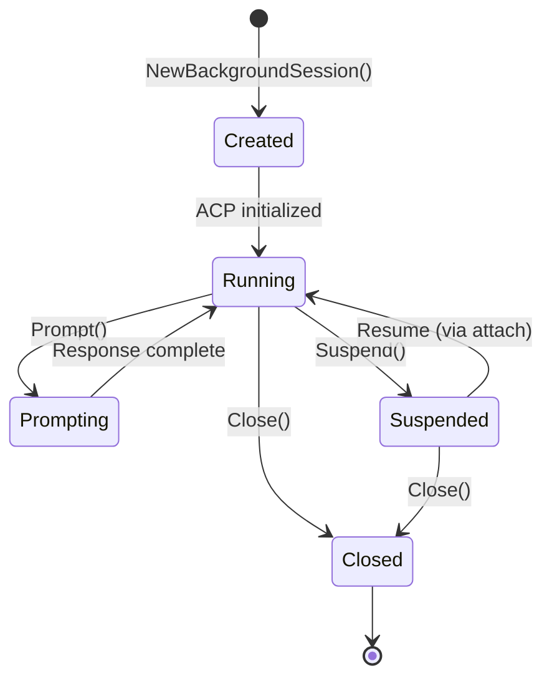
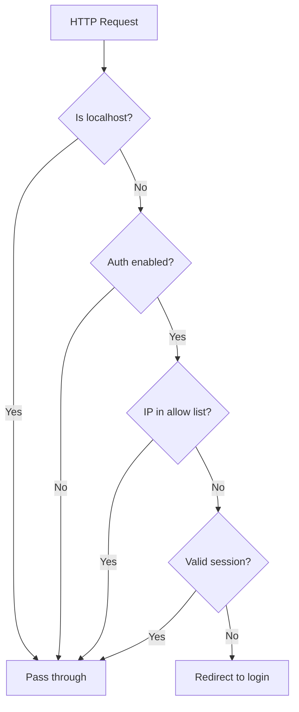

# Web Interface Backend Patterns

## Architecture

The web interface (`mitto web`) provides a browser-based UI via HTTP and WebSocket:

```
Browser ←→ WebSocket ←→ internal/web ←→ ACP Server (stdin/stdout)
                              ↓
                        MarkdownBuffer → HTML conversion
```

## Key Components

| Component | File | Purpose |
|-----------|------|---------|
| `Server` | `server.go` | HTTP server, routing, static files |
| `WSClient` | `websocket.go` | Per-connection WebSocket handler |
| `WebClient` | `client.go` | Implements `acp.Client` with callbacks |
| `MarkdownBuffer` | `markdown.go` | Streaming Markdown→HTML conversion |
| `BackgroundSession` | `background_session.go` | Long-lived ACP session with client attach/detach |
| `SessionManager` | `session_manager.go` | Registry of running background sessions + workspace management |

## WebClient Pattern

```go
// WebClient uses callbacks instead of direct output
client := NewWebClient(WebClientConfig{
    AutoApprove: true,
    OnAgentMessage: func(html string) {
        // Send HTML chunk via WebSocket
        sendMessage(WSMsgTypeAgentMessage, map[string]string{"html": html})
    },
    OnToolCall: func(id, title, status string) {
        sendMessage(WSMsgTypeToolCall, ...)
    },
    OnPermission: func(ctx context.Context, params acp.RequestPermissionRequest) (acp.RequestPermissionResponse, error) {
        // Send to frontend, wait for response
    },
})
```

## Markdown Streaming Buffer

```go
// Buffer accumulates chunks and flushes at semantic boundaries
buffer := NewMarkdownBuffer(func(html string) {
    // Called when HTML is ready to send
})

buffer.Write(chunk)  // Accumulates text
// Auto-flushes on: newline, code block end, paragraph break, timeout (200ms)
buffer.Flush()       // Force flush
buffer.Close()       // Flush and cleanup
```

## WebSocket Message Types

**Frontend → Backend:**
- `new_session` - Create ACP session
- `prompt` - Send user message
- `cancel` - Cancel current operation
- `permission_answer` - Respond to permission request
- `sync_session` - Request events after a sequence number (for mobile wake resync)

**Backend → Frontend:**
- `connected` - Session established
- `agent_message` - HTML content (streaming)
- `agent_thought` - Plain text thinking
- `tool_call` / `tool_update` - Tool status
- `permission` - Permission request
- `prompt_complete` - Response finished (includes `event_count` for sync tracking)
- `session_sync` - Response to sync_session with missed events
- `error` - Error message

## Session Sync Handler

The `handleSyncSession` function in `websocket.go` handles incremental sync requests from mobile clients that may have missed events while sleeping:

```go
// Client sends: {"type": "sync_session", "data": {"session_id": "...", "after_seq": 42}}
func (c *WSClient) handleSyncSession(data json.RawMessage) {
    var req struct {
        SessionID string `json:"session_id"`
        AfterSeq  int    `json:"after_seq"`
    }
    json.Unmarshal(data, &req)

    // Load events from store after the given sequence
    events, err := c.store.GetEventsAfter(req.SessionID, req.AfterSeq)

    // Send back to client
    c.sendMessage("session_sync", map[string]interface{}{
        "events":   events,
        "last_seq": lastSeq,
    })
}
```

The frontend uses this to catch up on missed events when:
1. WebSocket reconnects after phone sleep
2. App becomes visible after being backgrounded

## Background Sessions

The web interface uses `BackgroundSession` to manage ACP sessions that run independently of WebSocket connections:
- Sessions continue running when browser tabs are closed
- Reconnecting to running sessions
- Multiple clients can observe the same session (one active at a time)

### BackgroundSession Lifecycle



### Client Attach/Detach Pattern

```go
// When WebSocket client switches to a session
session.AttachClient(wsClient)

// Client receives real-time updates via callbacks
// session.onAgentMessage -> wsClient.sendMessage()

// When client disconnects or switches sessions
session.DetachClient()
// Session continues running, events still persisted
```

### agentMessageBuffer Pattern

```go
// Accumulates streaming chunks for persistence
type agentMessageBuffer struct {
    text strings.Builder
}

// Write during streaming
buffer.Write(chunk)

// Flush when prompt completes to persist full message
fullText := buffer.Flush()
recorder.RecordAgentMessage(fullText)
```

## External Access & Authentication

### Dual Listener Architecture

The web server supports two listeners:

1. **Localhost listener** (`127.0.0.1:port`): Always running, no auth required
2. **External listener** (`0.0.0.0:port`): Optional, requires authentication

```go
// Start external listener with random port
actualPort, err := server.StartExternalListener(0)

// Start with specific port
actualPort, err := server.StartExternalListener(8443)

// Check status
if server.IsExternalListenerRunning() {
    port := server.GetExternalPort()
}

// Stop external listener
server.StopExternalListener()
```

### Authentication Flow



### AuthManager Key Methods

| Method | Purpose |
|--------|---------|
| `IsEnabled()` | Check if auth is configured |
| `UpdateCredentials(user, pass)` | Set/update credentials |
| `ValidateCredentials(user, pass)` | Check login attempt |
| `CreateSession(username)` | Create authenticated session |
| `GetSessionFromRequest(r)` | Extract session from cookie |
| `AuthMiddleware(next)` | HTTP middleware for auth |

## API Validation Patterns

### Referential Integrity in Config Saves

When saving configuration that involves related entities (workspaces, sessions, servers), validate referential integrity:

```go
// In handleSaveConfig - check if removed workspaces have conversations
currentWorkspaces := s.sessionManager.GetWorkspaces()
newWorkspaceDirs := make(map[string]bool)
for _, ws := range req.Workspaces {
    newWorkspaceDirs[ws.WorkingDir] = true
}

// Find workspaces being removed
for _, ws := range currentWorkspaces {
    if !newWorkspaceDirs[ws.WorkingDir] {
        // Check if sessions use this workspace
        // Return 409 Conflict if in use
    }
}
```

### Error Response Format for Conflicts

```go
// Return structured error for client handling
w.Header().Set("Content-Type", "application/json")
w.WriteHeader(http.StatusConflict)
json.NewEncoder(w).Encode(map[string]interface{}{
    "error":              "workspace_in_use",
    "message":            "Cannot remove workspace: N conversation(s) are using it",
    "workspace":          workingDir,
    "conversation_count": count,
})
```

