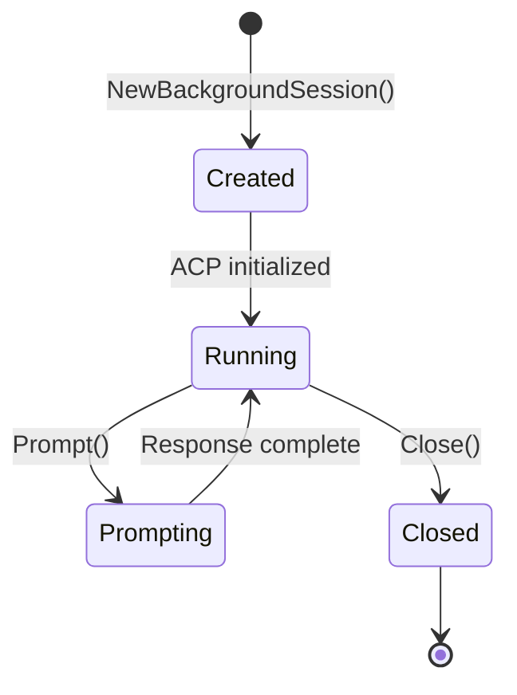

# Web Interface Backend Patterns

## Architecture

The web interface (`mitto web`) provides a browser-based UI via HTTP and WebSocket:

```
Browser ←→ WebSocket ←→ internal/web ←→ ACP Server (stdin/stdout)
                              ↓
                        MarkdownBuffer → HTML conversion
```

## Key Components

| Component | File | Purpose |
|-----------|------|---------|
| `Server` | `server.go` | HTTP server, routing, lifecycle, middleware |
| `SessionWSClient` | `session_ws.go` | Per-session WebSocket handler (implements `SessionObserver`) |
| `GlobalEventsClient` | `events_ws.go` | Global events WebSocket handler (session lifecycle) |
| `WSConn` | `ws_conn.go` | Shared WebSocket connection wrapper (ping/pong, message sending) |
| `WebClient` | `client.go` | Implements `acp.Client` with callbacks |
| `MarkdownBuffer` | `markdown.go` | Streaming Markdown→HTML conversion |
| `BackgroundSession` | `background_session.go` | Long-lived ACP session with observer pattern |
| `SessionManager` | `session_manager.go` | Registry of running background sessions + workspace management |
| Config handlers | `config_handlers.go` | Config API endpoints and validation |
| HTTP helpers | `http_helpers.go` | JSON response helpers (`writeJSON`, `parseJSONBody`, etc.) |
| Title generation | `title.go` | Auto-title generation for sessions |
| External listener | `server_external.go` | External access (0.0.0.0) listener management |
| Static files | `server_static.go` | Static file serving with security headers |
| WS messages | `ws_messages.go` | WebSocket message types and constants |

## File Organization

The `internal/web` package is organized by responsibility:

```
internal/web/
├── server.go              # Core server: struct, NewServer, routes, lifecycle
├── server_external.go     # External listener: Start/Stop, middleware
├── server_static.go       # Static file handler, cache headers
├── session_ws.go          # Per-session WebSocket client
├── events_ws.go           # Global events WebSocket + manager
├── ws_conn.go             # Shared WebSocket connection wrapper
├── ws_messages.go         # Message types, constants, ParseMessage
├── background_session.go  # ACP session with observer pattern
├── session_manager.go     # Session registry + workspace management
├── session_api.go         # REST API for sessions
├── config_handlers.go     # Config API handlers
├── http_helpers.go        # JSON response utilities
├── title.go               # Auto-title generation
├── markdown.go            # Markdown→HTML streaming buffer
├── client.go              # WebClient (acp.Client implementation)
├── auth.go                # Authentication manager
└── csp_nonce.go           # CSP nonce middleware
```

## WebClient Pattern

```go
// WebClient uses callbacks instead of direct output
client := NewWebClient(WebClientConfig{
    AutoApprove: true,
    OnAgentMessage: func(html string) {
        // Send HTML chunk via WebSocket
        sendMessage(WSMsgTypeAgentMessage, map[string]string{"html": html})
    },
    OnToolCall: func(id, title, status string) {
        sendMessage(WSMsgTypeToolCall, ...)
    },
    OnPermission: func(ctx context.Context, params acp.RequestPermissionRequest) (acp.RequestPermissionResponse, error) {
        // Send to frontend, wait for response
    },
})
```

## Markdown Streaming Buffer

```go
// Buffer accumulates chunks and flushes at semantic boundaries
buffer := NewMarkdownBuffer(func(html string) {
    // Called when HTML is ready to send
})

buffer.Write(chunk)  // Accumulates text
// Auto-flushes on: newline, code block end, paragraph break, timeout (200ms)
buffer.Flush()       // Force flush
buffer.Close()       // Flush and cleanup
```

## WebSocket Endpoints

The web interface uses two WebSocket endpoints:

| Endpoint | Handler | Purpose |
|----------|---------|---------|
| `/api/events` | `GlobalEventsClient` | Session lifecycle events (created, deleted, renamed) |
| `/api/sessions/{id}/ws` | `SessionWSClient` | Per-session communication (prompts, responses, tools) |

## WebSocket Message Types

**Frontend → Backend (Session WebSocket):**
- `prompt` - Send user message (includes `prompt_id` for ACK tracking)
- `cancel` - Cancel current operation
- `permission_answer` - Respond to permission request
- `sync_session` - Request events after a sequence number (for mobile wake resync)

**Backend → Frontend (Session WebSocket):**
- `connected` - Session established
- `prompt_received` - ACK that prompt was received and persisted (includes `prompt_id`)
- `user_prompt` - Echo of user's message (for multi-client sync)
- `agent_message` - HTML content (streaming)
- `agent_thought` - Plain text thinking
- `tool_call` / `tool_update` - Tool status
- `permission` - Permission request
- `prompt_complete` - Response finished (includes `event_count` for sync tracking)
- `session_sync` - Response to sync_session with missed events
- `error` - Error message

**Backend → Frontend (Events WebSocket):**
- `connected` - Connection established
- `session_created` - New session created
- `session_deleted` - Session deleted
- `session_renamed` - Session renamed

## Prompt ACK Flow

When the frontend sends a prompt, the backend sends back a `prompt_received` ACK:

```
Frontend                        Backend
    |                               |
    |-- prompt (prompt_id=abc123) ->|
    |                               |-- Persist to session store
    |                               |-- Start ACP processing
    |<-- prompt_received (abc123) --|
    |   [Frontend resolves Promise] |
    |                               |
    |<-- agent_message (streaming) -|
    |<-- prompt_complete -----------|
```

**Benefits:**
1. Frontend knows message was received before connection loss
2. Enables timeout-based retry for mobile reliability
3. Supports multi-client sync (other clients see `user_prompt`)

## Session Sync Handler

The `handleSyncSession` function in `session_ws.go` handles incremental sync requests from mobile clients that may have missed events while sleeping:

```go
// Client sends: {"type": "sync_session", "data": {"session_id": "...", "after_seq": 42}}
func (c *WSClient) handleSyncSession(data json.RawMessage) {
    var req struct {
        SessionID string `json:"session_id"`
        AfterSeq  int    `json:"after_seq"`
    }
    json.Unmarshal(data, &req)

    // Load events from store after the given sequence
    events, err := c.store.GetEventsAfter(req.SessionID, req.AfterSeq)

    // Send back to client
    c.sendMessage("session_sync", map[string]interface{}{
        "events":   events,
        "last_seq": lastSeq,
    })
}
```

The frontend uses this to catch up on missed events when:
1. WebSocket reconnects after phone sleep
2. App becomes visible after being backgrounded

## Background Sessions

The web interface uses `BackgroundSession` to manage ACP sessions that run independently of WebSocket connections:
- Sessions continue running when browser tabs are closed
- Reconnecting to running sessions
- Multiple clients can observe the same session via the observer pattern

### BackgroundSession Lifecycle



### Observer Pattern

`BackgroundSession` uses the observer pattern to notify connected clients:

```go
// SessionWSClient implements SessionObserver
type SessionObserver interface {
    OnAgentMessage(html string)
    OnAgentThought(text string)
    OnToolCall(id, title, status string)
    OnToolUpdate(id string, status *string)
    OnPlan()
    OnFileWrite(path string, size int)
    OnFileRead(path string, size int)
    OnPermission(ctx context.Context, params acp.RequestPermissionRequest) (acp.RequestPermissionResponse, error)
    OnPromptComplete(eventCount int)
    OnError(message string)
    GetClientID() string
}

// Adding/removing observers
bs.AddObserver(client)    // Called when WebSocket connects
bs.RemoveObserver(client) // Called when WebSocket disconnects
```

### agentMessageBuffer Pattern

```go
// Accumulates streaming chunks for persistence
type agentMessageBuffer struct {
    text strings.Builder
}

// Write during streaming
buffer.Write(chunk)

// Flush when prompt completes to persist full message
fullText := buffer.Flush()
recorder.RecordAgentMessage(fullText)
```

## External Access & Authentication

### Dual Listener Architecture

The web server supports two listeners:

1. **Localhost listener** (`127.0.0.1:port`): Always running, no auth required
2. **External listener** (`0.0.0.0:port`): Optional, requires authentication

```go
// Start external listener with random port
actualPort, err := server.StartExternalListener(0)

// Start with specific port
actualPort, err := server.StartExternalListener(8443)

// Check status
if server.IsExternalListenerRunning() {
    port := server.GetExternalPort()
}

// Stop external listener
server.StopExternalListener()
```

### Authentication Flow


### AuthManager Key Methods

| Method | Purpose |
|--------|---------|
| `IsEnabled()` | Check if auth is configured |
| `UpdateCredentials(user, pass)` | Set/update credentials |
| `ValidateCredentials(user, pass)` | Check login attempt |
| `CreateSession(username)` | Create authenticated session |
| `GetSessionFromRequest(r)` | Extract session from cookie |
| `AuthMiddleware(next)` | HTTP middleware for auth |

## Observer Cleanup on WebSocket Disconnect

**Critical**: Always remove observers when WebSocket connections close to prevent:
- Memory leaks from orphaned observers
- Duplicate messages if old observers aren't cleaned up

```go
func (c *SessionWSClient) readPump() {
    defer func() {
        c.cancel()
        if c.bgSession != nil {
            c.bgSession.RemoveObserver(c)  // MUST remove observer
        }
        c.wsConn.ReleaseConnectionSlot()
        c.wsConn.Close()
    }()
    // ... read loop
}
```

### Race Condition Prevention in SessionManager

When creating or resuming sessions, check for duplicates after the lock is reacquired:

```go
func (sm *SessionManager) ResumeSession(sessionID, sessionName, workingDir string) (*BackgroundSession, error) {
    // First check without lock
    if bs := sm.GetSession(sessionID); bs != nil {
        return bs, nil
    }

    sm.mu.Lock()
    // ... prepare session config
    sm.mu.Unlock()

    // Create session (expensive, done without lock)
    bs, err := ResumeBackgroundSession(config)
    if err != nil {
        return nil, err
    }

    sm.mu.Lock()
    // CRITICAL: Check again - another goroutine may have created it
    if existing, ok := sm.sessions[bs.GetSessionID()]; ok {
        sm.mu.Unlock()
        bs.Close("duplicate_session")  // Close the duplicate
        return existing, nil           // Return the existing one
    }
    sm.sessions[bs.GetSessionID()] = bs
    sm.mu.Unlock()

    return bs, nil
}
```

## API Validation Patterns

### Referential Integrity in Config Saves

When saving configuration that involves related entities (workspaces, sessions, servers), validate referential integrity:

```go
// In handleSaveConfig - check if removed workspaces have conversations
currentWorkspaces := s.sessionManager.GetWorkspaces()
newWorkspaceDirs := make(map[string]bool)
for _, ws := range req.Workspaces {
    newWorkspaceDirs[ws.WorkingDir] = true
}

// Find workspaces being removed
for _, ws := range currentWorkspaces {
    if !newWorkspaceDirs[ws.WorkingDir] {
        // Check if sessions use this workspace
        // Return 409 Conflict if in use
    }
}
```

### Error Response Format for Conflicts

Use the HTTP helpers from `http_helpers.go`:

```go
// Use writeJSON for structured responses
writeJSON(w, http.StatusConflict, map[string]interface{}{
    "error":              "workspace_in_use",
    "message":            "Cannot remove workspace: N conversation(s) are using it",
    "workspace":          workingDir,
    "conversation_count": count,
})
```

## HTTP Response Helpers

Use the helpers in `http_helpers.go` for consistent JSON responses:

```go
// Success responses
writeJSONOK(w, data)           // 200 OK with JSON body
writeJSONCreated(w, data)      // 201 Created with JSON body
writeNoContent(w)              // 204 No Content

// Error responses
writeErrorJSON(w, status, errorCode, message)  // JSON error with code
methodNotAllowed(w)            // 405 Method Not Allowed

// Request parsing
if !parseJSONBody(w, r, &req) {
    return  // Error response already sent
}
```

## Structured Logging

Use session-scoped and client-scoped loggers to automatically include context in all log messages:

```go
// In BackgroundSession - logger includes session_id, working_dir, acp_server
bs.logger = logging.WithSessionContext(config.Logger, sessionID, workingDir, acpServer)
bs.logger.Info("Processing prompt")  // Automatically includes all context

// In SessionWSClient - logger includes client_id, session_id
clientLogger := logging.WithClient(s.logger, clientID, sessionID)
clientLogger.Debug("Message received")  // Automatically includes client context
```

**Benefits:**
- No need to manually add `session_id` to every log call
- Consistent context across all log messages for a session
- Easier to filter logs by session or client

## Debugging WebSocket Issues

When debugging duplicate messages or WebSocket issues:

1. **Check observer count**: Log how many observers are attached to a session
2. **Track client IDs**: Each WebSocket connection has a unique `clientID`
3. **Monitor attach/detach**: Log when clients attach and detach from sessions

```go
// With session-scoped logger, context is automatic
func (bs *BackgroundSession) onAgentMessage(html string) {
    observerCount := bs.ObserverCount()
    if bs.logger != nil && observerCount > 1 {
        // session_id, working_dir, acp_server automatically included
        bs.logger.Debug("Notifying multiple observers", "observer_count", observerCount)
    }
    bs.notifyObservers(func(o SessionObserver) {
        o.OnAgentMessage(html)
    })
}
```

## Caching Strategy

### Development Mode: No Caching

During active development, **disable caching for all static assets** to ensure users always get the latest version:

```go
// In staticFileHandler
w.Header().Set("Cache-Control", "no-cache, no-store, must-revalidate")
w.Header().Set("Pragma", "no-cache")
w.Header().Set("Expires", "0")
```

**Why this matters:**
- HTML pages contain injected values (API prefix, CSP nonces) that change per-request
- JS/CSS files change frequently during development
- Cached stale assets cause hard-to-debug issues (like wrong API paths)
- Mobile browsers (especially iOS Safari) aggressively cache assets

### Common Caching Issues

| Symptom | Likely Cause | Solution |
|---------|--------------|----------|
| Wrong API paths in requests | Cached JS with old `window.mittoApiPrefix` | Clear browser cache, add no-cache headers |
| WebSocket connects to wrong URL | Cached HTML with wrong `{{API_PREFIX}}` | Force refresh, check CSP nonce middleware |
| "Connecting to server" forever | Cached frontend, updated backend routes | Clear all browser data |

### External CDN Resources

Resources loaded via `<script src="https://cdn...">` are cached by those CDN servers. We don't control their caching, but this is fine since:
- CDN resources (Tailwind, Preact) are versioned
- They don't contain our injected values

## API Prefix Architecture

### How It Works

The API prefix (`/mitto` by default) provides security through obscurity for external access:

```
1. Server starts with apiPrefix from config (default: "/mitto")
2. All API routes registered at: apiPrefix + "/api/..."
3. HTML served with {{API_PREFIX}} placeholder
4. CSP nonce middleware replaces {{API_PREFIX}} with actual prefix
5. Frontend reads window.mittoApiPrefix for all API/WebSocket URLs
```

### Key Files

| File | Role |
|------|------|
| `server.go` | Registers routes with `apiPrefix+"/api/..."` |
| `csp_nonce.go` | Replaces `{{API_PREFIX}}` in HTML responses |
| `web/static/utils/api.js` | `apiUrl()` and `wsUrl()` use `window.mittoApiPrefix` |
| `web/static/index.html` | Contains `window.mittoApiPrefix = "{{API_PREFIX}}"` |

### Debugging API Prefix Issues

**Symptom**: Requests go to `/api/events` instead of `/mitto/api/events`

**Diagnosis steps:**
1. Check server logs for `api_prefix=/mitto` on startup
2. Add debug logging to frontend `api.js`:
   ```javascript
   console.log('[api.js] window.mittoApiPrefix:', window.mittoApiPrefix);
   ```
3. Check if HTML is being served with replaced prefix (view page source)
4. Clear browser cache (especially on mobile)

**Common causes:**
- Cached HTML/JS with empty or wrong prefix
- CSP nonce middleware not running (check middleware order)
- Tailscale funnel or reverse proxy stripping headers

## Tailscale Funnel & External Access

### Architecture

```
Internet → Tailscale Funnel → Your Machine:port → Mitto Web Server
                                    ↓
                            External Listener (0.0.0.0:port)
```

### Common Issues

| Issue | Symptom | Solution |
|-------|---------|----------|
| Cached assets | Works on simulator, fails on real device | Clear Safari cache on device |
| Different network paths | Requests from different IPs | Check session cookies are valid for both paths |
| WebSocket upgrade fails | "Connecting to server" forever | Check Origin header validation |

### Debugging External Access

1. **Check client IP in logs**: Different IPs may indicate different network paths
   ```
   client_ip=207.188.187.48  → Funnel (public IP)
   client_ip=100.125.125.40  → Internal Tailscale
   ```

2. **Verify all requests use correct prefix**: Look for requests without `/mitto` prefix

3. **Check WebSocket Origin validation**:
   ```go
   logger.Info("WS: Origin check", "origin", origin, "host", host, "allowed", allowed)
   ```

### Mobile Safari Specifics

- **Aggressive caching**: Always test with cache cleared or Private Browsing
- **WebSocket zombie connections**: Connections may appear open but be dead after sleep
- **Cookie handling**: Cookies may not be shared between different network paths

## Security Headers

### Content Security Policy (CSP)

CSP headers are set by `cspNonceMiddleware` with per-request nonces:

```go
csp := "default-src 'self'; " +
    "script-src 'self' 'nonce-" + nonce + "' https://cdn.tailwindcss.com; " +
    "style-src 'self' 'unsafe-inline' https://fonts.googleapis.com; " +
    "connect-src 'self' ws: wss:; " +  // Allow WebSocket connections
    // ...
```

### Middleware Order

The order of middleware wrapping is critical:

```go
// Inside out: request flows through these in reverse order
handler = hideServerInfoMiddleware(handler)           // 6. Outermost
handler = cspNonceMiddlewareWithOptions(...)(handler) // 5. CSP + API prefix injection
handler = securityHeadersMiddleware(...)(handler)     // 4. Security headers
handler = rateLimitMiddleware(...)(handler)           // 3. Rate limiting
handler = csrfMgr.CSRFMiddleware(handler)             // 2. CSRF protection
handler = authMgr.AuthMiddleware(mux)                 // 1. Authentication
```

