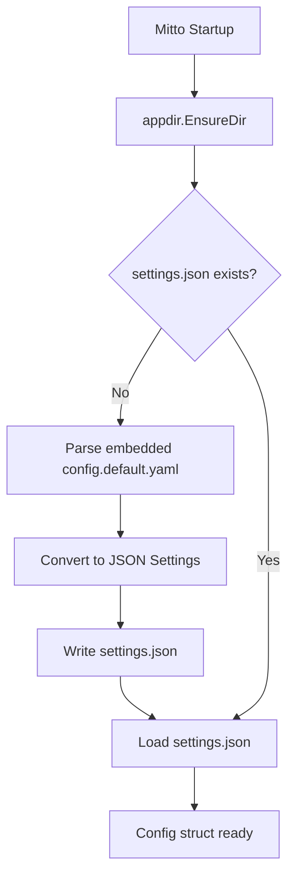

# Configuration System

## Overview

Mitto uses a two-tier configuration system:

1. **Default configuration** (`config/config.default.yaml`): Embedded in binary, used to bootstrap `settings.json`
2. **User settings** (`MITTO_DIR/settings.json`): JSON file with user's configuration, auto-created on first run

## Configuration Flow



## Configuration Formats

**YAML format** (for `--config` flag or legacy `.mittorc`):
```yaml
acp:
  - auggie:
      command: auggie --acp
  - claude-code:
      command: npx -y @zed-industries/claude-code-acp@latest
web:
  host: 127.0.0.1
  port: 8080
  theme: v2
```

**JSON format** (for `settings.json` or `--config` flag):
```json
{
  "acp_servers": [
    {"name": "auggie", "command": "auggie --acp"},
    {"name": "claude-code", "command": "npx -y @zed-industries/claude-code-acp@latest"}
  ],
  "web": {
    "host": "127.0.0.1",
    "port": 8080,
    "theme": "v2"
  }
}
```

## Config Package Functions

| Function | Purpose |
|----------|---------|
| `LoadSettings()` | Load from `settings.json`, create from defaults if missing |
| `Load(path)` | Load from specific file (YAML or JSON by extension) |
| `Parse(data)` | Parse YAML configuration data |
| `ParseJSON(data)` | Parse JSON configuration data |
| `SaveSettings(settings)` | Save settings to `settings.json` |
| `ConfigToSettings(cfg)` | Convert Config to Settings for JSON serialization |

## Settings vs Config Types

```go
// Config - internal representation (used throughout codebase)
type Config struct {
    ACPServers []ACPServer
    Web        WebConfig
    UI         UIConfig
}

// Settings - JSON serialization format (stored in settings.json)
type Settings struct {
    ACPServers []ACPServerSettings `json:"acp_servers"`
    Web        WebConfig           `json:"web"`
    UI         UIConfig            `json:"ui,omitempty"`
}

// Conversion
settings := ConfigToSettings(cfg)  // Config → Settings
cfg := settings.ToConfig()          // Settings → Config
```

## Embedded Default Configuration

The `config/` directory contains the embedded default configuration:

```
config/
├── config.default.yaml   # Default YAML configuration
└── embed.go              # go:embed directive
```

```go
// config/embed.go
//go:embed config.default.yaml
var DefaultConfigYAML []byte
```

## Workspace Persistence

Workspaces can be persisted to `workspaces.json` in the Mitto data directory.

### Persistence Rules

| Startup Mode | Source | Persistence |
|--------------|--------|-------------|
| CLI with `--dir` flags | CLI flags | NOT saved (fromCLI=true) |
| CLI without `--dir` flags | `workspaces.json` | Saved on changes |
| macOS app | `workspaces.json` | Saved on changes |

### Workspace File Format

```json
{
  "workspaces": [
    {
      "acp_server": "auggie",
      "acp_command": "auggie --acp",
      "working_dir": "/path/to/project1"
    }
  ]
}
```

### WorkspaceConfig Type

```go
// WorkspaceConfig represents an ACP server + working directory pair.
type WorkspaceConfig struct {
    ACPServer  string `json:"acp_server"`   // Name of the ACP server
    ACPCommand string `json:"acp_command"`  // Shell command to start the server
    WorkingDir string `json:"working_dir"`  // Absolute path to working directory
}

// WorkspaceID returns a unique identifier (currently the working directory)
func (w *WorkspaceConfig) WorkspaceID() string
```

### SessionManager Workspace Methods

| Method | Purpose |
|--------|---------|
| `GetWorkspaces()` | Returns all configured workspaces |
| `GetWorkspace(workingDir)` | Returns workspace for a specific directory |
| `GetDefaultWorkspace()` | Returns the first (default) workspace |
| `AddWorkspace(ws)` | Dynamically adds a new workspace at runtime |
| `RemoveWorkspace(workingDir)` | Removes a workspace by directory path |

### Workspace REST API

**GET /api/workspaces** - List workspaces and available ACP servers

**POST /api/workspaces** - Add a new workspace
```json
{"working_dir": "/path/to/new/project", "acp_server": "auggie"}
```

**DELETE /api/workspaces?dir=/path/to/project** - Remove a workspace

### External Port Configuration

```json
{
  "web": {
    "external_port": 0,  // 0 = random port
    "auth": {
      "username": "admin",
      "password_hash": "..."  // bcrypt hash
    }
  }
}
```

