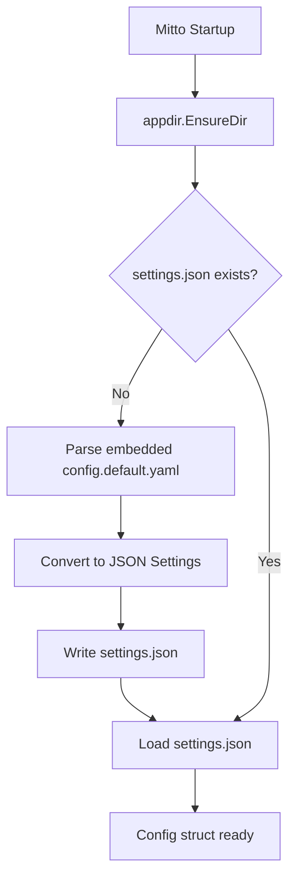
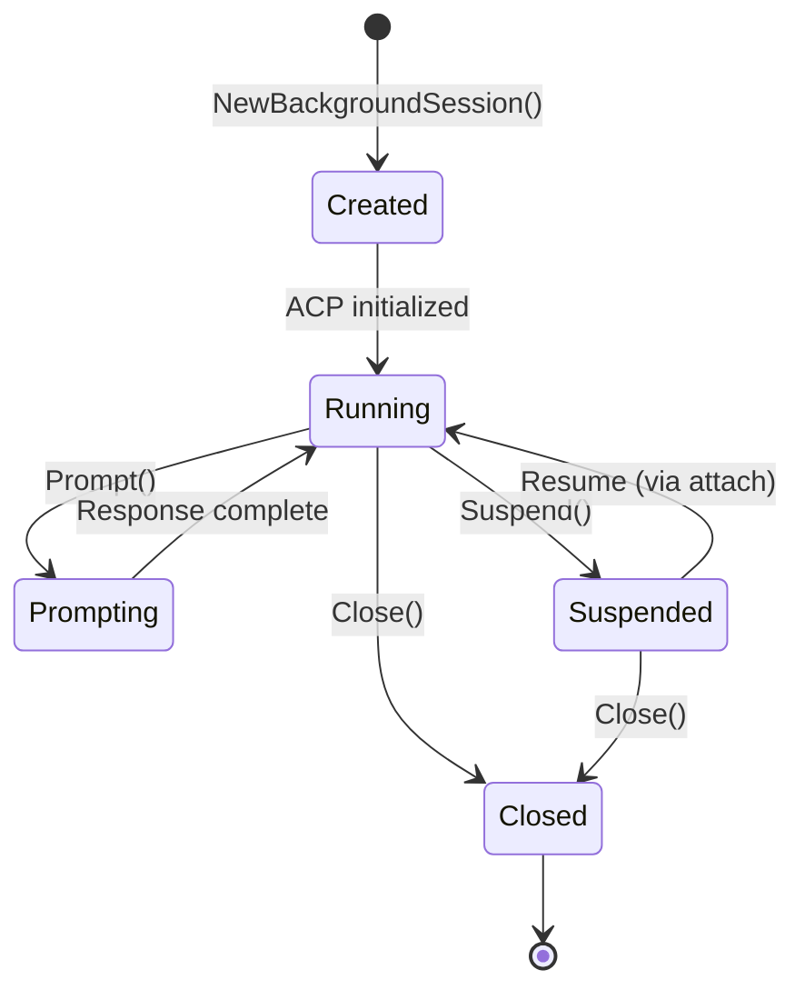

# Mitto Project Rules

## Project Overview

Mitto is a CLI client for the Agent Communication Protocol (ACP). It enables terminal-based interaction with AI coding agents like Auggie and Claude Code.

**Key documentation**: See `docs/architecture.md` for comprehensive architecture details.

## Package Structure

```
cmd/mitto/          → Entry point only (minimal code)
cmd/mitto-app/      → macOS native app entry point (WebView wrapper)
config/             → Embedded default configuration (config.default.yaml)
internal/cmd/       → CLI commands (Cobra-based)
internal/acp/       → ACP protocol client (SDK wrapper)
internal/appdir/    → Platform-native directory management (MITTO_DIR)
internal/auxiliary/ → Hidden auxiliary ACP session for utility tasks (title generation)
internal/config/    → Configuration loading (YAML/JSON) and settings persistence
internal/fileutil/  → Shared JSON file I/O utilities
internal/session/   → Session persistence (Store/Recorder/Player/Lock)
internal/web/       → Web interface server (HTTP, WebSocket, Markdown)
platform/mac/       → macOS app resources (Info.plist, icons, scripts)
web/                → Embedded frontend assets (HTML, JS, CSS)
```

### Separation of Concerns

- **Never** import `internal/cmd` from other internal packages
- **Never** import CLI-specific code (readline, cobra) in `internal/acp`, `internal/session`, or `internal/web`
- The `acp` package uses callback functions (`output func(string)`) for UI independence
- The `web` package implements its own `acp.Client` (`WebClient`) with callback-based streaming
- Session package is completely independent of ACP, CLI, and Web

## Go Conventions

### Error Handling

```go
// Always wrap errors with context
if err != nil {
    return fmt.Errorf("failed to read config file %s: %w", path, err)
}

// Define package-level sentinel errors for expected conditions
var (
    ErrSessionNotFound = errors.New("session not found")
    ErrSessionLocked   = errors.New("session is locked by another process")
)

// Return sentinel errors, don't wrap them
if !exists {
    return ErrSessionNotFound  // NOT: fmt.Errorf("...: %w", ErrSessionNotFound)
}
```

### Interface Compliance

```go
// Verify interface implementation at compile time
var _ acp.Client = (*Client)(nil)
```

### Constructor Pattern

```go
// Use New* functions that return pointers
func NewStore(baseDir string) (*Store, error) { ... }
func NewRecorder(store *Store) *Recorder { ... }

// Use New*WithX for alternative constructors
func NewRecorderWithID(store *Store, sessionID string) *Recorder { ... }
```

### Thread Safety

```go
type Store struct {
    mu     sync.RWMutex  // Protect shared state
    closed bool
}

func (s *Store) SomeMethod() error {
    s.mu.Lock()
    defer s.mu.Unlock()
    
    if s.closed {
        return ErrStoreClosed
    }
    // ...
}
```

## Session Package Patterns

### Component Responsibilities

| Component | Responsibility | Thread-Safe |
|-----------|---------------|-------------|
| `Store` | Low-level file I/O, CRUD operations | Yes (mutex) |
| `Recorder` | High-level recording API, session lifecycle | Yes (mutex) |
| `Player` | Read-only playback, navigation | No (single-user) |
| `Lock` | Session locking, heartbeat, cleanup | Yes (mutex + goroutine) |

### Lock Management

```go
// Always register locks for cleanup on exit
lock := &Lock{...}
registerLock(lock)      // In acquireLock()
defer unregisterLock(l) // In Release()

// Update lock status during operations
lock.SetProcessing("Agent thinking...")  // Before prompt
lock.SetIdle()                           // After response
lock.SetWaitingPermission("File write")  // During permission request
```

### File Formats

- **events.jsonl**: Append-only, one JSON object per line
- **metadata.json**: Pretty-printed JSON, updated on each event
- **.lock**: Pretty-printed JSON, updated every 10 seconds (heartbeat)

### Atomic File Writes

```go
// Write to temp file, sync, then rename
tmpPath := path + ".tmp"
os.WriteFile(tmpPath, data, 0644)
f, _ := os.Open(tmpPath)
f.Sync()
f.Close()
os.Rename(tmpPath, path)
```

### Lock Cleanup

The session package has a global lock registry that handles cleanup on process termination:

```go
// Cleanup functions in cleanup.go
registerLock(lock)      // Called when lock is acquired
unregisterLock(lock)    // Called when lock is released
CleanupAllLocks()       // Called on graceful shutdown
ActiveLockCount()       // Returns number of active locks

// Automatic cleanup on signals (SIGINT, SIGTERM, SIGHUP)
// Started on first lock registration
```

### PID Checking

```go
// Check if a process is still running (Unix)
func isPIDRunning(pid int) bool {
    process, _ := os.FindProcess(pid)
    return process.Signal(syscall.Signal(0)) == nil
}
```

## CLI UX Patterns

### Cobra Command Structure

```go
var cliCmd = &cobra.Command{
    Use:   "cli",
    Short: "One-line description",
    Long:  `Multi-line description with examples...`,
    RunE:  runCLI,  // Use RunE for error returns
}

func init() {
    rootCmd.AddCommand(cliCmd)
    cliCmd.Flags().StringVar(&flagVar, "flag", "", "Description")
}
```

### User Feedback

```go
// Use emoji prefixes for visual clarity
fmt.Printf("🚀 Starting ACP server: %s\n", server.Name)
fmt.Printf("✅ Connected (protocol v%v)\n", version)
fmt.Printf("🔐 Permission requested: %s\n", title)
fmt.Println("👋 Shutting down...")

// Suppress noise in non-interactive mode
if !isOnceMode || debug {
    fmt.Printf("🚀 Starting...\n")
}
```

### Signal Handling

```go
sigChan := make(chan os.Signal, 1)
signal.Notify(sigChan, syscall.SIGINT, syscall.SIGTERM)
go func() {
    <-sigChan
    cancel()  // Cancel context
}()
```

## ACP Protocol Guidelines

### SDK Usage

- Import: `github.com/coder/acp-go-sdk`
- The `Client` struct implements `acp.Client` interface
- Use `acp.ClientSideConnection` for protocol handling
- Always pass context for cancellation support

### Connection Lifecycle

```go
conn, err := acp.NewConnection(ctx, command, autoApprove, output, logger)
defer conn.Close()

conn.Initialize(ctx)  // Protocol handshake
conn.NewSession(ctx, cwd)  // Create session
conn.Prompt(ctx, message)  // Send prompt
```

### Permission Handling

- Check `autoApprove` flag first
- Prefer "allow" options when auto-approving
- Display numbered options for manual selection
- Loop until valid input received

## Web Interface Patterns

### Architecture

The web interface (`mitto web`) provides a browser-based UI via HTTP and WebSocket:

```
Browser ←→ WebSocket ←→ internal/web ←→ ACP Server (stdin/stdout)
                              ↓
                        MarkdownBuffer → HTML conversion
```

### Key Components

| Component | File | Purpose |
|-----------|------|---------|
| `Server` | `server.go` | HTTP server, routing, static files |
| `WSClient` | `websocket.go` | Per-connection WebSocket handler |
| `WebClient` | `client.go` | Implements `acp.Client` with callbacks |
| `MarkdownBuffer` | `markdown.go` | Streaming Markdown→HTML conversion |

### WebClient Pattern

```go
// WebClient uses callbacks instead of direct output
client := NewWebClient(WebClientConfig{
    AutoApprove: true,
    OnAgentMessage: func(html string) {
        // Send HTML chunk via WebSocket
        sendMessage(WSMsgTypeAgentMessage, map[string]string{"html": html})
    },
    OnToolCall: func(id, title, status string) {
        sendMessage(WSMsgTypeToolCall, ...)
    },
    OnPermission: func(ctx context.Context, params acp.RequestPermissionRequest) (acp.RequestPermissionResponse, error) {
        // Send to frontend, wait for response
    },
})
```

### Markdown Streaming Buffer

```go
// Buffer accumulates chunks and flushes at semantic boundaries
buffer := NewMarkdownBuffer(func(html string) {
    // Called when HTML is ready to send
})

buffer.Write(chunk)  // Accumulates text
// Auto-flushes on: newline, code block end, paragraph break, timeout (200ms)
buffer.Flush()       // Force flush
buffer.Close()       // Flush and cleanup
```

### WebSocket Message Types

**Frontend → Backend:**
- `new_session` - Create ACP session
- `prompt` - Send user message
- `cancel` - Cancel current operation
- `permission_answer` - Respond to permission request

**Backend → Frontend:**
- `connected` - Session established
- `agent_message` - HTML content (streaming)
- `agent_thought` - Plain text thinking
- `tool_call` / `tool_update` - Tool status
- `permission` - Permission request
- `prompt_complete` - Response finished
- `error` - Error message

### Frontend Technology

- **No build step**: Preact + HTM loaded from CDN (esm.sh)
- **Styling**: Tailwind CSS via Play CDN
- **Embedding**: `go:embed` directive in `web/embed.go`
- **Single binary**: All assets embedded in Go binary

### Frontend Component Structure

```
App
├── SessionList (sidebar, hidden on mobile)
├── Header (connection status, streaming indicator)
├── MessageList
│   └── Message (user/agent/thought/tool/error/system)
└── ChatInput (textarea + send/cancel)
```

### Frontend State Management Patterns

**Use refs for values accessed in callbacks to avoid stale closures:**

```javascript
// Problem: activeSessionId in useCallback captures stale value
const handleMessage = useCallback((msg) => {
    // activeSessionId here is stale - it was captured when callback was created
    if (!activeSessionId) return;  // BUG: always null on first messages!
}, [activeSessionId]);

// Solution: Use a ref that's always current
const activeSessionIdRef = useRef(activeSessionId);
useEffect(() => {
    activeSessionIdRef.current = activeSessionId;
}, [activeSessionId]);

const handleMessage = useCallback((msg) => {
    const currentSessionId = activeSessionIdRef.current;  // Always current!
    if (!currentSessionId) return;
}, []);  // No dependency on activeSessionId
```

**Race condition pattern in WebSocket handlers:**
- WebSocket messages can arrive before React state updates complete
- Session switching: `session_switched` sets `activeSessionId`, but `agent_message` may arrive first
- Always use refs for state that callbacks need to read during async operations

**Function definition order in hooks:**
- `useCallback` functions must be defined before they're used in dependency arrays
- If function A uses function B, define B before A
- Circular dependencies require refs to break the cycle

### CDN Selection for Frontend Libraries

**Recommended CDN for ES modules**: Skypack (`cdn.skypack.dev`)
- Handles internal module resolution correctly
- Works with Preact hooks imports

**Avoid for ES modules**:
- `unpkg.com` and `jsdelivr.net` - May fail with "Failed to resolve module specifier" errors
  when libraries have internal imports without full paths
- `esm.sh` - Generally works but may have availability issues

```html
<!-- Recommended -->
<script type="module">
    import { h, render } from 'https://cdn.skypack.dev/preact@10.19.3';
    import { useState, useEffect } from 'https://cdn.skypack.dev/preact@10.19.3/hooks';
    import htm from 'https://cdn.skypack.dev/htm@3.1.1';
</script>
```

## Testing Requirements

### Unit Test Coverage

- All public functions should have tests
- Test both success and error paths
- Use `t.TempDir()` for file-based tests
- Use table-driven tests for multiple scenarios

```go
func TestSomething(t *testing.T) {
    tmpDir := t.TempDir()
    store, err := NewStore(tmpDir)
    if err != nil {
        t.Fatalf("NewStore failed: %v", err)
    }
    defer store.Close()
    // ...
}
```

### Test Naming

```go
func TestStore_CreateAndGet(t *testing.T) { ... }
func TestLock_ForceAcquireIdle(t *testing.T) { ... }
func TestLockInfo_StealabilityReason(t *testing.T) { ... }
```

### Integration Tests

- Located in `tests/integration/`
- Bash scripts with `#!/bin/bash` and `set -e`
- Check prerequisites before running
- Use timeouts to detect hangs
- Print clear PASS/FAIL messages

## Documentation Standards

### Code Comments

```go
// Package session provides session persistence and management for Mitto.
package session

// Store provides session persistence operations.
// It is safe for concurrent use.
type Store struct { ... }

// TryAcquireLock attempts to acquire a lock on the session.
// Returns ErrSessionLocked if the session is locked by another active process.
func (s *Store) TryAcquireLock(...) (*Lock, error) { ... }
```

### Architecture Updates

When adding new features:
1. Update `docs/architecture.md` with new components
2. Add Mermaid diagrams for complex flows
3. Document design decisions and rationale

## Common Pitfalls

### Deadlocks

```go
// WRONG: Calling method that acquires lock while holding lock
func (r *Recorder) Start() error {
    r.mu.Lock()
    defer r.mu.Unlock()
    r.recordEvent(...)  // recordEvent also locks r.mu!
}

// RIGHT: Call store directly or release lock first
func (r *Recorder) Start() error {
    r.mu.Lock()
    defer r.mu.Unlock()
    r.store.AppendEvent(...)  // Store has its own lock
}
```

### Resource Cleanup

```go
// Always use defer for cleanup
lock, err := store.TryAcquireLock(sessionID, "cli")
if err != nil {
    return err
}
defer lock.Release()

// Register for signal-based cleanup
registerLock(lock)  // Automatic cleanup on SIGINT/SIGTERM
```

### Context Propagation

```go
// Always pass context through the call chain
func (c *Connection) Prompt(ctx context.Context, message string) error {
    return c.conn.Prompt(ctx, acp.PromptRequest{...})
}
```

## Auxiliary Package

The `internal/auxiliary` package provides a hidden ACP session for utility tasks like title generation. It runs independently of the main session.

### Components

| Component | File | Purpose |
|-----------|------|---------|
| `Manager` | `manager.go` | Manages lazy-started auxiliary ACP session |
| `auxiliaryClient` | `client.go` | Implements `acp.Client` that collects responses |
| Global functions | `global.go` | Package-level singleton for easy access |

### Usage Pattern

```go
// Initialize once at startup
auxiliary.Initialize(acpCommand, logger)

// Use anywhere in the app
title, err := auxiliary.GenerateTitle(ctx, userMessage)

// Shutdown on exit
auxiliary.Shutdown()
```

### Key Characteristics

- **Lazy initialization**: ACP process starts only on first request
- **Auto-approve all permissions**: Never blocks on permission dialogs
- **File writes denied**: Prevents accidental file modifications
- **Thread-safe**: Multiple goroutines can call `Prompt()` (serialized internally)
- **Response collection**: Buffers `AgentMessageChunk` events into a single response string

## Fileutil Package

The `internal/fileutil` package provides shared JSON file I/O utilities used by session and other packages.

### Functions

| Function | Purpose |
|----------|---------|
| `ReadJSON(path, v)` | Read and unmarshal JSON file |
| `WriteJSON(path, v, perm)` | Write JSON with pretty-printing (simple) |
| `WriteJSONAtomic(path, v, perm)` | Write JSON atomically (temp file + sync + rename) |

### Usage

```go
// Simple read
var meta Metadata
if err := fileutil.ReadJSON(metaPath, &meta); err != nil {
    return err
}

// Atomic write (recommended for important data)
if err := fileutil.WriteJSONAtomic(metaPath, &meta, 0644); err != nil {
    return err
}
```

## Appdir Package

The `internal/appdir` package provides platform-native directory management for Mitto's data directory.

### Mitto Data Directory

The Mitto data directory stores configuration (`settings.json`), workspaces (`workspaces.json`), and session data (`sessions/` subdirectory).

**Directory locations (in priority order):**
1. `MITTO_DIR` environment variable (if set)
2. Platform-specific default:
   - **macOS**: `~/Library/Application Support/Mitto`
   - **Linux**: `$XDG_DATA_HOME/mitto` or `~/.local/share/mitto`
   - **Windows**: `%APPDATA%\Mitto`

### Functions

| Function | Purpose |
|----------|---------|
| `Dir()` | Returns the Mitto data directory path (cached) |
| `EnsureDir()` | Creates the Mitto directory and sessions subdirectory if needed |
| `SettingsPath()` | Returns path to `settings.json` |
| `WorkspacesPath()` | Returns path to `workspaces.json` |
| `SessionsDir()` | Returns path to `sessions/` subdirectory |
| `ResetCache()` | Clears cached directory (for testing) |

### Usage Pattern

```go
// At startup (CLI or Mac app)
if err := appdir.EnsureDir(); err != nil {
    return fmt.Errorf("failed to create Mitto directory: %w", err)
}

// Get paths
settingsPath, _ := appdir.SettingsPath()    // ~/Library/Application Support/Mitto/settings.json
workspacesPath, _ := appdir.WorkspacesPath() // ~/Library/Application Support/Mitto/workspaces.json
sessionsDir, _ := appdir.SessionsDir()       // ~/Library/Application Support/Mitto/sessions
```

### Directory Structure

```
~/Library/Application Support/Mitto/    # (or platform equivalent)
├── settings.json                        # User configuration (JSON)
├── workspaces.json                      # Workspace configuration (JSON, optional)
└── sessions/                            # Session data
    ├── 20260125-143052-a1b2c3d4/
    │   ├── events.jsonl
    │   └── metadata.json
    └── ...
```

## Configuration System

### Overview

Mitto uses a two-tier configuration system:

1. **Default configuration** (`config/config.default.yaml`): Embedded in binary, used to bootstrap `settings.json`
2. **User settings** (`MITTO_DIR/settings.json`): JSON file with user's configuration, auto-created on first run

### Configuration Flow



### Configuration Formats

**YAML format** (for `--config` flag or legacy `.mittorc`):
```yaml
acp:
  - auggie:
      command: auggie --acp
  - claude-code:
      command: npx -y @zed-industries/claude-code-acp@latest
web:
  host: 127.0.0.1
  port: 8080
  theme: v2
```

**JSON format** (for `settings.json` or `--config` flag):
```json
{
  "acp_servers": [
    {"name": "auggie", "command": "auggie --acp"},
    {"name": "claude-code", "command": "npx -y @zed-industries/claude-code-acp@latest"}
  ],
  "web": {
    "host": "127.0.0.1",
    "port": 8080,
    "theme": "v2"
  }
}
```

### CLI Configuration Loading

```bash
# Default: Load from MITTO_DIR/settings.json (auto-creates if missing)
mitto cli

# Override with specific config file (YAML or JSON, detected by extension)
mitto cli --config /path/to/config.yaml
mitto cli --config /path/to/config.json
```

### Config Package Functions

| Function | Purpose |
|----------|---------|
| `LoadSettings()` | Load from `settings.json`, create from defaults if missing |
| `Load(path)` | Load from specific file (YAML or JSON by extension) |
| `Parse(data)` | Parse YAML configuration data |
| `ParseJSON(data)` | Parse JSON configuration data |
| `SaveSettings(settings)` | Save settings to `settings.json` |
| `ConfigToSettings(cfg)` | Convert Config to Settings for JSON serialization |

### Settings vs Config Types

```go
// Config - internal representation (used throughout codebase)
type Config struct {
    ACPServers []ACPServer
    Web        WebConfig
    UI         UIConfig
}

// Settings - JSON serialization format (stored in settings.json)
type Settings struct {
    ACPServers []ACPServerSettings `json:"acp_servers"`
    Web        WebConfig           `json:"web"`
    UI         UIConfig            `json:"ui,omitempty"`
}

// Conversion
settings := ConfigToSettings(cfg)  // Config → Settings
cfg := settings.ToConfig()          // Settings → Config
```

### Embedded Default Configuration

The `config/` directory contains the embedded default configuration:

```
config/
├── config.default.yaml   # Default YAML configuration
└── embed.go              # go:embed directive
```

```go
// config/embed.go
//go:embed config.default.yaml
var DefaultConfigYAML []byte
```

## Workspace Persistence

Workspaces can be persisted to `workspaces.json` in the Mitto data directory. This is primarily used by the macOS app where users manage workspaces via the UI.

### Persistence Rules

| Startup Mode | Source | Persistence |
|--------------|--------|-------------|
| CLI with `--dir` flags | CLI flags | NOT saved (fromCLI=true) |
| CLI without `--dir` flags | `workspaces.json` | Saved on changes |
| macOS app | `workspaces.json` | Saved on changes |

### Workspace File Format

```json
{
  "workspaces": [
    {
      "acp_server": "auggie",
      "acp_command": "auggie --acp",
      "working_dir": "/path/to/project1"
    },
    {
      "acp_server": "claude-code",
      "acp_command": "npx -y @zed-industries/claude-code-acp@latest",
      "working_dir": "/path/to/project2"
    }
  ]
}
```

### SessionManager Options

```go
// SessionManagerOptions controls workspace behavior
type SessionManagerOptions struct {
    Workspaces      []WorkspaceConfig
    AutoApprove     bool
    Logger          *slog.Logger
    FromCLI         bool              // If true, changes are NOT persisted
    OnWorkspaceSave WorkspaceSaveFunc // Called when workspaces change (if !FromCLI)
}

// Create with persistence
sm := NewSessionManagerWithOptions(SessionManagerOptions{
    Workspaces:      loadedWorkspaces,
    FromCLI:         false,
    OnWorkspaceSave: func(ws []WorkspaceConfig) error {
        return config.SaveWorkspaces(convertToSettings(ws))
    },
})
```

### Config Package Functions

| Function | Purpose |
|----------|---------|
| `LoadWorkspaces()` | Load from `workspaces.json`, returns nil if file doesn't exist |
| `SaveWorkspaces(ws)` | Save workspaces to `workspaces.json` |
| `WorkspacesPath()` | Returns path to `workspaces.json` |

### Frontend Behavior

When no workspaces are configured:
1. The Settings dialog opens automatically with `forceOpen=true`
2. The dialog cannot be closed until at least one workspace is added
3. An error message is shown if the user tries to close without workspaces

## Multi-Workspace Support

The web interface supports multiple workspaces, where each workspace pairs a directory with an ACP server. This allows running different ACP servers for different projects simultaneously.

### CLI Usage

```bash
# Single workspace (default)
mitto web

# Multiple workspaces with --dir flag
mitto web --dir /path/to/project1 --dir /path/to/project2

# Specify ACP server per workspace (server:path syntax)
mitto web --dir auggie:/path/to/project1 --dir claude-code:/path/to/project2

# Mix default and explicit servers
mitto web --dir /path/to/project1 --dir claude-code:/path/to/project2
```

### WorkspaceConfig Type

```go
// WorkspaceConfig represents an ACP server + working directory pair.
type WorkspaceConfig struct {
    ACPServer  string `json:"acp_server"`   // Name of the ACP server
    ACPCommand string `json:"acp_command"`  // Shell command to start the server
    WorkingDir string `json:"working_dir"`  // Absolute path to working directory
}

// WorkspaceID returns a unique identifier (currently the working directory)
func (w *WorkspaceConfig) WorkspaceID() string
```

### SessionManager Workspace Methods

| Method | Purpose |
|--------|---------|
| `GetWorkspaces()` | Returns all configured workspaces |
| `GetWorkspace(workingDir)` | Returns workspace for a specific directory |
| `GetDefaultWorkspace()` | Returns the first (default) workspace |
| `AddWorkspace(ws)` | Dynamically adds a new workspace at runtime |
| `RemoveWorkspace(workingDir)` | Removes a workspace by directory path |

### Workspace REST API

**GET /api/workspaces** - List workspaces and available ACP servers

```json
{
  "workspaces": [
    {"acp_server": "auggie", "acp_command": "auggie --acp", "working_dir": "/path/to/project1"},
    {"acp_server": "claude-code", "acp_command": "npx ...", "working_dir": "/path/to/project2"}
  ],
  "acp_servers": [
    {"name": "auggie", "command": "auggie --acp"},
    {"name": "claude-code", "command": "npx -y @zed-industries/claude-code-acp@latest"}
  ]
}
```

**POST /api/workspaces** - Add a new workspace

```json
// Request
{"working_dir": "/path/to/new/project", "acp_server": "auggie"}

// Response (201 Created)
{"acp_server": "auggie", "acp_command": "auggie --acp", "working_dir": "/path/to/new/project"}
```

**DELETE /api/workspaces?dir=/path/to/project** - Remove a workspace

Returns 204 No Content on success.

### Frontend Components

| Component | Purpose |
|-----------|---------|
| `WorkspaceDialog` | Modal for selecting workspace when creating new session |
| `WorkspaceConfigDialog` | Modal for viewing/adding/removing workspaces (folder icon in sidebar) |
| `SessionPropertiesDialog` | Shows session name (editable) and workspace info (read-only) |

## Web Package Advanced Patterns

### Background Sessions

The web interface uses `BackgroundSession` to manage ACP sessions that run independently of WebSocket connections. This allows:
- Sessions to continue running when browser tabs are closed
- Reconnecting to running sessions
- Multiple clients to observe the same session (one active at a time)

### Key Components (Extended)

| Component | File | Purpose |
|-----------|------|---------|
| `BackgroundSession` | `background_session.go` | Long-lived ACP session with client attach/detach |
| `SessionManager` | `session_manager.go` | Registry of running background sessions + workspace management |
| `agentMessageBuffer` | `websocket.go` | Buffers agent message chunks for persistence |
| `WorkspaceConfig` | `workspace.go` | ACP server + directory pair configuration |

### BackgroundSession Lifecycle



### Client Attach/Detach Pattern

```go
// When WebSocket client switches to a session
session.AttachClient(wsClient)

// Client receives real-time updates via callbacks
// session.onAgentMessage -> wsClient.sendMessage()

// When client disconnects or switches sessions
session.DetachClient()
// Session continues running, events still persisted
```

### agentMessageBuffer Pattern

```go
// Accumulates streaming chunks for persistence
type agentMessageBuffer struct {
    text strings.Builder
}

// Write during streaming
buffer.Write(chunk)

// Flush when prompt completes to persist full message
fullText := buffer.Flush()
recorder.RecordAgentMessage(fullText)
```

## Frontend Library Organization

### File Structure

| File | Purpose |
|------|---------|
| `app.js` | Main Preact application, components, state management |
| `lib.js` | Pure utility functions (testable without DOM) |
| `lib.test.js` | Jest tests for lib.js |
| `styles.css` | Custom CSS for Markdown rendering |
| `index.html` | HTML shell, CDN imports, Tailwind config |

### lib.js Functions

The library provides pure functions for state manipulation:

| Function | Purpose |
|----------|---------|
| `computeAllSessions()` | Merge active + stored sessions, sort by time |
| `convertEventsToMessages()` | Transform stored events to display messages |
| `createSessionState()` | Create new session state object |
| `addMessageToSessionState()` | Add message with automatic trimming |
| `updateLastMessageInSession()` | Immutably update last message |
| `removeSessionFromState()` | Remove session and determine next active |
| `limitMessages()` | Enforce MAX_MESSAGES limit |

### Memory Management

```javascript
// MAX_MESSAGES prevents memory issues in long sessions
export const MAX_MESSAGES = 100;

// Messages auto-trimmed when added
const newMessages = limitMessages([...session.messages, message]);
```

## macOS App Development

### Icon Generation

The macOS app icon is generated by `platform/mac/generate-icon.sh`:
- Requires Python 3 with Pillow (`pip3 install Pillow`)
- Generates all required sizes (16x16 to 1024x1024) as PNG files
- Converts to `.icns` using `iconutil`
- Icon design: Speech balloon with three dots (chat bubble)

**Icon cache issues**: macOS aggressively caches app icons. After updating:
```bash
# Copy new icon to app bundle
cp platform/mac/AppIcon.icns Mitto.app/Contents/Resources/AppIcon.icns

# Touch app to invalidate cache
touch Mitto.app

# Restart Finder and Dock
killall Finder
killall Dock
```

If icon still doesn't update, rebuild the app: `make clean-mac-app && make build-mac-app`

## API Validation Patterns

### Referential Integrity in Config Saves

When saving configuration that involves related entities (workspaces, sessions, servers), validate referential integrity:

```go
// In handleSaveConfig - check if removed workspaces have conversations
currentWorkspaces := s.sessionManager.GetWorkspaces()
newWorkspaceDirs := make(map[string]bool)
for _, ws := range req.Workspaces {
    newWorkspaceDirs[ws.WorkingDir] = true
}

// Find workspaces being removed
for _, ws := range currentWorkspaces {
    if !newWorkspaceDirs[ws.WorkingDir] {
        // Check if sessions use this workspace
        // Return 409 Conflict if in use
    }
}
```

### Dual Validation (Frontend + Backend)

For destructive operations, implement validation in both layers:

1. **Frontend (immediate feedback)**:
   - Load related data when dialog opens (e.g., stored sessions)
   - Check constraints before allowing action
   - Show clear error message to user

2. **Backend (security)**:
   - Always validate even if frontend checks
   - Return structured error responses (JSON with error code, message, details)
   - Use appropriate HTTP status codes (409 Conflict for referential integrity)

```javascript
// Frontend: SettingsDialog loads sessions to check workspace usage
const loadStoredSessions = async () => {
    const res = await fetch('/api/sessions');
    if (res.ok) {
        setStoredSessions(await res.json());
    }
};

const removeWorkspace = (workingDir) => {
    const count = storedSessions.filter(s => s.working_dir === workingDir).length;
    if (count > 0) {
        setError(`Cannot remove: ${count} conversation(s) using it`);
        return;
    }
    // Proceed with removal
};
```

### Error Response Format for Conflicts

```go
// Return structured error for client handling
w.Header().Set("Content-Type", "application/json")
w.WriteHeader(http.StatusConflict)
json.NewEncoder(w).Encode(map[string]interface{}{
    "error":              "workspace_in_use",
    "message":            "Cannot remove workspace: N conversation(s) are using it",
    "workspace":          workingDir,
    "conversation_count": count,
})
```
