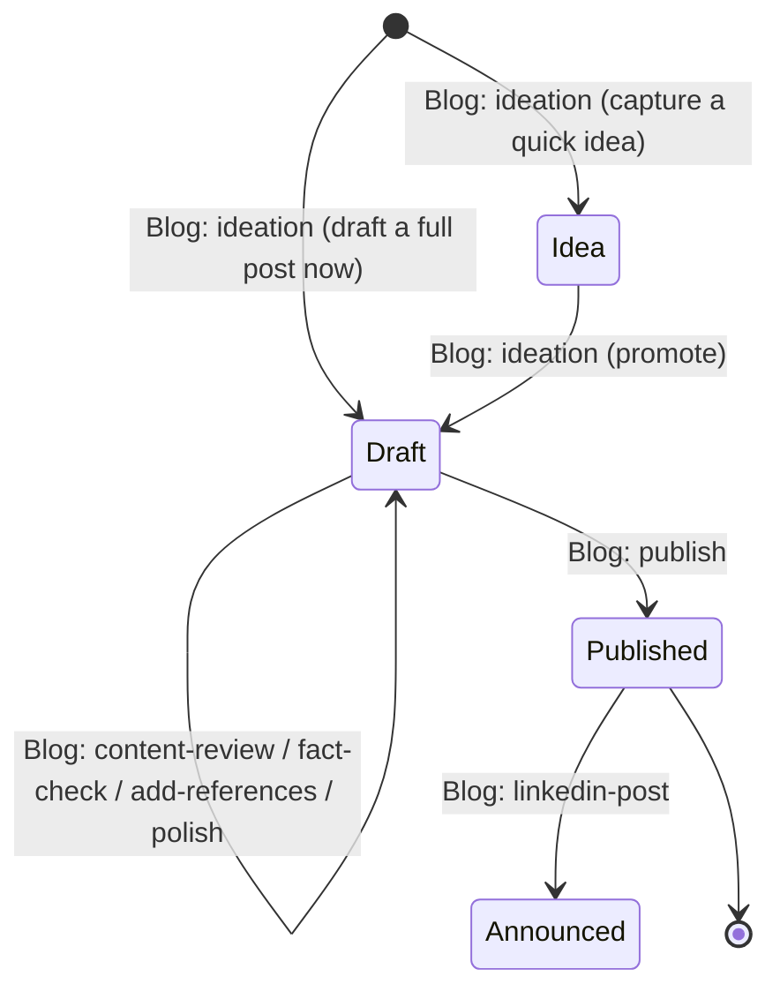

# Blog prompt suite

Maintainer-facing reference for the seven `Blog: *` prompts under
`config/prompts/builtin/blog/`. Workspace authors who want to customise the
suite for their own blog should read Sections 3 and 4.

## Overview

The blog suite is a **state machine over a beads issue's labels**, and the
**post content lives in the bead itself**. Each post is one bead:

- the bead **title** is the post title,
- the bead **description** is the current post body (always the live state —
  every edit rewrites the description),
- the bead **comments** hold all agent-authored notes: ideation notes,
  review findings, fact-check results, references audits, polish summaries, and
  the publish record.

The labels `blog`, `blog:idea`, `blog:draft`, `blog:needs-*`, `blog:ready`, and
`blog:published` encode which phase the post is in. Blog state labels are
namespaced with a `blog:` prefix so they never collide with generic project
labels (a bare `draft`/`ready`/`idea` could mean something else in the same
repo); the unprefixed `blog` label stays as the suite marker. Each prompt gates
on the current labels via its
`enabledWhen` expression, applies a small, well-defined transformation (capture
the idea, create the post, review it, polish it, publish it, announce it), and
updates labels to advance the state machine. There is **no draft file on disk**
during the drafting phase; a published artefact is only created by
`Blog: publish`, driven by the project's `.mitto/blog/publish.md` instructions.

An **idea** bead is a lightweight future note: a `blog`/`blog:idea`-labelled
bead whose **description is empty** and whose seed (the one-line idea) lives in
the **first comment**. It carries no body yet, so the drafting-phase prompts
(which gate on `blog:draft`) stay hidden until `Blog: ideation` promotes it into
a draft.



## Label conventions

Every claim in this table is derivable from grepping the prompt YAMLs for
`bd update ... --add-label` / `--remove-label` and their `enabledWhen` gates.

| Label | Set by | Cleared by | Semantics |
|---|---|---|---|
| `blog` | `ideation` (via `bd create -l blog,...`) | never | Marks the bead as belonging to the blog suite. Every blog prompt gates on `"blog" in Item.Labels`. |
| `idea` (`blog:idea`) | `ideation` (capture: `bd create -l blog,blog:idea`) | `ideation` (promote: `--remove-label blog:idea`) | Post is a captured future idea with **no body yet** — the seed lives in the first comment, the description is empty. Only `ideation` (promotion mode) acts on `blog:idea` beads; the drafting-phase prompts stay hidden until it is promoted to `blog:draft`. |
| `draft` (`blog:draft`) | `ideation` (draft-now: `bd create -l blog,blog:draft,...`; promote: `--add-label blog:draft`) | `publish` (`--remove-label blog:draft`) | Post is still being written/reviewed. All drafting-phase prompts gate on `"blog:draft" in Item.Labels`. |
| `published` (`blog:published`) | `publish` (`--add-label blog:published`) | never | Post has shipped. `linkedin-post` gates on `"blog:published" in Item.Labels`; `publish` refuses to re-run via `!("blog:published" in Item.Labels)`. |
| `needs-fact-check` (`blog:needs-fact-check`) | `ideation` (seeded when a draft is created or an idea is promoted); `content-review` (when review flags claims) | `fact-check` (`--remove-label blog:needs-fact-check`) | Draft has unverified factual claims; `fact-check` must run before `blog:ready` is added. |
| `needs-polish` (`blog:needs-polish`) | `ideation` (seeded when a draft is created or an idea is promoted); `content-review` (when review flags structural/voice issues); `polish` (re-added when polish pass discovers new issues) | `polish` (`--remove-label blog:needs-polish`) | Draft has known structural or voice issues; `polish` must run before `blog:ready` is added. |
| `ready` (`blog:ready`) | `fact-check` (added when no `blog:needs-*` labels remain); `polish` (same condition) | `content-review`, `add-references`, `fact-check`, `polish`, `publish` (each removes `blog:ready` whenever it dirties the draft) | Draft has passed all `blog:needs-*` gates and is ready for `publish`. Set only when the last `blog:needs-*` clears; removed by any prompt that re-dirties the post. |

## No `Folder` parameter

The suite has **no `Folder` parameter**. The post content lives in the bead
(title + description), not in a folder of draft files, so there is no
repo-relative post directory to configure during drafting. Workspace overrides
and instruction files live at a fixed location, `.mitto/blog/*.md` (see below).
Where the *published* artefact ends up is decided by `.mitto/blog/publish.md`,
not by a prompt parameter.

## User config files (`.mitto/blog/*.md`)

Optional Markdown files under `.mitto/blog/` let the workspace override the
default voice and process baked into the prompts. Two loading patterns are
used:

- **Read-only embed** (`blog/shared/blog-config-fragment`): the file content is
  inlined verbatim into the rendered prompt at template-render time (the agent
  never reads the file at runtime, so event logs show exactly what it
  received). When absent, a hard-coded `DefaultText` default is used. Used for
  files that have a sensible built-in default.
- **Read → ask → persist** (`blog/shared/read-or-ask-persist`): used for
  `publish.md`, which has no sensible default because publishing is
  project-specific. When the file is present it is embedded verbatim; when
  absent the agent asks the author how to publish, follows the answer for the
  current run, and offers to persist it to `.mitto/blog/publish.md`.

All files are **optional**.

| File | Loaded by | Consumed by | Overrides |
|---|---|---|---|
| `audience.md` | embed | `ideation`, `content-review`, `fact-check`, `polish`, `publish`, `linkedin-post` (some via `audience-and-style`) | Who the post is written for. Default: "Expert practitioners: engineers, technical leads, and hands-on architects." |
| `style.md` | embed | `ideation`, `polish`, `publish`, `linkedin-post` (some via `audience-and-style`) | Voice/register/style of the writing. Default: "Slightly informal, direct, and confident." |
| `topics.md` | embed | `ideation` | The workspace's editorial focus areas that ideation should propose posts within. Default: a generic technical-blog list. |
| `review.md` | embed | `content-review` | Project-specific review criteria layered on top of the built-in adversarial axes. Default: none (nothing rendered when absent). |
| `publish.md` | read → ask → persist | `publish` | How and where to publish: target repo/CMS, path convention, **destination format** (Markdown, MDX, HTML, reStructuredText, AsciiDoc, Confluence storage format, …), front-matter policy, deploy command. No default — asked and persisted when absent. |
| `linkedin-template.md` | embed | `linkedin-post` | Project-specific LinkedIn post layout. Default: HOOK / BODY / CANONICAL URL / HASHTAGS in that order, under 1300 characters, 3-5 tags. |

## Where the post content lives

There is no post file on disk during drafting. The bead **description** is the
single source of truth for the post body, and the bead **title** is the post
title. An `idea` bead is the one exception where the description is
deliberately **empty** (no body yet) — its seed lives in the first comment
until `ideation` promotes it and fills the description:

- `blog/shared/load-post-from-bead` loads the bead's title into `$post_title`
  and writes its description to a temp file `$post_file`, which review/polish
  prompts `cat`/`grep`.
- `blog/shared/update-post-in-bead` writes a revised body back into the
  description via `bd update --body-file`, diffing old vs new for an audit
  trail (used by `polish`).

Only `Blog: publish` materialises a file — the published artefact — at the
location and in the format its `.mitto/blog/publish.md` instructions specify.
Because the body is stored as **Markdown** but the destination may expect a
different format (MDX, HTML, reStructuredText, AsciiDoc, Confluence storage
format, …), `publish` does a **best-effort conversion** of the Markdown body to
the destination format before writing — preferring a real converter (e.g.
`pandoc`) when one is installed and falling back to a faithful manual conversion
otherwise, recording any lossy notes in the publish comment.

## Prompt-by-prompt gate table

Gates copied verbatim from each YAML's `enabledWhen:` line.

| Prompt | `enabledWhen` gate | Notes |
|---|---|---|
| `ideation` | `Item.Id == "" \|\| ("blog" in Item.Labels && "blog:idea" in Item.Labels)` | Dual-mode. `Item.Id == ""` keeps it **always visible** as the workspace entry point (prompts menu) even before `bd init` — its Step 0 bootstraps beads. The label clause makes it appear in the **beadsIssues** menu **only on `blog`/`blog:idea` beads** (promotion mode). Entry-point mode creates a `blog,blog:idea` bead (capture) or a `blog,blog:draft,blog:needs-fact-check,blog:needs-polish` bead (draft-now); promotion mode relabels `blog:idea`→`blog:draft` and seeds the `blog:needs-*` gates. |
| `content-review` | `CommandExists("bd") && DirExists(".beads") && "blog" in Item.Labels && "blog:draft" in Item.Labels` | Adds `blog:needs-polish` and/or `blog:needs-fact-check` per findings; removes `blog:ready`. |
| `fact-check` | `CommandExists("bd") && DirExists(".beads") && "blog" in Item.Labels && "blog:draft" in Item.Labels` | Removes `blog:needs-fact-check`; adds `blog:ready` iff no `blog:needs-*` remain. |
| `add-references` | `CommandExists("bd") && DirExists(".beads") && "blog" in Item.Labels && "blog:draft" in Item.Labels` | Flags REQUIRED vs RECOMMENDED references; adds `blog:needs-fact-check`; removes `blog:ready`. |
| `polish` | `CommandExists("bd") && DirExists(".beads") && "blog" in Item.Labels && "blog:draft" in Item.Labels` | Six-mode dropdown (General, Concise, Expand, Technical, Sharpen opening, Fluent); removes `blog:needs-polish`; adds `blog:ready` iff no `blog:needs-*` remain. |
| `publish` | `CommandExists("bd") && DirExists(".beads") && "blog" in Item.Labels && "blog:draft" in Item.Labels && !("blog:published" in Item.Labels)` | Terminal label transition: reads (or asks + persists) `.mitto/blog/publish.md`, **best-effort converts the Markdown body to the destination format** (pandoc-preferred, manual fallback), materialises the published artefact per those instructions, records a publish comment (with the format + any lossy conversion notes), adds `blog:published`, removes `blog:draft`+`blog:ready`+every `blog:needs-*`. **Does NOT close the bead** -- closure is a manual step for the author (see "No automatic closure" below). |
| `linkedin-post` | `CommandExists("bd") && DirExists(".beads") && "blog" in Item.Labels && "blog:published" in Item.Labels` | Post-publication only. Downstream artefact -- does NOT modify the bead. |

## No automatic closure

**No prompt in this suite runs `bd close`.** The bead lifecycle stops at
labels; closing the bead is a deliberate manual action for the author, not an
automated side-effect of the state machine. Rationale: "published" is not the
same as "done" -- the author may still want to post to LinkedIn, share
internally, iterate on comments, or link the bead from follow-up work before
declaring it closed. Encoding the close into any prompt would race that
judgement.

When adding a new blog prompt, do **not** include `bd close` in its body,
even for prompts that appear terminal. If closure ever needs to be
automated for a specific workflow, that belongs in a separate, opt-in
prompt (e.g. `blog/archive`) -- never as a hidden step of an editing or
publishing flow.

## Bucket classifications

Entries in `internal/prompts/prompts_test.go` (verify with
`grep 'blog/' internal/prompts/prompts_test.go`):

| File | Bucket | Extra |
|---|---|---|
| `blog/ideation.prompt.yaml` | `workspaceTitle` | `wantTitle: "Blog: ideation"`. Routes by title (workspace-menu entry point) even though it *also* appears in the `beadsIssues` menu for promotion — the bucket test checks target/reuse routing, not menus, so title-reuse is retained. |
| `blog/content-review.prompt.yaml` | `perBeadWithCoalesce` | Per-bead action, coalesces queued invocations. |
| `blog/fact-check.prompt.yaml` | `perBeadWithCoalesce` | " |
| `blog/add-references.prompt.yaml` | `perBeadWithCoalesce` | " |
| `blog/polish.prompt.yaml` | `perBeadWithCoalesce` | " |
| `blog/publish.prompt.yaml` | `perBeadWithCoalesce` | " |
| `blog/linkedin-post.prompt.yaml` | `perBeadWithCoalesce` | " |

## Conversation reuse — how ideation feeds the per-bead prompts

The six drafting-phase prompts route by **beads issue** (`target.reuse.issue`):
a dispatch carrying a `beads_issue` funnels into the existing non-archived
conversation **linked to that bead** in the same working dir. That reuse can
only fire if some conversation is actually linked to the bead — so whenever
`ideation` creates a **draft** (Step 5B, draft-now) or promotes an idea into a
draft (Step P5→P6, promotion), it links itself to the new draft bead and
renames the conversation to the post title:

```
mitto_conversation_update(self_id: "…", conversation_id: "self", beads_issue: "<draft-id>", name: "<post title>")
```

After that, running `content-review` / `fact-check` / `add-references` /
`polish` / `publish` / `linkedin-post` on the draft funnels back into this one
post-specific conversation instead of spawning a fresh one. Renaming away from
`"Blog: ideation"` also means the next `ideation` run starts its **own** entry-
point conversation (ideation routes by title), so each post gets a clean,
self-contained thread. Quick-idea capture (Step 2A) deliberately does **not**
link/rename — an idea bead gets no per-bead prompts, so the shared
`Blog: ideation` thread stays reusable for jotting further ideas.

## Extending the suite

Recipe for adding a new prompt to the state machine (for example, a
`Blog: retrospective` transition from `Published` to `Retrospected`):

1. Pick a state transition. Decide which existing label(s) gate the prompt
   and which labels the prompt itself adds/removes. Gate on **both** menu
   contexts: `"blog:published" in Item.Labels` for the beads-list row menu, and
   `Session.HasBeadsIssue && BeadHasLabels(Session.BeadsIssue, "blog,blog:published")`
   for the conversation-level prompts menu.
2. Add the prompt YAML under `config/prompts/builtin/blog/`, reusing shared
   fragments (`load-post-from-bead`, `update-post-in-bead`,
   `audience-and-style`, `blog-config-fragment`, `read-or-ask-persist`)
   wherever the same logic applies. Match the sibling YAML shape:
   `menus: beadsIssues, prompts`, `parameters: [IssueID]`,
   `target.reuse.{issue,coalesce}: true`, `preferredModels: [modelTag: Coding]`.
   Resolve the target bead at the top of the body
   (`{{ $target := "" }}{{ if .Session.BeadsIssue }}…{{ else if .Args.IssueID }}…{{ end }}`),
   emit the `beads-issues/shared/target-bead-header-strict` preamble, and pass
   `$target` to `load-post-from-bead` via `(dict "Target" $target)`.
3. Add the bucket entry to `internal/prompts/prompts_test.go` -- almost
   certainly `perBeadWithCoalesce` (only `ideation` is `workspaceTitle`).
4. Add a `TestBlog<Name>PromptFragmentHallmarks` smoke test in
   `internal/prompts/blog_fragments_smoke_test.go` asserting one distinctive
   substring from each shared fragment the new prompt includes (see the
   sibling tests for the pattern).
5. Verify: `./mitto prompts verify` and
   `go test ./internal/prompts/ -run TestBlog -count=1`.
