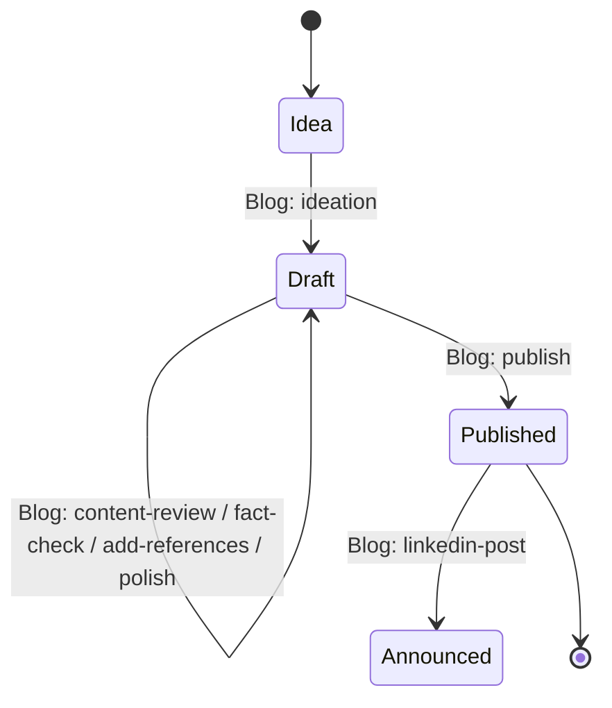

# Blog prompt suite

Maintainer-facing reference for the seven `Blog: *` prompts under
`config/prompts/builtin/blog/`. Workspace authors who want to customise the
suite for their own blog should read Sections 3 and 4.

## Overview

The blog suite is a **state machine over a beads issue's labels**. Each post
is one bead; the labels `blog`, `draft`, `needs-*`, `ready`, and `published`
encode which phase the post is in. Each prompt gates on the current labels
via its `enabledWhen` expression, applies a small, well-defined transformation
(create the file, review it, polish it, publish it, announce it), and updates
labels to advance the state machine. The bead is the durable record; the
Markdown file on disk is the artefact; the label set is the state.

## Label conventions

Every claim in this table is derivable from grepping the prompt YAMLs for
`bd update ... --add-label` / `--remove-label` and their `enabledWhen` gates.

| Label | Set by | Cleared by | Semantics |
|---|---|---|---|
| `blog` | `ideation` (via `bd create -l blog,...`) | never | Marks the bead as belonging to the blog suite. Every blog prompt gates on `"blog" in Item.Labels`. |
| `draft` | `ideation` (via `bd create`) | `publish` (`--remove-label draft`) | Post is still being written/reviewed. All drafting-phase prompts gate on `"draft" in Item.Labels`. |
| `published` | `publish` (`--add-label published`) | never | Post has shipped. `linkedin-post` gates on `"published" in Item.Labels`; `publish` refuses to re-run via `!("published" in Item.Labels)`. |
| `needs-fact-check` | `ideation` (seeded on create); `content-review` (when review flags claims) | `fact-check` (`--remove-label needs-fact-check`) | Draft has unverified factual claims; `fact-check` must run before `ready` is added. |
| `needs-polish` | `ideation` (seeded on create); `content-review` (when review flags structural/voice issues); `polish` (re-added when polish pass discovers new issues) | `polish` (`--remove-label needs-polish`) | Draft has known structural or voice issues; `polish` must run before `ready` is added. |
| `ready` | `fact-check` (added when no `needs-*` labels remain); `polish` (same condition) | `content-review`, `add-references`, `fact-check`, `polish`, `publish` (each removes `ready` whenever it dirties the draft) | Draft has passed all `needs-*` gates and is ready for `publish`. Set only when the last `needs-*` clears; removed by any prompt that re-dirties the post. |

## The `Folder` parameter

Every blog prompt takes a `Folder` parameter (type `text`, default
`blog/posts`, `required: false`). This is the repo-relative directory where
post files and workspace overrides live. Override it on invocation to point
the suite at a different location (for example `content/posts` for a Hugo
site or `_posts` for a Jekyll site). The value flows through into
`blog-config-fragment`, which resolves each user-config file path as
`{Folder}/.mitto/<name>.md` at render time via
`{{ Arg "Folder" "blog/posts" }}`.

## User config files (`.mitto/*.md` overrides)

Six optional Markdown files under `{Folder}/.mitto/` let the workspace
override the default voice, structure, and process baked into the prompts.
Each file is inlined verbatim into the rendered prompt via
`blog/shared/blog-config-fragment` (the agent never reads the file at
runtime -- the bytes are embedded at template-render time so event logs
show exactly what the agent received).

All six files are **optional**. When absent, the calling prompt uses a
hard-coded default embedded via a `DefaultText` value in the fragment call.

| File | Consumed by | Overrides |
|---|---|---|
| `audience.md` | `content-review`, `fact-check`, `polish`, `publish`, `linkedin-post` (via `audience-and-tone`) | Who the post is written for. Default: "Expert practitioners: engineers, technical leads, and hands-on architects." |
| `tone.md` | `polish`, `linkedin-post` (via `audience-and-tone`) | Voice/register of the writing. Default: "Slightly informal, direct, and confident." |
| `topics.md` | `ideation` | The workspace's editorial focus areas that ideation should propose posts within. Default: a generic technical-blog list. |
| `frontmatter.md` | `ideation`, `publish` | Project-specific YAML frontmatter policy (which keys to populate/preserve/strip). Default: sets `title`, `description`, `date`, `tags`; removes `publish: false`; preserves unrelated keys. |
| `publish-checklist.md` | `publish` | The final-pass sanity checks the author walks through before shipping. Default: git-status clean, links resolve, no `TODO`/`FIXME`, every fence has a language tag. |
| `linkedin-template.md` | `linkedin-post` | Project-specific LinkedIn post layout. Default: HOOK / BODY / CANONICAL URL / HASHTAGS in that order, under 1300 characters, 3-5 tags. |

## Dual attachment mechanism

Every prompt after `ideation` needs to find the post file on disk. The suite
records the association from bead to file in **two** places, refreshed
together by `ideation` (on creation) and by `publish` (on the
`draft-<slug>.md` -> `YYYY-MM-DD-<slug>.md` rename):

1. **`File: [path](path)` line in the bead's description.** A single
   Markdown link on its own line in the description body. Parsed by
   `blog/shared/locate-post-file` at every prompt invocation (via
   `bd show --json | jq -r .[0].description | grep -m1 ...`) to resolve
   `$post_path` and `$post_abs`. Human-readable in the beads TUI; drives
   the fragment logic.
2. **`attachments` metadata via `scripts/bd-attach.sh add`.** A structured
   JSON attachment record stored under the bead's `metadata.attachments`
   list, wrapped by `blog/shared/attach-file-to-bead` with a raw
   `bd update --metadata` fallback for environments where the helper is
   absent. Travels with `bd dolt push`/`pull` and survives description
   edits; tool-visible from other agents.

Both records are refreshed atomically by whichever prompt renames or moves
the file. See `.augment/rules/44-beads-attachments.md` for the underlying
attachment convention.

## Prompt-by-prompt gate table

Gates copied verbatim from each YAML's `enabledWhen:` line (`ideation` has
no gate -- it is the entry point, always visible in the workspace menu).

| Prompt | `enabledWhen` gate | Notes |
|---|---|---|
| `ideation` | *(none)* | Entry point. Creates the bead with `-l blog,draft,needs-fact-check,needs-polish`; menu: workspace, not per-bead. |
| `content-review` | `CommandExists("bd") && DirExists(".beads") && "blog" in Item.Labels && "draft" in Item.Labels` | Adds `needs-polish` and/or `needs-fact-check` per findings; removes `ready`. |
| `fact-check` | `CommandExists("bd") && DirExists(".beads") && "blog" in Item.Labels && "draft" in Item.Labels` | Removes `needs-fact-check`; adds `ready` iff no `needs-*` remain. |
| `add-references` | `CommandExists("bd") && DirExists(".beads") && "blog" in Item.Labels && "draft" in Item.Labels` | Flags REQUIRED vs RECOMMENDED references; adds `needs-fact-check`; removes `ready`. |
| `polish` | `CommandExists("bd") && DirExists(".beads") && "blog" in Item.Labels && "draft" in Item.Labels` | Six-mode dropdown (General, Concise, Expand, Technical, Sharpen opening, Fluent); removes `needs-polish`; adds `ready` iff no `needs-*` remain. |
| `publish` | `CommandExists("bd") && DirExists(".beads") && "blog" in Item.Labels && "draft" in Item.Labels && !("published" in Item.Labels)` | Terminal label transition: rewrites frontmatter, `git mv draft-<slug>.md -> YYYY-MM-DD-<slug>.md`, refreshes attachment, adds `published`, removes `draft`+`ready`+every `needs-*`. **Does NOT close the bead** -- closure is a manual step for the author (see "No automatic closure" below). |
| `linkedin-post` | `CommandExists("bd") && DirExists(".beads") && "blog" in Item.Labels && "published" in Item.Labels` | Post-publication only. Downstream artefact -- does NOT modify the bead. |

## No automatic closure

**No prompt in this suite runs `bd close`.** The bead lifecycle stops at
labels; closing the bead is a deliberate manual action for the author, not an
automated side-effect of the state machine. Rationale: "published" is not the
same as "done" -- the author may still want to post to LinkedIn, share
internally, iterate on comments, or link the bead from follow-up work before
declaring it closed. Encoding the close into any prompt would race that
judgement.

When adding a new blog prompt, do **not** include `bd close` in its body,
even for prompts that appear terminal. If closure ever needs to be
automated for a specific workflow, that belongs in a separate, opt-in
prompt (e.g. `blog/archive`) -- never as a hidden step of an editing or
publishing flow.

## Bucket classifications

Entries in `internal/prompts/prompts_test.go` (verify with
`grep 'blog/' internal/prompts/prompts_test.go`):

| File | Bucket | Extra |
|---|---|---|
| `blog/ideation.prompt.yaml` | `workspaceTitle` | `wantTitle: "Blog: ideation"` (workspace-menu entry point). |
| `blog/content-review.prompt.yaml` | `perBeadWithCoalesce` | Per-bead action, coalesces queued invocations. |
| `blog/fact-check.prompt.yaml` | `perBeadWithCoalesce` | " |
| `blog/add-references.prompt.yaml` | `perBeadWithCoalesce` | " |
| `blog/polish.prompt.yaml` | `perBeadWithCoalesce` | " |
| `blog/publish.prompt.yaml` | `perBeadWithCoalesce` | " |
| `blog/linkedin-post.prompt.yaml` | `perBeadWithCoalesce` | " |

## Extending the suite

Recipe for adding a new prompt to the state machine (for example, a
`Blog: retrospective` transition from `Published` to `Retrospected`):

1. Pick a state transition. Decide which existing label(s) gate the prompt
   (`"published" in Item.Labels` for a post-publication action) and which
   labels the prompt itself adds/removes.
2. Add the prompt YAML under `config/prompts/builtin/blog/`, reusing shared
   fragments (`locate-post-file`, `audience-and-tone`, `blog-config-fragment`,
   `attach-file-to-bead`) wherever the same logic applies. Match the sibling
   YAML shape: `menus: beadsIssues`, `parameters: [IssueID, Folder]`,
   `target.reuse.{issue,coalesce}: true`, `preferredModels: [modelTag: Coding]`.
3. Add the bucket entry to `internal/prompts/prompts_test.go` -- almost
   certainly `perBeadWithCoalesce` (only `ideation` is `workspaceTitle`).
4. Add a `TestBlog<Name>PromptFragmentHallmarks` smoke test in
   `internal/prompts/blog_fragments_smoke_test.go` asserting one distinctive
   substring from each shared fragment the new prompt includes (see the
   sibling tests for the pattern).
5. Verify: `./mitto prompts verify` and
   `go test ./internal/prompts/ -run TestBlog -count=1`.
