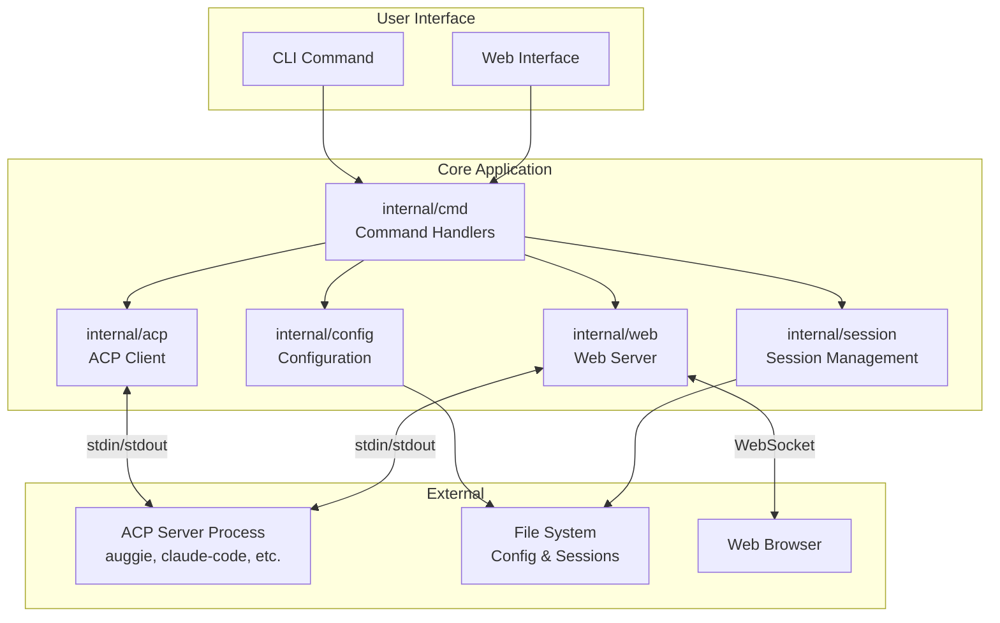
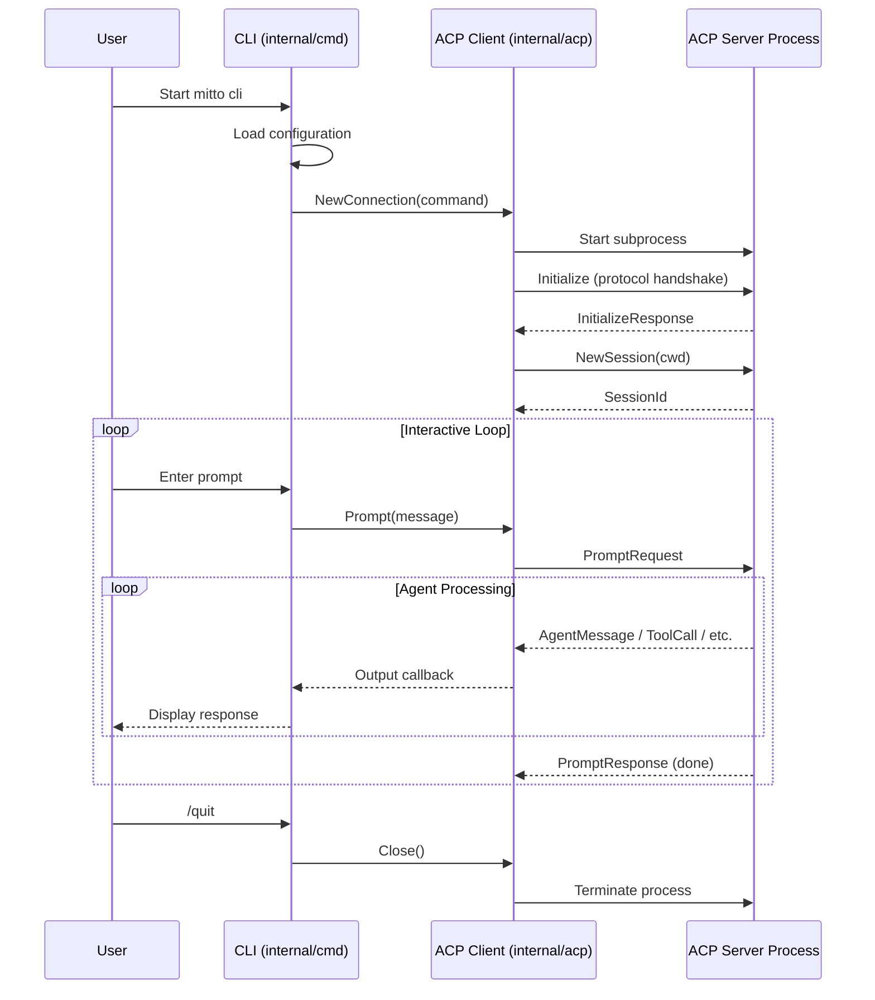
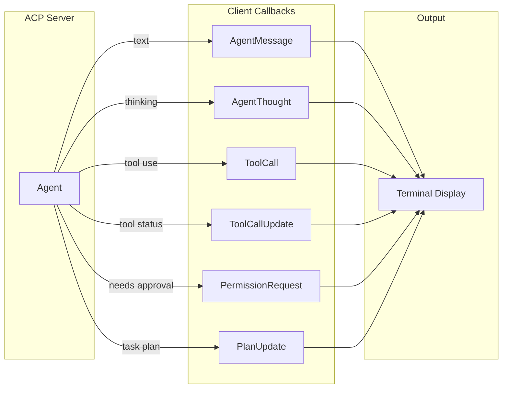
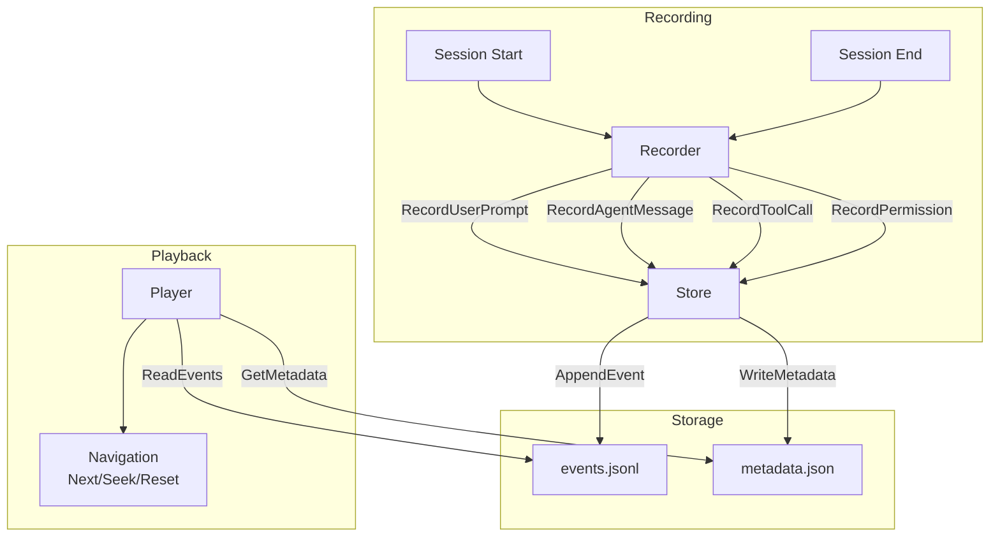
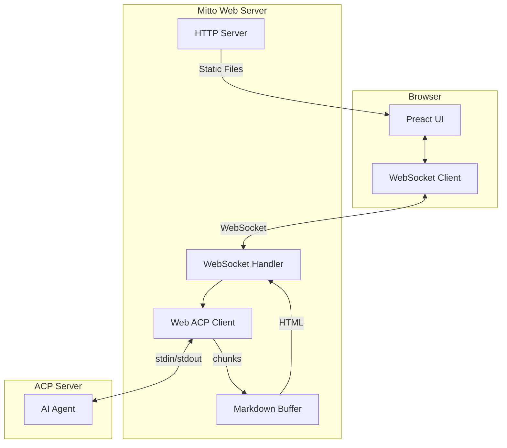
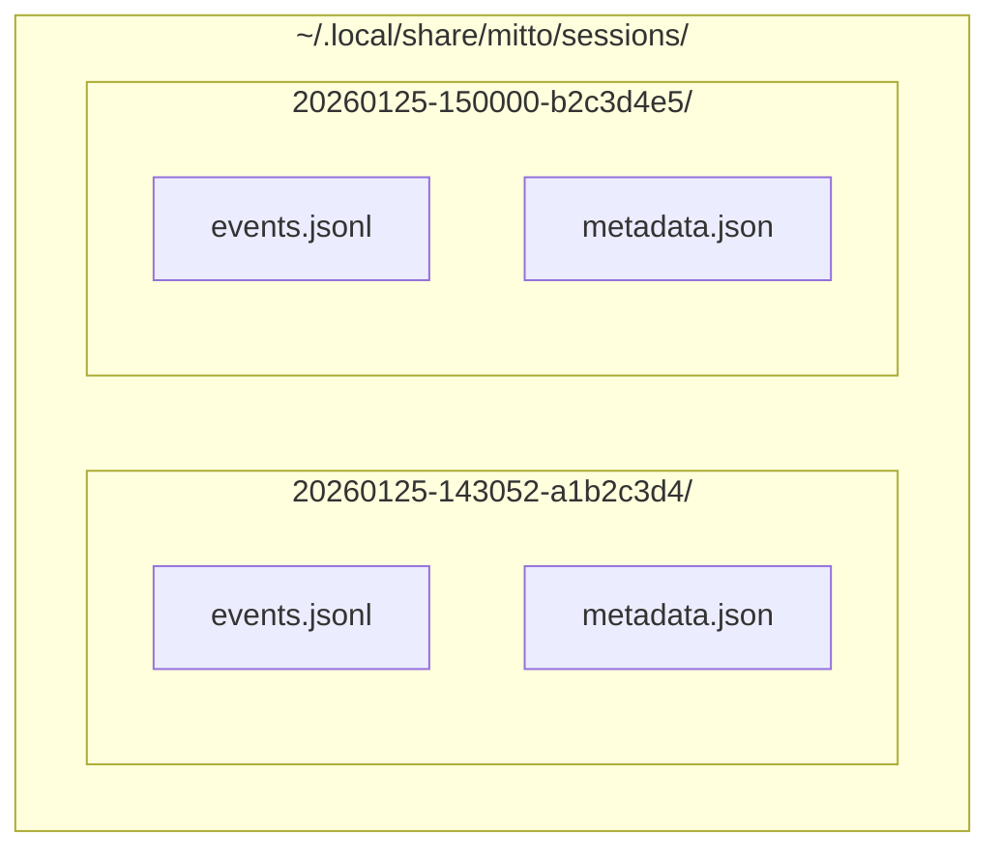

# Mitto Architecture

## Project Overview

Mitto is a command-line interface (CLI) client for the [Agent Communication Protocol (ACP)](https://agentcommunicationprotocol.dev/). It enables users to interact with AI coding agents such as Auggie, Claude Code, and other ACP-compatible servers through a terminal-based interface.

The project is written in Go and follows idiomatic Go project structure with clear separation of concerns between packages.

## High-Level Architecture



## Component Breakdown

### `cmd/mitto` - Entry Point

The main entry point for the application. It simply invokes the root command from the `internal/cmd` package.

```go
func main() {
    if err := cmd.Execute(); err != nil {
        os.Exit(1)
    }
}
```

### `internal/cmd` - CLI Commands

Implements the command-line interface using [Cobra](https://github.com/spf13/cobra).

| File | Purpose |
|------|---------|
| `root.go` | Root command, global flags, configuration loading |
| `cli.go` | Interactive CLI command with readline support |
| `web.go` | Web interface command, starts HTTP/WebSocket server |

**Key Responsibilities:**
- Parse command-line arguments and flags
- Load configuration via `internal/config`
- Create and manage ACP connections
- Handle user input via readline
- Process slash commands (`/quit`, `/help`, `/cancel`)

### `internal/config` - Configuration Management

Handles loading and parsing of the YAML configuration file.

**Configuration File Locations:**
- macOS/Linux: `~/.mittorc`
- Windows: `%APPDATA%\.mittorc`
- Override: `MITTORC` environment variable

**Configuration Format:**
```yaml
acp:
  - auggie:
      command: auggie --acp
  - claude-code:
      command: npx -y @zed-industries/claude-code-acp@latest
```

### `internal/acp` - ACP Client Implementation

Implements the ACP client protocol for communicating with AI agents.

| File | Purpose |
|------|---------|
| `connection.go` | Process management and connection lifecycle |
| `client.go` | ACP protocol handlers (messages, permissions, files) |
| `terminal.go` | Terminal-related ACP operations |

**Key Components:**

- **Connection**: Manages the ACP server subprocess, stdin/stdout pipes, and protocol initialization
- **Client**: Implements the `acp.Client` interface from `acp-go-sdk`, handling:
  - Agent messages and thoughts
  - Tool calls and updates
  - Permission requests
  - File read/write operations
  - Plan updates

### `internal/session` - Session Recording & Playback

Provides session persistence for recording, storing, and replaying ACP interactions.

| File | Purpose |
|------|---------|
| `types.go` | Event types and data structures |
| `store.go` | File-based session storage operations |
| `recorder.go` | High-level API for recording sessions |
| `player.go` | Session playback and navigation |
| `config.go` | Default paths and store creation |

**Key Components:**

- **Store**: Thread-safe file operations for session persistence
- **Recorder**: Records events during an active session
- **Player**: Loads and navigates through recorded sessions

### `internal/web` - Web Interface Server

Provides a browser-based UI for ACP communication via HTTP and WebSocket.

| File | Purpose |
|------|---------|
| `server.go` | HTTP server setup, routing, static file serving |
| `websocket.go` | WebSocket handler for real-time ACP communication |
| `client.go` | Web-specific ACP client with streaming callbacks |
| `markdown.go` | Smart Markdown-to-HTML streaming buffer |
| `session_api.go` | REST API endpoints for session management |

**Key Components:**

- **Server**: HTTP server serving embedded static files and API endpoints
- **WSClient**: WebSocket client managing per-connection ACP sessions
- **WebClient**: Implements `acp.Client` with callback-based output for web streaming
- **MarkdownBuffer**: Accumulates streaming text and converts to HTML at semantic boundaries

### `web/` - Frontend Assets

Contains embedded static files for the web interface.

| File | Purpose |
|------|---------|
| `embed.go` | Go embed directive for static files |
| `static/index.html` | Main HTML page with Tailwind CSS |
| `static/app.js` | Preact application (components, WebSocket client) |
| `static/styles.css` | Custom CSS for Markdown rendering |

**Technology Stack:**
- **Preact + HTM**: Lightweight React-like framework loaded from CDN (no build step)
- **Tailwind CSS**: Utility-first CSS via Play CDN
- **WebSocket**: Real-time bidirectional communication

## Design Decisions

### 1. Separation of Store, Recorder, and Player

The session package uses three distinct components following the Single Responsibility Principle:

| Component | Responsibility |
|-----------|---------------|
| **Store** | Low-level file I/O, thread safety, CRUD operations |
| **Recorder** | High-level recording API, session lifecycle management |
| **Player** | Read-only playback, navigation, filtering |

This separation allows:
- Independent testing of each component
- Different access patterns (write-heavy recording vs. read-heavy playback)
- Future extensibility (e.g., different storage backends)

### 2. File-Based Session Storage Format

Sessions are stored using a hybrid format:

- **`events.jsonl`**: JSONL (JSON Lines) for the event log
  - Append-only writes (no file rewriting)
  - Crash-resistant (partial writes don't corrupt existing data)
  - Streamable for large sessions

- **`metadata.json`**: Standard JSON for session metadata
  - Human-readable
  - Quick access to session info without parsing events
  - Updated on each event (small file, acceptable overhead)

### 3. Timestamp-Based Session IDs

Session IDs use the format `YYYYMMDD-HHMMSS-XXXXXXXX` (timestamp + random hex):

```
20260125-143052-a1b2c3d4
```

**Rationale:**
- Human-readable and sortable by creation time
- No external UUID dependency
- Sufficient uniqueness for single-user CLI tool
- Easy to identify sessions by date

### 4. ACP Client Separation from CLI

The `internal/acp` package is independent of the CLI presentation layer:

- **`acp.Client`** receives an `output` callback function
- CLI provides its own output function (`fmt.Print`)
- Future web interface can provide different output handling
- Enables testing without terminal dependencies

### 5. Configuration File Strategy

Configuration uses a simple YAML file with platform-specific defaults:

- **XDG-like approach**: `~/.mittorc` follows Unix conventions
- **Environment override**: `MITTORC` for flexibility
- **Ordered list**: First server is default (explicit, predictable)
- **Minimal config**: Only essential settings (server name + command)

## Data Flow

### User Interaction Sequence



### ACP Message Handling

The `Client` struct in `internal/acp/client.go` implements callbacks for various ACP events:



## Session Management

### Session Recording Flow



### Session Lifecycle

1. **Creation**: `Recorder.Start()` creates session directory and files
2. **Recording**: Events appended via `Recorder.Record*()` methods
3. **Completion**: `Recorder.End()` marks session as completed
4. **Playback**: `Player` loads events for review/replay

### Event Types

| Event Type | Description |
|------------|-------------|
| `session_start` | Session initialization with metadata |
| `session_end` | Session termination with reason |
| `user_prompt` | User input message |
| `agent_message` | Agent response text |
| `agent_thought` | Agent's internal reasoning |
| `tool_call` | Tool invocation by agent |
| `tool_call_update` | Tool execution status update |
| `plan` | Agent's task plan |
| `permission` | Permission request and outcome |
| `file_read` | File read operation |
| `file_write` | File write operation |
| `error` | Error occurrence |

## Web Interface

The web interface provides a browser-based UI for ACP communication, accessible via `mitto web`.

### Architecture Overview



### Streaming Response Handling

The ACP agent sends responses as text chunks via `SessionUpdate` callbacks. The web interface maintains real-time streaming while converting Markdown to HTML:

1. **Chunk Reception**: `WebClient.SessionUpdate()` receives `AgentMessageChunk` events
2. **Smart Buffering**: `MarkdownBuffer` accumulates chunks until semantic boundaries
3. **HTML Conversion**: Goldmark converts buffered Markdown to HTML
4. **WebSocket Delivery**: HTML chunks sent immediately to browser
5. **Frontend Rendering**: Preact renders HTML via `dangerouslySetInnerHTML`

### Markdown Buffer Strategy

The `MarkdownBuffer` balances real-time streaming with correct Markdown rendering:

| Flush Trigger | Condition | Rationale |
|---------------|-----------|-----------|
| Line complete | `\n` received | Most content is line-based |
| Code block end | Closing ``` | Don't break syntax highlighting |
| Paragraph break | `\n\n` | Natural semantic boundary |
| Timeout | 200ms idle | Ensure eventual delivery |
| Buffer limit | 4KB accumulated | Prevent memory issues |

### WebSocket Protocol

**Frontend → Backend:**

| Type | Data | Description |
|------|------|-------------|
| `new_session` | `{}` | Create new ACP session |
| `prompt` | `{"message": "string"}` | Send user message |
| `cancel` | `{}` | Cancel current operation |
| `load_session` | `{"session_id": "string"}` | Load past session |
| `permission_answer` | `{"option_id": "string", "cancel": bool}` | Respond to permission request |

**Backend → Frontend:**

| Type | Data | Description |
|------|------|-------------|
| `connected` | `{"acp_server": "string", "session_id": "string"}` | Connection established |
| `agent_message` | `{"html": "string", "format": "html"}` | HTML-formatted response chunk |
| `agent_thought` | `{"text": "string"}` | Agent thinking (plain text) |
| `tool_call` | `{"id": "string", "title": "string", "status": "string"}` | Tool invoked |
| `tool_update` | `{"id": "string", "status": "string"}` | Tool status update |
| `permission` | `{"title": "string", "options": [...]}` | Permission request |
| `prompt_complete` | `{}` | End of response signal |
| `error` | `{"message": "string"}` | Error notification |

### Frontend Technology

The frontend uses a CDN-first approach for zero build complexity:

| Library | Purpose | Size |
|---------|---------|------|
| Preact | UI framework | ~3KB |
| HTM | JSX-like syntax without build | ~1KB |
| Tailwind Play CDN | Styling | Runtime |

All assets are embedded in the Go binary via `go:embed`, enabling single-binary distribution.

### Component Structure

```
App
├── SessionList (sidebar)
│   └── SessionItem
├── Header (connection status, streaming indicator)
├── MessageList
│   ├── Message (user - plain text, blue bubble)
│   ├── Message (agent - HTML/Markdown, gray bubble)
│   ├── Message (thought - italic, purple accent)
│   ├── Message (tool - centered status badge)
│   ├── Message (error - red accent)
│   └── Message (system - centered, subtle)
└── ChatInput (textarea + send/cancel button)
```

### Responsive Design

- **Desktop (≥768px)**: Sidebar always visible, main chat area
- **Mobile (<768px)**: Sidebar hidden, hamburger menu to open overlay
- **Touch support**: Tap to open/close sidebar on mobile

## File Structure

### Project Layout

```
mitto/
├── cmd/
│   └── mitto/
│       └── main.go              # Application entry point
├── internal/
│   ├── acp/
│   │   ├── client.go            # ACP protocol handlers
│   │   ├── connection.go        # Process & connection management
│   │   └── terminal.go          # Terminal operations
│   ├── cmd/
│   │   ├── root.go              # Root command & global flags
│   │   ├── cli.go               # Interactive CLI command
│   │   └── web.go               # Web interface command
│   ├── config/
│   │   └── config.go            # Configuration loading & parsing
│   ├── session/
│   │   ├── types.go             # Event & metadata types
│   │   ├── store.go             # File-based storage
│   │   ├── recorder.go          # Session recording
│   │   ├── player.go            # Session playback
│   │   ├── config.go            # Default paths
│   │   └── *_test.go            # Unit tests
│   └── web/
│       ├── server.go            # HTTP server setup
│       ├── websocket.go         # WebSocket handler
│       ├── client.go            # Web ACP client
│       ├── markdown.go          # Markdown streaming buffer
│       └── session_api.go       # REST API for sessions
├── web/
│   ├── embed.go                 # Go embed directive
│   └── static/
│       ├── index.html           # Main HTML page
│       ├── app.js               # Preact application
│       └── styles.css           # Custom CSS
├── docs/
│   └── architecture.md          # This document
├── go.mod                       # Go module definition
├── go.sum                       # Dependency checksums
├── Makefile                     # Build automation
└── README.md                    # User documentation
```

### Session Storage Layout



**Directory Structure:**
```
~/.local/share/mitto/
└── sessions/
    ├── 20260125-143052-a1b2c3d4/
    │   ├── events.jsonl         # Event log (append-only)
    │   └── metadata.json        # Session metadata
    └── 20260125-150000-b2c3d4e5/
        ├── events.jsonl
        └── metadata.json
```

### File Formats

**metadata.json:**
```json
{
  "session_id": "20260125-143052-a1b2c3d4",
  "acp_server": "auggie",
  "working_dir": "/home/user/project",
  "created_at": "2026-01-25T14:30:52Z",
  "updated_at": "2026-01-25T14:35:00Z",
  "event_count": 42,
  "status": "completed"
}
```

**events.jsonl:**
```jsonl
{"type":"session_start","timestamp":"2026-01-25T14:30:52Z","data":{"session_id":"...","acp_server":"auggie","working_dir":"/home/user/project"}}
{"type":"user_prompt","timestamp":"2026-01-25T14:30:55Z","data":{"message":"Hello, can you help me?"}}
{"type":"agent_message","timestamp":"2026-01-25T14:30:57Z","data":{"text":"Of course! What do you need help with?"}}
{"type":"session_end","timestamp":"2026-01-25T14:35:00Z","data":{"reason":"user_quit"}}
```

## Dependencies

### Core Dependencies

| Package | Purpose |
|---------|---------|
| `github.com/coder/acp-go-sdk` | ACP protocol implementation |
| `github.com/spf13/cobra` | CLI framework |
| `github.com/reeflective/readline` | Interactive input |
| `gopkg.in/yaml.v3` | YAML configuration parsing |

### Web Interface Dependencies

| Package | Purpose |
|---------|---------|
| `github.com/gorilla/websocket` | WebSocket support |
| `github.com/yuin/goldmark` | Markdown to HTML conversion |
| `github.com/yuin/goldmark-highlighting/v2` | Syntax highlighting for code blocks |

### Frontend Dependencies (CDN)

| Library | CDN | Purpose |
|---------|-----|---------|
| Preact | esm.sh | Lightweight React-like UI framework |
| HTM | esm.sh | JSX-like syntax without build step |
| Tailwind CSS | cdn.tailwindcss.com | Utility-first CSS framework |

## Future Considerations

1. **Permission Dialog**: Interactive UI for handling permission requests in web interface
2. **Session Loading**: Load and replay past sessions in web interface
3. **Session Search**: Index sessions for quick searching by content
4. **Session Export**: Export sessions to different formats (Markdown, HTML)
5. **Multiple Storage Backends**: Support for database or cloud storage
6. **Session Sharing**: Share sessions between users or machines
7. **Touch Gestures**: Swipe navigation for mobile web interface


