# Mitto Architecture

## Project Overview

Mitto is a command-line interface (CLI) client for the [Agent Communication Protocol (ACP)](https://agentcommunicationprotocol.dev/). It enables users to interact with AI coding agents such as Auggie, Claude Code, and other ACP-compatible servers through a terminal-based interface.

The project is written in Go and follows idiomatic Go project structure with clear separation of concerns between packages.

## High-Level Architecture

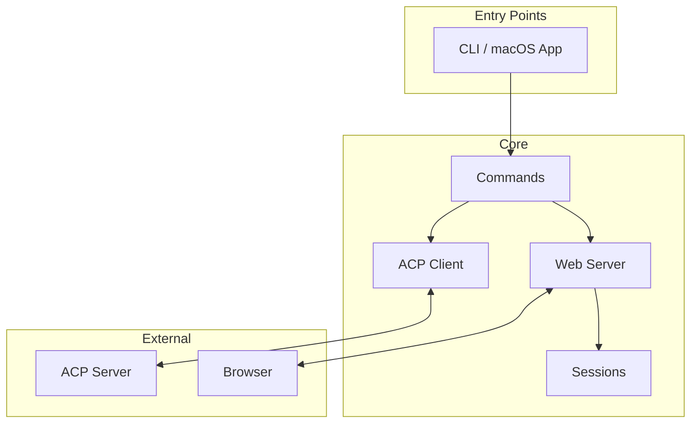
```mermaid
graph TB
    subgraph "Entry Points"
        CLI[CLI / macOS App]
    end

    subgraph "Core"
        CMD[Commands]
        ACP[ACP Client]
        WEB[Web Server]
        SES[Sessions]
    end

    subgraph "External"
        AGENT[ACP Server]
        BROWSER[Browser]
    end

    CLI --> CMD
    CMD --> ACP
    CMD --> WEB
    WEB --> SES
    ACP <--> AGENT
    WEB <--> BROWSER
```

## Component Breakdown

### `internal/cmd` - CLI Commands

Implements the command-line interface using [Cobra](https://github.com/spf13/cobra).

**Key Responsibilities:**
- Parse command-line arguments and flags
- Load configuration via `internal/config`
- Create and manage ACP connections
- Handle user input via readline
- Process slash commands (`/quit`, `/help`, `/cancel`)

### `internal/appdir` - Platform-Native Directory Management

Manages the Mitto data directory, which stores configuration and session data.

**Directory Locations (in priority order):**
1. `MITTO_DIR` environment variable (if set)
2. Platform-specific default:
   - **macOS**: `~/Library/Application Support/Mitto`
   - **Linux**: `$XDG_DATA_HOME/mitto` or `~/.local/share/mitto`
   - **Windows**: `%APPDATA%\Mitto`

**Key Functions:**
- `Dir()` - Returns the Mitto data directory path
- `EnsureDir()` - Creates the directory structure if needed
- `SettingsPath()` - Returns path to `settings.json`
- `SessionsDir()` - Returns path to `sessions/` subdirectory

### `internal/config` - Configuration Management

Handles loading, parsing, and persisting Mitto configuration.

**Configuration System:**
- **Default config**: `config/config.default.yaml` (embedded in binary)
- **User settings**: `MITTO_DIR/settings.json` (auto-created from defaults)
- **Override**: `--config` flag accepts YAML or JSON files

**Configuration Formats:**

YAML format (for `--config` flag):
```yaml
acp:
  - auggie:
      command: auggie --acp
  - claude-code:
      command: npx -y @zed-industries/claude-code-acp@latest
web:
  host: 127.0.0.1
  port: 8080
```

JSON format (for `settings.json` or `--config` flag):
```json
{
  "acp_servers": [
    {"name": "auggie", "command": "auggie --acp"},
    {"name": "claude-code", "command": "npx -y @zed-industries/claude-code-acp@latest"}
  ],
  "web": {"host": "127.0.0.1", "port": 8080}
}
```

### `internal/acp` - ACP Client Implementation

Implements the ACP client protocol for communicating with AI agents.

**Key Components:**

- **Connection**: Manages the ACP server subprocess, stdin/stdout pipes, and protocol initialization
- **Client**: Implements the `acp.Client` interface from `acp-go-sdk`, handling:
  - Agent messages and thoughts
  - Tool calls and updates
  - Permission requests
  - File read/write operations
  - Plan updates

### `internal/session` - Session Recording & Playback

Provides session persistence for recording, storing, and replaying ACP interactions.

**Key Components:**

- **Store**: Thread-safe file operations for session persistence
- **Recorder**: Records events during an active session
- **Player**: Loads and navigates through recorded sessions
- **Queue**: Thread-safe FIFO message queue with atomic file persistence

### `internal/web` - Web Interface Server

Provides a browser-based UI for ACP communication via HTTP and WebSocket.

**Key Components:**

- **Server**: HTTP server serving embedded static files and API endpoints
- **SessionWSClient**: Per-session WebSocket client implementing `SessionObserver`
- **GlobalEventsClient**: WebSocket client for session lifecycle events
- **WSConn**: Shared WebSocket wrapper for message sending and ping/pong
- **BackgroundSession**: Manages ACP connection, notifies observers, persists events
- **WebClient**: Implements `acp.Client` with callback-based output for web streaming
- **MarkdownBuffer**: Accumulates streaming text and converts to HTML at semantic boundaries
- **SessionManager**: Manages background sessions and workspace configurations

### `web/` - Frontend Assets

Contains embedded static files for the web interface.

**Technology Stack:**
- **Preact + HTM**: Lightweight React-like framework loaded from CDN (no build step)
- **Tailwind CSS**: Utility-first CSS via Play CDN
- **WebSocket**: Real-time bidirectional communication

## Design Decisions

### 1. Separation of Store, Recorder, and Player

The session package uses three distinct components following the Single Responsibility Principle:

| Component | Responsibility |
|-----------|---------------|
| **Store** | Low-level file I/O, thread safety, CRUD operations |
| **Recorder** | High-level recording API, session lifecycle management |
| **Player** | Read-only playback, navigation, filtering |

This separation allows:
- Independent testing of each component
- Different access patterns (write-heavy recording vs. read-heavy playback)
- Future extensibility (e.g., different storage backends)

### 2. File-Based Session Storage Format

Sessions are stored using a hybrid format:

- **`events.jsonl`**: JSONL (JSON Lines) for the event log
  - Append-only writes (no file rewriting)
  - Crash-resistant (partial writes don't corrupt existing data)
  - Streamable for large sessions

- **`metadata.json`**: Standard JSON for session metadata
  - Human-readable
  - Quick access to session info without parsing events
  - Updated on each event (small file, acceptable overhead)

### 3. Timestamp-Based Session IDs

Session IDs use the format `YYYYMMDD-HHMMSS-XXXXXXXX` (timestamp + random hex):

```
20260125-143052-a1b2c3d4
```

**Rationale:**
- Human-readable and sortable by creation time
- No external UUID dependency
- Sufficient uniqueness for single-user CLI tool
- Easy to identify sessions by date

### 4. ACP Client Separation from CLI

The `internal/acp` package is independent of the CLI presentation layer:

- **`acp.Client`** receives an `output` callback function
- CLI provides its own output function (`fmt.Print`)
- Future web interface can provide different output handling
- Enables testing without terminal dependencies

### 5. Configuration File Strategy

Configuration uses a two-tier system with platform-native directories:

- **Data directory**: Platform-native location (`~/Library/Application Support/Mitto` on macOS)
- **Environment override**: `MITTO_DIR` overrides the data directory location
- **Auto-bootstrap**: `settings.json` auto-created from embedded defaults on first run
- **Dual format support**: `--config` flag accepts both YAML and JSON files
- **JSON for persistence**: User settings stored as JSON for easy programmatic editing
- **Ordered list**: First ACP server is default (explicit, predictable)

## Data Flow

### User Interaction Sequence

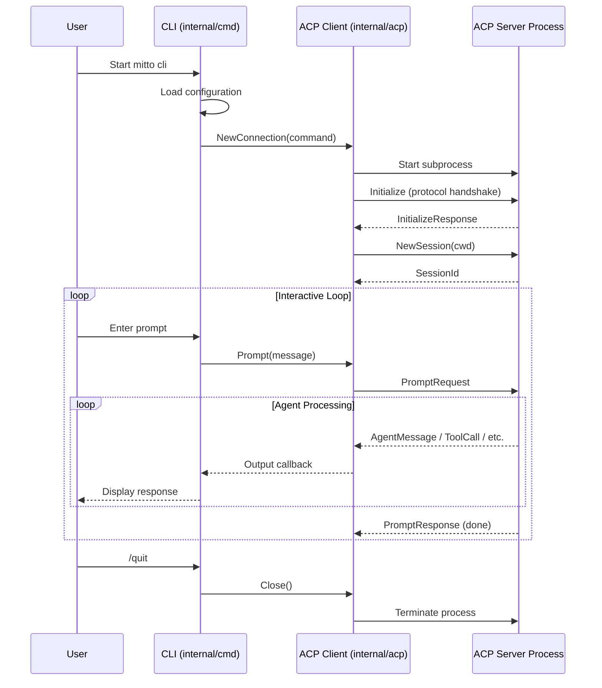
```mermaid
sequenceDiagram
    participant User
    participant CLI as CLI (internal/cmd)
    participant ACP as ACP Client (internal/acp)
    participant Agent as ACP Server Process

    User->>CLI: Start mitto cli
    CLI->>CLI: Load configuration
    CLI->>ACP: NewConnection(command)
    ACP->>Agent: Start subprocess
    ACP->>Agent: Initialize (protocol handshake)
    Agent-->>ACP: InitializeResponse
    ACP->>Agent: NewSession(cwd)
    Agent-->>ACP: SessionId

    loop Interactive Loop
        User->>CLI: Enter prompt
        CLI->>ACP: Prompt(message)
        ACP->>Agent: PromptRequest

        loop Agent Processing
            Agent-->>ACP: AgentMessage / ToolCall / etc.
            ACP-->>CLI: Output callback
            CLI-->>User: Display response
        end

        Agent-->>ACP: PromptResponse (done)
    end

    User->>CLI: /quit
    CLI->>ACP: Close()
    ACP->>Agent: Terminate process
```

### ACP Message Handling

The `Client` struct in `internal/acp/client.go` implements callbacks for various ACP events:

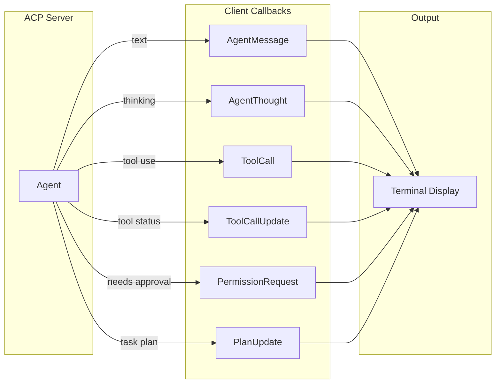
```mermaid
flowchart LR
    subgraph "ACP Server"
        A[Agent]
    end

    subgraph "Client Callbacks"
        AM[AgentMessage]
        AT[AgentThought]
        TC[ToolCall]
        TCU[ToolCallUpdate]
        PR[PermissionRequest]
        PU[PlanUpdate]
    end

    subgraph "Output"
        OUT[Terminal Display]
    end

    A -->|text| AM --> OUT
    A -->|thinking| AT --> OUT
    A -->|tool use| TC --> OUT
    A -->|tool status| TCU --> OUT
    A -->|needs approval| PR --> OUT
    A -->|task plan| PU --> OUT
```

## Session Management

### Session Recording Flow

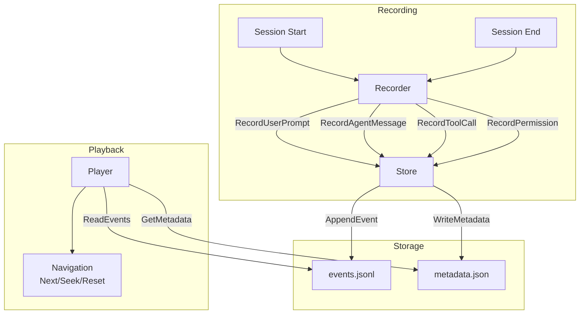
```mermaid
flowchart TB
    subgraph "Recording"
        START[Session Start] --> REC[Recorder]
        REC --> |RecordUserPrompt| STORE[Store]
        REC --> |RecordAgentMessage| STORE
        REC --> |RecordToolCall| STORE
        REC --> |RecordPermission| STORE
        END[Session End] --> REC
    end

    subgraph "Storage"
        STORE --> |AppendEvent| JSONL[events.jsonl]
        STORE --> |WriteMetadata| META[metadata.json]
    end

    subgraph "Playback"
        PLAYER[Player] --> |ReadEvents| JSONL
        PLAYER --> |GetMetadata| META
        PLAYER --> NAV[Navigation<br/>Next/Seek/Reset]
    end
```

### Session Lifecycle

1. **Creation**: `Recorder.Start()` creates session directory and files
2. **Recording**: Events appended via `Recorder.Record*()` methods
3. **Completion**: `Recorder.End()` marks session as completed
4. **Playback**: `Player` loads events for review/replay

### Event Types

| Event Type | Description |
|------------|-------------|
| `session_start` | Session initialization with metadata |
| `session_end` | Session termination with reason |
| `user_prompt` | User input message |
| `agent_message` | Agent response text |
| `agent_thought` | Agent's internal reasoning |
| `tool_call` | Tool invocation by agent |
| `tool_call_update` | Tool execution status update |
| `plan` | Agent's task plan |
| `permission` | Permission request and outcome |
| `file_read` | File read operation |
| `file_write` | File write operation |
| `error` | Error occurrence |

### Session State Ownership Model

Session state is distributed across multiple components with clear ownership boundaries:

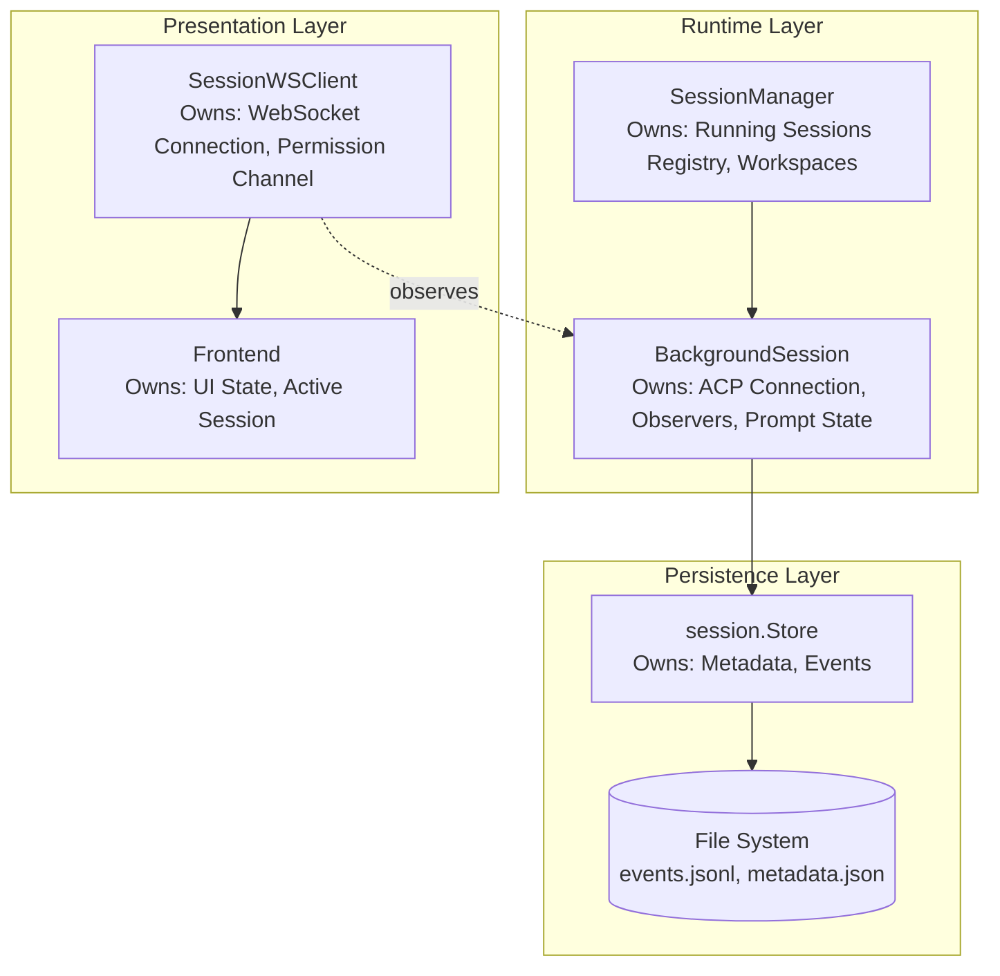
```mermaid
graph TB
    subgraph "Persistence Layer"
        STORE[session.Store<br/>Owns: Metadata, Events]
        FS[(File System<br/>events.jsonl, metadata.json)]
        STORE --> FS
    end

    subgraph "Runtime Layer"
        BS[BackgroundSession<br/>Owns: ACP Connection, Observers, Prompt State]
        SM[SessionManager<br/>Owns: Running Sessions Registry, Workspaces]
        SM --> BS
    end

    subgraph "Presentation Layer"
        WSC[SessionWSClient<br/>Owns: WebSocket Connection, Permission Channel]
        FE[Frontend<br/>Owns: UI State, Active Session]
        WSC --> FE
    end

    BS --> STORE
    WSC -.->|observes| BS
```

**Component Responsibilities:**

| Component | Owns | Does NOT Own |
|-----------|------|--------------|
| `session.Store` | Persisted metadata, event log, file I/O | Runtime state, ACP connection |
| `BackgroundSession` | ACP process, observers, prompt state, message buffers | Persistence (delegates to Store), UI state |
| `SessionManager` | Running session registry, workspace config, session limits | Individual session state, persistence |
| `SessionWSClient` | WebSocket connection, permission response channel | Session lifecycle, persistence |
| Frontend | UI state, active session selection, message display | Backend state, persistence |

**State Flow:**

1. **Session Creation**: `SessionManager` creates `BackgroundSession`, which creates `session.Recorder` (wraps `Store`)
2. **Runtime Updates**: `BackgroundSession` notifies observers via `SessionObserver` interface
3. **Persistence**: `BackgroundSession` delegates to `Recorder` which writes to `Store`
4. **UI Updates**: `SessionWSClient` (observer) forwards events to frontend via WebSocket

**Observer Pattern:**

`BackgroundSession` uses the observer pattern to decouple from WebSocket clients:

```go
// SessionObserver receives real-time updates from a BackgroundSession
type SessionObserver interface {
    OnAgentMessage(html string)
    OnAgentThought(text string)
    OnToolCall(id, title, status string)
    OnToolUpdate(id string, status *string)
    OnPlan()
    OnFileWrite(path string, size int)
    OnFileRead(path string, size int)
    OnPermission(ctx context.Context, params acp.RequestPermissionRequest) (acp.RequestPermissionResponse, error)
    OnPromptComplete(eventCount int)
    OnError(message string)
    GetClientID() string
}
```

Multiple `SessionWSClient` instances can observe the same `BackgroundSession`, enabling:
- Multiple browser tabs viewing the same session
- Session continues running when all clients disconnect
- Clients can reconnect and sync via incremental updates

### Message Queue System

Each session has an optional message queue that allows users to queue messages while the agent is processing. Queued messages are automatically delivered when the agent becomes idle.

#### Overview

The queue system enables a "fire-and-forget" workflow where users can queue multiple messages without waiting for each response. This is useful when:
- Providing follow-up context while the agent is still working
- Queuing multiple tasks for sequential processing
- Building automated workflows that submit work to the agent

#### Queue Package (`internal/session/queue.go`)

The `Queue` type manages the message queue for a single session. It provides thread-safe FIFO operations with atomic file persistence.

**Key Types:**

| Type | Purpose |
|------|---------|
| `Queue` | Thread-safe queue manager for a session |
| `QueuedMessage` | A message waiting to be sent to the agent |
| `QueueFile` | The persisted queue state on disk |

**Queue Methods:**

| Method | Description |
|--------|-------------|
| `NewQueue(sessionDir)` | Creates a queue for the given session directory |
| `Add(message, imageIDs, clientID)` | Adds a message to the queue, returns assigned ID |
| `List()` | Returns all queued messages in FIFO order |
| `Get(id)` | Returns a specific message by ID |
| `Remove(id)` | Removes a specific message by ID |
| `Pop()` | Removes and returns the first message (FIFO) |
| `Clear()` | Removes all queued messages |
| `Len()` | Returns the number of queued messages |
| `IsEmpty()` | Returns true if the queue has no messages |
| `Delete()` | Deletes the queue file (for session cleanup) |

**Error Values:**

| Error | Condition |
|-------|-----------|
| `ErrQueueEmpty` | Returned by `Pop()` when queue is empty |
| `ErrMessageNotFound` | Returned by `Get()` or `Remove()` when ID not found |

**Usage Example:**

```go
// Get queue for a session
queue := store.Queue(sessionID)

// Add a message
msg, err := queue.Add("What's the status?", nil, "client-123")
if err != nil {
    return err
}
fmt.Printf("Queued message %s\n", msg.ID)

// Process next message when agent is idle
msg, err := queue.Pop()
if errors.Is(err, session.ErrQueueEmpty) {
    // Nothing to process
    return nil
}
// Send msg.Message to agent...
```

#### Message ID Format

Message IDs use the format `q-{unix_timestamp}-{random_hex}`:
```
q-1738396800-abc12345
```

This format provides:
- **Uniqueness**: Timestamp + random hex ensures no collisions
- **Sortability**: IDs sort chronologically by queue time
- **Debuggability**: Human-readable timestamp for troubleshooting

#### Thread Safety

The `Queue` type uses a mutex to ensure thread-safe operations:
- Multiple goroutines can safely call queue methods concurrently
- File I/O is atomic (write to temp file → sync → rename)
- The mutex is held only during the read-modify-write cycle

#### Queue Storage

**File Location:**

```
sessions/
└── {session_id}/
    ├── events.jsonl      # Event log
    ├── metadata.json     # Session metadata
    └── queue.json        # Message queue
```

**Queue File Format (`queue.json`):**

```json
{
  "messages": [
    {
      "id": "q-1738396800-abc12345",
      "message": "What's the status?",
      "image_ids": [],
      "queued_at": "2026-02-01T12:00:00Z",
      "client_id": "a1b2c3d4"
    }
  ],
  "updated_at": "2026-02-01T12:00:00Z"
}
```

**Design Decisions:**

1. **Separate file**: Queue state is stored in `queue.json` rather than `events.jsonl` because:
   - Queue is transient (messages are removed when processed)
   - Events are append-only (queue requires modification)
   - Easier to clear queue without touching event history

2. **Atomic writes**: Uses `fileutil.WriteJSONAtomic()` to prevent corruption during crashes

3. **No max size limit**: Queues are expected to be small; users manually add messages

#### REST API Endpoints

| Method | Path | Description |
|--------|------|-------------|
| `GET` | `/api/sessions/{id}/queue` | List all queued messages |
| `POST` | `/api/sessions/{id}/queue` | Add a message to the queue |
| `GET` | `/api/sessions/{id}/queue/{msg_id}` | Get a specific message |
| `DELETE` | `/api/sessions/{id}/queue/{msg_id}` | Delete a specific message |
| `DELETE` | `/api/sessions/{id}/queue` | Clear entire queue |

**Request/Response Examples:**

*POST /api/sessions/{id}/queue*
```json
// Request
{"message": "What's the status?", "image_ids": []}

// Response (201 Created)
{
  "id": "q-1738396800-abc12345",
  "message": "What's the status?",
  "queued_at": "2026-02-01T12:00:00Z"
}
```

*GET /api/sessions/{id}/queue*
```json
// Response (200 OK)
{
  "messages": [...],
  "count": 3
}
```

#### Queue Processing Flow

When the agent finishes processing a prompt, the `BackgroundSession` automatically checks for queued messages and sends the next one:

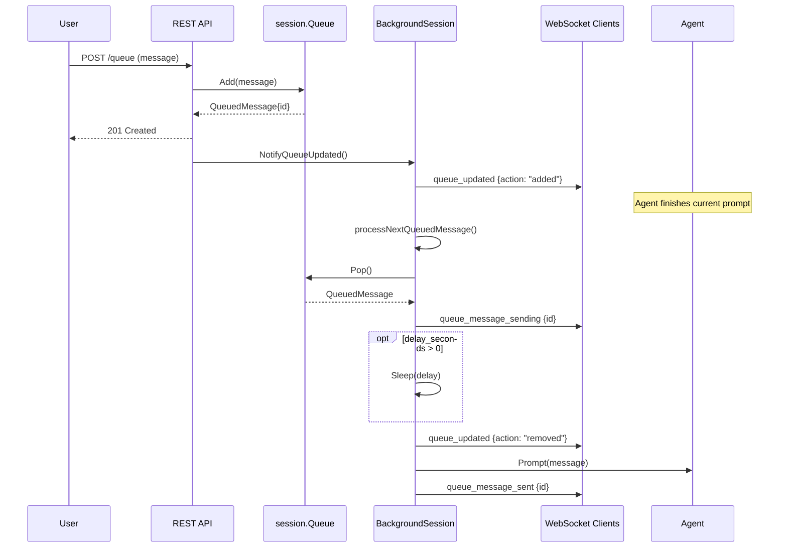
```mermaid
sequenceDiagram
    participant User
    participant API as REST API
    participant Queue as session.Queue
    participant BS as BackgroundSession
    participant WS as WebSocket Clients
    participant Agent

    User->>API: POST /queue (message)
    API->>Queue: Add(message)
    Queue-->>API: QueuedMessage{id}
    API-->>User: 201 Created
    API->>BS: NotifyQueueUpdated()
    BS->>WS: queue_updated {action: "added"}

    Note over Agent: Agent finishes current prompt

    BS->>BS: processNextQueuedMessage()
    BS->>Queue: Pop()
    Queue-->>BS: QueuedMessage
    BS->>WS: queue_message_sending {id}
    opt delay_seconds > 0
        BS->>BS: Sleep(delay)
    end
    BS->>WS: queue_updated {action: "removed"}
    BS->>Agent: Prompt(message)
    BS->>WS: queue_message_sent {id}
```

**Key Implementation Details:**

1. **Automatic processing**: `processNextQueuedMessage()` is called in `onPromptComplete()` callback
2. **Configurable delay**: `delay_seconds` allows pacing between queued messages
3. **Observer notifications**: All connected WebSocket clients are notified of queue changes
4. **Sender ID**: Queued messages use `"queue"` as the sender ID for UI differentiation

#### Queue Configuration

Queue processing is configured in the `conversations` section of the config file:

```yaml
conversations:
  queue:
    enabled: true        # Enable/disable auto-processing (default: true)
    delay_seconds: 0     # Delay before sending next message (default: 0)
```

**Configuration Types (in `internal/config/config.go`):**

```go
// QueueConfig represents message queue processing configuration.
type QueueConfig struct {
    // Enabled controls whether queued messages are automatically sent.
    // When false, messages remain in queue until manually sent or deleted.
    // Default: true (enabled)
    Enabled *bool `json:"enabled,omitempty" yaml:"enabled,omitempty"`

    // DelaySeconds is the delay before sending the next queued message.
    // Default: 0 (no delay)
    DelaySeconds int `json:"delay_seconds,omitempty" yaml:"delay_seconds,omitempty"`
}

// IsEnabled returns whether queue processing is enabled.
// Returns true if Enabled is nil (default) or explicitly true.
func (q *QueueConfig) IsEnabled() bool

// GetDelaySeconds returns the delay in seconds, or 0 if not configured.
func (q *QueueConfig) GetDelaySeconds() int
```

**Configuration Precedence:**
1. If `enabled` is not set, queue processing is **enabled** by default
2. If `delay_seconds` is not set, defaults to **0** (no delay)

#### WebSocket Notifications

The queue system sends real-time notifications to connected WebSocket clients via the `SessionObserver` interface:

| Notification | When | Data |
|--------------|------|------|
| `queue_updated` | Message added/removed/cleared | `{queue_length, action, message_id}` |
| `queue_message_sending` | Queued message about to be sent | `{message_id}` |
| `queue_message_sent` | Queued message was delivered | `{message_id}` |

**SessionObserver Interface (in `internal/web/observer.go`):**

```go
// Queue-related observer methods
OnQueueUpdated(queueLength int, action string, messageID string)
OnQueueMessageSending(messageID string)
OnQueueMessageSent(messageID string)
```

**Action Values for `queue_updated`:**

| Action | Trigger |
|--------|---------|
| `added` | Message added via REST API |
| `removed` | Message removed (via API or after sending) |
| `cleared` | Queue cleared via DELETE endpoint |

#### Store Integration

The `session.Store` provides access to queues via the `Queue()` method:

```go
// Queue returns a Queue instance for managing the message queue of a session.
// The returned Queue is safe for concurrent use.
func (s *Store) Queue(sessionID string) *Queue
```

This method creates a new `Queue` instance pointing to the session's directory. Multiple calls return independent instances that share the same underlying file.

## Web Interface

The web interface provides a browser-based UI for ACP communication, accessible via `mitto web`.

### Architecture Overview

```mermaid
graph TB
    subgraph "Browser"
        UI[Preact UI]
        EVENTS_WS[Events WebSocket<br/>/api/events]
        SESSION_WS[Session WebSocket<br/>/api/sessions/{id}/ws]
    end

    subgraph "Mitto Web Server"
        HTTP[HTTP Server]
        EVENTS_MGR[GlobalEventsManager]
        SESSION_WSC[SessionWSClient]
        BG_SESSION[BackgroundSession]
        MD_BUF[Markdown Buffer]
        WEB_CLIENT[Web ACP Client]
    end

    subgraph "ACP Server"
        AGENT[AI Agent]
    end

    UI <--> EVENTS_WS
    UI <--> SESSION_WS
    EVENTS_WS <-->|lifecycle events| EVENTS_MGR
    SESSION_WS <-->|session events| SESSION_WSC
    HTTP -->|Static Files| UI
    SESSION_WSC -.->|observes| BG_SESSION
    BG_SESSION --> WEB_CLIENT
    WEB_CLIENT <-->|stdin/stdout| AGENT
    WEB_CLIENT -->|chunks| MD_BUF
    MD_BUF -->|HTML| BG_SESSION
```

### WebSocket Endpoints

The web interface uses two WebSocket endpoints:

| Endpoint | Handler | Purpose |
|----------|---------|---------|
| `/api/events` | `GlobalEventsClient` | Session lifecycle events (created, deleted, renamed) |
| `/api/sessions/{id}/ws` | `SessionWSClient` | Per-session communication (prompts, responses, tools) |

This separation allows:
- Global events to be broadcast to all connected clients
- Per-session events to be scoped to interested clients only
- Sessions to continue running when no clients are connected

### Streaming Response Handling

The ACP agent sends responses as text chunks via `SessionUpdate` callbacks. The web interface maintains real-time streaming while converting Markdown to HTML:

1. **Chunk Reception**: `WebClient.SessionUpdate()` receives `AgentMessageChunk` events
2. **Smart Buffering**: `MarkdownBuffer` accumulates chunks until semantic boundaries
3. **HTML Conversion**: Goldmark converts buffered Markdown to HTML
4. **WebSocket Delivery**: HTML chunks sent immediately to browser
5. **Frontend Rendering**: Preact renders HTML via `dangerouslySetInnerHTML`

### Markdown Buffer Strategy

The `MarkdownBuffer` balances real-time streaming with correct Markdown rendering:

| Flush Trigger | Condition | Rationale |
|---------------|-----------|-----------|
| Line complete | `\n` received | Most content is line-based |
| Code block end | Closing ``` | Don't break syntax highlighting |
| Paragraph break | `\n\n` | Natural semantic boundary |
| Timeout | 200ms idle | Ensure eventual delivery |
| Buffer limit | 4KB accumulated | Prevent memory issues |

### WebSocket Protocol

**Frontend → Backend:**

| Type | Data | Description |
|------|------|-------------|
| `new_session` | `{}` | Create new ACP session |
| `prompt` | `{"message": "string"}` | Send user message |
| `cancel` | `{}` | Cancel current operation |
| `load_session` | `{"session_id": "string"}` | Load past session |
| `permission_answer` | `{"option_id": "string", "cancel": bool}` | Respond to permission request |
| `sync_session` | `{"session_id": "string", "after_seq": number}` | Request events after sequence number (for resync) |

**Backend → Frontend:**

| Type | Data | Description |
|------|------|-------------|
| `connected` | `{"acp_server": "string", "session_id": "string"}` | Connection established |
| `agent_message` | `{"html": "string", "format": "html"}` | HTML-formatted response chunk |
| `agent_thought` | `{"text": "string"}` | Agent thinking (plain text) |
| `tool_call` | `{"id": "string", "title": "string", "status": "string"}` | Tool invoked |
| `tool_update` | `{"id": "string", "status": "string"}` | Tool status update |
| `permission` | `{"title": "string", "options": [...]}` | Permission request |
| `prompt_complete` | `{"event_count": number}` | End of response signal with current event count |
| `session_sync` | `{"events": [...], "last_seq": number}` | Response to sync_session with missed events |
| `error` | `{"message": "string"}` | Error notification |

### Mobile Wake Resync

Mobile browsers (iOS Safari, Android Chrome) suspend WebSocket connections when the device sleeps. When the user wakes their phone, the app may show stale data. The frontend implements a resync mechanism to catch up on missed events.

**Problem Scenario:**
1. User opens Mitto on phone, views a conversation
2. Phone goes to sleep (screen off)
3. WebSocket connection is terminated by the browser
4. Agent continues processing in the background (server-side)
5. User wakes phone - UI shows stale messages

**Solution Architecture:**

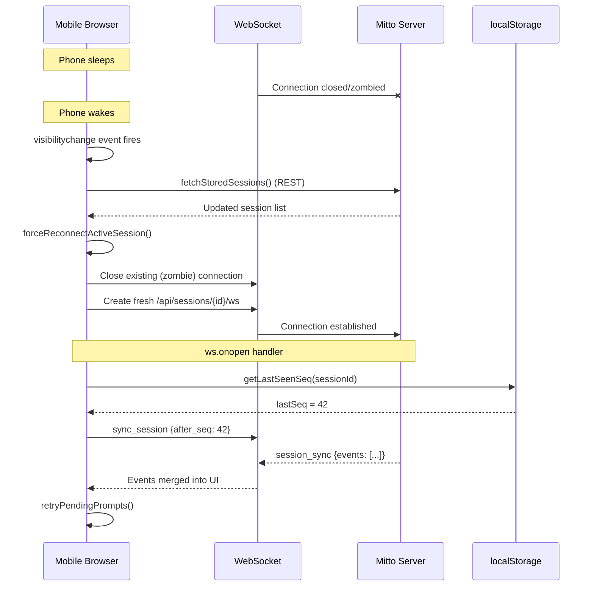
```mermaid
sequenceDiagram
    participant Phone as Mobile Browser
    participant WS as WebSocket
    participant Server as Mitto Server
    participant Storage as localStorage

    Note over Phone: Phone sleeps
    WS-xServer: Connection closed/zombied

    Note over Phone: Phone wakes
    Phone->>Phone: visibilitychange event fires
    Phone->>Server: fetchStoredSessions() (REST)
    Server-->>Phone: Updated session list

    Phone->>Phone: forceReconnectActiveSession()
    Phone->>WS: Close existing (zombie) connection
    Phone->>WS: Create fresh /api/sessions/{id}/ws
    WS->>Server: Connection established

    Note over Phone,Server: ws.onopen handler
    Phone->>Storage: getLastSeenSeq(sessionId)
    Storage-->>Phone: lastSeq = 42
    Phone->>WS: sync_session {after_seq: 42}
    Server-->>WS: session_sync {events: [...]}
    WS-->>Phone: Events merged into UI

    Phone->>Phone: retryPendingPrompts()
```

**The Zombie Connection Problem:**

Mobile browsers (especially iOS Safari) may keep WebSocket connections in a "zombie" state after the phone sleeps. The connection appears open (`readyState === OPEN`) but is actually dead. Simply trying to send messages over this connection fails silently.

**Solution: Force Reconnect**

Rather than trying to detect if a connection is healthy, the safest approach is to force a fresh reconnection whenever the app becomes visible. This ensures a clean connection state.

**Key Components:**

| Component | Purpose |
|-----------|---------|
| `forceReconnectActiveSession` | Closes existing WebSocket and creates fresh connection |
| `lastSeenSeq` | Sequence number of last received event (stored in localStorage) |
| `sync_session` | WebSocket message type to request events after a given sequence |
| `visibilitychange` | Browser event fired when app becomes visible |

**Sync Triggers:**

1. **WebSocket Connect** (`ws.onopen`):
   - When per-session WebSocket connects, sends `sync_session` with `lastSeenSeq`
   - Catches up on events missed during disconnection
   - Retries pending prompts after 500ms

2. **Visibility Change** (`document.visibilityState === 'visible'`):
   - Refreshes session list via REST API
   - Forces WebSocket reconnect (closes zombie, creates fresh connection)
   - The fresh connection triggers sync via `ws.onopen`

**Sequence Number Tracking:**

The `lastSeenSeq` is updated in these scenarios:
- **Session load**: Set to highest sequence number from loaded events
- **Prompt complete**: Updated from `event_count` in server response
- **Session sync**: Updated after receiving sync response

**Backend Support:**

The `handleSyncSession` function in `session_ws.go` handles incremental sync:

```go
// Client sends: {"type": "sync_session", "data": {"session_id": "...", "after_seq": 42}}
// Server responds with events where seq > 42
```

## WebSocket Message Handling Architecture

This section documents the WebSocket message handling system, including how message order is guaranteed, how clients resync after disconnection, and how reconnections are managed.

### Message Ordering

Message ordering is critical for ensuring all clients display conversations correctly. The system uses a **unified event buffer** to preserve streaming order and **sequence numbers** for tracking.

#### Unified Event Buffer

All streaming events (agent messages, thoughts, tool calls, file operations) are buffered in a single `EventBuffer` during a prompt. Events are stored in the order they arrive and persisted together when the prompt completes.

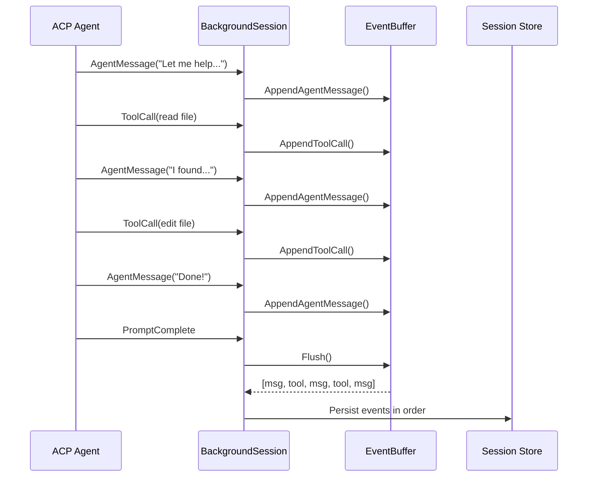
```mermaid
sequenceDiagram
    participant Agent as ACP Agent
    participant BS as BackgroundSession
    participant Buffer as EventBuffer
    participant Store as Session Store

    Agent->>BS: AgentMessage("Let me help...")
    BS->>Buffer: AppendAgentMessage()

    Agent->>BS: ToolCall(read file)
    BS->>Buffer: AppendToolCall()

    Agent->>BS: AgentMessage("I found...")
    BS->>Buffer: AppendAgentMessage()

    Agent->>BS: ToolCall(edit file)
    BS->>Buffer: AppendToolCall()

    Agent->>BS: AgentMessage("Done!")
    BS->>Buffer: AppendAgentMessage()

    Agent->>BS: PromptComplete
    BS->>Buffer: Flush()
    Buffer-->>BS: [msg, tool, msg, tool, msg]
    BS->>Store: Persist events in order
```

This ensures events are persisted in the correct streaming order, preserving the interleaving of agent messages and tool calls.

#### Sequence Number Assignment

Every event persisted to the session store is assigned a monotonically increasing sequence number (`seq`). The sequence number is assigned at persistence time by `session.Store.AppendEvent()`.

**Key properties:**
- `seq` starts at 1 for each session
- `seq` is assigned at persistence time, not at event creation
- `seq` is never reused or reassigned
- Events are stored in `seq` order in `events.jsonl`

#### Frontend Ordering Strategy

The frontend preserves message order using these principles:

1. **Streaming messages** are displayed in the order they arrive via WebSocket
2. **Loaded sessions** use the order from `events.jsonl` (which preserves streaming order)
3. **Sync messages** are appended at the end (they represent events that happened AFTER the last seen event)
4. **Deduplication** prevents the same message from appearing twice

### Message Format

All WebSocket messages use a JSON envelope format with `type` and optional `data` fields.

#### Frontend → Backend Messages

| Type | Data | Description |
|------|------|-------------|
| `prompt` | `{message, image_ids?, prompt_id}` | Send user message to agent |
| `cancel` | `{}` | Cancel current agent operation |
| `permission_answer` | `{request_id, approved}` | Respond to permission request |
| `sync_session` | `{after_seq}` | Request events after sequence number |
| `keepalive` | `{client_time}` | Application-level keepalive |
| `rename_session` | `{name}` | Rename the current session |

#### Backend → Frontend Messages

| Type | Data | Description |
|------|------|-------------|
| `connected` | `{session_id, client_id, acp_server, is_running}` | Connection established |
| `prompt_received` | `{prompt_id}` | ACK that prompt was received and persisted |
| `user_prompt` | `{sender_id, prompt_id, message, is_mine}` | Broadcast of user prompt to all clients |
| `agent_message` | `{html}` | HTML-rendered agent response chunk |
| `agent_thought` | `{text}` | Agent thinking/reasoning (plain text) |
| `tool_call` | `{id, title, status}` | Tool invocation notification |
| `tool_update` | `{id, status}` | Tool status update |
| `permission` | `{request_id, title, description, options}` | Permission request |
| `prompt_complete` | `{event_count}` | Agent finished responding |
| `session_sync` | `{events, event_count, is_running, is_prompting}` | Response to sync request |
| `error` | `{message, code?}` | Error notification |

### Replay of Missing Content

When a client connects mid-stream (while the agent is actively responding), it needs to catch up on content that has been streamed but not yet persisted.

#### The Problem

Agent messages and thoughts are **buffered** during streaming and only **persisted** when the prompt completes. A client connecting mid-stream would miss buffered content.

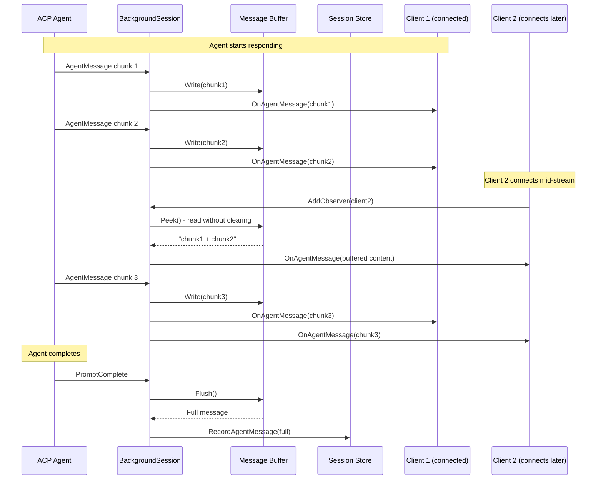
```mermaid
sequenceDiagram
    participant Agent as ACP Agent
    participant BS as BackgroundSession
    participant Buffer as Message Buffer
    participant Store as Session Store
    participant Client1 as Client 1 (connected)
    participant Client2 as Client 2 (connects later)

    Note over Agent,Client1: Agent starts responding
    Agent->>BS: AgentMessage chunk 1
    BS->>Buffer: Write(chunk1)
    BS->>Client1: OnAgentMessage(chunk1)

    Agent->>BS: AgentMessage chunk 2
    BS->>Buffer: Write(chunk2)
    BS->>Client1: OnAgentMessage(chunk2)

    Note over Client2: Client 2 connects mid-stream
    Client2->>BS: AddObserver(client2)
    BS->>Buffer: Peek() - read without clearing
    Buffer-->>BS: "chunk1 + chunk2"
    BS->>Client2: OnAgentMessage(buffered content)

    Agent->>BS: AgentMessage chunk 3
    BS->>Buffer: Write(chunk3)
    BS->>Client1: OnAgentMessage(chunk3)
    BS->>Client2: OnAgentMessage(chunk3)

    Note over Agent: Agent completes
    Agent->>BS: PromptComplete
    BS->>Buffer: Flush()
    Buffer-->>BS: Full message
    BS->>Store: RecordAgentMessage(full)
```

#### The Solution

When a new observer connects to a `BackgroundSession`, the session checks if it's currently prompting. If so, it sends any buffered thought and message content to the new observer using `Peek()` (which reads without clearing the buffer).

**Key methods in `agentMessageBuffer`:**
- `Peek()`: Returns buffer content without clearing it
- `Flush()`: Returns buffer content and clears it (used at prompt completion)

This ensures all clients see the same content, regardless of when they connect.

### Resync Mechanism

The resync mechanism allows clients to catch up on events they missed while disconnected (e.g., phone sleep, network loss).

#### Sequence Number Tracking

The frontend tracks the last seen sequence number in localStorage. This is updated when:
- Loading a session (set to highest `seq` from loaded events)
- Receiving `prompt_complete` (updated from `event_count` field)
- Receiving `session_sync` (updated after merge)

#### Sync Request Flow

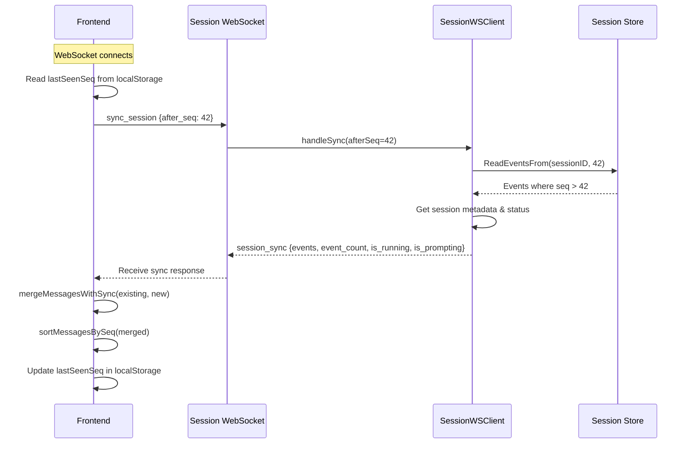
```mermaid
sequenceDiagram
    participant Client as Frontend
    participant WS as Session WebSocket
    participant Handler as SessionWSClient
    participant Store as Session Store

    Note over Client: WebSocket connects
    Client->>Client: Read lastSeenSeq from localStorage
    Client->>WS: sync_session {after_seq: 42}
    WS->>Handler: handleSync(afterSeq=42)
    Handler->>Store: ReadEventsFrom(sessionID, 42)
    Store-->>Handler: Events where seq > 42
    Handler->>Handler: Get session metadata & status
    Handler-->>WS: session_sync {events, event_count, is_running, is_prompting}
    WS-->>Client: Receive sync response
    Client->>Client: mergeMessagesWithSync(existing, new)
    Client->>Client: sortMessagesBySeq(merged)
    Client->>Client: Update lastSeenSeq in localStorage
```

#### Merge and Deduplication

When sync events arrive, they're merged with existing messages using `mergeMessagesWithSync()` which:
1. Creates a hash set of existing messages for deduplication
2. Filters out duplicates from new messages
3. Merges both lists and sorts by `seq`

This handles the case where some messages were received via streaming (no `seq`) and the same messages arrive via sync (with `seq`).

### Reconnection Handling

The reconnection system handles WebSocket disconnections gracefully, including the "zombie connection" problem on mobile devices.

#### The Zombie Connection Problem

Mobile browsers (especially iOS Safari) may keep WebSocket connections in a "zombie" state after the phone sleeps:
- `readyState === OPEN` (appears connected)
- Actually dead (messages fail silently)
- No `onclose` event fired

#### Force Reconnect Strategy

Rather than detecting zombie connections, the frontend forces a fresh reconnection when the app becomes visible. This is more reliable than trying to detect stale connections.

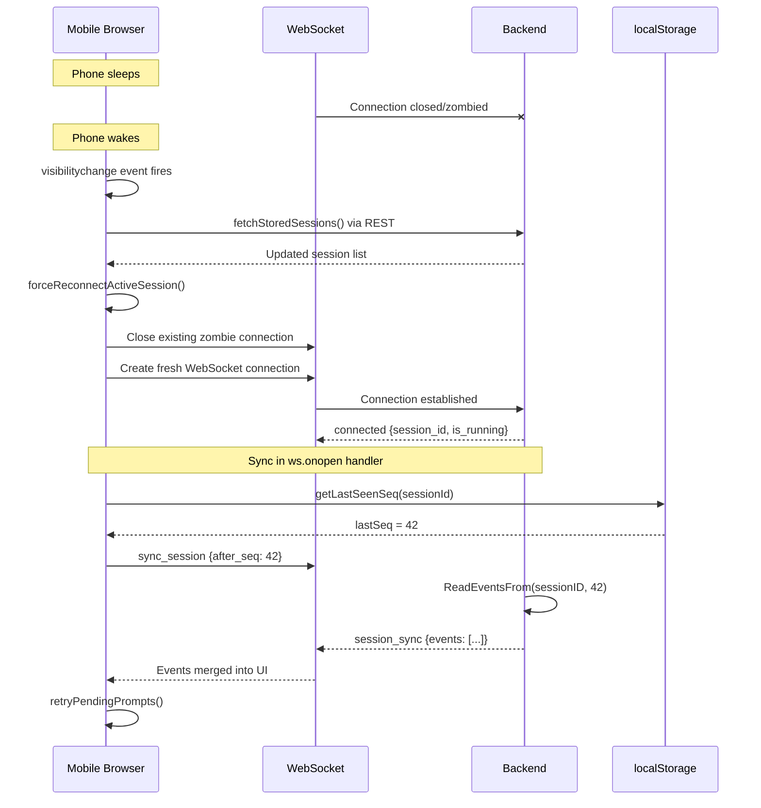
```mermaid
sequenceDiagram
    participant Phone as Mobile Browser
    participant WS as WebSocket
    participant Server as Backend
    participant Storage as localStorage

    Note over Phone: Phone sleeps
    WS-xServer: Connection closed/zombied

    Note over Phone: Phone wakes
    Phone->>Phone: visibilitychange event fires
    Phone->>Server: fetchStoredSessions() via REST
    Server-->>Phone: Updated session list

    Phone->>Phone: forceReconnectActiveSession()
    Phone->>WS: Close existing zombie connection
    Phone->>WS: Create fresh WebSocket connection

    WS->>Server: Connection established
    Server-->>WS: connected {session_id, is_running}

    Note over Phone,Server: Sync in ws.onopen handler
    Phone->>Storage: getLastSeenSeq(sessionId)
    Storage-->>Phone: lastSeq = 42
    Phone->>WS: sync_session {after_seq: 42}
    Server->>Server: ReadEventsFrom(sessionID, 42)
    Server-->>WS: session_sync {events: [...]}
    WS-->>Phone: Events merged into UI

    Phone->>Phone: retryPendingPrompts()
```

#### Automatic Reconnection on Close

When a WebSocket closes unexpectedly, the frontend schedules a reconnection after a 2-second delay. The reconnection only occurs if:
- The session is still the active session
- No newer WebSocket has been created for that session

#### Pending Prompt Retry

Prompts are saved to localStorage before sending (with a unique `prompt_id`). After reconnection, any prompts that weren't acknowledged are automatically retried. Prompts older than 5 minutes are cleaned up to prevent stale retries.

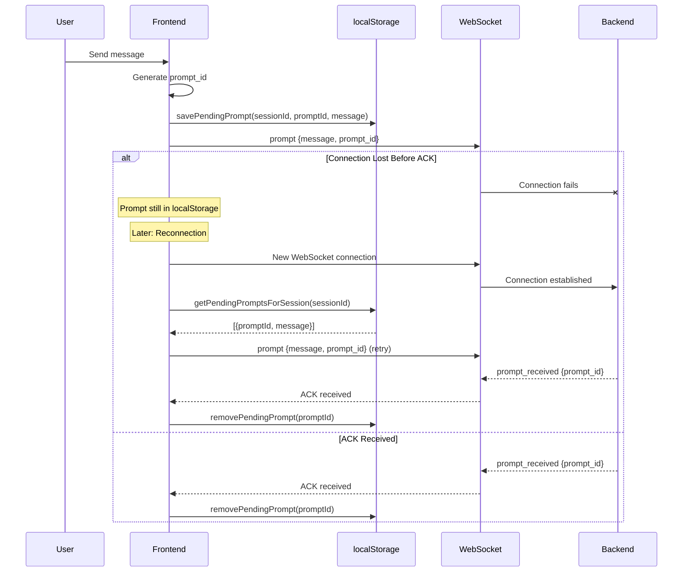
```mermaid
sequenceDiagram
    participant User
    participant Frontend
    participant Storage as localStorage
    participant WS as WebSocket
    participant Server as Backend

    User->>Frontend: Send message
    Frontend->>Frontend: Generate prompt_id
    Frontend->>Storage: savePendingPrompt(sessionId, promptId, message)
    Frontend->>WS: prompt {message, prompt_id}

    alt Connection Lost Before ACK
        WS-xServer: Connection fails
        Note over Frontend: Prompt still in localStorage

        Note over Frontend: Later: Reconnection
        Frontend->>WS: New WebSocket connection
        WS->>Server: Connection established
        Frontend->>Storage: getPendingPromptsForSession(sessionId)
        Storage-->>Frontend: [{promptId, message}]
        Frontend->>WS: prompt {message, prompt_id} (retry)
        Server-->>WS: prompt_received {prompt_id}
        WS-->>Frontend: ACK received
        Frontend->>Storage: removePendingPrompt(promptId)
    else ACK Received
        Server-->>WS: prompt_received {prompt_id}
        WS-->>Frontend: ACK received
        Frontend->>Storage: removePendingPrompt(promptId)
    end
```

#### Multi-Client Prompt Broadcast

When multiple clients are connected to the same session, prompts are broadcast to all clients:

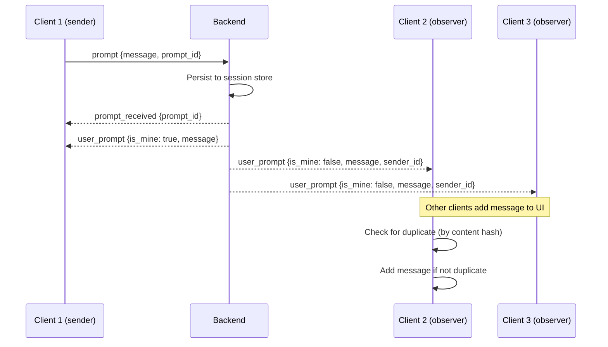
```mermaid
sequenceDiagram
    participant Client1 as Client 1 (sender)
    participant Server as Backend
    participant Client2 as Client 2 (observer)
    participant Client3 as Client 3 (observer)

    Client1->>Server: prompt {message, prompt_id}
    Server->>Server: Persist to session store
    Server-->>Client1: prompt_received {prompt_id}
    Server-->>Client1: user_prompt {is_mine: true, message}
    Server-->>Client2: user_prompt {is_mine: false, message, sender_id}
    Server-->>Client3: user_prompt {is_mine: false, message, sender_id}

    Note over Client2,Client3: Other clients add message to UI
    Client2->>Client2: Check for duplicate (by content hash)
    Client2->>Client2: Add message if not duplicate
```

### Frontend Technology

The frontend uses a CDN-first approach for zero build complexity:

| Library | Purpose | Size |
|---------|---------|------|
| Preact | UI framework | ~3KB |
| HTM | JSX-like syntax without build | ~1KB |
| Tailwind Play CDN | Styling | Runtime |

All assets are embedded in the Go binary via `go:embed`, enabling single-binary distribution.

### Component Structure

```
App
├── SessionList (sidebar)
│   └── SessionItem
├── Header (connection status, streaming indicator)
├── MessageList
│   ├── Message (user - plain text, blue bubble)
│   ├── Message (agent - HTML/Markdown, gray bubble)
│   ├── Message (thought - italic, purple accent)
│   ├── Message (tool - centered status badge)
│   ├── Message (error - red accent)
│   └── Message (system - centered, subtle)
├── ChatInput (textarea + send/cancel button)
├── WorkspaceDialog (workspace selection for new sessions)
├── WorkspaceConfigDialog (view/add/remove workspaces)
└── SessionPropertiesDialog (rename session, view workspace info)
```

### Responsive Design

- **Desktop (≥768px)**: Sidebar always visible, main chat area
- **Mobile (<768px)**: Sidebar hidden, hamburger menu to open overlay
- **Touch support**: Tap to open/close sidebar on mobile

## Multi-Workspace Architecture

The web interface supports multiple workspaces, where each workspace pairs a directory with an ACP server. This enables running different AI agents for different projects simultaneously.

### Workspace Configuration

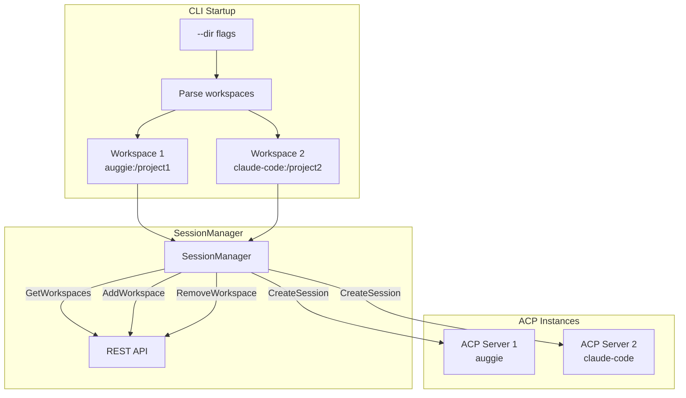
```mermaid
graph TB
    subgraph "CLI Startup"
        FLAGS[--dir flags] --> PARSE[Parse workspaces]
        PARSE --> WS1[Workspace 1<br/>auggie:/project1]
        PARSE --> WS2[Workspace 2<br/>claude-code:/project2]
    end

    subgraph "SessionManager"
        WS1 --> SM[SessionManager]
        WS2 --> SM
        SM --> |GetWorkspaces| API[REST API]
        SM --> |AddWorkspace| API
        SM --> |RemoveWorkspace| API
    end

    subgraph "ACP Instances"
        SM --> |CreateSession| ACP1[ACP Server 1<br/>auggie]
        SM --> |CreateSession| ACP2[ACP Server 2<br/>claude-code]
    end
```

### CLI Usage

```bash
# Single workspace (uses default ACP server and current directory)
mitto web

# Multiple workspaces with explicit directories
mitto web --dir /path/to/project1 --dir /path/to/project2

# Specify ACP server per workspace (server:path syntax)
mitto web --dir auggie:/path/to/project1 --dir claude-code:/path/to/project2

# Mix default and explicit servers
mitto web --dir /path/to/project1 --dir claude-code:/path/to/project2
```

### Workspace REST API

| Method | Endpoint | Description |
|--------|----------|-------------|
| GET | `/api/workspaces` | List all workspaces and available ACP servers |
| POST | `/api/workspaces` | Add a new workspace dynamically |
| DELETE | `/api/workspaces?dir=...` | Remove a workspace |

**GET /api/workspaces Response:**

```json
{
  "workspaces": [
    {
      "acp_server": "auggie",
      "acp_command": "auggie --acp",
      "working_dir": "/path/to/project1"
    },
    {
      "acp_server": "claude-code",
      "acp_command": "npx -y @zed-industries/claude-code-acp@latest",
      "working_dir": "/path/to/project2"
    }
  ],
  "acp_servers": [
    {"name": "auggie", "command": "auggie --acp"},
    {"name": "claude-code", "command": "npx -y @zed-industries/claude-code-acp@latest"}
  ]
}
```

**POST /api/workspaces Request:**

```json
{
  "working_dir": "/path/to/new/project",
  "acp_server": "auggie"
}
```

### Session Creation with Workspaces

When multiple workspaces are configured:

1. User clicks "New Session" button
2. If multiple workspaces exist, `WorkspaceDialog` opens for selection
3. User selects a workspace (directory + ACP server)
4. Session is created with the selected workspace's ACP server
5. Session metadata stores `working_dir` and `acp_server`

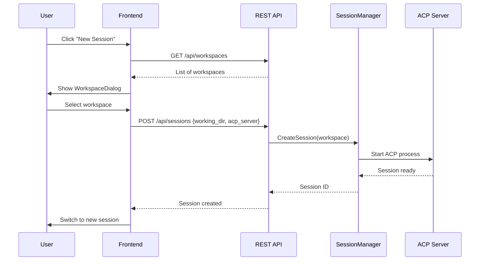
```mermaid
sequenceDiagram
    participant User
    participant UI as Frontend
    participant API as REST API
    participant SM as SessionManager
    participant ACP as ACP Server

    User->>UI: Click "New Session"
    UI->>API: GET /api/workspaces
    API-->>UI: List of workspaces
    UI->>User: Show WorkspaceDialog
    User->>UI: Select workspace
    UI->>API: POST /api/sessions {working_dir, acp_server}
    API->>SM: CreateSession(workspace)
    SM->>ACP: Start ACP process
    ACP-->>SM: Session ready
    SM-->>API: Session ID
    API-->>UI: Session created
    UI->>User: Switch to new session
```

### WorkspaceConfig Type

```go
// WorkspaceConfig represents an ACP server + working directory pair.
type WorkspaceConfig struct {
    // ACPServer is the name of the ACP server (from .mittorc config)
    ACPServer string `json:"acp_server"`
    // ACPCommand is the shell command to start the ACP server
    ACPCommand string `json:"acp_command"`
    // WorkingDir is the absolute path to the working directory
    WorkingDir string `json:"working_dir"`
}
```

### SessionManager Workspace Methods

| Method | Description |
|--------|-------------|
| `GetWorkspaces()` | Returns all configured workspaces |
| `GetWorkspace(workingDir)` | Returns workspace for a specific directory |
| `GetDefaultWorkspace()` | Returns the first (default) workspace |
| `AddWorkspace(ws)` | Dynamically adds a new workspace at runtime |
| `RemoveWorkspace(workingDir)` | Removes a workspace by directory path |

## File Structure

### Mitto Data Directory

**Platform-specific locations:**
- **macOS**: `~/Library/Application Support/Mitto/`
- **Linux**: `~/.local/share/mitto/`
- **Windows**: `%APPDATA%\Mitto\`
- **Override**: Set `MITTO_DIR` environment variable

### Workspace Persistence

Workspaces are persisted to `workspaces.json` when:
- Running the macOS app (always persists changes)
- Running CLI without `--dir` flags (loads from and saves to file)

Workspaces are NOT persisted when:
- Running CLI with `--dir` flags (CLI flags take precedence)

**workspaces.json:**
```json
{
  "workspaces": [
    {
      "acp_server": "auggie",
      "acp_command": "auggie --acp",
      "working_dir": "/path/to/project"
    }
  ]
}
```

### File Formats

**metadata.json:**
```json
{
  "session_id": "20260125-143052-a1b2c3d4",
  "acp_server": "auggie",
  "working_dir": "/home/user/project",
  "created_at": "2026-01-25T14:30:52Z",
  "updated_at": "2026-01-25T14:35:00Z",
  "event_count": 42,
  "status": "completed"
}
```

**events.jsonl:**
```jsonl
{"type":"session_start","timestamp":"2026-01-25T14:30:52Z","data":{"session_id":"...","acp_server":"auggie","working_dir":"/home/user/project"}}
{"type":"user_prompt","timestamp":"2026-01-25T14:30:55Z","data":{"message":"Hello, can you help me?"}}
{"type":"agent_message","timestamp":"2026-01-25T14:30:57Z","data":{"text":"Of course! What do you need help with?"}}
{"type":"session_end","timestamp":"2026-01-25T14:35:00Z","data":{"reason":"user_quit"}}
```

## Dependencies

### Core Dependencies

| Package | Purpose |
|---------|---------|
| `github.com/coder/acp-go-sdk` | ACP protocol implementation |
| `github.com/spf13/cobra` | CLI framework |
| `github.com/reeflective/readline` | Interactive input |
| `gopkg.in/yaml.v3` | YAML configuration parsing |

### Web Interface Dependencies

| Package | Purpose |
|---------|---------|
| `github.com/gorilla/websocket` | WebSocket support |
| `github.com/yuin/goldmark` | Markdown to HTML conversion |
| `github.com/yuin/goldmark-highlighting/v2` | Syntax highlighting for code blocks |

### Frontend Dependencies (CDN)

| Library | CDN | Purpose |
|---------|-----|---------|
| Preact | esm.sh | Lightweight React-like UI framework |
| HTM | esm.sh | JSX-like syntax without build step |
| Tailwind CSS | cdn.tailwindcss.com | Utility-first CSS framework |

## Future Considerations

1. **Permission Dialog**: Interactive UI for handling permission requests in web interface
2. **Session Loading**: Load and replay past sessions in web interface
3. **Session Search**: Index sessions for quick searching by content
4. **Session Export**: Export sessions to different formats (Markdown, HTML)
5. **Multiple Storage Backends**: Support for database or cloud storage
6. **Session Sharing**: Share sessions between users or machines
7. **Touch Gestures**: Swipe navigation for mobile web interface
