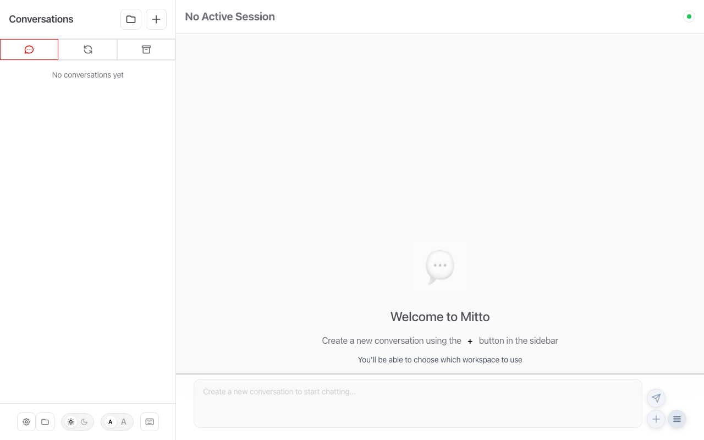
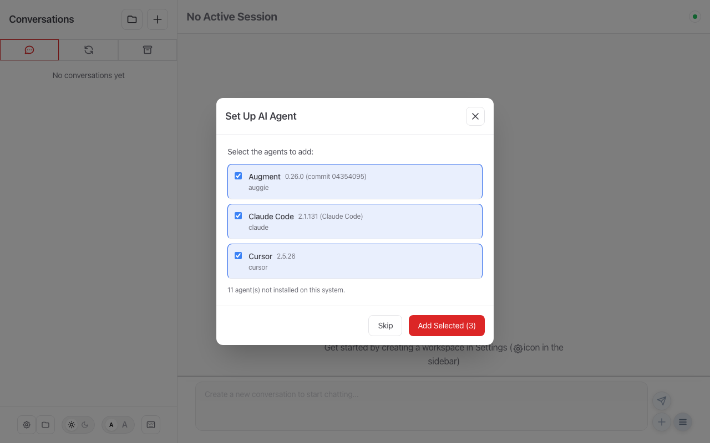
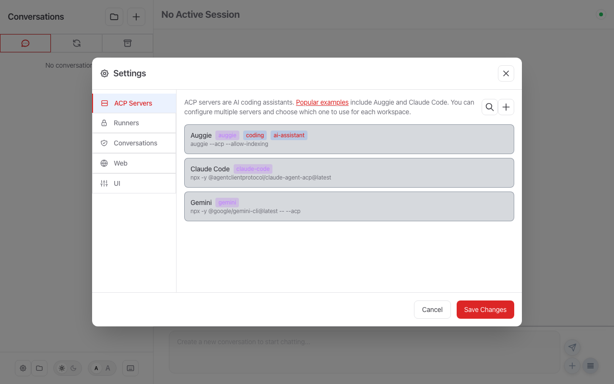
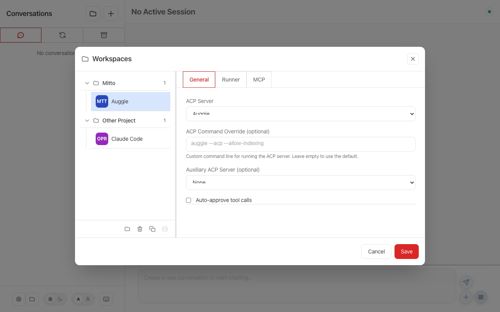
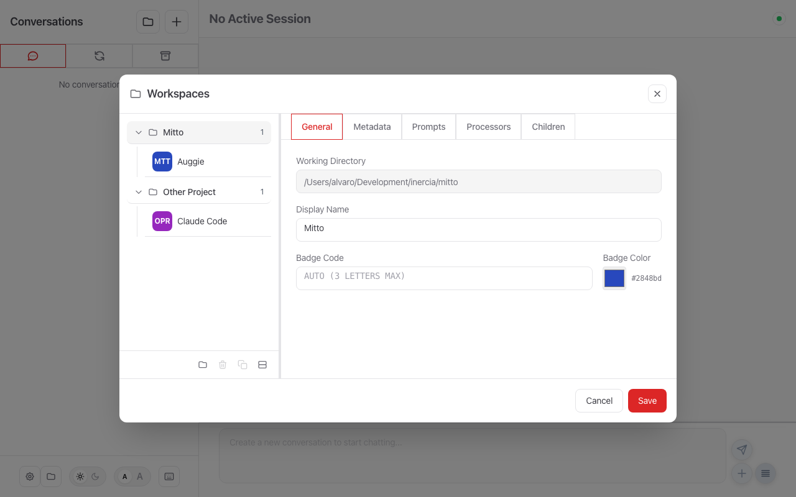
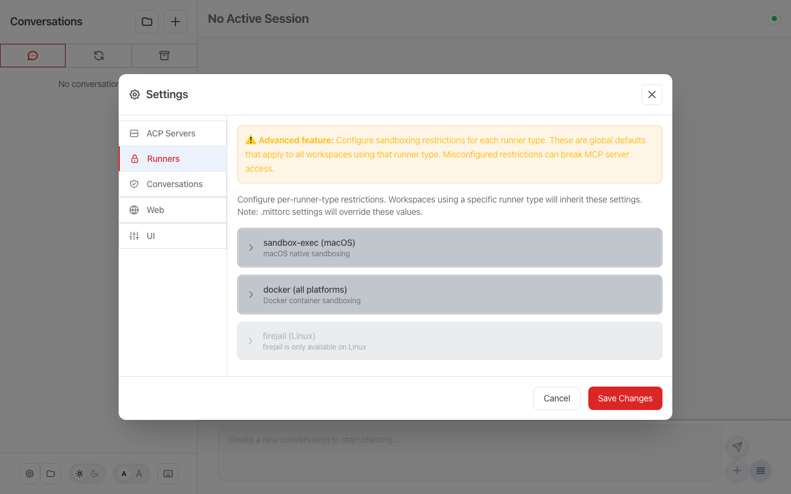
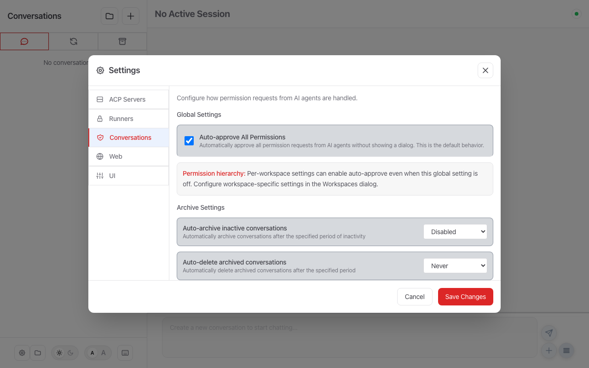
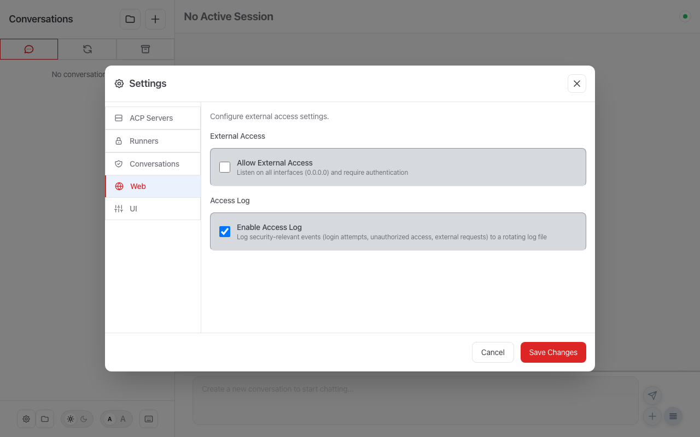
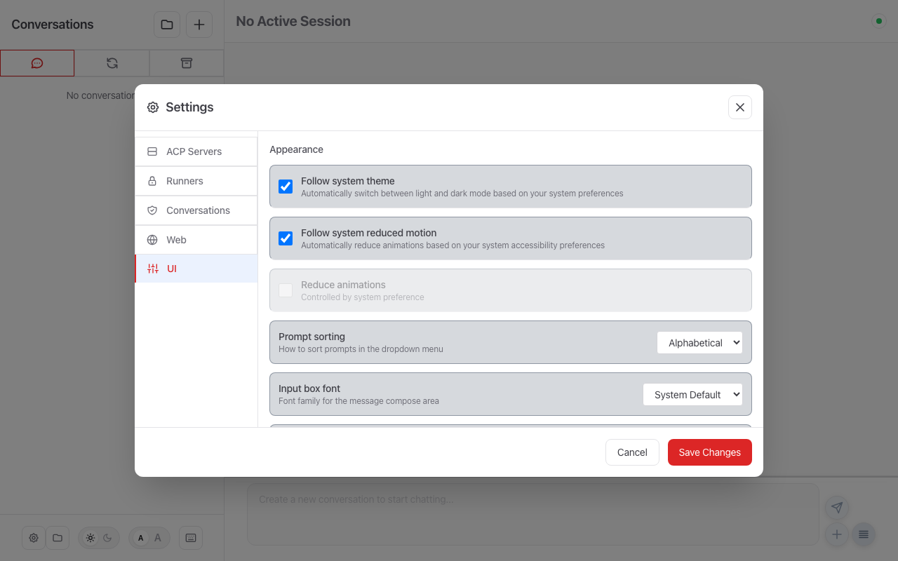

# Mitto Configuration

Mitto can be configured through the **Web UI** (recommended) or via **YAML configuration files**. Both approaches are fully supported and can be used together.

## Getting Started

### 1. First Run: Agent Discovery

When you start Mitto for the first time, the **Agent Discovery** dialog appears automatically:



Click **Scan for Agents** to detect AI coding agents installed on your system. Mitto will find agents like Augment (Auggie), Claude Code, Gemini CLI, and others:



Select the agents you want to use and click **Confirm** to save them.

> **Tip:** You can always re-run agent discovery from **Settings → ACP Servers → Discover Agents**.

### 2. Configure ACP Servers

After discovery, your agents appear in **Settings → ACP Servers**:



Here you can edit server names, commands, tags, and types. See [ACP Servers](acp.md) for details on each supported agent.

### 3. Set Up Workspaces

Open the **Workspaces** dialog (📁 icon in the sidebar footer) to configure project folders:



Each workspace connects a **project folder** to an **ACP server**. You can have multiple workspaces for the same folder (e.g., one with Claude Code, another with Auggie).

Click a folder name (e.g., "Mitto") to access folder-level settings:



### 4. Customize Your Setup

Use the remaining Settings tabs to fine-tune Mitto:

| Tab | Screenshot | What it configures |
|-----|------------|--------------------|
| **Runners** |  | Sandbox execution (sandbox-exec, docker, firejail) |
| **Conversations** |  | Auto-approve, auto-archive, auto-delete |
| **Web** |  | External access, access logging |
| **UI** |  | Theme, fonts, prompt sorting |

## Configuration Topics

### Features & Customization

| Topic | Document | UI Location | Description |
|-------|----------|-------------|-------------|
| 🤖 **ACP Servers** | [acp.md](acp.md) | Settings → ACP Servers | Claude Code, Auggie, Gemini, Copilot setup |
| ⚡ **Prompts** | [prompts.md](prompts.md) | Workspaces → Prompts tab | Quick actions and predefined prompts |
| 🔗 **Processors** | [processors.md](processors.md) | Workspaces → Processors tab | Message transformation (text, command, prompt modes) |
| 💬 **Conversations** | [conversations.md](conversations.md) | Settings → Conversations | Auto-approve, auto-archive, external images |
| 📝 **User Data** | [user-data.md](user-data.md) | Workspaces → Metadata tab | Custom metadata for conversations |
| 👥 **Auto-Children** | [auto-children.md](auto-children.md) | Workspaces → Children tab | Auto-spawn helper conversations |
| 🔌 **MCP Server** | [mcp.md](mcp.md) | Workspaces → MCP tab | MCP server for AI agent integration |
| 🔒 **Restricted Execution** | [restricted.md](restricted.md) | Workspaces → Runner tab | Sandbox agents for security |

### Platform & Deployment

| Topic | Document | Description |
|-------|----------|-------------|
| 🌐 **Web Interface** | [web/README.md](web/README.md) | Web server, auth, security, reverse proxy |
| 🍎 **macOS App** | [mac/README.md](mac/README.md) | Native macOS Desktop App features |
| 🌍 **External Access** | [ext-access.md](ext-access.md) | Tailscale, ngrok, Cloudflare tunneling |
| 📁 **Workspace Files** | [workspace.md](workspace.md) | Workspace management and `.mittorc` files |
| 📋 **Config Overview** | [overview.md](overview.md) | File locations, formats, complete examples |

## Configuration File Locations

Mitto uses two configuration approaches:

### Settings (UI-managed)

The Settings UI writes to `settings.json` — this is the recommended way to configure Mitto:

| Platform    | Location                                            |
| ----------- | --------------------------------------------------- |
| **macOS**   | `~/Library/Application Support/Mitto/settings.json` |
| **Linux**   | `~/.local/share/mitto/settings.json`                |

### YAML Configuration

For advanced users or automation, you can use YAML configuration files:

| Source                         | Priority | Description |
| ------------------------------ | -------- | ----------- |
| `--config` flag                | Highest  | CLI override |
| `MITTORC` environment variable | High     | Environment override |
| `~/.mittorc`                   | Default  | Global YAML config |
| `<project>/.mittorc`           | Per-project | Workspace-specific settings |

To create a default YAML configuration file:

```bash
mitto config create
```

## Related Documentation

- [Usage Guide](../usage.md) — Commands, flags, and usage examples
- [Development](../development.md) — Building, testing, and contributing
- [Architecture](../devel/README.md) — System design and internals
