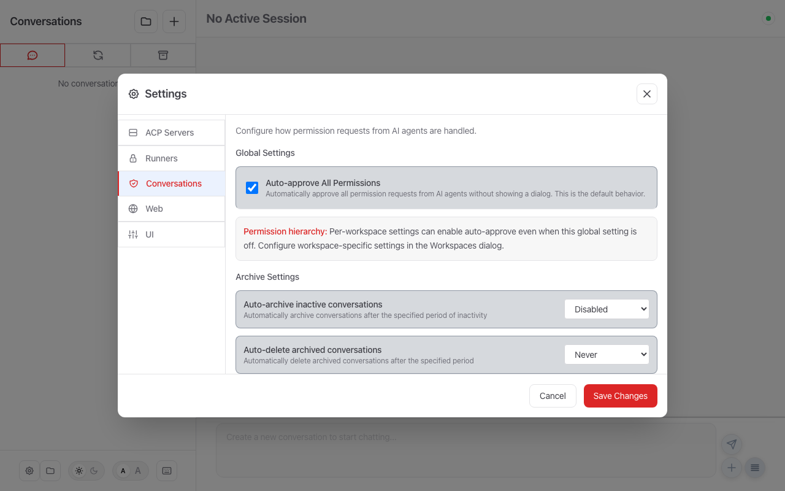

# Conversation Settings

Configure conversation-level behavior: auto-approve, auto-archive, auto-delete, and external images.

For message processing (prepend/append text, external commands, background AI tasks), see **[Processors](processors.md)**.

## Configuration in the UI

Conversation settings are managed in **Settings → Conversations**:



From this tab you can configure:

- **Auto-approve tool calls** — Skip confirmation prompts for agent actions
- **Auto-archive conversations** — Archive idle conversations after a set time
- **Auto-delete conversations** — Remove archived conversations after a set time

---

## YAML Configuration

Conversation settings live under the `conversations` key in `~/.mittorc` or `settings.json`:

```yaml
conversations:
  auto_approve: false        # Auto-approve agent tool calls (default: false)
  auto_archive: 0            # Auto-archive after N minutes of inactivity (0 = disabled)
  auto_delete: 0             # Auto-delete archived conversations after N minutes (0 = disabled)
  external_images:
    enabled: false            # Allow external HTTPS images in responses (default: false)
```

### Inline Processors

You can also define simple text-mode processors inline under `conversations.processing`. These are merged with standalone processor files — see **[Processors → Inline Processors](processors.md#inline-processors-in-mittorc)** for details.

## External Images

By default, Mitto blocks external images in AI responses for privacy reasons. When an AI response includes an image from an external URL like ``, the browser's Content Security Policy (CSP) prevents loading it.

This is intentional because external images can be used for tracking:

- When you view a message containing an external image, your browser requests that image from the external server
- This reveals your IP address and when you viewed the message

### Enabling External Images

If you want to allow external images (e.g., when working with AI that generates image links), you can enable them:

**Via Settings UI:**

1. Open Settings (⚙️ button)
2. Go to the **UI** tab
3. Under **Advanced**, enable **Allow External Images**
4. Save your settings and restart Mitto for the change to take effect

**Via Configuration:**

```yaml
conversations:
  external_images:
    enabled: true # Allow external HTTPS images (default: false)
```

### Security Considerations

When external images are enabled:

- Only HTTPS images are allowed (not HTTP)
- Data URLs and same-origin images are always allowed regardless of this setting
- Your IP address may be exposed to external image servers
- External servers can track when you view messages

**Recommendation:** Keep external images disabled unless you specifically need them.

## Loop Conversation Iteration Limit

Loop conversations run on a schedule indefinitely by default. To prevent runaway loops, Mitto enforces a two-layer safeguard:

1. **Per-prompt cap** (`max_iterations` on the loop prompt itself) — set via the API or `mitto_conversation_update`.
2. **User-configurable default cap** (`max_loop_iterations` in settings) — applies when no per-prompt cap is set.
3. **Hardcoded backstop** (`GlobalMaxLoopIterations = 1000`) — an absolute ceiling that always applies, even when both the per-prompt cap and user cap are set to 0 (unlimited).

The **effective cap** depends on whether the prompt author has expressed an opinion:

- **Per-prompt cap `= 0` (unlimited)** — the prompt author has explicitly opted out of any per-prompt cap (the standing-supervisor contract). The `max_loop_iterations` config default is **ignored**; only the hardcoded backstop of 1000 applies.
- **Per-prompt cap `> 0`** — the effective cap is the smallest positive of `{ per-prompt max_iterations, max_loop_iterations, 1000 }`.

Examples:
- Per-prompt cap = 0 (unlimited), config cap = 0 (unlimited) → effective cap = 1000 (backstop)
- Per-prompt cap = 5, config cap = 100 → effective cap = 5
- Per-prompt cap = 0, config cap = 200 → effective cap = 1000 (author opted out; config default ignored)
- Per-prompt cap = 2000, config cap = 50 → effective cap = 50

### Configuration

```yaml
conversations:
  max_loop_iterations: 100  # Default cap for all loop conversations (default: 100, 0 = unlimited)
```

| Field | Type | Default | Description |
|---|---|---|---|
| `max_loop_iterations` | integer | `100` | Default maximum number of scheduled runs for any loop conversation. `0` means unlimited (still bounded by the built-in backstop of 1000). |

**Via Settings UI:**

1. Open Settings (⚙️ button)
2. Go to the **Conversations** tab
3. Under **Loop Conversations**, set **Max Loop Iterations**
4. Save your settings

## On-Completion Trigger and Max Duration

Loop conversations can fire on a fixed schedule (the default) or **after the agent stops responding** (`trigger: onCompletion`). On-completion runs are event-driven: when the agent finishes a turn and the conversation goes idle, the next run is armed after a `delay`. Each run's completion arms the next, forming a self-sustaining loop.

To prevent runaway hot loops, the on-completion `delay` is clamped up to a global floor:

```yaml
conversations:
  min_loop_completion_delay_seconds: 5  # Floor for the onCompletion delay (default: 5)
```

| Field | Type | Default | Description |
|---|---|---|---|
| `min_loop_completion_delay_seconds` | integer | `5` | Lower bound (seconds) applied to every on-completion loop `delay`. A per-prompt `delay` below this floor is raised to it. `0` disables the floor (not recommended). |

A conversation can also be bounded by **wall-clock time** via the loop prompt's `maxDuration` (a duration string such as `30m`, `4h`, `1d`). Measured from the first run, once it elapses the conversation auto-stops (the loop prompt is **disabled**, not deleted) on the next check — for both `schedule` and `onCompletion` triggers. This complements the iteration limit above: a loop stops at whichever bound (max iterations or max duration) is reached first.

See the prompt-side schema in [Loop Prompts → Triggers](prompts.md#triggers-schedule-vs-on-completion).

## Related Documentation

- [Processors](processors.md) - Message transformation (text, command, prompt modes)
- [User Data](user-data.md) - Custom metadata for conversations
- [Workspace Configuration](workspace.md) - Project-specific `.mittorc` files
- [Configuration Overview](overview.md) - Global configuration options
