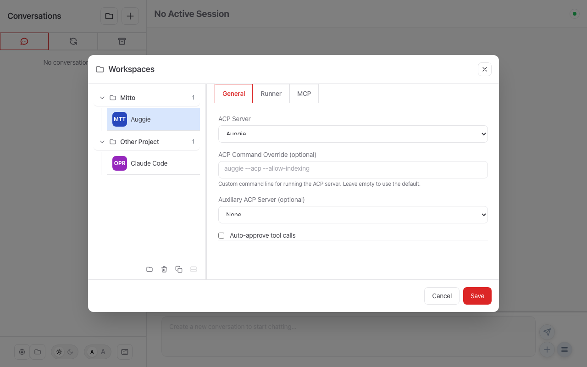

# MCP Server Configuration

Mitto exposes an MCP (Model Context Protocol) server that allows AI agents to:

1. **Introspect** — Query conversations, configuration, and runtime information
2. **Interact with users** — Display UI prompts (buttons, dropdowns) for user input

This enables powerful workflows where AI agents can debug issues, manage conversations,
and request user decisions through interactive UI elements.

## Configuration in the UI

MCP tools are managed per-workspace in the **Workspaces dialog**. Select a workspace (e.g., "Auggie") and open the **MCP** tab:



From this tab you can:

- View the JSON configuration snippet to add to your agent's MCP config file
- **Install** the MCP server configuration directly into the selected agent

---

## Quick Start

1. Ensure Mitto is running (`mitto web` or the macOS app)
2. Configure your AI agent to use the MCP server at `http://127.0.0.1:5757/mcp`
3. Enable the **"Can prompt user"** flag in the conversation's Advanced Settings if you want UI prompts

## Available Tools

### Introspection Tools

These tools are **always available** and don't require special permissions:

| Tool                             | Description                                                                                                                               |
| -------------------------------- | ----------------------------------------------------------------------------------------------------------------------------------------- |
| `mitto_conversation_list`        | List all conversations with metadata (title, status, message count, etc.)                                                                 |
| `mitto_get_config`               | Get the current Mitto configuration (sanitized)                                                                                           |
| `mitto_get_runtime_info`         | Get runtime info (OS, log paths, data directories, process info)                                                                          |
| `mitto_conversation_get_current` | Get details about the current conversation                                                                                                |
| `mitto_conversation_get`         | Get details about a specific conversation by ID                                                                                           |
| `mitto_conversation_history`     | Search and retrieve conversation history events with filtering by type, text content, tool name, and sequence range. Supports pagination. |
| `mitto_workspace_list`           | List all configured workspaces with their settings, metadata, and activity status.                                                        |

### UI Prompt Tools

These tools require the **"Can prompt user"** flag to be enabled:

| Tool                        | Description                                                                                                                                                                                                                                                                                                                                                     |
| --------------------------- | --------------------------------------------------------------------------------------------------------------------------------------------------------------------------------------------------------------------------------------------------------------------------------------------------------------------------------------------------------------- |
| `mitto_ui_options`          | Present an options menu with optional descriptions and free text input                                                                                                                                                                                                                                                                                          |
| `mitto_ui_textbox`          | Present a text editing dialog to the user and wait for their changes. Returns the edited text or a diff.                                                                                                                                                                                                                                                        |
| `mitto_ui_form`             | Present a sanitized HTML form to the user. Returns submitted field values as key-value pairs.                                                                                                                                                                                                                                                                   |
| `mitto_ui_notify`           | Send a non-blocking notification to the user. Supports styles: 'info', 'success', 'warning', 'error'. Can optionally play a sound or trigger a native OS notification.                                                                                                                                                                                          |
| `mitto_workspace_ui_notify` | Workspace-scoped variant of `mitto_ui_notify`: targets a `workspace_uuid` rather than a live registered session, so callers without a live MCP session — notably auxiliary sessions running close-phase (`conversationClosed`) processors — can still surface toasts. Frontend filters by workspace so only clients viewing the target workspace see the toast. |

### Cross-Conversation Tools

These tools require the **"Can Send Prompt"** or **"Can start conversation"** flags:

| Tool                             | Description                                     |
| -------------------------------- | ----------------------------------------------- |
| `mitto_conversation_send_prompt` | Send a prompt to another conversation's queue   |
| `mitto_conversation_new`         | Create a new conversation in the same workspace |

### Session Lifecycle Tools

These tools require the **"Can Send Prompt"** flag or appropriate permissions:

| Tool                         | Description                                                                                                     |
| ---------------------------- | --------------------------------------------------------------------------------------------------------------- |
| `mitto_conversation_archive` | Archive or unarchive a conversation                                                                             |
| `mitto_conversation_delete`  | Delete a child conversation (caller must be parent)                                                             |
| `mitto_conversation_wait`    | Wait until an event occurs in a conversation (agent finishes responding, or beads issues reach a target status) |
| `mitto_conversation_update`  | Update conversation properties: title, user-defined metadata, and loop prompt configuration.                    |

### Parent-Child Task Coordination Tools

These tools require the **"Can Send Prompt"** flag:

| Tool                          | Description                                                                         |
| ----------------------------- | ----------------------------------------------------------------------------------- |
| `mitto_children_tasks_wait`   | Send a progress inquiry to child conversations and block until they all report back |
| `mitto_children_tasks_report` | Report task completion/progress back to a waiting parent conversation               |

## Enabling Permissions

UI prompt tools require permissions to be enabled per-conversation:

1. Open the conversation in Mitto
2. Click on the conversation title/properties panel
3. In **Advanced Settings**, enable:
   - **"Can prompt user"** - For UI prompt tools
   - **"Can Send Prompt"** - For cross-conversation prompts
   - **"Can start conversation"** - For creating new conversations

## Configuration Examples

### Augment Code (Auggie)

Add to `~/.augment/settings.json`:

```json
{
  "mcpServers": {
    "mitto-debug": {
      "url": "http://127.0.0.1:5757/mcp"
    }
  }
}
```

### Claude Desktop

Add to your Claude Desktop configuration:

**macOS**: `~/Library/Application Support/Claude/claude_desktop_config.json`
**Windows**: `%APPDATA%\Claude\claude_desktop_config.json`

```json
{
  "mcpServers": {
    "mitto-debug": {
      "url": "http://127.0.0.1:5757/mcp"
    }
  }
}
```

### Claude Code (CLI)

Add to `~/.claude/settings.json`:

```json
{
  "mcpServers": {
    "mitto-debug": {
      "url": "http://127.0.0.1:5757/mcp"
    }
  }
}
```

### Gemini CLI

Add to your Gemini CLI settings file:

```json
{
  "mcpServers": {
    "mitto-debug": {
      "url": "http://127.0.0.1:5757/mcp"
    }
  }
}
```

## Use Cases

### Debugging Conversations

Ask your AI agent:

> "Use Mitto tools to list all conversations and find any that are stuck"

> "Get the Mitto runtime info and tell me where the log files are"

> "Check which conversations have the most messages"

### Interactive Workflows

Enable the "Can prompt user" flag, then ask:

> "Before making changes, ask me to confirm using a yes/no dialog"

> "Present me with options for how to proceed using buttons"

The agent will display UI prompts directly in the Mitto conversation interface,
and the user's selection is returned to the agent.

### Cross-Conversation Automation

Enable the "Can Send Prompt" flag, then:

> "Send the commit message to the other conversation that's waiting for review"

This allows orchestrating work across multiple AI conversations.

## Security Notes

- The MCP server is unauthenticated and is therefore restricted to `127.0.0.1`; startup and settings saves reject any other bind host
- Session-scoped tools resolve callers through ACP/MCP correlation, not by trusting a supplied conversation ID
- UI prompt tools require explicit permission flags per-conversation
- Sensitive configuration data is sanitized in responses
- Cross-conversation prompts require explicit opt-in

## Troubleshooting

### Tools Not Appearing

1. Verify Mitto is running (`mitto web` or macOS app)
2. Check the URL is correct: `http://127.0.0.1:5757/mcp`
3. Restart your AI agent after adding the MCP configuration

### Permission Denied Errors

If you see "requires flag to be enabled":

1. Open the conversation's properties panel
2. Enable the required flag in Advanced Settings
3. The change takes effect immediately

### UI Prompts Not Showing

1. Ensure the "Can prompt user" flag is enabled
2. The conversation must be open in the Mitto UI
3. Check browser console for WebSocket connection errors

## Cold-Start Hygiene

MCP server configuration has a direct effect on how long the **first prompt** in a
cold Mitto workspace takes to produce its first token. When first-token latency
in a workspace is consistently poor (tens of seconds to multiple minutes on a
freshly-started ACP process), apply the following per-workspace checks in order.
None of these are code changes — they are operational settings that live in the
workspace's MCP configuration.

1. **Trim MCP servers to what the workspace actually uses.** For agents that
   `initialize` every configured MCP server before emitting the first token
   (Auggie today), each configured-but-unused server is pure cold-init tax on
   every session. Open **Workspaces → \<workspace\> → MCP** and remove servers
   the running agent does not need. The Mitto UI shows the effective server set
   per workspace.
2. **Pre-install `uvx`-launched servers as `uv` tools.** Servers whose command
   is `uvx <package>` (e.g. `uvx mcp-atlassian`) pay a cold `uv` resolve on
   every fresh spawn — roughly 11.5 s on an empty cache, multiplied across the
   ~6 duplicate spawns of an agent's cold-init fork burst. Installing the
   server as a `uv` tool up front eliminates that cost:

   ```bash
   uv tool install mcp-atlassian
   ```

   Then change the MCP config to launch the installed tool directly instead of
   through `uvx`. The equivalent applies to any other package manager with a
   heavy cold resolve (`npx` vs. globally-installed `npm` binaries, etc.).

3. **Do not run one `working_dir` under multiple concurrent workspace UUIDs.**
   When several Mitto workspaces (e.g. one per ACP server or model tier) share
   the same `working_dir` and are all active at once, their `session/new` calls
   fire concurrently on the same cold shared ACP process and starve each
   other's MCP-init budget. This is the single most deterministic trigger of
   cold-start wedges in production traces. Prefer one active workspace per
   `working_dir` at a time, or split the folder into per-agent working
   directories.
4. **Verify `working_dir` matches the git root when using Auggie.** The
   `auggie mcp list` command resolves its workspace argument to the **git
   top-level**, not to the literal path Mitto passes it. If your Mitto
   `working_dir` is a subdirectory
   of a larger git repository, the Auggie process will load
   `<git-root>/.augment/settings.local.json` — not the `.augment/` directory
   inside your `working_dir`. The MCP tab in the Mitto UI can then show servers
   the running agent never actually loads (see the git-root divergence gotcha
   in the developer notes). Either point `working_dir` at the git root, move
   the server registration up to the git-root config, or register at user
   scope (`auggie mcp add` without `--local`).
5. **Stale persisted ACP session IDs are auto-cleared.** No manual cleanup is
   normally needed: when a `session/load` fails, Mitto automatically clears the
   persisted `acp_session_id` and falls back to a fresh `session/new`
   (`mitto-y1g`). If a workspace still shows cold-start wedges after applying
   steps 1–4, inspect its cold-start trace via the developer notes rather than
   manually deleting session files.

For the Mitto-side history of the cold-start wedge and the developer-facing
root-cause records, see [`.augment/rules/42-mcpserver-development.md`](../../.augment/rules/42-mcpserver-development.md#cold-start-mcp-wedge-mitto-54k--mitto-6hr--mitto-side-sse-stall-fixed).

## Related Documentation

- [Developer MCP Documentation](../devel/mcp.md) - Full technical details
- [Session Management](../devel/session-management.md) - How sessions work
- [Architecture](../devel/architecture.md) - System overview
