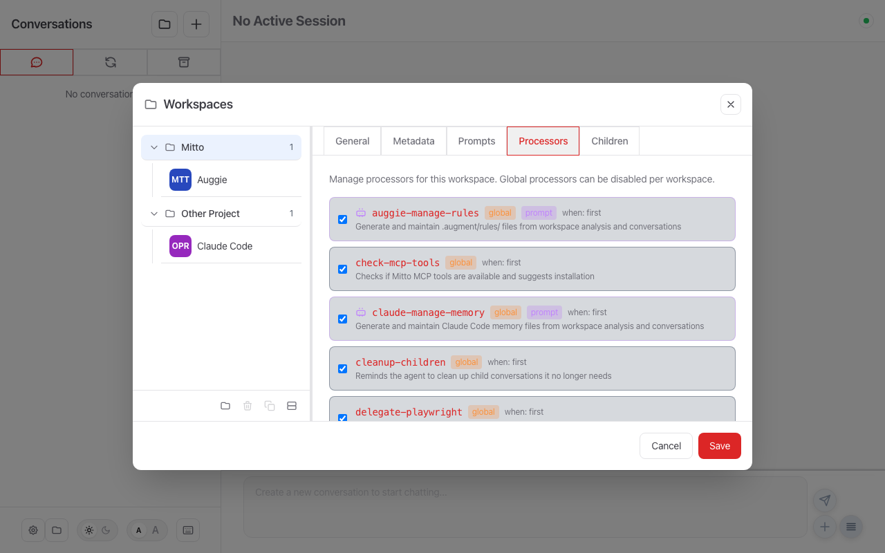

# Processors Configuration

Mitto supports processors that can run at three points in the conversation lifecycle:

- **`on: userPrompt`** — Processors fire *before* the user's message is sent to the ACP agent. This is the standard phase for injecting context, prepending reminders, running scripts, or dispatching background prompts.
- **`on: agentResponded`** — Processors fire *after* the agent finishes **each** turn — even while more queued messages are still pending. Only command-mode and prompt-mode are allowed here (text injection is not meaningful post-response).
- **`on: agentIdle`** — Like `agentResponded`, but fires only once the agent has **drained its message queue and gone idle**. Within a burst of queued messages it fires a single time, at the idle breakpoint, so the processor sees the *complete* exchange rather than a partial mid-burst turn. Same execution rules as `agentResponded`. This is the right phase for memory/insight processors (e.g., `memorize-preferences`, `identify-user-data`, `auggie-update-rules`, `claude-update-memory`) that need full context. Cadence still applies and accumulates across the burst (see [Cadence Throttling](#cadence-throttling-cadence)).

Within each phase, three execution modes are available:

- **Text-mode** — Inject static text (with optional variable substitution) into the message. No external commands needed. Only valid for `on: userPrompt`.
- **Command-mode** — Execute external commands that receive message context as JSON and produce transformed output. Valid for all phases.
- **Prompt-mode** — Send a prompt to a workspace-scoped auxiliary AI agent. Fire-and-forget: the pipeline continues immediately. Valid for all phases.

## Configuration in the UI

Processors are managed per-workspace in the **Workspaces → Processors** tab:



From this tab you can:

- **Enable/disable** any processor using the checkbox — global processors can be disabled per workspace
- See each processor's **source** (workspace, global, or built-in), **mode** (text, command, or prompt), and **trigger** (phase + match)
- **Override argument values** for prompt-mode processors that declare `parameters:` — each parameter shows an editable input prefilled with the effective value (workspace override or declared default); clicking **Save** persists the values to the folder's `.mittorc`
- See a red **error** badge (with the full error as a tooltip) for any processor that fails to load or validate — e.g. a missing mandatory `default` on a parameter

Each processor shows badges indicating:
- **Source**: `global` (orange), `workspace` (green), or `built-in` (blue)
- **Mode**: `prompt` badge for prompt-mode processors
- **Trigger**: `on: userPrompt / match: first`, etc.

---

## YAML Configuration

All modes are configured via YAML files and share the same triggering, priority, and conditional enablement features.

> **Note:** The old `hooks/` directory name is still supported for backward compatibility.

## Overview

Processors are loaded from YAML files in the `MITTO_DIR/processors/` directory:

- **macOS**: `~/Library/Application Support/Mitto/processors/`
- **Linux**: `~/.local/share/mitto/processors/` (or `$XDG_DATA_HOME/mitto/processors/`)
- **Windows**: `%APPDATA%\Mitto\processors\`

The processors directory is created automatically when Mitto starts.

### Workspace-Local Processors

In addition to the global processors directory, Mitto automatically loads processors
from the workspace directory at `$MITTO_WORKING_DIR/.mitto/processors/`. This allows
per-project processor configuration that travels with the repository.

Additional workspace processor directories can be configured via `.mittorc`:

```yaml
processors_dirs:
  - ".processors"
  - "team/shared-processors"
```

Paths are relative to the workspace root. Absolute paths are also supported.

**Merge behavior:**

1. Global processors from `MITTO_DIR/processors/` are loaded first
2. Inline text-mode processors from `.mittorc` `conversations.processing.processors` are merged
3. Workspace processors from `.mitto/processors/` are merged
4. Additional directories from `processors_dirs` are merged last (highest override priority)

When a workspace processor has the **same `name`** as a global processor, the workspace
version overrides the global one. All processors are sorted by priority after merging.

Use `mitto processors list --dir .mitto/processors` to preview how workspace processors
merge with global ones.

### Multiple Processors per File (Multi-Document YAML)

A single `.yaml` or `.yml` file can contain **multiple processor definitions** separated
by the YAML document separator `---`. Each document is treated as an independent
processor.

```yaml
# .mitto/processors/project-hooks.yaml
name: inject-context
description: "Prepend project context to the first message"
when:
  on: userPrompt
  match: first
mutate: prepend
text: |
  [Project] This is the Acme API — Go + PostgreSQL.
  Run tests: make test
  ---
---
name: post-response-check
description: "Run a background check after each agent response"
when:
  on: agentResponded
  match: all
command: ./check.sh
output: discard
```

**Key points:**

- Each document is **validated independently**. An invalid or empty document is skipped
  with a warning and does not prevent the other documents from loading.
- Blank or comment-only documents (no `name`, `command`, `text`, or `prompt`) between
  `---` separators are silently ignored.
- The **processor `name` is independent of the filename** — the file is just a container.
  Multiple processors in one file may have any names.
- **Enable/disable caveat:** for processors in a multi-document file, the per-workspace
  enable toggle is recorded in the `.mittorc` `processors:` override list rather than
  editing the file in place — this preserves `---` separators and comments. Single-document
  workspace files continue to be edited in place as before.

### Inline Processors in `.mittorc`

For simple text-mode processors, you can define them inline in your `.mittorc` file instead of creating separate YAML files:

```yaml
conversations:
  processing:
    # Optional: if true, workspace processors replace global processors entirely
    # Default: false (merge with global)
    override: false

    processors:
      - when:
          on: userPrompt    # "userPrompt" (before sending) or "agentResponded" (after response)
          match: first      # "first", "all", or "allExceptFirst"
        mutate: prepend     # "prepend" or "append" (text-mode only; required for text mode)
        text: |
          You are a helpful AI coding assistant.
          Follow best practices and be concise.

          ---
```

> **Note:** Inline `.mittorc` processors support `on:` and `match:` only — the `rerun:`, `stopReasons:`, and `excludeOrigins:` sub-fields are not available for inline processors. For processors that need `rerun`, use standalone YAML files instead (see [Full Configuration Schema](#full-configuration-schema)).

Inline processors are merged with standalone processor files (see merge behavior above). They support the same `when`, `mutate`, and `text` fields as text-mode processor files, plus `@mitto:variable` substitution. The `when:` block requires both `on:` and `match:` fields.

When both global and workspace `.mittorc` files define inline processors:

1. **Default (merge)**: Global processors run first, then workspace processors
2. **Override mode**: Only workspace processors run (set `override: true`)

### Enabling and Disabling Processors per Workspace

Processors can be enabled or disabled per workspace through the Web UI or the `.mittorc` file.

**Web UI:** Open the Workspaces dialog (folder icon in sidebar footer), select a folder, and click the **Processors** tab. Each processor shows its source (workspace, global, or built-in) and has a toggle to enable or disable it.

**`.mittorc` file:** To override the enabled state of a global or built-in processor for a specific workspace, add entries to the `processors` list:

```yaml
processors:
  - name: delegate-to-coder
    enabled: false
  - name: memorize-preferences
    enabled: true
```

This mirrors the same `{name, enabled}` pattern used by the `prompts` section. When re-enabling a processor that is enabled by default, you can remove the entry entirely — missing entries use the processor's default state.

For workspace-local processors (from `.mitto/processors/`), the toggle updates the `enabled` field directly in the processor's YAML file — **unless** the file contains multiple `---`-separated processor documents, in which case the override is recorded in `.mittorc` instead (to avoid corrupting the separators and comments). See [Multiple Processors per File](#multiple-processors-per-file-multi-document-yaml).

> **Backward compatibility:** The legacy `disabled_processors` list format is still read and automatically migrated to the new `processors` format when saving.

**Source precedence:**

| Source      | Badge Color | Description                                               |
| ----------- | ----------- | --------------------------------------------------------- |
| `workspace` | Green       | From `.mitto/processors/` in the workspace                |
| `built-in`  | Blue        | Shipped with Mitto, in `MITTO_DIR/processors/builtin/`    |
| `global`    | Orange      | User-created in `MITTO_DIR/processors/`                   |

## Builtin Processors

Mitto ships with builtin processors that are automatically deployed to `MITTO_DIR/processors/builtin/` on first run. Like builtin prompts, they are embedded in the binary and kept in sync — if a new version of Mitto ships updated builtins, they are automatically updated on startup (content-based comparison).

### Included Builtin Processors

| Processor             | Description                                                                                              | Phase / Match | Mode   | Enabled                                            |
| --------------------- | -------------------------------------------------------------------------------------------------------- | ------------- | ------ | -------------------------------------------------- |
| `session-context`     | Injects session identity, parent/child relationships, and available agents into the first message        | userPrompt / first | text   | Yes                                                |
| `check-mcp-tools`     | Checks if Mitto MCP tools are available and suggests installation if missing                             | userPrompt / first | text   | Yes                                                |
| `delegate-to-coder`   | Suggests delegating coding tasks to a faster model when using a premium reasoning model (Opus, o3, etc.) | userPrompt / first | text   | Yes (only activates for matching ACP servers)      |
| `delegate-playwright` | Delegates Playwright browser automation to a faster model when using a premium reasoning model           | userPrompt / first | text   | Yes (requires smart model + `browser_*` MCP tools) |
| `cleanup-children`    | Reminds the agent to clean up child conversations it no longer needs                                     | userPrompt / first | text   | Yes (requires ≥2 MCP-created children + delete tool) |
| `use-ui-tools`        | Reminds the agent to use Mitto UI tools (options, textbox, form, notify) instead of text prompts | userPrompt / first | text   | Yes |
| `beads-track-tasks`   | Reminds the agent to track tasks and knowledge in beads (`bd`) instead of markdown TODO lists | userPrompt / first | text   | Yes (requires `bd` command on PATH) |
| `beads-ready-tasks`   | Reminds the agent to review available tasks (`bd ready`) when a beads database exists | userPrompt / first | text   | Yes (requires `bd` command + `.beads` directory) |
| `memorize-preferences`| Extracts user preferences from conversations and saves them to AGENTS.md                                 | agentResponded / all | prompt | **Yes** (disable in Workspaces dialog or `.mittorc`) |
| `auggie-manage-rules` | Generates initial `.augment/rules/` when none exist | userPrompt / first | prompt | **Yes** (Auggie only) |
| `auggie-update-rules` | Updates `.augment/rules/` from conversation insights (every 6 turns or 15k tokens) | agentResponded / all | prompt | **Yes** (Auggie only) |
| `claude-manage-memory`| Generates initial Claude Code memory files when none exist | userPrompt / first | prompt | **Yes** (Claude Code only) |
| `claude-update-memory`| Updates Claude Code memory files from conversation insights (every 6 turns or 15k tokens) | agentResponded / all | prompt | **Yes** (Claude Code only) |
| `identify-user-data`  | Detects user data values from conversations and sets them via MCP (every 2 turns or 6k tokens)           | agentResponded / all | prompt | **Yes** (only activates when `user_data` schema is defined in `.mittorc`) |
| `identify-workspace-metadata` | Analyzes the project and fills in `metadata.description` and `metadata.url` in `.mittorc` when missing | userPrompt / first | prompt | **Yes** (only fires when `.mittorc` exists but lacks a description) |

### Managing Builtin Processors

- **Disable**: Edit the YAML file and set `enabled: false`, or move it to `processors/builtin/disabled/`
- **Override**: Create a processor with higher priority in `processors/` (outside `builtin/`)
- **Force update**: Run `mitto processors update-builtin` to overwrite local modifications with the embedded versions
- **Dry run**: Run `mitto processors update-builtin --dry-run` to preview changes

> **Note:** User-created processors in `MITTO_DIR/processors/` (outside `builtin/`) are never modified by automatic updates.

## Text-Mode Processors (Static Content)

Text-mode processors inject static text into messages without executing any external command.
They use the `text` field instead of `command`. This is the simplest way to add context,
reminders, or instructions to conversations.

### Basic Structure

```yaml
name: my-reminder
description: "Adds a coding reminder to every message"
when:
  on: userPrompt   # required: "userPrompt" or "agentResponded"
  match: all       # required: "first", "all", or "allExceptFirst"
mutate: append     # required for text mode: "prepend" or "append"
priority: 100
text: |
  ---
  Remember: always write tests for new code.
  Follow the project's existing patterns and conventions.
```

### Examples

#### Inject project context on first message

```yaml
name: project-context
description: "Adds project context to the first message"
when:
  on: userPrompt
  match: first
mutate: prepend
priority: 20
text: |
  [Project Context]
  This is the Acme API project. It uses Go 1.22, PostgreSQL, and follows
  clean architecture patterns. All handlers are in internal/api/.
  Run tests with: make test
  ---
```

#### Add safety reminders to every message

```yaml
name: safety-reminder
description: "Reminds the agent about safe practices"
when:
  on: userPrompt
  match: all
mutate: append
priority: 200
text: |
  ---
  IMPORTANT: Do not modify files outside the project directory.
  Do not commit or push without explicit user approval.
```

#### Inject session identity with variable substitution

Text-mode processors support `@mitto:variable` placeholders that are replaced with
live session values (see [Variable Substitution](#variable-substitution) below).

```yaml
name: session-context
description: "Injects session identity and context"
when:
  on: userPrompt
  match: first
  rerun:           # optional; only valid with on:userPrompt + match:first
    afterTime: 30m
    afterSentMsgs: 20
mutate: prepend
priority: 10
text: |
  [Session Context]
  Session: @mitto:session_id (@mitto:session_name)
  Agent: @mitto:acp_server
  Working Directory: @mitto:working_dir
  Parent: @mitto:parent
  Children: @mitto:children
  Available Agents: @mitto:available_acp_servers
  ---
```

#### Conditional text for specific models

```yaml
name: reasoning-guidance
description: "Delegation guidance for premium reasoning models"
when:
  on: userPrompt
  match: first
mutate: append
priority: 90
enabledWhen: 'ACP.Tags.exists(t, t == "reasoning")'
text: |
  ---
  You are running on a premium reasoning model. For tasks that involve
  extensive coding changes, consider delegating to a faster model.
```

## Command-Mode Processors (Dynamic Content)

Command-mode processors execute external commands to dynamically generate or transform
message content. They use the `command` field and communicate via JSON on stdin/stdout.

## Prompt-Mode Processors (Auxiliary AI Agent)

Prompt-mode processors send a prompt to a workspace-scoped auxiliary AI agent. They are
**fire-and-forget**: the prompt is dispatched asynchronously and the processor pipeline
continues immediately without waiting for the agent's response. This makes them ideal
for background tasks like extracting insights, updating documentation, or tracking
preferences.

Prompt-mode processors use the `prompt` field (mutually exclusive with `text` and
`command`). The prompt template supports all standard `@mitto:variable` placeholders.
To access conversation history, the auxiliary agent calls the `mitto_conversation_history`
MCP tool at runtime.

### Basic Structure

```yaml
name: my-analyzer
description: "Analyzes conversations in the background"
when:
  on: userPrompt
  match: first
  rerun:
    afterSentMsgs: 10
priority: 200
timeout: 120s
on_error: skip

prompt: |
  Analyze recent conversation messages and extract key insights.
  Save your findings to a file in the workspace.

  Session: @mitto:session_name
  Session ID: @mitto:session_id
  Working directory: @mitto:working_dir

  Use the mitto_conversation_history MCP tool to retrieve recent messages.
```

### Key Differences from Text/Command Mode

- **No `mutate` or `output` fields** — prompt-mode processors don't modify the outgoing message
- **Always asynchronous** — the pipeline never blocks waiting for the auxiliary agent
- **Requires a workspace** — the auxiliary session is scoped to the workspace
- **Runs on the workspace's ACP server** — auxiliary sessions use the workspace's main ACP server; an optional *Auxiliary Model Selection* (match mode + pattern) in workspace settings can switch the aux session to a specific model (otherwise the server default is used)
- **Conversation history via MCP tool** — use `mitto_conversation_history` in the prompt to retrieve messages dynamically

### Parameters (Prompt-Mode Only)

Prompt-mode processors can declare named, typed inputs via a `parameters:` block. At dispatch time, each `${NAME}` / `${NAME:-fallback}` placeholder in the prompt body is replaced with the resolved value. Values are overridable per workspace without editing the YAML file.

#### Schema

```yaml
parameters:
  - name: HistoryLimit      # placeholder name → ${HistoryLimit}
    type: text              # one of: beadsId beadsTitle sessionId childSessionId
                            #         workspaceId workspaceFolder acpServer text boolean
    description: "..."      # optional hint shown in the UI
    default: "10"           # MANDATORY, must be non-empty — missing default is a load error
```

A missing or empty `default` is a **load error**: the processor is not loaded and appears as a red **error** badge with the full message as a tooltip in the Workspaces → Processors tab.

#### Substitution semantics

| Syntax               | Result                                                         |
| -------------------- | -------------------------------------------------------------- |
| `${NAME}`            | Resolved value, or `""` if absent                             |
| `${NAME:-fallback}`  | Resolved value when set AND non-empty; else the inline fallback|
| `\${NAME}`           | Literal `${NAME}` (escape — no substitution)                  |

Surrounding single or double quotes around an inline fallback are stripped: `${NAME:-"a value"}` yields `a value` when `NAME` is unset.

**Resolution order**: the declared `default` is used as the base value; a per-workspace override from `.mittorc` (non-empty) takes precedence.

#### Per-workspace overrides

In the Workspaces → Processors tab, each prompt-mode processor with declared parameters shows an editable input per parameter (prefilled with the effective value). Clicking **Save** persists overrides to the folder's `.mittorc`:

```yaml
# .mittorc (auto-managed — do not edit the arguments key manually)
processors:
  - name: auggie-update-rules
    arguments:
      HistoryLimit: "25"   # overrides the declared default of "10"
```

**Example** (the builtin `auggie-update-rules`):

```yaml
parameters:
  - name: HistoryLimit
    type: text
    description: "How many recent user/agent messages the auxiliary agent reviews"
    default: "10"
prompt: |
  ...
  - `last_n`: ${HistoryLimit:-10}
```

With the workspace override above, the dispatched prompt will contain `last_n: 25`.

### Examples

#### Track user preferences automatically

The built-in `memorize-preferences` processor (enabled by default) demonstrates this
pattern — see [Builtin Processors](#builtin-processors).

#### Summarize progress every 15 messages

```yaml
name: progress-summary
description: "Summarizes session progress periodically"
when:
  on: userPrompt
  match: first
  rerun:
    afterSentMsgs: 15
priority: 200
timeout: 120s
on_error: skip

prompt: |
  Review the recent conversation and write a brief progress summary.
  Append it to .mitto/progress.md in the workspace.

  Session ID: @mitto:session_id
  Use mitto_conversation_history to retrieve the last 40 user and agent messages.
```

#### Extract action items from agent responses

```yaml
name: action-items
description: "Extracts TODO items from agent responses"
when:
  on: userPrompt
  match: first
  rerun:
    afterSentMsgs: 10
priority: 200
timeout: 60s
on_error: skip

prompt: |
  Look through the agent's responses for any TODO items, action items,
  or follow-up tasks mentioned. Add new ones to .mitto/todos.md.

  Session ID: @mitto:session_id
  Use mitto_conversation_history to retrieve the last 20 agent messages.
```

## Full Configuration Schema

Each YAML document in the processors directory defines one processor. A file may contain
multiple processors separated by `---` (see [Multiple Processors per File](#multiple-processors-per-file-multi-document-yaml)).
Use **either** `text` (text-mode), `command` (command-mode), or `prompt` (prompt-mode) per document — not more than one.

```yaml
# Required fields
name: my-processor   # Human-readable identifier
when:                # Trigger condition — always a block
  on: userPrompt     # Phase: "userPrompt" (before send), "agentResponded" (after each turn),
                     #   or "agentIdle" (after the queue drains / agent goes idle)
  match: first       # Match: "first", "all", or "allExceptFirst"
  rerun:             # Optional: auto re-run — only valid with on:userPrompt + match:first
    afterTime: 30m          # re-run after 30 minutes since last run
    afterSentMsgs: 20       # re-run after 20 user messages since last run
    afterTokens: 50000      # re-run after 50000 tokens consumed since last run
  # agentResponded / agentIdle-only fields (forbidden for userPrompt):
  stopReasons:       # which ACP stop reasons trigger this processor (default: ["end_turn"])
    - end_turn       # valid values: end_turn, max_tokens, max_turn_requests, refusal, cancelled
  excludeOrigins:    # skip processor when message origin matches any of these
    - periodic-runner

# --- Text-mode (use ONE of the three modes) ---
# Only valid for on:userPrompt; forbidden for on:agentResponded and on:agentIdle
text: |  # Static text to inject
  Your static content here.

# --- Command-mode (use ONE of the three modes) ---
command: /path/to/script.sh  # Command to execute (see Command Resolution)

# --- Prompt-mode (use ONE of the three modes) ---
prompt: |  # Prompt template for auxiliary AI agent (fire-and-forget)
  Session: @mitto:session_id
  Use mitto_conversation_history to retrieve messages and analyze them.

# Prompt-mode only: declare typed inputs substituted into the prompt body.
# Each needs a MANDATORY non-empty default; values overridable per-workspace (.mittorc).
parameters:
  - name: HistoryLimit      # placeholder name → ${HistoryLimit}
    type: text              # one of the known parameter types
    description: "..."      # optional UI/MCP hint
    default: "10"           # REQUIRED, non-empty

# Optional fields
description: "Adds context"  # Description of what the processor does
enabled: true                # Default: true
mutate: prepend              # "prepend" or "append" (text-mode only; required for text mode)
priority: 100                # Execution order, lower = earlier (default: 100)

# I/O configuration (command-mode only; ignored for text/prompt-mode)
input: message   # "message", "conversation", or "none" (default: message)
output: transform # "transform", "prepend", "append", "discard" (default: transform)
                  # NOTE: transform/prepend/append are forbidden for on:agentResponded and on:agentIdle
outputFormat: json # "json" (default) or "raw"; command-mode only. "raw" uses trimmed stdout directly as the message/prepend/append text instead of parsing JSON.

# Execution settings
timeout: 5s       # Command timeout (default: 5s); also caps auxiliary agent time in prompt-mode
working_dir: session  # "session" or "hook" (default: session)
on_error: skip    # "skip" or "fail" (default: skip)

# Environment variables (in addition to automatic ones; command-mode only)
environment:
  MY_VAR: "value"

# CEL expression for conditional activation (empty = always apply)
# Same context as prompt enabledWhen: ACP.*, Session.*, Parent.*, Children.*, Workspace.*, Tools.*
enabledWhen: 'ACP.Tags.exists(t, t == "reasoning") && Tools.HasAllPatterns(["mitto_conversation_*", "jira_*"])'
```

### `when:` Block Reference

The `when:` block is required for all processors. Both `on:` and `match:` are required fields.

| Field               | Values                                           | Required | Notes                                              |
| ------------------- | ------------------------------------------------ | -------- | -------------------------------------------------- |
| `on`                | `userPrompt` \| `agentResponded`                 | ✅ Yes   | Phase when the processor fires                     |
| `match`             | `first` \| `all` \| `allExceptFirst`             | ✅ Yes   | Which messages in the sequence to fire on          |
| `rerun`             | sub-block (see below)                            | No       | Only valid with `on: userPrompt` + `match: first`  |
| `cadence`           | sub-block (see below)                            | No       | Only valid with `on: agentResponded`; not with `match: first` |
| `stopReasons`       | list of strings                                  | No       | Only valid with `on: agentResponded`. Default: `["end_turn"]` |
| `excludeOrigins`    | list of strings                                  | No       | Only valid with `on: agentResponded`               |

**`match` values:**
- `first` — fires only on the *first-ever* message in the conversation. This state **persists across session restarts** — if the processor already fired before the session was stopped and resumed, it will not fire again.
- `all` — fires on every message.
- `allExceptFirst` — fires on every message *except* the first. _(Note: camelCase only — `all-except-first` is rejected.)_

**`stopReasons` values** (only for `on: agentResponded`):

| Value              | Meaning                                              |
| ------------------ | ---------------------------------------------------- |
| `end_turn`          | Agent finished normally (default)                    |
| `max_tokens`        | Context limit reached                                |
| `max_turn_requests` | Turn request limit reached                           |
| `refusal`           | Agent refused to respond                             |
| `cancelled`         | Turn was cancelled by the user                       |

**`excludeOrigins` values** (only for `on: agentResponded`):

| Origin value      | Meaning                                              |
| ----------------- | ---------------------------------------------------- |
| `user`            | Message sent by the user via the UI                  |
| `queue`           | Message dispatched from the conversation queue       |
| `periodic-runner` | Message triggered by the periodic runner             |
| `mcp-send-prompt` | Message sent via the `mitto_conversation_send_prompt` MCP tool |

### Phase/Field Rules

Which fields are allowed or forbidden depends on the `on:` phase:

| Field / Setting                    | `on: userPrompt`      | `on: agentResponded`         |
| ---------------------------------- | --------------------- | ----------------------------- |
| `text:`                            | ✅ allowed            | ❌ forbidden                  |
| `mutate:`                          | ✅ required (text mode) | ❌ forbidden                |
| `command:`                         | ✅ allowed            | ✅ allowed                    |
| `prompt:`                          | ✅ allowed            | ✅ allowed                    |
| `when.rerun:`                      | ✅ allowed (`match: first` only) | ❌ forbidden       |
| `when.stopReasons:`                | ❌ forbidden          | ✅ allowed (default: `[end_turn]`) |
| `when.excludeOrigins:`             | ❌ forbidden          | ✅ allowed                    |
| `output: transform/prepend/append` | ✅ allowed            | ❌ forbidden                  |
| `output: discard`                  | ✅ allowed            | ✅ allowed                    |


### Migration Table

If you have existing processors using the old schema, update them as follows:

| Old syntax                                          | New syntax                                          |
| --------------------------------------------------- | --------------------------------------------------- |
| `when: first` (scalar)                              | `when:\n  on: userPrompt\n  match: first`           |
| `when:\n  sent: first`                              | `when:\n  on: userPrompt\n  match: first`           |
| `when:\n  sent: all`                                | `when:\n  on: userPrompt\n  match: all`             |
| `when:\n  sent: all-except-first`                   | `when:\n  on: userPrompt\n  match: allExceptFirst`  |
| `position: prepend` / `position: append`            | `mutate: prepend` / `mutate: append`                |

### Conditional Enablement

Processors support the same fields as prompts:

| Field         | Type | Use Case                                    |
| ------------- | ---- | ------------------------------------------- |
| `enabled`     | bool | Permanently disable a processor             |
| `enabledWhen` | CEL  | Dynamic conditions based on session context |

If `enabled: false`, the processor is never loaded. Otherwise, the `enabledWhen` CEL
expression must evaluate to `true`.

**CEL context** — Same variables and functions as prompt `enabledWhen`:

- `ACP.Name`, `ACP.Type`, `ACP.Tags`, `ACP.AutoApprove`
- `ACP.MatchesServerType("type")`, `ACP.MatchesServerType(["a", "b"])` — matches ACP server type only, not display name
- `Session.ID`, `Session.Name`, `Session.IsChild`, `Session.IsAutoChild`, `Session.ParentID`, `Session.IsPeriodic`
- `Parent.Exists`, `Parent.Name`, `Parent.ACPServer`
- `Children.Count`, `Children.Exists`, `Children.MCPCount`, `Children.Names`, `Children.ACPServers`
- `Workspace.UUID`, `Workspace.Folder`, `Workspace.Name`
- `Tools.Available`, `Tools.Names`
- `Tools.HasPattern("glob_*")`, `Tools.HasAllPatterns(["g1", "g2"])`, `Tools.HasAnyPattern(["g1", "g2"])`
- `Permissions.CanDoIntrospection`, `Permissions.CanSendPrompt`, `Permissions.CanPromptUser`, `Permissions.CanStartConversation`, `Permissions.CanInteractOtherWorkspaces`, `Permissions.AutoApprovePermissions`
- `CommandExists("git")` — returns true if the given command is found in the system PATH and is executable
- `FileExists("Makefile")` — returns true if the path exists and is a file (not directory); relative paths resolved against workspace folder
- `DirExists(".github/workflows")` — returns true if the path exists and is a directory; relative paths resolved against workspace folder

### Automatic Re-run (`rerun`)

Processors with `on: userPrompt` and `match: first` normally fire only once (on the first
message after session start or resume). The `rerun` field allows them to fire again
periodically, refreshing context for the LLM. Thresholds can be based on time, message
count, or token usage.

```yaml
when:
  on: userPrompt
  match: first
  rerun:
    afterTime: 30m     # re-run after 30 minutes since last run
    afterSentMsgs: 20  # re-run after 20 user messages since last run
    afterTokens: 50000 # re-run after 50000 tokens consumed since last run
```

| Field           | Type     | Description                                               |
| --------------- | -------- | --------------------------------------------------------- |
| `afterTime`     | duration | Time since last run (`"10m"`, `"1h"`, `"30s"`, `"2h30m"`) |
| `afterSentMsgs` | int      | Number of user messages sent since last run               |
| `afterTokens`   | int      | Number of tokens consumed since last run (actual or estimated) |

If multiple thresholds are set, whichever is reached first triggers the re-run.

Rerun state is tracked **in memory only** — not persisted across restarts. This is
correct because `match: first` on session resume already handles the restart case.

> **Note:** `rerun` is only valid with `on: userPrompt` + `match: first`. The loader
> rejects processors that specify `rerun` with any other combination.

## Cadence Throttling (`cadence`)

After-phase (`on: agentResponded` and `on: agentIdle`) processors with `match: all` can fire
on every agent response, which may be too frequent for expensive background tasks. The
`cadence:` block throttles how often the processor runs. **All specified thresholds must be
met simultaneously (AND).**

```yaml
when:
  on: agentResponded
  match: all
  cadence:
    everyNTurns: 3      # fire every 3 agent responses since last firing
    everyNTokens: 15000 # AND only after 15k cumulative tokens since last firing
    afterInterval: 5m   # AND only after 5 minutes since last firing
```

| Field           | Type     | Description                                                       |
| --------------- | -------- | ----------------------------------------------------------------- |
| `everyNTurns`   | int      | Fire every N agent responses since the last firing (pre-increment: `everyNTurns: 3` fires on turns 3, 6, 9, …) |
| `everyNTokens`  | int      | Fire only after N cumulative tokens since the last firing         |
| `afterInterval` | duration | Fire only after this much wall-clock time since the last firing (`"5m"`, `"1h"`, `"30s"`) |

**Constraints:**
- Only valid with `on: agentResponded` or `on: agentIdle`.
- Not valid with `match: first` (firing once needs no cadence).
- At least one field must be specified.
- All values must be positive.

> **Cadence + `agentIdle`:** When combined with `on: agentIdle`, the cadence counters
> (turns/tokens) keep accumulating on **every** turn of a queued burst, but the processor
> only fires on the turn where the agent goes idle (queue drained) **and** the thresholds
> are met. This yields a single firing per burst, at the natural breakpoint, with the whole
> burst counted toward cadence.

**Example** — run a preference extractor every 5 turns, but only once 30k tokens have
accumulated and at most once every 5 minutes:

```yaml
when:
  on: agentResponded
  match: all
  stopReasons: [end_turn]
  cadence:
    everyNTurns: 5
    everyNTokens: 30000
    afterInterval: 5m
```

Cadence state (turn count, token count, last-fired time) is persisted to
`<session_dir>/processor_state.json` so the counters survive session restarts.

## Command Resolution (Command-Mode Only)

The `command` field in command-mode processors supports:

1. **Absolute paths**: `/usr/local/bin/my-processor`
2. **Relative paths**: `./script.sh` (resolved relative to the processor file's directory)
3. **PATH lookup**: `my-processor` (must be in system PATH)

### Companion Scripts

For processors with companion scripts, use relative paths:

```
~/Library/Application Support/Mitto/processors/
├── git-context.yaml
├── git-context.sh          # Companion script
└── lib/
    └── helpers.sh          # Shared helpers
```

```yaml
# git-context.yaml
name: git-context
command: ./git-context.sh # Resolved to processors/git-context.sh
when:
  on: userPrompt
  match: first
```

## Input Format — Command-Mode (stdin)

All input is JSON. The format depends on the `input` setting:

### `input: message` (default)

```json
{
  "message": "The user's message text",
  "is_first_message": true,
  "session_id": "20260131-143052-a1b2c3d4",
  "working_dir": "/path/to/project",
  "parent_session_id": "",
  "parent_session_name": "",
  "session_name": "Fix login bug",
  "acp_server": "claude-code",
  "workspace_uuid": "d4e5f6a7-...",
  "available_acp_servers": [
    {
      "name": "auggie",
      "type": "auggie",
      "tags": ["coding"],
      "current": false
    },
    {
      "name": "claude-code",
      "type": "claude-code",
      "tags": ["coding"],
      "current": true
    }
  ],
  "child_sessions": [
    {
      "id": "20260131-143100-e5f6a7b8",
      "name": "Sub task",
      "acp_server": "auggie"
    }
  ]
}
```

### `input: conversation`

```json
{
  "message": "The user's message text",
  "is_first_message": false,
  "session_id": "20260131-143052-a1b2c3d4",
  "working_dir": "/path/to/project",
  "parent_session_id": "20260130-100000-aabbccdd",
  "session_name": "Fix login bug",
  "acp_server": "claude-code",
  "workspace_uuid": "d4e5f6a7-...",
  "available_acp_servers": [
    {
      "name": "auggie",
      "type": "auggie",
      "tags": ["coding"],
      "current": false
    },
    {
      "name": "claude-code",
      "type": "claude-code",
      "tags": ["coding"],
      "current": true
    }
  ],
  "history": [
    { "role": "user", "content": "Previous question" },
    { "role": "assistant", "content": "Previous answer" }
  ]
}
```

### `input: none`

No stdin is provided (useful for side-effect-only processors).

## Output Format — Command-Mode (stdout)

By default (`outputFormat: json`), all output must be JSON. The format depends on the `output` setting.

When `outputFormat: raw` is set, stdout is used verbatim (trimmed) as the message/prepend/append text — no JSON wrapper required. See [`outputFormat: raw`](#outputformat-raw) below.

### `output: transform` (default)

Replace the message entirely:

```json
{ "message": "The completely transformed message" }
```

### `output: prepend` or `output: append`

Add text before/after the message:

```json
{ "text": "Context to add:\n\n" }
```

### `output: discard`

Output is ignored (processor runs for side effects only).

### `outputFormat: raw`

When `outputFormat: raw` is set, stdout is used verbatim (trimmed whitespace removed) as the message,
prepend, or append text — no JSON wrapper is needed. This is useful for piping plain-text or markdown
output from commands that don't produce JSON, such as `bd prime --memories-only`.

**Example** — inject `bd prime` memories at the start of a conversation:

```yaml
name: beads-prime
command: bd
args: [prime, --memories-only]
input: none
output: prepend
outputFormat: raw
when:
  on: userPrompt
  match: first
```

With `outputFormat: raw`, whatever the command prints to stdout is prepended directly to the user's
message without any JSON parsing. Error output (non-zero exit) is still handled according to `on_error`.

### Error Output

Processors can signal errors gracefully:

```json
{
  "error": "Something went wrong",
  "message": "fallback text if any"
}
```

### Attachments

Processors can attach files (images, etc.) to the message. Attachments are sent to the ACP
server as content blocks alongside the text message.

```json
{
  "message": "Here's the screenshot you asked about",
  "attachments": [
    {
      "type": "image",
      "path": "screenshot.png",
      "name": "Screenshot"
    }
  ]
}
```

Attachment fields: | Field | Description | |-------|-------------| | `type` | Attachment
type: `"image"`, `"text"`, `"file"` | | `path` | File path (relative to working
directory or absolute) | | `data` | Base64-encoded content (alternative to `path`) | |
`mime_type` | MIME type (auto-detected if not provided) | | `name` | Display name for
the attachment |

Either `path` or `data` must be provided. If using `path`, the file is read and
base64-encoded automatically.

## Environment Variables

The following environment variables are automatically set for all processors:

| Variable                      | Description                                           | Example                                                                  |
| ----------------------------- | ----------------------------------------------------- | ------------------------------------------------------------------------ |
| `MITTO_SESSION_ID`            | Current session ID                                    | `20260131-143052-a1b2c3d4`                                               |
| `MITTO_WORKING_DIR`           | Session working directory                             | `/Users/me/myproject`                                                    |
| `MITTO_IS_FIRST_MESSAGE`      | Whether this is the first message                     | `true` or `false`                                                        |
| `MITTO_PROCESSORS_DIR`        | Path to the processors directory                      | `~/Library/Application Support/Mitto/processors`                         |
| `MITTO_PROCESSOR_FILE`        | Path to the current processor's YAML file             | `.../processors/my-processor.yaml`                                       |
| `MITTO_PROCESSOR_DIR`         | Directory containing the current processor file       | `.../processors`                                                         |
| `MITTO_PARENT_SESSION_ID`     | Parent conversation ID (empty if root)                | `20260130-100000-aabbccdd`                                               |
| `MITTO_PARENT_SESSION_NAME`   | Parent conversation title/name (empty if no parent)   | `Fix login bug`                                                          |
| `MITTO_SESSION_NAME`          | Conversation title/name                               | `Fix login bug`                                                          |
| `MITTO_ACP_SERVER`            | Active ACP server name                                | `claude-code`                                                            |
| `MITTO_WORKSPACE_UUID`        | Workspace identifier                                  | `d4e5f6a7-b8c9-...`                                                      |
| `MITTO_AVAILABLE_ACP_SERVERS` | JSON array of servers with workspaces for this folder | `[{"name":"auggie","tags":["coding"],"current":false},…]`                |
| `MITTO_CHILD_SESSIONS`        | JSON array of child sessions                          | `[{"id":"20260131-...","name":"Sub task","acp_server":"claude-code"},…]` |

## Variable Substitution

Any text that ends up in the final outgoing message — whether it comes from the user's original message, a declarative processor `text` field, or the output of a command processor — can contain `@mitto:variable` placeholders that are replaced with live session values before the message is sent to the ACP agent.

> **Note:** Substitution runs on the **assembled result** after all processors have been applied, so variables work equally in declarative processor text, command processor output, and the user's own message text.

### Syntax

```
@mitto:variable_name
```

The `@mitto:` prefix followed by a lowercase, underscored variable name. This is consistent with the `@namespace:value` convention used by processor triggers (e.g., `@git:status`, `@file:path`). Unknown `@mitto:` placeholders are left as-is.

### Available Variables

| Placeholder                    | Replaced with                                                                  |
| ------------------------------ | ------------------------------------------------------------------------------ |
| `@mitto:session_id`            | Current session ID                                                             |
| `@mitto:parent_session_id`     | Parent conversation ID; empty string if this is a root session                 |
| `@mitto:parent`                | Parent session formatted as `id (name)` or just `id` if unnamed; empty if root |
| `@mitto:session_name`          | Conversation title/name; empty string if not yet set                           |
| `@mitto:working_dir`           | Session working directory                                                      |
| `@mitto:acp_server`            | Active ACP server name (e.g. `claude-code`)                                    |
| `@mitto:workspace_uuid`        | Workspace UUID                                                                 |
| `@mitto:available_acp_servers` | Human-readable list of ACP servers with workspaces for this folder — see below |
| `@mitto:children`              | Human-readable list of child sessions — see below                              |
| `@mitto:periodic`              | `"true"` if this prompt was triggered by the periodic runner, `"false"` otherwise |
| `@mitto:periodic_forced`       | `"true"` if this is a manually-triggered periodic run (via "run now"), `"false"` otherwise |


### `@mitto:available_acp_servers` format

Produces a comma-separated list of every ACP server that has a workspace configured for the session's working directory. Each entry follows the pattern:

```
name [tag1, tag2] (current)
```

- **`[tags]`** — omitted when the server has no tags
- **`(current)`** — appended only to the active server

Example with two servers:

```
auggie [coding, ai-assistant] (current), claude-code [coding, fast-model]
```

The same data is also available as a structured JSON array via the `available_acp_servers` field in stdin and the `MITTO_AVAILABLE_ACP_SERVERS` environment variable (see above).

### `@mitto:children` format

Produces a comma-separated list of direct child sessions. Each entry follows the pattern:

```
id (name) [acp-server]
```

- **`(name)`** — omitted when the child session has no name/title yet
- **`[acp-server]`** — omitted when the child has no ACP server set

Example with two children:

```
20260407-120000-a1b2c3d4 (Research task) [claude-code], 20260407-120100-e5f6a7b8 (Test runner) [auggie]
```

The same data is also available as a structured JSON array via the `child_sessions` field in stdin and the `MITTO_CHILD_SESSIONS` environment variable (see above).

### `@mitto:parent` format

Produces a formatted reference to the parent session:

```
id (name)
```

- If the parent has a name: `20260407-100000-aabbccdd (Main session)`
- If the parent has no name: `20260407-100000-aabbccdd`
- If there is no parent (root session): empty string

### Example: inject session context into a prepended text

A command processor that dynamically includes the session ID and active server:

```bash
#!/bin/bash
# Output a preamble that tells the agent which session and server it's in.
# Variables are substituted *after* this text is merged into the message.
jq -n '{
  "text": "Session: @mitto:session_id\nAgent: @mitto:acp_server\nProject: @mitto:working_dir\n\nAvailable agents for this project: @mitto:available_acp_servers\n\n"
}'
```

```yaml
name: session-context
when:
  on: userPrompt
  match: first
command: ./session-context.sh
output: prepend
```

### Behaviour notes

- **Unknown variables** — `@mitto:unknown` is left verbatim in the message
- **Empty values** — e.g. `@mitto:parent_session_id` when there is no parent → replaced with empty string
- **Fast path** — if the assembled message contains no `@mitto:`, the substitution pass is skipped entirely
- **CLI mode** — `@mitto:session_id`, `@mitto:parent_session_id`, `@mitto:parent`, `@mitto:session_name`, `@mitto:acp_server`, `@mitto:workspace_uuid`, `@mitto:available_acp_servers`, and `@mitto:children` all substitute to empty string; `@mitto:working_dir` substitutes to the CLI working directory
- **Escaping** — to include a literal `@mitto:variable` without substitution, prefix it with a backslash: `\@mitto:variable`. The backslash is stripped and the variable name is passed through as-is (e.g. `\@mitto:session_id` → `@mitto:session_id`)

## Command-Mode Examples

### Git Context Processor

Add recent git commits to the first message:

```yaml
# processors/git-context.yaml
name: git-context
description: "Adds recent git commits to context"
when:
  on: userPrompt
  match: first
command: ./git-context.sh
input: message
output: prepend
timeout: 5s
```

```bash
#!/bin/bash
# processors/git-context.sh

# Read JSON input
input=$(cat)
working_dir=$(echo "$input" | jq -r '.working_dir')

# Get git log
cd "$working_dir"
git_log=$(git log -5 --oneline 2>/dev/null || echo "Not a git repository")

# Output JSON
jq -n --arg text "Recent commits:\n$git_log\n\n---\n\n" '{"text": $text}'
```

### Code Formatter Processor

Transform code blocks in messages:

```yaml
# processors/format-code.yaml
name: format-code
description: "Formats code blocks in messages"
when:
  on: userPrompt
  match: all
command: /usr/local/bin/format-code-blocks
input: message
output: transform
```

### Project Rules Processor

> **Tip:** The examples below use command-mode. For simpler static content injection,
> consider using [text-mode processors](#text-mode-processors-static-content) instead.

Add project-specific rules for certain workspaces using CEL or workspace-local processors:

```yaml
# processors/project-rules.yaml
name: project-rules
description: "Adds project-specific coding rules"
when:
  on: userPrompt
  match: first
command: /bin/cat
args:
  - "${MITTO_WORKING_DIR}/.ai-rules"
input: none
output: prepend
on_error: skip
enabledWhen: 'Workspace.Folder.startsWith("/path/to/my-project")'
```

Alternatively, place the processor in `$workspace/.mitto/processors/` to scope it
automatically to that workspace.

## Disabling Processors

To temporarily disable a processor:

1. **Set `enabled: false`** in the YAML file
2. **Move to `disabled/` subdirectory** - files in `processors/disabled/` are ignored

```
processors/
├── active-processor.yaml  # Loaded
├── disabled/
│   └── experimental.yaml  # Ignored
```

## Execution Order

Processors are executed in priority order (lower priority number = earlier execution):

1. Processors with `priority: 50` run first
2. Processors with `priority: 100` (default) run next
3. Processors with `priority: 200` run last

Within the same priority, order is undefined.

## Error Handling

| `on_error`       | Behavior                                    |
| ---------------- | ------------------------------------------- |
| `skip` (default) | Log warning, continue with original message |
| `fail`           | Abort the message, return error to user     |

Processors that timeout or exit with non-zero status are treated as errors.

## Mode Comparison

| Feature       | Text-Mode                    | Command-Mode                           | Prompt-Mode                                  |
| ------------- | ---------------------------- | -------------------------------------- | -------------------------------------------- |
| Configuration | `text` field in YAML         | `command` field + external script      | `prompt` field only                          |
| Content       | Static text (with variables) | Dynamic via external commands          | Prompt template with `@mitto:variable` subs  |
| Input         | None (text is inline)        | JSON via stdin                         | Conversation history via `mitto_conversation_history` MCP tool |
| Output        | Modifies outgoing message    | Modifies outgoing message              | None (fire-and-forget to auxiliary agent)    |
| Execution     | Synchronous                  | Synchronous                            | Asynchronous (pipeline continues immediately)|
| Use case      | Context, reminders, rules    | Complex transformations, external data | Background analysis, preference tracking     |
| Dependencies  | None                         | External script or binary              | Workspace (auxiliary session on its ACP server; optional model selection) |

All modes share the same triggering (`when`), priority, conditional enablement
(`enabledWhen`), re-run, and error handling features. The `mutate`, `input`, and
`output` fields are only applicable to text-mode and command-mode processors.

## Processor Statistics

The conversation properties panel displays real-time processor statistics:

- **Processors** — Number of active processors for the current conversation
- **Activations** — Total number of times the processor pipeline has run
- **Last activation** — Relative time since the last processor execution (e.g., "2m ago")

These statistics are updated after each prompt completes and during periodic keepalive messages. They are tracked in-memory and reset when the session restarts.
