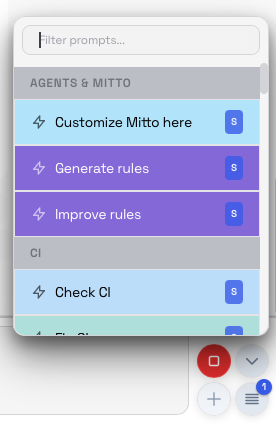
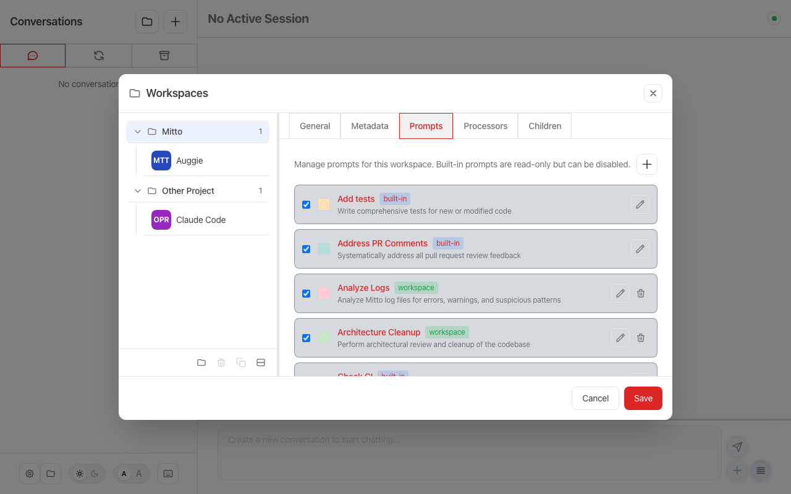

# Prompts and Quick Actions

Prompts (also called Quick Actions) are predefined text snippets that appear as buttons
in the chat interface. Clicking a prompt button sends its content to the AI agent,
saving you from typing common requests.



## Configuration in the UI

Prompts are managed per-workspace in the **Workspaces → Prompts** tab:



From this tab you can:

- **Enable/disable** any prompt (including built-in ones) using the checkbox
- **Edit** workspace prompts by clicking the ✏️ icon
- **Delete** workspace prompts using the 🗑️ icon
- **Add** new prompts with the **+** button

Each prompt shows its **source** as a badge:
- **built-in** — Shipped with Mitto (read-only, can be disabled)
- **workspace** — Defined in the project's `.mitto/prompts/` directory or `.mittorc`
- **global** — From the global prompts directory

Changes take effect immediately — prompts are hot-reloaded when the dropdown opens.

---

## YAML Configuration

### Overview

Prompts appear in a dropdown menu above the chat input. All prompt sources are
**merged server-side** into a single list per workspace. Higher-priority sources
override lower-priority ones with the same name. Disabled prompts are filtered out
automatically.

When you hover over a prompt button, a tooltip shows its description (if provided).

## Prompt Sources

Prompts can be defined in multiple locations. When prompts have the same name,
higher-priority sources override lower-priority ones.

| Priority    | Source                        | Location                         |
| ----------- | ----------------------------- | -------------------------------- |
| 1 (lowest)  | Built-in defaults             | `config/config.default.yaml`     |
| 2           | Global prompts directory      | `MITTO_DIR/prompts/*.prompt.yaml`         |
| 3           | Additional prompts dirs       | `prompts_dirs` in settings       |
| 4           | User settings file            | `MITTO_DIR/settings.yaml`        |
| 5           | Default workspace prompts dir | `$MITTO_WORKING_DIR/.mitto/prompts/*.prompt.yaml` |
| 6           | Workspace prompts dirs        | `prompts_dirs` in `.mittorc`     |
| 7 (highest) | Workspace `.mittorc` prompts  | `prompts:` in `.mittorc`         |

### 1. Built-in Default Prompts

Mitto includes a set of default prompts for common workflows. These are defined in
`config/config.default.yaml` and cannot be modified directly, but can be overridden by
defining a prompt with the same name in any higher-priority source.

Default prompts include:

- **Continue** - Resume the current task
- **Propose a plan** - Create a detailed plan
- **Summarize** - Summarize the conversation
- **Commit changes** - Create a git commit
- And more...

### 2. Global Prompts Directory

Store reusable prompts as YAML files in the global prompts directory:

| Platform | Location                                       |
| -------- | ---------------------------------------------- |
| macOS    | `~/Library/Application Support/Mitto/prompts/` |
| Linux    | `~/.local/share/mitto/prompts/`                |

Files must have a `.prompt.yaml` extension. Subdirectories are supported for organization:

```
prompts/
├── code-review.prompt.yaml
├── git/
│   ├── commit.prompt.yaml
│   └── pr-description.prompt.yaml
└── testing/
    └── write-tests.prompt.yaml
```

See [File Format](#file-format-for-global-prompts) below for the full specification.

### 3. User Settings File

Define prompts in your `settings.yaml` file under the `prompts:` key:

```yaml
# MITTO_DIR/settings.yaml
prompts:
  - name: "My Custom Prompt"
    prompt: "Do something specific..."
    backgroundColor: "#E8F5E9"
```

### 4. Default Workspace Prompts Directory

Mitto automatically searches for prompts in the `.mitto/prompts/` directory at the root
of each workspace. This allows you to store project-specific prompts directly in your
repository without any additional configuration.

```
my-project/
├── .mitto/
│   └── prompts/
│       ├── code-review.prompt.yaml
│       ├── deploy.prompt.yaml
│       └── run-tests.prompt.yaml
├── src/
└── package.json
```

This directory is automatically searched when you open the workspace - no `.mittorc`
configuration is required. The prompts use the same YAML format as global prompts
(see [File Format](#file-format-for-global-prompts)).

**Benefits:**

- **Zero configuration** - Just create the directory and add prompts
- **Version controlled** - Commit prompts alongside your code
- **Team sharing** - Share project-specific prompts with your team
- **Portable** - Prompts travel with the repository

**Priority:** Default workspace prompts are searched after global prompts but before
`prompts_dirs` configured in `.mittorc`. Prompts with the same name in higher-priority
sources will override those in `.mitto/prompts/`.

### 5. Workspace `.mittorc` File

Define workspace-specific prompts in a `.mittorc` file at the root of your project:

```yaml
# my-project/.mittorc
prompts:
  - name: "Run Tests"
    prompt: "Run the test suite with: npm test"
    backgroundColor: "#BBDEFB"

  - name: "Build Project"
    prompt: "Build the project with: npm run build"
    backgroundColor: "#E8F5E9"
```

Workspace prompts have the highest priority and appear in a separate "Workspace" section
in the UI.

## Additional Prompts Directories

You can configure additional directories to search for prompt files using the
`prompts_dirs` option. This allows you to:

- Share prompts across multiple projects
- Organize prompts in team-shared directories
- Keep project-specific prompts in custom locations

### Global `prompts_dirs` (in settings)

Add additional directories to search after the default `MITTO_DIR/prompts/`:

```yaml
# ~/.mittorc or MITTO_DIR/settings.yaml
prompts_dirs:
  - "/shared/team/prompts"
  - "/Users/me/my-prompts"
```

These directories are searched in order, with later directories overriding earlier ones
when prompts have the same name. All paths should be absolute.

### Workspace `prompts_dirs` (in `.mittorc`)

Add workspace-specific prompt directories:

```yaml
# my-project/.mittorc
prompts_dirs:
  - ".prompts" # Relative to workspace root
  - "/shared/team/prompts" # Absolute path

prompts:
  - name: "Inline Prompt"
    prompt: "This has highest priority"
```

**Path resolution:**

- Relative paths are resolved against the workspace root directory
- Absolute paths are used as-is
- Non-existent directories are silently ignored

**Priority order within workspace:**

1. Default `.mitto/prompts/` directory (lowest priority, automatically searched)
2. Prompts from `prompts_dirs` (in order listed)
3. Inline `prompts:` entries (highest priority)

### Example: Team Shared Prompts

```yaml
# ~/.mittorc (global)
prompts_dirs:
  - "/Users/Shared/team-prompts"

# my-project/.mittorc (workspace)
prompts_dirs:
  - ".prompts"  # Project-specific prompts

prompts:
  - name: "Deploy"
    prompt: "Deploy to staging environment"
```

In this setup:

1. `MITTO_DIR/prompts/` is always searched first
2. `/Users/Shared/team-prompts/` is searched next (from global config)
3. `my-project/.mitto/prompts/` is searched (default workspace prompts)
4. `my-project/.prompts/` is searched (from workspace `prompts_dirs`)
5. Inline prompts from `.mittorc` have highest priority

## File Format for Global Prompts

Global prompt files are standalone YAML files with the `.prompt.yaml` extension. The
entire file is YAML, with the prompt body stored as the `prompt:` key using a literal
block scalar (`|`).

```yaml
name: "Code Review"
description: "Review code for bugs and improvements"
backgroundColor: "#E8F5E9"
icon: "search"
tags: ["review", "quality"]
enabled: true
prompt: |
  Please review the following code for:

  - Bugs and potential issues
  - Performance improvements
  - Code style and best practices
  - Security vulnerabilities

  Provide specific suggestions with code examples where applicable.
```

### YAML Fields

| Field             | Required | Type     | Description                                                                                  |
| ----------------- | -------- | -------- | -------------------------------------------------------------------------------------------- |
| `name`            | No\*     | string   | Display name for the button. If omitted, derived from filename.                              |
| `description`     | No       | string   | Tooltip text shown on hover                                                                  |
| `group`           | No       | string   | Group name for organizing prompts in the menu (e.g., `"Git"`, `"Testing"`)                   |
| `menus`           | No       | string   | Comma-separated list of menus the prompt appears in: `prompts` (ChatInput dropup), `promptsPeriodic` (periodic prompt selector), `conversation` (per-conversation context menu), `beadsIssues` (per-issue context menu in the Beads list), and/or `beadsList` (list-level prompts button in the Beads list footer). Defaults to `prompts` if omitted. See [below](#menus). |
| `requires`        | No       | string   | Comma-separated list of capabilities the menu must provide for this prompt to appear. See [below](#requires-capability-gating). |
| `backgroundColor` | No       | string   | Hex color for the button (e.g., `"#E8F5E9"`)                                                 |
| `icon`            | No       | string   | Icon name shown next to the prompt in menus. See [valid names](#icon-names). Unknown names fall back to the default icon. |
| `tags`            | No       | string[] | Categorization tags (reserved for future use)                                                |
| `acps`            | No       | string   | Comma-separated ACP server types this prompt belongs to. Makes the prompt server-specific.   |
| `enabled`         | No       | bool     | Set to `false` to disable the prompt. Default: `true`                                        |
| `enabledWhen`     | No       | string   | CEL expression for conditional enablement. See [below](#enabledwhen-conditional-enablement). |
| `periodic`        | No       | mapping  | Opt-in periodic mode — presence makes the prompt behave **context-sensitively** when selected (start a new recurring conversation, convert an existing one to periodic, or send a single one-shot run). See [below](#periodic-prompts). |
| `prompt`          | Yes\*\*  | string   | The prompt body text, written as a YAML literal block scalar (`\|`). |

\*If `name` is not specified, it's derived from the filename (e.g., `code-review.prompt.yaml` →
"code-review").

\*\*`prompt` is optional for disable-only overrides — an entry with only `name` and `enabled: false` is valid.

### icon (Names)

The optional `icon` field shows an icon next to the prompt in menus. The value is the
name of one of Mitto's built-in icons (matched case-insensitively). If the name is
empty or unknown, the prompt falls back to the default lightning/insert icon.

Available names:

`beads`, `settings`, `sliders`, `search`, `edit`, `trash`, `broom`, `save`,
`magic-wand`, `lightning`, `robot`, `person`, `image`, `folder`, `folder-open`,
`terminal`, `server`, `globe`, `chat-bubble`, `shield`, `layers`, `list`, `tag`,
`check`, `question`, `error`, `plus`, `hourglass`, `refresh`, `sync`, `keyboard`,
`duplicate`, `pin`, `archive`, `periodic`, `queue`, `play`.

The registry is defined in `web/static/components/Icons.js` (`PROMPT_ICONS`); add an
entry there to expose additional icons by name.

### Conditional Enablement Overview

Mitto provides two fields for controlling when prompts appear:

| Field         | Type | Evaluated  | Use Case                                    |
| ------------- | ---- | ---------- | ------------------------------------------- |
| `enabled`     | bool | At load    | Permanently disable a prompt                |
| `enabledWhen` | CEL  | At display | Dynamic conditions based on session context |

**Evaluation order:** If `enabled: false`, the prompt is never loaded. Otherwise, the
`enabledWhen` CEL expression must evaluate to `true` for the prompt to appear.

**Example:**

```yaml
name: "JIRA: start work"
description: "Pick a JIRA ticket and spawn parallel conversations"
group: "JIRA"
backgroundColor: "#BBDEFB"
enabled: true
enabledWhen: '!session.isChild && acp.matchesServerType(["augment", "claude-code"]) && tools.hasAllPatterns(["jira_*", "mitto_conversation_*"])'
prompt: |
  (prompt body here)
```

This prompt:

- Is enabled (not permanently disabled)
- Only appears in parent conversations (not children)
- Only appears when using Auggie or Claude Code
- Only appears when both JIRA and Mitto MCP tools are available

### Multi-line Prompts

The prompt body (`prompt:` key) can span multiple lines and supports full
markdown. Use the YAML literal block scalar (`|`) to preserve newlines:

```yaml
name: "Detailed Analysis"
prompt: |
  Please analyze the code with the following criteria:

  ## Performance

  - Identify bottlenecks
  - Suggest optimizations

  ## Security

  - Check for vulnerabilities
  - Review input validation

  ## Maintainability

  - Assess code clarity
  - Suggest refactoring opportunities
```

## Menus

The `menus` attribute is a **comma-separated list** that controls which UI menus a
prompt appears in. The available menu values are:

| Menu              | Where it appears                                                                                  |
| ----------------- | ------------------------------------------------------------------------------------------------- |
| `prompts`         | The **ChatInput dropup** — the "Insert predefined prompt" menu (the `^` button) above the chat input. |
| `promptsPeriodic` | The **periodic prompt selector** — the prompt dropdown shown in the inline editor of a periodic conversation. |
| `conversation`    | The **per-conversation context menu** — shown when you right-click a conversation in the sidebar.  |
| `beadsIssues`     | The **per-issue context menu** — shown when you right-click an issue in the Beads list view.        |
| `beadsList`       | The **list-level prompts button** — the dropdown next to the `+` button in the Beads list footer.   |

If a prompt has **no `menus` attribute**, it defaults to `prompts` (the ChatInput
dropup only). To make a prompt appear in both menus, list both values:

```yaml
name: "Summarize Progress"
description: "Ask the agent to summarize what has been done so far"
group: "Workflow"
menus: prompts, conversation
prompt: |
  Summarize everything we've accomplished in this conversation so far.
```

Whitespace around each entry is ignored. Because `menus` is an explicit list, a
prompt with `menus: conversation` (without `prompts`) appears **only** in the
conversation context menu and is **excluded** from the ChatInput dropup.

### Periodic Prompt Selector Menu

Prompts whose `menus` list includes `promptsPeriodic` appear in the **periodic
prompt selector** — the prompt dropdown shown in the inline editor of a periodic
conversation, where you pick which prompt the scheduler runs on each tick.

The periodic selector shows the **union** of `prompts` and `promptsPeriodic`: any
prompt available in the ChatInput dropup also appears in the selector, so existing
prompts keep working without changes. To make a prompt appear **only** in the
periodic selector (and hide it from the regular dropup), set `menus:
promptsPeriodic` without `prompts`:

```yaml
name: "Babysit PRs"
description: "Check for pending reviews and stale branches"
group: "GitHub"
menus: promptsPeriodic
prompt: |
  Check the repository for pending review requests and stale branches.
```

Pair this with the `session.isPeriodicConversation` CEL variable (see
[enabledWhen](#enabledwhen-conditional-enablement)) if you also want the prompt
hidden everywhere outside periodic conversations.

### Conversation Context Menu

In the conversation context menu, these prompts appear **after** the standard
**Archive**, **Properties**, and **Delete** entries. They are organized into
submenus by their `group` attribute, so the example above renders as:

```
Archive
Properties
Delete
Workflow ›
    Summarize Progress
```

Prompts without a `group` are collected under an **"Other"** submenu.

### Behavior

- **Only prompts whose `menus` list includes `conversation`** appear in the context
  menu. Prompts without it are excluded (they appear in the ChatInput dropup instead,
  provided their `menus` includes `prompts` or omits the attribute).
- Clicking a prompt **enqueues its text** to that conversation via the message
  queue. The agent processes it as soon as the conversation is idle, so this works
  for **any** conversation — not just the currently active one.
- `enabledWhen` and `enabled` are honored, but — unlike the dropup, which is
  evaluated for the **active** conversation — the context menu evaluates each
  prompt's `enabledWhen` against the **conversation you right-clicked**. The menu
  is populated on demand for that specific conversation, so context-dependent
  prompts (e.g. `enabledWhen: "session.isChild"` for "Report to parent", or
  `enabledWhen: "children.exists"` for "Continue in existing") appear
  only on the conversations where they apply.
- `@mitto:` [variable substitution](#variable-substitution-in-prompts) is applied
  to the enqueued text in the target conversation's context before it reaches the
  agent.

### Beads Context Menu

Prompts whose `menus` list includes `beadsIssues` appear in the **per-issue context
menu** of the Beads list view — the menu shown when you right-click an issue.
Alongside common bead actions (e.g. **Delete**), the menu includes a **New**
submenu listing every `menus: beadsIssues` prompt.

Selecting one of these prompts starts a new conversation seeded with the prompt
text, and the menu supplies the selected issue's ID as an `ISSUE_ID` argument. The
prompt body should reference it via `${ISSUE_ID}` and load its own context with
`bd show ${ISSUE_ID}` rather than relying on a pre-built context block:

```yaml
name: "Start work"
group: "Beads"
menus: beadsIssues
requires: parameters
prompt: |
  The target bead is `${ISSUE_ID}`.

  Load its full detail:

      bd show ${ISSUE_ID} --long --json

  then claim it and propose a plan.
```

Because the `beadsIssues` menu always provides the `parameters` capability (it
passes `{ ISSUE_ID: <issue.id> }`), issue-scoped prompts set `requires: parameters`
so they appear **only** in this menu and not in the generic `prompts` dropup, where
no `ISSUE_ID` would be available. See [Prompt Arguments](#prompt-arguments) and
[requires (Capability Gating)](#requires-capability-gating) for the underlying
mechanism.

### Beads List Menu

Prompts whose `menus` list includes `beadsList` appear in the **list-level prompts
button** of the Beads list view — the dropdown next to the `+` button in the footer
toolbar. Unlike `beadsIssues` prompts, these operate on the whole issue list (e.g.
cleaning up old issues or triaging the backlog) rather than a single issue, so they
**take no parameters**. Selecting one creates a new conversation seeded with the
prompt text alone.

```yaml
name: "Beads: cleanup old issues"
group: "Beads"
menus: beadsList
prompt: |
  (prompt body here)
```

## Periodic Prompts

A prompt can declare a `periodic:` mapping to opt into **periodic mode**. How a
periodic-declaring prompt behaves when selected is **context-sensitive** — it
depends on the conversation it targets. It can start a new recurring conversation,
convert an existing conversation to periodic, or send a single one-shot run (see
[Behavior](#behavior) below).

### Periodic Fields

```yaml
periodic:
  value: 1           # number of time units between runs (integer ≥ 1); used by trigger: schedule
  unit: hours        # minutes | hours | days; used by trigger: schedule
  at: "09:00"        # optional — time of day in HH:MM (local time in the UI, stored as UTC); only valid for unit: days
  maxIterations: 10  # optional; 0/absent = unlimited scheduled runs
  trigger: schedule  # optional — schedule (default) | onCompletion
  delay: 30          # optional — seconds to wait after the agent stops, before the next onCompletion run
  maxDuration: "4h"  # optional — wall-clock cap (e.g. 30m, 4h, 1d); 0/absent = unlimited
```

| Field           | Required | Description |
| --------------- | -------- | ----------- |
| `value`         | Yes¹     | Number of time units between runs (integer ≥ 1, max 999) |
| `unit`          | Yes¹     | `minutes`, `hours`, or `days` |
| `at`            | No       | Time of day (`HH:MM`) for daily schedules only. Ignored for other units. |
| `maxIterations` | No       | Cap on the number of scheduled runs (integer ≥ 0). `0` or absent means unlimited at the prompt level. See [Max iterations and auto-stop](#max-iterations-and-auto-stop). |
| `trigger`       | No       | How runs fire: `schedule` (default — frequency-based) or `onCompletion` (fire after the agent stops responding). See [Triggers](#triggers-schedule-vs-on-completion). |
| `delay`         | No       | For `trigger: onCompletion` only — seconds to wait after the agent finishes before the next run. Clamped up to the global floor (`min_periodic_completion_delay_seconds`, default 5). Ignored for `schedule`. |
| `maxDuration`   | No       | Wall-clock cap as a duration string (`30m`, `4h`, `1d`). Once it elapses (measured from the first run), the conversation auto-stops. `0`/absent = unlimited. |

¹ Required for `trigger: schedule` (the default). Ignored for `trigger: onCompletion`, which fires off the agent-idle event rather than a fixed period.

**Presence implies opt-in** — omitting the `periodic:` block entirely keeps the prompt as a regular one-time prompt.

The `value` / `unit` / `at` fields double as the **default period** applied
whenever a conversation is made periodic (see [Default period](#default-period)).

### Behavior

A periodic-declaring prompt is **context-sensitive**: what happens when you select
it depends on the conversation it targets. The decision is made by
`decidePeriodicAction` (see `web/static/hooks/useConversationSeeding.js`).

| Context | What happens |
| ------- | ------------ |
| **No active conversation** (selecting the prompt to start fresh) | A **frequency dialog** (`PeriodicScheduleDialog`) opens, pre-filled from the prompt's `periodic` defaults (period, `at`, and **max runs**). On confirm, a **new periodic conversation** is created (no queue seed) and `PUT /api/sessions/{id}/periodic` configures the named prompt on the declared schedule. |
| **Regular (running, non-periodic, top-level) conversation** | The conversation is made **immediately periodic** using the prompt's declared defaults — **no dialog** — and the **first run fires right away** (PUT periodic, then `POST /api/sessions/{id}/periodic/run-now`). The scheduled prompt is now this prompt. |
| **Already-periodic conversation, or a child conversation** | The prompt contents are sent **once** (a one-shot enqueue) and the conversation's configured periodic prompt, schedule, and iteration cap are **left untouched**. |

#### Default period

The `value` / `unit` / `at` fields are the **default period** applied whenever a
conversation is made periodic — both when creating a new periodic conversation
(pre-filled into the dialog, where the user may adjust them) and when converting a
regular conversation (`makePeriodicNow` uses them directly, without showing the
dialog).

#### Max iterations and auto-stop

`maxIterations` caps the number of **scheduled runs** before the conversation
auto-stops. The periodic engine counts each delivered run (`iteration_count`) and,
when the cap is reached, **disables** the periodic prompt so it stops firing. The
prompt is **not** deleted or archived — you can re-enable it at any time.

The binding cap is the **smallest positive** of:

- the prompt's `maxIterations`,
- the server's `conversations.max_periodic_iterations` setting (default `100`,
  `0` = unlimited), and
- a hardcoded absolute backstop of `1000`.

A `maxIterations` of `0` (or absent) means "unlimited" at the prompt level, but the
config setting and the backstop still apply.

#### Triggers: schedule vs on-completion

The `trigger` field selects **when** a periodic run fires:

- **`schedule`** (default) — runs fire on a fixed period defined by `value`/`unit`
  (and optional `at` for daily). This is the classic interval behavior.
- **`onCompletion`** — the next run is armed **after the agent stops responding**,
  waiting `delay` seconds first. Each delivered run's completion arms the following
  one, so the loop is event-driven rather than clock-driven. The `delay` is clamped
  up to the global floor (`min_periodic_completion_delay_seconds`, default 5 s) to
  prevent hot loops.

`maxDuration` applies to **both** triggers: it is a wall-clock cap measured from the
first run. Once exceeded, the periodic prompt is **disabled** (not deleted) on the
next check, exactly like the [max-iterations auto-stop](#max-iterations-and-auto-stop).
Combine `maxDuration` with `maxIterations` to bound a loop by either time or count,
whichever comes first. See
[On-Completion Trigger and Max Duration](conversations.md#on-completion-trigger-and-max-duration)
for the server-side floor and defaults.

**Restrictions:**
- Periodic conversations can only be **top-level** (not child) conversations. Selecting a periodic prompt on a child conversation falls through to the one-shot send; the backend also returns HTTP 400 for periodic-on-child.
- The `at` field is only sent for `unit: days`; it is ignored otherwise (matches `Frequency.Validate()` on the backend).

### Example

```yaml
name: "Daily Standup"
description: "Run the daily team standup"
group: "Workflow"
menus: conversation, beadsIssues
periodic:
  value: 1
  unit: days
  at: "09:00"
prompt: |
  You are running the daily standup. Check progress, surface blockers, and
  summarize what the team completed yesterday and plans for today.
```

Selecting **Daily Standup** with **no active conversation** opens a dialog
pre-filled with "every 1 day at 09:00" and "max runs 0 (unlimited)"; confirming
creates a new periodic conversation that runs this prompt daily at 09:00 UTC.
Selecting it on a **regular running conversation** instead converts that
conversation to periodic immediately (using the same defaults) and fires the first
run. Selecting it on an **already-periodic** conversation just runs it once,
leaving the schedule unchanged.

### Real-world example: auto-periodic, self-terminating

The builtin **"Iterate until complete"** prompt
(`config/prompts/builtin/beads-iterate-until-complete.prompt.yaml`) is a real
auto-periodic example: a `menus: beadsIssues` prompt with a `periodic:` block
(every 30 minutes, `maxIterations: 20`). Selecting it on a beads issue or epic
starts a periodic conversation that, on each scheduled run, advances the target
one concrete increment (for an epic, the next ready child) and logs progress to
the tracker. Scheduled runs are **non-interactive** (branch on `@mitto:periodic` /
`@mitto:periodic_forced`; use `mitto_ui_notify` only). When nothing ready remains
in scope, it **self-terminates** — `mitto_conversation_update(conversation_id:
"self", periodic_enabled: false)` turns it back into a regular conversation. It is
the automated sibling of the interactive "Start work" (`beads-issue-work`) prompt.

## Prompt Arguments

Prompt text supports bash-style `${VAR}` placeholder syntax for argument substitution.
This lets a caller supply named values that are interpolated into the prompt before it
is sent to the agent.

### Syntax

| Placeholder           | Behaviour                                                                                                          |
| --------------------- | ------------------------------------------------------------------------------------------------------------------ |
| `${VAR}`              | Replaced with the supplied value, or an empty string if `VAR` was not provided.                                    |
| `${VAR:-default}`     | Replaced with the supplied value if present **and non-empty**, otherwise with `default` (bash `:-` semantics).     |
| `\${VAR}`             | The leading backslash is an escape: the literal text `${VAR}` is emitted without substitution.                     |

Surrounding single or double quotes around the default are stripped automatically:
`${VAR:-"a value"}` → `a value`, `${VAR:-'other'}` → `other`.

### When substitution is applied

Argument substitution is applied **only** when the caller explicitly supplies an
`arguments` map alongside the prompt — for example:

- Prompts run from a **context menu** (conversation or Beads issue) that passes
  structured arguments.
- Prompts sent via the MCP `mitto_conversation_send_prompt` tool's `arguments`
  parameter.

**Ad-hoc user-typed messages are never substituted.** If a user types or pastes
text containing `${...}` into the chat input it reaches the agent verbatim — no
substitution is performed, so shell scripts and code snippets are safe.

The transcript always shows the **substituted** text, not the original template.

### Example

```yaml
name: "Beads: start work"
group: "Beads"
menus: beadsIssues
requires: parameters
prompt: |
  You are starting work on Beads issue **${ISSUE_ID}** — *${ISSUE_TITLE:-Untitled}*.

  ${ISSUE_BODY}

  Please begin by reading the full issue description above, then propose a plan.
```

Here `${ISSUE_ID}` is required (no default), `${ISSUE_TITLE:-Untitled}` falls back to
`"Untitled"` if omitted, and `${ISSUE_BODY}` expands to empty string if not supplied.

## requires (Capability Gating)

The `requires` field lets a prompt declare which **capabilities** a menu
must provide before the prompt is shown in that menu. This is the counterpart to the
`menus` field: `menus` says *where* a prompt can appear; `requires` says *what the
menu must supply* for it to be usable there.

### Syntax

```yaml
requires: capability1, capability2
```

The value is a **comma-separated list** of capability names (parsed identically to
`menus`). Whitespace around each entry is ignored.

### YAML example

```yaml
name: "Beads: start work"
group: "Beads"
menus: beadsIssues
requires: parameters
prompt: |
  (prompt body here)
```

### Visibility rule

A prompt appears in menu **M** if and only if **both** conditions hold:

1. The prompt's `menus` list includes `M` (or `menus` is omitted and M is `prompts`).
2. Menu `M` provides **every** capability listed in `requires`.

If a prompt has no `requires` field (or an empty one), condition 2 is vacuously true
and the prompt appears in any menu it targets via `menus`.

### Provided capabilities per menu

| Menu | Provided capabilities |
| ---- | --------------------- |
| `prompts` (ChatInput dropup) | *(none)* |
| `promptsPeriodic` (periodic prompt selector) | *(none)* |
| `conversation` (per-conversation context menu) | *(none)* |
| `beadsIssues` (Beads issue context menu) | `parameters` |
| `beadsList` (Beads list-level prompts button) | *(none)* |

The `parameters` capability means the menu always passes a structured `arguments` map
when it invokes a prompt. Prompts that are **useless without arguments** (i.e., they
have required `${VAR}` placeholders with no meaningful default) should set
`requires: parameters` so they are hidden from menus that cannot supply them.

Prompts that can degrade gracefully — because all placeholders have sensible defaults
via `${VAR:-default}` — should **omit** `requires` and let the defaults handle the
missing arguments instead.

### Why a list, not a boolean?

`requires` is designed as a list (rather than `requires_parameters: true`) so that
future capability types can be added without changing the field semantics. For now
`parameters` is the only defined capability.

## Variable Substitution in Prompts

Prompt text supports `@mitto:variable` placeholders that are automatically replaced with
live session values before the prompt is sent to the AI agent. This is the same variable
substitution system used by [message processors](processors.md#variable-substitution).

### Available Variables

| Variable                       | Description                                                                  |
| ------------------------------ | ---------------------------------------------------------------------------- |
| `@mitto:session_id`            | Current session/conversation ID                                              |
| `@mitto:parent_session_id`     | Parent conversation ID (empty if root session)                               |
| `@mitto:parent`                | Parent session as "id (name)" or empty                                       |
| `@mitto:session_name`          | Conversation title/name                                                      |
| `@mitto:working_dir`           | Session working directory                                                    |
| `@mitto:acp_server`            | ACP server name (e.g., "claude-code")                                        |
| `@mitto:workspace_uuid`        | Workspace identifier                                                         |
| `@mitto:beads_issue`           | Linked beads issue ID (e.g. "bd-123"), empty if none                         |
| `@mitto:available_acp_servers` | ACP servers for this workspace, comma-separated with tags and current marker |
| `@mitto:children`              | Child sessions, comma-separated with names and ACP servers                   |
| `@mitto:periodic`              | `"true"` if this prompt was triggered by the periodic runner, `"false"` otherwise |
| `@mitto:periodic_forced`       | `"true"` if this is a manually-triggered periodic run (via "run now"), `"false"` otherwise |

### Behavior

- **Automatic**: Substitution happens after all processors run, on the final assembled
  message — no configuration needed.
- **Unknown variables**: `@mitto:unknown` is left verbatim in the text.
- **Empty values**: e.g., `@mitto:parent_session_id` when there is no parent → replaced
  with empty string.
- **Fast path**: If the prompt text contains no `@mitto:`, the substitution pass is
  skipped entirely.

### Why Use Variables in Prompts?

Variables are especially useful for prompts that instruct the AI agent to call MCP tools.
Many Mitto MCP tools (like `mitto_conversation_new`, `mitto_ui_options`, etc.) require
a `self_id` parameter. By providing `@mitto:session_id` directly in the prompt text, you
eliminate the need for the agent to first call `mitto_conversation_get_current` to discover
its session ID — saving a tool call round-trip.

Similarly, `@mitto:available_acp_servers` and `@mitto:children` provide information that
would otherwise require additional tool calls to retrieve.

### Example

A prompt that helps the agent use Mitto MCP tools efficiently:

```yaml
name: "Spawn Workers"
enabledWhen: 'tools.hasPattern("mitto_conversation_*")'
prompt: |
  ## Session Context

  Your session ID is `@mitto:session_id` — use this as `self_id` for all MCP tool calls.
  Available ACP servers: `@mitto:available_acp_servers`
  Existing children: `@mitto:children`

  ## Instructions

  Create child conversations to work on subtasks...
```

### Important: Child Session Limitation

When a prompt instructs the agent to create child conversations via
`mitto_conversation_new`, the `initial_prompt` text passed to the child **will not**
benefit from the parent's `@mitto:` substitution for the child's own context. The parent's
`@mitto:session_id` resolves to the parent's ID, not the child's.

Children that need their own session ID (e.g., for `mitto_children_tasks_report`) must
call `mitto_conversation_get_current(self_id: "init")` to discover it. This is the one
case where the tool call cannot be avoided.

### Minimal Example

A file with just a `prompt:` field uses the filename as the name:

```yaml
prompt: |
  Fix any linting errors in the current file.
```

If saved as `fix-lint.prompt.yaml`, this creates a prompt named "fix-lint".

## enabledWhen: Conditional Enablement

The `enabledWhen` field allows you to conditionally show or hide prompts based on the
current conversation context using [CEL (Common Expression Language)](https://github.com/google/cel-go)
expressions.

### Basic Syntax

```yaml
name: "Create Minions"
description: "Break work into parallel tasks"
enabledWhen: "!session.isChild"
prompt: |
  (prompt body here)
```

When `enabledWhen` evaluates to `true`, the prompt is visible. When it evaluates to
`false`, the prompt is hidden. If the expression is invalid or evaluation fails, the
prompt is shown (fail-open behavior for safety).

### Available Context Variables

#### ACP Server Context (`acp.*`)

Information about the AI agent (ACP server) used in the current conversation.

| Variable          | Type      | Description                                |
| ----------------- | --------- | ------------------------------------------ |
| `acp.name`        | string    | ACP server name (e.g., `"Claude Code"`)    |
| `acp.type`        | string    | Server type (e.g., `"claude"`, `"auggie"`) |
| `acp.tags`        | list[str] | Server tags (e.g., `["coding", "fast"]`)   |
| `acp.autoApprove` | bool      | Whether auto-approve is enabled            |

#### Workspace Context (`workspace.*`)

Information about the current workspace.

| Variable           | Type   | Description                  |
| ------------------ | ------ | ---------------------------- |
| `workspace.uuid`   | string | Unique workspace identifier  |
| `workspace.folder` | string | Workspace directory path     |
| `workspace.name`   | string | Display name (if configured) |

#### Session Context (`session.*`)

Information about the current conversation/session.

| Variable              | Type   | Description                                              |
| --------------------- | ------ | -------------------------------------------------------- |
| `session.id`          | string | Session identifier                                       |
| `session.name`        | string | Session display name                                     |
| `session.isChild`     | bool   | `true` if this is a child conversation                   |
| `session.isAutoChild` | bool   | `true` if created automatically by parent                |
| `session.parentId`    | string | Parent session ID (empty if not a child)                 |
| `session.isPeriodic`  | bool   | `true` if this prompt was triggered by the periodic runner |
| `session.isPeriodicConversation` | bool   | `true` if this is a periodic conversation (it has a periodic prompt configuration) |
| `session.hasBeadsIssue` | bool   | `true` if the conversation has a beads issue associated                  |
| `session.beadsIssue`  | string | Linked beads issue ID (empty if none)                                    |

#### Parent Context (`parent.*`)

Information about the parent conversation (only meaningful for child sessions).

| Variable           | Type   | Description                     |
| ------------------ | ------ | ------------------------------- |
| `parent.exists`    | bool   | `true` if parent session exists |
| `parent.name`      | string | Parent session name             |
| `parent.acpServer` | string | ACP server used by parent       |

#### Children Context (`children.*`)

Information about child conversations spawned from this session.

| Variable              | Type      | Description                                  |
| --------------------- | --------- | -------------------------------------------- |
| `children.count`      | int       | Number of direct child sessions              |
| `children.exists`     | bool      | `true` if has at least one child             |
| `children.mcpCount`   | int       | Number of children created via MCP tools     |
| `children.names`      | list[str] | List of child session names                  |
| `children.acpServers` | list[str] | List of ACP servers used by children         |

#### Permissions Context (`permissions.*`)

Information about the permissions granted to the current session.

| Variable                                | Type | Description                                                           |
| --------------------------------------- | ---- | --------------------------------------------------------------------- |
| `permissions.canDoIntrospection`        | bool | Whether the session can access Mitto's MCP server for introspection   |
| `permissions.canSendPrompt`             | bool | Whether the session can send prompts to other conversations           |
| `permissions.canPromptUser`             | bool | Whether MCP tools can display interactive prompts to the user         |
| `permissions.canStartConversation`      | bool | Whether the session can create new conversations                      |
| `permissions.canInteractOtherWorkspaces`| bool | Whether the session can interact with other workspaces                |
| `permissions.autoApprovePermissions`    | bool | Whether permission requests are auto-approved                         |

#### MCP Tools Context (`tools.*`)

Information about available MCP tools. Note: Tool information may not be available
immediately when a session starts.

| Variable          | Type      | Description                         |
| ----------------- | --------- | ----------------------------------- |
| `tools.available` | bool      | `true` if tool list has been loaded |
| `tools.names`     | list[str] | List of available tool names        |

**Custom functions:**

| Function                              | Returns | Description                                                   |
| ------------------------------------- | ------- | ------------------------------------------------------------- |
| `acp.matchesServerType("type")`           | bool    | `true` if ACP type matches (case-insensitive, fail-open)      |
| `acp.matchesServerType(["a", "b"])`       | bool    | `true` if ACP matches any of the listed servers               |
| `tools.hasPattern("glob")`            | bool    | `true` if any tool matches the glob pattern                   |
| `tools.hasAllPatterns(["g1", "g2"])`   | bool    | `true` if ALL glob patterns are satisfied                     |
| `tools.hasAnyPattern(["g1", "g2"])`    | bool    | `true` if ANY glob pattern is satisfied                       |

The glob pattern supports `*` (any characters) and `?` (single character).

**`acp.matchesServerType` details:**
- Compares against `acp.type` only (case-insensitive), not the display name
- **Fail-open**: Returns `true` when no ACP server is active (so prompts remain visible during startup)

### CEL Expression Examples

#### Session Hierarchy

```yaml
# Only show in parent conversations (not in children)
enabledWhen: "!session.isChild"

# Only show in child conversations
enabledWhen: "session.isChild"

# Only show in manually-created child conversations
enabledWhen: "session.isChild && !session.isAutoChild"

# Show only if this session has spawned children
enabledWhen: "children.exists"

# Show only if this session has no children
enabledWhen: "children.count == 0"
```

#### ACP Server Filtering

```yaml
# Only for a specific ACP server type (case-insensitive, fail-open)
enabledWhen: 'acp.matchesServerType("augment")'

# Only for one of several server types
enabledWhen: 'acp.matchesServerType(["augment", "claude-code"])'

# Only for Claude-based servers (name prefix match)
enabledWhen: 'acp.name.startsWith("Claude")'

# Only for servers tagged with "coding"
enabledWhen: '"coding" in acp.tags'

# Only for fast models
enabledWhen: '"fast" in acp.tags || "quick" in acp.tags'

# Only when auto-approve is disabled
enabledWhen: "!acp.autoApprove"
```

#### MCP Tool Requirements

```yaml
# Only show if GitHub tools are available
enabledWhen: 'tools.hasPattern("github_*")'

# Only show if Jira tools are available
enabledWhen: 'tools.hasPattern("jira_*")'

# Require ALL tool patterns to be satisfied (AND logic)
enabledWhen: 'tools.hasAllPatterns(["jira_*", "mitto_conversation_*"])'

# Require ANY tool pattern to be satisfied (OR logic)
enabledWhen: 'tools.hasAnyPattern(["github_*", "gitlab_*"])'

# Only show if any database tool is available
enabledWhen: 'tools.hasPattern("*_database_*") || tools.hasPattern("*_sql_*")'

# Only when tools have been loaded
enabledWhen: "tools.available"
```

#### Permissions

```yaml
# Only show delegation prompts when sending to other conversations is allowed
enabledWhen: "children.exists && permissions.canSendPrompt"

# Only show "spawn workers" when conversation creation is allowed
enabledWhen: "!session.isChild && permissions.canStartConversation"

# Require both creation and communication permissions
enabledWhen: "!session.isChild && permissions.canStartConversation && permissions.canSendPrompt"
```

#### Combined Conditions

```yaml
# Coordinator prompt: only in parent sessions with coding servers
enabledWhen: '!session.isChild && "coding" in acp.tags'

# Report-to-parent prompt: only in children with existing parent
enabledWhen: "session.isChild && parent.exists"

# GitHub PR prompt: only with GitHub tools and not in child sessions
enabledWhen: '!session.isChild && tools.hasPattern("github_*")'

# Complex workspace check
enabledWhen: 'workspace.folder.contains("my-project") && "fast" in acp.tags'
```

#### Real-World Examples from Builtin Prompts

These examples are from Mitto's built-in prompts:

```yaml
# "Create minions" - Spawn parallel worker conversations
# Only in parent conversations, requires Mitto MCP tools
enabledWhen: '!session.isChild && permissions.canStartConversation && tools.hasPattern("mitto_conversation_*")'

# "Report to parent" - Send status back to parent
# Only in child conversations that have a parent
enabledWhen: 'session.isChild && parent.exists && permissions.canSendPrompt && tools.hasPattern("mitto_conversation_*")'

# "Continue work in child" - Resume work in existing child
# Only when the session has spawned children
enabledWhen: 'children.exists && permissions.canSendPrompt && tools.hasPattern("mitto_conversation_*")'

# "JIRA: start work" - Pick a ticket and spawn workers
# Only in parent conversations, requires both JIRA and Mitto tools
enabledWhen: '!session.isChild && permissions.canStartConversation && tools.hasAllPatterns(["jira_*", "mitto_conversation_*"])'

# "Improve Augment rules" - Update .augment/rules
# Only when using Augment-type agents (not Claude Code or other agents)
enabledWhen: 'acp.matchesServerType("augment")'

# "Handoff to new conversation" - Continue in a new session
# Only in parent conversations, requires Mitto tools
enabledWhen: '!session.isChild && permissions.canStartConversation && tools.hasPattern("mitto_conversation_*")'
```

### CEL Language Reference

CEL is a simple expression language designed for evaluation. Key features:

**Operators:**

- Comparison: `==`, `!=`, `<`, `<=`, `>`, `>=`
- Logical: `&&` (and), `||` (or), `!` (not)
- Membership: `in` (e.g., `"tag" in acp.tags`)
- Ternary: `condition ? value_if_true : value_if_false`

**String functions:**

- `str.startsWith(prefix)` - Check prefix
- `str.endsWith(suffix)` - Check suffix
- `str.contains(substring)` - Check substring
- `str.matches(regex)` - Regex matching
- `str.size()` - String length

**List functions:**

- `list.size()` - List length
- `value in list` - Membership check
- `list.exists(x, condition)` - Any element matches
- `list.all(x, condition)` - All elements match

**Examples:**

```cel
// String operations
acp.name.startsWith("Claude")
workspace.folder.contains("/projects/")

// List operations
acp.tags.size() > 0
acp.tags.exists(t, t == "coding")
children.names.all(n, n.startsWith("Worker"))

// Ternary
children.count > 5 ? true : acp.autoApprove
```

For full CEL documentation, see the [CEL Language Definition](https://github.com/google/cel-spec/blob/master/doc/langdef.md).

### Error Handling

- **Invalid expression syntax**: Prompt is shown (fail-open), warning logged
- **Evaluation error**: Prompt is shown (fail-open), warning logged
- **Missing context**: Default values used (empty strings, false booleans, zero counts)
- **Tools not yet loaded**: `tools.available` is `false`, `tools.names` is empty

## Priority and Override Behavior

When multiple sources define prompts with the same name, the higher-priority source
wins. All sources are merged **server-side** into a single list per workspace:

1. **Built-in defaults** (lowest priority)
2. **Global prompts directory** (`MITTO_DIR/prompts/`)
3. **User settings** (`settings.yaml`)
4. **ACP server-specific prompts** (per-server files and inline config)
5. **Workspace prompts directory** (`.mitto/prompts/`)
6. **Workspace `.mittorc` inline prompts** (highest priority)

### Disabling a Prompt

You can disable any prompt (built-in, global, or workspace) using the UI or
by editing configuration files directly.

**Option 1: Via the UI (recommended)**

Open the Workspaces dialog, select a workspace, and toggle the switch next to
any prompt to disable it. This persists the `enabled: false` state in the
appropriate workspace-local file:

- If the prompt has a `.prompt.yaml` file in `.mitto/prompts/`, the `enabled: false`
  field is updated in that file.
- Otherwise, an entry is added to the workspace `.mittorc` file.

Re-enabling a prompt via the UI removes the `enabled: false` override.

**Option 2: In workspace `.mittorc`**

```yaml
# my-project/.mittorc
prompts:
  - name: "Continue"
    enabled: false
```

**Option 3: In a workspace prompt file**

```yaml
name: "Continue"
enabled: false
```

**Option 4: In global prompts directory**

Create a file in `MITTO_DIR/prompts/` with `enabled: false`. This disables
the prompt across all workspaces (unless a workspace re-enables it).

```yaml
name: "Continue"
enabled: false
```

### Overriding a Built-in Prompt

To customize a built-in prompt, create one with the same name:

```yaml
name: "Continue"
description: "Resume work with my custom workflow"
backgroundColor: "#FFF3E0"
prompt: |
  Continue with the current task. Before proceeding:

  1. Run `git status` to check for uncommitted changes
  2. Review the task list
  3. Pick up where we left off
```

## Examples

### Code Review Prompt

```yaml
name: "Code Review"
description: "Thorough code review with actionable feedback"
backgroundColor: "#E8F5E9"
tags: ["review", "quality"]
prompt: |
  Please review the code I'm about to share. Focus on:

  ## Correctness

  - Logic errors and edge cases
  - Proper error handling
  - Type safety issues

  ## Performance

  - Unnecessary computations
  - Memory leaks
  - N+1 queries

  ## Maintainability

  - Code clarity and naming
  - DRY violations
  - Missing documentation

  ## Security

  - Input validation
  - Authentication/authorization
  - Data exposure

  Provide specific, actionable feedback with code examples.
```

### Git Workflow Prompt

```yaml
name: "Git Commit"
description: "Generate a conventional commit message"
backgroundColor: "#FFF3E0"
tags: ["git", "workflow"]
prompt: |
  Generate a commit message for the staged changes.

  Follow the Conventional Commits format:

  - `feat:` for new features
  - `fix:` for bug fixes
  - `docs:` for documentation
  - `refactor:` for code refactoring
  - `test:` for adding tests
  - `chore:` for maintenance tasks

  Include a brief description and bullet points for details if needed.
```

### Testing Prompt

```yaml
name: "Write Tests"
description: "Generate comprehensive tests for the current code"
backgroundColor: "#FCE4EC"
tags: ["testing"]
prompt: |
  Write comprehensive tests for the code I'll share.

  Requirements:

  1. Cover happy path and edge cases
  2. Include error scenarios
  3. Use descriptive test names
  4. Follow existing test patterns in the codebase
  5. Aim for high coverage of critical paths

  Use the project's existing test framework and conventions.
```

## CLI Commands

List all global prompts:

```bash
mitto prompts list
```

Output:

```
Prompts directory: /Users/me/Library/Application Support/Mitto/prompts

NAME         DESCRIPTION                               FILE
----         -----------                               ----
Code Review  Thorough code review with actionable...   code-review.prompt.yaml
Git Commit   Generate a conventional commit message    git/commit.prompt.yaml
Write Tests  Generate comprehensive tests for the...   testing/write-tests.prompt.yaml

Total: 3 prompt(s)
```

## Hot Reload

Prompts are automatically reloaded when the prompts dropdown is opened. The server
checks file modification times for all prompt sources (global directory, workspace
`.mitto/prompts/`, and `.mittorc` files) and re-merges when any source has changed.
You don't need to restart Mitto after adding or modifying prompt files.

## Related Documentation

- [Workspace Configuration](workspace.md) - Workspace-specific prompts in `.mittorc`
- [Configuration Overview](overview.md) - Global settings including prompts
- [Message Processors](processors.md) - Dynamic message transformation
- [Web Interface Configuration](web/README.md) - Web interface settings
- [macOS App Configuration](mac/README.md) - Desktop app settings
