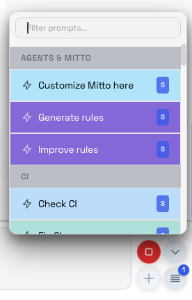
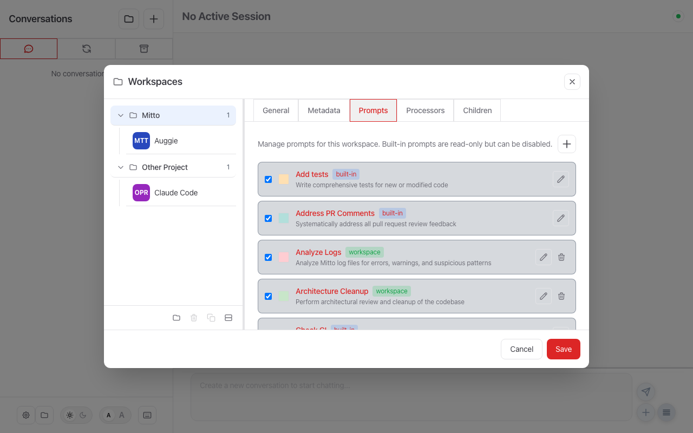

# Prompts and Quick Actions

Prompts (also called Quick Actions) are predefined text snippets that appear as buttons
in the chat interface. Clicking a prompt button sends its content to the AI agent,
saving you from typing common requests.



## Configuration in the UI

Prompts are managed per-workspace in the **Workspaces → Prompts** tab:



From this tab you can:

- **Enable/disable** any prompt (including built-in ones) using the checkbox
- **Edit** workspace prompts by clicking the ✏️ icon
- **Delete** workspace prompts using the 🗑️ icon
- **Add** new prompts with the **+** button

Each prompt shows its **source** as a badge:

- **built-in** — Shipped with Mitto (read-only, can be disabled)
- **workspace** — Defined in the project's `.mitto/prompts/` directory or `.mittorc`
- **global** — From the global prompts directory

Changes take effect immediately — prompts are hot-reloaded when the dropdown opens.

---

## YAML Configuration

### Overview

Prompts appear in a dropdown menu above the chat input. All prompt sources are
**merged server-side** into a single list per workspace. Higher-priority sources
override lower-priority ones with the same name. Disabled prompts are filtered out
automatically.

When you hover over a prompt button, a tooltip shows its description (if provided).

## Prompt Sources

Prompts can be defined in multiple locations. When prompts have the same name,
higher-priority sources override lower-priority ones.

| Priority    | Source                        | Location                                          |
| ----------- | ----------------------------- | ------------------------------------------------- |
| 1 (lowest)  | Built-in defaults             | `config/config.default.yaml`                      |
| 2           | Global prompts directory      | `MITTO_DIR/prompts/*.prompt.yaml`                 |
| 3           | Additional prompts dirs       | `prompts_dirs` in settings                        |
| 4           | User settings file            | `MITTO_DIR/settings.yaml`                         |
| 5           | Default workspace prompts dir | `$MITTO_WORKING_DIR/.mitto/prompts/*.prompt.yaml` |
| 6           | Workspace prompts dirs        | `prompts_dirs` in `.mittorc`                      |
| 7 (highest) | Workspace `.mittorc` prompts  | `prompts:` in `.mittorc`                          |

Every directory-based source above is also scanned for `*.tmpl`
[fragments](#prompt-fragments-tmpl-partials) — reusable body chunks shared
between prompts — which merge by name using the same priority chain.

### 1. Built-in Default Prompts

Mitto includes a set of default prompts for common workflows. These are defined in
`config/config.default.yaml` and cannot be modified directly, but can be overridden by
defining a prompt with the same name in any higher-priority source.

Default prompts include:

- **Continue** - Resume the current task
- **Propose a plan** - Create a detailed plan
- **Summarize** - Summarize the conversation
- **Commit changes** - Create a git commit
- And more...

### 2. Global Prompts Directory

Store reusable prompts as YAML files in the global prompts directory:

| Platform | Location                                       |
| -------- | ---------------------------------------------- |
| macOS    | `~/Library/Application Support/Mitto/prompts/` |
| Linux    | `~/.local/share/mitto/prompts/`                |

Files must have a `.prompt.yaml` extension. Subdirectories are supported for organization:

```
prompts/
├── code-review.prompt.yaml
├── git/
│   ├── commit.prompt.yaml
│   └── pr-description.prompt.yaml
└── testing/
    └── write-tests.prompt.yaml
```

See [File Format](#file-format-for-global-prompts) below for the full specification.

### 3. User Settings File

Define prompts in your `settings.yaml` file under the `prompts:` key:

```yaml
# MITTO_DIR/settings.yaml
prompts:
  - name: "My Custom Prompt"
    prompt: "Do something specific..."
    backgroundColor: "#E8F5E9"
```

### 4. Default Workspace Prompts Directory

Mitto automatically searches for prompts in the `.mitto/prompts/` directory at the root
of each workspace. This allows you to store project-specific prompts directly in your
repository without any additional configuration.

```
my-project/
├── .mitto/
│   └── prompts/
│       ├── code-review.prompt.yaml
│       ├── deploy.prompt.yaml
│       └── run-tests.prompt.yaml
├── src/
└── package.json
```

This directory is automatically searched when you open the workspace - no `.mittorc`
configuration is required. The prompts use the same YAML format as global prompts
(see [File Format](#file-format-for-global-prompts)).

**Benefits:**

- **Zero configuration** - Just create the directory and add prompts
- **Version controlled** - Commit prompts alongside your code
- **Team sharing** - Share project-specific prompts with your team
- **Portable** - Prompts travel with the repository

**Priority:** Default workspace prompts are searched after global prompts but before
`prompts_dirs` configured in `.mittorc`. Prompts with the same name in higher-priority
sources will override those in `.mitto/prompts/`.

### 5. Workspace `.mittorc` File

Define workspace-specific prompts in a `.mittorc` file at the root of your project:

```yaml
# my-project/.mittorc
prompts:
  - name: "Run Tests"
    prompt: "Run the test suite with: npm test"
    backgroundColor: "#BBDEFB"

  - name: "Build Project"
    prompt: "Build the project with: npm run build"
    backgroundColor: "#E8F5E9"
```

Workspace prompts have the highest priority and appear in a separate "Workspace" section
in the UI.

## Additional Prompts Directories

You can configure additional directories to search for prompt files using the
`prompts_dirs` option. This allows you to:

- Share prompts across multiple projects
- Organize prompts in team-shared directories
- Keep project-specific prompts in custom locations

### Global `prompts_dirs` (in settings)

Add additional directories to search after the default `MITTO_DIR/prompts/`:

```yaml
# ~/.mittorc or MITTO_DIR/settings.yaml
prompts_dirs:
  - "/shared/team/prompts"
  - "/Users/me/my-prompts"
```

These directories are searched in order, with later directories overriding earlier ones
when prompts have the same name. All paths should be absolute.

### Workspace `prompts_dirs` (in `.mittorc`)

Add workspace-specific prompt directories:

```yaml
# my-project/.mittorc
prompts_dirs:
  - ".prompts" # Relative to workspace root
  - "/shared/team/prompts" # Absolute path

prompts:
  - name: "Inline Prompt"
    prompt: "This has highest priority"
```

**Path resolution:**

- Relative paths are resolved against the workspace root directory
- Absolute paths are used as-is
- Non-existent directories are silently ignored

**Priority order within workspace:**

1. Default `.mitto/prompts/` directory (lowest priority, automatically searched)
2. Prompts from `prompts_dirs` (in order listed)
3. Inline `prompts:` entries (highest priority)

### Example: Team Shared Prompts

```yaml
# ~/.mittorc (global)
prompts_dirs:
  - "/Users/Shared/team-prompts"

# my-project/.mittorc (workspace)
prompts_dirs:
  - ".prompts"  # Project-specific prompts

prompts:
  - name: "Deploy"
    prompt: "Deploy to staging environment"
```

In this setup:

1. `MITTO_DIR/prompts/` is always searched first
2. `/Users/Shared/team-prompts/` is searched next (from global config)
3. `my-project/.mitto/prompts/` is searched (default workspace prompts)
4. `my-project/.prompts/` is searched (from workspace `prompts_dirs`)
5. Inline prompts from `.mittorc` have highest priority

## File Format for Global Prompts

Global prompt files are standalone YAML files with the `.prompt.yaml` extension. The
entire file is YAML, with the prompt body stored as the `prompt:` key using a literal
block scalar (`|`).

```yaml
name: "Code Review"
description: "Review code for bugs and improvements"
backgroundColor: "#E8F5E9"
icon: "search"
tags: ["review", "quality"]
enabled: true
prompt: |
  Please review the following code for:

  - Bugs and potential issues
  - Performance improvements
  - Code style and best practices
  - Security vulnerabilities

  Provide specific suggestions with code examples where applicable.
```

### YAML Fields

| Field             | Required | Type     | Description                                                                                                                                                                                                                                                                                                                                                                                                                  |
| ----------------- | -------- | -------- | ---------------------------------------------------------------------------------------------------------------------------------------------------------------------------------------------------------------------------------------------------------------------------------------------------------------------------------------------------------------------------------------------------------------------------- |
| `name`            | No\*     | string   | Display name for the button. If omitted, derived from filename.                                                                                                                                                                                                                                                                                                                                                              |
| `description`     | No       | string   | Tooltip text shown on hover                                                                                                                                                                                                                                                                                                                                                                                                  |
| `group`           | No       | string   | Group name for organizing prompts in the menu (e.g., `"Git"`, `"Testing"`)                                                                                                                                                                                                                                                                                                                                                   |
| `menus`           | No       | string   | Comma-separated list of menus the prompt appears in: `prompts` (ChatInput dropup), `promptsLoop` (loop prompt selector), `conversation` (per-conversation context menu), `beadsIssues` (per-issue context menu in the Beads list), and/or `beadsList` (list-level prompts button in the Beads list footer). Defaults to `prompts` if omitted. See [below](#menus).                                                           |
| `parameters`      | No       | list     | Typed input declarations. Each entry: `{ name, type, description?, required?, ask?, default?, multiLine?, options?, dir?, glob?, remember?, cache?, collectInnerArgs?, group? }`. The menu must supply every declared **required** type or the prompt is hidden. See [below](#parameters-typed-inputs--type-based-gating).                                                                                                   |
| `backgroundColor` | No       | string   | Hex color for the button (e.g., `"#E8F5E9"`)                                                                                                                                                                                                                                                                                                                                                                                 |
| `icon`            | No       | string   | Icon name shown next to the prompt in menus. See [valid names](#icon-names). Unknown names fall back to the default icon.                                                                                                                                                                                                                                                                                                    |
| `tags`            | No       | string[] | Categorization tags (reserved for future use)                                                                                                                                                                                                                                                                                                                                                                                |
| `singleton`       | No       | bool     | `true` means launching this prompt from the menu does not create a duplicate conversation if a non-archived conversation started from the same prompt already exists in the same working directory. Instead the existing conversation is reused: if it is idle the prompt is re-seeded into its queue; if it is busy it is only focused (focus-only). Scope key is (working directory, origin prompt name). Default: `false` |
| `enabled`         | No       | bool     | Set to `false` to disable the prompt. Default: `true`                                                                                                                                                                                                                                                                                                                                                                        |
| `enabledWhen`     | No       | string   | CEL expression for conditional enablement. See [below](#enabledwhen-conditional-enablement).                                                                                                                                                                                                                                                                                                                                 |
| `loop`            | No       | mapping  | Opt-in loop mode — presence makes the prompt behave **context-sensitively** when selected (start a new recurring conversation, convert an existing one to loop, or send a single one-shot run). See [below](#loop-prompts).                                                                                                                                                                                                  |
| `target`          | No       | mapping  | Routing block for dispatches that would create a new conversation — funnels into an existing one by beads issue, canonical title, or singleton scope. See [below](#target-find-or-route-dispatch).                                                                                                                                                                                                                           |
| `preferredModels` | No       | list     | Ordered references to global model profiles (`modelName` or `modelTag` per entry) applied at dispatch. First entry that resolves to an available model wins; kept if the current model already satisfies. See [below](#preferredmodels-model-selection).                                                                                                                                                                     |
| `prompt`          | Yes\*\*  | string   | The prompt body text, written as a YAML literal block scalar (`\|`).                                                                                                                                                                                                                                                                                                                                                         |

\*If `name` is not specified, it's derived from the filename (e.g., `code-review.prompt.yaml` →
"code-review").

\*\*`prompt` is optional for disable-only overrides — an entry with only `name` and `enabled: false` is valid.

> **Removed field: `acps`.** Restricting a prompt to particular agents is done
> with `enabledWhen` instead — e.g.
> `enabledWhen: 'ACP.MatchesServerType("auggie")'`. A leftover `acps:` key is
> ignored. See [ACP server checks](#enabledwhen-conditional-enablement).

### icon (Names)

The optional `icon` field shows an icon next to the prompt in menus. The value is the
name of one of Mitto's built-in icons (matched case-insensitively). If the name is
empty or unknown, the prompt falls back to the default lightning/insert icon.

Available names:

`beads`, `settings`, `sliders`, `search`, `edit`, `trash`, `broom`, `save`,
`magic-wand`, `lightning`, `robot`, `person`, `image`, `folder`, `folder-open`,
`terminal`, `server`, `globe`, `chat-bubble`, `shield`, `layers`, `list`, `tag`,
`check`, `question`, `error`, `plus`, `hourglass`, `refresh`, `sync`, `keyboard`,
`duplicate`, `pin`, `archive`, `loop`, `queue`, `play`.

The registry is defined in `web/static/components/Icons.js` (`PROMPT_ICONS`); add an
entry there to expose additional icons by name.

### Conditional Enablement Overview

Mitto provides two fields for controlling when prompts appear:

| Field         | Type | Evaluated  | Use Case                                    |
| ------------- | ---- | ---------- | ------------------------------------------- |
| `enabled`     | bool | At load    | Permanently disable a prompt                |
| `enabledWhen` | CEL  | At display | Dynamic conditions based on session context |

**Evaluation order:** If `enabled: false`, the prompt is never loaded. Otherwise, the
`enabledWhen` CEL expression must evaluate to `true` for the prompt to appear.

**Example:**

```yaml
name: "JIRA: start work"
description: "Pick a JIRA ticket and spawn parallel conversations"
group: "JIRA"
backgroundColor: "#BBDEFB"
enabled: true
enabledWhen: '!Session.IsChild && ACP.MatchesServerType(["augment", "claude-code"]) && Tools.HasAllPatterns(["jira_*", "mitto_conversation_*"])'
prompt: |
  (prompt body here)
```

This prompt:

- Is enabled (not permanently disabled)
- Only appears in parent conversations (not children)
- Only appears when using Auggie or Claude Code
- Only appears when both JIRA and Mitto MCP tools are available

### Multi-line Prompts

The prompt body (`prompt:` key) can span multiple lines and supports full
markdown. Use the YAML literal block scalar (`|`) to preserve newlines:

```yaml
name: "Detailed Analysis"
prompt: |
  Please analyze the code with the following criteria:

  ## Performance

  - Identify bottlenecks
  - Suggest optimizations

  ## Security

  - Check for vulnerabilities
  - Review input validation

  ## Maintainability

  - Assess code clarity
  - Suggest refactoring opportunities
```

## Menus

The `menus` attribute is a **comma-separated list** that controls which UI menus a
prompt appears in. The available menu values are:

| Menu           | Where it appears                                                                                      |
| -------------- | ----------------------------------------------------------------------------------------------------- |
| `prompts`      | The **ChatInput dropup** — the "Insert predefined prompt" menu (the `^` button) above the chat input. |
| `promptsLoop`  | The **loop prompt selector** — the prompt dropdown shown in the inline editor of a loop conversation. |
| `conversation` | The **per-conversation context menu** — shown when you right-click a conversation in the sidebar.     |
| `beadsIssues`  | The **per-issue context menu** — shown when you right-click an issue in the Beads list view.          |
| `beadsList`    | The **list-level prompts button** — the dropdown next to the `+` button in the Beads list footer.     |

There is also a Go-only sentinel, not part of the frontend registry above:

| Token      | Where it appears                                                                                                                                                                                                          |
| ---------- | ------------------------------------------------------------------------------------------------------------------------------------------------------------------------------------------------------------------------- |
| `internal` | **Nowhere.** Hides the prompt from every UI menu. Used for dispatch-only prompts (e.g. the beads driver/phase prompts) that are only ever invoked by name via `mitto_conversation_send_prompt`, never picked from a menu. |

If a prompt has **no `menus` attribute**, it defaults to `prompts` (the ChatInput
dropup only). To make a prompt appear in both menus, list both values:

```yaml
name: "Summarize Progress"
description: "Ask the agent to summarize what has been done so far"
group: "Workflow"
menus: prompts, conversation
prompt: |
  Summarize everything we've accomplished in this conversation so far.
```

Whitespace around each entry is ignored. Because `menus` is an explicit list, a
prompt with `menus: conversation` (without `prompts`) appears **only** in the
conversation context menu and is **excluded** from the ChatInput dropup.

### Loop Prompt Selector Menu

Prompts whose `menus` list includes `promptsLoop` appear in the **loop
prompt selector** — the prompt dropdown shown in the inline editor of a loop
conversation, where you pick which prompt the scheduler runs on each tick.

The loop selector shows the **union** of `prompts` and `promptsLoop`: any
prompt available in the ChatInput dropup also appears in the selector, so existing
prompts keep working without changes. To make a prompt appear **only** in the
loop selector (and hide it from the regular dropup), set `menus:
promptsLoop` without `prompts`:

```yaml
name: "Babysit PRs"
description: "Check for pending reviews and stale branches"
group: "GitHub"
menus: promptsLoop
prompt: |
  Check the repository for pending review requests and stale branches.
```

Pair this with the `Session.IsLoopConversation` CEL variable (see
[enabledWhen](#enabledwhen-conditional-enablement)) if you also want the prompt
hidden everywhere outside loop conversations.

### Exclusion Syntax (`!menu`)

A `!`-prefixed token in `menus` **explicitly excludes** the prompt from that menu,
even when a union or implicit rule would otherwise include it. Exclusions take
precedence over inclusions.

**Motivating case:** the loop prompt selector uses a union rule — every
`prompts` prompt also appears in the selector. To suppress a one-shot prompt from
the loop selector without removing it from the regular dropup, add
`!promptsLoop`:

```yaml
name: "JIRA: decompose"
description: "Break a JIRA epic into subtasks — one-shot only, not for recurring runs"
group: "JIRA"
menus: prompts, !promptsLoop
prompt: |
  Analyze the current JIRA epic and decompose it into actionable subtasks.
```

This prompt appears in the ChatInput dropup (`prompts`) but is hidden from the
loop prompt selector (`!promptsLoop`).

**Rules:**

- A bare token (`prompts`) opts the prompt **into** that menu.
- A `!`-prefixed token (`!promptsLoop`) opts the prompt **out of** that menu.
- Exclusions take precedence over inclusions and union rules.
- If all non-`!` tokens are stripped and nothing positive remains, `menus`
  defaults to `["prompts"]` (the prompt still appears in the dropup).
- Exclusion tokens are ignored by the `childSessionId`-parameter menu-targeting
  check (they never count as a "target menu" for that rule — see
  [parameters](#parameters-typed-inputs--type-based-gating)). They are,
  however, checked for token _recognition_ exactly like included tokens — see
  [Menu Token Validation](#menu-token-validation) below.

### Menu Token Validation

Every token in `menus` — bare or `!`-excluded — is checked against the known
set: the five real menus in the table above, plus the `internal` sentinel. An
unrecognized token does **not** fail prompt loading; historically it silently
dropped the prompt from its intended menu with no error anywhere (e.g. the
plural typo `menus: prompts, conversations`), which is easy to miss. Prompt
loading now logs a `WARN` naming the prompt, its file path, and the offending
token(s):

```
prompt menus field contains unrecognised token(s); prompt will not appear in the intended menu
    prompt=<name> path=<file> menus=<raw string> unknown=[conversations] known=[prompts promptsLoop conversation beadsIssues beadsList internal]
```

- `menus: internal` and `menus: prompts, !promptsLoop` are valid and never warn.
- The warning is deduplicated per `(prompt, path, tokens)` — reloading the
  same prompt does not repeat it.
- Implemented in `internal/prompts/menus.go` (`KnownMenuTokens`,
  `WarnUnknownMenus`), wired into prompt-file loading (`ParsePromptFile`) and
  all three inline-prompt config paths (top-level `settings.json`/`.yaml`
  prompts, per-ACP-server `prompts:` blocks, and `.mittorc`).
- A guard test, `TestBuiltinPrompts_MenusTokensRecognized`, fails the build if
  any builtin prompt under `config/prompts/builtin/` uses an unrecognised
  token. `TestMenus_KnownMenusMatchesFrontendRegistry` keeps this list in sync
  with `MENU_PARAM_TYPES` in `web/static/utils/prompts.js`.

### Conversation Context Menu

In the conversation context menu, these prompts appear **after** the standard
**Archive**, **Properties**, and **Delete** entries. They are organized into
submenus by their `group` attribute, so the example above renders as:

```
Archive
Properties
Delete
Workflow ›
    Summarize Progress
```

Prompts without a `group` are collected under an **"Other"** submenu.

### Behavior

- **Only prompts whose `menus` list includes `conversation`** appear in the context
  menu. Prompts without it are excluded (they appear in the ChatInput dropup instead,
  provided their `menus` includes `prompts` or omits the attribute).
- Clicking a prompt **enqueues its text** to that conversation via the message
  queue. The agent processes it as soon as the conversation is idle, so this works
  for **any** conversation — not just the currently active one.
- `enabledWhen` and `enabled` are honored, but — unlike the dropup, which is
  evaluated for the **active** conversation — the context menu evaluates each
  prompt's `enabledWhen` against the **conversation you right-clicked**. The menu
  is populated on demand for that specific conversation, so context-dependent
  prompts (e.g. `enabledWhen: "Session.IsChild"` for "Report to parent", or
  `enabledWhen: "Children.Exists"` for "Continue in existing") appear
  only on the conversations where they apply.
- `@mitto:` [variable substitution](#variable-substitution-in-prompts) is applied
  to the enqueued text in the target conversation's context before it reaches the
  agent.

### Beads Context Menu

Prompts whose `menus` list includes `beadsIssues` appear in the **per-issue context
menu** of the Beads list view — the menu shown when you right-click an issue.
Alongside common bead actions (e.g. **Delete**), the menu includes a **New**
submenu listing every `menus: beadsIssues` prompt.

Selecting one of these prompts starts a new conversation seeded with the prompt
text. The menu auto-fills the selected issue's ID and title as typed arguments.
The prompt body should reference them via `{{ .Args.ISSUE_ID }}` (and optionally
`{{ Arg "ISSUE_TITLE" "Untitled" }}`) and load its own full context with
`bd show {{ .Args.ISSUE_ID }}` rather than relying on a pre-built context block:

```yaml
name: "Start work"
group: "Beads"
menus: beadsIssues
parameters:
  - name: ISSUE_ID
    type: beadsId
prompt: |
  The target bead is `{{ .Args.ISSUE_ID }}`.

  Load its full detail:

      bd show {{ .Args.ISSUE_ID }} --long --json

  then claim it and propose a plan.
```

Because the `beadsIssues` menu supplies the `beadsId` type (auto-filling
`ISSUE_ID` from the selected issue), issue-scoped prompts that declare
`type: beadsId` appear **only** in this menu and not in the generic `prompts`
dropup, where no issue context would be available. See [Prompt Arguments](#prompt-arguments)
and [parameters (Typed Inputs & Type-Based Gating)](#parameters-typed-inputs--type-based-gating)
for the full mechanism.

#### Per-row `Item.*` namespace for `enabledWhen`

When the Beads context menu opens for a specific issue, the server populates the
`Item` CEL namespace with that issue's data. `beadsIssues` prompts can use
`enabledWhen` to show or hide themselves per row:

| Field           | Type            | Example value                  |
| --------------- | --------------- | ------------------------------ |
| `Item.Id`       | string          | `"mitto-abc"`                  |
| `Item.Status`   | string          | `"open"`, `"closed"`           |
| `Item.Type`     | string          | `"bug"`, `"feature"`, `"task"` |
| `Item.Priority` | string          | `"0"`, `"1"`, `"2"`, `"3"`     |
| `Item.Labels`   | list of strings | `["blog", "frontend"]`         |
| `Item.Kind`     | string          | `"beadsIssue"`                 |

**Examples:**

```yaml
# Show only for bug-type issues
enabledWhen: 'Item.Type == "bug"'

# Show only for issues labelled "blog"
enabledWhen: '"blog" in Item.Labels'
```

### Beads List Menu

Prompts whose `menus` list includes `beadsList` appear in the **list-level prompts
button** of the Beads list view — the dropdown next to the `+` button in the footer
toolbar. Unlike `beadsIssues` prompts, these operate on the whole issue list (e.g.
cleaning up old issues or triaging the backlog) rather than a single issue, so they
**take no parameters**. Selecting one creates a new conversation seeded with the
prompt text alone.

```yaml
name: "Beads: cleanup old issues"
group: "Beads"
menus: beadsList
prompt: |
  (prompt body here)
```

### Context-adaptive prompts (three modes)

A single prompt can serve **both** the per-issue Beads menu and the generic
conversation menu by combining `menus: beadsIssues, conversation`, an **optional**
typed parameter, and a Go-template _target ladder_ that resolves the issue from
whichever context is available. The same body then adapts to one of three modes:

1. **Linked issue** — the conversation is already linked to a bead, so
   `{{ .Session.BeadsIssue }}` is set (e.g. an "Iterate until complete" run).
2. **Selected issue** — launched from the Beads per-issue menu, which auto-fills
   the optional `IssueID` parameter (`{{ .Args.IssueID }}`).
3. **No issue (current problem)** — launched from the conversation menu with no
   bead in context. The prompt drops all `bd` commands and acts as a general
   advisor on the _current problem_ under discussion.

**Header recipe** — list both menus and mark the parameter optional so the prompt
is not hidden when no issue is available (see
[parameters (Typed Inputs & Type-Based Gating)](#parameters-typed-inputs--type-based-gating)):

```yaml
name: "Check status"
menus: beadsIssues, conversation
parameters:
  - name: IssueID
    type: beadsId
    required: false
    description: The beads issue ID to act on
```

**Target ladder** — resolve a single `$target` at the top of the body, preferring
the linked bead, then the optional argument, then falling back to mode 3:

```text
{{ $target := "" -}}
{{ if .Session.BeadsIssue }}{{ $target = .Session.BeadsIssue }}
{{ else if .Args.IssueID }}{{ $target = .Args.IssueID }}{{ end -}}

{{ if $target -}}
The target bead is `{{ $target }}`.
{{- else -}}
There is **no linked bead**. Work on the **current problem** under discussion;
do **not** run any `bd` commands.
{{- end }}
```

**Command gating** — wrap every bead-specific command (and any `git grep <id>`
that depends on an issue ID) in `{{ if $target }} … {{ end }}` so mode 3 emits
**zero** `bd` commands:

```text
{{ if $target -}}
    bd show {{ $target }} --long --json
{{- end }}
```

The built-in `beads-issue-investigate`, `beads-issue-assess`,
`beads-issue-status`, `beads-issue-resolved`, `beads-issue-work`, and
`beads-followup-work` prompts all follow this three-mode pattern.

## Loop Prompts

A prompt can declare a `loop:` mapping to opt into **loop mode**. How a
loop-declaring prompt behaves when selected is **context-sensitive** — it
depends on the conversation it targets. It can start a new recurring conversation,
convert an existing conversation to loop, or send a single one-shot run (see
[Behavior](#behavior) below).

### Loop Fields

**Schema (mitto-r6j, breaking change from the pre-existing flat form — see
[Migrating from the flat single-trigger schema](#migrating-from-the-flat-single-trigger-schema)
if you have prompts on the old form):** `trigger:` is a **list** of one or
more triggers, and each trigger's own attributes are grouped under a nested
block of the same name. A field nests under a trigger block **iff it only
affects that trigger**; every other field is loop-wide and stays a direct
sibling of `trigger:`.

```yaml
loop:
  trigger: [schedule] # list; one or more of: schedule | onCompletion | onTasks | onChild | onSlack
  schedule: # meaningful only when "schedule" is armed
    value: 1 # number of time units between runs (integer ≥ 1); required for schedule
    unit: hours # minutes | hours | days; required for schedule
    at: "09:00" # optional — HH:MM (local time in the UI, stored as UTC); only valid for unit: days
  onCompletion: # meaningful only when "onCompletion" is armed
    delay: 30 # optional — seconds to wait after the agent stops, before the next run
  onTasks: # meaningful only when "onTasks" is armed
    condition: "" # optional — CEL expression gating which beads/task changes fire the run
    conditionPreset: "" # optional — UI preset id that was compiled into condition
    coalesceDuringBusy: true # optional — nil/true (default) absorbs busy-window changes silently; false fires once at quiescence with the accumulated delta
    settleWindow: 0 # optional — pre-fire debounce window in seconds; 0/absent = fire on the first delta
    cooldown: 0 # optional — per-conversation cooldown floor (seconds); 0 = use the global floor
  onChild: # meaningful only when "onChild" is armed
    when: [anyEndResponse, anyDeleted] # optional — child-conversation lifecycle events; absent = both
  onSlack: # behavior defaults only; installation/channel subscriptions are runtime configuration
    eventMode: anyHumanMessage # optional — anyHumanMessage (default) | appMention
    threadPolicy: any # optional — any (default) | rootOnly | repliesOnly
  # loop-wide — apply regardless of which armed trigger(s) fire
  maxIterations: 10 # optional; 0/absent = unlimited scheduled runs, shared across every trigger
  maxDuration: "4h" # optional — wall-clock cap (e.g. 30m, 4h, 1d); 0/absent = unlimited
  freshContext: false # optional — nil/false (default) preserves context across runs; true starts each run with a clean ACP session
  runOnStart: false # optional — nil/false (default) does not re-fire on Mitto boot; true fires once shortly after boot (anti-flap guarded)
  mode: always # optional — always (default) | optional
  default: true # optional — only meaningful for mode: optional; nil/absent = true
```

A block for a trigger **not** listed in `trigger:` still parses — it is
**inert** (a load-time warning, not an error), which is useful when copying a
loop block between prompts and pruning unused blocks later.

#### Per-trigger vs. loop-wide placement

| Block (or none)      | Fields                                                                           | Meaningful when                 |
| -------------------- | -------------------------------------------------------------------------------- | ------------------------------- |
| _(none — loop-wide)_ | `maxIterations`, `maxDuration`, `freshContext`, `runOnStart`, `mode`, `default`  | Always                          |
| `schedule`           | `value`, `unit`, `at`                                                            | `schedule` is in `trigger:`     |
| `onCompletion`       | `delay`                                                                          | `onCompletion` is in `trigger:` |
| `onTasks`            | `condition`, `conditionPreset`, `coalesceDuringBusy`, `settleWindow`, `cooldown` | `onTasks` is in `trigger:`      |
| `onChild`            | `when`                                                                           | `onChild` is in `trigger:`      |
| `onSlack`            | `eventMode`, `threadPolicy`                                                      | `onSlack` is in `trigger:`      |

#### `trigger:` (list)

| Field     | Required | Description                                                                                                                                                                                                                                                                                                                                                                                                                                                   |
| --------- | -------- | ------------------------------------------------------------------------------------------------------------------------------------------------------------------------------------------------------------------------------------------------------------------------------------------------------------------------------------------------------------------------------------------------------------------------------------------------------------- |
| `trigger` | No       | List of one or more of `schedule`, `onCompletion`, `onTasks`, `onChild`, `onSlack`. Each listed trigger arms **independently** — see [Triggers: independent multi-trigger arming](#triggers-independent-multi-trigger-arming). Duplicate entries are rejected. Empty/absent defaults to `[schedule]`. `onSlack` may be the sole trigger; an enabled runtime loop must then provide at least one `slack_subscriptions` entry. `onChild` remains additive-only. |

#### `schedule` block

| Field   | Required | Description                                                                    |
| ------- | -------- | ------------------------------------------------------------------------------ |
| `value` | Yes¹     | Number of time units between runs (integer ≥ 1, max 999)                       |
| `unit`  | Yes¹     | `minutes`, `hours`, or `days`                                                  |
| `at`    | No       | Time of day (`HH:MM`) for daily schedules only — only valid when `unit: days`. |

¹ Required only when `schedule` is one of the armed triggers.

#### `onCompletion` block

| Field   | Required | Description                                                                                                                                    |
| ------- | -------- | ---------------------------------------------------------------------------------------------------------------------------------------------- |
| `delay` | No       | Seconds to wait after the agent finishes before the next run. Clamped up to the global floor (`min_loop_completion_delay_seconds`, default 5). |

#### `onTasks` block

| Field                | Required | Description                                                                                                                                                                                                                                                                                             |
| -------------------- | -------- | ------------------------------------------------------------------------------------------------------------------------------------------------------------------------------------------------------------------------------------------------------------------------------------------------------- |
| `condition`          | No       | A CEL expression gating which beads/task changes fire the run. Empty/absent = fire on any change. Validated at parse time; a syntactically invalid or unknown-identifier expression fails prompt load.                                                                                                  |
| `conditionPreset`    | No       | Optional UI preset id that was compiled into `condition`.                                                                                                                                                                                                                                               |
| `coalesceDuringBusy` | No       | Nil/absent or `true` (default) silently absorbs beads changes that arrive while the loop's subtree is busy — they are folded into the next quiescence rebase. `false` fires exactly once more at quiescence with the accumulated pre-run→current delta available as `{{ .Trigger.OnTasks.Changes.* }}`. |
| `settleWindow`       | No       | Optional pre-fire debounce window in seconds. When `> 0`, a single coalesced fire is dispatched after the timer expires instead of firing on the first delta — absorbs multi-step edits (e.g. `bd create` followed by `bd update`). `0`/absent = fire on the first delta.                               |
| `cooldown`           | No       | Per-conversation cooldown floor (seconds) between fires. `0` = use the global floor.                                                                                                                                                                                                                    |

#### `onChild` block

| Field  | Required | Description                                                                                                                                                                                                                                                                                                                                                                                                                                                                                                                                                                                                                                                                                                                   |
| ------ | -------- | ----------------------------------------------------------------------------------------------------------------------------------------------------------------------------------------------------------------------------------------------------------------------------------------------------------------------------------------------------------------------------------------------------------------------------------------------------------------------------------------------------------------------------------------------------------------------------------------------------------------------------------------------------------------------------------------------------------------------------- |
| `when` | No       | Child-conversation lifecycle events that fire this loop: `anyEndResponse` (a child finished an agent response and went idle — fires on **every turn**, not just when the child is fully done; a multi-phase child driver produces one fire per phase), `anyDeleted` (a child was deleted), and/or `anyLoopStopped` (a child's **own loop** transitioned into the stopped state — fires exactly once, a real "child driver declared itself done" signal, covering `mitto_conversation_update(loop_enabled: false)`, auto-stop on max iterations/duration, and archiving). Empty/absent = `anyEndResponse` + `anyDeleted`; `anyLoopStopped` is opt-in only, so existing loops are unaffected. Unknown entries fail prompt load. |

`when` is the only key under `onChild:` — the per-conversation cooldown that
also governs a burst of child events is a loop-wide runtime setting (see
[Triggers: independent multi-trigger arming](#triggers-independent-multi-trigger-arming)
below), authored via `onTasks.cooldown`; there is no separate `onChild.cooldown` key.

#### `onSlack` block

Prompt frontmatter may declare only deployment-independent filter defaults:
`eventMode` (`anyHumanMessage`, the default, or `appMention`) and
`threadPolicy` (`any`, the default, `rootOnly`, or `repliesOnly`). Concrete
Slack installation and channel IDs are runtime configuration supplied through
REST/MCP/`pkg/api` as `slack_subscriptions` / `loop_slack_subscriptions`; they
are intentionally rejected from prompt files. An onSlack loop may be saved as
a disabled draft without subscriptions, but cannot be enabled until at least
one structurally valid subscription exists.

#### Loop-wide fields

| Field           | Required | Description                                                                                                                                                                                                                                                                                                                                                                                                                                                                                                                                                         |
| --------------- | -------- | ------------------------------------------------------------------------------------------------------------------------------------------------------------------------------------------------------------------------------------------------------------------------------------------------------------------------------------------------------------------------------------------------------------------------------------------------------------------------------------------------------------------------------------------------------------------- |
| `maxIterations` | No       | Cap on the number of scheduled runs (integer ≥ 0), **shared across every armed trigger** — decremented once per delivered run regardless of which trigger fired it. `0` or absent means unlimited at the prompt level. See [Max iterations and auto-stop](#max-iterations-and-auto-stop).                                                                                                                                                                                                                                                                           |
| `maxDuration`   | No       | Wall-clock cap as a duration string (`30m`, `4h`, `1d`), also shared across every armed trigger. Once it elapses (measured from the first run), the conversation auto-stops. `0`/absent = unlimited.                                                                                                                                                                                                                                                                                                                                                                |
| `freshContext`  | No       | When `true`, every re-fire starts the agent with a clean context: no history injection and a new ACP session per run. Meaningful for any trigger; primarily used by stateless supervisor loops that re-hydrate from external state on every fire. Nil/absent = `false` (persistent context). The clear is skipped (no RPC and no `Context cleared` pill) when the ACP session is provably empty — created fresh in the current process with no turn dispatched yet; resumed or loaded sessions always clear, since agent-side history is not observable from Mitto. |
| `runOnStart`    | No       | When `true`, the LoopRunner fires this loop exactly once shortly after Mitto boots (after the interactive-resume startup delay, with an anti-flap window suppressing the pulse when the loop already ran very recently). Complements `onTasks` loops (which otherwise only fire on task changes) and lets `schedule` / `onCompletion` loops kick off at boot without waiting for the next tick. Nil/absent = `false`.                                                                                                                                               |
| `mode`          | No       | `always` (default — not user-toggleable) or `optional` (user-choosable per send). Unknown values are rejected at load time. See [Always / optional / never](#always--optional--never).                                                                                                                                                                                                                                                                                                                                                                              |
| `default`       | No       | Initial per-send toggle state when `mode: optional`. `true`/absent = on, `false` = off. Ignored (with a load-time warning) when `mode` is `always` or absent. Also honored when the prompt is spawned programmatically via `mitto_conversation_new` / `mitto_conversation_update`: `mode: optional` + `default: false` starts the loop **disabled** unless the caller passes an explicit `loop_enabled` (mitto-ydj).                                                                                                                                                |

**Presence implies opt-in** — omitting the `loop:` block entirely keeps the prompt as a regular one-time prompt.

The `schedule.value` / `schedule.unit` / `schedule.at` fields double as the
**default period** applied whenever a conversation is made loop (see
[Default period](#default-period)).

#### Always / optional / never

Every prompt falls into one of three categories:

- **Never loop** — no `loop:` block at all. Regular one-time prompt (unchanged).
- **Always loop** — `loop:` block with `mode: always` (or `mode` absent). Loop behavior is mandatory whenever the prompt is selected; not user-toggleable.
- **Optionally loop** — `loop:` block with `mode: optional`. The user can choose whether this send is loop; `default` sets the initial toggle state.

```yaml
# Always loop (mode omitted == always)
loop:
  trigger: [onCompletion]
  onCompletion:
    delay: 30

# Optionally loop, off by default
loop:
  mode: optional
  default: false
  trigger: [onCompletion]
  onCompletion:
    delay: 30
```

### Behavior

A loop-declaring prompt is **context-sensitive**: what happens when you select
it depends on the conversation it targets. The decision is made by
`decideLoopAction` (see `web/static/hooks/useConversationSeeding.js`).

| Context                                                          | What happens                                                                                                                                                                                                                                                                                   |
| ---------------------------------------------------------------- | ---------------------------------------------------------------------------------------------------------------------------------------------------------------------------------------------------------------------------------------------------------------------------------------------- |
| **No active conversation** (selecting the prompt to start fresh) | A **frequency dialog** (`LoopScheduleDialog`) opens, pre-filled from the prompt's `loop` defaults (period, `at`, and **max runs**). On confirm, a **new loop conversation** is created (no queue seed) and `PUT /api/sessions/{id}/loop` configures the named prompt on the declared schedule. |
| **Regular (running, non-loop, top-level) conversation**          | The conversation is made **immediately loop** using the prompt's declared defaults — **no dialog** — and the **first run fires right away** (PUT loop, then `POST /api/sessions/{id}/loop/run-now`). The scheduled prompt is now this prompt.                                                  |
| **Already-loop conversation, or a child conversation**           | The prompt contents are sent **once** (a one-shot enqueue) and the conversation's configured loop prompt, schedule, and iteration cap are **left untouched**.                                                                                                                                  |

#### Default period

The `value` / `unit` / `at` fields are the **default period** applied whenever a
conversation is made loop — both when creating a new loop conversation
(pre-filled into the dialog, where the user may adjust them) and when converting a
regular conversation (`makeLoopNow` uses them directly, without showing the
dialog).

#### Max iterations and auto-stop

`maxIterations` caps the number of **scheduled runs** before the conversation
auto-stops. The loop engine counts each delivered run (`iteration_count`) and,
when the cap is reached, **disables** the loop prompt so it stops firing. The
prompt is **not** deleted or archived — you can re-enable it at any time.

The binding cap depends on whether the prompt author expressed an opinion:

- **`maxIterations` `> 0`** — the binding cap is the **smallest positive** of the
  prompt's `maxIterations`, the server's `conversations.max_loop_iterations`
  setting (default `100`, `0` = unlimited), and the hardcoded absolute backstop
  of `1000`.
- **`maxIterations` `= 0` (or absent)** — the author has explicitly opted out of
  any per-prompt cap (the standing-supervisor contract). The
  `max_loop_iterations` config setting is **ignored**; only the hardcoded
  backstop of `1000` still applies. This preserves the prompt-frontmatter
  contract that `maxIterations: 0` means "unlimited scheduled runs".

### Triggers: independent multi-trigger arming

Each entry in `trigger:` **arms independently** and stays armed for the whole
lifetime of the loop — a `trigger: [onTasks, onCompletion]` loop reacts to
beads changes AND re-arms after every turn, simultaneously, from the moment
it is enabled:

- **`schedule`** — runs fire on a fixed period defined by `schedule.value`/`unit`
  (and optional `schedule.at` for daily). This is the classic interval behavior.
- **`onCompletion`** — the next run is armed **after the agent stops responding**,
  waiting `onCompletion.delay` seconds first. Each delivered run's completion
  arms the following one, so this leg is event-driven rather than clock-driven.
  `delay` is clamped up to the global floor (`min_loop_completion_delay_seconds`,
  default 5 s) to prevent hot loops.
- **`onTasks`** — runs fire when beads/tasks in the workspace change. An optional
  `onTasks.condition` (CEL expression) gates which changes actually fire the run;
  when empty or absent, any change fires it. The expression is validated at
  prompt load time and evaluated against the `Tasks`, `Prev`, and `Changes`
  variables at runtime. Example: `condition: 'Tasks.Open > Prev.Open'` fires
  only when the open task count grows.
- **`onChild`** — runs fire on a **child conversation's** lifecycle event, never
  on the loop conversation's own turn ending (that is `onCompletion`).
  `onChild.when: [anyEndResponse]` fires when any child finishes an agent
  response and goes idle — this happens on **every turn**, so a multi-phase
  child driver (e.g. plan → implement → test → review) produces one fire per
  phase, not one fire when the child is actually done; `anyDeleted` fires when
  any child is deleted (but never for a child that is archived rather than
  deleted). Both are armed by default. `anyLoopStopped` fires exactly once,
  when a child's **own loop** transitions into the stopped state (any
  `StoppedReason` — agent-disabled via `loop_enabled: false`, auto-stop on max
  iterations/duration, resume/delivery/context failures, user pause, or
  archiving) — the reliable "child driver declared itself done" signal; it is
  **not** armed by default and must be listed explicitly in `when`. A cascade
  delete that also removes the parent itself is a silent no-op (there is no
  longer a parent loop to fire), and the same applies to `anyLoopStopped` when
  the parent is missing or archived. `onChild` is **additive-only** — it can
  never be the only armed trigger — since it never fires on its own for a
  conversation that has no children yet.
- **`onSlack`** — runs fire from matching credential-free installation/channel
  subscriptions. Each delivered batch is bounded to 20 events / 32 KiB, counts
  as one shared loop iteration, and is exposed as
  `{{ .Trigger.OnSlack.Events }}`. Every event carries `Untrusted: true`; Slack
  text is JSON-escaped between enforced `<!-- SLACK_UNTRUSTED_START -->` and
  `<!-- SLACK_UNTRUSTED_END -->` data delimiters before template rendering.
  Attachments and files are excluded and never fetched.

`onChild` honours the **same per-conversation cooldown** the `onTasks` leg
uses: a burst of child completions or deletions within the cooldown window
collapses into a single run (`loop.CooldownSeconds`, clamped to the global
floor). This is a loop-wide runtime behavior — see the `onChild` block note
above for why it is authored via `onTasks.cooldown` rather than a separate key.

#### Coalescing and precedence

Because the five trigger mechanisms are independent event sources, more than
one of them can want to deliver a run in the same narrow window (e.g. the
agent finishes a turn at the same moment a beads file changes, or a child
conversation goes idle right as the parent's own turn ends). Mitto only ever
delivers **one** run at a time per conversation: the first trigger to reach
the dispatch path claims a per-conversation slot, and any other trigger that
fires while that slot is held is **coalesced — dropped, not queued**. The
loop is not re-run to "catch up" on the dropped fire.

Precedence **within a single scheduler tick** is:

```
onTasks  >  onChild  >  onCompletion  >  schedule
```

`onChild` beats `onCompletion` because of the deliberate ordering inside
`OnConversationIdle`: when a session goes idle, its own `onCompletion` leg
only _arms a timer_ first, while the `onChild` leg (notifying that session's
_parent_, if any) dispatches **synchronously** right after — ahead of the
`onCompletion` timer floor and the `schedule` poll tick. `onChild` loses to
an already-in-flight `onTasks` dispatch via the same single-slot coalescing
described above. Otherwise, precedence across ticks is simply whichever
trigger's event lands first. The conversation's `loop_updated` status (and the MCP `LoopTriggers` output field)
report both the full armed set (`triggers`) and, for back-compat, the primary
trigger (`trigger`, always `triggers[0]`).

`onSlack` is asynchronous rather than poll-tick-driven, so it has no fixed
position in the tick ordering above: it competes for the same dispatch claim
on arrival. Durable pending/redelivery behavior is owned by the Slack journal;
the loop-level caps and claim remain shared with every other trigger.

See
[docs/devel/message-queue.md § Loop Prompts: Multi-Trigger Architecture](../devel/message-queue.md#loop-prompts-multi-trigger-architecture)
for the dispatch-claim mechanics and a diagram of the full path.

#### Shared caps, independent settings

`maxIterations` and `maxDuration` are **loop-wide**: they are checked/incremented
once per **delivered** run, regardless of which trigger fired it. A
`trigger: [schedule, onCompletion]` loop with `maxIterations: 10` does not get
10 schedule runs _plus_ 10 onCompletion runs — it gets 10 runs total, however
the mix of schedule-ticks vs. post-turn re-arms landed. Once exceeded, the
loop prompt is **disabled** (not deleted) on the next check, exactly like the
[max-iterations auto-stop](#max-iterations-and-auto-stop). Combine
`maxDuration` with `maxIterations` to bound a loop by either time or count,
whichever comes first. See
[On-Completion Trigger and Max Duration](conversations.md#on-completion-trigger-and-max-duration)
for the server-side floor and defaults.

By contrast, each trigger's **own** settings (`schedule.value`/`unit`/`at`,
`onCompletion.delay`, `onTasks.condition`/`coalesceDuringBusy`/`settleWindow`/
`cooldown`, and `onSlack` subscription filters) apply only to that trigger's own firing decision and never affect
the others.

**Restrictions:**

- Loop conversations can only be **top-level** (not child) conversations. Selecting a loop prompt on a child conversation falls through to the one-shot send; the backend also returns HTTP 400 for loop-on-child. This is also why `onChild` is always configured on the **parent** — a child conversation cannot itself be a loop that reacts to its own children.
- `schedule.at` is only sent for `schedule.unit: days`; it is ignored otherwise (matches `Frequency.Validate()` on the backend).

### Trigger Examples

#### Single-trigger equivalents

The common case — one trigger, no multi-trigger complexity:

```yaml
# Fixed schedule, daily at 09:00 UTC
loop:
  trigger: [schedule]
  schedule:
    value: 1
    unit: days
    at: "09:00"

# Fire after every turn, waiting 30s
loop:
  trigger: [onCompletion]
  onCompletion:
    delay: 30

# Fire when beads change, gated by a condition
loop:
  trigger: [onTasks]
  onTasks:
    condition: 'Changes.Touched.exists(i, i.status == "open")'
```

#### Multi-trigger: reactive supervisor

A supervisor that both reacts to beads changes **and** keeps re-firing after
every turn — useful for a driver that must not go idle between beads events
because it still has in-flight work to check on:

```yaml
name: "Beads: supervise implementation"
menus: promptsLoop
loop:
  trigger: [onTasks, onCompletion]
  onTasks:
    condition: 'Changes.Touched.exists(i, "ready-for-review" in i.labels)'
  onCompletion:
    delay: 60
  maxIterations: 0 # standing supervisor — no per-prompt cap
  maxDuration: "0"
  freshContext: true
  runOnStart: true
prompt: |
  Check for beads labelled "ready-for-review" and advance them one step.
```

Here `onTasks` fires promptly when a bead is labelled, while `onCompletion`
keeps the supervisor checking back in case a change landed while it was
mid-turn (subject to the coalescing rule above — only one of the two ever
delivers a given run).

#### Multi-trigger: daily-plus-continuous

A loop that runs on a fixed daily cadence but also keeps going immediately
after each run finishes, useful for a report that should refresh itself
continuously once started for the day:

```yaml
name: "Daily report, then keep refreshing"
menus: promptsLoop
loop:
  trigger: [schedule, onCompletion]
  schedule:
    value: 1
    unit: days
    at: "09:00"
  onCompletion:
    delay: 300
  maxIterations: 50
prompt: |
  Refresh the report with the latest data.
```

The `schedule` leg guarantees a 09:00 UTC kickoff even if the conversation has
been idle; the `onCompletion` leg then keeps it refreshing every 5 minutes
until `maxIterations` (shared across both legs) is reached.

#### Multi-trigger: reactive supervisor over delegated children

A supervisor that both reacts to beads changes **and** wakes up whenever a
child conversation it delegated work to finishes a response — useful for a
driver that spawns child conversations to do the actual work and must check
back in as soon as any of them go idle:

```yaml
name: "Beads: supervise delegated children"
menus: promptsLoop
loop:
  trigger: [onTasks, onChild]
  onTasks:
    condition: 'Changes.Touched.exists(i, "ready-for-review" in i.labels)'
  onChild:
    when: [anyEndResponse]
  maxIterations: 0 # standing supervisor — no per-prompt cap
  maxDuration: "0"
prompt: |
  Check for beads labelled "ready-for-review" and for any child conversation
  that just finished a response, and advance the corresponding work one step.
```

Here `onTasks` fires when a bead is labelled, while `onChild` fires the
moment any delegated child goes idle — both keep the supervisor from having
to poll on a fixed schedule (subject to the same coalescing rule: only one
of the two ever delivers a given run).

### Example: Behavior walkthrough

```yaml
name: "Daily Standup"
description: "Run the daily team standup"
group: "Workflow"
menus: conversation, beadsIssues
loop:
  trigger: [schedule]
  schedule:
    value: 1
    unit: days
    at: "09:00"
prompt: |
  You are running the daily standup. Check progress, surface blockers, and
  summarize what the team completed yesterday and plans for today.
```

Selecting **Daily Standup** with **no active conversation** opens a dialog
pre-filled with "every 1 day at 09:00" and "max runs 0 (unlimited)"; confirming
creates a new loop conversation that runs this prompt daily at 09:00 UTC.
Selecting it on a **regular running conversation** instead converts that
conversation to loop immediately (using the same defaults) and fires the first
run. Selecting it on an **already-loop** conversation just runs it once,
leaving the schedule unchanged.

### Real-world example: auto-loop, self-terminating

The builtin **"Loop until issue complete"** prompt
(`config/prompts/builtin/beads-issues/loop-until-complete.prompt.yaml`) is a real
auto-loop example: a `menus: beadsIssues` prompt with a `loop:` block
(`trigger: [onCompletion]`, `onCompletion.delay: 30`, `maxIterations: 20`,
`maxDuration: "4h"`).
Selecting it on a beads issue or epic starts a loop conversation that, on each
run, **delegates** one concrete increment to a child conversation (for an epic, the
next ready child) and logs progress to the tracker; the next run fires shortly
after the agent stops responding. Scheduled runs are **non-interactive** (branch on
`@mitto:loop` / `@mitto:loop_forced`; use `mitto_ui_notify` only). When
nothing ready remains in scope, it **self-terminates** —
`mitto_conversation_update(conversation_id: "self", loop_enabled: false)` turns
it back into a regular conversation. It is the automated sibling of the interactive
"Start work" (`beads-issue-work`) prompt.

For the general design pattern behind this kind of self-driving, self-terminating
loop — encoding workflow progress as `bd` labels — see
[Label-as-state-machine pattern for loop beads prompts](../devel/prompt-templates.md#13-label-as-state-machine-pattern-for-loop-beads-prompts).

### MCP dispatch: `arguments` vs `loop_arguments`

When spawning a loop child via `mitto_conversation_new`, the caller passes two
distinct maps that both fill `{{ .Args.* }}` in the prompt body:

- `arguments:` — applied only to the **initial** prompt send.
- `loop_arguments:` — applied to **every re-fire** of the loop.

When the spawned child is itself a loop, **mirror the same map into both** —
otherwise re-fires render with an empty `.Args` and positive-match gates like
`{{ if eq .Args.Commit "true" }}` silently resolve `false`. Parameter defaults
declared in `parameters:` are **not** auto-merged into `.Args` at render time,
so prefer default-on gates (`{{ if ne .Args.X "false" }}`) over
default-off ones when the loop should keep working with an unset arg.

### Migrating from the flat single-trigger schema

Before mitto-r6j, `loop:` had a single implicit trigger and every field —
`value`/`unit`/`at`, `delay`, `condition`/`coalesceDuringBusy` — lived as a
flat sibling of `trigger:`. That schema was replaced by the grouped,
multi-trigger form documented above because a loop can now arm **more than
one** trigger at once, and a flat namespace could no longer say which trigger
a field belonged to once two trigger blocks needed the same-shaped data
(e.g. a hypothetical second `condition`). This is a **breaking change**: a
`.prompt.yaml` file authored against the old schema is no longer valid input
to `PromptLoop`'s YAML decoder on its own.

**Automatic on-load rewrite.** You do not need to hand-edit existing files.
Every prompt-file load path (`ParsePromptFile`/`LoadPromptFile`) runs a
versioned migration registry (`internal/prompts/migrate`, migration id
`0001-loop-grouped-triggers`) **before** schema validation, so an old-form
file loads cleanly with a WARN instead of failing:

- `LoadPromptFile` additionally **writes the migrated form back to disk** —
  a line-splice replace of just the `loop:` block's original line span, so
  every other byte of the file (unrelated keys, comments, blank lines, the
  multi-line `prompt:` body) is left **byte-for-byte untouched**. Re-marshalling
  the whole document was rejected specifically to avoid reflowing hand-authored
  prompt bodies.
- Comments attached to migrated keys (e.g. a `# fires daily` note on `at:`)
  are preserved — the migration moves the original YAML node object, not just
  its value.
- The rewrite is **idempotent**: a file already on the grouped schema is
  `Applies() == false` for the migration and is left with no write, no mtime
  change.
- A **read-only source** (the migration can't write back, e.g. a
  permission-denied directory) degrades to "applied in memory only, with a
  WARN" — the prompt still loads and works, it's just not persisted.
- To **pre-run or audit** the rewrite without waiting for the next load, use
  the CLI: `mitto prompts migrate --dry-run` (report only) or
  `mitto prompts migrate --check` (exit non-zero if anything would change,
  for CI) — see [CLI Commands](#cli-commands).

**Before/after** — a real builtin
(`config/prompts/builtin/beads/refine-implementation.prompt.yaml`), pre-r6j
form on the left field names, current form on the right:

```yaml
# Before (flat, single trigger) — no longer valid input
loop:
  trigger: onTasks
  condition: 'Changes.Touched.exists(i, i.status == "open" && !("implementation-refined" in i.labels))'
  coalesceDuringBusy: false
  mode: always
  maxIterations: 20
  maxDuration: "4h"
```

```yaml
# After (grouped, multi-trigger-ready) — what mitto prompts migrate produces
loop:
  trigger: [onTasks]
  onTasks:
    condition: 'Changes.Touched.exists(i, i.status == "open" && !("implementation-refined" in i.labels))'
    coalesceDuringBusy: false
  mode: always
  maxIterations: 20
  maxDuration: "4h"
```

**`.mittorc` (and settings.yaml/ACP-server) inline `prompts:` are never
rewritten on disk, but do load.** The migrator walks `.prompt.yaml` **files**;
an inline `prompts:` list embedded in a different config file (workspace
`.mittorc`, global `settings.yaml`, or a per-ACP-server `prompts:` block) is
never touched by the file-based migrator or its on-disk write-back. Instead,
each inline `loop:` block is decoded as a raw YAML node and run through the
same migration registry **in memory** (`DecodeInlineLoop`, mitto-opoh) before
being validated — so an old-form block there still loads and works, logging a
WARN naming the prompt, but you must edit that block by hand onto the grouped
schema to make the WARN go away. An inline `loop:` block that fails
validation even after migration (e.g. an unknown `mode`) only drops that
prompt's loop config, not the whole prompt or the file.

**No consequence for already-running loops.** A loop conversation's _runtime_
state lives in a separate file, `loop.json` (`session.LoopPrompt`), not in
the prompt-file schema — no `schema_version` field and no on-read migration
were added there. `LoopPrompt.EffectiveTriggers()`'s existing fallback chain
(`Triggers` when set → `[]LoopTrigger{Trigger}` when the legacy singular field
is set → `[]LoopTrigger{TriggerSchedule}` otherwise) already reads every
shape of persisted `loop.json` correctly, so a live loop created before
mitto-r6j is **not** reset or reconfigured by upgrading Mitto — it keeps
running exactly as before.

**Forward/downgrade compatibility.** `loop.json` partial updates preserve
unknown top-level fields and already-loaded unknown trigger strings. Explicit
trigger replacement remains strict. Older binaries cannot execute `onSlack`;
before downgrading, disable the loop and remove `onSlack`/its subscriptions with
a version that understands them. A full replacement by an older client cannot
preserve fields it does not send, unlike a PATCH-style partial update.

## `target:` (find-or-route dispatch)

When a prompt is used to **create a new conversation** — via the `beadsIssues` /
`beadsList` menus, `POST /api/sessions`, or the `mitto_conversation_new` MCP
tool — an optional `target:` block funnels the dispatch into an _existing_
conversation instead of creating a duplicate. When no candidate matches, the
handler falls through to normal creation. Both the REST and MCP paths mirror
the same ladder.

```yaml
target:
  title: "{{ .Args.IssueID }}: work" # canonical conversation Name (Go template rendered at dispatch)
  backgroundColor: "#E1BEE7" # accent color for the created conversation in the sidebar
  reuse:
    issue: true # requires the request to carry beads_issue
    title: true # requires title above; funnels by Name match
    coalesce: true # skip dispatch when an identical prompt is already in flight/queued
  suppressAutoChildren: true # skip workspace auto_children for creates originated by this prompt
  noArchive: true # mark the created conversation as non-archivable
```

### Fields

`target.title` is a peer of the nested `target.reuse` block. All three
reuse-mode flags live under `target.reuse`; an absent `reuse:` block is
equivalent to all three off.

| Field                  | Type   | Description                                                                                                                                                                                                                                                                                                                                                                                                                                                                                                                                                                                                                                                                                                                                                                                                                                                                                                                                                                                                                                                                                                                                                                                                                                                                                                                                                                                                                                                                                                                                                                                                                    |
| ---------------------- | ------ | ------------------------------------------------------------------------------------------------------------------------------------------------------------------------------------------------------------------------------------------------------------------------------------------------------------------------------------------------------------------------------------------------------------------------------------------------------------------------------------------------------------------------------------------------------------------------------------------------------------------------------------------------------------------------------------------------------------------------------------------------------------------------------------------------------------------------------------------------------------------------------------------------------------------------------------------------------------------------------------------------------------------------------------------------------------------------------------------------------------------------------------------------------------------------------------------------------------------------------------------------------------------------------------------------------------------------------------------------------------------------------------------------------------------------------------------------------------------------------------------------------------------------------------------------------------------------------------------------------------------------------ |
| `title`                | string | Canonical name for the conversation. Rendered as a Go text/template at dispatch (context: `.Args`, `.Session.BeadsIssue`, `.Workspace.Folder`). When `reuse.title` is `true`, the **rendered** string is also the lookup key. When the caller omits an explicit name and this prompt originates a new conversation, the created conversation's Name is set to the rendered title. Empty or whitespace-only renders are rejected at dispatch.                                                                                                                                                                                                                                                                                                                                                                                                                                                                                                                                                                                                                                                                                                                                                                                                                                                                                                                                                                                                                                                                                                                                                                                   |
| `backgroundColor`      | string | Hex color (`#RGB` or `#RRGGBB`, case-insensitive) applied to the conversation this prompt **creates**, rendered as a left accent stripe in the sidebar conversations tree. **Creation-time default only**: when the dispatch funnels into an existing conversation (any `reuse` mode or `singleton`), the existing conversation's color is left untouched, so a manual recolor is never clobbered by a later dispatch. Set or clear it manually with `PATCH /api/sessions/{id}` (`background_color`; empty string clears). Invalid values are rejected at prompt-load time. Distinct from the top-level [`backgroundColor`](#yaml-fields), which colors the prompt's own button. Unset = no stripe (unchanged behavior).                                                                                                                                                                                                                                                                                                                                                                                                                                                                                                                                                                                                                                                                                                                                                                                                                                                                                                       |
| `reuse.issue`          | bool   | When `true` and the request carries a `beads_issue`, funnel into an existing non-archived conversation with the same `beads_issue` in the same `working_dir`.                                                                                                                                                                                                                                                                                                                                                                                                                                                                                                                                                                                                                                                                                                                                                                                                                                                                                                                                                                                                                                                                                                                                                                                                                                                                                                                                                                                                                                                                  |
| `reuse.title`          | bool   | When `true` (requires non-empty `title`), funnel into an existing non-archived conversation in the same `working_dir` whose `Name` equals the rendered `title` (byte-for-byte, case-sensitive). On miss, create with `Name = title` so a subsequent scan matches.                                                                                                                                                                                                                                                                                                                                                                                                                                                                                                                                                                                                                                                                                                                                                                                                                                                                                                                                                                                                                                                                                                                                                                                                                                                                                                                                                              |
| `reuse.coalesce`       | bool   | When `true`, suppresses a dispatch to the reused conversation when an identical prompt (same `prompt_name` and `arguments`) is already queued or currently in flight. The caller still gets a `{"reused": true, "coalesced": true}` response so it can focus the target, but no duplicate work is enqueued. Requires at least one reuse mode (`reuse.issue`, `reuse.title`, or top-level `singleton: true`). Nil/absent = behavior unchanged (every dispatch is delivered).                                                                                                                                                                                                                                                                                                                                                                                                                                                                                                                                                                                                                                                                                                                                                                                                                                                                                                                                                                                                                                                                                                                                                    |
| `suppressAutoChildren` | bool   | When `true`, a new top-level conversation created via `POST /api/sessions` from this prompt skips the workspace-level [`auto_children`](auto-children.md) spawn. Create-time only; orthogonal to the reuse modes. Defaults to `false` (unchanged behavior: workspace `auto_children` spawn as configured). Use for narrow one-shot prompts — e.g. "review this PR", "answer a question" — where the reviewer/linter pair would add cost and noise without value.                                                                                                                                                                                                                                                                                                                                                                                                                                                                                                                                                                                                                                                                                                                                                                                                                                                                                                                                                                                                                                                                                                                                                               |
| `noArchive`            | bool   | When `true`, marks the conversation this prompt **creates** as non-archivable. **Creation-time only, and immutable afterwards**: the flag is resolved from the originating prompt and stored on the new conversation, but a dispatch that funnels into an existing conversation (any `reuse` mode or `singleton`) leaves the existing value untouched, and there is no way to change it later (`PATCH /api/sessions/{id}` and `mitto_conversation_update` do not accept it). Orthogonal to the reuse modes and to `suppressAutoChildren`. Defaults to `false` (unchanged behavior: the conversation remains archivable). Enforced server-side on every archive entry point (mitto-yvel.3): `PATCH /api/sessions/{id}` with `archived: true` returns `409 conflict`, `mitto_conversation_archive` returns `success: false`, and the automatic paths (inactivity auto-archive, repeated ACP start/resume failures, ACP-server reassignment) all skip the conversation. **Deleting** a protected conversation still works and is the only way to get rid of it — including the archive-a-child-deletes-it redirect and the delete-children cascade when a parent is archived. Unarchiving is unaffected. **Client-side** (mitto-yvel.4): every archive affordance for a protected conversation is _disabled with a "This conversation is protected from archiving" tooltip_ rather than hidden — the sidebar context/kebab menu's Archive item (Delete stays enabled), and the mobile swipe-left gesture, which does not start at all (no partial reveal). Covered end-to-end by `tests/ui/specs/no-archive-affordances.spec.ts`. |

The legacy flat form (`target.reuseIssue` / `target.reuseTitle` /
`target.reuseCoalesce`) is no longer accepted (mitto-6b3, no backwards
compatibility): `ParsePromptFile` rejects any file that still uses it
with a migration error pointing at the nested equivalent.

### Order of evaluation

The three reuse modes are evaluated in this fixed order, mutually exclusive
per request:

1. **`reuse.issue`** — requires `beads_issue` + `target.reuse.issue: true`.
2. **`reuse.title`** — requires `target.reuse.title: true` + non-empty
   rendered `target.title`.
3. **`singleton`** — top-level `singleton: true` (keyed on working dir +
   origin prompt name).

Once step 1 or 2 is _evaluated_ (regardless of hit/miss), later fallbacks are
skipped, so different beads issues or titles cannot silently collapse into a
shared singleton.

See [devel/prompts.md § `target:` block](../devel/prompts.md#prompt-target-block--find-or-route-dispatch)
for the internal ladder, per-key mutex, and REST↔MCP symmetry.

## `preferredModels:` (model selection)

A prompt can steer model selection at dispatch time by declaring an ordered
list of **structured references** to global model profiles. Each entry is
exactly one of `modelName` or `modelTag`:

```yaml
preferredModels:
  - modelTag: Reasoning # first available profile carrying this tag
  - modelName: Claude Sonnet 4 # fallback by exact profile name (case-insensitive)
```

Resolution is **first-match-wins**: the backend tries each entry in order and
stops at the first that resolves to a profile whose criteria match a model
available on the session's ACP server. If the current model already satisfies
the resolved profile, it is **kept** — no needless model switch.

The preference is applied per-dispatch as a silent override: the conversation's
baseline model is not changed, no `session_change` event is recorded, and the
baseline is restored after the prompt completes. Manual model selection in the
UI, by contrast, updates the baseline persistently.

See [Models — Referenced by prompts (`preferredModels`)](models.md#referenced-by-prompts-preferredmodels)
for the profile schema, tag-resolution semantics, and priority-by-list-order
rules.

## Prompt Arguments

Prompt arguments are passed to prompts at dispatch time and accessed in the
prompt body via Go template syntax. **Go templates are the only supported
mechanism for argument substitution** — the legacy bash-style `${VAR}` /
`${VAR:-default}` format has been removed.

### Syntax

| Expression                   | Behaviour                                                       |
| ---------------------------- | --------------------------------------------------------------- |
| `{{ .Args.NAME }}`           | Argument value, or empty string if `NAME` was not supplied.     |
| `{{ Arg "NAME" "default" }}` | Argument value if present and non-empty, otherwise `"default"`. |

### When arguments are applied

Arguments are supplied by the caller at dispatch time and rendered during the Go
template pass:

- Prompts run from a **context menu** (conversation or Beads issue) that passes
  structured arguments.
- Prompts sent via the MCP `mitto_conversation_send_prompt` tool's `arguments`
  parameter.

**Ad-hoc user-typed messages are never rendered.** If a user types or pastes text
into the chat input it reaches the agent verbatim — no template rendering is
performed on ad-hoc messages, so shell scripts and code snippets are safe.

The transcript always shows the **rendered** text, not the original template.

### Example

```yaml
name: "Beads: start work"
group: "Beads"
menus: beadsIssues
parameters:
  - name: ISSUE_ID
    type: beadsId
  - name: ISSUE_TITLE
    type: beadsTitle
prompt: |
  You are starting work on Beads issue **{{ .Args.ISSUE_ID }}** — *{{ Arg "ISSUE_TITLE" "Untitled" }}*.

  Please begin by reading the full issue description above, then propose a plan.
```

Here `{{ .Args.ISSUE_ID }}` is the required issue ID, and `{{ Arg "ISSUE_TITLE" "Untitled" }}`
falls back to `"Untitled"` if the `beadsTitle` argument is not supplied.

## parameters (Typed Inputs & Type-Based Gating)

The `parameters` field declares the **typed inputs** a prompt expects. Each entry
names a template variable (used as `{{ .Args.NAME }}` in the prompt body) and assigns it a
**type** drawn from the canonical type registry. The menu gating check uses these
types: a prompt is offered in menu **M** only when M can auto-supply every
**required** declared type.

This replaces the retired `requires:` string field. The old string-capability gating
approach is gone; type-based gating via `menuSatisfies`/`MENU_PARAM_TYPES` is the
current mechanism.

### Schema

```yaml
parameters:
  - name: PARAM_NAME # required — used as {{ .Args.PARAM_NAME }} in the prompt body
    type: beadsId # required — one of the predefined types below
    description: "..." # optional — human-readable hint
    required:
      true # optional bool — controls menu gating (see below):
      #   absent/true → param gates menu visibility (default)
      #   false       → optional: auto-fills when menu supplies
      #                 it, but never hides the prompt from menus
      #                 that cannot. No blocking form is shown.
    show:
      auto # optional — controls whether the param is rendered in
      #   the parameter dialog (render axis) and whether its
      #   presence forces the dialog open (open axis). One of:
      #     "" / "auto" → rendered whenever the dialog opens
      #                   for any reason (default). Does not
      #                   by itself force the dialog open.
      #     "always"    → rendered, AND forces the dialog open
      #                   even for an otherwise-satisfied
      #                   prompt. Still non-blocking when
      #                   `required: false` (Save is not gated
      #                   on it). On a menu-supplied param this
      #                   also promotes it from read-only to
      #                   editable.
      #     "never"     → never rendered and never opens the
      #                   dialog; the value must come from a
      #                   menu, a declared `default`, or a
      #                   `remember:`ed value.
      #   A param the menu auto-supplies still renders
      #   (read-only, prefilled) once the dialog opens for
      #   another reason, unless `show: never`.
    default:
      "..." # optional — value pre-filled in the parameter dialog.
      #   Overridden by a `remember:`ed value when one exists.
      #   When `options:` is set it must be one of them.
    dir:
      docs/instructions # optional — only for type: filename / dirname. Root of
      #   the dropdown listing (workspace-relative).
    glob:
      ["*.md"] # optional LIST — only for type: filename / dirname.
      #   A candidate matches when ANY pattern matches. See
      #   "Recursive glob" below.
    multiLine:
      true # optional bool — only valid for type: text. Renders a
      #   resizable multi-line textarea in the parameter dialog
      #   instead of a single-line input. Rejected at load on
      #   any other type.
    options: # optional list — only valid for type: text. Constrains
      - Simplification #   the parameter to a fixed enumeration rendered as a
      - Cleanup #   dropdown in the parameter dialog. Mutually exclusive
        #   with multiLine. Empty strings and duplicate values
        #   are rejected at load. When `default` is set it must
        #   be one of the listed options.
    remember:
      folder # optional — persist the last submitted value and
      #   pre-fill the dialog next time. One of:
      #     "" / "never"   → do not persist (default)
      #     "folder"       → per-workspace (per prompt + arg)
      #     "conversation" → per-session (per prompt + arg)
      #     "global"       → reserved; accepted but not stored in v1
      #   See "Remembering the last submitted value" below.
    collectInnerArgs:
      false # optional bool — only valid for type: prompts.
      #   Defaults to true: picking a prompt opens a nested
      #   sub-dialog for the picked prompt's own parameters
      #   and ships them as a `<PARAM_NAME>_Args` companion
      #   argument. Set to false when the picker is used only
      #   as a name/edit-subject reference and the picked
      #   prompt's own parameter values are never consumed —
      #   the sub-dialog button is disabled and no `_Args`
      #   companion is collected or sent.
    group:
      "Changes Submission" # optional string — purely presentational, valid
      #   on every type. Clusters related parameters under
      #   a shared tab in the parameter dialog. See
      #   "Grouping into tabs" below.
```

Multiple parameters may be listed; the menu must supply all **required** ones (`required`
absent or `true`). Parameters with `required: false` are **optional**: they auto-fill when
the menu can supply their type, but they do not gate menu visibility and no form is shown
if the menu cannot supply them.

An optional parameter's `required: false` only controls whether it **gates menu
visibility and blocks Save** — it does not hide the field. By default (`show: auto`)
every declared parameter renders whenever the dialog opens for any reason, so an
optional free-text field the user should be able to review or edit (especially when
combined with `remember:`, whose persisted value would otherwise be unreachable) shows
up for free once some other parameter has already opened the dialog. Use `show: never`
to opt a parameter out of the dialog entirely (its value must come from a menu, a
declared `default`, or a `remember:`ed value); use `show: always` to force the dialog
open even when every other parameter is already satisfied. Neither value makes the
field mandatory or changes menu gating.

### Grouping parameters into tabs

`group` is a purely presentational string, valid on every parameter type, that
clusters related parameters under a shared tab in the parameter dialog:

- **No parameter declares `group`.** The dialog renders exactly as it always
  has — a single flat list, no tab bar. This is a hard back-compat guarantee:
  existing prompts are visually unaffected.
- **Every parameter shares one explicit `group` value** (e.g. all params set
  `group: "Changes Submission"`). The dialog shows a **single named tab** with
  that label — the tab still appears even though there is only one, because the
  author explicitly asked for it.
- **Some parameters declare `group`, others don't.** Ungrouped parameters are
  collected into a **"General"** tab shown first, followed by one tab per
  distinct `group` value in first-declared order. `"General"` is not a
  reserved name — an explicit `group: General` merges into the same tab as
  the ungrouped parameters.

Grouping never affects the collected argument values or `.Args` — it is a
layout hint only. A tab holding an unmet required field is marked so it is
discoverable even while another tab is active; Save remains disabled exactly
as it would for an ungrouped required field.

### YAML example

```yaml
name: "Beads: start work"
group: "Beads"
menus: beadsIssues
parameters:
  - name: ISSUE_ID
    type: beadsId
prompt: |
  (prompt body here — use {{ .Args.ISSUE_ID }} to reference the selected issue)
```

### Predefined types

The canonical registry lives in `internal/prompts/param_types.go` and is
mirrored by `KNOWN_PARAM_TYPES` in `web/static/utils/prompts.js`. Both must be kept
in sync.

| Type              | Description                                                                                                                                                                                                                                                                                                                                                                                                                                                                                                                                                                                                                                                                                                                                                                                         |
| ----------------- | --------------------------------------------------------------------------------------------------------------------------------------------------------------------------------------------------------------------------------------------------------------------------------------------------------------------------------------------------------------------------------------------------------------------------------------------------------------------------------------------------------------------------------------------------------------------------------------------------------------------------------------------------------------------------------------------------------------------------------------------------------------------------------------------------- |
| `beadsId`         | A beads issue ID (e.g. `"mitto-42"`). Auto-filled by the `beadsIssues` menu from the selected issue's ID.                                                                                                                                                                                                                                                                                                                                                                                                                                                                                                                                                                                                                                                                                           |
| `beadsTitle`      | A beads issue title (free text). Auto-filled by the `beadsIssues` menu from the selected issue's title.                                                                                                                                                                                                                                                                                                                                                                                                                                                                                                                                                                                                                                                                                             |
| `sessionId`       | A Mitto conversation/session UUID.                                                                                                                                                                                                                                                                                                                                                                                                                                                                                                                                                                                                                                                                                                                                                                  |
| `childSessionId`  | A child conversation/session UUID, relative to the host conversation. In the `conversation` menu it is auto-filled when the right-clicked conversation has exactly one (non-archived) child; otherwise the picker is scoped to that conversation's children.                                                                                                                                                                                                                                                                                                                                                                                                                                                                                                                                        |
| `workspaceId`     | A Mitto workspace UUID.                                                                                                                                                                                                                                                                                                                                                                                                                                                                                                                                                                                                                                                                                                                                                                             |
| `workspaceFolder` | An absolute path to a workspace root directory. Rendered as a dropdown of the known workspace folders, labelled by workspace display name (its custom name, or the folder basename — e.g. `cgw-managed-tools`) and de-duplicated by path; the current folder is marked `(current)`. The value expanded into the template is the **absolute path** (e.g. `/Users/alvaro/Development/adobe/ethos/cgw-managed-tools`). Interactive and dialog-collected (never gates menu visibility, always offered by the parameter dialog). Falls back to a free-text input when no workspaces are known.                                                                                                                                                                                                           |
| `acpServer`       | An ACP server (agent) name. Lets a prompt that creates a new conversation choose which agent runs it.                                                                                                                                                                                                                                                                                                                                                                                                                                                                                                                                                                                                                                                                                               |
| `text`            | Generic free-form text (catch-all type). Rendered as a single-line input by default; set `multiLine: true` to render a resizable multi-line textarea instead, or set `options: [...]` to constrain the value to a fixed enumeration rendered as a dropdown (mutually exclusive with `multiLine`).                                                                                                                                                                                                                                                                                                                                                                                                                                                                                                   |
| `boolean`         | A yes/no flag, rendered as a checkbox. Supplied to the template as the string `"true"` or `"false"` (default unchecked → `"false"`). Boolean parameters never gate menu visibility and are always collected via the parameter dialog.                                                                                                                                                                                                                                                                                                                                                                                                                                                                                                                                                               |
| `filename`        | A workspace-relative file path, rendered as a dropdown of files under an optional `dir` (workspace-relative), optionally filtered by a `glob` **list** (e.g. `["*.md"]` or `["**/*.md", "**/*.rst"]` — see below). A candidate matches when ANY listed pattern matches (union semantics). Interactive and dialog-collected (never gates menu visibility, always offered by the parameter dialog). Feeds either `{{ ReadFile .Args.NAME }}` (verbatim inclusion) or `{{ ReadTemplate .Args.NAME . }}` (variable-expanding inclusion — the included file may reference `{{ .Args.X }}` and any FuncMap helper). `dir`/`glob` are dropdown hints only — path safety (absolute-path/`..`-escape/symlink-escape rejection, 256 KB cap) is enforced at read time and applies identically to both helpers. |
| `dirname`         | A workspace-relative directory path, rendered as a dropdown of sub-directories under an optional `dir` (workspace-relative), optionally filtered by a `glob` **list** (e.g. `["prod-*"]` or `["**/env-*", "**/stage-*"]` — see below). A candidate matches when ANY listed pattern matches (union semantics). Interactive and dialog-collected (never gates menu visibility, always offered by the parameter dialog). Hidden directories (leading `.`) are excluded by default. Value is a workspace-relative directory path suitable for joining with a filename or passing to template helpers. `dir`/`glob` are dropdown hints only — path safety is enforced by the endpoint (absolute-path/`..`-escape/symlink-escape rejection).                                                              |

> **Breaking change (mitto-ebb):** `glob` is now a **list of patterns**, not a
> single string. Existing external prompts (`.mittorc` / workspace prompts)
> using the scalar form `glob: "*.md"` must migrate to `glob: ["*.md"]` (or
> the block-list form) — a scalar value is rejected at YAML unmarshal time.
> The single-pattern behavior is unchanged when the list has one entry; use
> multiple entries to accept a union of extensions (e.g. `["**/*.md", "**/*.rst"]`).

#### `filename` YAML example

```yaml
name: "With instructions"
parameters:
  - name: Instructions
    type: filename
    dir: docs/instructions
    glob:
      - "*.md"
    required: false
    description: Optional instructions file to inline
prompt: |
  {{ if .Args.Instructions }}{{ ReadFile .Args.Instructions }}{{ end }}
  … rest of the prompt …
```

##### `ReadFile` vs. `ReadTemplate` — when to use which

Both helpers share the same fail-open path safety (absolute-path / `..` /
symlink-escape rejection, 256 KB size cap) and both return `""` on missing,
oversize, or unreadable files. They differ in how they treat the file body:

| Helper                        | Body treatment                                                                                                                                                                                                                               | Failure of the include step                                                                                         |
| ----------------------------- | -------------------------------------------------------------------------------------------------------------------------------------------------------------------------------------------------------------------------------------------- | ------------------------------------------------------------------------------------------------------------------- |
| `{{ ReadFile "path" }}`       | Inlined **verbatim** — no template parsing, `{{ ... }}` is preserved as-is.                                                                                                                                                                  | Cannot fail at include time (fail-open only).                                                                       |
| `{{ ReadTemplate "path" . }}` | Body is **sub-rendered** as a Go text/template against the outer context — the included file may reference `{{ .Args.X }}`, `{{ .Session.* }}`, and any FuncMap helper. Fast path: files with no `{{` are returned verbatim (no parse cost). | Parse/exec error, unknown func reference, or exceeding the recursion cap aborts the outer render (**fail-closed**). |

Rule of thumb:

- Use **`ReadFile`** for fixed reference content (checklists, canned
  instructions, per-channel Markdown fragments) where the file body should be
  passed through byte-for-byte, including any literal `{{ ... }}` occurrences.
- Use **`ReadTemplate`** for parameterized fragments — files whose body needs
  to see the current prompt's `.Args`, session context, or FuncMap helpers.
  The included file is recursion-capped at `promptTextMaxDepth` (=3) and DOES
  have access to shared fragments (`{{ template "_shared/..." }}`), same as
  `PromptTextWithArgs`.

The second argument to `ReadTemplate` is the current dot (`.`) — an authoring
convention that makes the call site self-documenting; its value is ignored in
v1 (the sub-render always uses the closure's captured context).

#### `dirname` YAML example

```yaml
name: "Deploy to environment"
parameters:
  - name: Env
    type: dirname
    dir: deploy/environments
    required: true
    description: Sub-directory under deploy/environments to target
prompt: |
  Deploy using config from {{ .Args.Env }}/…
```

#### Recursive glob (`**`) for `filename` and `dirname`

The `glob` field on `filename` / `dirname` is a **list of doublestar patterns**;
a candidate matches when ANY listed pattern matches (union semantics). Any
entry containing `**` switches the picker from a single-directory listing
to a bounded workspace walk.

- **Non-`**` patterns** (`"_.md"`, `"prod-_"`) match against the entry's
  **base name only** and list a single directory (non-recursive) — unchanged.
- **`**`patterns** walk recursively starting at`dir`(or the workspace root
if`dir`is empty) and match against the entry's **workspace-relative path**
using forward slashes.`**/\*.md`matches`a.md`, `sub/b.md`, `sub/deep/c.md`;
`docs/**/\*.md`matches only under`docs/`.

Guardrails on the recursive walk (fixed, not configurable):

- 2 second wall-clock deadline.
- 500-result cap (partial list returned on overflow).
- 50 000 entries-visited cap (partial list returned on overflow).
- Hidden directories (base name starting with `.`) and the heavy directories
  `node_modules`, `vendor`, `target`, `dist`, `build`, `out` are never
  descended into.
- Directory symlinks are not followed; symlinked files are not returned.

YAML examples:

```yaml
parameters:
  - name: Doc
    type: filename
    glob:
      - "**/*.md"
```

```yaml
parameters:
  - name: Doc
    type: filename
    dir: docs
    glob:
      - "docs/**/*.md"
```

Multi-pattern union — accept Markdown OR reStructuredText anywhere:

```yaml
parameters:
  - name: Doc
    type: filename
    glob:
      - "**/*.md"
      - "**/*.rst"
```

### Visibility rule (type-based gating)

A prompt appears in menu **M** if and only if **both** conditions hold:

1. The prompt's `menus` list includes `M` (or `menus` is omitted and M is `prompts`).
2. Menu `M` can supply **every** type declared in `parameters`.

A prompt with an empty or absent `parameters` list satisfies condition 2 for any menu.
For an unknown menu, its supplied types are treated as empty (so a prompt with declared
parameters is NOT shown there).

The frontend check is `menuSatisfies(prompt, menu)` in `web/static/utils/prompts.js`.
The argument map is built generically by `collectPromptArguments(prompt, typeValues)`,
which maps each `{ name, type }` to the value supplied for its type by the menu.

### Types supplied per menu

| Menu                                           | Supplied types          |
| ---------------------------------------------- | ----------------------- |
| `prompts` (ChatInput dropup)                   | _(none)_                |
| `promptsLoop` (loop prompt selector)           | _(none)_                |
| `conversation` (per-conversation context menu) | _(none)_                |
| `beadsIssues` (Beads issue context menu)       | `beadsId`, `beadsTitle` |
| `beadsList` (Beads list-level prompts button)  | _(none)_                |

`beadsIssues` supplies both `beadsId` (from `issue.id`) and `beadsTitle`
(from `issue.title`) when it invokes a prompt.

Prompts that can degrade gracefully because all template expressions have sensible defaults
(`{{ Arg "VAR" "default" }}`) can omit `parameters` entirely and appear in any menu they target.

A `boolean` parameter never gates visibility (regardless of `required`): a checkbox
always has a definite answer, so the prompt appears in any menu it targets. The
parameter is always collected via the parameter dialog (rendered as a checkbox) and
supplied to the template as the string `"true"`/`"false"`. In a Go template you can
branch on it, e.g. `{{ if eq .Args.Commit "true" }}…{{ end }}`.

### MCP surfacing

`mitto_prompt_get` and `mitto_prompt_list` include a `parameters` array per prompt,
matching the YAML schema above.

### Parameter value caching (`cache` block)

An optional `cache` sub-block on any parameter enables **per-conversation value
caching**. When the user supplies a value for the parameter, it is stored so the
UI can skip re-asking for it within the same conversation.

```yaml
parameters:
  - name: SlackChannel
    type: text
    description: Slack channel to post to
    cache:
      destination: memory # required — only "memory" is valid in v1
      ttl: 1h # optional Go duration; absent = cached for conversation lifetime
```

#### Fields

| Field         | Required | Description                                                                                                                                                                                 |
| ------------- | -------- | ------------------------------------------------------------------------------------------------------------------------------------------------------------------------------------------- |
| `destination` | Yes      | Cache backend. Only `"memory"` is valid in v1.                                                                                                                                              |
| `ttl`         | No       | How long the cached value is valid. Any Go duration string (e.g. `"30m"`, `"2h"`). Must be **positive** if provided. When absent, the value is cached for the entire conversation lifetime. |

#### Rules

- `destination` must be `"memory"` (the only valid value in v1). An unknown destination
  is a hard parse error.
- `ttl`, when present, must be a parseable Go duration **greater than zero**. Values of
  `"0s"` or negative durations (e.g. `"-1h"`) are rejected at parse time.
- `cache` is **optional** — parameters without a `cache` block behave exactly as before.
- Scoping is **per-conversation and per-parameter** (not cross-conversation or global).

For the runtime data-flow (dispatch-time merge/write-back, the status endpoint, and the
names-only contract), see [Argument caching](../devel/prompts.md#argument-caching).

### Remembering the last submitted value (`remember` field)

An optional `remember` field on any parameter persists the **most recently
submitted value** so the parameter dialog pre-fills it the next time the same
prompt opens. Unlike `cache`, remembered values survive across conversations
and process restarts.

```yaml
parameters:
  - name: TargetBranch
    type: text
    description: Branch to deploy to
    remember: folder # per-workspace: value is scoped to (prompt, workspace UUID)
```

#### Values

| Value          | Behavior                                                                                                                                                                                                                                            |
| -------------- | --------------------------------------------------------------------------------------------------------------------------------------------------------------------------------------------------------------------------------------------------- |
| `""` / `never` | Do not persist. Default.                                                                                                                                                                                                                            |
| `folder`       | Persist per-workspace, keyed by workspace UUID and prompt name. The next time the same prompt opens in the same workspace, the dialog pre-fills the last submitted value. Different workspaces keep independent values.                             |
| `conversation` | Persist per-session, keyed by session ID and prompt name. The next time the same prompt opens in the same conversation, the dialog pre-fills the last submitted value. Different conversations keep independent values, even in the same workspace. |
| `global`       | Reserved — accepted by the schema but **not stored in v1**. Behaves as `never` at runtime.                                                                                                                                                          |

#### Rules

- Values are written on dispatch (when the parameter dialog is submitted and the
  prompt is enqueued). Failures to persist are logged and never block the enqueue.
- Only parameters currently declared in the prompt file are surfaced back to the
  UI — stale keys from removed parameters are filtered out on read.
- Storage is scope-specific, with atomic writes and merge-preserving `Set()` so
  remembered values for unrelated prompts in the same scope are preserved:
  - `folder` — one JSON file per workspace UUID under `$MITTO_DIR/remembered-args/`.
  - `conversation` — one JSON file per session ID under `$MITTO_DIR/remembered-args-conversation/`.
- Pre-filled values **override** any `default:` declared on the parameter — the
  intent is "what the user last typed" wins over the prompt author's default.
- When a prompt opens with a known session, the parameter dialog reads BOTH
  scopes and merges them; on a name collision the `conversation`-scope value
  wins (more recent context). Each scope only persists values for parameters
  declared with the matching `remember:` mode.
- `folder` and `conversation` also apply to **nested** `type: prompts` picker
  parameters: inner remembered values are keyed under the INNER prompt name so
  two different outer prompts picking the same inner prompt share their
  remembered inner values.
- `cache` and `remember` are independent and may coexist on the same parameter.

## Go Template Syntax in Prompts

Prompt bodies are rendered with Go [`text/template`](https://pkg.go.dev/text/template) at send time. **This is the only supported mechanism for argument substitution and session-context injection** — legacy `@mitto:` placeholders remain supported for backward compatibility in processors, but `${VAR}` argument substitution has been removed from prompt bodies. Use `{{ .Args.NAME }}` / `{{ Arg "NAME" "default" }}` instead.

### Render Order

1. Named-prompt resolution (prompt name → full body)
2. **Go template render** (`{{ ... }}`) — **fail-closed**: a template error aborts the send and surfaces an error in the UI
3. Legacy `@mitto:` variable substitution

See [prompt-templates.md §3.2](../devel/prompt-templates.md#32-new-order-after-mitto-m7sb2-insertion-point-in-resolveandsubstitute) for the authoritative pipeline.

### Context Fields

The following fields are available at send time. They are the **same fields used in `enabledWhen` CEL expressions** (e.g. `{{ .Session.ID }}` == `Session.ID`). See [devel §4](../devel/prompt-templates.md#4-the-unified-context-configpromptenabledcontext--args) for the full accessor↔CEL↔Go-field mapping.

| Template accessor                           | Description                                                                                                                                                                                                                                                                                                                                                          |
| ------------------------------------------- | -------------------------------------------------------------------------------------------------------------------------------------------------------------------------------------------------------------------------------------------------------------------------------------------------------------------------------------------------------------------- |
| `{{ .Session.ID }}`                         | Current session/conversation ID                                                                                                                                                                                                                                                                                                                                      |
| `{{ .Session.ParentID }}`                   | Parent conversation ID (empty if root)                                                                                                                                                                                                                                                                                                                               |
| `{{ .Session.Name }}`                       | Conversation title/name                                                                                                                                                                                                                                                                                                                                              |
| `{{ .Session.IsChild }}`                    | `true` in child conversations                                                                                                                                                                                                                                                                                                                                        |
| `{{ .Session.IsLoop }}`                     | `true` when triggered by the loop runner                                                                                                                                                                                                                                                                                                                             |
| `{{ .Session.IsLoopForced }}`               | `true` when a loop run was manually triggered ("run now")                                                                                                                                                                                                                                                                                                            |
| `{{ .Session.HasMessages }}`                | `true` once the conversation has any user message                                                                                                                                                                                                                                                                                                                    |
| `{{ .Session.BeadsIssue }}`                 | Linked beads issue ID (empty if none)                                                                                                                                                                                                                                                                                                                                |
| `{{ .Session.ModelName }}`                  | Current model's display name (empty if unknown)                                                                                                                                                                                                                                                                                                                      |
| `{{ .ACP.Name }}`                           | ACP server name                                                                                                                                                                                                                                                                                                                                                      |
| `{{ .ACP.Type }}`                           | ACP server type                                                                                                                                                                                                                                                                                                                                                      |
| `{{ .Workspace.Folder }}`                   | Session working directory                                                                                                                                                                                                                                                                                                                                            |
| `{{ .Workspace.UUID }}`                     | Workspace identifier                                                                                                                                                                                                                                                                                                                                                 |
| `{{ .Workspace.TasksUpstream }}`            | Folder's configured beads upstream (e.g. `"jira"`, `"github"`), normalized lowercase; empty if none configured                                                                                                                                                                                                                                                       |
| `{{ .Workspace.BeadsDatabaseMode }}`        | Effective Beads database mode: `"local"` or `"shared"`; independent of the external task upstream                                                                                                                                                                                                                                                                    |
| `{{ .Parent.Name }}`                        | Parent conversation name                                                                                                                                                                                                                                                                                                                                             |
| `{{ .Parent.Exists }}`                      | `true` if this session has a parent                                                                                                                                                                                                                                                                                                                                  |
| `{{ .Children.Count }}`                     | Number of child conversations                                                                                                                                                                                                                                                                                                                                        |
| `{{ .Children.MCPCount }}`                  | Number of MCP-spawned children                                                                                                                                                                                                                                                                                                                                       |
| `{{ with .Children.Get "id" }}...{{ end }}` | Look up a specific child by ID (returns nil when absent, so `with` acts as an exists gate). Uses `.All` so any origin (auto/mcp/human) matches. Fields on the block value: `.ID`, `.Name`, `.ACPServer`, `.Origin`, `.IsPrompting`, `.BeadsIssue`, `.QueuedCount`.                                                                                                   |
| `{{ .Args.NAME }}`                          | Argument value for `NAME` (from prompt arguments)                                                                                                                                                                                                                                                                                                                    |
| `{{ index .UserData "NAME" }}`              | Per-conversation user-data field `NAME` (empty if unset); see also the `UserData` function below                                                                                                                                                                                                                                                                     |
| `{{ .Iteration.Number }}`                   | 0-based index of the current loop run (0 for non-loop)                                                                                                                                                                                                                                                                                                               |
| `{{ .Iteration.Max }}`                      | Configured max runs (0 = unlimited; 0 for non-loop)                                                                                                                                                                                                                                                                                                                  |
| `{{ .Iteration.IsLoop }}`                   | `true` when triggered by the loop runner                                                                                                                                                                                                                                                                                                                             |
| `{{ .Iteration.IsFirst }}`                  | `true` when `Number == 0`                                                                                                                                                                                                                                                                                                                                            |
| `{{ .Iteration.IsLast }}`                   | `true` when `Max > 0 && Number == Max-1`                                                                                                                                                                                                                                                                                                                             |
| `{{ .Iteration.IsUninterrupted }}`          | `true` only on a scheduled, non-forced loop run that directly follows another such run — no user interjection, no forced "run now", no `freshContext`, same process lifetime. Prompt bodies branch on it to render a compact "continue" form on machine-driven continuation runs and the verbose form otherwise.                                                     |
| `{{ .Trigger.OnTasks.Changes.Added }}`      | Only populated on a run fired by the `onTasks` trigger — beads/issues that appeared since the previous snapshot. `range`-able list of maps with canonical keys (`id`, `type`, `status`, `priority`, `labels`, `title`, `assignee`, `updated_at`). Nil-safe: guard the outer `.Trigger` pointer with `{{ with .Trigger }}{{ with .OnTasks }} ... {{ end }}{{ end }}`. |
| `{{ .Trigger.OnTasks.Changes.Updated }}`    | Beads whose fields changed. Same shape as `Added`.                                                                                                                                                                                                                                                                                                                   |
| `{{ .Trigger.OnTasks.Changes.Removed }}`    | Beads that disappeared. Same shape.                                                                                                                                                                                                                                                                                                                                  |
| `{{ .Trigger.OnTasks.Changes.Closed }}`     | Beads whose status transitioned to closed. Same shape.                                                                                                                                                                                                                                                                                                               |
| `{{ .Trigger.OnTasks.Changes.Reopened }}`   | Beads whose status transitioned from closed back to open. Same shape.                                                                                                                                                                                                                                                                                                |
| `{{ .Trigger.OnTasks.Changes.LabelAdded }}` | Beads that gained one or more labels. Same shape.                                                                                                                                                                                                                                                                                                                    |
| `{{ .Trigger.OnTasks.Changes.Touched }}`    | `Added ∪ Updated` convenience union. Same shape.                                                                                                                                                                                                                                                                                                                     |
| `{{ .Trigger.Kind }}`                       | Name of the trigger that won this dispatch: `schedule`, `onCompletion`, `onTasks`, `onChild`, or `onSlack`. Populated for **every** loop dispatch (mitto-qzqm), including scheduled/`onCompletion` runs that carry no structured payload.                                                                                                                          |
| `{{ .Trigger.IsManual }}`                   | `true` when this dispatch was fired by a manual "Run Now" click rather than the configured trigger. Mirrors `.Session.IsLoopForced`.                                                                                                                                                                                                                                |
| `{{ .Trigger.IsRunOnStart }}`               | `true` when this dispatch was fired by the once-per-boot startup pulse. Mirrors `.Session.IsLoopRunOnStart`.                                                                                                                                                                                                                                                         |
| `{{ .Prompts.Exists "name" }}`              | Case-insensitive check for a prompt in the effective workspace registry (same view as `mitto_prompt_get`). Empty name and cold-start fail-closed. Template-only.                                                                                                                                                                                                     |
| `{{ .Prompts.Enabled "name" }}`             | Case-insensitive check for a currently-enabled prompt. Because disabled prompts are pruned from the cache, this shares the set with `Exists` — any name resolvable via `mitto_prompt_get` returns `true`. Empty name and cold-start fail-closed. Template-only.                                                                                                      |

`.Trigger` is non-nil for **every** loop dispatch — including scheduled and
`onCompletion` runs — and nil only for non-loop (ad-hoc/human-typed)
dispatches. `.Trigger.OnTasks`/`.OnSlack`/`.Slack` remain nil unless their own
trigger fired; always guard both levels (nested `with`) before ranging over
them. Use `.Trigger.Kind` for uniform branching across all trigger types:

```
{{ with .Trigger }}
{{ if eq .Kind "onChild" }}
A child conversation changed state.
{{ else if eq .Kind "onTasks" }}
{{ with .OnTasks }}Beads changed: {{ range .Changes.Touched }}{{ .id }} {{ end }}{{ end }}
{{ else }}
Routine {{ .Kind }} run.
{{ end }}
{{ end }}
```

`.Prompts.Exists` / `.Prompts.Enabled` let orchestrator prompts guard on the
availability of another workspace prompt (e.g. a nested driver) without paying
the `mitto_prompt_get` MCP round-trip on every re-render — the render context
already exposes the same `PromptsCache` snapshot the MCP tools read.

### Functions

Function names are **case-sensitive** and all start with an upper-case letter
(except `dict`). There are no lower-case aliases — `{{ arg "X" "y" }}` fails to
parse with `function "arg" not defined` and the prompt is dropped at load time.

**Arguments and context**

| Function        | Signature                   | Meaning                                                                                                                                                                                                                                                                                       |
| --------------- | --------------------------- | --------------------------------------------------------------------------------------------------------------------------------------------------------------------------------------------------------------------------------------------------------------------------------------------- |
| `Arg`           | `Arg "NAME" "default"`      | Argument value, or default if absent/empty (replaces the removed `${NAME:-default}` bash syntax)                                                                                                                                                                                              |
| `UserData`      | `UserData "NAME"`           | Per-conversation user-data field value, or `""` if unset. Handles names with spaces, e.g. `UserData "JIRA Ticket"`.                                                                                                                                                                           |
| `Default`       | `Default "fallback" .Value` | `.Value` if non-empty, else fallback                                                                                                                                                                                                                                                          |
| `Cond` / `When` | `Cond "celExpr"`            | Evaluate a CEL expression (same grammar as `enabledWhen`) → bool                                                                                                                                                                                                                              |
| `dict`          | `dict "K1" v1 "K2" v2`      | Build a `map[string]any` from alternating key/value pairs. The `{{ template … }}` action accepts only one pipeline argument, so this is how a [fragment](#prompt-fragments-tmpl-partials) receives several named values. An odd argument count or a non-string key is an error (fail-closed). |

**Filesystem**

| Function        | Signature               | Meaning                                                                                                                                                                                                                                                                                                            |
| --------------- | ----------------------- | ------------------------------------------------------------------------------------------------------------------------------------------------------------------------------------------------------------------------------------------------------------------------------------------------------------------ |
| `FileExists`    | `FileExists "path"`     | Path exists as a file (relative to workspace folder). Auto-detects glob metacharacters (`*`, `?`, `[`, `{`) and switches to a bounded workspace walk that reports whether ANY regular file matches (e.g. `FileExists "**/*.go"`, 2 s timeout, fail-open on cap/deadline, absolute globs / `..`-escapes → `false`). |
| `DirExists`     | `DirExists "path"`      | Directory exists. Same glob-mode semantics as `FileExists` but matches directories (e.g. `DirExists "vendor/**/pkg"`).                                                                                                                                                                                             |
| `CommandExists` | `CommandExists "name"`  | Command is on PATH                                                                                                                                                                                                                                                                                                 |
| `ReadFile`      | `ReadFile "path"`       | Inline a workspace-relative file **verbatim** — `{{ … }}` inside it is preserved as-is. Fail-open: `""` on missing / oversize / unreadable. See [`ReadFile` vs. `ReadTemplate`](#readfile-vs-readtemplate--when-to-use-which).                                                                                     |
| `ReadTemplate`  | `ReadTemplate "path" .` | Same as `ReadFile`, but the body is **sub-rendered** as a Go template against the current context (it may use `.Args`, `.Session.*`, other helpers, and `{{ template … }}` fragments). Fail-closed on parse/exec errors.                                                                                           |
| `Dir`           | `Dir "a/b/c.md"`        | Forward-slash directory portion of a path (`path.Dir` semantics, not OS-native `filepath.Dir`). Useful for a sibling-file path off a workspace-relative argument: `{{ Dir .Args.Test }}/cleanup.md`.                                                                                                               |

Path safety for `ReadFile` / `ReadTemplate` is enforced at read time: absolute
paths, `..` escapes, and symlink escapes are rejected, and the file is capped at
256 KB.

**Git**

| Function          | Signature                | Meaning                                                                                                                          |
| ----------------- | ------------------------ | -------------------------------------------------------------------------------------------------------------------------------- |
| `GitRepo`         | `GitRepo "path"`         | Folder (omit `path` for the whole workspace) is inside a git work tree — use as a gatekeeper before other `Git*` checks          |
| `GitFileModified` | `GitFileModified "path"` | Tracked file at `path` has pending (staged/unstaged) changes vs HEAD/index; untracked files are `false`                          |
| `GitDirModified`  | `GitDirModified "path"`  | Directory (omit `path` for the whole workspace) has any pending changes, including untracked files                               |
| `GitStatusFiles`  | `GitStatusFiles "path"`  | `range`-able list of `git status --porcelain` lines for `path` (omit for the whole workspace). `nil` outside a repo or on error. |
| `GitFileTracked`  | `GitFileTracked "path"`  | `path` is tracked by git (present in the index)                                                                                  |
| `GitFileDeleted`  | `GitFileDeleted "path"`  | Tracked file at `path` has been deleted (staged or unstaged deletion)                                                            |

All `Git*` functions resolve relative paths against `Workspace.Folder`, run `git` as a
subprocess (bounded to 5s), and return `false` outside a git repo or when git is unavailable.
They are evaluated at send/display time, same as `FileExists`/`DirExists`/`CommandExists`.
Use `GitRepo` as a gatekeeper (e.g. `GitRepo() && GitDirModified()`) when a prompt should only
apply inside git-managed folders.

**Beads**

All beads helpers shell out to `bd` and are **fail-open** (a missing `bd`, a
missing `.beads/` database, or an error yields the zero value). Gate them behind
the cheap checks first — `CommandExists "bd"` and `DirExists ".beads"` — so `bd`
only runs in workspaces that actually have a beads database.

| Function        | Signature                        | Meaning                                                                                      |
| --------------- | -------------------------------- | -------------------------------------------------------------------------------------------- |
| `BeadsCount`    | `BeadsCount "labels" "statuses"` | Number of beads matching the comma-separated label and status filters (either may be empty). |
| `HasBeads`      | `HasBeads "labels" "statuses"`   | `true` when `BeadsCount` would be non-zero.                                                  |
| `BeadHasLabels` | `BeadHasLabels "id" "labels"`    | `true` iff the single bead `id` carries **all** the comma-separated labels.                  |
| `BeadIsOpen`    | `BeadIsOpen "id"`                | `true` iff bead `id` is not closed.                                                          |
| `BeadMetadata`  | `BeadMetadata "id" "key"`        | String value of bead `id`'s `metadata[key]`, or `""`.                                        |

**Models, tools and other prompts**

| Function             | Signature                         | Meaning                                                                                                                                                                                                                                                                                                                                                                                  |
| -------------------- | --------------------------------- | ---------------------------------------------------------------------------------------------------------------------------------------------------------------------------------------------------------------------------------------------------------------------------------------------------------------------------------------------------------------------------------------- |
| `Model`              | `Model "tag"`                     | Current model carries capability `tag` (case-insensitive), from [`models:` profiles](models.md); `false` when the model is unknown or no profile matches                                                                                                                                                                                                                                 |
| `HasPattern`         | `HasPattern "github_*"`           | An MCP tool matching the glob pattern is available. Render-time counterpart of `Tools.HasPattern` in `enabledWhen`.                                                                                                                                                                                                                                                                      |
| `PromptText`         | `PromptText "name"`               | Inline the full body of another workspace prompt by NAME. Fails-closed at send time if the resolver is unavailable (menu/enabledWhen), the name is empty, or the prompt is unknown. Trailing newlines are stripped; interior whitespace is preserved. The fetched body is inlined verbatim — Go-template actions inside it are NOT re-rendered. Pairs with the `prompts` parameter type. |
| `PromptTextWithArgs` | `PromptTextWithArgs "name" $args` | Two-pass counterpart of `PromptText`: the fetched body **is** rendered, against a fresh scope whose `.Args` is the supplied map. Fragments are available in the sub-render. Recursion is capped at depth 3. Fail-closed.                                                                                                                                                                 |
| `ArgsMap`            | `ArgsMap "TARGET_Args"`           | Decode a JSON-encoded `map[string]string` argument into a map — used to feed `PromptTextWithArgs` from the `<Param>_Args` companion argument that a `type: prompts` parameter collects. Empty/absent yields an empty map; malformed JSON is an error.                                                                                                                                    |

**String utilities:** `Trim`, `Lower`, `Upper`, `Contains`, `HasPrefix`, `HasSuffix`,
`Join` (`Join "," $list`).

Model tags are also available at menu time in `enabledWhen`: `Session.HasModelTag("smart")`
or `"smart" in Session.ModelTags`. See [Model Profiles](models.md).

### Examples

```yaml
# Session context
prompt: |
  Your session ID is `{{ .Session.ID }}`.

# Conditional block
prompt: |
  {{ if .Session.IsChild }}You are a child session.{{ else }}You are a root session.{{ end }}

# Cond (CEL) + Arg
prompt: |
  {{ if Cond "FileExists(\".git/config\")" }}Repo: {{ Arg "REPO" "current" }}{{ end }}

# User data: set-if-unset, else continue
prompt: |
  {{ if UserData "JIRA Ticket" }}
  Continue work on {{ UserData "JIRA Ticket" }}.
  {{ else }}
  No JIRA ticket is set yet. Determine it from the conversation and call
  mitto_conversation_update with user_data to set "JIRA Ticket", then proceed.
  {{ end }}

# Inline another workspace prompt by name (pairs with the `prompts` parameter type)
parameters:
  - name: TARGET
    type: prompts
prompt: |
  Please execute the following instructions:

  {{ PromptText (Arg "TARGET") }}
```

The same field is available at menu time in `enabledWhen`, e.g. `enabledWhen: '"JIRA Ticket" in UserData && UserData["JIRA Ticket"] != ""'`.

### Escaping & Corner Cases

- Emit a literal `{{` with `{{ "{{" }}` — the delimiter cannot be backslash-escaped.
- Close blocks with `{{ end }}` (not `fi`).
- Inside a `Cond "..."` CEL string, escape inner double-quotes: `Cond "FileExists(\".git/config\")"`.
- Struct-field typos (e.g. `{{ .Session.IDd }}`) are caught at **load time** (fail-fast validation). Missing `.Args.X` map keys render as empty string (`missingkey=zero`).

See [devel §10](../devel/prompt-templates.md#10-corner-cases) for the full corner-case reference.

---

## Prompt Fragments (`.tmpl` partials)

A **fragment** is a reusable chunk of prompt body text stored in its own file
and pulled into any number of prompts. Fragments let you write a shared
instruction block — a safety checklist, a common preamble, a canonical commit
recipe — exactly once, and keep every prompt that uses it in sync.

Fragments are referenced with Go template's native sub-template action:

```
{{ template "git/shared/safe-stage" . }}
```

### Where fragments live

Fragments live **in the same directories as prompts** — every source listed in
[Prompt Sources](#prompt-sources) is scanned for both. They are distinguished
purely by file extension:

| Extension       | Kind     | Appears in menus? |
| --------------- | -------- | ----------------- |
| `*.prompt.yaml` | Prompt   | Yes               |
| `*.tmpl`        | Fragment | **No**            |

A `.tmpl` file can never become a prompt: it is never listed in the prompts
dropdown, the loop selector, the context menus, or the API. Conversely a
`.prompt.yaml` can never be used as a fragment. There is no `fragments/`
directory — put the `.tmpl` next to the prompts that use it.

So a workspace might look like:

```
my-project/
└── .mitto/
    └── prompts/
        ├── deploy.prompt.yaml
        ├── rollback.prompt.yaml
        └── shared/
            └── preflight.tmpl
```

### Naming

A fragment's name is its path **relative to the prompts directory it was loaded
from**, with `.tmpl` stripped:

| On-disk path (under a prompts dir) | Fragment name           |
| ---------------------------------- | ----------------------- |
| `shared/preflight.tmpl`            | `shared/preflight`      |
| `git/shared/safe-stage.tmpl`       | `git/shared/safe-stage` |
| `simple.tmpl`                      | `simple`                |

Slashes are part of the name, not a directory lookup — they simply give you
namespacing for free. Fragments from different sources merge by name using the
same priority chain as prompts (built-in < settings < workspace), so a workspace
fragment can override a built-in one by using the same name.

### Passing context

The value after the fragment name is the fragment's `.` (dot). Three idioms:

```
{{ template "shared/preflight" . }}                        Full caller context
{{ template "shared/preflight" .Args }}                    Only .Args — inside, `.` IS the args map
{{ template "shared/preflight" (dict "Ctx" . "Env" "prod") }}   Several named values
```

Use the full context (`.`) unless you have a reason not to; the narrowed forms
make it explicit at the call site that a fragment does not depend on session
state. The `dict` form is the way to pass more than one value, since
`{{ template … }}` accepts exactly one argument.

All the [functions](#functions) available in a prompt body are available inside
a fragment, with identical semantics.

### Worked example

`.mitto/prompts/shared/preflight.tmpl`:

```
Before doing anything else:

1. Confirm the working tree is clean{{ if GitDirModified }} — it currently is NOT{{ end }}.
2. Target environment: {{ Arg "Env" "staging" }}.
{{- if .Session.IsLoop }}
3. This is an unattended loop run — never ask the user; stop and report instead.
{{- end }}
```

`.mitto/prompts/deploy.prompt.yaml`:

```yaml
name: "Deploy"
parameters:
  - name: Env
    type: text
    options: [staging, prod]
prompt: |
  {{ template "shared/preflight" . }}

  Now deploy the application to {{ .Args.Env }}.
```

### Errors are caught at load time

Because fragments participate in template parsing, mistakes surface when the
prompt is loaded, not when it is sent:

- **Unknown fragment name** — `{{ template "no-such-thing" . }}` makes the
  _calling prompt_ fail to load, with `template "no-such-thing" is undefined`.
  The prompt disappears from the menus until it is fixed.
- **Cycles** — `A` including `B` including `A` is rejected by Go's template
  parser; no depth limit or cycle detector of Mitto's own is involved.

Check the whole tree before shipping:

```bash
mitto prompts verify -v            # parses every prompt + fragment, resolves every reference
mitto prompts render "Deploy" --arg Env=prod
```

`mitto prompts render` expands fragments, so it shows exactly what the agent
will receive.

### Live reload

Editing a `.tmpl` file reloads the fragment registry and invalidates the prompts
cache, so every prompt that references it picks up the change immediately — no
restart, and no need to touch the prompt files themselves.

### Built-in fragments

Mitto's built-in prompts ship with their own fragments under
`MITTO_DIR/prompts/builtin/`, deployed alongside the built-in prompts by
`mitto prompts update-builtin`. Cross-cutting ones live under the `_shared/`
prefix (e.g. `{{ template "_shared/session-context" . }}`, which renders the
"Session Context" preamble); family-specific ones live under
`<family>/shared/` (e.g. `git/shared/safe-stage`). Your own prompts can
reference them by name. See
[devel/prompt-templates.md §11b](../devel/prompt-templates.md#11b-prompt-fragments-co-located-tmpl-partials)
for the shipped inventory and the internals.

---

## Variable Substitution in Prompts

> **Deprecated in prompt bodies.** Use [Go template syntax](#go-template-syntax-in-prompts) instead — it is more expressive, type-safe, and validated at load time. `@mitto:` substitution **still works** during the deprecation window and the `@mitto:` pass still runs after template rendering. A non-fatal warning is logged at prompt load/save when a migratable `@mitto:` token appears in a body.
>
> **`@mitto:` is NOT deprecated in processors** — it remains the supported mechanism there. See [processors.md](processors.md#variable-substitution).

Prompt text supports `@mitto:variable` placeholders that are automatically replaced with
live session values before the prompt is sent to the AI agent. This is the same variable
substitution system used by [message processors](processors.md#variable-substitution).

### Available Variables

| Variable                       | Description                                                                            |
| ------------------------------ | -------------------------------------------------------------------------------------- |
| `@mitto:session_id`            | Current session/conversation ID                                                        |
| `@mitto:parent_session_id`     | Parent conversation ID (empty if root session)                                         |
| `@mitto:parent`                | Parent session as "id (name)" or empty                                                 |
| `@mitto:session_name`          | Conversation title/name                                                                |
| `@mitto:working_dir`           | Session working directory                                                              |
| `@mitto:acp_server`            | ACP server name (e.g., "claude-code")                                                  |
| `@mitto:workspace_uuid`        | Workspace identifier                                                                   |
| `@mitto:beads_issue`           | Linked beads issue ID (e.g. "bd-123"), empty if none                                   |
| `@mitto:available_acp_servers` | ACP servers for this workspace, comma-separated with tags and current marker           |
| `@mitto:children`              | Child sessions, comma-separated with names and ACP servers                             |
| `@mitto:loop`                  | `"true"` if this prompt was triggered by the loop runner, `"false"` otherwise          |
| `@mitto:loop_forced`           | `"true"` if this is a manually-triggered loop run (via "run now"), `"false"` otherwise |

### Migration Table

For each deprecated token, the recommended Go template replacement is listed. Tokens without a template equivalent yet are marked **keep** — they continue to work via `@mitto:` and do **not** trigger a deprecation warning.

| `@mitto:` token                | Template replacement                                                           | Status                |
| ------------------------------ | ------------------------------------------------------------------------------ | --------------------- |
| `@mitto:session_id`            | `{{ .Session.ID }}`                                                            | migrate               |
| `@mitto:parent_session_id`     | `{{ .Session.ParentID }}`                                                      | migrate               |
| `@mitto:parent`                | `{{ if .Parent.Exists }}{{ .Session.ParentID }} ({{ .Parent.Name }}){{ end }}` | migrate               |
| `@mitto:session_name`          | `{{ .Session.Name }}`                                                          | migrate               |
| `@mitto:working_dir`           | `{{ .Workspace.Folder }}`                                                      | migrate               |
| `@mitto:acp_server`            | `{{ .ACP.Name }}`                                                              | migrate               |
| `@mitto:workspace_uuid`        | `{{ .Workspace.UUID }}`                                                        | migrate               |
| `@mitto:beads_issue`           | `{{ .Session.BeadsIssue }}`                                                    | migrate               |
| `@mitto:mcp_children_count`    | `{{ .Children.MCPCount }}`                                                     | migrate               |
| `@mitto:loop`                  | `{{ .Session.IsLoop }}`                                                        | migrate               |
| `@mitto:loop_forced`           | `{{ .Session.IsLoopForced }}`                                                  | migrate               |
| `@mitto:available_acp_servers` | _(no template equivalent yet)_                                                 | **keep** — no warning |
| `@mitto:children`              | _(no template equivalent yet)_                                                 | **keep** — no warning |
| `@mitto:mcp_children`          | _(no template equivalent yet)_                                                 | **keep** — no warning |
| `@mitto:user_data`             | _(no template equivalent yet)_                                                 | **keep** — no warning |
| `@mitto:user_data_schema`      | _(no template equivalent yet)_                                                 | **keep** — no warning |

Note: `@mitto:loop` renders as a Go `bool` (`true`/`false`), identical in string form to the old `"true"`/`"false"` output.

### Behavior

- **Automatic**: Substitution happens after all processors run, on the final assembled
  message — no configuration needed.
- **Unknown variables**: `@mitto:unknown` is left verbatim in the text.
- **Empty values**: e.g., `@mitto:parent_session_id` when there is no parent → replaced
  with empty string.
- **Fast path**: If the prompt text contains no `@mitto:`, the substitution pass is
  skipped entirely.

### Why Use Variables in Prompts?

Variables are especially useful for prompts that instruct the AI agent to call MCP tools.
Many Mitto MCP tools (like `mitto_conversation_new`, `mitto_ui_options`, etc.) require
a `self_id` parameter. By providing `@mitto:session_id` directly in the prompt text, you
eliminate the need for the agent to first call `mitto_conversation_get_current` to discover
its session ID — saving a tool call round-trip.

Similarly, `@mitto:available_acp_servers` and `@mitto:children` provide information that
would otherwise require additional tool calls to retrieve.

### Example

A prompt that helps the agent use Mitto MCP tools efficiently:

```yaml
name: "Spawn Workers"
enabledWhen: 'Tools.HasPattern("mitto_conversation_*")'
prompt: |
  ## Session Context

  Your session ID is `@mitto:session_id` — use this as `self_id` for all MCP tool calls.
  Available ACP servers: `@mitto:available_acp_servers`
  Existing children: `@mitto:children`

  ## Instructions

  Create child conversations to work on subtasks...
```

### Important: Child Session Limitation

When a prompt instructs the agent to create child conversations via
`mitto_conversation_new`, the `initial_prompt` text passed to the child **will not**
benefit from the parent's `@mitto:` substitution for the child's own context. The parent's
`@mitto:session_id` resolves to the parent's ID, not the child's.

Children that need their own session ID (e.g., for `mitto_children_tasks_report`) must
call `mitto_conversation_get_current(self_id: "init")` to discover it. This is the one
case where the tool call cannot be avoided.

### Minimal Example

A file with just a `prompt:` field uses the filename as the name:

```yaml
prompt: |
  Fix any linting errors in the current file.
```

If saved as `fix-lint.prompt.yaml`, this creates a prompt named "fix-lint".

## enabledWhen: Conditional Enablement

The `enabledWhen` field allows you to conditionally show or hide prompts based on the
current conversation context using [CEL (Common Expression Language)](https://github.com/google/cel-go)
expressions.

### Basic Syntax

```yaml
name: "Create Minions"
description: "Break work into parallel tasks"
enabledWhen: "!Session.IsChild"
prompt: |
  (prompt body here)
```

When `enabledWhen` evaluates to `true`, the prompt is visible. When it evaluates to
`false`, the prompt is hidden. If the expression is invalid or evaluation fails, the
prompt is shown (fail-open behavior for safety).

### Available Context Variables

#### ACP Server Context (`ACP.*`)

Information about the AI agent (ACP server) used in the current conversation.

| Variable          | Type      | Description                                |
| ----------------- | --------- | ------------------------------------------ |
| `ACP.Name`        | string    | ACP server name (e.g., `"Claude Code"`)    |
| `ACP.Type`        | string    | Server type (e.g., `"claude"`, `"auggie"`) |
| `ACP.Tags`        | list[str] | Server tags (e.g., `["coding", "fast"]`)   |
| `ACP.AutoApprove` | bool      | Whether auto-approve is enabled            |

#### Workspace Context (`Workspace.*`)

Information about the current workspace.

| Variable                      | Type   | Description                                                                                                                                                                                                                                                                                                                           |
| ----------------------------- | ------ | ------------------------------------------------------------------------------------------------------------------------------------------------------------------------------------------------------------------------------------------------------------------------------------------------------------------------------------- |
| `Workspace.UUID`              | string | Unique workspace identifier                                                                                                                                                                                                                                                                                                           |
| `Workspace.Folder`            | string | Workspace directory path                                                                                                                                                                                                                                                                                                              |
| `Workspace.Name`              | string | Display name (if configured)                                                                                                                                                                                                                                                                                                          |
| `Workspace.TasksUpstream`     | string | Folder's configured beads upstream task system (`"jira"`, `"github"`, `"gitlab"`, `"linear"`, ...), normalized lowercase with `"none"` mapped to `""`. Empty when no upstream is configured. Use `Workspace.TasksUpstream == "jira"` for a specific-upstream match, or `Workspace.TasksUpstream != ""` for "any upstream configured". |
| `Workspace.BeadsDatabaseMode` | string | Effective Beads database mode (`"local"` or `"shared"`). This controls Dolt replication policy only and never selects or enables `Workspace.TasksUpstream`.                                                                                                                                                                           |

#### Session Context (`Session.*`)

Information about the current conversation/session.

| Variable                     | Type   | Description                                                                              |
| ---------------------------- | ------ | ---------------------------------------------------------------------------------------- |
| `Session.ID`                 | string | Session identifier                                                                       |
| `Session.Name`               | string | Session display name                                                                     |
| `Session.IsChild`            | bool   | `true` if this is a child conversation                                                   |
| `Session.IsAutoChild`        | bool   | `true` if created automatically by parent                                                |
| `Session.ParentID`           | string | Parent session ID (empty if not a child)                                                 |
| `Session.IsLoop`             | bool   | `true` if this prompt was triggered by the loop runner                                   |
| `Session.IsLoopConversation` | bool   | `true` if this is a loop conversation (it has a loop prompt configuration)               |
| `Session.HasMessages`        | bool   | `true` if the conversation has at least one user message (empty conversations are false) |
| `Session.HasBeadsIssue`      | bool   | `true` if the conversation has a beads issue associated                                  |
| `Session.BeadsIssue`         | string | Linked beads issue ID (empty if none)                                                    |

#### Parent Context (`Parent.*`)

Information about the parent conversation (only meaningful for child sessions).

| Variable           | Type   | Description                     |
| ------------------ | ------ | ------------------------------- |
| `Parent.Exists`    | bool   | `true` if parent session exists |
| `Parent.Name`      | string | Parent session name             |
| `Parent.ACPServer` | string | ACP server used by parent       |

#### Children Context (`Children.*`)

Information about child conversations spawned from this session.

| Variable              | Type      | Description                              |
| --------------------- | --------- | ---------------------------------------- |
| `Children.Count`      | int       | Number of direct child sessions          |
| `Children.Exists`     | bool      | `true` if has at least one child         |
| `Children.MCPCount`   | int       | Number of children created via MCP tools |
| `Children.Names`      | list[str] | List of child session names              |
| `Children.ACPServers` | list[str] | List of ACP servers used by children     |

#### Permissions Context (`Permissions.*`)

Information about the permissions granted to the current session.

| Variable                                 | Type | Description                                                         |
| ---------------------------------------- | ---- | ------------------------------------------------------------------- |
| `Permissions.CanDoIntrospection`         | bool | Whether the session can access Mitto's MCP server for introspection |
| `Permissions.CanSendPrompt`              | bool | Whether the session can send prompts to other conversations         |
| `Permissions.CanPromptUser`              | bool | Whether MCP tools can display interactive prompts to the user       |
| `Permissions.CanStartConversation`       | bool | Whether the session can create new conversations                    |
| `Permissions.CanInteractOtherWorkspaces` | bool | Whether the session can interact with other workspaces              |
| `Permissions.AutoApprovePermissions`     | bool | Whether permission requests are auto-approved                       |

#### MCP Tools Context (`Tools.*`)

Information about available MCP tools. Note: Tool information may not be available
immediately when a session starts.

| Variable          | Type      | Description                                                                                                         |
| ----------------- | --------- | ------------------------------------------------------------------------------------------------------------------- |
| `Tools.Available` | bool      | `true` once the tool list is known (a non-empty result has been fetched); `false` while it is still being warmed up |
| `Tools.Names`     | list[str] | List of available tool names                                                                                        |

**Custom functions:**

| Function                             | Returns | Description                                                                                |
| ------------------------------------ | ------- | ------------------------------------------------------------------------------------------ |
| `ACP.MatchesServerType("type")`      | bool    | `true` if ACP type matches (case-insensitive, fail-open)                                   |
| `ACP.MatchesServerType(["a", "b"])`  | bool    | `true` if ACP matches any of the listed servers                                            |
| `Tools.HasPattern("glob")`           | bool    | `true` if any tool matches the glob pattern (fail-open while `Tools.Available` is `false`) |
| `Tools.HasAllPatterns(["g1", "g2"])` | bool    | `true` if ALL glob patterns are satisfied (fail-open while `Tools.Available` is `false`)   |
| `Tools.HasAnyPattern(["g1", "g2"])`  | bool    | `true` if ANY glob pattern is satisfied (fail-open while `Tools.Available` is `false`)     |

The glob pattern supports `*` (any characters) and `?` (single character).

**`ACP.MatchesServerType` details:**

- Compares against `ACP.Type` only (case-insensitive), not the display name
- **Fail-open**: Returns `true` when no ACP server is active (so prompts remain visible during startup)

### CEL Expression Examples

#### Session Hierarchy

```yaml
# Only show in parent conversations (not in children)
enabledWhen: "!Session.IsChild"

# Only show in child conversations
enabledWhen: "Session.IsChild"

# Only show in manually-created child conversations
enabledWhen: "Session.IsChild && !Session.IsAutoChild"

# Show only if this session has spawned children
enabledWhen: "Children.Exists"

# Show only if this session has no children
enabledWhen: "Children.Count == 0"
```

#### ACP Server Filtering

```yaml
# Only for a specific ACP server type (case-insensitive, fail-open)
enabledWhen: 'ACP.MatchesServerType("augment")'

# Only for one of several server types
enabledWhen: 'ACP.MatchesServerType(["augment", "claude-code"])'

# Only for Claude-based servers (name prefix match)
enabledWhen: 'ACP.Name.startsWith("Claude")'

# Only for servers tagged with "coding"
enabledWhen: '"coding" in ACP.Tags'

# Only for fast models
enabledWhen: '"fast" in ACP.Tags || "quick" in ACP.Tags'

# Only when auto-approve is disabled
enabledWhen: "!ACP.AutoApprove"
```

#### MCP Tool Requirements

```yaml
# Only show if GitHub tools are available
enabledWhen: 'Tools.HasPattern("github_*")'

# Only show if Jira tools are available
enabledWhen: 'Tools.HasPattern("jira_*")'

# Require ALL tool patterns to be satisfied (AND logic)
enabledWhen: 'Tools.HasAllPatterns(["jira_*", "mitto_conversation_*"])'

# Require ANY tool pattern to be satisfied (OR logic)
enabledWhen: 'Tools.HasAnyPattern(["github_*", "gitlab_*"])'

# Only show if any database tool is available
enabledWhen: 'Tools.HasPattern("*_database_*") || Tools.HasPattern("*_sql_*")'

# Only when tools have been loaded
enabledWhen: "Tools.Available"
```

#### Permissions

```yaml
# Only show delegation prompts when sending to other conversations is allowed
enabledWhen: "Children.Exists && Permissions.CanSendPrompt"

# Only show "spawn workers" when conversation creation is allowed
enabledWhen: "!Session.IsChild && Permissions.CanStartConversation"

# Require both creation and communication permissions
enabledWhen: "!Session.IsChild && Permissions.CanStartConversation && Permissions.CanSendPrompt"
```

#### Combined Conditions

```yaml
# Coordinator prompt: only in parent sessions with coding servers
enabledWhen: '!Session.IsChild && "coding" in ACP.Tags'

# Report-to-parent prompt: only in children with existing parent
enabledWhen: "Session.IsChild && Parent.Exists"

# GitHub PR prompt: only with GitHub tools and not in child sessions
enabledWhen: '!Session.IsChild && Tools.HasPattern("github_*")'

# Complex workspace check
enabledWhen: 'Workspace.Folder.contains("my-project") && "fast" in ACP.Tags'
```

#### Real-World Examples from Builtin Prompts

These examples are from Mitto's built-in prompts:

```yaml
# "Create minions" - Spawn parallel worker conversations
# Only in parent conversations, requires Mitto MCP tools
enabledWhen: '!Session.IsChild && Tools.HasPattern("mitto_conversation_*")'

# "Report to parent" - Send status back to parent
# Only in child conversations that have a parent
enabledWhen: 'Session.IsChild && Parent.Exists && Tools.HasPattern("mitto_conversation_*")'

# "Continue work in child" - Resume work in existing child
# Only when the session has spawned children
enabledWhen: 'Children.Exists && Tools.HasPattern("mitto_conversation_*")'

# "JIRA: start work" - Pick a ticket and spawn workers
# Only in parent conversations, requires both JIRA and Mitto tools
enabledWhen: '!Session.IsChild && Tools.HasAllPatterns(["jira_*", "mitto_conversation_*"])'

# "Improve Augment rules" - Update .augment/rules
# Only when using Augment-type agents (not Claude Code or other agents)
enabledWhen: 'ACP.MatchesServerType("augment")'

# "Handoff to new conversation" - Continue in a new session
# Only in parent conversations, requires Mitto tools
enabledWhen: '!Session.IsChild && Tools.HasPattern("mitto_conversation_*")'
```

### CEL Language Reference

CEL is a simple expression language designed for evaluation. Key features:

**Operators:**

- Comparison: `==`, `!=`, `<`, `<=`, `>`, `>=`
- Logical: `&&` (and), `||` (or), `!` (not)
- Membership: `in` (e.g., `"tag" in ACP.Tags`)
- Ternary: `condition ? value_if_true : value_if_false`

**String functions:**

- `str.startsWith(prefix)` - Check prefix
- `str.endsWith(suffix)` - Check suffix
- `str.contains(substring)` - Check substring
- `str.matches(regex)` - Regex matching
- `str.size()` - String length

**List functions:**

- `list.size()` - List length
- `value in list` - Membership check
- `list.exists(x, condition)` - Any element matches
- `list.all(x, condition)` - All elements match

**Examples:**

```cel
// String operations
ACP.Name.startsWith("Claude")
Workspace.Folder.contains("/projects/")

// List operations
ACP.Tags.size() > 0
ACP.Tags.exists(t, t == "coding")
Children.Names.all(n, n.startsWith("Worker"))

// Ternary
Children.Count > 5 ? true : ACP.AutoApprove
```

For full CEL documentation, see the [CEL Language Definition](https://github.com/google/cel-spec/blob/master/doc/langdef.md).

### Error Handling

- **Invalid expression syntax**: Prompt is shown (fail-open), warning logged
- **Evaluation error**: Prompt is shown (fail-open), warning logged
- **Missing context**: Default values used (empty strings, false booleans, zero counts)
- **Tools not yet loaded**: `Tools.Available` is `false` and `Tools.Names` is empty. The
  `Tools.HasPattern` / `Tools.HasAllPatterns` / `Tools.HasAnyPattern` functions **fail open**
  (return `true`) in this state, so tool-gated prompts are shown during the MCP-tools cache
  warm-up window rather than being hidden. Once the tool list is known they evaluate normally.

## Priority and Override Behavior

When multiple sources define prompts with the same name, the higher-priority source
wins. All sources are merged **server-side** into a single list per workspace:

1. **Built-in defaults** (lowest priority)
2. **Global prompts directory** (`MITTO_DIR/prompts/`)
3. **User settings** (`settings.yaml`)
4. **ACP server-specific prompts** (per-server files and inline config)
5. **Workspace prompts directory** (`.mitto/prompts/`)
6. **Workspace `.mittorc` inline prompts** (highest priority)

### Disabling a Prompt

You can disable any prompt (built-in, global, or workspace) using the UI or
by editing configuration files directly.

**Option 1: Via the UI (recommended)**

Open the Workspaces dialog, select a workspace, and toggle the switch next to
any prompt to disable it. This persists the `enabled: false` state in the
appropriate workspace-local file:

- If the prompt has a `.prompt.yaml` file in `.mitto/prompts/`, the `enabled: false`
  field is updated in that file.
- Otherwise, an entry is added to the workspace `.mittorc` file.

Re-enabling a prompt via the UI removes the `enabled: false` override.

**Option 2: In workspace `.mittorc`**

```yaml
# my-project/.mittorc
prompts:
  - name: "Continue"
    enabled: false
```

**Option 3: In a workspace prompt file**

```yaml
name: "Continue"
enabled: false
```

**Option 4: In global prompts directory**

Create a file in `MITTO_DIR/prompts/` with `enabled: false`. This disables
the prompt across all workspaces (unless a workspace re-enables it).

```yaml
name: "Continue"
enabled: false
```

### Overriding a Built-in Prompt

To customize a built-in prompt, create one with the same name:

```yaml
name: "Continue"
description: "Resume work with my custom workflow"
backgroundColor: "#FFF3E0"
prompt: |
  Continue with the current task. Before proceeding:

  1. Run `git status` to check for uncommitted changes
  2. Review the task list
  3. Pick up where we left off
```

## Examples

### Code Review Prompt

```yaml
name: "Code Review"
description: "Thorough code review with actionable feedback"
backgroundColor: "#E8F5E9"
tags: ["review", "quality"]
prompt: |
  Please review the code I'm about to share. Focus on:

  ## Correctness

  - Logic errors and edge cases
  - Proper error handling
  - Type safety issues

  ## Performance

  - Unnecessary computations
  - Memory leaks
  - N+1 queries

  ## Maintainability

  - Code clarity and naming
  - DRY violations
  - Missing documentation

  ## Security

  - Input validation
  - Authentication/authorization
  - Data exposure

  Provide specific, actionable feedback with code examples.
```

### Git Workflow Prompt

```yaml
name: "Git Commit"
description: "Generate a conventional commit message"
backgroundColor: "#FFF3E0"
tags: ["git", "workflow"]
prompt: |
  Generate a commit message for the staged changes.

  Follow the Conventional Commits format:

  - `feat:` for new features
  - `fix:` for bug fixes
  - `docs:` for documentation
  - `refactor:` for code refactoring
  - `test:` for adding tests
  - `chore:` for maintenance tasks

  Include a brief description and bullet points for details if needed.
```

### Testing Prompt

```yaml
name: "Write Tests"
description: "Generate comprehensive tests for the current code"
backgroundColor: "#FCE4EC"
tags: ["testing"]
prompt: |
  Write comprehensive tests for the code I'll share.

  Requirements:

  1. Cover happy path and edge cases
  2. Include error scenarios
  3. Use descriptive test names
  4. Follow existing test patterns in the codebase
  5. Aim for high coverage of critical paths

  Use the project's existing test framework and conventions.
```

## CLI Commands

List all global prompts:

```bash
mitto prompts list
```

Output:

```
Prompts directory: /Users/me/Library/Application Support/Mitto/prompts

NAME         DESCRIPTION                               FILE
----         -----------                               ----
Code Review  Thorough code review with actionable...   code-review.prompt.yaml
Git Commit   Generate a conventional commit message    git/commit.prompt.yaml
Write Tests  Generate comprehensive tests for the...   testing/write-tests.prompt.yaml

Total: 3 prompt(s)
```

Statically check every prompt **and fragment** — YAML schema, template syntax,
CEL expressions in `Cond`/`When`, unresolved `{{ template … }}` references, and
duplicate prompt names. Exits non-zero on the first error, so it fits in a CI
step:

```bash
mitto prompts verify              # errors only
mitto prompts verify -v           # also list everything that loaded
mitto prompts verify --dir ./.mitto/prompts   # include a workspace directory
```

Render a prompt end-to-end — arguments substituted, fragments expanded — and
print exactly what would be sent to the agent:

```bash
mitto prompts render "Deploy" --arg Env=prod
mitto prompts render "Code Review" --workspace-dir ~/src/my-project -o /tmp/out.txt
```

Redeploy the embedded built-in prompts and fragments into
`MITTO_DIR/prompts/builtin/` (run after upgrading Mitto):

```bash
mitto prompts update-builtin --force
```

After writing the embedded files, `update-builtin` loads fragments and every
prompt from the deployed `MITTO_DIR/prompts` tree. It exits nonzero if fragment
parsing, prompt parsing, schema validation, or template precompilation fails.
Dry runs do not perform this post-installation verification.

> `update-builtin` only **writes** files; it never deletes. If a built-in prompt
> was renamed or moved in a newer version, the stale copy stays behind and shows
> up as a duplicate in the picker — remove it manually.

Migrate `.prompt.yaml` files still on a legacy schema onto the current one —
today this rewrites the pre-mitto-r6j flat single-trigger `loop:` block onto
the grouped multi-trigger schema (see
[Migrating from the flat single-trigger schema](#migrating-from-the-flat-single-trigger-schema)
below). Loading a legacy file always migrates it in memory with a WARN
regardless of this command; the command exists for bulk/CI use:

```bash
mitto prompts migrate               # rewrite every legacy file in place
mitto prompts migrate --dry-run     # report what would change, write nothing
mitto prompts migrate --check       # exit non-zero if any file would change (for CI)
mitto prompts migrate --dir ./.mitto/prompts   # include a workspace directory
```

A file already on the current schema is left completely untouched — no write,
no mtime change.

## Hot Reload

Prompts are automatically reloaded when the prompts dropdown is opened. The server
checks file modification times for all prompt sources (global directory, workspace
`.mitto/prompts/`, and `.mittorc` files) and re-merges when any source has changed.
Fragment (`.tmpl`) edits are picked up the same way. You don't need to restart
Mitto after adding or modifying prompt or fragment files.

## Related Documentation

- [Workspace Configuration](workspace.md) - Workspace-specific prompts in `.mittorc`
- [Configuration Overview](overview.md) - Global settings including prompts
- [Message Processors](processors.md) - Dynamic message transformation
- [Web Interface Configuration](web/README.md) - Web interface settings
- [macOS App Configuration](mac/README.md) - Desktop app settings
