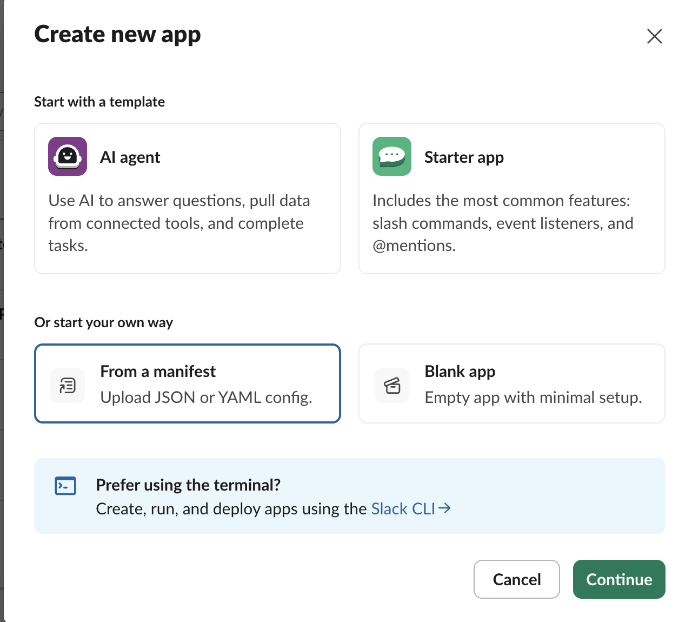
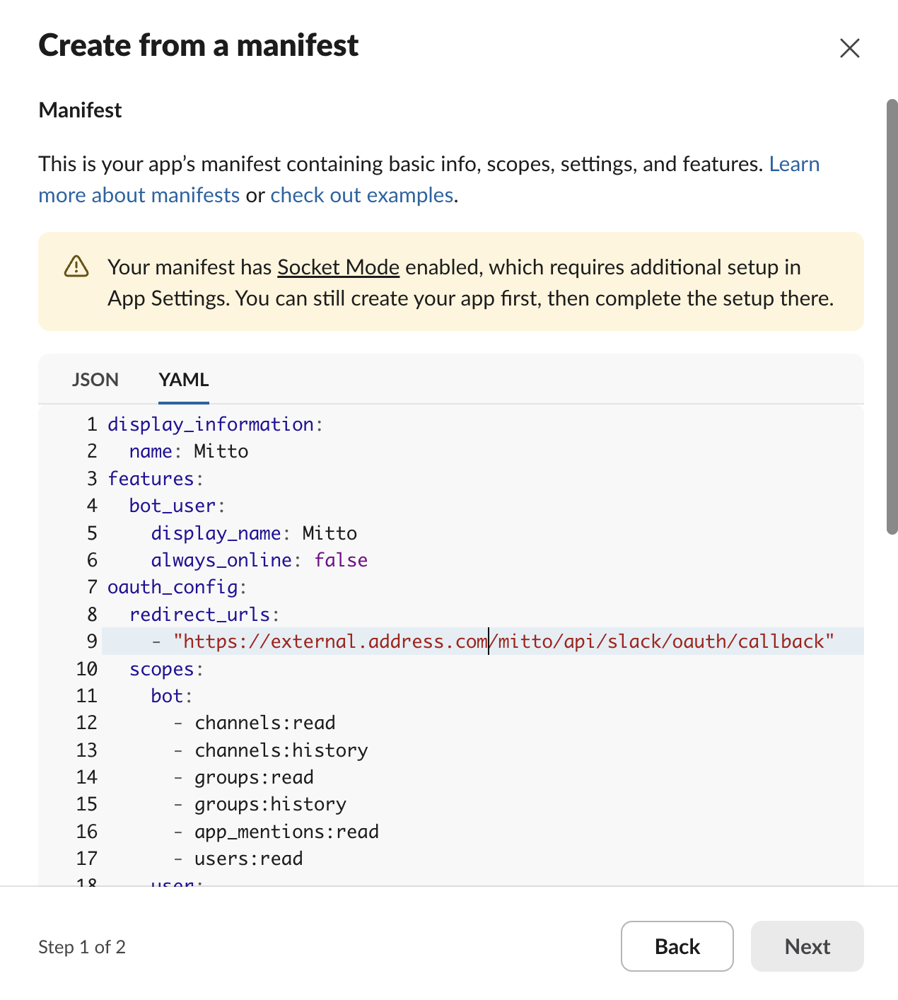
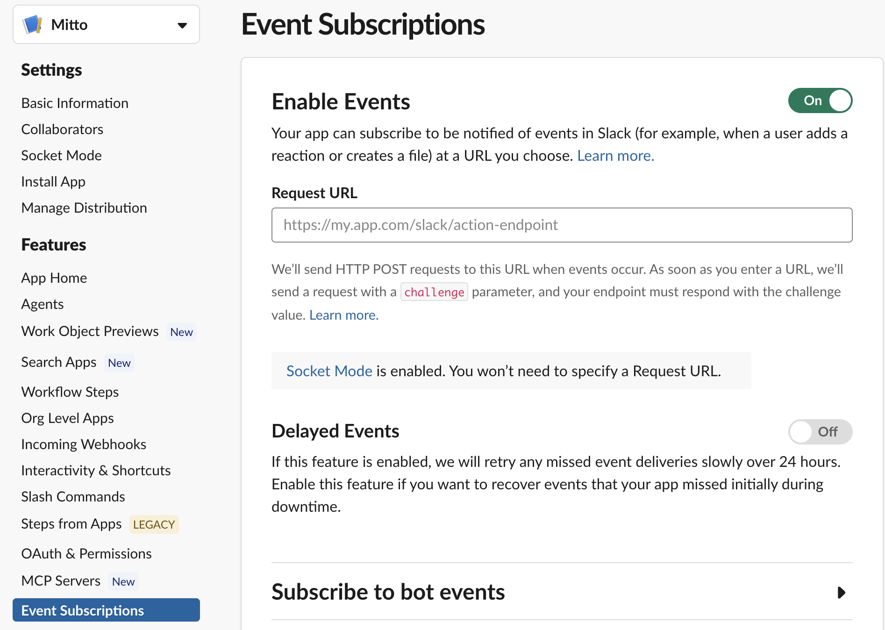

# Slack Integration

Connect a Slack channel to Mitto so that messages posted there can trigger a
loop conversation (an `onSlack` trigger). A message in a subscribed channel wakes
the loop, which can then read the message and act on it.

> **UI Location:** Settings → Slack

Mitto receives Slack messages over **Socket Mode** — no public URL or inbound
webhook is required. You create a Slack app once, give Mitto its tokens, and
subscribe one or more channels.

## Before you start

You need:

- A Slack workspace where you can install (or authorize) an app.
- Permission to create a Slack app at [api.slack.com/apps](https://api.slack.com/apps).
- The **Channel ID** of each channel you want to watch (see
  [Finding IDs](#finding-team-and-channel-ids)).

Mitto supports two ways to receive messages:

| Mode | Token | Use when |
| --- | --- | --- |
| **Bot** | Bot token (`xoxb-…`) | You want a dedicated bot identity; invite it to each channel. |
| **Delegated user** | User OAuth (`xoxp-…`) | You want Mitto to see the channels a specific user can already see, with no bot. |

Both modes also require one **app-level token** (`xapp-…`) for the Socket Mode
transport (see step 2 below).

## Step 1 — Create the Slack app from the manifest

1. In **Settings → Slack**, click **Copy manifest**.
2. Go to [api.slack.com/apps](https://api.slack.com/apps) → **Create New App** →
   **From an app manifest**, then pick your workspace.

   

3. Paste the manifest into the **YAML** tab, review it, and create the app. Slack
   shows a Socket Mode notice — that is expected; you finish that setup in
   [Step 2](#step-2--generate-the-app-level-token-required).

   

The manifest pre-configures everything Mitto needs: Socket Mode, the bot and
user scopes, and the message event subscriptions (`message.channels`,
`message.groups`) for both bot and user identities.

> **Existing app?** Paste the current manifest over it, then **reinstall or
> reauthorize** so any newly-added scopes and event subscriptions take effect.
> Slack never grants new scopes to a token minted before those scopes existed.

## Step 2 — Generate the app-level token (required)

The app-level token is **not** part of the manifest — you must create it by hand:

1. In the Slack app, open **Basic Information → App-Level Tokens →
   Generate Token and Scopes**.
2. Add **both** scopes:
   - `connections:write` — opens the Socket Mode connection.
   - `authorizations:read` — lets Mitto resolve which installation each incoming
     event belongs to. **Without it, Mitto receives every message but drops all
     of them** (see [Troubleshooting](#troubleshooting)).
3. Generate the token (it starts with `xapp-`) and copy it.

> Slack cannot add a scope to an existing token. If a token is missing
> `authorizations:read`, generate a **new** token with both scopes.

## Step 3 — Add the app and its credentials in Mitto

In **Settings → Slack**:

1. **Add the app profile** — paste the `xapp-…` app-level token. Mitto validates
   it and opens the Socket Mode connection.
2. **Add a credential** for how you'll read messages:
   - **Bot:** paste the bot token (`xoxb-…`). Then **invite the bot** to every
     channel you want to watch (`/invite @Mitto`). A private channel is only
     visible after the bot joins.
   - **Delegated user:** configure the OAuth client (client ID + secret) on the
     app profile, then click **Authorize delegated user** and complete the Slack
     consent flow. Mitto binds the returned token to its app/team/user identity.
     (Pasting a user token by hand is intentionally disabled — Slack can't prove
     its app provenance.)

Delegated-user OAuth requires an HTTPS redirect URL. Set
`web.hooks.external_address` (see [External Access](ext-access.md)); the exact
redirect URL to paste into Slack is shown in the Settings → Slack panel.

## Step 4 — Subscribe a channel with an onSlack trigger

Attach the Slack subscription to a **loop** conversation:

1. Create (or open) a conversation and configure it as a **loop**.
2. Add an **onSlack** trigger and select the app installation, the **Channel ID**,
   and the event mode (e.g. any human message).
3. Save. Posting a message in that channel now wakes the loop.

See [Prompts → Loop Prompts](prompts.md) for loop configuration details.

## Finding team and channel IDs

- **Channel ID:** In Slack, open the channel → click its name → the ID
  (`C0…`) is at the bottom of the **About** tab. Or copy the channel link; the ID
  is the trailing `C…` segment.
- **Team (workspace) ID:** Visible in the workspace URL after
  `/admin/` or via **About this workspace**; it starts with `T…`.

## Troubleshooting

| Symptom | Likely cause | Fix |
| --- | --- | --- |
| **Connected, but 0 events received** | The app isn't subscribed to the events for your identity — most often a delegated-user install missing `message.channels` / `message.groups` under *Subscribe to events on behalf of users*. | Reapply the manifest, then **reauthorize** so the new user-event subscriptions take effect. |
| **Events received, but 0 accepted** (log repeats `error_class=authorization` / `missing_scope`) | The app-level `xapp-…` token is missing `authorizations:read`, so Mitto can't resolve the event's installation and drops every message. | Generate a **new** app-level token with both `connections:write` **and** `authorizations:read`, update it in Settings, and restart. `accepted_count` should then climb with `events_api_received`. |
| **Private channel not selectable / no messages** | The bot hasn't joined the channel (bot mode), or the channel isn't visible to the authorizing user (delegated mode). | Invite the bot (`/invite @Mitto`), or reauthorize as a user who is a member. |
| **Nothing happens after a valid message** | The message subtype is filtered (edits, joins, bot messages, DMs are ignored by design), or the loop is paused/archived. | Post a plain human message in a subscribed channel and confirm the loop is enabled. |

To verify event delivery in the Slack app, open **Event Subscriptions**. With
Socket Mode enabled you do **not** need a Request URL; confirm that
`message.channels` / `message.groups` appear under *Subscribe to bot events*
and/or *Subscribe to events on behalf of users*.

## Related documentation

- [External Access](ext-access.md) — HTTPS redirect for delegated-user OAuth
- [Prompts → Loop Prompts](prompts.md) — configuring loop triggers
- [Slack Socket Mode Bridge](../devel/slack-bridge.md) — developer/architecture
  reference (routing, durable journal, internals)
