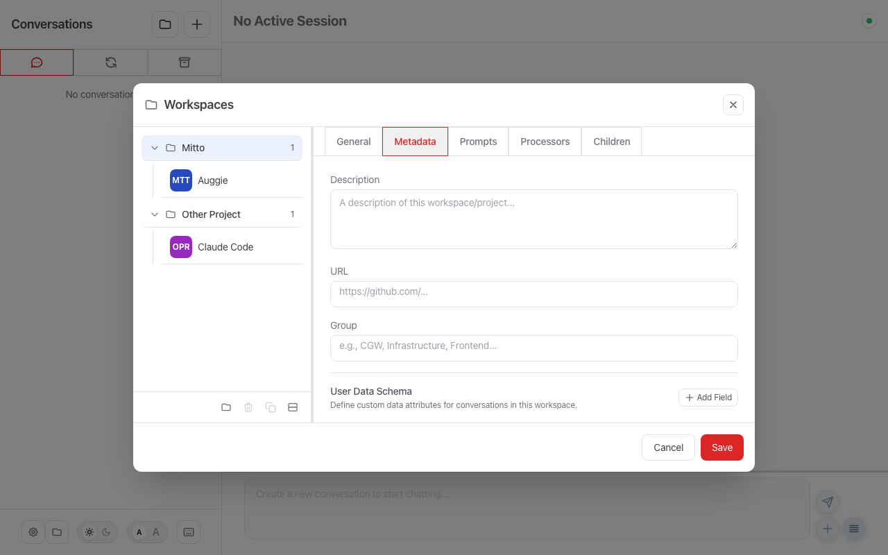
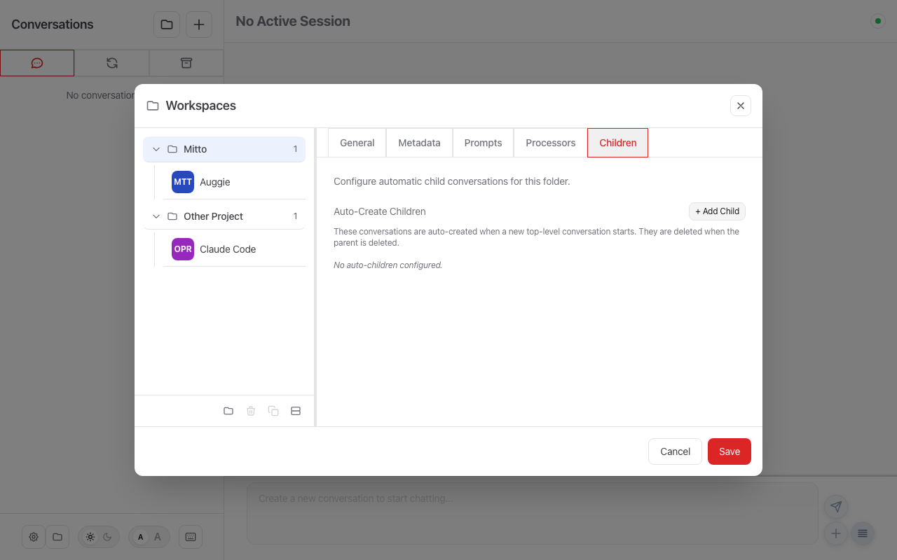

# Workspace Configuration

Workspaces connect **project folders** to **ACP servers**. Each workspace defines which AI agent handles a particular project, and carries folder-specific settings like prompts, processors, and runner restrictions.

## Configuration in the UI

### Managing Workspaces

Open the **Workspaces** dialog by clicking the 📁 icon in the sidebar footer:


The left panel lists your workspaces grouped by folder. Each folder can have multiple ACP server entries (e.g., one with Claude Code, another with Auggie for the same project).

**Toolbar buttons** at the bottom of the left panel:

| Button | Action |
|--------|--------|
| 📁 **Add Folder** | Create a new workspace — you'll be prompted to select a folder |
| 🗑️ **Delete** | Remove the selected ACP server entry |
| 📋 **Duplicate** | Clone the selected workspace with a new UUID |
| 🖥️ **Add Server** | Add another ACP server to the currently selected folder |

### Editing Workspace Settings

Click a **folder name** (e.g., "Mitto") to access folder-level settings. Click an **ACP server entry** under a folder to access workspace-level settings:


The right panel provides these tabs:

| Tab | Screenshot | What it configures |
|-----|------------|--------------------|
| **General** |  | ACP server, auxiliary model selection, runner, auto-approve |
| **Metadata** |  | Display name, description, URL, user data schema |
| **Beads** | — | Per-folder Beads (`bd`) integration: upstream task system, `bd config` keys, and Pull/Push/Sync (see [Beads Integration](#beads-integration)) |
| **Prompts** |  | Quick-action prompts (enable/disable, add, edit) |
| **Processors** |  | Message processors (enable/disable per workspace) |
| **Children** |  | Auto-spawn child conversations |
| **Runner** | — | Restricted execution sandbox settings |
| **MCP** | — | MCP server configuration and installation |

---

## YAML Configuration (`.mittorc`)

For advanced users or automation, workspace settings can also be defined via a `.mittorc` YAML file in the project root:

```
my-project/
├── .mittorc          # Workspace-specific configuration
├── src/
├── tests/
└── ...
```

The file is automatically loaded when you open a workspace in Mitto and reloaded every 30 seconds to pick up changes.

### Configuration Hierarchy

| Level         | File                            | Scope                          |
| ------------- | ------------------------------- | ------------------------------ |
| **Global**    | `~/.mittorc` or `settings.json` | Applies to all workspaces      |
| **Workspace** | `<project>/.mittorc`            | Applies only to that workspace |

### Supported Sections

| Section           | Description                                              | Details |
| ----------------- | -------------------------------------------------------- | ------- |
| `prompts`         | Quick-action prompts shown in the chat interface         | [Prompts](prompts.md) |
| `conversations`   | Inline text-mode processors                              | [Processors](processors.md#inline-processors-in-mittorc) |
| `processors_dirs` | Additional processor directories                         | [Processors](processors.md#workspace-local-processors) |
| `metadata`        | Display name, description, URL, user data schema         | [User Data](user-data.md) |

> **Note**: Sections like `acp`, `web`, and `ui` are ignored in workspace files — these can only be configured globally.

### Workspace-Level Fields (workspaces.json)

The following fields are stored in `workspaces.json` and edited through the UI. The most commonly changed ones:

| Field | Type | Description |
|-------|------|-------------|
| `acp_server` | string | Name of the ACP server for this workspace |
| `auxiliary_model_selection` | object | Optional model selection for auxiliary sessions (title generation, follow-up analysis, etc.). When set, auxiliary sessions start on the workspace's main ACP server and switch to the best-matching available model. When unset, the ACP server's default model is used. Object has two fields: `matchMode` (one of `contains`, `exact`, `startsWith`, `regex`, `lookAlike`) and `pattern` (the text to match against model names). |
| `restricted_runner` | string | Sandbox type: `exec` (default), `sandbox-exec`, `firejail`, `docker` |
| `auto_approve` | boolean | Auto-approve all agent tool-call permission requests |
| `is_default` | boolean | Marks this workspace as the default for its folder. When several workspaces share the same directory (e.g. different ACP servers or model variants), the default is preferred when a workspace must be resolved from the folder alone (no ACP server specified). At most one workspace per folder should set this. |
| `acp_command_override` | string | Custom command line for the ACP server (overrides the server's default command) |

### Complete `.mittorc` Example

```yaml
# Workspace-specific configuration for MyProject
# Place this file at: my-project/.mittorc

# Workspace metadata
metadata:
  description: "Node.js API with TypeScript"
  url: "https://github.com/myorg/myproject"
  user_data:
    - name: "JIRA Ticket"
      type: string

# Quick-action prompts for this project
prompts:
  - name: "Run Tests"
    backgroundColor: "#BBDEFB"
    prompt: "Run the test suite with: npm test"

  - name: "Build & Deploy"
    backgroundColor: "#E8F5E9"
    prompt: "Build and deploy: npm run build && npm run deploy"

# Inline text-mode processors
conversations:
  processing:
    processors:
      - when:
          on: userPrompt
          match: first
        mutate: prepend
        text: |
          You are working on MyProject, a Node.js application.
          Follow TypeScript strict mode and ESLint rules.
          ---
```

### Folder-Level Fields (folders.json)

Settings shared by every ACP server entry in the same folder — the display `name`, badge `code`, badge `color`, the organizational `group` label, `auto_children`, and the Beads `beads` subsection — are stored once per folder in a `folders.json` file in the Mitto data directory (`$MITTO_DIR`), keyed by working directory. The folder `group` (e.g. "development", "personal", "operations") is Mitto-local and distinct from the `.mittorc` metadata `group`.

`folders.json` is the **authoritative store** for these values, not merely a deduplication of `workspaces.json`. It is created the first time via a one-time automatic migration that lifts any inline folder fields out of `workspaces.json`; thereafter all common folder-level information always lives there. The split is fully transparent — the UI and API always see complete workspace records, because Mitto merges `folders.json` into each workspace on load (the folder value always wins). Workspace metadata (`description`, `url`, `group`, `user_data_schema`) is **not** stored here; it stays in the committable `.mittorc` so it remains version-controllable. See [docs/devel/workspaces.md](../devel/workspaces.md#folder-level-settings-foldersjson) for details.

Example `folders.json`:

```json
{
  "folders": {
    "/path/to/project": {
      "name": "My Project",
      "code": "MYP",
      "color": "#ff5500",
      "group": "development",
      "beads": { "upstream": "github" }
    }
  }
}
```

When running the web interface you can overlay folder settings from an external
file without persisting them, mirroring `--workspaces`:

```bash
# Overlay folder settings from a JSON or YAML file (not saved to disk)
mitto web --folders config/folders.yaml
```

## Beads Integration

The **Beads** tab (folder-level) is a UI wrapper over the Beads (`bd`) issue tracker for the folder's project. It has three parts:

- **Upstream tasks management** — a dropdown (`none`, `Jira`, `GitHub`, `GitLab`, `Linear`) that selects the external task system Beads syncs with. This is folder-native and persisted in `folders.json` under the `beads` subsection. When set, Pull/Push/Sync actions appear in the Beads view for the folder, and a list of recommended configuration keys for the selected system is shown for convenience.
- **`bd config` keys** — an editor for the folder's Beads configuration (namespaced keys such as `jira.url`, `github.repository`, `gitlab.project`). These are stored in the folder's Beads database via `bd config`, not in `folders.json`. Operational/system keys are shown read-only (edit them via the `bd` CLI).
- **Pull / Push / Sync** — buttons in the Beads view that map to the selected upstream's sync operations (`bd <system> sync` with pull-only / push-only / bidirectional). They appear only when an upstream is configured.

## Auto-Created Children

Workspaces can automatically spawn child conversations when a new top-level conversation is created. This is configured through the **Children** tab in the UI or via the `auto_children` field (stored per folder in `folders.json`).

See **[Auto-Create Children Conversations](auto-children.md)** for details and the "smart model + fast helpers" pattern.

## Related Documentation

- [Prompts](prompts.md) - Quick actions and predefined prompts
- [Processors](processors.md) - Message transformation (text, command, prompt modes)
- [User Data](user-data.md) - Custom metadata for conversations
- [Conversation Settings](conversations.md) - Auto-approve, auto-archive, external images
- [Auto-Create Children](auto-children.md) - Auto-spawn helper conversations
- [Configuration Overview](overview.md) - Global configuration options
