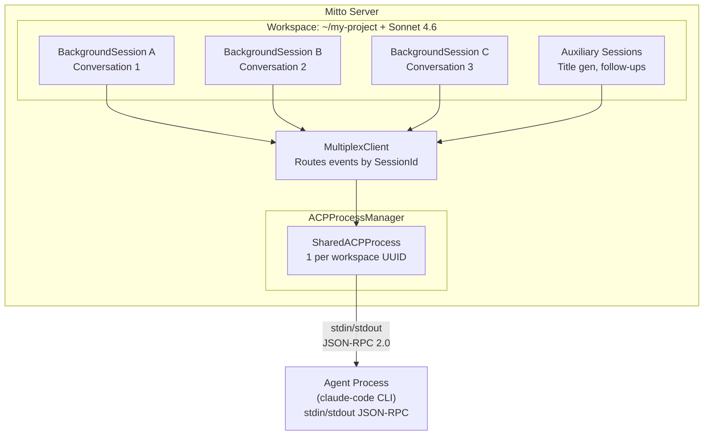
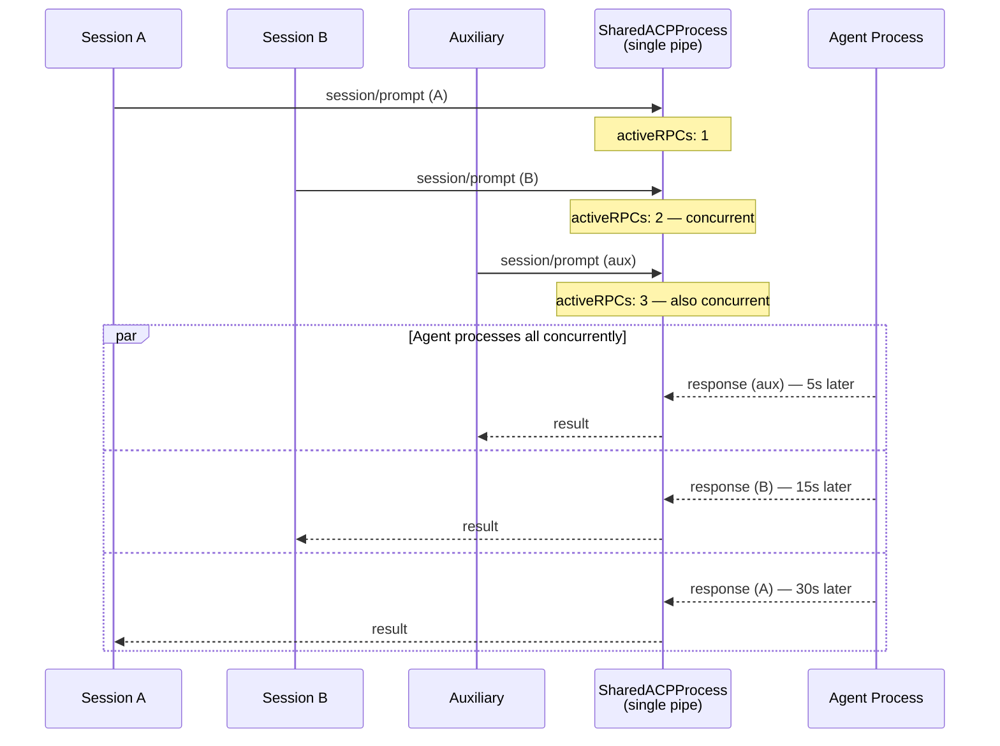
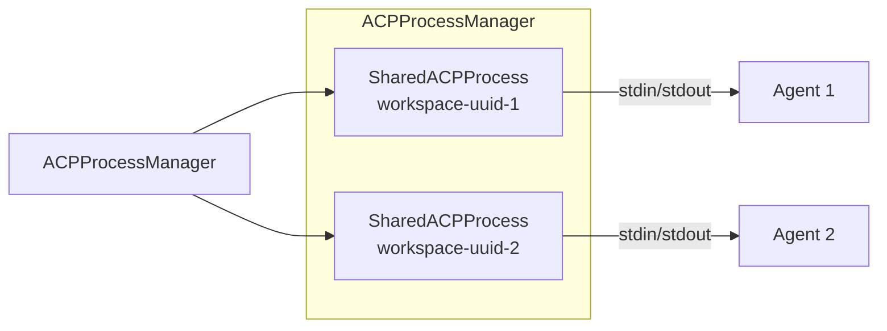
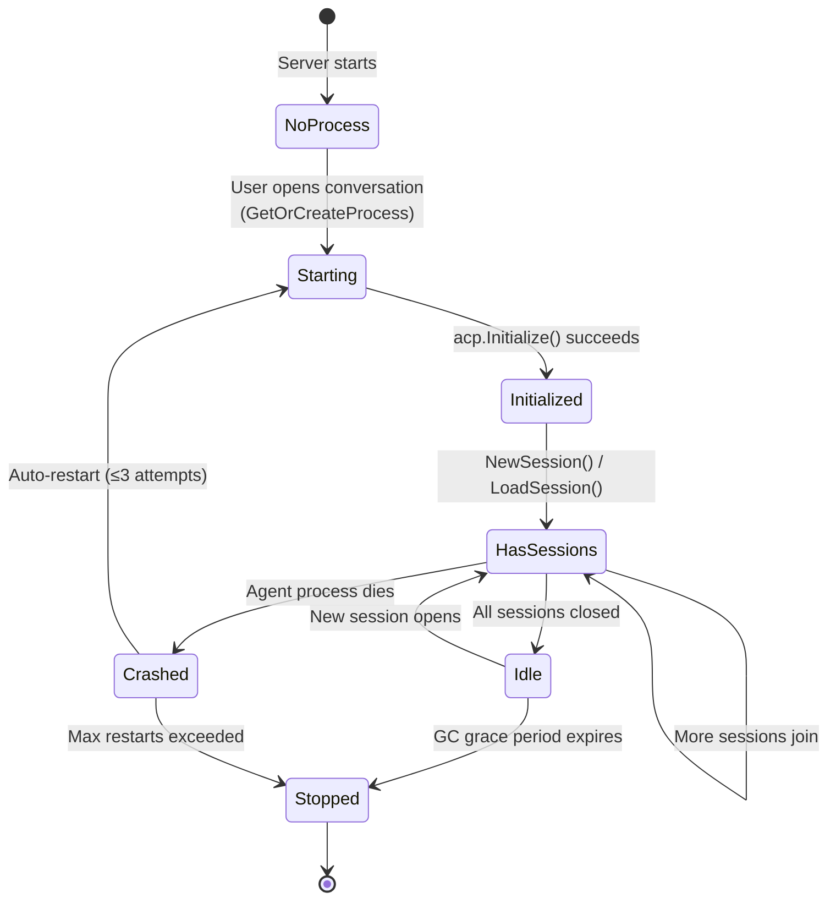

# ACP Architecture

This document covers how Mitto manages ACP (Agent Client Protocol) processes,
sessions, and the multiplexing architecture that enables multiple conversations to
share a single AI agent process.

## Overview

Mitto communicates with AI coding agents (Claude Code, Auggie) via the ACP protocol.
Rather than spawning one agent process per conversation, Mitto uses a **shared process
architecture** where all conversations in the same workspace share a single agent
process.



## Key Concepts

### Workspace UUID

A workspace is the combination of **working directory + ACP server**. Each unique
combination gets a `UUID` (persisted in `~/.../Mitto/workspaces.json`). This UUID
is the key for process sharing:

```
workspace UUID = hash(working_dir + acp_server_name)
                 → maps to one SharedACPProcess
                 → maps to one agent subprocess
```

### Process Sharing

All conversations opened on the same workspace share one `SharedACPProcess`:

```go
// ACPProcessManager
processes map[string]*SharedACPProcess // keyed by workspace UUID
```

### ACP Sessions: Context Isolation and Concurrency

ACP sessions are **separate conversation threads within one agent process**. They
provide **context isolation AND parallelism**. Each session maintains its own
conversation history and working context, and modern ACP agents (Claude Code, Auggie)
can process prompts from different sessions concurrently — because the agent dispatches
work to a remote LLM API and does not block while waiting for responses.

**Why sessions exist:** Without sessions, you'd have two bad options:

1. **One session, all conversations mixed** — The agent can't distinguish which
   conversation a prompt belongs to. Conversation contexts bleed into each other.

2. **One process per conversation** — Each process independently indexes the
   workspace, loads language servers, and builds file caches. 5 conversations on the
   same project = 5× the memory, mostly duplicated work.

Sessions give you option 3:

```
One process: ~500MB RAM — indexes workspace once
  ├─ Session A: "fix login bug" — separate conversation history, runs concurrently
  ├─ Session B: "write README"  — separate conversation history, runs concurrently
  └─ Session C: "add tests"     — separate conversation history, runs concurrently
```

When Mitto sends `session/prompt` with `SessionId: "abc123"`, the agent knows which
conversation context to use. The workspace index, file cache, and language server are
shared across all sessions — only the conversation histories are separate.

**The analogy:** Sessions are like tabs in a web browser. Each tab has its own page
and history (context isolation), tabs can load pages simultaneously because requests
dispatch to remote servers (concurrent processing), and you don't need a separate
browser for each tab (resource sharing). Prompts to the same session are serialized
(like clicking links within the same tab), but prompts across different sessions run
in parallel.

### RPC Concurrency Model

**Modern ACP agents handle multiple sessions concurrently.** The ACP SDK transport
(JSON-RPC over stdin/stdout) supports concurrent in-flight requests (unique IDs,
pending map), and the agent dispatches prompts to a remote LLM API — so it does not
block while waiting for one session's response before processing another.

**What IS concurrent:**

- Prompts to **different sessions** run in parallel (verified empirically: multiple
  conversations respond simultaneously against the same agent process)
- Auxiliary operations (title gen, follow-ups) can run alongside user prompts in
  other sessions

**What IS serialized:**

- Prompts to the **same session** — you can't send two prompts to the same
  conversation simultaneously; the agent must process them in order to maintain
  conversation history consistency
- Wire writes to stdin/stdout — `writeMu` in the SDK serializes the bytes going into
  the pipe, but each request then proceeds independently once sent



The `WaitForIdle()` method polls `activeRPCs` (an `atomic.Int32`) before issuing
auxiliary RPCs. With concurrent agent support, this is primarily a **politeness
mechanism** — it avoids piling additional requests on an already-busy agent — rather
than a strict gate preventing concurrent execution:

```go
func (p *SharedACPProcess) WaitForIdle(ctx context.Context) error {
    // Polls activeRPCs every 500ms until 0 or context cancelled
}
```

## Architecture Layers

### Layer 1: ACP SDK (`github.com/coder/acp-go-sdk`)

The SDK provides the JSON-RPC transport:

- `Connection` — wraps stdin/stdout of the agent subprocess
- `SendRequest[T]()` — sends a JSON-RPC request, waits for matching response by ID
- `writeMu` — serializes wire writes (not request lifecycle)
- `pending map[string]*pendingResponse` — tracks in-flight requests by unique ID

**The SDK supports concurrent RPCs.** Multiple goroutines can call `SendRequest`
simultaneously — each gets a unique ID and waits for its own response.

### Layer 2: Mitto ACP Client (`internal/acp/`)

Wraps the SDK with Mitto-specific concerns:

- `connection.go` — `NewConnection()`, process lifecycle management
- `client.go` — Permission handling, file operations
- `command.go` — Agent command construction
- `terminal.go` — Terminal session management for agent tool calls
- `types.go` — Content block helpers (`TextBlock`, `ImageBlock`, etc.)

### Layer 3: Shared Process (`internal/web/shared_acp_process.go`)

Manages the lifecycle of a single agent process shared across sessions:

- Starts the agent subprocess with `acp.NewConnection()`
- Tracks `activeRPCs` for GC safety (avoids killing processes with in-flight RPCs)
- Provides `NewSession()`, `LoadSession()`, `Prompt()` that wrap SDK calls
- Handles auto-restart on agent crashes (up to 3 attempts)

### Layer 4: MultiplexClient (`internal/web/multiplex_client.go`)

Routes agent-initiated callbacks to the correct `BackgroundSession`:

```go
type MultiplexClient struct {
    sessions map[acp.SessionId]*SessionCallbacks
}
```

When the agent sends a notification (e.g., `session/update`, `readTextFile`), the
`MultiplexClient` looks up the `SessionId` and dispatches to the correct callback set.
Each `BackgroundSession` registers its own `SessionCallbacks` when it creates/loads
a session.

### Layer 5: Process Manager (`internal/web/acp_process_manager.go`)

Top-level manager, one per Mitto server:

- `processes map[string]*SharedACPProcess` — keyed by workspace UUID
- `GetOrCreateProcess()` — lazy process creation
- Auxiliary session management (title-gen, follow-ups, prompt improvement)
- GC loop for idle process cleanup



## Connection Lifecycle



### Session Lifecycle within a Process

1. **Create/Load** — `BackgroundSession` calls `NewSession(ctx, workingDir)` or
   `LoadSession(ctx, sessionID)` on the shared process
2. **Register callbacks** — Session registers `SessionCallbacks` on `MultiplexClient`
3. **Prompt** — `Prompt(ctx, sessionID, blocks)` sends content to agent
4. **Stream** — Agent sends `session/update` notifications → `MultiplexClient` →
   correct `BackgroundSession` → observers (WebSocket clients)
5. **Close** — Session unregisters from `MultiplexClient`, decrements reference count

## Content Blocks

The ACP SDK uses a discriminated union (pointer fields) for content blocks:

```go
type ContentBlock struct {
    Text         *ContentBlockText
    Image        *ContentBlockImage
    Audio        *ContentBlockAudio
    ResourceLink *ContentBlockResourceLink
    Resource     *ContentBlockResource
}

// Check type via nil checks — NO Type() method exists
if block.Image != nil { /* image */ }
if block.Text != nil  { /* text */ }
```

### Image Pipeline

```
User uploads image (HTTP POST)
  → Stored on disk (session_dir/images/{uuid}.{ext})
  → WebSocket prompt includes image_ids: ["uuid1", "uuid2"]
  → PromptWithMeta loads from disk, base64 encodes
  → acp.ImageBlock(base64, mimeType)
  → Sent to agent via Prompt()
```

## Auxiliary Sessions

Auxiliary sessions use the **same shared process** for non-critical background work:

| Purpose               | Session          | Trigger                    |
| --------------------- | ---------------- | -------------------------- |
| Title generation      | `title-gen`      | After first agent response |
| Follow-up suggestions | `follow-up`      | After prompt completes     |
| Prompt improvement    | `improve-prompt` | User requests it           |
| MCP tools check       | `mcp-check`      | On process creation        |

Auxiliary sessions are pre-warmed on process creation to avoid cold-start delays.
Auxiliary sessions run concurrently with user sessions — they do not block on or wait for user prompts.

### Concurrency Guard

Follow-up analysis has a `followUpInProgress atomic.Bool` guard to prevent duplicate
analyses when prompt completion and session resume race:

```go
if !bs.followUpInProgress.CompareAndSwap(false, true) {
    return // Another analysis in progress — skip
}
defer bs.followUpInProgress.Store(false)
```

## Concurrency Characteristics and Future Directions

### Current Behavior

Modern ACP agents (Claude Code, Auggie) handle multi-session workloads concurrently.
The shared process architecture allows:

1. **Parallel conversations** — Multiple sessions in the same workspace run their
   prompts simultaneously (verified empirically)
2. **Concurrent auxiliary work** — Title generation and follow-up analysis can
   proceed alongside user prompts in other sessions
3. **Efficient resource sharing** — One process, one workspace index, one language
   server — regardless of how many concurrent sessions are active

The main constraint is that prompts to the **same session** are serialized: the agent
must process them in order to maintain conversation history consistency.

### Possible Improvements

| Approach                       | Description                                 | Trade-off                                                                |
| ------------------------------ | ------------------------------------------- | ------------------------------------------------------------------------ |
| **Separate auxiliary process** | Dedicated process for title-gen, follow-ups | ✅ Resource/crash isolation. ❌ 2× memory per workspace                  |
| **Process pool**               | N processes per workspace, route by session | ✅ Crash isolation per group. ❌ N× resources, more complexity           |
| **Per-conversation process**   | Revert to 1:1 (legacy mode)                 | ✅ Full crash isolation. ❌ Much more memory, duplicated workspace index |

These improvements are less critical given the agent's built-in concurrency support.
They may still be worthwhile for **resource isolation** (an aux crash won't kill user
sessions) or **memory tuning** (limit per-process footprint). The current shared
process approach is a good default.

## Process Garbage Collection

When Mitto starts, any interaction with a workspace triggers creation of a shared ACP
process. Without cleanup, these processes live until server exit, wasting resources.

### Problem

1. **Queue processing** — `ProcessPendingQueues()` starts a process that stays alive
   after the queue is drained
2. **Periodic prompts** — `PeriodicRunner` starts a process for delivery, never stops it
3. **Brief UI visits** — Opening a conversation starts a process permanently
4. **Auxiliary pre-warming** — 4 auxiliary sessions are eagerly spawned on process creation

### Solution: Two-Tier Periodic Garbage Collection

Instead of reference counting (error-prone, requires wiring into every lifecycle path),
use a periodic GC loop that is self-healing: even if something goes wrong, the next
cycle cleans up.

### Tier 1 — Idle Session Cleanup

A session is considered **idle** when ALL of the following are true:

- Zero WebSocket observers (`!bs.HasObservers()`)
- Not currently prompting (`!bs.IsPrompting()`)
- Queue is empty (no pending messages)
- No periodic prompt due within the next GC interval
- Not closed (not already cleaned up)

When a session is idle, the GC calls `CloseSession()`, which:

- Removes it from `SessionManager.sessions`
- Calls `bs.Close()` (unregisters from shared process, stops recorder)

**Important**: Sessions with active periodic prompts should NOT be closed if their
next scheduled delivery is within 2× the GC interval. This avoids the overhead of
repeatedly closing and re-creating sessions that will be needed again shortly.

### Tier 2 — Idle Process Cleanup

After tier 1 runs, check each shared process in `ACPProcessManager.processes`:

- Query `SessionManager`: are there any running sessions for this workspace UUID?
- If **no sessions** AND the process has been sessionless for longer than
  `gracePeriod` → call `StopProcess(workspaceUUID)`

The grace period (default: 60 seconds) prevents process thrashing when quickly
switching between conversations. A `lastSessionSeen` timestamp per workspace
tracks when sessions were last present.

### Avoiding Unnecessary Process Creation

#### `ProcessPendingQueues()` — Already Safe

`ProcessPendingQueues()` already checks `queue.Len()` **before** calling
`ResumeSession()` (line ~1890 in `session_manager.go`):

```go
queue := store.Queue(meta.SessionID)
queueLen, err := queue.Len()
if err != nil || queueLen == 0 {
    continue  // Skip — no queued messages
}
```

So it does NOT start a process for sessions with empty queues. The problem is that
after the queue is processed, the session (and its process) remain alive. The GC
fixes this.

#### `PeriodicRunner` — Already Safe

`PeriodicRunner.checkSession()` only calls `ResumeSession()` when a periodic prompt
is actually due (line ~329 in `periodic_runner.go`). It correctly skips archived
sessions and sessions that aren't due yet. Again, the problem is cleanup after
delivery — which the GC handles.

#### Auxiliary Pre-warming — Deferred

Currently, `GetOrCreateProcess()` eagerly pre-warms 4 auxiliary sessions. With the
GC in place, this should be **deferred**: pre-warm only when the process is created
for an actual user conversation, not for transient queue/periodic work.

Change `GetOrCreateProcess()` to accept a `prewarm bool` parameter:

- `true` when called from `CreateSession`/`ResumeSession` for user conversations
- `false` when called from `ProcessPendingQueues` or `PeriodicRunner` paths

Alternatively, keep pre-warming always-on and let the GC clean up the process
shortly after — simpler but wastes ~5 seconds of Claude startup for no reason.

## Implementation Plan

### 1. Add GC Loop to `ACPProcessManager`

```go
// GCConfig configures the garbage collection loop.
type GCConfig struct {
    Interval    time.Duration // How often to run GC (default: 30s)
    GracePeriod time.Duration // How long a process must be sessionless before stopping (default: 60s)
}
```

New fields on `ACPProcessManager`:

- `lastSessionSeen map[string]time.Time` — per workspace, when sessions were last present
- `gcStop chan struct{}` / `gcDone chan struct{}` — lifecycle management

New methods:

- `StartGC(config GCConfig, sessionQuery SessionQueryFunc)` — starts the GC goroutine
- `StopGC()` — stops the GC goroutine
- `RunGCOnce(sessionQuery SessionQueryFunc)` — single GC iteration (exported for testing)

The `SessionQueryFunc` is a callback to query `SessionManager` without creating a
circular dependency:

```go
// SessionQueryFunc returns running sessions grouped by workspace UUID.
// Used by the GC to determine which processes still have active sessions.
type SessionQueryFunc func() map[string][]SessionInfo

// SessionInfo contains the minimum information the GC needs about a session.
type SessionInfo struct {
    SessionID    string
    IsPrompting  bool
    HasObservers bool
    QueueLength  int
    // NextPeriodicAt is when the next periodic prompt is due (nil = no periodic config)
    NextPeriodicAt *time.Time
}
```

### 2. Provide Session Info from `SessionManager`

Add a method to `SessionManager` that the GC can call:

```go
// GetSessionInfoByWorkspace returns session info grouped by workspace UUID.
// Used by the ACP process GC to determine which processes are still needed.
func (sm *SessionManager) GetSessionInfoByWorkspace() map[string][]SessionInfo {
    sm.mu.RLock()
    defer sm.mu.RUnlock()

    result := make(map[string][]SessionInfo)
    for _, bs := range sm.sessions {
        uuid := bs.GetWorkspaceUUID()
        if uuid == "" {
            continue
        }

        var nextPeriodic *time.Time
        if sm.store != nil {
            if p, err := sm.store.Periodic(bs.GetSessionID()).Get(); err == nil && p.Enabled {
                nextPeriodic = p.NextScheduledAt
            }
        }

        var queueLen int
        if sm.store != nil {
            queueLen, _ = sm.store.Queue(bs.GetSessionID()).Len()
        }

        result[uuid] = append(result[uuid], SessionInfo{
            SessionID:      bs.GetSessionID(),
            IsPrompting:    bs.IsPrompting(),
            HasObservers:   bs.HasObservers(),
            QueueLength:    queueLen,
            NextPeriodicAt: nextPeriodic,
        })
    }
    return result
}
```

### 3. Wire Up in `server.go`

After creating the `ACPProcessManager` and `SessionManager`:

```go
acpProcessMgr.StartGC(GCConfig{
    Interval:    30 * time.Second,
    GracePeriod: 60 * time.Second,
}, func() map[string][]SessionInfo {
    return sessionMgr.GetSessionInfoByWorkspace()
})
```

Add `acpProcessMgr.StopGC()` to the server shutdown path.

### 4. Defer Auxiliary Pre-warming (Optional Enhancement)

Modify `GetOrCreateProcess()` signature:

```go
func (m *ACPProcessManager) GetOrCreateProcess(
    workspace *config.WorkspaceSettings,
    r *runner.Runner,
    prewarm bool,  // New parameter
) (*SharedACPProcess, error) {
    // ... existing logic ...
    if !m.DisableAuxiliary && prewarm {
        go m.prewarmAuxiliarySessions(workspace.UUID, processLogger)
    }
}
```

Update callers:

- `SessionManager.getSharedProcess()` → pass `true` (user conversations)
- `SessionManager.EnsureWorkspaceAuxiliary()` → pass `false`
- Any transient/background path → pass `false`

## GC Algorithm (Pseudocode)

```
every Interval:
    sessionsByWorkspace = sessionQuery()

    // Tier 1: Close idle sessions
    for each workspace, sessions in sessionsByWorkspace:
        for each session in sessions:
            if session.IsPrompting:
                continue  // Active work
            if session.HasObservers:
                continue  // UI connected
            if session.QueueLength > 0:
                continue  // Pending work
            if session.NextPeriodicAt != nil &&
               session.NextPeriodicAt < now + 2*Interval:
                continue  // Periodic prompt due soon
            sessionManager.CloseSession(session.SessionID, "gc_idle")

    // Tier 2: Stop idle processes
    for each workspaceUUID, process in acpProcessManager.processes:
        runningSessions = sessionQuery()[workspaceUUID]
        if len(runningSessions) > 0:
            lastSessionSeen[workspaceUUID] = now
            continue
        if lastSessionSeen[workspaceUUID] is zero:
            lastSessionSeen[workspaceUUID] = now  // First time seeing it empty
            continue
        if now - lastSessionSeen[workspaceUUID] < GracePeriod:
            continue  // Within grace period
        acpProcessManager.StopProcess(workspaceUUID)
        delete(lastSessionSeen, workspaceUUID)
```

## Edge Cases

### Session closed during active auxiliary prompt

Auxiliary prompts (title-gen, follow-up) run asynchronously. If the GC closes a
session while an aux prompt is in-flight, the aux prompt will fail with "no shared
process" on the next attempt. This is acceptable — the failure is logged and the
aux result is simply lost (title generation, follow-up suggestions are non-critical).

### Process stopped while PeriodicRunner is about to deliver

If the GC stops a process and the PeriodicRunner immediately tries to deliver,
`ResumeSession()` will call `GetOrCreateProcess()` and restart the process. This is
the correct behavior — the process is started on demand.

### Rapid open/close of conversations

The 60-second grace period prevents the process from being stopped and immediately
restarted. The user can open and close several conversations within 60 seconds
without triggering process restarts.

### Multiple workspaces

Each workspace has its own independent GC tracking. Closing all sessions in
workspace A does not affect workspace B's process.

### Server shutdown

`StopGC()` is called during shutdown. The existing `CloseAll()` → `pm.Close()`
path handles killing all processes. The GC does not interfere.

## Testing Strategy

1. **Unit test for GC algorithm**: Create mock `SessionQueryFunc` returning various
   states. Verify that `RunGCOnce()` correctly identifies idle sessions and idle
   processes.

2. **Grace period test**: Verify that a process is NOT stopped within the grace
   period, and IS stopped after it expires.

3. **Integration test**: Start a session, close it, wait for GC, verify the shared
   process is stopped.

4. **Periodic session preservation**: Verify that sessions with upcoming periodic
   prompts are NOT closed by the GC.

## Configuration

The GC intervals could be made configurable via `config.yaml` under a new section:

```yaml
process:
  gc_interval: 30s # How often to check for idle processes
  gc_grace_period: 60s # How long to wait before stopping an idle process
```

For the initial implementation, hardcoded defaults are sufficient.

## Impact Summary

| Component                  | Change                                                                  |
| -------------------------- | ----------------------------------------------------------------------- |
| `ACPProcessManager`        | New GC loop, `lastSessionSeen` tracking, `StartGC`/`StopGC`/`RunGCOnce` |
| `SessionManager`           | New `GetSessionInfoByWorkspace()` method                                |
| `server.go`                | Wire up GC start/stop                                                   |
| `GetOrCreateProcess`       | Optional: add `prewarm` parameter                                       |
| Existing session lifecycle | **No changes** — GC is purely additive                                  |
| Tests                      | New unit tests for GC; existing tests unaffected                        |
