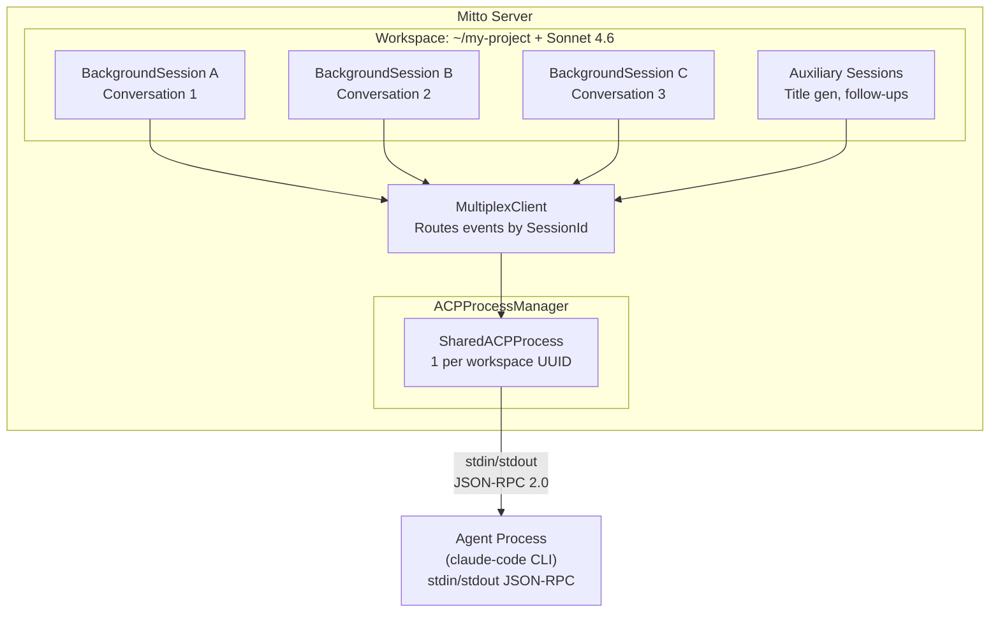
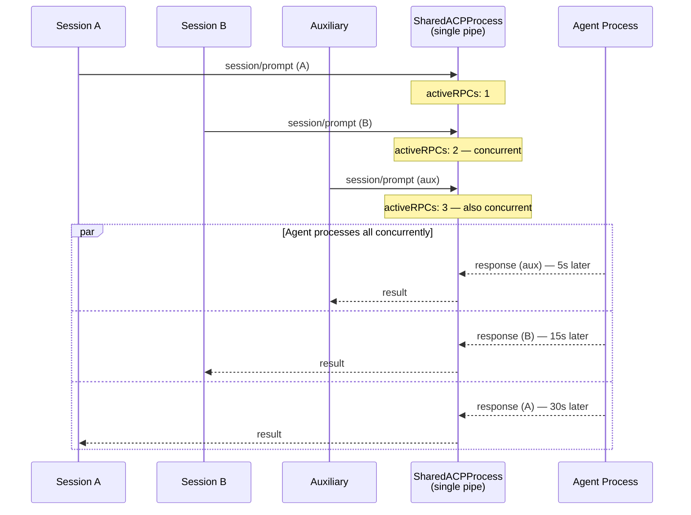
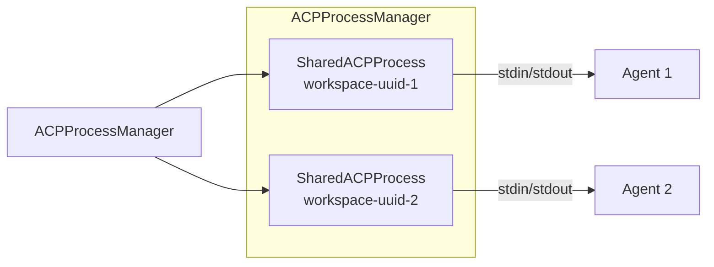
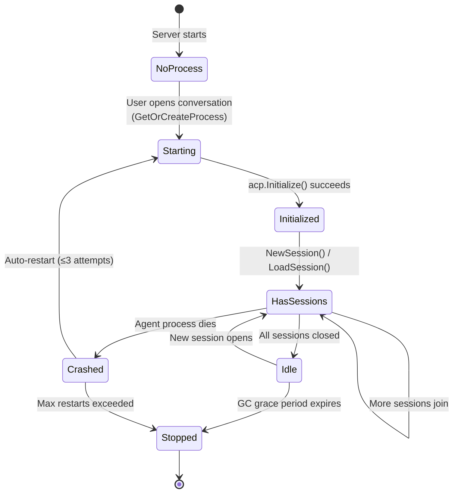

# ACP Architecture

This document covers how Mitto manages ACP (Agent Client Protocol) processes,
sessions, and the multiplexing architecture that enables multiple conversations to
share a single AI agent process.

## Overview

Mitto communicates with AI coding agents (Claude Code, Auggie) via the ACP protocol.
Rather than spawning one agent process per conversation, Mitto uses a **shared process
architecture** where all conversations in the same workspace share a single agent
process.



## Key Concepts

### Workspace UUID

A workspace is the combination of **working directory + ACP server**. Each unique
combination gets a `UUID` (persisted in `~/.../Mitto/workspaces.json`). This UUID
is the key for process sharing:

```
workspace UUID = hash(working_dir + acp_server_name)
                 → maps to one SharedACPProcess
                 → maps to one agent subprocess
```

### Process Sharing

All conversations opened on the same workspace share one `SharedACPProcess`:

```go
// ACPProcessManager
processes map[string]*SharedACPProcess // keyed by workspace UUID
```

### ACP Sessions: Context Isolation and Concurrency

ACP sessions are **separate conversation threads within one agent process**. They
provide **context isolation AND parallelism**. Each session maintains its own
conversation history and working context, and modern ACP agents (Claude Code, Auggie)
can process prompts from different sessions concurrently — because the agent dispatches
work to a remote LLM API and does not block while waiting for responses.

**Why sessions exist:** Without sessions, you'd have two bad options:

1. **One session, all conversations mixed** — The agent can't distinguish which
   conversation a prompt belongs to. Conversation contexts bleed into each other.

2. **One process per conversation** — Each process independently indexes the
   workspace, loads language servers, and builds file caches. 5 conversations on the
   same project = 5× the memory, mostly duplicated work.

Sessions give you option 3:

```
One process: ~500MB RAM — indexes workspace once
  ├─ Session A: "fix login bug" — separate conversation history, runs concurrently
  ├─ Session B: "write README"  — separate conversation history, runs concurrently
  └─ Session C: "add tests"     — separate conversation history, runs concurrently
```

When Mitto sends `session/prompt` with `SessionId: "abc123"`, the agent knows which
conversation context to use. The workspace index, file cache, and language server are
shared across all sessions — only the conversation histories are separate.

**The analogy:** Sessions are like tabs in a web browser. Each tab has its own page
and history (context isolation), tabs can load pages simultaneously because requests
dispatch to remote servers (concurrent processing), and you don't need a separate
browser for each tab (resource sharing). Prompts to the same session are serialized
(like clicking links within the same tab), but prompts across different sessions run
in parallel.

### RPC Concurrency Model

**Modern ACP agents handle multiple sessions concurrently.** The ACP SDK transport
(JSON-RPC over stdin/stdout) supports concurrent in-flight requests (unique IDs,
pending map), and the agent dispatches prompts to a remote LLM API — so it does not
block while waiting for one session's response before processing another.

**What IS concurrent:**

- Prompts to **different sessions** run in parallel (verified empirically: multiple
  conversations respond simultaneously against the same agent process)
- Auxiliary operations (title gen, follow-ups) can run alongside user prompts in
  other sessions

**What IS serialized:**

- Prompts to the **same session** — you can't send two prompts to the same
  conversation simultaneously; the agent must process them in order to maintain
  conversation history consistency
- Wire writes to stdin/stdout — `writeMu` in the SDK serializes the bytes going into
  the pipe, but each request then proceeds independently once sent



The `WaitForIdle()` method polls `activeRPCs` (an `atomic.Int32`) before issuing
auxiliary RPCs. With concurrent agent support, this is primarily a **politeness
mechanism** — it avoids piling additional requests on an already-busy agent — rather
than a strict gate preventing concurrent execution:

```go
func (p *SharedACPProcess) WaitForIdle(ctx context.Context) error {
    // Polls activeRPCs every 500ms until 0 or context cancelled
}
```

## Architecture Layers

### Layer 1: ACP SDK (`github.com/coder/acp-go-sdk`)

The SDK provides the JSON-RPC transport:

- `Connection` — wraps stdin/stdout of the agent subprocess
- `SendRequest[T]()` — sends a JSON-RPC request, waits for matching response by ID
- `writeMu` — serializes wire writes (not request lifecycle)
- `pending map[string]*pendingResponse` — tracks in-flight requests by unique ID

**The SDK supports concurrent RPCs.** Multiple goroutines can call `SendRequest`
simultaneously — each gets a unique ID and waits for its own response.

### Layer 2: Mitto ACP Client (`internal/acp/`)

Wraps the SDK with Mitto-specific concerns:

- `connection.go` — `NewConnection()`, process lifecycle management
- `client.go` — Permission handling, file operations
- `command.go` — Agent command construction
- `terminal.go` — Terminal session management for agent tool calls
- `types.go` — Content block helpers (`TextBlock`, `ImageBlock`, etc.)

### Layer 3: Shared Process (`internal/web/shared_acp_process.go`)

Manages the lifecycle of a single agent process shared across sessions:

- Starts the agent subprocess with `acp.NewConnection()`
- Tracks `activeRPCs` for GC safety (avoids killing processes with in-flight RPCs)
- Provides `NewSession()`, `LoadSession()`, `Prompt()` that wrap SDK calls
- Handles auto-restart on agent crashes (up to 3 attempts)

### Layer 4: MultiplexClient (`internal/web/multiplex_client.go`)

Routes agent-initiated callbacks to the correct `BackgroundSession`:

```go
type MultiplexClient struct {
    sessions map[acp.SessionId]*SessionCallbacks
}
```

When the agent sends a notification (e.g., `session/update`, `readTextFile`), the
`MultiplexClient` looks up the `SessionId` and dispatches to the correct callback set.
Each `BackgroundSession` registers its own `SessionCallbacks` when it creates/loads
a session.

### Layer 5: Process Manager (`internal/web/acp_process_manager.go`)

Top-level manager, one per Mitto server:

- `processes map[string]*SharedACPProcess` — keyed by workspace UUID
- `GetOrCreateProcess()` — lazy process creation
- Auxiliary session management (title-gen, follow-ups, prompt improvement)
- GC loop for idle process cleanup



## Connection Lifecycle



### Session Lifecycle within a Process

1. **Create/Load** — `BackgroundSession` calls `NewSession(ctx, workingDir)` or
   `LoadSession(ctx, sessionID)` on the shared process
2. **Register callbacks** — Session registers `SessionCallbacks` on `MultiplexClient`
3. **Prompt** — `Prompt(ctx, sessionID, blocks)` sends content to agent
4. **Stream** — Agent sends `session/update` notifications → `MultiplexClient` →
   correct `BackgroundSession` → observers (WebSocket clients)
5. **Close** — Session unregisters from `MultiplexClient`, decrements reference count

## Content Blocks

The ACP SDK uses a discriminated union (pointer fields) for content blocks:

```go
type ContentBlock struct {
    Text         *ContentBlockText
    Image        *ContentBlockImage
    Audio        *ContentBlockAudio
    ResourceLink *ContentBlockResourceLink
    Resource     *ContentBlockResource
}

// Check type via nil checks — NO Type() method exists
if block.Image != nil { /* image */ }
if block.Text != nil  { /* text */ }
```

### Image Pipeline

```
User uploads image (HTTP POST)
  → Stored on disk (session_dir/images/{uuid}.{ext})
  → WebSocket prompt includes image_ids: ["uuid1", "uuid2"]
  → PromptWithMeta loads from disk, base64 encodes
  → acp.ImageBlock(base64, mimeType)
  → Sent to agent via Prompt()
```

## Auxiliary Sessions

Auxiliary sessions use the **same shared process** for non-critical background work:

| Purpose               | Session          | Trigger                    |
| --------------------- | ---------------- | -------------------------- |
| Title generation      | `title-gen`      | After first agent response |
| Follow-up suggestions | `follow-up`      | After prompt completes     |
| Prompt improvement    | `improve-prompt` | User requests it           |
| MCP tools check       | `mcp-check`      | On process creation        |

Auxiliary sessions are pre-warmed on process creation to avoid cold-start delays.
Auxiliary sessions run concurrently with user sessions — they do not block on or wait for user prompts.

### Concurrency Guard

Follow-up analysis has a `followUpInProgress atomic.Bool` guard to prevent duplicate
analyses when prompt completion and session resume race:

```go
if !bs.followUpInProgress.CompareAndSwap(false, true) {
    return // Another analysis in progress — skip
}
defer bs.followUpInProgress.Store(false)
```

## Concurrency Characteristics and Future Directions

### Current Behavior

Modern ACP agents (Claude Code, Auggie) handle multi-session workloads concurrently.
The shared process architecture allows:

1. **Parallel conversations** — Multiple sessions in the same workspace run their
   prompts simultaneously (verified empirically)
2. **Concurrent auxiliary work** — Title generation and follow-up analysis can
   proceed alongside user prompts in other sessions
3. **Efficient resource sharing** — One process, one workspace index, one language
   server — regardless of how many concurrent sessions are active

The main constraint is that prompts to the **same session** are serialized: the agent
must process them in order to maintain conversation history consistency.

### Possible Improvements

| Approach                       | Description                                 | Trade-off                                                                |
| ------------------------------ | ------------------------------------------- | ------------------------------------------------------------------------ |
| **Separate auxiliary process** | Dedicated process for title-gen, follow-ups | ✅ Resource/crash isolation. ❌ 2× memory per workspace                  |
| **Process pool**               | N processes per workspace, route by session | ✅ Crash isolation per group. ❌ N× resources, more complexity           |
| **Per-conversation process**   | Revert to 1:1 (legacy mode)                 | ✅ Full crash isolation. ❌ Much more memory, duplicated workspace index |

These improvements are less critical given the agent's built-in concurrency support.
They may still be worthwhile for **resource isolation** (an aux crash won't kill user
sessions) or **memory tuning** (limit per-process footprint). The current shared
process approach is a good default.

## Process Garbage Collection

When Mitto starts, any interaction with a workspace triggers creation of a shared ACP
process. Without cleanup, these processes live until server exit, wasting resources.

### Problem

1. **Queue processing** — `ProcessPendingQueues()` starts a process that stays alive
   after the queue is drained
2. **Periodic prompts** — `PeriodicRunner` starts a process for delivery, never stops it
3. **Brief UI visits** — Opening a conversation starts a process permanently
4. **Auxiliary pre-warming** — 4 auxiliary sessions are eagerly spawned on process creation

### Solution: Multi-Tier Periodic Garbage Collection

Instead of reference counting (error-prone, requires wiring into every lifecycle path),
use a periodic GC loop that is self-healing: even if something goes wrong, the next
cycle cleans up. `RunGCOnce()` executes the tiers below in order each cycle.

> The tier numbers reflect the order they were added, not their execution order. The
> actual run order in `RunGCOnce()` is: **Tier 1 → Tier 2 → Tier 4 → Tier 3**.

### Tier 1 — Idle Session Cleanup

A session is considered **idle** when ALL of the following are true:

- Zero WebSocket observers (`!bs.HasObservers()`)
- Not currently prompting (`!bs.IsPrompting()`)
- Queue is empty (no pending messages)
- No periodic prompt due within the next GC interval
- Not closed (not already cleaned up)

When a session is idle, the GC calls `CloseSession()`, which:

- Removes it from `SessionManager.sessions`
- Calls `bs.Close()` (unregisters from shared process, stops recorder)

**Important**: Sessions with active periodic prompts should NOT be closed if their
next scheduled delivery is within 2× the GC interval. This avoids the overhead of
repeatedly closing and re-creating sessions that will be needed again shortly.

#### Periodic Suspend (within Tier 1)

Tier 1 also **suspends idle periodic conversations** to save memory. A periodic
session whose next prompt is farther away than `PeriodicSuspendThreshold` is eligible
for suspension **even if it has active WebSocket observers** (i.e. the user has it open
in the sidebar). When suspended, its ACP connection is closed but the session is **not
archived** — it stays visible and resumes transparently via `ensure_resumed` (on user
focus) or the `PeriodicRunner` (when the prompt is due). A generous
`PeriodicSuspendGracePeriod` protects sessions that recently finished a turn from being
suspended too aggressively (using the most recent of `LastResponseCompleteAt` and
`LastActivityAt`). Before closing, the session is marked `MarkGCSuspended` so the
WebSocket auto-resume handler skips it and avoids a suspend/resume thrash loop.

Defaults: `PeriodicSuspendThreshold` = 30m (configurable; 0/negative disables),
`PeriodicSuspendGracePeriod` = 10m.

### Tier 2 — Idle Process Cleanup

After tier 1 runs, check each shared process in `ACPProcessManager.processes`:

- Query `SessionManager`: are there any running sessions for this workspace UUID?
- If **no sessions** AND the process has been sessionless for longer than
  `gracePeriod` → call `StopProcess(workspaceUUID)`

The grace period (default: 60 seconds) prevents process thrashing when quickly
switching between conversations. A `lastSessionSeen` timestamp per workspace
tracks when sessions were last present. If the process has **in-flight RPCs**
(`p.ActiveRPCs() > 0`, e.g. a slow `LoadSession`/`NewSession`), the stop is deferred
and the grace clock reset, since killing the pipe mid-RPC hard-fails the affected
sessions.

### Tier 4 — Memory-Bloat Recycling

Runs after Tier 2 (re-querying sessions so newly closed ones are excluded). This tier
addresses agent processes that grow unbounded over a long lifetime (the root cause of
the original "stuck conversation" incident, where a shared agent had bloated to ~5.9 GB
RSS and was thrashing). It is **opt-in and disabled by default** — it does nothing
unless `MemoryRecycleThreshold > 0`.

For each shared process, the tier samples the **RSS summed over the entire process
tree** (root + all descendants, e.g. `node` → `claude`) via
`SharedACPProcess.RSSBytes()`, which uses the cross-platform, cgo-free
[`github.com/shirou/gopsutil/v4`](https://github.com/shirou/gopsutil) library
(implemented in `internal/web/acp_process_memory.go`). A process is recycled **only when
it is fully idle** — all of the following must hold:

- `p.ActiveRPCs() == 0` (no in-flight RPCs)
- No session is `IsPrompting`
- All sessions have empty queues (`QueueLength == 0`)
- No session has a periodic prompt due within 2× the GC interval

When a bloated process passes every safety gate, each of its sessions is marked
`MarkGCSuspended` (to prevent the WebSocket reconnect/resume thrash loop), closed via
`sessionClose`, and the now-sessionless process is stopped with `StopProcess`. Affected
conversations **resume transparently** on next focus via `LoadSession` history replay,
making the recycle invisible to the user. The recycle is logged at `Info` with
`rss_bytes` and `threshold_bytes`; every skip reason is logged at `Debug`.

After a recycle, the GC invokes the `onMemoryRecycled` callback (wired in `server.go`),
which resolves a friendly workspace name and calls `Server.BroadcastMemoryRecycled`. That
broadcasts a `memory_recycled` event on the `/api/events` channel to all connected clients;
the frontend (`useWebSocket.js` → `mitto:memory_recycled` → `app.js`) surfaces an **info
toast** noting the workspace, the RSS vs. threshold (in MB), and the number of conversations
that will resume automatically. The payload carries `workspace_uuid`, `workspace_name`,
`working_dir`, `rss_bytes`, `threshold_bytes`, and `session_count`.

This reuses the exact idle-safety and anti-thrash machinery already proven in Tier 1's
periodic-suspend path. The threshold is configurable per the
[Configuration](#configuration) section below.

### Tier 3 — Auxiliary Session Cleanup

Cleans up auxiliary sessions (title-gen, follow-ups, prompt improvement) idle longer
than `AuxIdleTimeout` (default 10m) via `CleanupStaleAuxiliarySessions`. Cleaned-up
sessions are lazily re-created on next use.

### Avoiding Unnecessary Process Creation

#### `ProcessPendingQueues()` — Already Safe

`ProcessPendingQueues()` already checks `queue.Len()` **before** calling
`ResumeSession()` (line ~1890 in `session_manager.go`):

```go
queue := store.Queue(meta.SessionID)
queueLen, err := queue.Len()
if err != nil || queueLen == 0 {
    continue  // Skip — no queued messages
}
```

So it does NOT start a process for sessions with empty queues. The problem is that
after the queue is processed, the session (and its process) remain alive. The GC
fixes this.

#### `PeriodicRunner` — Already Safe

`PeriodicRunner.checkSession()` only calls `ResumeSession()` when a periodic prompt
is actually due (line ~329 in `periodic_runner.go`). It correctly skips archived
sessions and sessions that aren't due yet. Again, the problem is cleanup after
delivery — which the GC handles.

#### Auxiliary Pre-warming — Deferred

Currently, `GetOrCreateProcess()` eagerly pre-warms 4 auxiliary sessions. With the
GC in place, this should be **deferred**: pre-warm only when the process is created
for an actual user conversation, not for transient queue/periodic work.

Change `GetOrCreateProcess()` to accept a `prewarm bool` parameter:

- `true` when called from `CreateSession`/`ResumeSession` for user conversations
- `false` when called from `ProcessPendingQueues` or `PeriodicRunner` paths

Alternatively, keep pre-warming always-on and let the GC clean up the process
shortly after — simpler but wastes ~5 seconds of Claude startup for no reason.

## Implementation Details

> The multi-tier GC described above is implemented in `internal/web/acp_process_gc.go`.

The implementation follows the design described above. See `internal/web/acp_process_gc.go` for the GC loop, `GCConfig`, `SessionQueryFunc`, and `SessionInfo` types, and `internal/web/acp_process_gc_test.go` for unit and integration tests.

## Edge Cases

### Session closed during active auxiliary prompt

Auxiliary prompts (title-gen, follow-up) run asynchronously. If the GC closes a
session while an aux prompt is in-flight, the aux prompt will fail with "no shared
process" on the next attempt. This is acceptable — the failure is logged and the
aux result is simply lost (title generation, follow-up suggestions are non-critical).

### Process stopped while PeriodicRunner is about to deliver

If the GC stops a process and the PeriodicRunner immediately tries to deliver,
`ResumeSession()` will call `GetOrCreateProcess()` and restart the process. This is
the correct behavior — the process is started on demand.

### Rapid open/close of conversations

The 60-second grace period prevents the process from being stopped and immediately
restarted. The user can open and close several conversations within 60 seconds
without triggering process restarts.

### Multiple workspaces

Each workspace has its own independent GC tracking. Closing all sessions in
workspace A does not affect workspace B's process.

### Server shutdown

`StopGC()` is called during shutdown. The existing `CloseAll()` → `pm.Close()`
path handles killing all processes. The GC does not interfere.

## Testing Strategy

1. **Unit test for GC algorithm**: Create mock `SessionQueryFunc` returning various
   states. Verify that `RunGCOnce()` correctly identifies idle sessions and idle
   processes.

2. **Grace period test**: Verify that a process is NOT stopped within the grace
   period, and IS stopped after it expires.

3. **Integration test**: Start a session, close it, wait for GC, verify the shared
   process is stopped.

4. **Periodic session preservation**: Verify that sessions with upcoming periodic
   prompts are NOT closed by the GC.

## Configuration

Most GC intervals (`Interval`, `GracePeriod`, `IdleTimeout`, etc.) use hardcoded
defaults from `defaultGCConfig()`. Two user-facing knobs are exposed via settings
(`internal/config/settings.go`, `SessionConfig`) and the Settings dialog under
**Conversations**:

| Setting (JSON key)         | Valid values                          | Default        | Effect                                                                 |
| -------------------------- | ------------------------------------- | -------------- | ---------------------------------------------------------------------- |
| `periodic_suspend_timeout` | `""`, `disabled`, `15m`, `30m`, `1h`, `2h` | `""` → 30m | Tier 1 periodic-suspend threshold. `disabled` turns the heuristic off. |
| `memory_recycle_threshold` | `""`, `disabled`, `3g`, `4g`, `6g`, `8g`   | `""` → disabled (opt-in) | Tier 4 RSS threshold above which an idle bloated process is recycled.  |

Parsing lives in `ParsePeriodicSuspendTimeout()` and `ParseMemoryRecycleThreshold()`
(both return `(value, enabled)`). At startup, `server.go` reads these into `GCConfig`
when calling `StartGC`. Both can also be updated live on the running GC without a
restart via `UpdatePeriodicSuspendThreshold()` and `UpdateMemoryRecycleThreshold()`
(wired from `config_handlers.go` when settings change). A threshold of `0` disables the
corresponding tier.

## Prompt Inactivity Watchdog

The GC tiers handle processes that are dead, sessionless, or bloated. A separate
mechanism handles the case where an agent is **alive with an open connection but stops
streaming any updates** during a prompt — the "stuck, still responding" state the user
sees in the UI (e.g. wedged during MCP init, or GC-thrashing under memory pressure).
The process-death and connection-EOF monitors do not catch this because the process is
still running and the pipe is still open.

`BackgroundSession.startPromptInactivityWatchdog()` (in `background_session.go`) launches
a per-prompt goroutine that watches `lastAgentActivityAt`, a timestamp bumped by
`signalAgentActivity()` on **every** streamed ACP `SessionUpdate`. On each tick it:

- Returns when the prompt context is done (prompt completed or cancelled elsewhere).
- **Pauses** (resets the idle baseline) while a UI prompt is active — permission dialogs
  and MCP tool questions legitimately block the agent on user input.
- Emits a **WARN** log once idle time crosses `promptInactivityWatchdogWarnDelay`.
- Cancels the in-flight prompt once idle time crosses `promptInactivityWatchdogTimeout`
  (unblocking the RPC so `is_prompting` clears and the session recovers).

**Defaults (WARN-only):** `promptInactivityWatchdogWarnDelay = 2m`, and
`promptInactivityWatchdogTimeout = 0`. A timeout of `0` **disables automatic
cancellation** — out of the box the watchdog only warns. This is intentional: it avoids
ever cancelling a legitimate long-running tool call that produces no intermediate
streamed output (e.g. a multi-minute build). Setting the timeout to a positive duration
opts in to automatic cancellation. Both values are package vars (overridable in tests);
there is currently no settings/UI exposure.

When the timeout fires, the prompt error path treats it as a **recoverable** error: it
emits an `OnError` to the user and skips the auto-restart / queue-advance logic, so the
session simply returns to idle rather than churning the process.

## Impact Summary

| Component                  | Change                                                                  |
| -------------------------- | ----------------------------------------------------------------------- |
| `ACPProcessManager`        | GC loop, `lastSessionSeen` tracking, `StartGC`/`StopGC`/`RunGCOnce`; Tier 4 memory recycle + live `UpdateMemoryRecycleThreshold`/`UpdatePeriodicSuspendThreshold` |
| `acp_process_memory.go`    | New — cross-platform process-tree RSS sampling via `gopsutil/v4`        |
| `SharedACPProcess`         | New `RSSBytes()` (process-tree RSS for the recycle tier)                |
| `BackgroundSession`        | Prompt inactivity watchdog (`startPromptInactivityWatchdog`, `signalAgentActivity`, `lastAgentActivityAt`) |
| `SessionManager`           | `GetSessionInfoByWorkspace()` method                                    |
| `server.go`                | Wire up GC start/stop; read `periodic_suspend_timeout` + `memory_recycle_threshold` into `GCConfig` |
| `config_handlers.go`       | Live-update GC thresholds when settings change                          |
| `SettingsDialog.js`        | UI controls for Suspend Settings + Memory recycling                     |
| Existing session lifecycle | **No changes** — GC and watchdog are purely additive                    |
| Tests                      | New unit tests for GC tiers, RSS parsing, and the watchdog              |
