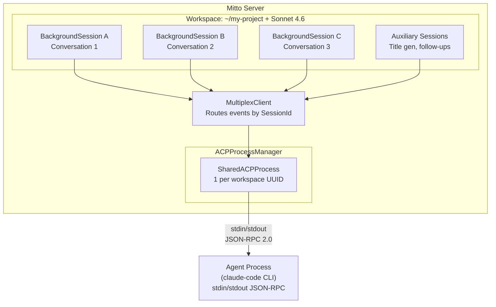
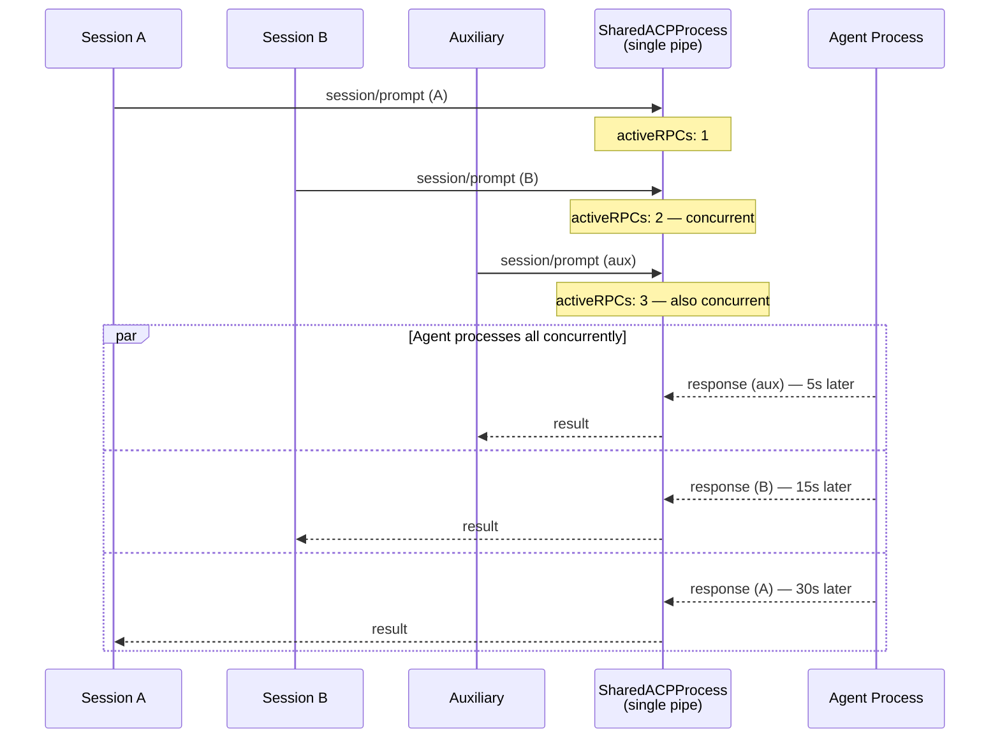
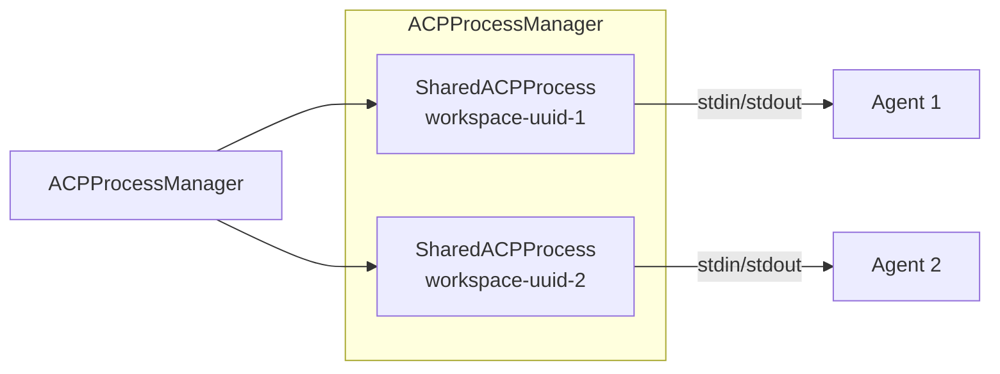
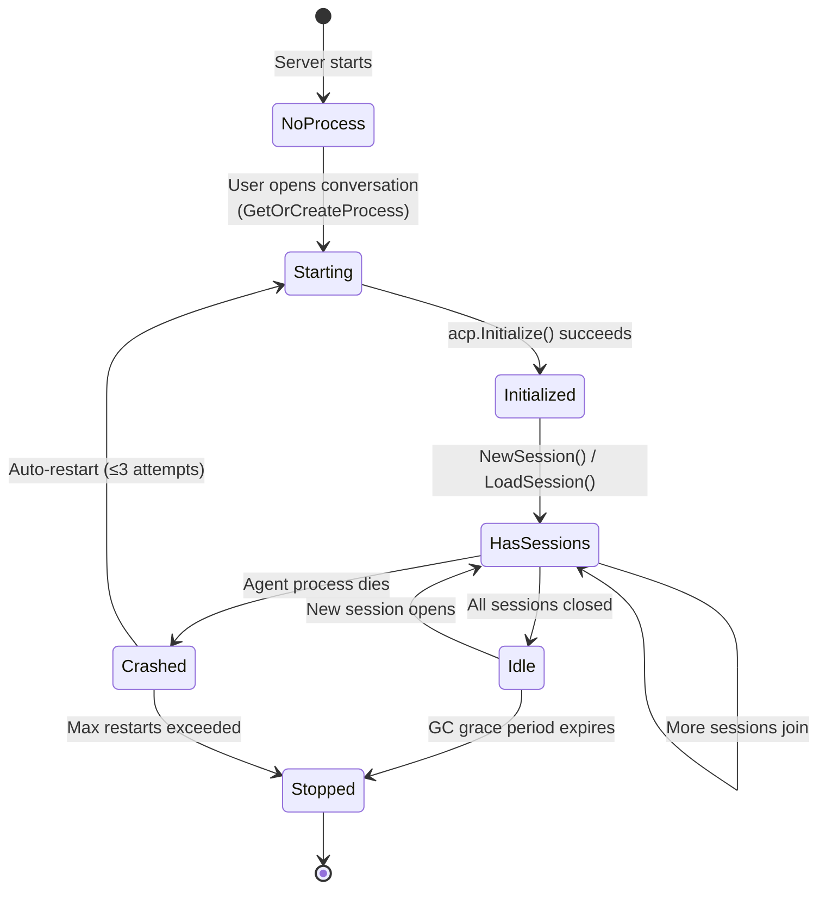

# ACP Architecture

This document covers how Mitto manages ACP (Agent Client Protocol) processes,
sessions, and the multiplexing architecture that enables multiple conversations to
share a single AI agent process.

## Overview

Mitto communicates with AI coding agents (Claude Code, Auggie) via the ACP protocol.
Rather than spawning one agent process per conversation, Mitto uses a **shared process
architecture** where all conversations in the same workspace share a single agent
process.


```mermaid
graph TB
    subgraph "Mitto Server"
        subgraph "Workspace: ~/my-project + Sonnet 4.6"
            BS1[BackgroundSession A<br/>Conversation 1]
            BS2[BackgroundSession B<br/>Conversation 2]
            BS3[BackgroundSession C<br/>Conversation 3]
            AUX[Auxiliary Sessions<br/>Title gen, follow-ups]
        end

        MC[MultiplexClient<br/>Routes events by SessionId]

        subgraph "ACPProcessManager"
            SP["SharedACPProcess<br/>1 per workspace UUID"]
        end
    end

    AGENT["Agent Process<br/>(claude-code CLI)<br/>stdin/stdout JSON-RPC"]

    BS1 --> MC
    BS2 --> MC
    BS3 --> MC
    AUX --> MC
    MC --> SP
    SP -->|"stdin/stdout<br/>JSON-RPC 2.0"| AGENT
```

## Key Concepts

### Workspace UUID

A workspace is the combination of **working directory + ACP server**. Each unique
combination gets a `UUID` (persisted in `~/.../Mitto/workspaces.json`). This UUID
is the key for process sharing:

```
workspace UUID = hash(working_dir + acp_server_name)
                 → maps to one SharedACPProcess
                 → maps to one agent subprocess
```

### Process Sharing

All conversations opened on the same workspace share one `SharedACPProcess`:

```go
// ACPProcessManager
processes map[string]*SharedACPProcess // keyed by workspace UUID
```

### ACP Sessions: Context Isolation and Concurrency

ACP sessions are **separate conversation threads within one agent process**. They
provide **context isolation AND parallelism**. Each session maintains its own
conversation history and working context, and modern ACP agents (Claude Code, Auggie)
can process prompts from different sessions concurrently — because the agent dispatches
work to a remote LLM API and does not block while waiting for responses.

**Why sessions exist:** Without sessions, you'd have two bad options:

1. **One session, all conversations mixed** — The agent can't distinguish which
   conversation a prompt belongs to. Conversation contexts bleed into each other.

2. **One process per conversation** — Each process independently indexes the
   workspace, loads language servers, and builds file caches. 5 conversations on the
   same project = 5× the memory, mostly duplicated work.

Sessions give you option 3:

```
One process: ~500MB RAM — indexes workspace once
  ├─ Session A: "fix login bug" — separate conversation history, runs concurrently
  ├─ Session B: "write README"  — separate conversation history, runs concurrently
  └─ Session C: "add tests"     — separate conversation history, runs concurrently
```

When Mitto sends `session/prompt` with `SessionId: "abc123"`, the agent knows which
conversation context to use. The workspace index, file cache, and language server are
shared across all sessions — only the conversation histories are separate.

**The analogy:** Sessions are like tabs in a web browser. Each tab has its own page
and history (context isolation), tabs can load pages simultaneously because requests
dispatch to remote servers (concurrent processing), and you don't need a separate
browser for each tab (resource sharing). Prompts to the same session are serialized
(like clicking links within the same tab), but prompts across different sessions run
in parallel.

### RPC Concurrency Model

**Modern ACP agents handle multiple sessions concurrently.** The ACP SDK transport
(JSON-RPC over stdin/stdout) supports concurrent in-flight requests (unique IDs,
pending map), and the agent dispatches prompts to a remote LLM API — so it does not
block while waiting for one session's response before processing another.

**What IS concurrent:**

- Prompts to **different sessions** run in parallel (verified empirically: multiple
  conversations respond simultaneously against the same agent process)
- Auxiliary operations (title gen, follow-ups) can run alongside user prompts in
  other sessions

**What IS serialized:**

- Prompts to the **same session** — you can't send two prompts to the same
  conversation simultaneously; the agent must process them in order to maintain
  conversation history consistency
- Wire writes to stdin/stdout — `writeMu` in the SDK serializes the bytes going into
  the pipe, but each request then proceeds independently once sent


```mermaid
sequenceDiagram
    participant A as Session A
    participant B as Session B
    participant AUX as Auxiliary
    participant PIPE as SharedACPProcess<br/>(single pipe)
    participant AGENT as Agent Process

    A->>PIPE: session/prompt (A)
    Note over PIPE: activeRPCs: 1
    B->>PIPE: session/prompt (B)
    Note over PIPE: activeRPCs: 2 — concurrent
    AUX->>PIPE: session/prompt (aux)
    Note over PIPE: activeRPCs: 3 — also concurrent

    par Agent processes all concurrently
        AGENT-->>PIPE: response (aux) — 5s later
        PIPE-->>AUX: result
    and
        AGENT-->>PIPE: response (B) — 15s later
        PIPE-->>B: result
    and
        AGENT-->>PIPE: response (A) — 30s later
        PIPE-->>A: result
    end
```

The `WaitForIdle()` method polls `activeRPCs` (an `atomic.Int32`) before issuing
auxiliary RPCs. With concurrent agent support, this is primarily a **politeness
mechanism** — it avoids piling additional requests on an already-busy agent — rather
than a strict gate preventing concurrent execution:

```go
func (p *SharedACPProcess) WaitForIdle(ctx context.Context) error {
    // Polls activeRPCs every 500ms until 0 or context cancelled
}
```

## Architecture Layers

### Layer 1: ACP SDK (`github.com/coder/acp-go-sdk`)

The SDK provides the JSON-RPC transport:

- `Connection` — wraps stdin/stdout of the agent subprocess
- `SendRequest[T]()` — sends a JSON-RPC request, waits for matching response by ID
- `writeMu` — serializes wire writes (not request lifecycle)
- `pending map[string]*pendingResponse` — tracks in-flight requests by unique ID

**The SDK supports concurrent RPCs.** Multiple goroutines can call `SendRequest`
simultaneously — each gets a unique ID and waits for its own response.

### Layer 2: Mitto ACP Client (`internal/acp/`)

Wraps the SDK with Mitto-specific concerns:

- `connection.go` — `NewConnection()`, process lifecycle management
- `client.go` — Permission handling, file operations
- `command.go` — Agent command construction
- `terminal.go` — Terminal session management for agent tool calls
- `types.go` — Content block helpers (`TextBlock`, `ImageBlock`, etc.)

### Layer 3: Shared Process (`internal/web/shared_acp_process.go`)

Manages the lifecycle of a single agent process shared across sessions:

- Starts the agent subprocess with `acp.NewConnection()`
- Tracks `activeRPCs` for GC safety (avoids killing processes with in-flight RPCs)
- Provides `NewSession()`, `LoadSession()`, `Prompt()` that wrap SDK calls
- Handles auto-restart on agent crashes (up to 3 attempts)

### Layer 4: MultiplexClient (`internal/web/multiplex_client.go`)

Routes agent-initiated callbacks to the correct `BackgroundSession`:

```go
type MultiplexClient struct {
    sessions map[acp.SessionId]*SessionCallbacks
}
```

When the agent sends a notification (e.g., `session/update`, `readTextFile`), the
`MultiplexClient` looks up the `SessionId` and dispatches to the correct callback set.
Each `BackgroundSession` registers its own `SessionCallbacks` when it creates/loads
a session.

### Layer 5: Process Manager (`internal/web/acp_process_manager.go`)

Top-level manager, one per Mitto server:

- `processes map[string]*SharedACPProcess` — keyed by workspace UUID
- `GetOrCreateProcess()` — lazy process creation
- Auxiliary session management (title-gen, follow-ups, prompt improvement)
- GC loop for idle process cleanup


```mermaid
graph LR
    subgraph ACPProcessManager
        P1["SharedACPProcess<br/>workspace-uuid-1"]
        P2["SharedACPProcess<br/>workspace-uuid-2"]
    end
    PM[ACPProcessManager] --> P1
    PM --> P2
    P1 -->|stdin/stdout| A1[Agent 1]
    P2 -->|stdin/stdout| A2[Agent 2]
```

## Connection Lifecycle


```mermaid
stateDiagram-v2
    [*] --> NoProcess: Server starts
    NoProcess --> Starting: User opens conversation<br/>(GetOrCreateProcess)
    Starting --> Initialized: acp.Initialize() succeeds
    Initialized --> HasSessions: NewSession() / LoadSession()
    HasSessions --> HasSessions: More sessions join
    HasSessions --> Idle: All sessions closed
    Idle --> HasSessions: New session opens
    Idle --> Stopped: GC grace period expires
    Stopped --> [*]

    HasSessions --> Crashed: Agent process dies
    Crashed --> Starting: Auto-restart (≤3 attempts)
    Crashed --> Stopped: Max restarts exceeded
```

### Session Lifecycle within a Process

1. **Create/Load** — `BackgroundSession` calls `NewSession(ctx, workingDir)` or
   `LoadSession(ctx, sessionID)` on the shared process
2. **Register callbacks** — Session registers `SessionCallbacks` on `MultiplexClient`
3. **Prompt** — `Prompt(ctx, sessionID, blocks)` sends content to agent
4. **Stream** — Agent sends `session/update` notifications → `MultiplexClient` →
   correct `BackgroundSession` → observers (WebSocket clients)
5. **Close** — Session unregisters from `MultiplexClient`, decrements reference count

### Stderr Pattern Detection (mitto-k6h)

Mitto watches each ACP subprocess's stderr with `StartStderrMonitor`
(`internal/conversation/bgsession_acp_process.go`) to detect crashes and
lifecycle signals sub-second, bypassing the SDK's 60s control-request timeout.
Detection is split into a **hardcoded baseline** (universal, SDK-layer strings)
and a **per-agent** extension declared in each agent's `metadata.yaml`.

**Schema** (`config/agents/builtin/<agent>/metadata.yaml`):

```yaml
stderrPatterns:
  crash: ["FATAL ERROR: .* Allocation failed"] # OR'd with hardcoded baseline
  ignore: ["(?i)DeprecationWarning"] # suppress from debug log
  degraded: ["(?i)rate limit"] # plumbed, behaviour deferred
```

**Action classes**:

- **`crash`** — matches trigger `onCrashDetected()` → close `processDone` →
  immediate GC recycle. The list is **unioned** with `stderrCrashPatterns` (the
  hardcoded baseline: `stream ended unexpectedly`, `broken pipe`,
  `JavaScript heap out of memory`, ...). Either source firing counts.
- **`ignore`** — matches suppress the `agent stderr` debug-level log line for
  that write. The captured stderr buffer (used for error reporting) is
  unaffected. Complements the existing `$/cancel_request` suppression.
- **`degraded`** — compiled and plumbed end-to-end (`CompiledStderrPatterns.Degraded`)
  but **not consumed** in this increment. The follow-up wires these matches
  into the shared-process saturation signal so agent-specific "warning"
  patterns (rate limits, quota chatter) can proactively trip Tier 5/6 recycles.

**Layering** (why compile lives in `internal/conversation`, not `internal/agents`):

- `internal/acpproc` MUST NOT import `internal/agents` (would create a cycle
  through `internal/conversation`).
- `internal/conversation` MUST NOT import `internal/agents` (same reason).
- `internal/web` is the only layer that has both `agents.Manager` and knows
  which ACP server maps to which agent. It compiles the metadata once and
  injects a `*conversation.CompiledStderrPatterns` into `SharedACPProcessConfig`
  and `BackgroundSessionConfig` via a per-server-name resolver.

**Compile semantics**: `regexp.Compile` runs once at process-start. Invalid
regexes are **skipped with a warn log** (never fatal) so a single typo in one
agent's metadata cannot block startup. `make check-stderr-patterns`
(`TestBuiltinAgents_StderrPatternsCompile` in `internal/agents/`) catches
those typos at CI time instead of runtime.

## Content Blocks

The ACP SDK uses a discriminated union (pointer fields) for content blocks:

```go
type ContentBlock struct {
    Text         *ContentBlockText
    Image        *ContentBlockImage
    Audio        *ContentBlockAudio
    ResourceLink *ContentBlockResourceLink
    Resource     *ContentBlockResource
}

// Check type via nil checks — NO Type() method exists
if block.Image != nil { /* image */ }
if block.Text != nil  { /* text */ }
```

### Image Pipeline

```
User uploads image (HTTP POST)
  → Stored on disk (session_dir/images/{uuid}.{ext})
  → WebSocket prompt includes image_ids: ["uuid1", "uuid2"]
  → PromptWithMeta loads from disk, base64 encodes
  → acp.ImageBlock(base64, mimeType)
  → Sent to agent via Prompt()
```

## Auxiliary Sessions

Auxiliary sessions use the **same shared process** for non-critical background work:

| Purpose               | Session          | Trigger                    |
| --------------------- | ---------------- | -------------------------- |
| Title generation      | `title-gen`      | After first agent response |
| Follow-up suggestions | `follow-up`      | After prompt completes     |
| Prompt improvement    | `improve-prompt` | User requests it           |
| MCP tools check       | `mcp-check`      | On process creation        |

Auxiliary sessions are pre-warmed on process creation to avoid cold-start delays.
Auxiliary sessions run concurrently with user sessions — they do not block on or wait for user prompts.

### Concurrency Guard

Follow-up analysis has a `followUpInProgress atomic.Bool` guard to prevent duplicate
analyses when prompt completion and session resume race:

```go
if !bs.followUpInProgress.CompareAndSwap(false, true) {
    return // Another analysis in progress — skip
}
defer bs.followUpInProgress.Store(false)
```

## Concurrency Characteristics and Future Directions

### Current Behavior

Modern ACP agents (Claude Code, Auggie) handle multi-session workloads concurrently.
The shared process architecture allows:

1. **Parallel conversations** — Multiple sessions in the same workspace run their
   prompts simultaneously (verified empirically)
2. **Concurrent auxiliary work** — Title generation and follow-up analysis can
   proceed alongside user prompts in other sessions
3. **Efficient resource sharing** — One process, one workspace index, one language
   server — regardless of how many concurrent sessions are active

The main constraint is that prompts to the **same session** are serialized: the agent
must process them in order to maintain conversation history consistency.

### Possible Improvements

| Approach                       | Description                                 | Trade-off                                                                |
| ------------------------------ | ------------------------------------------- | ------------------------------------------------------------------------ |
| **Separate auxiliary process** | Dedicated process for title-gen, follow-ups | ✅ Resource/crash isolation. ❌ 2× memory per workspace                  |
| **Process pool**               | N processes per workspace, route by session | ✅ Crash isolation per group. ❌ N× resources, more complexity           |
| **Per-conversation process**   | Revert to 1:1 (legacy mode)                 | ✅ Full crash isolation. ❌ Much more memory, duplicated workspace index |

These improvements are less critical given the agent's built-in concurrency support.
They may still be worthwhile for **resource isolation** (an aux crash won't kill user
sessions) or **memory tuning** (limit per-process footprint). The current shared
process approach is a good default.

## Process Garbage Collection

When Mitto starts, any interaction with a workspace triggers creation of a shared ACP
process. Without cleanup, these processes live until server exit, wasting resources.

### Problem

1. **Queue processing** — `ProcessPendingQueues()` starts a process that stays alive
   after the queue is drained
2. **Loop prompts** — `LoopRunner` starts a process for delivery, never stops it
3. **Brief UI visits** — Opening a conversation starts a process permanently
4. **Auxiliary pre-warming** — 4 auxiliary sessions are eagerly spawned on process creation

### Solution: Multi-Tier Loop Garbage Collection

Instead of reference counting (error-prone, requires wiring into every lifecycle path),
use a loop GC loop that is self-healing: even if something goes wrong, the next
cycle cleans up. `RunGCOnce()` executes the tiers below in order each cycle.

> The tier numbers reflect the order they were added, not their execution order. The
> actual run order in `RunGCOnce()` is: **Tier 1 → Tier 2 → Tier 4 → Tier 5 → Tier 6 → Tier 3**.

### Tier 1 — Idle Session Cleanup

A session is considered **idle** when ALL of the following are true:

- Zero WebSocket observers (`!bs.HasObservers()`)
- Not currently prompting (`!bs.IsPrompting()`)
- Queue is empty (no pending messages)
- No loop prompt due within the next GC interval
- Not closed (not already cleaned up)

When a session is idle, the GC calls `CloseSession()`, which:

- Removes it from `SessionManager.sessions`
- Calls `bs.Close()` (unregisters from shared process, stops recorder)

**Important**: Sessions with active loop prompts should NOT be closed if their
next scheduled delivery is within 2× the GC interval. This avoids the overhead of
repeatedly closing and re-creating sessions that will be needed again shortly.

#### Loop Suspend (within Tier 1)

Tier 1 also **suspends idle loop conversations** to save memory. A loop
session whose next prompt is farther away than `LoopSuspendThreshold` is eligible
for suspension **even if it has active WebSocket observers** (i.e. the user has it open
in the sidebar). When suspended, its ACP connection is closed but the session is **not
archived** — it stays visible and resumes transparently via `ensure_resumed` (on user
focus) or the `LoopRunner` (when the prompt is due). A generous
`LoopSuspendGracePeriod` protects sessions that recently finished a turn from being
suspended too aggressively (using the most recent of `LastResponseCompleteAt` and
`LastActivityAt`). Before closing, the session is marked `MarkGCSuspended` so the
WebSocket auto-resume handler skips it and avoids a suspend/resume thrash loop.

Defaults: `LoopSuspendThreshold` = 30m (configurable; 0/negative disables),
`LoopSuspendGracePeriod` = 10m.

### Tier 2 — Idle Process Cleanup

After tier 1 runs, check each shared process in `ACPProcessManager.processes`:

- Query `SessionManager`: are there any running sessions for this workspace UUID?
- If **no sessions** AND the process has been sessionless for longer than
  `gracePeriod` → call `StopProcess(workspaceUUID)`

The grace period (default: 60 seconds) prevents process thrashing when quickly
switching between conversations. A `lastSessionSeen` timestamp per workspace
tracks when sessions were last present. If the process has **in-flight RPCs**
(`p.ActiveRPCs() > 0`, e.g. a slow `LoadSession`/`NewSession`), the stop is deferred
and the grace clock reset, since killing the pipe mid-RPC hard-fails the affected
sessions.

### Tier 4 — Memory-Bloat Recycling

Runs after Tier 2 (re-querying sessions so newly closed ones are excluded). This tier
addresses agent processes that grow unbounded over a long lifetime (the root cause of
the original "stuck conversation" incident, where a shared agent had bloated to ~5.9 GB
RSS and was thrashing). It is **opt-in and disabled by default** — it does nothing
unless `MemoryRecycleThreshold > 0`.

For each shared process, the tier captures one system PID/PPID topology snapshot,
then derives parent RSS, descendant RSS/count, and aggregate physical footprint
for that tree. The recycle metric is the greater of aggregate RSS and physical
footprint, so compressed macOS memory remains visible without repeating expensive
recursive process enumeration (`internal/acpproc/acp_process_memory.go`). A process
is recycled **only when it is fully idle** — all of the following must hold:

- `p.ActiveRPCs() == 0` (no in-flight RPCs)
- No session is `IsPrompting`
- All sessions have empty queues (`QueueLength == 0`)
- No session has a loop prompt due within 2× the GC interval

When a bloated process passes every safety gate, each of its sessions is marked
`MarkGCSuspended` (to prevent the WebSocket reconnect/resume thrash loop), closed via
`sessionClose`, and the now-sessionless process is stopped with `StopProcess`. Affected
conversations **resume transparently** on next focus via `LoadSession` history replay,
making the recycle invisible to the user. The recycle is logged at `Info` with
effective memory, parent/descendant RSS, descendant count, sample duration, and
the threshold; every skip reason is logged at `Debug`.

After a recycle, the GC invokes the `onMemoryRecycled` callback (wired in `server.go`),
which resolves a friendly workspace name and calls `Server.BroadcastMemoryRecycled`. That
broadcasts a `memory_recycled` event on the `/api/events` channel to all connected clients;
the frontend (`useWebSocket.js` → `mitto:memory_recycled` → `app.js`) surfaces an **info
toast** noting the workspace, the RSS vs. threshold (in MB), and the number of conversations
that will resume automatically. The payload carries `workspace_uuid`, `workspace_name`,
`working_dir`, `rss_bytes`, `threshold_bytes`, and `session_count`.

This reuses the exact idle-safety and anti-thrash machinery already proven in Tier 1's
loop-suspend path. The threshold is configurable per the
[Configuration](#configuration) section below.

### Tier 5 — Degraded-Idle Process Recycling (mitto-tfb)

Runs after Tier 4 (re-querying sessions). The saturation infrastructure in
`internal/acpproc/shared_acp_process.go` (`sessionSaturationTimeoutThreshold`,
`saturatedUntil`, `saturationLevel`) only fails new requests fast once a shared
process is flagged saturated — it never _heals_ the degraded process. Left alone, a
saturated-but-idle process keeps failing every subsequent `NewSession`/`LoadSession`
until its cooldown finally elapses.

Tier 5 proactively recycles a process once `SharedACPProcess.IsSaturated()` is true
**and** the process is fully idle — the exact same hard safety gates as Tier 4
(`ActiveRPCs() == 0`, no session `IsPrompting`, all queues empty, no loop prompt due
within 2× the GC interval). When those gates pass, each session is marked
`MarkGCSuspended`, closed, and the process is stopped via `StopProcess`; the next
`NewSession` lazily builds a fresh process with zeroed saturation state.

#### Saturation triggers feeding Tier 5 / Tier 6

Three independent triggers can set `saturatedUntil` / `saturationLevel`; all are
picked up by `IsSaturated()` and `IsConfirmedDegraded()` identically, so no changes
in `acp_process_gc.go` are required beyond reading those getters.

1. **Consecutive-timeout fast path** (mitto-13ck.2, unchanged): after
   `sessionSaturationTimeoutThreshold` (3) _back-to-back_ full-deadline
   `NewSession`/`LoadSession` RPCs the process is flagged. This catches the
   fully-wedged case where every RPC runs to its deadline.

2. **Rate / rolling-window trigger** (mitto-5eq): a bucketed sliding window
   (`saturationWindowDuration` = 5 min, `saturationWindowBucketCount` = 10 → 30 s
   buckets) counts full-deadline timeouts, `shouldFailFastCreateAttempt`
   budget-exhaustion bails, and successful control-plane RPCs. When the window
   holds at least `saturationWindowMinSamples` (8) samples AND
   `(timeouts + bails) / total ≥ saturationWindowFailRatio` (0.5), the process is
   promoted to saturated via the same `saturationLevel++` /
   `saturatedUntil = now + cooldown` path as the consecutive trigger.

   This closes two gaps the consecutive-only design left open:
   - **Interspersed success reset**: a degraded process that still serves _some_
     traffic never accumulates 3 timeouts in a row — every interspersed success
     zeroes `consecutiveRPCTimeouts`. The rolling window is NOT wiped by a
     success; a success only adds a sample so the ratio drops naturally as
     health returns. Concrete effect: an incident with 38 context-deadlines,
     ~2000 interspersed successful ACP events, and ~10 min of aux-session
     starvation produced zero Tier 5/6 recycles before the rate trigger.
   - **Budget-exhaustion bails don't count**: the dominant real failure mode is
     `session/new: insufficient remaining budget ... failing fast` via
     `shouldFailFastCreateAttempt`. Those bails intentionally skip
     `recordRPCTimeout` (nothing was actually attempted), so they never
     contributed to saturation. The rate trigger's new `recordRPCBudgetBail`
     records them into the window only — it does NOT touch
     `consecutiveRPCTimeouts`, preserving the consecutive fast path unchanged.

   Both triggers share `saturationMu` — no second lock is introduced. The window
   is bounded (fixed-size ring buffer, no unbounded growth) and cost is O(1) per
   record + O(bucketCount) per evaluate. Cold-start MCP-init timeouts and bails
   are excluded from the window on the same rationale as the consecutive path
   (`extendedBudget == true` → skipped).

3. **Agent "query closed" wedge** (mitto-aoo): the agent answers `session/new` /
   `session/load` with JSON-RPC `-32603` whose data carries _"Query closed before
   response received"_, in **1-10 ms** — not a deadline. It is the agent's own
   report that its query loop is torn down and will never complete another
   `session/new`, so `recordRPCWedgeFailure()` feeds the _same_ consecutive-failure
   fast path as trigger 1 (`recordRPCFailureLocked`), rather than the softer
   rolling window only.

   Unlike triggers 1 and 2, this signature is **not** gated on `extendedBudget`: a
   1-10 ms reply cannot be cold-start MCP latency. The wedge is also classified as
   retryable in `isRetryableCreateError`, so the bounded `sessionCreateMaxAttempts`
   (3) loop records three consecutive samples within a _single_ `NewSession` call
   and trips saturation immediately, instead of waiting for three separate caller
   attempts. Before this trigger, the signature fed zero saturation samples: one
   incident produced 38 consecutive `session/new` failures over 9 h with no
   liveness detection and no recycle.

#### Companion aux-creation fast-shed (mitto-pic) — NOT a saturation trigger

Separate from the three triggers above, an **agent-internal-deadline fast-shed**
gates _non-essential auxiliary_ `session/new` creation the moment the shared
process wedges on the agent's **own** internal deadline (the `-32603`
`agent_internal_deadline=true` flavor, `isAgentInternalDeadlineErr`). It arms
after a **single** such timeout via `recordAgentInternalDeadline()` (stamping
`lastAgentInternalDeadlineAt`, guarded by the existing `saturationMu`), and
`getOrCreateAuxiliarySession` sheds subsequent non-essential purposes with the
existing `ErrProcessBusy` sentinel while `RecentlyHitAgentInternalDeadline()` is
true (within `auxAgentDeadlineShedCooldown` = 30 s). `improve-prompt` (a human
actively waiting) is exempt via `isProactiveBailPurpose`.

This is deliberately **not** a fourth saturation trigger: it does **not** touch
`saturatedUntil` / `saturationLevel` / `consecutiveRPCTimeouts`, so it never by
itself promotes the process to `IsSaturated()` / `IsConfirmedDegraded()` or feeds
Tier 5/6 recycle. It closes the gap the three triggers leave open on the **first**
agent-internal-deadline timeout — where trigger 1 still needs 3 consecutive
failures, trigger 2 needs an 8-sample window, and an interspersed success can keep
either from ever arming — so a quiescent-looking process stops burning a full ~60 s
per non-essential aux create. Reusing `ErrProcessBusy` (rather than a new sentinel)
means prompt-mode processor dispatch reschedules through the existing bounded
busy-wait spool/retry path, so starved processors (e.g. `identify-user-data`) are
not silently lost. `recordRPCSuccess()` clears the marker early on any genuine
recovery.

### Tier 6 — Non-Idle Recycle for Confirmed-Degraded Processes (mitto-1h0)

Tier 5 is **idle-gated**: it skips a process with in-flight RPCs or a prompting
session. That is exactly backwards for a **wedged** process, where a
timing-out `NewSession`/`SetSessionModel` RPC itself is the in-flight "activity"
Tier 5 reads as busy — the process can stay wedged for minutes, starving both the
user session and auxiliary sessions (title-gen, follow-up, MCP-check).

Tier 6 escalates for a **confirmed-degraded** process — one where
`SharedACPProcess.IsConfirmedDegraded()` is true, i.e. `saturationLevel >=
confirmedDegradedLevel` (2). Reaching level 2 means the process tripped saturation,
served its cooldown, ran a single-attempt probe (`inProbe`), and that probe **also**
timed out — demonstrable proof it is not self-healing.

For a confirmed-degraded process, Tier 6:

- **Drops the `ActiveRPCs() > 0` / `IsPrompting` gate** — those in-flight, timing-out
  control RPCs are the wedge itself, not legitimate work.
- **Keeps a mandatory no-streamed-progress guard**: if any session has streamed
  agent activity (`SessionInfo.LastStreamActivityAt`, mirroring
  `BackgroundSession.lastStreamActivityAt`) within a short quiet window
  (`tier6StreamedProgressQuietWindow`, 10s — mirrors the `conversation` package's
  `agentWorkingHeartbeatQuietThreshold`), the process is skipped: that session is
  legitimately slow but **progressing**, not wedged. This is the hard constraint from
  the parent epic (mitto-8ul) — never kill a healthy but slow tool call.
- Keeps the just-resumed grace skip (`ResumedAt` within the GC interval) and the
  loop-due-soon skip, matching Tier 5's conservative semantics for those cases.

When a process passes all gates, its sessions are `MarkGCSuspended` + closed and the
process is stopped exactly as in Tier 5, logged at `Info` as "GC: recycling
confirmed-degraded busy shared ACP process". A level-1 (first-trip, non-probed)
saturated busy process is **not** recycled by Tier 6 — only Tier 5's idle path
governs it until it escalates to level 2.

#### Health-recycle notification (mitto-aoo)

Both Tier 5 and Tier 6 invoke the `onHealthRecycled` callback after `StopProcess`
(wired in `server.go` via `SetOnHealthRecycled`, mirroring Tier 4's
`onMemoryRecycled`). It resolves a friendly workspace name and calls
`Server.BroadcastHealthRecycled`, which broadcasts an `agent_recycled` event
(`WSMsgTypeHealthRecycled`) on `/api/events`. The frontend (`useWebSocket.js` →
`mitto:agent_recycled` → `useBackgroundNotifications.js`) surfaces a **warning
toast** naming the workspace and the number of conversations that will resume
automatically. Payload: `workspace_uuid`, `workspace_name`, `working_dir`,
`reason` (`"saturated_idle"` for Tier 5, `"confirmed_degraded"` for Tier 6),
`saturation_level`, `session_count`.

Without this, a wedged process recycled silently and the user was left reading a
misleading agent-side error.

#### Pre-recycle degraded-state notification (mitto-13n.3)

`onHealthRecycled` only fires once a degraded process is _actually recycled_, and
Tier 5's idle safety gates can hold that off indefinitely — a saturated process
that keeps receiving traffic stays degraded and invisible for hours. Tier 5
therefore also reports the degraded state itself, before those gates.

`processDegradedState(p, now)` (`acp_process_degraded.go`) is the shared
predicate Tier 5 uses both to decide recycle eligibility and to report state, so
the two can never diverge. It returns `"process_saturated"` (`IsSaturated()`),
`"mcp_init_gated"` (`MCPInitTimedOut()`), `"mcp_init_wedged"` (handshake started
but incomplete for more than 2x `MCPInitTimeout`), or `""` when healthy. It
deliberately **excludes** `ActiveRPCs()`-based load shedding (`process_busy`): a
busy-but-healthy process is momentarily loaded, not stuck, and must not alarm.

`updateDegradedState(workspaceUUID, reason)` runs every GC tick for every live
process and invokes the `onDegraded` callback (wired in `server.go` via
`SetOnDegraded`) **only on a transition edge** — first entry into a degraded
reason, a change of reason, or the return to healthy — so steady-state ticks are
silent. It calls `Server.BroadcastAgentDegraded`, which emits an `agent_degraded`
event (`WSMsgTypeAgentDegraded`) on `/api/events`; the frontend
(`useWebSocket.js` → `mitto:agent_degraded` → `useBackgroundNotifications.js`)
shows a warning toast on the degraded edge and an info toast on recovery.
Payload: `workspace_uuid`, `workspace_name`, `working_dir`, `state`, `degraded`.

**Anti-double-toast**: `StopProcess` calls `dropDegradedStateSilently`, removing
the tracked entry without firing the recovery edge. This is the single choke
point for every stop path (Tier 1 idle timeout, Tier 4 memory recycle, Tier 5/6
health recycle, manual stops) — so the entry can never leak into a later process
for the same workspace UUID, and a recycle that already broadcasts
`memory_recycled` / `agent_recycled` does not additionally emit a recovery
`agent_degraded`.

### Tier 3 — Auxiliary Session Cleanup

Cleans up auxiliary sessions (title-gen, follow-ups, prompt improvement) idle longer
than `AuxIdleTimeout` (default 10m) via `CleanupStaleAuxiliarySessions`. Cleaned-up
sessions are lazily re-created on next use.

### Avoiding Unnecessary Process Creation

#### `ProcessPendingQueues()` — Already Safe

`ProcessPendingQueues()` already checks `queue.Len()` **before** calling
`ResumeSession()` (line ~1890 in `session_manager.go`):

```go
queue := store.Queue(meta.SessionID)
queueLen, err := queue.Len()
if err != nil || queueLen == 0 {
    continue  // Skip — no queued messages
}
```

So it does NOT start a process for sessions with empty queues. The problem is that
after the queue is processed, the session (and its process) remain alive. The GC
fixes this.

#### `LoopRunner` — Already Safe

`LoopRunner.checkSession()` only calls `ResumeSession()` when a loop prompt
is actually due (line ~329 in `loop_runner.go`). It correctly skips archived
sessions and sessions that aren't due yet. Again, the problem is cleanup after
delivery — which the GC handles.

#### Auxiliary Pre-warming — Deferred

Currently, `GetOrCreateProcess()` eagerly pre-warms 4 auxiliary sessions. With the
GC in place, this should be **deferred**: pre-warm only when the process is created
for an actual user conversation, not for transient queue/loop work.

Change `GetOrCreateProcess()` to accept a `prewarm bool` parameter:

- `true` when called from `CreateSession`/`ResumeSession` for user conversations
- `false` when called from `ProcessPendingQueues` or `LoopRunner` paths

Alternatively, keep pre-warming always-on and let the GC clean up the process
shortly after — simpler but wastes ~5 seconds of Claude startup for no reason.

## Implementation Details

> The multi-tier GC described above is implemented in `internal/web/acp_process_gc.go`.

The implementation follows the design described above. See `internal/web/acp_process_gc.go` for the GC loop, `GCConfig`, `SessionQueryFunc`, and `SessionInfo` types, and `internal/web/acp_process_gc_test.go` for unit and integration tests.

## Edge Cases

### Session closed during active auxiliary prompt

Auxiliary prompts (title-gen, follow-up) run asynchronously. If the GC closes a
session while an aux prompt is in-flight, the aux prompt will fail with "no shared
process" on the next attempt. This is acceptable — the failure is logged and the
aux result is simply lost (title generation, follow-up suggestions are non-critical).

### Process stopped while LoopRunner is about to deliver

If the GC stops a process and the LoopRunner immediately tries to deliver,
`ResumeSession()` will call `GetOrCreateProcess()` and restart the process. This is
the correct behavior — the process is started on demand.

### Rapid open/close of conversations

The 60-second grace period prevents the process from being stopped and immediately
restarted. The user can open and close several conversations within 60 seconds
without triggering process restarts.

### Multiple workspaces

Each workspace has its own independent GC tracking. Closing all sessions in
workspace A does not affect workspace B's process.

### Server shutdown

`StopGC()` is called during shutdown. The existing `CloseAll()` → `pm.Close()`
path handles killing all processes. The GC does not interfere.

## Testing Strategy

1. **Unit test for GC algorithm**: Create mock `SessionQueryFunc` returning various
   states. Verify that `RunGCOnce()` correctly identifies idle sessions and idle
   processes.

2. **Grace period test**: Verify that a process is NOT stopped within the grace
   period, and IS stopped after it expires.

3. **Integration test**: Start a session, close it, wait for GC, verify the shared
   process is stopped.

4. **Loop session preservation**: Verify that sessions with upcoming loop
   prompts are NOT closed by the GC.

## Configuration

Most GC intervals (`Interval`, `GracePeriod`, `IdleTimeout`, etc.) use hardcoded
defaults from `defaultGCConfig()`. Two user-facing knobs are exposed via settings
(`internal/config/settings.go`, `SessionConfig`) and the Settings dialog under
**Conversations**:

| Setting (JSON key)         | Valid values                               | Default                  | Effect                                                                |
| -------------------------- | ------------------------------------------ | ------------------------ | --------------------------------------------------------------------- |
| `loop_suspend_timeout`     | `""`, `disabled`, `15m`, `30m`, `1h`, `2h` | `""` → 30m               | Tier 1 loop-suspend threshold. `disabled` turns the heuristic off.    |
| `memory_recycle_threshold` | `""`, `disabled`, `3g`, `4g`, `6g`, `8g`   | `""` → disabled (opt-in) | Tier 4 RSS threshold above which an idle bloated process is recycled. |

Parsing lives in `ParseLoopSuspendTimeout()` and `ParseMemoryRecycleThreshold()`
(both return `(value, enabled)`). At startup, `server.go` reads these into `GCConfig`
when calling `StartGC`. Both can also be updated live on the running GC without a
restart via `UpdateLoopSuspendThreshold()` and `UpdateMemoryRecycleThreshold()`
(wired from `config_handlers.go` when settings change). A threshold of `0` disables the
corresponding tier.

## Prompt Inactivity Watchdog

The GC tiers handle processes that are dead, sessionless, or bloated. A separate
mechanism handles the case where an agent is **alive with an open connection but stops
streaming any updates** during a prompt — the "stuck, still responding" state the user
sees in the UI (e.g. wedged during MCP init, or GC-thrashing under memory pressure).
The process-death and connection-EOF monitors do not catch this because the process is
still running and the pipe is still open.

`BackgroundSession.startPromptInactivityWatchdog()` (in `background_session.go`) launches
a per-prompt goroutine that watches `lastAgentActivityAt`, a timestamp bumped by
`signalAgentActivity()` on **every** streamed ACP `SessionUpdate`. On each tick it:

- Returns when the prompt context is done (prompt completed or cancelled elsewhere).
- **Pauses** (resets the idle baseline) while a UI prompt is active — permission dialogs
  and MCP tool questions legitimately block the agent on user input.
- Emits a **WARN** log once idle time crosses `promptInactivityWatchdogWarnDelay`.
- Cancels the in-flight prompt once idle time crosses `promptInactivityWatchdogTimeout`
  (unblocking the RPC so `is_prompting` clears and the session recovers).

**Defaults:** `promptInactivityWatchdogWarnDelay = 2m` (package var, WARN-only, not
configurable). The cancellation timeout is exposed via settings as
`agent_inactivity_timeout` (`SessionConfig`), defaulting to **10m enabled** — unlike
`memory_recycle_threshold`, this feature is opt-out rather than opt-in, since a wedged
prompt otherwise deadlocks GC recycling of the process (mitto-54y). A timeout of `0`
(`"disabled"`) turns off automatic cancellation entirely (WARN-only). This avoids ever
cancelling a legitimate long-running tool call that produces no intermediate streamed
output (e.g. a multi-minute build) — the watchdog already pauses its idle clock while a
tool call or UI prompt is in flight, so a live-but-busy agent is never cancelled.

| Setting (JSON key)         | Valid values                                | Default    | Effect                                                                                 |
| -------------------------- | ------------------------------------------- | ---------- | -------------------------------------------------------------------------------------- |
| `agent_inactivity_timeout` | `""`, `disabled`, `5m`, `10m`, `15m`, `30m` | `""` → 10m | Cancels a prompt with zero streamed activity after this long, clearing `is_prompting`. |

Parsing lives in `ParseAgentInactivityTimeout()` (returns `(value, enabled)`). The
runtime timeout is stored in `conversation.promptInactivityWatchdogTimeoutNanos` (an
`atomic.Int64`, race-safe against concurrent watchdog goroutines) and set via the
exported `conversation.SetPromptInactivityTimeout()`. `server.go` applies it at startup;
`config_handlers.go` re-applies it live when settings change, mirroring the GC threshold
wiring above.

When the timeout fires, the prompt error path treats it as a **recoverable** error: it
emits an `OnError` to the user and skips the auto-restart / queue-advance logic, so the
session simply returns to idle rather than churning the process.

## Impact Summary

| Component                  | Change                                                                                                                                                        |
| -------------------------- | ------------------------------------------------------------------------------------------------------------------------------------------------------------- |
| `ACPProcessManager`        | GC loop, `lastSessionSeen` tracking, `StartGC`/`StopGC`/`RunGCOnce`; Tier 4 memory recycle + live `UpdateMemoryRecycleThreshold`/`UpdateLoopSuspendThreshold` |
| `acp_process_memory.go`    | New — cross-platform process-tree RSS sampling via `gopsutil/v4`                                                                                              |
| `SharedACPProcess`         | New `RSSBytes()` (process-tree RSS for the recycle tier)                                                                                                      |
| `BackgroundSession`        | Prompt inactivity watchdog (`startPromptInactivityWatchdog`, `signalAgentActivity`, `lastAgentActivityAt`)                                                    |
| `SessionManager`           | `GetSessionInfoByWorkspace()` method                                                                                                                          |
| `server.go`                | Wire up GC start/stop; read `loop_suspend_timeout` + `memory_recycle_threshold` into `GCConfig`                                                               |
| `config_handlers.go`       | Live-update GC thresholds when settings change                                                                                                                |
| `SettingsDialog.js`        | UI controls for Suspend Settings + Memory recycling                                                                                                           |
| Existing session lifecycle | **No changes** — GC and watchdog are purely additive                                                                                                          |
| Tests                      | New unit tests for GC tiers, RSS parsing, and the watchdog                                                                                                    |
