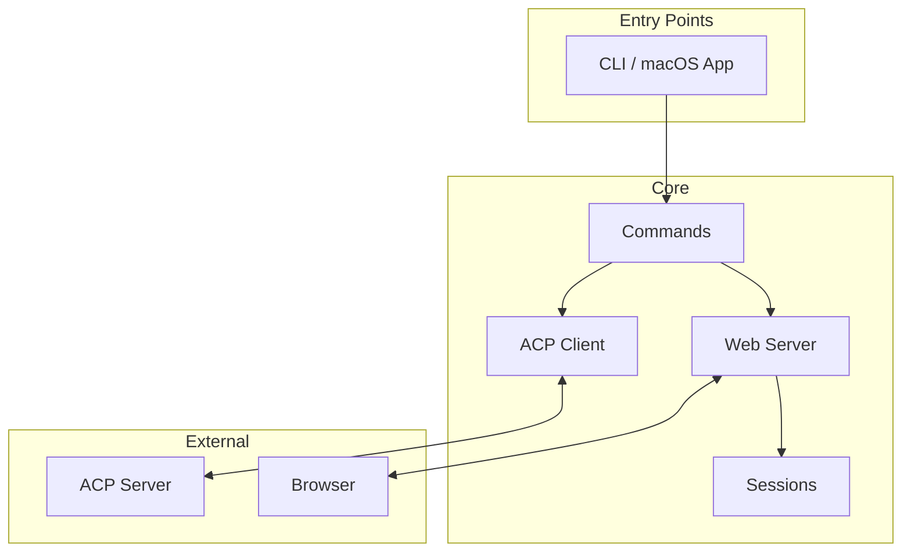
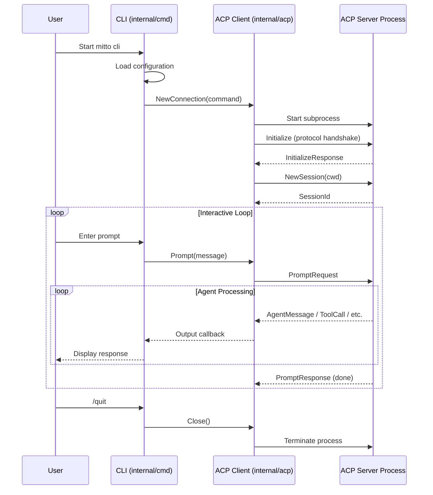
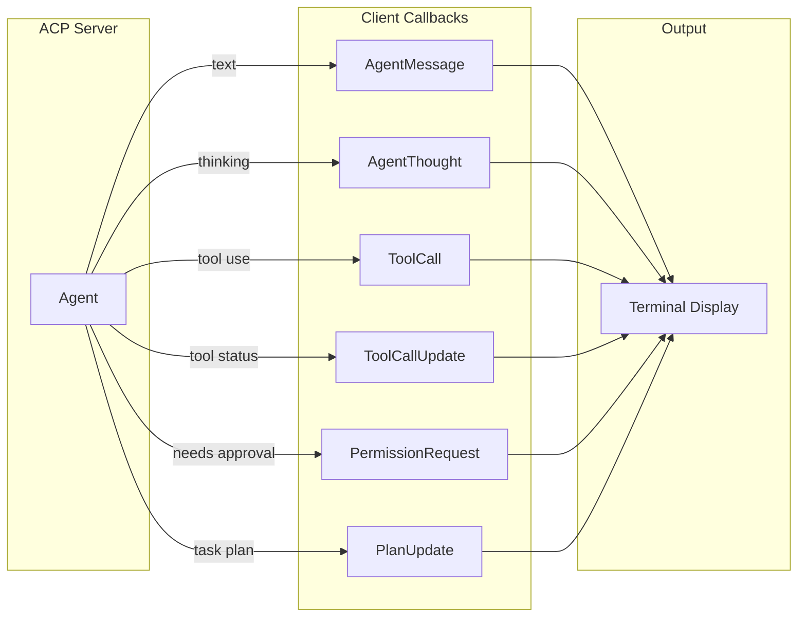

# Mitto Architecture

## Project Overview

Mitto is a command-line interface (CLI) client for the [Agent Communication Protocol (ACP)](https://agentcommunicationprotocol.dev/). It enables users to interact with AI coding agents such as Auggie, Claude Code, and other ACP-compatible servers through a terminal-based interface.

The project is written in Go and follows idiomatic Go project structure with clear separation of concerns between packages.

## High-Level Architecture



## Component Breakdown

### `internal/cmd` - CLI Commands

Implements the command-line interface using [Cobra](https://github.com/spf13/cobra).

**Key Responsibilities:**
- Parse command-line arguments and flags
- Load configuration via `internal/config`
- Create and manage ACP connections
- Handle user input via readline
- Process slash commands (`/quit`, `/help`, `/cancel`)

### `internal/appdir` - Platform-Native Directory Management

Manages the Mitto data directory, which stores configuration and session data.

**Directory Locations (in priority order):**
1. `MITTO_DIR` environment variable (if set)
2. Platform-specific default:
   - **macOS**: `~/Library/Application Support/Mitto`
   - **Linux**: `$XDG_DATA_HOME/mitto` or `~/.local/share/mitto`
   - **Windows**: `%APPDATA%\Mitto`

**Key Functions:**
- `Dir()` - Returns the Mitto data directory path
- `EnsureDir()` - Creates the directory structure if needed
- `SettingsPath()` - Returns path to `settings.json`
- `SessionsDir()` - Returns path to `sessions/` subdirectory

### `internal/config` - Configuration Management

Handles loading, parsing, and persisting Mitto configuration.

**Configuration System:**
- **Default config**: `config/config.default.yaml` (embedded in binary)
- **User settings**: `MITTO_DIR/settings.json` (auto-created from defaults)
- **Override**: `--config` flag accepts YAML or JSON files

**Configuration Formats:**

YAML format (for `--config` flag):
```yaml
acp:
  - auggie:
      command: auggie --acp
  - claude-code:
      command: npx -y @zed-industries/claude-code-acp@latest
web:
  host: 127.0.0.1
  port: 8080
```

JSON format (for `settings.json` or `--config` flag):
```json
{
  "acp_servers": [
    {"name": "auggie", "command": "auggie --acp"},
    {"name": "claude-code", "command": "npx -y @zed-industries/claude-code-acp@latest"}
  ],
  "web": {"host": "127.0.0.1", "port": 8080}
}
```

### `internal/acp` - ACP Client Implementation

Implements the ACP client protocol for communicating with AI agents.

**Key Components:**

- **Connection**: Manages the ACP server subprocess, stdin/stdout pipes, and protocol initialization
- **Client**: Implements the `acp.Client` interface from `acp-go-sdk`, handling:
  - Agent messages and thoughts
  - Tool calls and updates
  - Permission requests
  - File read/write operations
  - Plan updates

### `internal/session` - Session Recording & Playback

Provides session persistence for recording, storing, and replaying ACP interactions.

**Key Components:**

- **Store**: Thread-safe file operations for session persistence
- **Recorder**: Records events during an active session
- **Player**: Loads and navigates through recorded sessions
- **Queue**: Thread-safe FIFO message queue with atomic file persistence

See [Session Management](session-management.md) for detailed documentation.

### `internal/web` - Web Interface Server

Provides a browser-based UI for ACP communication via HTTP and WebSocket.


## Design Decisions

### 1. Separation of Store, Recorder, and Player

The session package uses three distinct components following the Single Responsibility Principle:

| Component | Responsibility |
|-----------|---------------|
| **Store** | Low-level file I/O, thread safety, CRUD operations |
| **Recorder** | High-level recording API, session lifecycle management |
| **Player** | Read-only playback, navigation, filtering |

This separation allows:
- Independent testing of each component
- Different access patterns (write-heavy recording vs. read-heavy playback)
- Future extensibility (e.g., different storage backends)

### 2. File-Based Session Storage Format

Sessions are stored using a hybrid format:

- **`events.jsonl`**: JSONL (JSON Lines) for the event log
  - Append-only writes (no file rewriting)
  - Crash-resistant (partial writes don't corrupt existing data)
  - Streamable for large sessions

- **`metadata.json`**: Standard JSON for session metadata
  - Human-readable
  - Quick access to session info without parsing events
  - Updated on each event (small file, acceptable overhead)

### 3. Timestamp-Based Session IDs

Session IDs use the format `YYYYMMDD-HHMMSS-XXXXXXXX` (timestamp + random hex):

```
20260125-143052-a1b2c3d4
```

**Rationale:**
- Human-readable and sortable by creation time
- No external UUID dependency
- Sufficient uniqueness for single-user CLI tool
- Easy to identify sessions by date

### 4. ACP Client Separation from CLI

The `internal/acp` package is independent of the CLI presentation layer:

- **`acp.Client`** receives an `output` callback function
- CLI provides its own output function (`fmt.Print`)
- Future web interface can provide different output handling
- Enables testing without terminal dependencies

### 5. Configuration File Strategy

Configuration uses a two-tier system with platform-native directories:

- **Data directory**: Platform-native location (`~/Library/Application Support/Mitto` on macOS)
- **Environment override**: `MITTO_DIR` overrides the data directory location
- **Auto-bootstrap**: `settings.json` auto-created from embedded defaults on first run
- **Dual format support**: `--config` flag accepts both YAML and JSON files
- **JSON for persistence**: User settings stored as JSON for easy programmatic editing
- **Ordered list**: First ACP server is default (explicit, predictable)

## Data Flow

### User Interaction Sequence



### ACP Message Handling

The `Client` struct in `internal/acp/client.go` implements callbacks for various ACP events:



## File Structure

### Mitto Data Directory

**Platform-specific locations:**
- **macOS**: `~/Library/Application Support/Mitto/`
- **Linux**: `~/.local/share/mitto/`
- **Windows**: `%APPDATA%\Mitto\`
- **Override**: Set `MITTO_DIR` environment variable

### File Formats

**metadata.json:**
```json
{
  "session_id": "20260125-143052-a1b2c3d4",
  "acp_server": "auggie",
  "working_dir": "/home/user/project",
  "created_at": "2026-01-25T14:30:52Z",
  "updated_at": "2026-01-25T14:35:00Z",
  "event_count": 42,
  "status": "completed"
}
```

**events.jsonl:**
```jsonl
{"type":"session_start","timestamp":"2026-01-25T14:30:52Z","data":{"session_id":"...","acp_server":"auggie","working_dir":"/home/user/project"}}
{"type":"user_prompt","timestamp":"2026-01-25T14:30:55Z","data":{"message":"Hello, can you help me?"}}
{"type":"agent_message","timestamp":"2026-01-25T14:30:57Z","data":{"text":"Of course! What do you need help with?"}}
{"type":"session_end","timestamp":"2026-01-25T14:35:00Z","data":{"reason":"user_quit"}}
```

## Dependencies

### Core Dependencies

| Package | Purpose |
|---------|---------|
| `github.com/coder/acp-go-sdk` | ACP protocol implementation |
| `github.com/spf13/cobra` | CLI framework |
| `github.com/reeflective/readline` | Interactive input |
| `gopkg.in/yaml.v3` | YAML configuration parsing |

### Web Interface Dependencies

| Package | Purpose |
|---------|---------|
| `github.com/gorilla/websocket` | WebSocket support |
| `github.com/yuin/goldmark` | Markdown to HTML conversion |
| `github.com/yuin/goldmark-highlighting/v2` | Syntax highlighting for code blocks |

### Frontend Dependencies (CDN)

| Library | CDN | Purpose |
|---------|-----|---------|
| Preact | esm.sh | Lightweight React-like UI framework |
| HTM | esm.sh | JSX-like syntax without build step |
| Tailwind CSS | cdn.tailwindcss.com | Utility-first CSS framework |

## Future Considerations

1. **Permission Dialog**: Interactive UI for handling permission requests in web interface
2. **Session Loading**: Load and replay past sessions in web interface
3. **Session Search**: Index sessions for quick searching by content
4. **Session Export**: Export sessions to different formats (Markdown, HTML)
5. **Multiple Storage Backends**: Support for database or cloud storage
6. **Session Sharing**: Share sessions between users or machines
7. **Touch Gestures**: Swipe navigation for mobile web interface

