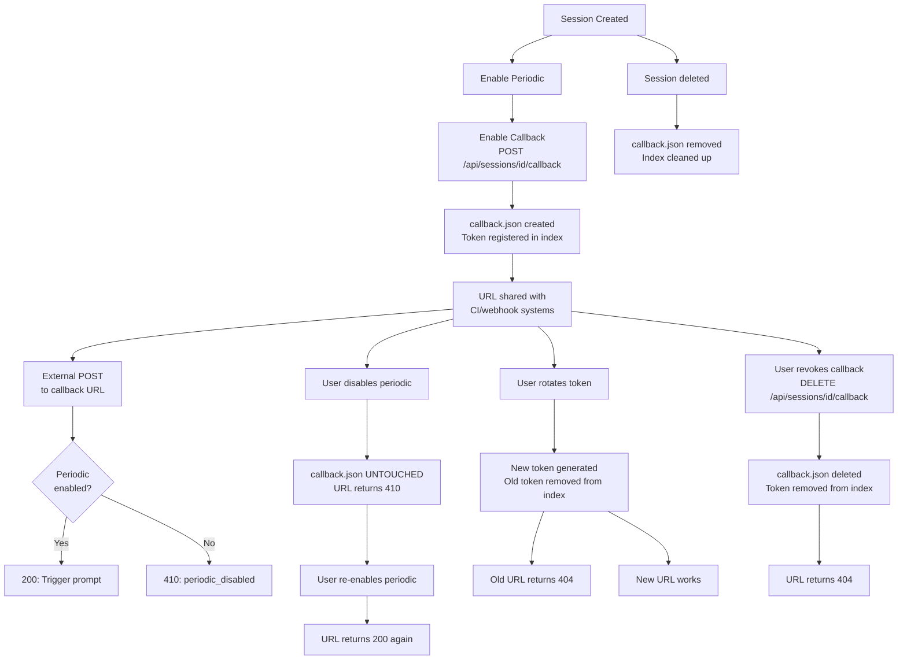
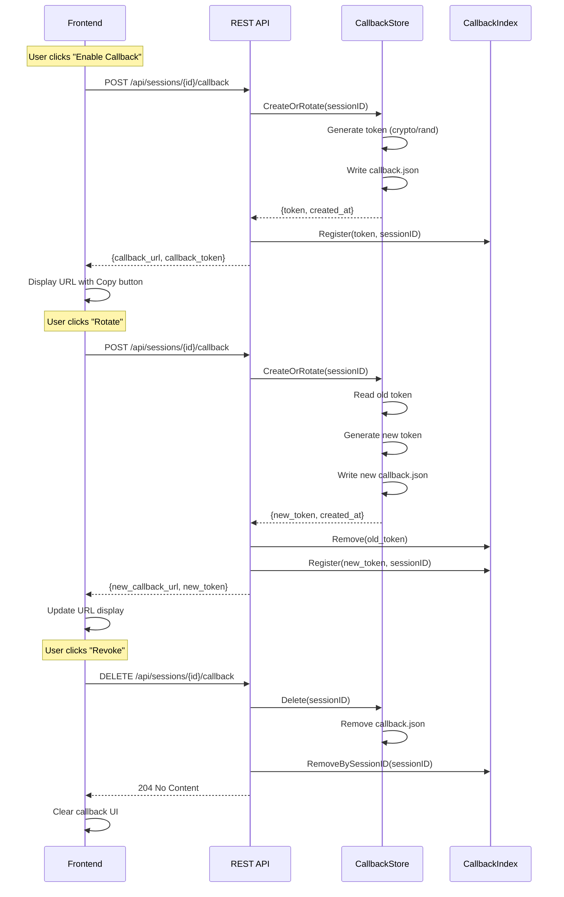

# Callback Endpoints

## Overview

HTTP callback endpoints allow external systems to trigger an on-demand run of a periodic conversation's configured prompt. A callback is equivalent to the periodic scheduler firing — it calls `PeriodicRunner.TriggerNow(sessionID)`.

**Key characteristics:**

- **Capability URL authentication**: The token in the URL IS the credential (no session cookies required)
- **Independent lifecycle**: Callback tokens survive periodic config changes (disable/enable/reconfigure)
- **Separate storage**: Callback config stored in `callback.json`, not `periodic.json`
- **Rate-limited**: Per-token rate limiting (1 req/10s, burst of 3) protects against abuse
- **Public endpoint**: Works identically on localhost and external listeners

## Quick Start

Once you've enabled a callback URL for a periodic conversation (via the properties panel in the UI), you can trigger it with a simple `curl`:

```bash
# Trigger a periodic conversation callback
curl -X POST https://your-mitto-server.com/mitto/api/callback/cb_YOUR_TOKEN_HERE
```

A successful trigger returns:

```json
{ "status": "triggered" }
```

You can optionally include metadata for audit logging:

```bash
curl -X POST https://your-mitto-server.com/mitto/api/callback/cb_YOUR_TOKEN_HERE \
  -H "Content-Type: application/json" \
  -d '{"metadata": {"source": "my-script", "reason": "manual check"}}'
```

> **Note:** The URL must include the API prefix (typically `/mitto`). The full URL is shown when you click **"Enable Callback URL"** or **"Copy URL"** in the conversation properties panel.

## URL Scheme

Uses the capability URL pattern — the token in the URL IS the credential:

```
POST {apiPrefix}/api/callback/{callback-token}
```

**Token format:** `cb_` prefix + 64 hex characters (32 bytes of crypto/rand entropy)

**Example:** `https://mitto.example.com/mitto/api/callback/cb_a1b2c3d4e5f6...`

## Public Endpoint

### `POST {apiPrefix}/api/callback/{token}`

Triggers the periodic prompt for the session associated with this token.

**Request body (optional):**

```json
{
  "metadata": {
    "source": "github-webhook",
    "event": "push",
    "ref": "refs/heads/main"
  }
}
```

| Field    | Type   | Description                                                                     |
| -------- | ------ | ------------------------------------------------------------------------------- |
| metadata | object | Opaque key-value pairs. Logged for auditing only. NOT injected into the prompt. |

**Responses:**

| Status | Body                              | Condition                                    |
| ------ | --------------------------------- | -------------------------------------------- |
| 200    | `{"status": "triggered"}`         | Prompt delivery initiated                    |
| 400    | `{"error": "invalid_token"}`      | Malformed token format                       |
| 404    | `{"error": "not_found"}`          | Token doesn't match any session              |
| 405    | `{"error": "method_not_allowed"}` | Non-POST method                              |
| 409    | `{"error": "session_busy"}`       | Session is currently prompting               |
| 410    | `{"error": "periodic_disabled"}`  | Periodic is disabled or not configured       |
| 429    | `{"error": "rate_limited"}`       | Too many requests for this token             |
| 500    | `{"error": "internal"}`           | Delivery failure (session unavailable, etc.) |

**Examples:**

```bash
# Simple trigger
curl -X POST https://mitto.example.com/mitto/api/callback/cb_a1b2c3d4...

# With metadata for audit logging
curl -X POST https://mitto.example.com/mitto/api/callback/cb_a1b2c3d4... \
  -H "Content-Type: application/json" \
  -d '{
    "metadata": {
      "source": "github-webhook",
      "event": "push",
      "ref": "refs/heads/main",
      "commit": "abc123"
    }
  }'

# From a webhook service (GitHub, GitLab, CircleCI, etc.)
# Most webhook services support POST with JSON payload
# Configure the webhook URL to: https://your-mitto.com/mitto/api/callback/cb_...
```

## Internal Management Endpoints (Authenticated)

These endpoints require session authentication (session cookie or auth token).

### `GET /api/sessions/{id}/callback`

Returns callback status for the session.

**Responses:**

| Status | Body                                                                    | Condition              |
| ------ | ----------------------------------------------------------------------- | ---------------------- |
| 200    | `{"callback_url": "https://...", "created_at": "2026-04-09T12:00:00Z"}` | Callback configured    |
| 404    | `{"error": "not_found"}`                                                | No callback configured |

**Example:**

```bash
curl https://mitto.example.com/mitto/api/sessions/20260409-131740-68402925/callback \
  -H "Cookie: session=..."
```

### `POST /api/sessions/{id}/callback`

Generates a new callback token (or rotates existing).

**Request body:** Empty

**Response:**

```json
{
  "callback_token": "cb_a1b2c3d4e5f6...",
  "callback_url": "https://mitto.example.com/mitto/api/callback/cb_a1b2c3d4e5f6...",
  "callback_enabled": true
}
```

**Token rotation:** If a callback already exists, calling this endpoint again generates a new token and invalidates the old one. The old token will return 404 immediately.

**Example:**

```bash
curl -X POST https://mitto.example.com/mitto/api/sessions/20260409-131740-68402925/callback \
  -H "Cookie: session=..."
```

### `DELETE /api/sessions/{id}/callback`

Revokes the callback token permanently.

**Responses:**

| Status | Body | Condition             |
| ------ | ---- | --------------------- |
| 204    | —    | Token revoked         |
| 404    | —    | No callback to revoke |

**Example:**

```bash
curl -X DELETE https://mitto.example.com/mitto/api/sessions/20260409-131740-68402925/callback \
  -H "Cookie: session=..."
```

## Token Lifecycle



**Key points:**

1. **Independent lifecycle**: Callback token survives periodic being disabled/reconfigured
2. **Preserved on disable**: Disabling periodic doesn't delete `callback.json` (URL returns 410 instead of 404)
3. **Re-enable works**: Re-enabling periodic makes the same callback URL work again (200)
4. **Rotation invalidates old token**: Rotating generates a new token and the old one returns 404 immediately
5. **Revoke is permanent**: Deleting the callback removes `callback.json` and the URL returns 404
6. **Session deletion**: Deleting the session removes the callback and cleans up the index

## Data Model

Callback config is stored **separately** from periodic config to ensure independent lifecycles:

```
sessions/{session-id}/
  ├── metadata.json
  ├── events.jsonl
  ├── periodic.json        ← periodic config (may not exist)
  └── callback.json        ← callback token (independent)
```

**callback.json structure:**

```json
{
  "token": "cb_a1b2c3d4e5f6...",
  "created_at": "2026-04-09T12:00:00Z"
}
```

This separation ensures:

- Callback URL survives periodic being disabled/deleted/reconfigured
- Token rotation doesn't affect periodic settings
- Callback can be revoked without touching periodic config

## Security Model

### Capability URL Authentication

- **Token IS the credential** — No additional auth required (no session cookies, no CSRF tokens)
- **Endpoint bypasses Mitto's session-cookie auth middleware** — Anyone with the token can trigger
- **Exempt from CSRF protection** — No browser session to exploit (server-to-server calls)
- **Works identically on both listeners** — localhost and external listeners use the same handler

**Why this is safe:**

1. **Entropy**: 32 bytes of crypto/rand = 256 bits of entropy (infeasible to guess)
2. **Limited mutation**: Only calls `TriggerNow()` — no config changes, no data exposure
3. **Rate limiting**: Per-token limits prevent abuse even if token is leaked
4. **Audit trail**: Metadata in request body is logged for forensics
5. **Revocable**: Token can be revoked or rotated instantly via management API

### Rate Limiting

**Per-token limits:**

- **Rate**: 1 request per 10 seconds
- **Burst**: 3 requests
- **Separate from general rate limiter**: Callback has dedicated limiter

**Implementation:** `CallbackRateLimiter` in `internal/web/callback.go` uses `golang.org/x/time/rate`.

### Defense Integration

**Scanner defense middleware** applies to callback endpoint:

- Blocked IPs are rejected before the handler runs
- Same blocklist and IP metrics as other public endpoints
- See [Restricted Runner Integration](restricted-runner-integration.md) for defense architecture

### Mutation Scope

**Callback can ONLY:**

- Call `TriggerNow()` on the periodic runner
- Log metadata for auditing

**Callback CANNOT:**

- Change periodic configuration
- Read session data
- Modify session metadata
- Execute arbitrary code

## Architecture

### Key Components

| Component             | File                         | Purpose                                              |
| --------------------- | ---------------------------- | ---------------------------------------------------- |
| CallbackStore         | internal/session/callback.go | Token persistence (callback.json)                    |
| CallbackIndex         | internal/web/callback.go     | In-memory token→session lookup                       |
| CallbackRateLimiter   | internal/web/callback.go     | Per-token rate limiting                              |
| handleCallbackTrigger | internal/web/callback.go     | Public POST handler                                  |
| handleSessionCallback | internal/web/callback.go     | Authenticated management endpoints (GET/POST/DELETE) |

### CallbackStore

Manages persistence of callback tokens in `callback.json`:

```go
type CallbackStore struct {
    sessionsDir string
    mu          sync.RWMutex
}

func (cs *CallbackStore) CreateOrRotate(sessionID string) (string, error)
func (cs *CallbackStore) Get(sessionID string) (*CallbackConfig, error)
func (cs *CallbackStore) Delete(sessionID string) error
```

**Thread safety:** All methods protected by `mu sync.RWMutex`.

### CallbackIndex

In-memory index for fast token→session lookup:

```go
type CallbackIndex struct {
    mu           sync.RWMutex
    tokenToSession map[string]string  // token → sessionID
}

func (ci *CallbackIndex) Register(token, sessionID string)
func (ci *CallbackIndex) Lookup(token string) (sessionID string, found bool)
func (ci *CallbackIndex) Remove(token string)
func (ci *CallbackIndex) RemoveBySessionID(sessionID string)
```

**Initialization:** `Server.buildCallbackIndex()` scans all `callback.json` files on startup.

### CallbackRateLimiter

Per-token rate limiting:

```go
type CallbackRateLimiter struct {
    mu       sync.Mutex
    limiters map[string]*rate.Limiter  // token → limiter
}

func (cr *CallbackRateLimiter) Allow(token string) bool
```

**Configuration:** 1 request per 10 seconds, burst of 3 (hardcoded).

### Index Maintenance

| Event             | Action                                      |
| ----------------- | ------------------------------------------- |
| Server startup    | Scan all callback.json → populate index     |
| UI: Enable/Rotate | Register new token (remove old if rotating) |
| UI: Revoke        | Remove token from index                     |
| Session deletion  | RemoveBySessionID from index                |
| Token rotation    | Remove old token, register new token        |

**Thread safety:** All index operations are protected by `CallbackIndex.mu`.

## Frontend

The `ConversationPropertiesPanel` component shows callback controls in the **Periodic Prompts** section.

### UI States

| Periodic State | Callback State | UI Display                                                             |
| -------------- | -------------- | ---------------------------------------------------------------------- |
| Disabled       | None           | "Enable Periodic Prompts first" message                                |
| Enabled        | None           | "Enable Callback" button                                               |
| Enabled        | Active         | URL display + Copy/Rotate/Revoke buttons                               |
| Disabled       | Active         | Subdued display: "Callback preserved but inactive (periodic disabled)" |

### Workflow



## Use Cases

### GitHub Webhook

Configure a GitHub webhook to POST to the callback URL on push events. The periodic prompt might be "Check the latest commits and summarize changes."

**GitHub Webhook Settings:**

- **Payload URL**: `https://mitto.example.com/mitto/api/callback/cb_a1b2c3d4...`
- **Content type**: `application/json`
- **Events**: Select "Just the push event" or custom events
- **Active**: ✓

**Example periodic prompt:**

```
Check the latest commits in the repository and provide a summary of changes.
If there are any security concerns or breaking changes, highlight them.
```

### Cron Job

Trigger daily reports at 9am via system cron:

```bash
# Add to crontab (crontab -e)
0 9 * * * curl -s -X POST https://mitto.example.com/mitto/api/callback/cb_a1b2c3d4... \
  -H "Content-Type: application/json" \
  -d '{"metadata": {"source": "cron", "job": "daily-report"}}'
```

**Example periodic prompt:**

```
Generate a daily status report for the team:
1. Review open pull requests and their review status
2. Check for any failing CI builds
3. Summarize recent commits (last 24 hours)
4. List any high-priority issues
```

### CI/CD Pipeline

Add a step in your CI pipeline to trigger a Mitto conversation after deployment:

**GitHub Actions example:**

```yaml
- name: Trigger Mitto callback
  run: |
    curl -X POST https://mitto.example.com/mitto/api/callback/${{ secrets.MITTO_CALLBACK_TOKEN }} \
      -H "Content-Type: application/json" \
      -d '{
        "metadata": {
          "source": "github-actions",
          "workflow": "${{ github.workflow }}",
          "run_id": "${{ github.run_id }}",
          "environment": "production"
        }
      }'
```

**Example periodic prompt:**

```
A deployment to production just completed. Please:
1. Check the deployment logs for any errors
2. Verify the health check endpoints are responding
3. Review recent error rates in monitoring
4. Summarize the deployment status
```

### Monitoring Alert Integration

Integrate with monitoring systems (Datadog, PagerDuty, New Relic) to trigger investigations:

**Example webhook integration:**

```bash
# From Datadog webhook
curl -X POST https://mitto.example.com/mitto/api/callback/cb_a1b2c3d4... \
  -H "Content-Type: application/json" \
  -d '{
    "metadata": {
      "source": "datadog",
      "alert_id": "12345",
      "severity": "high",
      "metric": "error_rate"
    }
  }'
```

**Example periodic prompt:**

```
An alert was triggered for high error rate. Please investigate:
1. Check the error logs for the last 15 minutes
2. Identify the root cause if possible
3. Check if any recent deployments might be related
4. Suggest mitigation steps
```

## Testing Callbacks

### Manual Testing

```bash
# 1. Enable periodic for a session (via UI or API)
# 2. Enable callback and get the URL
curl -X POST http://localhost:5757/api/sessions/20260409-131740-68402925/callback \
  -H "Cookie: session=..."

# Response: {"callback_token": "cb_...", "callback_url": "http://..."}

# 3. Trigger the callback
curl -X POST http://localhost:5757/api/callback/cb_a1b2c3d4...

# Expected: 200 {"status": "triggered"}

# 4. Check session events to see the triggered prompt
curl http://localhost:5757/api/sessions/20260409-131740-68402925/events \
  -H "Cookie: session=..."
```

### Testing Edge Cases

```bash
# Invalid token format
curl -X POST http://localhost:5757/api/callback/invalid_token
# Expected: 400 {"error": "invalid_token"}

# Non-existent token
curl -X POST http://localhost:5757/api/callback/cb_0000000000000000...
# Expected: 404 {"error": "not_found"}

# Periodic disabled
# (disable periodic via UI, then trigger callback)
curl -X POST http://localhost:5757/api/callback/cb_a1b2c3d4...
# Expected: 410 {"error": "periodic_disabled"}

# Rate limiting (send 4+ requests rapidly)
for i in {1..5}; do
  curl -X POST http://localhost:5757/api/callback/cb_a1b2c3d4...
done
# Expected: First 3 succeed, 4th returns 429 {"error": "rate_limited"}

# Session busy (trigger while agent is processing)
curl -X POST http://localhost:5757/api/callback/cb_a1b2c3d4...
# (immediately trigger again)
curl -X POST http://localhost:5757/api/callback/cb_a1b2c3d4...
# Expected: 409 {"error": "session_busy"}
```

## Troubleshooting

### Callback returns 404 after enabling

**Cause:** Index not populated or registration failed.

**Solution:**

1. Check `callback.json` exists in session directory
2. Restart server to rebuild index
3. Check server logs for index registration errors

### Callback returns 410 intermittently

**Cause:** Periodic is being disabled/enabled by another client or configuration change.

**Solution:**

1. Verify periodic is enabled via `GET /api/sessions/{id}/periodic`
2. Check if auto-disable conditions are met (e.g., error threshold)
3. Review session events for periodic state changes

### Rate limiting too aggressive

**Cause:** Multiple systems sharing the same callback URL or retry logic.

**Solution:**

1. Use separate callback URLs for different webhook sources (create multiple sessions)
2. Adjust retry backoff in webhook sender
3. If needed, modify `CallbackRateLimiter` constants in `internal/web/callback.go`

### Callback triggered but prompt not delivered

**Cause:** Session not running or error in `TriggerNow()`.

**Solution:**

1. Check session status via `GET /api/sessions/{id}`
2. Review server logs for `TriggerNow` errors
3. Verify session has a valid periodic configuration
4. Check `events.jsonl` for error events

## Security Considerations

### Token Leakage

**Risk:** If the callback URL is committed to a public repository or logged, anyone can trigger the prompt.

**Mitigation:**

1. Store callback URLs in secrets/environment variables
2. Use token rotation if leakage is suspected
3. Monitor metadata in request logs for unexpected sources
4. Revoke immediately if compromise detected

### Metadata Injection

**Risk:** Attacker sends malicious metadata to pollute logs.

**Mitigation:**

1. Metadata is **NOT** injected into the prompt (only logged)
2. Metadata is sanitized before logging
3. Metadata size limits prevent log spam (max 1KB per request)

### Denial of Service

**Risk:** Attacker floods the callback endpoint.

**Mitigation:**

1. Per-token rate limiting (1 req/10s, burst of 3)
2. Scanner defense middleware blocks abusive IPs
3. General rate limiter applies to all requests
4. 409 response if session is busy (prevents queueing)

### Privilege Escalation

**Risk:** External system gains more access than intended via callback.

**Mitigation:**

1. Callback can **ONLY** trigger `TriggerNow()` — no other mutations
2. Prompt content is controlled by session owner (via periodic config)
3. No data exposure — callback returns minimal response
4. Session authentication required for all management endpoints

## Implementation Checklist

When implementing callback support:

- [ ] `CallbackStore` in `internal/session/callback.go` (persistence)
- [ ] `CallbackIndex` in `internal/web/callback.go` (in-memory lookup)
- [ ] `CallbackRateLimiter` in `internal/web/callback.go` (per-token limits)
- [ ] `handleCallbackTrigger` in `internal/web/callback.go` (public POST handler)
- [ ] `handleSessionCallback` in `internal/web/callback.go` (GET/POST/DELETE management)
- [ ] `buildCallbackIndex()` in `internal/web/server.go` (startup scan)
- [ ] Route registration in `internal/web/server.go` (`POST {prefix}/api/callback/{token}`)
- [ ] Frontend UI in `web/static/components/ConversationPropertiesPanel.js`
- [ ] Integration tests in `tests/integration/inprocess/callback_test.go`
- [ ] Unit tests for `CallbackStore`, `CallbackIndex`, `CallbackRateLimiter`
- [ ] Documentation updates (this file, README, web-interface.md)
