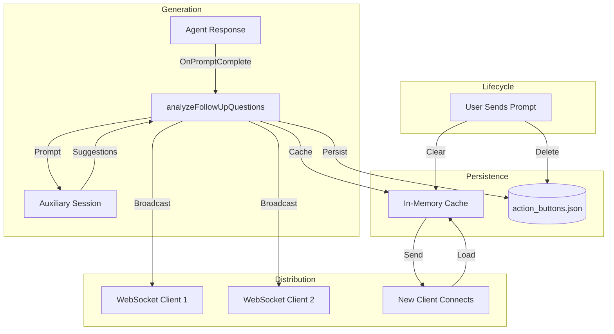
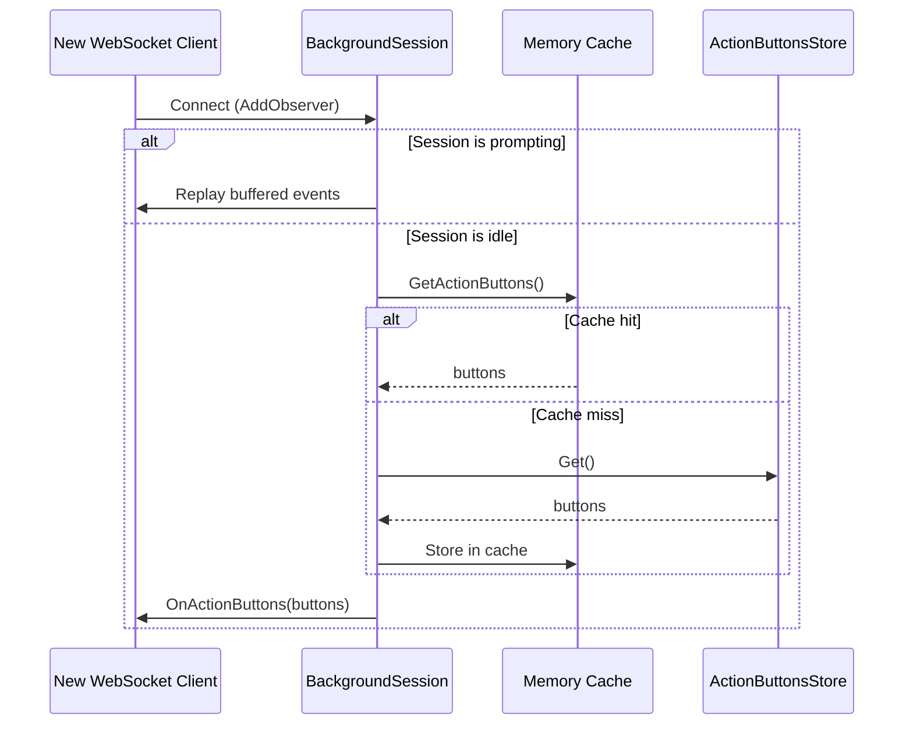
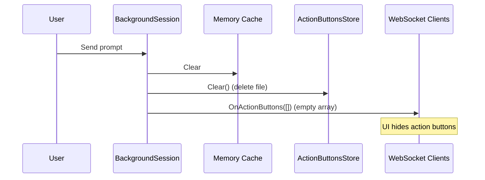
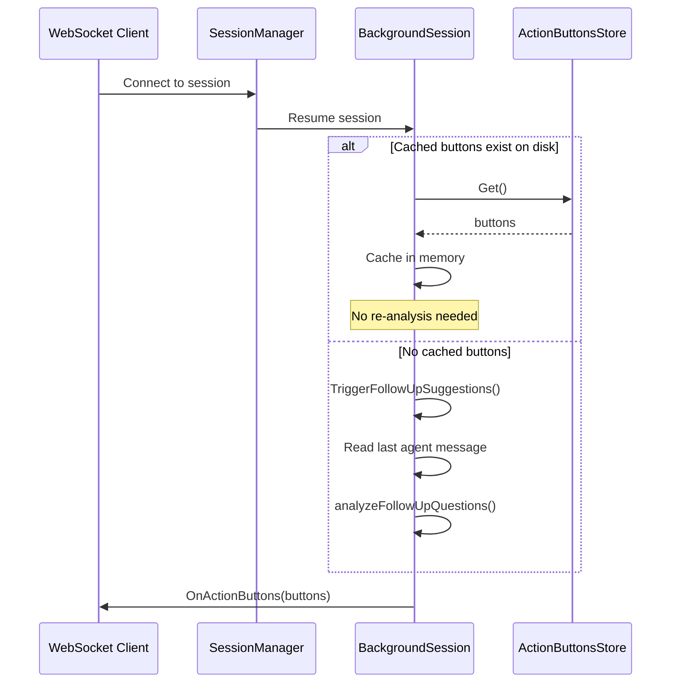

# Follow-up Suggestions System

This document covers the follow-up suggestions architecture, including how suggestions are generated, persisted, and synchronized across multiple clients.

## Overview

Follow-up suggestions (also called "action buttons") are AI-generated response options that appear after the agent completes a response. They help users quickly continue the conversation without typing, especially useful on mobile devices.

The system uses the auxiliary conversation to analyze agent responses and extract potential follow-up questions or actions the user might want to take.



## Why Persistence?

Without persistence, follow-up suggestions are ephemeral—only clients connected at the moment of generation receive them. This causes problems:

1. **Multi-device usage**: User starts on desktop, switches to mobile—mobile misses suggestions
2. **Page refresh**: Browser refresh loses suggestions
3. **Server restart**: All suggestions lost
4. **Network reconnection**: Mobile waking from sleep misses suggestions

The solution uses a two-tier cache:

- **In-memory**: Fast access for active sessions
- **On-disk**: Survives server restarts and session resumption

## Configuration

Follow-up suggestions are configured globally or per-workspace:

```yaml
conversations:
  action_buttons:
    enabled: true # Enable follow-up suggestions (default: true)
```

## Storage Architecture

### File Location

```
sessions/
└── {session_id}/
    ├── events.jsonl        # Event log (append-only)
    ├── metadata.json       # Session metadata
    ├── queue.json          # Message queue
    └── action_buttons.json # Follow-up suggestions (transient)
```

### action_buttons.json Format

```json
{
  "buttons": [
    {
      "label": "Yes, proceed",
      "response": "Yes, please proceed with the changes"
    },
    { "label": "Show diff", "response": "Can you show me the diff first?" }
  ],
  "generated_at": "2026-02-01T12:00:00Z",
  "for_event_seq": 42
}
```

### Design Decisions

| Decision                         | Rationale                                                            |
| -------------------------------- | -------------------------------------------------------------------- |
| Separate file (not in events)    | Suggestions are transient UI state, not conversation history         |
| Delete on clear (not empty file) | Reduces disk clutter; missing file = no suggestions                  |
| `for_event_seq` field            | Tracks which agent message the suggestions relate to (for debugging) |
| In-memory + disk                 | Memory for speed, disk for persistence across restarts               |

## ActionButtonsStore (`internal/session/action_buttons.go`)

Thread-safe store for persisting action buttons to disk.

### Types

```go
// ActionButton represents a suggested follow-up action.
type ActionButton struct {
    Label    string `json:"label"`    // Button text (max 50 chars)
    Response string `json:"response"` // Text sent on click (max 1000 chars)
}

// ActionButtonsStore manages action buttons for a single session.
type ActionButtonsStore struct { ... }
```

### Methods

| Method                   | Description                                   |
| ------------------------ | --------------------------------------------- |
| `Get()`                  | Returns current buttons (empty slice if none) |
| `Set(buttons, eventSeq)` | Stores buttons, replacing any existing        |
| `Clear()`                | Removes all buttons (deletes file)            |
| `IsEmpty()`              | Returns true if no buttons stored             |
| `Delete()`               | Removes the file (for session cleanup)        |

### Analysis Details

The auxiliary session uses a specialized prompt to extract follow-up suggestions:

1. **Input**: The agent's last response (HTML stripped to plain text)
2. **Output**: JSON array of `{label, value}` pairs
3. **Constraints**: Max 3 suggestions, labels ≤50 chars, responses ≤1000 chars

The analysis looks for:

- Direct questions the agent asked
- Implicit decision points ("Would you like me to...")
- Common follow-up actions based on context

## Client Connection Flow

When a new client connects, it receives cached suggestions immediately:



## Clearing Suggestions

Suggestions are cleared when new conversation activity occurs:

| Trigger                 | Why                                                       |
| ----------------------- | --------------------------------------------------------- |
| User sends prompt       | Suggestions are stale—new response will generate new ones |
| Agent starts responding | Prevents showing outdated suggestions during streaming    |



## Session Resumption

When a session is resumed (e.g., after server restart or switching conversations):



## WebSocket Messages

### Message Types

| Type             | Direction       | Description                        |
| ---------------- | --------------- | ---------------------------------- |
| `action_buttons` | Server → Client | Suggestions available (or cleared) |

### Payload

```json
{
  "type": "action_buttons",
  "data": {
    "session_id": "20260201-120000-abc12345",
    "buttons": [
      { "label": "Yes", "response": "Yes, please proceed" },
      { "label": "No", "response": "No, cancel" }
    ]
  }
}
```

When cleared, `buttons` is an empty array:

```json
{
  "type": "action_buttons",
  "data": {
    "session_id": "20260201-120000-abc12345",
    "buttons": []
  }
}
```

## Thread Safety

| Component                               | Mechanism               | Notes                    |
| --------------------------------------- | ----------------------- | ------------------------ |
| `ActionButtonsStore`                    | `sync.Mutex`            | Protects file read/write |
| `BackgroundSession.cachedActionButtons` | `sync.RWMutex`          | Allows concurrent reads  |
| Observer notifications                  | Iteration over map copy | Non-blocking broadcasts  |

## Performance Considerations

1. **Async analysis**: `analyzeFollowUpQuestions()` runs in a goroutine to avoid blocking the response
2. **30-second timeout**: Prevents hung auxiliary sessions from blocking indefinitely
3. **Memory-first reads**: `GetActionButtons()` checks memory before disk
4. **No re-analysis on resume**: Cached buttons are reused if available

## Related Documentation

- [Message Queue](message-queue.md) - Similar persistence pattern for queued messages
- [Session Management](session-management.md) - Session lifecycle and observer pattern
- [WebSocket Messaging](websocket-messaging.md) - WebSocket protocol details
- [Architecture](architecture.md) - Overall system architecture
