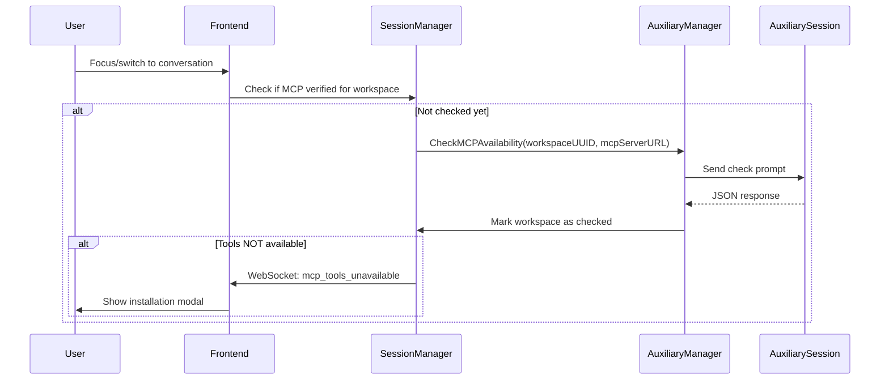

# MCP Availability Checking

## Overview

The MCP availability checking feature verifies that Mitto MCP tools are available in the user's ACP server (e.g., Claude Desktop). This helps users discover and install the Mitto MCP server to enable session-scoped tools.

## Architecture

### Purpose Constant

- **Purpose**: `PurposeMCPCheck = "mcp-check"`
- **Session Scope**: One auxiliary session per workspace
- **Caching**: Results cached per workspace to avoid repeated checks

### Trigger

MCP availability is checked when:

- User focuses or switches to a conversation in a workspace
- Only if the workspace hasn't been checked yet in the current session

### Flow



## Prompt Template

The auxiliary session receives a prompt asking it to check for the `mitto_conversation_get_current` tool and respond with JSON:

**If available:**

```json
{
  "available": true,
  "message": "Tool is available"
}
```

**If NOT available:**

```json
{
  "available": false,
  "suggested_run": "single command to install",
  "suggested_instructions": "detailed multi-step instructions (max 500 chars)"
}
```

The prompt includes a real example for Claude Desktop configuration pointing to the local Mitto MCP server.

## WebSocket Messages

### `mcp_tools_unavailable` (Server → Frontend)

Sent when MCP tools are not available:

```json
{
  "type": "mcp_tools_unavailable",
  "workspace_uuid": "...",
  "suggested_run": "command" (optional),
  "suggested_instructions": "instructions" (optional, max 500 chars)
}
```

### `run_mcp_install_command` (Frontend → Server)

Sent when user confirms running the installation command:

```json
{
  "type": "run_mcp_install_command",
  "command": "..."
}
```

## UI Behavior

### If `suggested_run` is provided:

- Show modal: "Mitto MCP tools are not available. Would you like me to run this command to install them?"
- Display command in code block
- Buttons: "Yes, run command" | "No, dismiss"
- On confirm: Send `run_mcp_install_command` WebSocket message

### If only `suggested_instructions` is provided:

- Show modal with instructions (truncated to 500 chars)
- Button: "Dismiss"

### If neither is provided:

- Show warning: "Mitto MCP tools are not available. Some features may not work."

## Caching Strategy

### Session-Level Cache (SessionManager)

- `mcpCheckedWorkspaces` map tracks which workspaces have been checked
- Prevents repeated prompts during the same session
- Cleared when:
  - User runs the installation command
  - Session is restarted

### Result Cache (WorkspaceAuxiliaryManager)

- `mcpCheckCache` stores the actual check results
- Prevents repeated auxiliary prompts
- Cleared when:
  - `ClearMCPCheckCache(workspaceUUID)` is called
  - After running installation command

## API

### WorkspaceAuxiliaryManager

```go
// Check MCP availability (with caching)
result, err := mgr.CheckMCPAvailability(ctx, workspaceUUID, mcpServerURL)

// Clear cache to force re-check
mgr.ClearMCPCheckCache(workspaceUUID)
```

### SessionManager

```go
// Check if workspace has been checked
checked := sm.IsMCPChecked(workspaceUUID)

// Mark workspace as checked
sm.MarkMCPChecked(workspaceUUID)

// Clear checked flag (after installation)
sm.ClearMCPChecked(workspaceUUID)
```

## Implementation Status

### ✅ Completed

- Purpose constant and prompt template
- `MCPAvailabilityResult` struct
- `CheckMCPAvailability()` method with caching
- JSON parsing with error handling
- WebSocket message type definitions
- SessionManager tracking methods

### ⏳ Remaining

- WebSocket integration (trigger on conversation focus)
- Command execution handler
- Frontend UI implementation
- Cache clearing after command execution

## Testing

Test the feature by:

1. Opening a conversation in a workspace
2. Auxiliary session checks for `mitto_conversation_get_current` tool
3. If not available, UI shows installation instructions
4. User can run suggested command
5. After installation, new conversations trigger re-check
