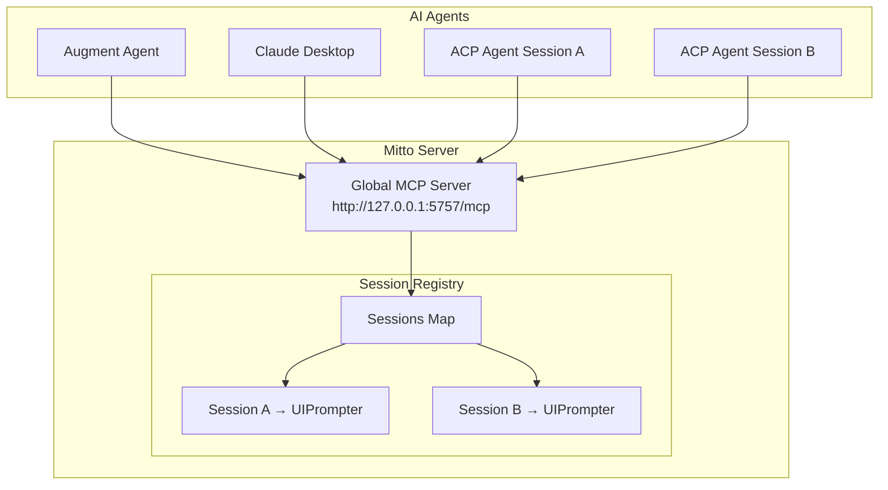
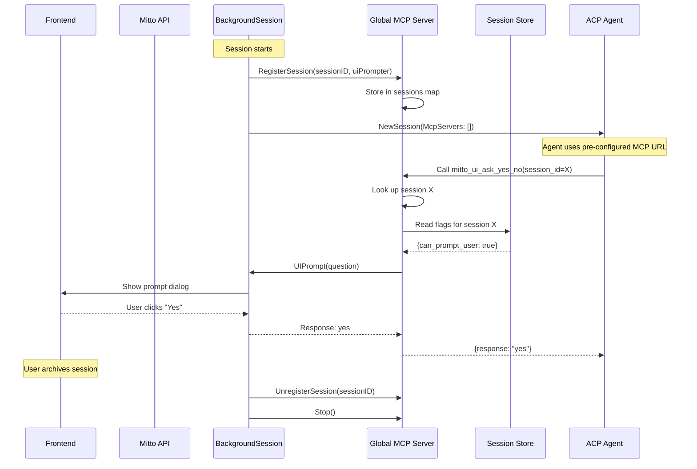

# MCP Server

Mitto provides a **single global MCP (Model Context Protocol) server** that serves both:

1. **Global tools** - Always available tools for debugging (list conversations, get config, runtime info)
2. **Session-scoped tools** - Tools that require a `session_id` parameter and operate on specific conversations

## Architecture Overview



**Key Points:**

- All agents connect to the **same MCP server** at `http://127.0.0.1:5757/mcp`
- Session-scoped tools require a `session_id` parameter to identify the target session
- Sessions register with the MCP server to enable UI prompt routing
- No per-session MCP server spawning (simplified architecture)

## Global MCP Server

The global MCP server serves all agents:

- **Binds to `127.0.0.1:5757`** (localhost only for security)
- **Starts automatically** with the web server
- **Supports two transport modes**: HTTP (Streamable HTTP) and STDIO (subprocess)
- **Exposes both global and session-scoped tools**

## Transport Modes

### HTTP Mode (Default)

Streamable HTTP transport (MCP spec 2025-03-26). The server listens on a TCP port and clients connect via HTTP.

- **URL**: `http://127.0.0.1:5757/mcp`
- **Use case**: When Mitto is running as a web server
- **Protocol**: MCP Streamable HTTP (supports both JSON and SSE responses)

### STDIO Mode

Standard input/output for communication. The MCP server reads JSON-RPC messages from stdin and writes responses to stdout.

- **Use case**: Running the MCP server as a subprocess
- **Configuration**: Set `Mode: "stdio"` in the MCP server config

STDIO mode is useful for:

- Integration with AI agents that spawn MCP servers as subprocesses
- Testing and debugging without network dependencies
- Environments where HTTP is not available

## Available Tools

### Global Tools (No session_id required)

These tools are always available and don't require a session context:

#### `mitto_conversation_list`

Lists all conversations with detailed metadata. **Always available** (no permission check).

| Field            | Description                               |
| ---------------- | ----------------------------------------- |
| `session_id`     | Unique session identifier                 |
| `title`          | User-friendly session name                |
| `description`    | Session description                       |
| `acp_server`     | ACP server name                           |
| `working_dir`    | Working directory                         |
| `created_at`     | Creation timestamp                        |
| `updated_at`     | Last update timestamp                     |
| `message_count`  | Number of events                          |
| `status`         | Session status (active, completed, error) |
| `archived`       | Whether session is archived               |
| `session_folder` | Full path to session directory            |
| `is_running`     | Whether session is currently active       |
| `is_prompting`   | Whether agent is processing a prompt      |
| `is_locked`      | Whether session is locked                 |
| `lock_status`    | Lock status (idle, processing)            |
| `last_seq`       | Last sequence number                      |

#### `mitto_get_config`

Returns the current effective Mitto configuration (sanitized to exclude sensitive data):

| Field           | Description                           |
| --------------- | ------------------------------------- |
| `acp_servers`   | List of configured ACP servers        |
| `web`           | Web server configuration              |
| `has_prompts`   | Whether global prompts are configured |
| `prompts_count` | Number of global prompts              |
| `session`       | Session storage configuration         |

#### `mitto_get_runtime_info`

Returns runtime information about the Mitto instance:

| Field           | Description                               |
| --------------- | ----------------------------------------- |
| `os`            | Operating system (darwin, linux, windows) |
| `arch`          | CPU architecture                          |
| `num_cpu`       | Number of CPUs                            |
| `hostname`      | Machine hostname                          |
| `pid`           | Process ID                                |
| `executable`    | Path to Mitto executable                  |
| `working_dir`   | Current working directory                 |
| `go_version`    | Go runtime version                        |
| `num_goroutine` | Number of goroutines                      |
| `data_dir`      | Mitto data directory                      |
| `sessions_dir`  | Sessions directory                        |
| `logs_dir`      | Logs directory                            |
| `log_files`     | Paths to log files                        |
| `config_files`  | Paths to configuration files              |

### Session-Scoped Tools (Require session_id parameter)

These tools operate on a specific conversation and require a `session_id` parameter:

#### `mitto_conversation_get_current`

Get information about the current conversation. Requires `session_id`.

| Parameter    | Type   | Required | Description          |
| ------------ | ------ | -------- | -------------------- |
| `session_id` | string | Yes      | The session to query |

Returns:

| Field           | Description           |
| --------------- | --------------------- |
| `session_id`    | Session identifier    |
| `title`         | Session title         |
| `description`   | Session description   |
| `working_dir`   | Working directory     |
| `created_at`    | Creation timestamp    |
| `updated_at`    | Last update timestamp |
| `message_count` | Number of messages    |
| `status`        | Session status        |

#### `mitto_conversation_send_prompt`

Send a prompt to another conversation's queue. Requires `can_send_prompt` flag on the source session.

| Parameter         | Type   | Required | Description                      |
| ----------------- | ------ | -------- | -------------------------------- |
| `session_id`      | string | Yes      | Source session ID (your session) |
| `conversation_id` | string | Yes      | Target conversation ID           |
| `prompt`          | string | Yes      | The prompt text to send          |

#### `mitto_ui_ask_yes_no`

Present a yes/no question to the user. Requires `can_prompt_user` flag.

| Parameter         | Type   | Required | Description                  |
| ----------------- | ------ | -------- | ---------------------------- |
| `session_id`      | string | Yes      | Session to display prompt in |
| `question`        | string | Yes      | The question to ask          |
| `yes_label`       | string | No       | Custom "Yes" button label    |
| `no_label`        | string | No       | Custom "No" button label     |
| `timeout_seconds` | int    | No       | Timeout (default: 300)       |

#### `mitto_ui_options_buttons`

Present multiple options as buttons. Requires `can_prompt_user` flag. Max 4 options.

| Parameter         | Type     | Required | Description                   |
| ----------------- | -------- | -------- | ----------------------------- |
| `session_id`      | string   | Yes      | Session to display prompt in  |
| `options`         | string[] | Yes      | List of option labels (max 4) |
| `question`        | string   | No       | Question text                 |
| `timeout_seconds` | int      | No       | Timeout (default: 300)        |

#### `mitto_ui_options_combo`

Present a dropdown/combo box. Requires `can_prompt_user` flag. Max 10 options.

| Parameter         | Type     | Required | Description                    |
| ----------------- | -------- | -------- | ------------------------------ |
| `session_id`      | string   | Yes      | Session to display prompt in   |
| `options`         | string[] | Yes      | List of option labels (max 10) |
| `question`        | string   | No       | Question text                  |
| `timeout_seconds` | int      | No       | Timeout (default: 300)         |

#### `mitto_conversation_start`

Create a new conversation in the same workspace as the calling session. Requires `can_start_conversation` flag.

The new conversation inherits the workspace configuration (ACP server, working directory) from the calling session. This is useful for agents that want to spawn sub-conversations for parallel work or delegate tasks.

| Parameter        | Type   | Required | Description                                  |
| ---------------- | ------ | -------- | -------------------------------------------- |
| `session_id`     | string | Yes      | Source session ID (your session)             |
| `title`          | string | No       | Title for the new conversation               |
| `initial_prompt` | string | No       | Initial message to queue for the new session |

Returns:

| Field            | Description                                   |
| ---------------- | --------------------------------------------- |
| `success`        | Whether the conversation was created          |
| `session_id`     | The new conversation's session ID             |
| `working_dir`    | Working directory (inherited from caller)     |
| `queue_position` | Queue position if initial prompt was provided |
| `error`          | Error message if creation failed              |

**Safety restriction:** The newly created conversation has its `can_start_conversation` flag explicitly set to `false`, regardless of the parent's permissions. This prevents infinite recursive chains where conversations spawn unlimited child conversations.

**Example use cases:**

- Spawn a sub-agent to work on a specific task in parallel
- Delegate a sub-task to a new conversation
- Create a conversation for follow-up work

#### `mitto_conversation_userdata_set`

Set a user data attribute in the calling conversation. The key must be defined in the workspace's user data schema (`.mittorc` under `conversations.user_data`).

| Parameter    | Type   | Required | Description                                  |
| ------------ | ------ | -------- | -------------------------------------------- |
| `session_id` | string | Yes      | Source session ID (your session)             |
| `key`        | string | Yes      | Attribute name (must be in schema)           |
| `value`      | string | Yes      | Value to set (validated against schema type) |

Returns:

| Field     | Description                                |
| --------- | ------------------------------------------ |
| `success` | Whether the attribute was set              |
| `key`     | The key that was set                       |
| `value`   | The value that was set                     |
| `error`   | Error message if validation/setting failed |

**Schema validation:**

- If no schema is defined for the workspace, the tool fails
- If the key is not in the schema, the tool fails
- If the value doesn't match the field type (e.g., invalid URL for `url` type), the tool fails

**Example use cases:**

- Update ticket/issue references from within the conversation
- Set metadata like priority or status
- Store references to external resources (URLs)

### Permission Flags

Session-scoped tools check permissions at runtime:

| Flag                     | Tools That Require It                                                       |
| ------------------------ | --------------------------------------------------------------------------- |
| `can_do_introspection`   | (None currently - for future tools)                                         |
| `can_send_prompt`        | `mitto_conversation_send_prompt`                                            |
| `can_prompt_user`        | `mitto_ui_ask_yes_no`, `mitto_ui_options_buttons`, `mitto_ui_options_combo` |
| `can_start_conversation` | `mitto_conversation_start`                                                  |

**Note:** `mitto_conversation_list` is **always available** (no permission check).
`mitto_conversation_get_current` and `mitto_conversation_userdata_set` require the session to be registered (running) but no flag check.

## Configuring AI Agents

### Augment Code (Auggie)

Add to your Augment settings (`.augment/config.json` or VS Code settings):

```json
{
  "augment.mcpServers": {
    "mitto-debug": {
      "url": "http://127.0.0.1:5757/mcp"
    }
  }
}
```

### Claude Desktop

Add to `~/Library/Application Support/Claude/claude_desktop_config.json` (macOS) or `%APPDATA%\Claude\claude_desktop_config.json` (Windows):

```json
{
  "mcpServers": {
    "mitto-debug": {
      "url": "http://127.0.0.1:5757/mcp"
    }
  }
}
```

### Claude Code (CLI)

Add to your Claude Code configuration:

```json
{
  "mcpServers": {
    "mitto-debug": {
      "url": "http://127.0.0.1:5757/mcp"
    }
  }
}
```

### Cursor

Add to Cursor settings (`.cursor/mcp.json`):

```json
{
  "mcpServers": {
    "mitto-debug": {
      "url": "http://127.0.0.1:5757/mcp"
    }
  }
}
```

### Generic MCP Client (HTTP Mode)

For any MCP-compatible client using Streamable HTTP transport:

- **URL**: `http://127.0.0.1:5757/mcp`
- **Transport**: Streamable HTTP (MCP spec 2025-03-26)

### STDIO Mode Configuration

For agents that spawn MCP servers as subprocesses, you can run Mitto's MCP server in STDIO mode. This requires a separate command that starts only the MCP server.

**Claude Desktop (STDIO)**:

```json
{
  "mcpServers": {
    "mitto-debug": {
      "command": "mitto",
      "args": ["mcp", "--stdio"]
    }
  }
}
```

**Cursor (STDIO)**:

```json
{
  "mcpServers": {
    "mitto-debug": {
      "command": "mitto",
      "args": ["mcp", "--stdio"]
    }
  }
}
```

> **Note**: The `mitto mcp` command is a standalone MCP server mode. See the CLI documentation for details.

## Example Usage

Once configured, you can ask the AI agent to debug Mitto issues:

> "Use the mitto-debug MCP server to list all conversations and find any that are stuck in prompting state"

> "Get the runtime info from Mitto and tell me where the log files are located"

> "Check the Mitto configuration and verify the ACP servers are properly configured"

## Debugging Workflow

### 1. Get Runtime Information

Start by calling `mitto_get_runtime_info` to locate important files:

```
Log files:
- mitto.log: ~/Library/Logs/Mitto/mitto.log
- access.log: ~/Library/Logs/Mitto/access.log
- webview.log: ~/Library/Logs/Mitto/webview.log

Sessions: ~/Library/Application Support/Mitto/sessions/
```

### 2. List Conversations

Call `mitto_conversation_list` to find the session you're debugging:

```
Session: 20260211-143052-a1b2c3d4
  Title: "Debug session"
  Folder: ~/Library/Application Support/Mitto/sessions/20260211-143052-a1b2c3d4
  Messages: 42
  Status: active
  Is Prompting: false
```

### 3. Inspect Session Files

Each session folder contains:

| File            | Description                       |
| --------------- | --------------------------------- |
| `events.jsonl`  | All session events (JSONL format) |
| `metadata.json` | Session metadata                  |
| `lock.json`     | Lock information (if locked)      |
| `queue.json`    | Message queue state               |

### 4. Analyze Events

The `events.jsonl` file contains all events with sequence numbers:

```jsonl
{"seq":1,"type":"session_start","timestamp":"2026-02-11T14:30:52Z","data":{...}}
{"seq":2,"type":"user_prompt","timestamp":"2026-02-11T14:30:55Z","data":{"message":"Hello"}}
{"seq":3,"type":"agent_message","timestamp":"2026-02-11T14:30:57Z","data":{"html":"<p>Hi!</p>"}}
```

### 5. Check Logs

Use the log file paths from `mitto_get_runtime_info`:

- **mitto.log**: Backend errors, sequence numbers, event persistence
- **access.log**: Authentication, security events
- **webview.log**: Frontend JavaScript errors, WebSocket issues

## Security

The MCP server binds only to `127.0.0.1` (localhost) and cannot be accessed from other machines. This is intentional for security:

- No authentication required (localhost only)
- Exposes internal state for debugging
- Should not be exposed to the network

## Implementation

The MCP server is implemented in `internal/mcpserver/`:

| File           | Purpose                                                     |
| -------------- | ----------------------------------------------------------- |
| `server.go`    | Global MCP server with both global and session-scoped tools |
| `types.go`     | Response types and helper functions                         |
| `ui_prompt.go` | UI prompt types and interfaces                              |

The server uses the [MCP Go SDK](https://github.com/modelcontextprotocol/go-sdk) with Streamable HTTP transport.

---

## Session Registration

Sessions register with the global MCP server to enable session-scoped tools. This allows:

- UI prompts to be routed to the correct session
- Permission checks based on each session's flags
- Session context for tools like `mitto_conversation_get_current`

### How It Works

1. **Session Start**: When a session is created or resumed:
   - `BackgroundSession` calls `globalMcpServer.RegisterSession(sessionID, uiPrompter, logger)`
   - The session's `UIPrompter` is stored for routing UI prompts
   - **No MCP servers are passed to ACP** - the agent should have MCP pre-configured globally

2. **Tool Execution**: When an agent calls a session-scoped tool:
   - The `session_id` parameter identifies the target session
   - The handler validates the session is registered
   - Permission flags are read from the session metadata
   - UI prompts are routed to the session's `UIPrompter`

3. **Session Stop**: When a session is archived or stopped:
   - `BackgroundSession` calls `globalMcpServer.UnregisterSession(sessionID)`
   - Tools for that session will return "session not found" errors



### Security Considerations

| Concern                    | Mitigation                                                         |
| -------------------------- | ------------------------------------------------------------------ |
| **Information disclosure** | Permission flags default to `false`; requires explicit opt-in      |
| **Session spoofing**       | Session must be registered; unregistered sessions return errors    |
| **Cross-session access**   | Intentional via `session_id` param; user enables flags per session |
| **Network exposure**       | MCP server binds to `127.0.0.1` only                               |

### Code Structure

```go
// internal/mcpserver/server.go

// RegisterSession registers a session with the MCP server.
// This enables session-scoped tools to route UI prompts to the correct session.
func (s *Server) RegisterSession(sessionID string, uiPrompter UIPrompter, logger *slog.Logger) error

// UnregisterSession removes a session from the MCP server.
func (s *Server) UnregisterSession(sessionID string)

// getSession returns the registered session for routing.
func (s *Server) getSession(sessionID string) *registeredSession

// checkSessionFlag checks if a flag is enabled for the given session.
func (s *Server) checkSessionFlag(sessionID string, flagName string) bool
```

### Adding New Session-Scoped Tools

1. **Define the flag** (if needed) in `internal/session/flags.go`:

```go
const FlagNewFeature = "new_feature"

var AvailableFlags = []FlagDefinition{
    // ...existing flags...
    {
        Name:        FlagNewFeature,
        Label:       "New Feature",
        Description: "Description of what this enables",
        Default:     false,
    },
}
```

2. **Add input type and handler** in `internal/mcpserver/server.go`:

```go
// Input type with session_id parameter
type MyNewToolInput struct {
    SessionID string `json:"session_id"`
    // ... other parameters
}

func (s *Server) handleMyNewTool(
    ctx context.Context,
    req *mcp.CallToolRequest,
    input MyNewToolInput,
) (*mcp.CallToolResult, MyToolOutput, error) {
    // 1. Validate session_id
    if input.SessionID == "" {
        return nil, MyToolOutput{}, fmt.Errorf("session_id is required")
    }

    // 2. Check if session is registered
    reg := s.getSession(input.SessionID)
    if reg == nil {
        return nil, MyToolOutput{}, fmt.Errorf("session not found or not running: %s", input.SessionID)
    }

    // 3. Check permissions (if flag required)
    if !s.checkSessionFlag(input.SessionID, session.FlagNewFeature) {
        return nil, MyToolOutput{}, permissionError("my_new_tool", session.FlagNewFeature, "New Feature")
    }

    // 4. Implement the tool
    return nil, output, nil
}
```

---

## Advanced Settings (Feature Flags)

Sessions can have per-conversation feature flags stored in their metadata:

```json
{
  "session_id": "20260217-143052-a1b2c3d4",
  "advanced_settings": {
    "can_do_introspection": true
  }
}
```

### API Endpoints

| Method  | Endpoint                      | Description                            |
| ------- | ----------------------------- | -------------------------------------- |
| `GET`   | `/api/advanced-flags`         | List all available flags with defaults |
| `GET`   | `/api/sessions/{id}/settings` | Get current settings for a session     |
| `PATCH` | `/api/sessions/{id}/settings` | Partial update of settings             |

### Available Flags

| Flag                     | Default | Description                                            |
| ------------------------ | ------- | ------------------------------------------------------ |
| `can_do_introspection`   | `false` | Allow ACP agent to access Mitto's MCP tools            |
| `can_send_prompt`        | `false` | Allow sending prompts to other conversations           |
| `can_prompt_user`        | `true`  | Allow displaying interactive UI prompts                |
| `can_start_conversation` | `false` | Allow creating new conversations in the same workspace |

### Checking Flags in Code

```go
import "github.com/inercia/mitto/internal/session"

// Get flag value with default fallback
enabled := session.GetFlagValue(meta.AdvancedSettings, session.FlagCanDoIntrospection)

// Get just the default
defaultVal := session.GetFlagDefault(session.FlagCanDoIntrospection)
```

### Adding New Flags

1. Add constant and definition in `internal/session/flags.go`
2. Implement behavior that checks the flag
3. Frontend will automatically show the flag in settings (when UI is implemented)
