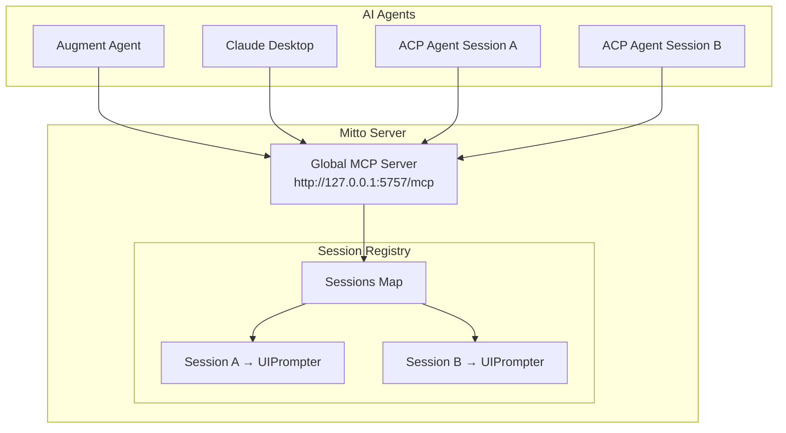
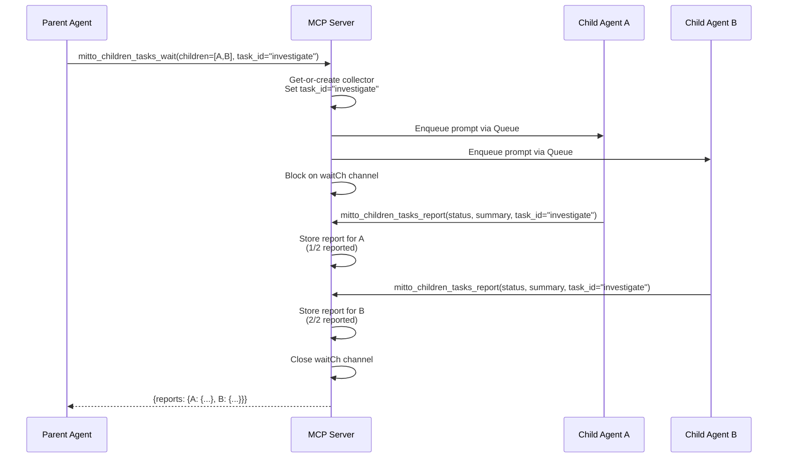
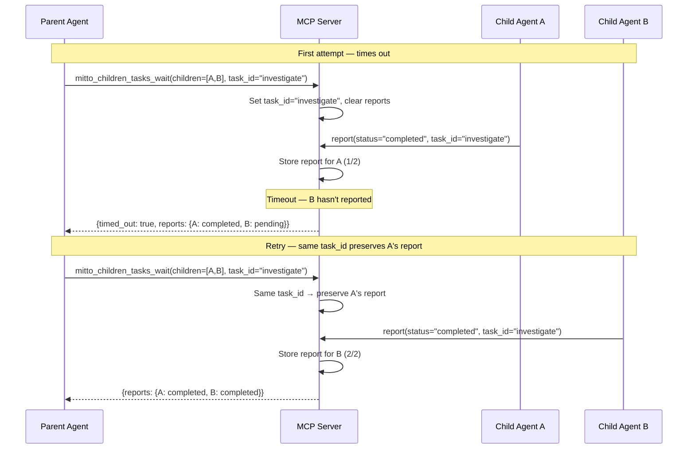
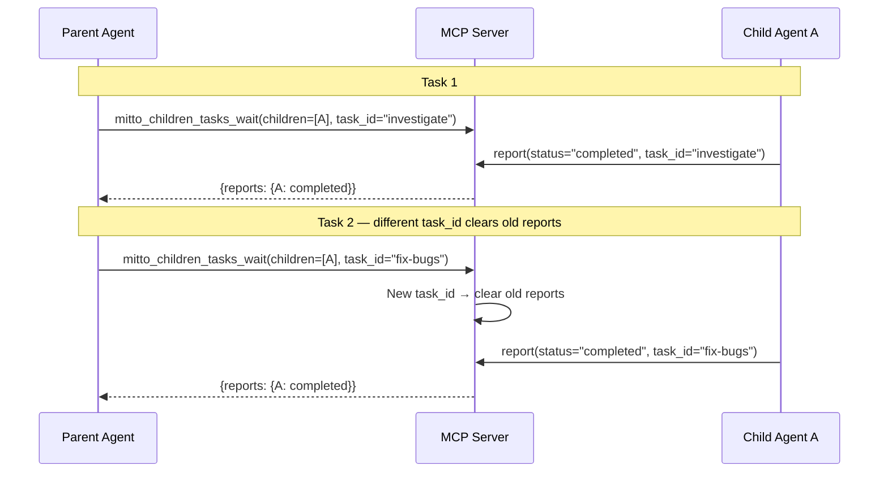
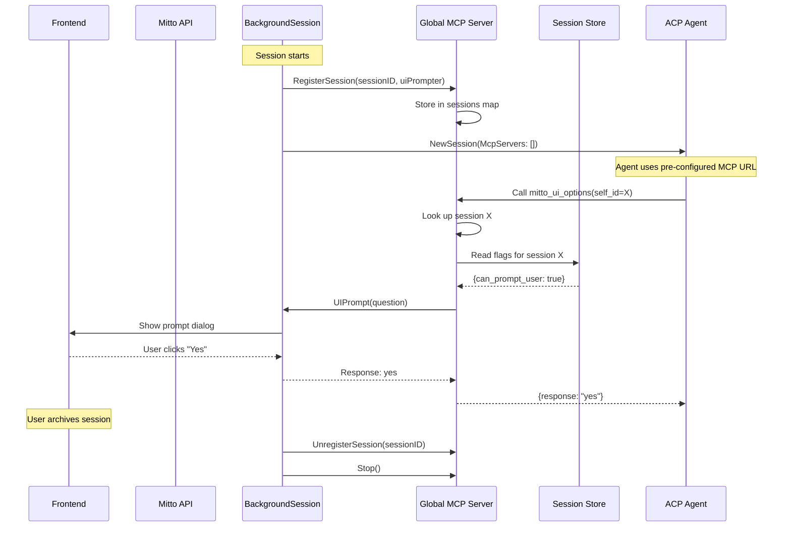
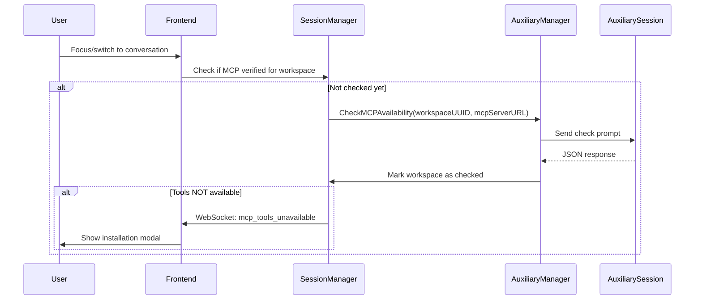

# MCP Server

Mitto provides a **single global MCP (Model Context Protocol) server** that serves both:

1. **Global tools** - Always available tools for debugging (list conversations, get config, runtime info)
2. **Session-scoped tools** - Tools that require a `session_id` parameter and operate on specific conversations

## Architecture Overview


```mermaid
graph TB
    subgraph "AI Agents"
        AUGMENT[Augment Agent]
        CLAUDE[Claude Desktop]
        ACP1[ACP Agent Session A]
        ACP2[ACP Agent Session B]
    end

    subgraph "Mitto Server"
        GLOBAL[Global MCP Server<br/>http://127.0.0.1:5757/mcp]

        subgraph "Session Registry"
            REG[Sessions Map]
            S1[Session A → UIPrompter]
            S2[Session B → UIPrompter]
        end
    end

    AUGMENT --> GLOBAL
    CLAUDE --> GLOBAL
    ACP1 --> GLOBAL
    ACP2 --> GLOBAL
    GLOBAL --> REG
    REG --> S1
    REG --> S2
```

**Key Points:**

- All agents connect to the **same MCP server** at `http://127.0.0.1:5757/mcp`
- Session-scoped tools require a `session_id` parameter to identify the target session
- Sessions register with the MCP server to enable UI prompt routing
- No per-session MCP server spawning (simplified architecture)

## Global MCP Server

The global MCP server serves all agents:

- **Binds to `127.0.0.1:5757`** (localhost only for security)
- **Starts automatically** with the web server
- **Supports two transport modes**: HTTP (Streamable HTTP) and STDIO (subprocess)
- **Exposes both global and session-scoped tools**

## Transport Modes

### HTTP Mode (Default)

Streamable HTTP transport (MCP spec 2025-03-26). The server listens on a TCP port and clients connect via HTTP.

- **URL**: `http://127.0.0.1:5757/mcp`
- **Use case**: When Mitto is running as a web server
- **Protocol**: MCP Streamable HTTP (supports both JSON and SSE responses)

### STDIO Mode

Standard input/output for communication. The MCP server reads JSON-RPC messages from stdin and writes responses to stdout.

- **Use case**: Running the MCP server as a subprocess
- **Configuration**: Set `Mode: "stdio"` in the MCP server config

STDIO mode is useful for:

- Integration with AI agents that spawn MCP servers as subprocesses
- Testing and debugging without network dependencies
- Environments where HTTP is not available

## Available Tools

### Global Tools (No session_id required)

These tools are always available and don't require a session context:

#### `mitto_conversation_list`

Lists all conversations with detailed metadata. **Always available** (no permission check).

**Optional filter parameters** (all omit-able — when not provided, no filtering is applied):

| Parameter      | Type   | Required | Description                              |
| -------------- | ------ | -------- | ---------------------------------------- |
| `working_dir`  | string | No       | Filter by workspace folder (exact match) |
| `archived`     | bool   | No       | Filter by archived status (true/false)   |
| `is_running`   | bool   | No       | Filter by running status (true/false)    |
| `acp_server`   | string | No       | Filter by ACP server name (exact match)  |
| `exclude_self` | string | No       | Exclude this session ID from results     |

**Response fields** (per conversation):

| Field            | Description                               |
| ---------------- | ----------------------------------------- |
| `session_id`     | Unique session identifier                 |
| `title`          | User-friendly session name                |
| `description`    | Session description                       |
| `acp_server`     | ACP server name                           |
| `working_dir`    | Working directory                         |
| `created_at`     | Creation timestamp                        |
| `updated_at`     | Last update timestamp                     |
| `message_count`  | Number of events                          |
| `status`         | Session status (active, completed, error) |
| `archived`       | Whether session is archived               |
| `session_folder` | Full path to session directory            |
| `is_running`     | Whether session is currently active       |
| `is_prompting`   | Whether agent is processing a prompt      |
| `is_locked`      | Whether session is locked                 |
| `lock_status`    | Lock status (idle, processing)            |
| `last_seq`       | Last sequence number                      |

#### `mitto_get_config`

Returns the current effective Mitto configuration (sanitized to exclude sensitive data):

| Field           | Description                           |
| --------------- | ------------------------------------- |
| `acp_servers`   | List of configured ACP servers        |
| `web`           | Web server configuration              |
| `has_prompts`   | Whether global prompts are configured |
| `prompts_count` | Number of global prompts              |
| `session`       | Session storage configuration         |

#### `mitto_get_runtime_info`

Returns runtime information about the Mitto instance:

| Field           | Description                               |
| --------------- | ----------------------------------------- |
| `os`            | Operating system (darwin, linux, windows) |
| `arch`          | CPU architecture                          |
| `num_cpu`       | Number of CPUs                            |
| `hostname`      | Machine hostname                          |
| `pid`           | Process ID                                |
| `executable`    | Path to Mitto executable                  |
| `working_dir`   | Current working directory                 |
| `go_version`    | Go runtime version                        |
| `num_goroutine` | Number of goroutines                      |
| `data_dir`      | Mitto data directory                      |
| `sessions_dir`  | Sessions directory                        |
| `logs_dir`      | Logs directory                            |
| `log_files`     | Paths to log files                        |
| `config_files`  | Paths to configuration files              |

#### `mitto_workspace_list`

Lists all configured workspaces with settings and metadata from `.mittorc` files.

**Optional parameter:**

| Parameter | Type   | Description                                                   |
| --------- | ------ | ------------------------------------------------------------- |
| `filter`  | string | Filter workspaces: `"active"`, `"archived"`, or omit for all |

**Filter values:**

- **`"active"`** — Only workspaces with at least one non-archived conversation
- **`"archived"`** — Only workspaces where all conversations are archived (excludes workspaces with zero conversations)
- **omitted** — All workspaces (default)

**Returns per workspace:**

| Field         | Description                                                              |
| ------------- | ------------------------------------------------------------------------ |
| `uuid`        | Workspace UUID                                                           |
| `name`        | Display name (may be empty)                                              |
| `working_dir` | Absolute path to workspace directory                                     |
| `acp_server`  | ACP server name                                                          |
| `metadata`    | Optional `.mittorc` metadata (description, URL, group, user data schema) |

### Session-Scoped Tools (Require session_id parameter)

These tools operate on a specific conversation and require a `session_id` parameter:

#### `mitto_conversation_get_current`

Get information about the current conversation. Requires `session_id`.

| Parameter    | Type   | Required | Description          |
| ------------ | ------ | -------- | -------------------- |
| `session_id` | string | Yes      | The session to query |

Returns:

| Field           | Description           |
| --------------- | --------------------- |
| `session_id`    | Session identifier    |
| `title`         | Session title         |
| `description`   | Session description   |
| `working_dir`   | Working directory     |
| `created_at`    | Creation timestamp    |
| `updated_at`    | Last update timestamp |
| `message_count` | Number of messages    |
| `status`        | Session status        |

#### `mitto_conversation_get`

Get detailed properties of a specific conversation by ID. Returns metadata, status, and runtime info including whether the agent is currently replying.

| Parameter         | Type   | Required | Description                                                                                                                                                              |
| ----------------- | ------ | -------- | ------------------------------------------------------------------------------------------------------------------------------------------------------------------------ |
| `self_id`         | string | Yes      | YOUR session ID (the caller)                                                                                                                                             |
| `conversation_id` | string | Yes      | Target conversation ID to query                                                                                                                                          |
| `workspace`       | string | No       | Optional workspace UUID. When provided, validates the target conversation belongs to the specified workspace and triggers user confirmation for cross-workspace access. |

Returns (same `ConversationDetails` as `mitto_conversation_get_current`):

| Field               | Description                                   |
| ------------------- | --------------------------------------------- |
| `session_id`        | Session identifier                            |
| `title`             | Session title                                 |
| `description`       | Session description                           |
| `acp_server`        | ACP server name                               |
| `working_dir`       | Working directory                             |
| `created_at`        | Creation timestamp (ISO 8601)                 |
| `updated_at`        | Last update timestamp (ISO 8601)              |
| `message_count`     | Number of messages                            |
| `status`            | Session status                                |
| `archived`          | Whether session is archived                   |
| `session_folder`    | Full path to session directory                |
| `is_running`        | Whether session is currently active           |
| `is_prompting`      | Whether agent is processing a prompt          |
| `is_locked`         | Whether session is locked                     |
| `last_seq`          | Last sequence number                          |
| `parent_session_id` | Parent session ID (if this is a child)        |

#### `mitto_conversation_send_prompt`

Send a prompt to another conversation's queue. Requires `can_send_prompt` flag on the source session.

| Parameter         | Type   | Required | Description                                                                                                                                                              |
| ----------------- | ------ | -------- | ------------------------------------------------------------------------------------------------------------------------------------------------------------------------ |
| `self_id`         | string | Yes      | YOUR session ID (the caller)                                                                                                                                             |
| `conversation_id` | string | Yes      | Target conversation ID                                                                                                                                                   |
| `prompt`          | string | Yes      | The prompt text to send                                                                                                                                                  |
| `workspace`       | string | No       | Optional workspace UUID. When provided, validates the target conversation belongs to the specified workspace and triggers user confirmation for cross-workspace access. |

#### `mitto_conversation_wait`

Wait until something happens in a conversation. Currently supports `agent_responded` — blocks until the agent finishes responding. Returns immediately if the condition is already met (e.g., agent is not currently responding).

| Parameter         | Type   | Required | Description                                                                                                                                                              |
| ----------------- | ------ | -------- | ------------------------------------------------------------------------------------------------------------------------------------------------------------------------ |
| `self_id`         | string | Yes      | YOUR session ID (the caller)                                                                                                                                             |
| `conversation_id` | string | Yes      | Target conversation to wait on                                                                                                                                           |
| `what`            | string | Yes      | Condition to wait for: `"agent_responded"`                                                                                                                               |
| `timeout_seconds` | int    | No       | Timeout in seconds (default: 600)                                                                                                                                        |
| `workspace`       | string | No       | Optional workspace UUID. When provided, validates the target conversation belongs to the specified workspace and triggers user confirmation for cross-workspace access. |

Returns:

| Field       | Description                                            |
| ----------- | ------------------------------------------------------ |
| `success`   | Whether the wait completed successfully                |
| `what`      | The condition that was waited on                       |
| `timed_out` | true if the condition was not met within the timeout   |
| `error`     | Error message if the operation failed                  |

#### `mitto_ui_options`

Present an options menu to the user. Requires `can_prompt_user` flag. Supports up to 20 options,
optional per-option descriptions, and an optional free-text input field.

| Parameter              | Type     | Required | Description                                        |
| ---------------------- | -------- | -------- | -------------------------------------------------- |
| `self_id`              | string   | Yes      | YOUR session ID (the caller)                       |
| `question`             | string   | No       | The question to display (default: "Please select") |
| `options`              | object[] | No       | List of `{label, description}` objects (max 20)    |
| `allow_free_text`      | bool     | No       | Allow user to type a custom response               |
| `free_text_placeholder`| string   | No       | Placeholder text for the free-text input           |
| `timeout_seconds`      | int      | No       | Timeout in seconds (default: 300)                  |

Returns:

| Field      | Description                                      |
| ---------- | ------------------------------------------------ |
| `selected` | Label of the selected option (if option chosen)  |
| `index`    | 0-based index of selected option (-1 if none)    |
| `free_text`| User-typed text (if free text was entered)       |
| `timed_out`| true if no response within timeout               |

#### `mitto_ui_form`

Present a sanitized HTML form to the user and wait for submission. Requires `can_prompt_user` flag.

The HTML is strictly sanitized to allow only form-related elements (input, select, textarea, label,
fieldset, legend, div, span, p, br, hr, headings). Scripts, styles, event handlers, images, links,
iframes, and all other elements are stripped. Submit/cancel buttons are added automatically.
Form values are returned as key-value pairs keyed by each element's `name` attribute.

| Parameter         | Type   | Required | Description                                         |
| ----------------- | ------ | -------- | --------------------------------------------------- |
| `self_id`         | string | Yes      | YOUR session ID (the caller)                        |
| `title`           | string | Yes      | Dialog title shown above the form                   |
| `html`            | string | Yes      | HTML form content (sanitized before rendering)      |
| `timeout_seconds` | int    | No       | Timeout in seconds (default: 600)                   |

Returns:

| Field       | Description                                                |
| ----------- | ---------------------------------------------------------- |
| `submitted` | true if the user submitted the form                        |
| `cancelled` | true if the user clicked Cancel                            |
| `timed_out` | true if no response within timeout                         |
| `values`    | Object of field name → value pairs (when submitted)        |

Supported input types: `text`, `number`, `email`, `url`, `tel`, `password`, `date`, `time`,
`checkbox`, `radio`, `hidden`, `color`, `range`. Checkbox values are returned as `"true"`/`"false"`.
Radio groups return the value of the selected option.

#### `mitto_conversation_new`

Create a new conversation. By default creates it in the same workspace as the calling session. Requires `can_start_conversation` flag.

The new conversation inherits the workspace configuration (ACP server, working directory) from the calling session. This is useful for agents that want to spawn sub-conversations for parallel work or delegate tasks.

| Parameter        | Type   | Required | Description                                                                                                                                                                              |
| ---------------- | ------ | -------- | ---------------------------------------------------------------------------------------------------------------------------------------------------------------------------------------- |
| `self_id`        | string | Yes      | YOUR session ID (the caller)                                                                                                                                                             |
| `title`          | string | No       | Title for the new conversation                                                                                                                                                           |
| `initial_prompt` | string | No       | Initial message to queue for the new session                                                                                                                                             |
| `acp_server`     | string | No       | Optional ACP server name to use (must have a workspace configured for the current folder). Cannot be used together with `workspace`.                                                     |
| `workspace`      | string | No       | Optional workspace UUID. Creates the conversation in the specified workspace instead of the caller's. Cannot be used with `acp_server`. Requires user confirmation for cross-workspace operations. |

**When `workspace` is specified**, the new conversation uses the target workspace's ACP server and working directory. The `acp_server` parameter cannot be used simultaneously — the workspace determines the ACP server.

Returns (embeds `ConversationDetails`):

| Field               | Description                                   |
| ------------------- | --------------------------------------------- |
| `session_id`        | The new conversation's session ID             |
| `title`             | Conversation title (if set)                   |
| `acp_server`        | ACP server URL (inherited from caller)        |
| `working_dir`       | Working directory (inherited from caller)     |
| `created_at`        | Creation timestamp (ISO 8601)                 |
| `message_count`     | Number of messages (typically 0 for new)      |
| `status`            | Current status                                |
| `archived`          | Whether archived (false for new)              |
| `is_running`        | Whether the session is currently active       |
| `is_prompting`      | Whether the agent is currently replying       |
| `parent_session_id` | Parent session ID (the creating session)      |
| `queue_position`    | Queue position if initial prompt was provided |
| `error`             | Error message if creation failed              |

**Safety restriction:** The newly created conversation has its `can_start_conversation` flag explicitly set to `false`, regardless of the parent's permissions. This prevents infinite recursive chains where conversations spawn unlimited child conversations.

**Example use cases:**

- Spawn a sub-agent to work on a specific task in parallel
- Delegate a sub-task to a new conversation
- Create a conversation for follow-up work

#### `mitto_conversation_delete`

Delete (archive) a child conversation. The caller **must** be the parent of the target conversation — this is enforced by checking the `ParentSessionID` field in the child's metadata.

The child conversation is gracefully stopped (waits for any active response to complete) and then archived. Archived conversations are read-only and will no longer accept prompts.

| Parameter         | Type   | Required | Description                      |
| ----------------- | ------ | -------- | -------------------------------- |
| `self_id`         | string | Yes      | Parent session ID (your session) |
| `conversation_id` | string | Yes      | Child conversation ID to delete  |

Returns:

| Field             | Description                      |
| ----------------- | -------------------------------- |
| `success`         | Whether the deletion succeeded   |
| `conversation_id` | The deleted conversation's ID    |
| `error`           | Error message if deletion failed |

**Security:** Only the parent that created the child can delete it. Attempting to delete a conversation that is not your child returns `"permission denied: can only delete your own child conversations"`.

**Example use cases:**

- Clean up child conversations after collecting their results via `mitto_children_tasks_wait`
- Remove failed children before retrying with new instructions
- Tidy up the conversation list after a multi-iteration workflow completes

#### `mitto_conversation_update`

Update properties of a conversation. Supports partial updates — only specified fields are changed, others are left untouched. Any registered session can update any conversation (no parent-child restriction).

| Parameter         | Type                            | Required | Description                                                    |
| ----------------- | ------------------------------- | -------- | -------------------------------------------------------------- |
| `self_id`         | string                          | Yes      | Your session ID                                                |
| `conversation_id` | string                          | Yes      | Target conversation to update                                  |
| `name`            | string                          | No       | New conversation title (omit to leave unchanged)               |
| `user_data`       | `[{name, value}]`               | No       | User data attributes to set (validated against workspace schema) |
| `user_data_merge` | bool                            | No       | If `true` (default), merge with existing attributes; if `false`, replace all |

Returns:

| Field             | Description                                     |
| ----------------- | ----------------------------------------------- |
| `success`         | Whether the update succeeded                    |
| `conversation_id` | The updated conversation's ID                   |
| `updated`         | List of property names that were changed         |
| `name`            | Current name after update                       |
| `user_data`       | Current user data attributes after update       |
| `error`           | Error message if update failed                  |

**User data validation:**

- Values are validated against the workspace schema (`.mittorc` under `metadata.user_data`)
- If the workspace has no schema, any user data update is rejected
- If a field name is not in the schema, the update is rejected
- If a value doesn't match the field type (e.g., invalid URL for `url` type), the update is rejected

**Merge behavior (default):** When `user_data_merge` is `true` (or omitted), existing attributes are preserved and only the specified attributes are added or updated. When `false`, the full attribute set is replaced.

**Example use cases:**

- Rename a conversation from within an agent
- Set or update JIRA ticket, sprint, or branch metadata from within a conversation
- Processors that auto-detect user data values from conversation messages

#### `mitto_children_tasks_wait`

Send a progress inquiry to multiple child conversations and block until all report back. Requires `can_send_prompt` flag on the parent session.

This tool enables parent-child task coordination: a parent spawns children via `mitto_conversation_new`, then later calls this tool to ask all children for a status report and wait for their responses.

| Parameter         | Type     | Required | Description                                                                                                                                                  |
| ----------------- | -------- | -------- | ------------------------------------------------------------------------------------------------------------------------------------------------------------ |
| `self_id`         | string   | Yes      | Parent session ID (your session)                                                                                                                             |
| `children_list`   | string[] | Yes      | List of child conversation IDs to query                                                                                                                      |
| `prompt`          | string   | No       | Custom prompt to send. If empty/omitted, no message is sent (wait-only mode)                                                                                 |
| `timeout_seconds` | int      | No       | Timeout in seconds (default: 600 / 10 min)                                                                                                                   |
| `task_id`         | string   | No       | Task identifier to scope reports. Same task_id across retries preserves already-received reports. A new task_id clears stale reports from the previous task. |

Returns:

| Field       | Description                                                     |
| ----------- | --------------------------------------------------------------- |
| `success`   | Whether the operation succeeded                                 |
| `reports`   | Map of child_id → report info (see below)                       |
| `timed_out` | Whether the wait timed out before all running children reported |
| `warnings`  | Non-fatal issues (e.g., children not running or archived)       |
| `error`     | Error message if the operation failed                           |

Each report in `reports` contains:

| Field       | Description                                                  |
| ----------- | ------------------------------------------------------------ |
| `completed` | Whether the child has reported                               |
| `report`    | The JSON report from the child (flexible schema)             |
| `timestamp` | When the report was received (ISO 8601)                      |
| `status`    | Child status: `"pending"`, `"completed"`, or `"not_running"` |

**Behavior:**

- Each child in `children_list` is validated: must exist and must have `parent_session_id` matching the caller
- Children that are not currently running (closed or archived) are immediately marked as `not_running` in the reports with a warning — they are **not** included in the blocking wait
- If **all** children are not running, the tool returns immediately without blocking
- If a **mix** of running and not-running children exists, the tool blocks only until all running children report back
- The prompt sent to each child includes an instruction to call `mitto_children_tasks_report` with their results
- **Empty prompt = wait-only mode**: If `prompt` is empty or omitted, no message is sent to any child — the tool only waits for reports. This is useful for retrying after a timeout without re-enqueuing duplicate messages
- **Queue deduplication**: Even when a prompt is provided, the tool checks each child's queue before enqueuing. If the child already has a pending (unconsumed) message from this parent, the prompt is skipped for that child to prevent duplicate messages
- **Task-scoped reports**: When `task_id` is provided, reports are scoped to that task. Retrying with the same `task_id` preserves reports already received (children don't need to re-report). Using a different `task_id` clears stale reports from the previous task. The `task_id` is included in the prompt sent to children so they can echo it back in their `mitto_children_tasks_report` call.
- On timeout, partial results are returned (whatever has been received so far)

**Example:**

```
Parent calls:
  mitto_children_tasks_wait(self_id=PARENT, children_list=[CHILD_A, CHILD_B], task_id="investigate-failures")

→ CHILD_A receives: "Please report your progress.\n\nReport your results using mitto_children_tasks_report... You MUST include task_id: "investigate-failures" in your report call."
→ CHILD_B receives the same

CHILD_A calls: mitto_children_tasks_report(self_id=CHILD_A, status="completed", summary="done", details="changed 3 files", task_id="investigate-failures")
CHILD_B calls: mitto_children_tasks_report(self_id=CHILD_B, status="in_progress", summary="60% complete", task_id="investigate-failures")

→ Parent unblocks, receives:
  {
    "success": true,
    "reports": {
      "CHILD_A": {"completed": true, "status": "completed", "report": {"status": "completed", "summary": "done", "details": "changed 3 files"}},
      "CHILD_B": {"completed": true, "status": "completed", "report": {"status": "in_progress", "summary": "60% complete", "details": ""}}
    }
  }

Retry after timeout (same task_id preserves CHILD_A's report):
  mitto_children_tasks_wait(self_id=PARENT, children_list=[CHILD_A, CHILD_B], task_id="investigate-failures")
  → CHILD_A's report is already stored — only waits for CHILD_B
```

#### `mitto_children_tasks_report`

Report results back to a waiting parent conversation. Called by child conversations in response to a `mitto_children_tasks_wait` inquiry from their parent. No special flag required.

| Parameter | Type   | Required | Description                                                                                                                      |
| --------- | ------ | -------- | -------------------------------------------------------------------------------------------------------------------------------- |
| `self_id` | string | Yes      | Child session ID (your session)                                                                                                  |
| `status`  | string | Yes      | Status: e.g. "completed", "in_progress", "failed"                                                                                |
| `summary` | string | Yes      | Brief summary of findings/progress                                                                                               |
| `details` | string | No       | Optional detailed information                                                                                                    |
| `task_id` | string | No       | Task identifier matching the parent's wait call. Include this if the parent provided a `task_id` in `mitto_children_tasks_wait`. |

Returns:

| Field               | Description                                        |
| ------------------- | -------------------------------------------------- |
| `success`           | Whether the report was accepted                    |
| `parent_session_id` | The parent session ID                              |
| `error`             | Error or note (e.g., parent not currently waiting) |

**Behavior:**

- The child's `parent_session_id` is read from its metadata (set when the child was created via `mitto_conversation_new`)
- If the parent is currently waiting (has an active `mitto_children_tasks_wait`), the report is stored and the parent is notified when all children have reported
- If the parent is **not** currently waiting, the tool returns success with a note — this is not an error
- If the child reports multiple times, each report overwrites the previous one
- Sessions without a `parent_session_id` cannot use this tool

### Permission Flags

Session-scoped tools check permissions at runtime:

| Flag                     | Tools That Require It                                                       |
| ------------------------ | --------------------------------------------------------------------------- |
| `can_do_introspection`   | (None currently - for future tools)                                         |
| `can_send_prompt`        | `mitto_conversation_send_prompt`, `mitto_children_tasks_wait`               |
| `can_prompt_user`        | `mitto_ui_options`, `mitto_ui_textbox`, `mitto_ui_form`                                         |
| `can_start_conversation` | `mitto_conversation_new`                                                    |
| `can_interact_other_workspaces` | `mitto_conversation_new`, `mitto_conversation_get`, `mitto_conversation_send_prompt`, `mitto_conversation_wait` (only when `workspace` parameter targets a different workspace) |

**Note:** `mitto_conversation_list` is **always available** (no permission check).
`mitto_conversation_get_current`, `mitto_conversation_get`, `mitto_conversation_wait`, and `mitto_conversation_update` require the session to be registered (running) but no flag check.
Cross-workspace operations require the `can_interact_other_workspaces` flag AND user confirmation. The confirmation dialog is NOT gated by `can_prompt_user` — it is a mandatory security gate.

## Configuring AI Agents

### Augment Code (Auggie)

Add to your Augment settings (`.augment/config.json` or VS Code settings):

```json
{
  "augment.mcpServers": {
    "mitto-debug": {
      "url": "http://127.0.0.1:5757/mcp"
    }
  }
}
```

### Claude Desktop

Add to `~/Library/Application Support/Claude/claude_desktop_config.json` (macOS) or `%APPDATA%\Claude\claude_desktop_config.json` (Windows):

```json
{
  "mcpServers": {
    "mitto-debug": {
      "url": "http://127.0.0.1:5757/mcp"
    }
  }
}
```

### Claude Code (CLI)

Add to your Claude Code configuration:

```json
{
  "mcpServers": {
    "mitto-debug": {
      "url": "http://127.0.0.1:5757/mcp"
    }
  }
}
```

### Cursor

Add to Cursor settings (`.cursor/mcp.json`):

```json
{
  "mcpServers": {
    "mitto-debug": {
      "url": "http://127.0.0.1:5757/mcp"
    }
  }
}
```

### Generic MCP Client (HTTP Mode)

For any MCP-compatible client using Streamable HTTP transport:

- **URL**: `http://127.0.0.1:5757/mcp`
- **Transport**: Streamable HTTP (MCP spec 2025-03-26)

### STDIO Mode Configuration

For agents that spawn MCP servers as subprocesses, you can run Mitto's MCP server in STDIO mode. This requires a separate command that starts only the MCP server.

**Claude Desktop (STDIO)**:

```json
{
  "mcpServers": {
    "mitto-debug": {
      "command": "mitto",
      "args": ["mcp", "--stdio"]
    }
  }
}
```

**Cursor (STDIO)**:

```json
{
  "mcpServers": {
    "mitto-debug": {
      "command": "mitto",
      "args": ["mcp", "--stdio"]
    }
  }
}
```

> **Note**: The `mitto mcp` command is a standalone MCP server mode. See the CLI documentation for details.

## Example Usage

Once configured, you can ask the AI agent to debug Mitto issues:

> "Use the mitto-debug MCP server to list all conversations and find any that are stuck in prompting state"

> "Get the runtime info from Mitto and tell me where the log files are located"

> "Check the Mitto configuration and verify the ACP servers are properly configured"

## Debugging Workflow

### 1. Get Runtime Information

Start by calling `mitto_get_runtime_info` to locate important files:

```
Log files:
- mitto.log: ~/Library/Logs/Mitto/mitto.log
- access.log: ~/Library/Logs/Mitto/access.log
- webview.log: ~/Library/Logs/Mitto/webview.log

Sessions: ~/Library/Application Support/Mitto/sessions/
```

### 2. List Conversations

Call `mitto_conversation_list` to find the session you're debugging:

```
Session: 20260211-143052-a1b2c3d4
  Title: "Debug session"
  Folder: ~/Library/Application Support/Mitto/sessions/20260211-143052-a1b2c3d4
  Messages: 42
  Status: active
  Is Prompting: false
```

### 3. Inspect Session Files

Each session folder contains:

| File            | Description                       |
| --------------- | --------------------------------- |
| `events.jsonl`  | All session events (JSONL format) |
| `metadata.json` | Session metadata                  |
| `lock.json`     | Lock information (if locked)      |
| `queue.json`    | Message queue state               |

### 4. Analyze Events

The `events.jsonl` file contains all events with sequence numbers:

```jsonl
{"seq":1,"type":"session_start","timestamp":"2026-02-11T14:30:52Z","data":{...}}
{"seq":2,"type":"user_prompt","timestamp":"2026-02-11T14:30:55Z","data":{"message":"Hello"}}
{"seq":3,"type":"agent_message","timestamp":"2026-02-11T14:30:57Z","data":{"html":"<p>Hi!</p>"}}
```

### 5. Check Logs

Use the log file paths from `mitto_get_runtime_info`:

- **mitto.log**: Backend errors, sequence numbers, event persistence
- **access.log**: Authentication, security events
- **webview.log**: Frontend JavaScript errors, WebSocket issues

## Cross-Workspace Operations

Four tools support an optional `workspace` parameter (UUID string) for operating across workspace boundaries:

- `mitto_conversation_new` — Create conversations in a different workspace
- `mitto_conversation_get` — View conversations from another workspace
- `mitto_conversation_send_prompt` — Send prompts to conversations in another workspace
- `mitto_conversation_wait` — Wait on conversations in another workspace

### User Confirmation

Cross-workspace operations require explicit user approval via a blocking UI confirmation dialog:

```
Conversation "MySession" wants to create a new conversation in workspace "other-project" (/path/to/other). Allow?
  • Yes
  • No
```

Key behaviors:

- **Same-workspace optimization**: If the workspace UUID matches the caller's workspace, no confirmation is needed and the tool proceeds directly
- **Headless mode**: Cross-workspace operations fail in headless/CLI mode (no UI to show confirmation)
- **Permission flag**: Cross-workspace operations require the `can_interact_other_workspaces` flag to be enabled on the calling session. This check occurs before the user confirmation dialog. The flag defaults to `false` (disabled).
- **Security bypass prevention**: The confirmation does NOT require the `can_prompt_user` flag — it is a mandatory security gate that cannot be bypassed by flag configuration
- **Timeout**: The confirmation dialog times out after 60 seconds; on timeout the operation is denied

### Workspace Resolution

Use `mitto_workspace_list` to discover available workspace UUIDs. The `workspace` parameter accepts the UUID returned in the `uuid` field of that tool's response.

### Restrictions

- `mitto_conversation_new`: Cannot specify both `workspace` and `acp_server` — the workspace determines the ACP server and working directory automatically
- `mitto_conversation_get`, `mitto_conversation_send_prompt`, `mitto_conversation_wait`: The target conversation must belong to the specified workspace (validated by `working_dir` match); mismatches return an error

---

## Security

The MCP server binds only to `127.0.0.1` (localhost) and cannot be accessed from other machines. This is intentional for security:

- No authentication required (localhost only)
- Exposes internal state for debugging
- Should not be exposed to the network

## Implementation

The MCP server is implemented in `internal/mcpserver/`:

| File           | Purpose                                                     |
| -------------- | ----------------------------------------------------------- |
| `server.go`    | Global MCP server with both global and session-scoped tools |
| `types.go`     | Response types and helper functions                         |
| `ui_prompt.go` | UI prompt types and interfaces                              |

The server uses the [MCP Go SDK](https://github.com/modelcontextprotocol/go-sdk) with Streamable HTTP transport.

### Parent-Child Task Coordination

The coordination between parent and child conversations uses an in-memory `childReportCollector` on the `Server` struct. Each parent session gets a collector that lives as long as the parent session is registered.

**Each `_wait` call starts a fresh collection cycle** — all previously stored reports are cleared. This ensures each iteration of the parent's workflow gets clean results from its children, rather than seeing stale reports from a previous round.

#### Scenario 1: Parent waits, children report during wait


```mermaid
sequenceDiagram
    participant Parent as Parent Agent
    participant MCP as MCP Server
    participant Child1 as Child Agent A
    participant Child2 as Child Agent B

    Parent->>MCP: mitto_children_tasks_wait(children=[A,B], task_id="investigate")
    MCP->>MCP: Get-or-create collector<br/>Set task_id="investigate"
    MCP->>Child1: Enqueue prompt via Queue
    MCP->>Child2: Enqueue prompt via Queue
    MCP->>MCP: Block on waitCh channel

    Child1->>MCP: mitto_children_tasks_report(status, summary, task_id="investigate")
    MCP->>MCP: Store report for A<br/>(1/2 reported)

    Child2->>MCP: mitto_children_tasks_report(status, summary, task_id="investigate")
    MCP->>MCP: Store report for B<br/>(2/2 reported)
    MCP->>MCP: Close waitCh channel

    MCP-->>Parent: {reports: {A: {...}, B: {...}}}
```

#### Scenario 2: Retry after timeout (same task_id preserves reports)


```mermaid
sequenceDiagram
    participant Parent as Parent Agent
    participant MCP as MCP Server
    participant Child1 as Child Agent A
    participant Child2 as Child Agent B

    Note over Parent,Child2: First attempt — times out
    Parent->>MCP: mitto_children_tasks_wait(children=[A,B], task_id="investigate")
    MCP->>MCP: Set task_id="investigate", clear reports
    Child1->>MCP: report(status="completed", task_id="investigate")
    MCP->>MCP: Store report for A (1/2)
    Note over MCP: Timeout — B hasn't reported
    MCP-->>Parent: {timed_out: true, reports: {A: completed, B: pending}}

    Note over Parent,Child2: Retry — same task_id preserves A's report
    Parent->>MCP: mitto_children_tasks_wait(children=[A,B], task_id="investigate")
    MCP->>MCP: Same task_id → preserve A's report
    Child2->>MCP: report(status="completed", task_id="investigate")
    MCP->>MCP: Store report for B (2/2)
    MCP-->>Parent: {reports: {A: completed, B: completed}}
```

#### Scenario 3: New task clears old reports


```mermaid
sequenceDiagram
    participant Parent as Parent Agent
    participant MCP as MCP Server
    participant Child1 as Child Agent A

    Note over Parent,Child1: Task 1
    Parent->>MCP: mitto_children_tasks_wait(children=[A], task_id="investigate")
    Child1->>MCP: report(status="completed", task_id="investigate")
    MCP-->>Parent: {reports: {A: completed}}

    Note over Parent,Child1: Task 2 — different task_id clears old reports
    Parent->>MCP: mitto_children_tasks_wait(children=[A], task_id="fix-bugs")
    MCP->>MCP: New task_id → clear old reports
    Child1->>MCP: report(status="completed", task_id="fix-bugs")
    MCP-->>Parent: {reports: {A: completed}}
```

**Key design decisions:**

- **Task-scoped reports**: Reports are scoped by `task_id`. When the parent retries with the same `task_id`, existing reports are preserved — children that already reported don't need to re-report. When the `task_id` changes, stale reports from the previous task are cleared.
- **Pre-wait reports preserved**: If a child reports with a `task_id` before the parent starts waiting with the same `task_id`, the report is preserved and the wait returns immediately for that child.
- **Collector lifecycle**: The `childReportCollector` itself persists for the parent session's lifetime (cleaned up on `UnregisterSession`), but its contents are scoped by `task_id`.
- **Go channel signaling**: The collector uses a `waitCh` channel (created per `_wait` call) that is closed when all waited-on children have reported. The channel is cleared (`clearWait`) when the wait returns.
- **Thread-safe**: `childReportCollector.mu` protects the reports map and wait signaling; `Server.childReportCollectorsMu` protects the collectors map.
- **Closed children handling**: Children not registered with the MCP server (closed/archived) are detected before blocking. They appear as `status: "not_running"` in reports with warnings. If all children are closed, the tool returns immediately.
- **Idempotent reports**: A child can report multiple times during a single wait cycle; each report overwrites the previous one.
- **Reports between waits are stored**: If a child calls `_report` when no wait is active, the report is accepted and stored. It will be available when the parent next calls `_wait` with the same `task_id`.

---

## Session Registration

Sessions register with the global MCP server to enable session-scoped tools. This allows:

- UI prompts to be routed to the correct session
- Permission checks based on each session's flags
- Session context for tools like `mitto_conversation_get_current`

### How It Works

1. **Session Start**: When a session is created or resumed:
   - `BackgroundSession` calls `globalMcpServer.RegisterSession(sessionID, uiPrompter, logger)`
   - The session's `UIPrompter` is stored for routing UI prompts
   - **No MCP servers are passed to ACP** - the agent should have MCP pre-configured globally

2. **Tool Execution**: When an agent calls a session-scoped tool:
   - The `session_id` parameter identifies the target session
   - The handler validates the session is registered
   - Permission flags are read from the session metadata
   - UI prompts are routed to the session's `UIPrompter`

3. **Session Stop**: When a session is archived or stopped:
   - `BackgroundSession` calls `globalMcpServer.UnregisterSession(sessionID)`
   - Tools for that session will return "session not found" errors
   - Any `childReportCollector` for this session (as parent) is cleaned up


```mermaid
sequenceDiagram
    participant FE as Frontend
    participant API as Mitto API
    participant BS as BackgroundSession
    participant MCP as Global MCP Server
    participant Store as Session Store
    participant ACP as ACP Agent

    Note over BS: Session starts
    BS->>MCP: RegisterSession(sessionID, uiPrompter)
    MCP->>MCP: Store in sessions map
    BS->>ACP: NewSession(McpServers: [])
    Note over ACP: Agent uses pre-configured MCP URL

    ACP->>MCP: Call mitto_ui_options(self_id=X)
    MCP->>MCP: Look up session X
    MCP->>Store: Read flags for session X
    Store-->>MCP: {can_prompt_user: true}
    MCP->>BS: UIPrompt(question)
    BS->>FE: Show prompt dialog
    FE-->>BS: User clicks "Yes"
    BS-->>MCP: Response: yes
    MCP-->>ACP: {response: "yes"}

    Note over FE: User archives session
    BS->>MCP: UnregisterSession(sessionID)
    BS->>MCP: Stop()
```

### Security Considerations

| Concern                    | Mitigation                                                         |
| -------------------------- | ------------------------------------------------------------------ |
| **Information disclosure** | Permission flags default to `false`; requires explicit opt-in      |
| **Session spoofing**       | Session must be registered; unregistered sessions return errors    |
| **Cross-session access**   | Intentional via `session_id` param; user enables flags per session |
| **Network exposure**       | MCP server binds to `127.0.0.1` only                               |

### Code Structure

```go
// internal/mcpserver/server.go

// RegisterSession registers a session with the MCP server.
// This enables session-scoped tools to route UI prompts to the correct session.
func (s *Server) RegisterSession(sessionID string, uiPrompter UIPrompter, logger *slog.Logger) error

// UnregisterSession removes a session from the MCP server.
func (s *Server) UnregisterSession(sessionID string)

// getSession returns the registered session for routing.
func (s *Server) getSession(sessionID string) *registeredSession

// checkSessionFlag checks if a flag is enabled for the given session.
func (s *Server) checkSessionFlag(sessionID string, flagName string) bool
```

### Adding New Session-Scoped Tools

1. **Define the flag** (if needed) in `internal/session/flags.go`:

```go
const FlagNewFeature = "new_feature"

var AvailableFlags = []FlagDefinition{
    // ...existing flags...
    {
        Name:        FlagNewFeature,
        Label:       "New Feature",
        Description: "Description of what this enables",
        Default:     false,
    },
}
```

2. **Add input type and handler** in `internal/mcpserver/server.go`:

```go
// Input type with session_id parameter
type MyNewToolInput struct {
    SessionID string `json:"session_id"`
    // ... other parameters
}

func (s *Server) handleMyNewTool(
    ctx context.Context,
    req *mcp.CallToolRequest,
    input MyNewToolInput,
) (*mcp.CallToolResult, MyToolOutput, error) {
    // 1. Validate session_id
    if input.SessionID == "" {
        return nil, MyToolOutput{}, fmt.Errorf("session_id is required")
    }

    // 2. Check if session is registered
    reg := s.getSession(input.SessionID)
    if reg == nil {
        return nil, MyToolOutput{}, fmt.Errorf("session not found or not running: %s", input.SessionID)
    }

    // 3. Check permissions (if flag required)
    if !s.checkSessionFlag(input.SessionID, session.FlagNewFeature) {
        return nil, MyToolOutput{}, permissionError("my_new_tool", session.FlagNewFeature, "New Feature")
    }

    // 4. Implement the tool
    return nil, output, nil
}
```

---

## MCP Availability Checking

Mitto can verify that its MCP tools are available in the user's ACP server (e.g.,
Claude Desktop). This helps users discover and install the Mitto MCP server.

### How It Works

- **Purpose constant**: `PurposeMCPCheck = "mcp-check"`
- **Scope**: One auxiliary session per workspace, results cached
- **Trigger**: User focuses or switches to a conversation (once per workspace per server session)


```mermaid
sequenceDiagram
    participant User
    participant Frontend
    participant SessionManager
    participant AuxiliaryManager
    participant AuxiliarySession

    User->>Frontend: Focus/switch to conversation
    Frontend->>SessionManager: Check if MCP verified for workspace
    alt Not checked yet
        SessionManager->>AuxiliaryManager: CheckMCPAvailability(workspaceUUID, mcpServerURL)
        AuxiliaryManager->>AuxiliarySession: Send check prompt
        AuxiliarySession-->>AuxiliaryManager: JSON response
        AuxiliaryManager->>SessionManager: Mark workspace as checked
        alt Tools NOT available
            SessionManager->>Frontend: WebSocket: mcp_tools_unavailable
            Frontend->>User: Show installation modal
        end
    end
```

The auxiliary session asks the agent to check for `mitto_conversation_get_current`
and respond with JSON indicating availability, an optional install command
(`suggested_run`), and optional instructions (`suggested_instructions`, max 500 chars).

### WebSocket Messages

**`mcp_tools_unavailable`** (Server → Frontend) — sent when tools are not available:

```json
{
  "type": "mcp_tools_unavailable",
  "workspace_uuid": "...",
  "suggested_run": "command",
  "suggested_instructions": "instructions"
}
```

**`run_mcp_install_command`** (Frontend → Server) — sent when user confirms install:

```json
{
  "type": "run_mcp_install_command",
  "command": "..."
}
```

### UI Behavior

| Scenario                      | UI                                                                            |
| ----------------------------- | ----------------------------------------------------------------------------- |
| `suggested_run` provided      | Modal with command in code block + "Yes, run command" / "No, dismiss" buttons |
| Only `suggested_instructions` | Modal with instructions + "Dismiss" button                                    |
| Neither provided              | Warning: "Mitto MCP tools are not available. Some features may not work."     |

### Caching

**Session-level** (`SessionManager.mcpCheckedWorkspaces`): Tracks which workspaces
have been checked. Prevents repeated prompts during the same session. Cleared when
user runs install command or session restarts.

**Result-level** (`WorkspaceAuxiliaryManager.mcpCheckCache`): Stores actual check
results. Prevents repeated auxiliary prompts. Cleared via
`ClearMCPCheckCache(workspaceUUID)` or after running install command.

### API

```go
// Check MCP availability (with caching)
result, err := mgr.CheckMCPAvailability(ctx, workspaceUUID, mcpServerURL)
mgr.ClearMCPCheckCache(workspaceUUID) // Force re-check

// Session-level tracking
sm.IsMCPChecked(workspaceUUID)    // Has workspace been checked?
sm.MarkMCPChecked(workspaceUUID)  // Mark as checked
sm.ClearMCPChecked(workspaceUUID) // Clear (after installation)
```

### Implementation Status

| Status | Item                                                                   |
| ------ | ---------------------------------------------------------------------- |
| ✅     | Purpose constant, prompt template, `MCPAvailabilityResult` struct      |
| ✅     | `CheckMCPAvailability()` with caching and JSON parsing                 |
| ✅     | WebSocket message type definitions, SessionManager tracking            |
| ⏳     | WebSocket integration (trigger on conversation focus)                  |
| ⏳     | Command execution handler, frontend UI, cache clearing after execution |

---

## Advanced Settings (Feature Flags)

Sessions can have per-conversation feature flags stored in their metadata:

```json
{
  "session_id": "20260217-143052-a1b2c3d4",
  "advanced_settings": {
    "can_do_introspection": true
  }
}
```

### API Endpoints

| Method  | Endpoint                      | Description                            |
| ------- | ----------------------------- | -------------------------------------- |
| `GET`   | `/api/advanced-flags`         | List all available flags with defaults |
| `GET`   | `/api/sessions/{id}/settings` | Get current settings for a session     |
| `PATCH` | `/api/sessions/{id}/settings` | Partial update of settings             |

### Available Flags

| Flag                       | Default | Description                                                                    |
| -------------------------- | ------- | ------------------------------------------------------------------------------ |
| `can_do_introspection`     | `false` | Allow ACP agent to access Mitto's MCP tools                                    |
| `can_send_prompt`          | `false` | Allow sending prompts to other conversations                                   |
| `can_prompt_user`          | `true`  | Allow displaying interactive UI prompts                                        |
| `can_start_conversation`   | `false` | Allow creating new conversations in the same workspace                         |
| `auto_approve_permissions` | `false` | Auto-approve all permission requests (file writes, commands) without prompting |

### Checking Flags in Code

```go
import "github.com/inercia/mitto/internal/session"

// Get flag value with default fallback
enabled := session.GetFlagValue(meta.AdvancedSettings, session.FlagCanDoIntrospection)

// Get just the default
defaultVal := session.GetFlagDefault(session.FlagCanDoIntrospection)
```

### Adding New Flags

1. Add constant and definition in `internal/session/flags.go`
2. Implement behavior that checks the flag
3. Frontend will automatically show the flag in settings (when UI is implemented)
