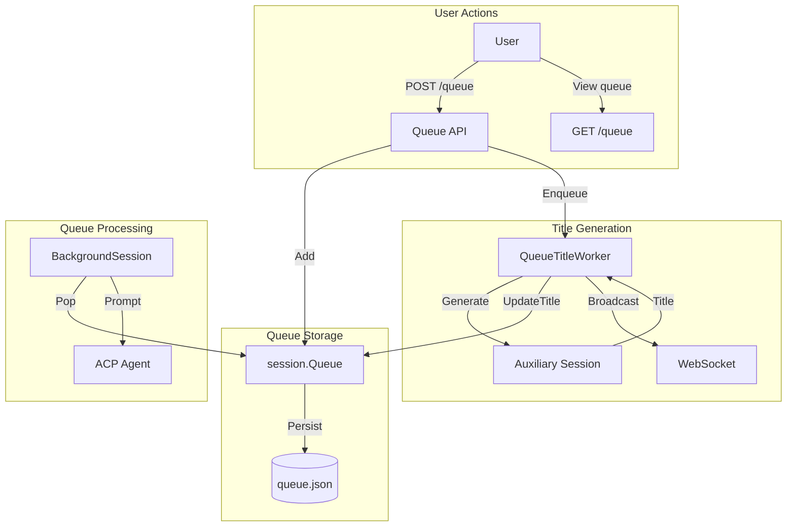
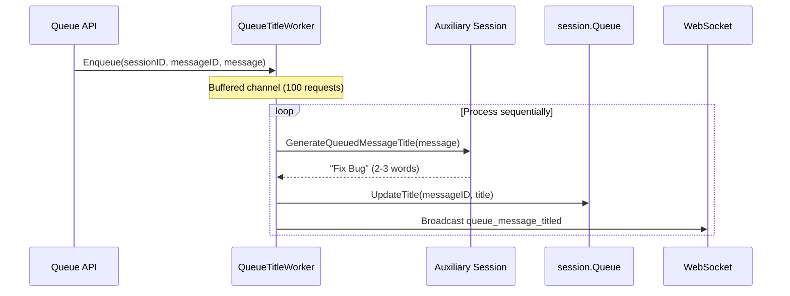
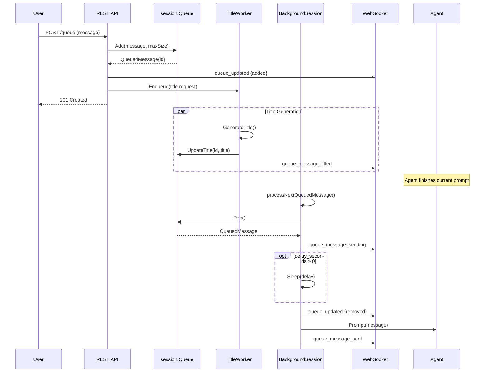

# Message Queue System

This document covers the message queue architecture, including queue management, automatic title generation, and WebSocket notifications.

## Overview

The queue system allows users to send messages while the agent is busy. Messages are queued and automatically delivered when the agent becomes idle. Each queued message can have an auto-generated title for easy identification.



## Configuration

Queue behavior is configured globally or per-workspace (NOT per-session):

```yaml
conversations:
  queue:
    enabled: true # Auto-process queued messages (default: true)
    delay_seconds: 0 # Delay before sending next message (default: 0)
    max_size: 10 # Maximum messages in queue (default: 10)
    auto_generate_titles: true # Generate short titles (default: true)
```

### Configuration Scope

| Setting                | Scope            | Rationale                                  |
| ---------------------- | ---------------- | ------------------------------------------ |
| `enabled`              | Global/Workspace | Consistent behavior across sessions        |
| `delay_seconds`        | Global/Workspace | Rate limiting applies uniformly            |
| `max_size`             | Global/Workspace | Resource limits are workspace-wide         |
| `auto_generate_titles` | Global/Workspace | Feature toggle, not per-session preference |

## Queue Package (`internal/session/queue.go`)

### Types

```go
// QueuedMessage represents a message waiting to be sent to the agent.
type QueuedMessage struct {
    ID       string    `json:"id"`                   // Unique ID (q-{timestamp}-{random})
    Message  string    `json:"message"`              // Text content
    ImageIDs []string  `json:"image_ids,omitempty"`  // Attached images
    QueuedAt time.Time `json:"queued_at"`            // When queued
    ClientID string    `json:"client_id,omitempty"`  // Source client
    Title    string    `json:"title,omitempty"`      // Auto-generated title
}

// Queue manages the message queue for a single session.
// Thread-safe with atomic file persistence.
type Queue struct { ... }
```

### Methods

| Method                                      | Description                                        |
| ------------------------------------------- | -------------------------------------------------- |
| `Add(message, imageIDs, clientID, maxSize)` | Add message, returns `ErrQueueFull` if at capacity |
| `List()`                                    | Get all messages in FIFO order                     |
| `Get(id)`                                   | Get specific message by ID                         |
| `Remove(id)`                                | Remove specific message                            |
| `Pop()`                                     | Remove and return first message                    |
| `Clear()`                                   | Remove all messages                                |
| `Len()`                                     | Get queue length                                   |
| `UpdateTitle(id, title)`                    | Update a message's title                           |

### Error Values

| Error                | Condition                                               |
| -------------------- | ------------------------------------------------------- |
| `ErrQueueEmpty`      | `Pop()` on empty queue                                  |
| `ErrMessageNotFound` | `Get()`, `Remove()`, or `UpdateTitle()` with invalid ID |
| `ErrQueueFull`       | `Add()` when queue has `maxSize` messages               |

## Title Generation

### Architecture



### Components

| Component                    | File                           | Purpose                      |
| ---------------------------- | ------------------------------ | ---------------------------- |
| `QueueTitleWorker`           | `internal/web/queue_title.go`  | Sequential request processor |
| `GenerateQueuedMessageTitle` | `internal/auxiliary/global.go` | Prompt for title generation  |
| `Queue.UpdateTitle`          | `internal/session/queue.go`    | Persist title to queue.json  |

### QueueTitleWorker

The worker processes title requests sequentially to avoid overwhelming the auxiliary conversation:

```go
// Create worker (done in Server initialization)
worker := NewQueueTitleWorker(store, logger)
worker.OnTitleGenerated = func(sessionID, messageID, title string) {
    // Broadcast to WebSocket clients
}

// Enqueue request (non-blocking)
worker.Enqueue(QueueTitleRequest{
    SessionID: sessionID,
    MessageID: msg.ID,
    Message:   message,
})

// Shutdown (waits for pending requests)
worker.Close()
```

**Design decisions:**

- **Sequential processing**: Prevents concurrent auxiliary requests
- **Buffered channel (100)**: Drops requests if overwhelmed (logs warning)
- **30-second timeout**: Per-request timeout for title generation
- **Graceful shutdown**: Waits for in-flight request to complete

## REST API

### Endpoints

| Method   | Path                                | Description              |
| -------- | ----------------------------------- | ------------------------ |
| `GET`    | `/api/sessions/{id}/queue`          | List all queued messages |
| `POST`   | `/api/sessions/{id}/queue`          | Add message to queue     |
| `GET`    | `/api/sessions/{id}/queue/{msg_id}` | Get specific message     |
| `DELETE` | `/api/sessions/{id}/queue/{msg_id}` | Delete specific message  |
| `DELETE` | `/api/sessions/{id}/queue`          | Clear entire queue       |

### Request/Response Examples

**POST /api/sessions/{id}/queue**

```json
// Request
{"message": "Fix the login bug", "image_ids": []}

// Response (201 Created)
{
  "id": "q-1738396800-abc12345",
  "message": "Fix the login bug",
  "queued_at": "2026-02-01T12:00:00Z",
  "title": ""  // Initially empty, updated asynchronously
}
```

**GET /api/sessions/{id}/queue** (after title generated)

```json
{
  "messages": [
    {
      "id": "q-1738396800-abc12345",
      "message": "Fix the login bug",
      "queued_at": "2026-02-01T12:00:00Z",
      "title": "Login Bug Fix"
    }
  ],
  "count": 1
}
```

**Error: Queue Full (409 Conflict)**

```json
{
  "error": "queue_full",
  "message": "Queue is full. Maximum 10 messages allowed."
}
```

## WebSocket Notifications

### Message Types

| Type                    | Direction       | Description                 |
| ----------------------- | --------------- | --------------------------- |
| `queue_updated`         | Server → Client | Queue state changed         |
| `queue_message_sending` | Server → Client | Message about to be sent    |
| `queue_message_sent`    | Server → Client | Message delivered to agent  |
| `queue_message_titled`  | Server → Client | Title generated for message |

### Payload Examples

**queue_updated**

```json
{
  "type": "queue_updated",
  "data": {
    "session_id": "20260201-120000-abc12345",
    "queue_length": 3,
    "action": "added", // "added", "removed", "cleared"
    "message_id": "q-1738396800-abc12345"
  }
}
```

**queue_message_titled**

```json
{
  "type": "queue_message_titled",
  "data": {
    "session_id": "20260201-120000-abc12345",
    "message_id": "q-1738396800-abc12345",
    "title": "Login Bug Fix"
  }
}
```

## Queue Processing Flow



## File Storage

### Location

```
sessions/
└── {session_id}/
    ├── events.jsonl      # Event log (append-only)
    ├── metadata.json     # Session metadata
    └── queue.json        # Message queue (transient)
```

### queue.json Format

```json
{
  "messages": [
    {
      "id": "q-1738396800-abc12345",
      "message": "Fix the login bug",
      "image_ids": [],
      "queued_at": "2026-02-01T12:00:00Z",
      "client_id": "web-client-1",
      "title": "Login Bug Fix"
    }
  ],
  "updated_at": "2026-02-01T12:00:05Z"
}
```

### Design Decisions

1. **Separate file**: Queue is transient (messages removed when processed), unlike append-only events
2. **Atomic writes**: Uses `fileutil.WriteJSONAtomic()` to prevent corruption
3. **Title in queue**: Stored with message for persistence across server restarts

## Automatic Queue Dequeuing

The queue system supports automatic dequeuing for idle agent sessions:

### Behavior

1. **After prompt completion**: When the agent finishes responding, `processNextQueuedMessage()` is called automatically, which pops the next message from the queue and sends it (applying the configured delay first).

2. **On server startup**: `ProcessPendingQueues()` checks all persisted sessions for queued messages. For sessions with pending items, it:
   - Resumes the session (starts ACP process)
   - Sends the first queued message immediately (delay is skipped because `lastResponseComplete` is zero for freshly resumed sessions)

3. **Delay handling**: The `delay_seconds` configuration controls how long to wait:
   - **Normal flow**: After a prompt completes, sleep for `delay_seconds` before sending the next queued message
   - **Startup flow**: On startup, the delay is skipped for the first message because `lastResponseComplete` is zero (no previous response yet)

### Methods

| Method                       | Location            | Purpose                                                         |
| ---------------------------- | ------------------- | --------------------------------------------------------------- |
| `processNextQueuedMessage()` | `BackgroundSession` | Called after prompt completion, applies delay synchronously     |
| `TryProcessQueuedMessage()`  | `BackgroundSession` | Used for startup/periodic checking, respects delay elapsed time |
| `ProcessPendingQueues()`     | `SessionManager`    | Called on server startup, resumes sessions with queued items    |

## Frontend Integration

### State Management

The frontend tracks queue state via `useWebSocket` hook:

```javascript
const {
  queueLength, // Current queue size
  queueConfig, // { enabled, max_size, delay_seconds }
} = useWebSocket();
```

### Queue Full Prevention

`ChatInput` component prevents sending when queue is full:

```javascript
const isQueueFull = isStreaming && queueLength >= queueConfig.max_size;

// Show error if user tries to send
if (isQueueFull) {
  setSendError(
    `Queue is full (${queueConfig.max_size}/${queueConfig.max_size})`,
  );
  return;
}
```

### Title Update Handling

```javascript
case "queue_message_titled":
  console.log(`Queue message titled: ${msg.data?.message_id} -> "${msg.data?.title}"`);
  // Future: Update queue management UI
  break;
```

## Thread Safety

| Component           | Mechanism        | Notes                            |
| ------------------- | ---------------- | -------------------------------- |
| `Queue`             | `sync.Mutex`     | Protects read-modify-write cycle |
| `QueueTitleWorker`  | Buffered channel | Sequential processing            |
| `BackgroundSession` | Observer pattern | Thread-safe notifications        |

## Related Documentation

- [Session Management](session-management.md) - Session lifecycle and state ownership
- [WebSocket Documentation](websockets/) - WebSocket protocol details
- [Architecture](architecture.md) - Overall system architecture
