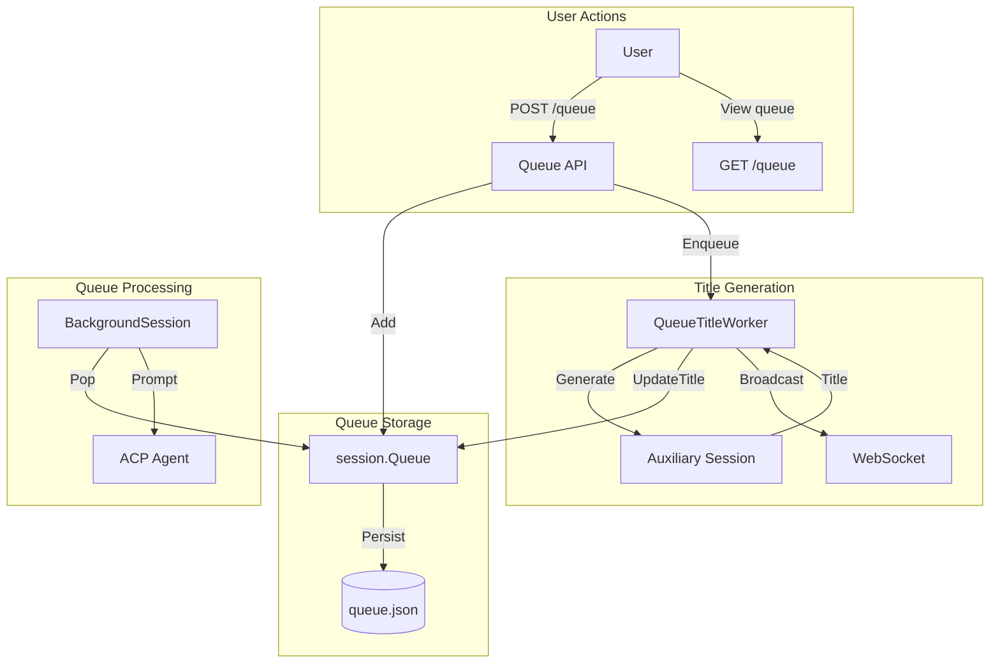
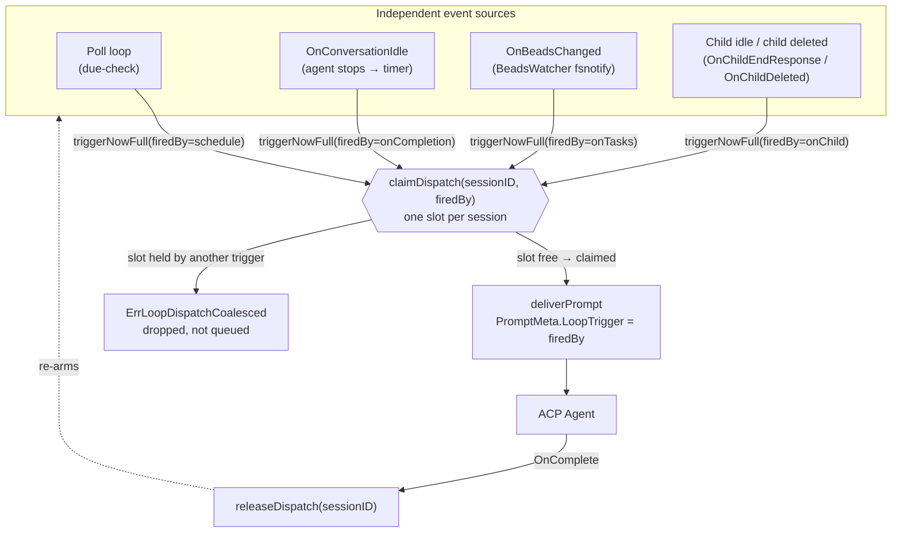
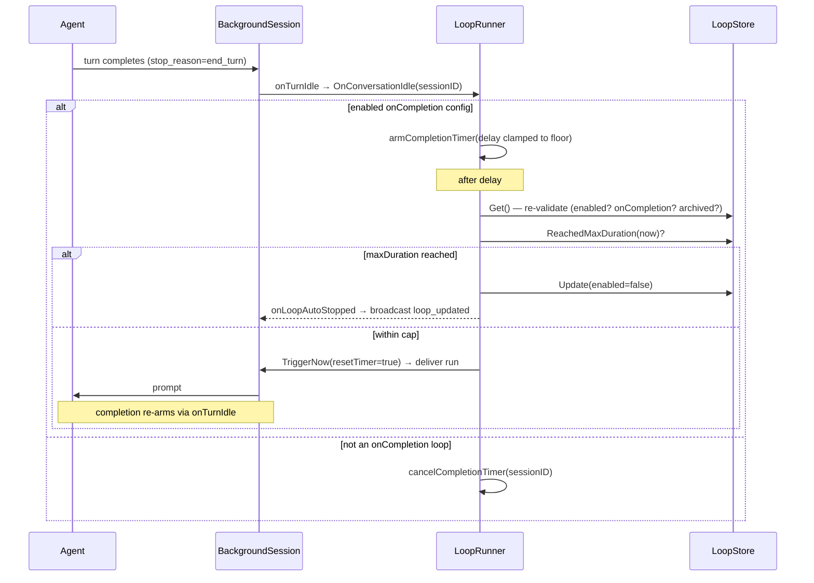
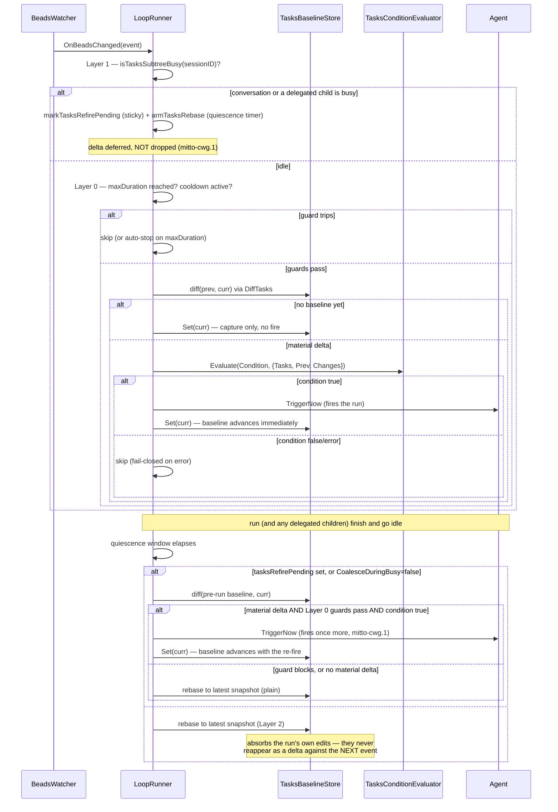
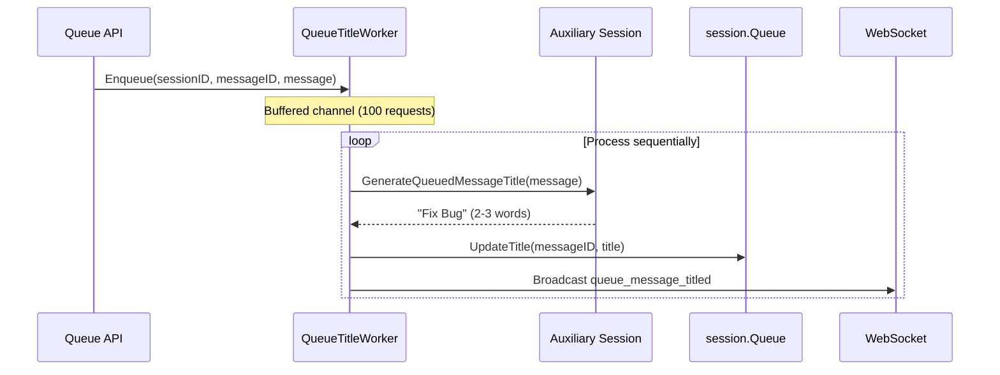
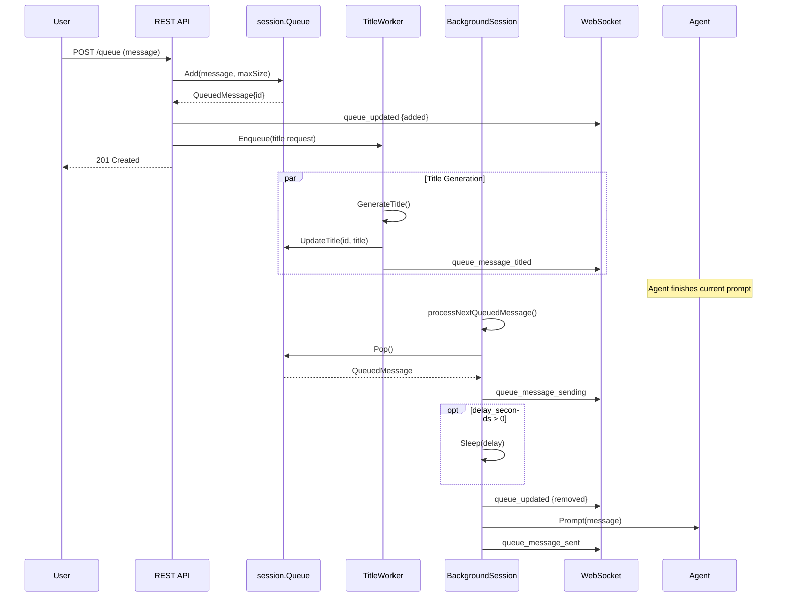

# Message Queue System

This document covers the message queue architecture, including queue management, automatic title generation, and WebSocket notifications.

## Overview

The queue system allows users to send messages while the agent is busy. Messages are queued and automatically delivered when the agent becomes idle. Each queued message can have an auto-generated title for easy identification.


```mermaid
flowchart TB
    subgraph "User Actions"
        USER[User] -->|POST /queue| API[Queue API]
        USER -->|View queue| LIST[GET /queue]
    end

    subgraph "Queue Storage"
        API -->|Add| QUEUE[session.Queue]
        QUEUE -->|Persist| FILE[(queue.json)]
    end

    subgraph "Title Generation"
        API -->|Enqueue| WORKER[QueueTitleWorker]
        WORKER -->|Generate| AUX[Auxiliary Session]
        AUX -->|Title| WORKER
        WORKER -->|UpdateTitle| QUEUE
        WORKER -->|Broadcast| WS[WebSocket]
    end

    subgraph "Queue Processing"
        BS[BackgroundSession] -->|Pop| QUEUE
        BS -->|Prompt| AGENT[ACP Agent]
    end
```

## Configuration

Queue behavior is configured globally or per-workspace (NOT per-session):

```yaml
conversations:
  queue:
    enabled: true # Auto-process queued messages (default: true)
    delay_seconds: 0 # Delay before sending next message (default: 0)
    max_size: 10 # Maximum messages in queue (default: 10)
    auto_generate_titles: true # Generate short titles (default: true)
```

### Configuration Scope

| Setting                | Scope            | Rationale                                  |
| ---------------------- | ---------------- | ------------------------------------------ |
| `enabled`              | Global/Workspace | Consistent behavior across sessions        |
| `delay_seconds`        | Global/Workspace | Rate limiting applies uniformly            |
| `max_size`             | Global/Workspace | Resource limits are workspace-wide         |
| `auto_generate_titles` | Global/Workspace | Feature toggle, not per-session preference |

## Queue Package (`internal/session/queue.go`)

### Types

```go
// QueuedMessage represents a message waiting to be sent to the agent.
type QueuedMessage struct {
    ID            string            `json:"id"`                       // Unique ID (q-{timestamp}-{random})
    Message       string            `json:"message"`                  // Text content (empty for named-prompt items)
    ImageIDs      []string          `json:"image_ids,omitempty"`      // Attached images
    FileIDs       []string          `json:"file_ids,omitempty"`       // Attached files
    QueuedAt      time.Time         `json:"queued_at"`                // When queued
    ClientID      string            `json:"client_id,omitempty"`      // Source client
    Title         string            `json:"title,omitempty"`          // Auto-generated title (skipped for named-prompt items)
    ScheduledTime *time.Time        `json:"scheduled_time,omitempty"` // Deliver after this time (nil = immediate)
    Arguments     map[string]string `json:"arguments,omitempty"`      // Go-template argument values applied at dispatch ({{ .Args.NAME }} / {{ Arg "NAME" "default" }})
    PromptName    string            `json:"prompt_name,omitempty"`    // Named-prompt: resolved to full text at dispatch (empty for ad-hoc messages)
}

// Queue manages the message queue for a single session.
// Thread-safe with atomic file persistence.
type Queue struct { ... }
```

### Methods

| Method                                                                            | Description                                                   |
| --------------------------------------------------------------------------------- | ------------------------------------------------------------- |
| `Add(message, imageIDs, fileIDs, clientID, scheduled, sz, arguments, promptName)` | Add message, returns `ErrQueueFull` if at capacity            |
| `List()`                                                                          | Get all messages in FIFO order                                |
| `Get(id)`                                                                         | Get specific message by ID                                    |
| `Remove(id)`                                                                      | Remove specific message                                       |
| `Pop()`                                                                           | Remove and return next ready message (skips future-scheduled) |
| `Clear()`                                                                         | Remove all messages                                           |
| `Len()`                                                                           | Get queue length                                              |
| `UpdateTitle(id, title)`                                                          | Update a message's title                                      |
| `HasScheduledMessages()`                                                          | Check if any scheduled messages exist                         |
| `NextScheduledTime()`                                                             | Get earliest scheduled time of pending messages               |

### Error Values

| Error                | Condition                                               |
| -------------------- | ------------------------------------------------------- |
| `ErrQueueEmpty`      | `Pop()` on empty queue or no ready messages             |
| `ErrMessageNotFound` | `Get()`, `Remove()`, or `UpdateTitle()` with invalid ID |
| `ErrQueueFull`       | `Add()` when queue has `maxSize` messages               |

## Scheduled Messages

Messages can optionally have a `ScheduledTime` that defers delivery until a future time.

### Behavior

- **Non-scheduled messages** (ScheduledTime = nil): Delivered immediately when the agent becomes idle. Backward compatible with all existing behavior.
- **Scheduled messages** (ScheduledTime set): Held in the queue until `time.Now() >= ScheduledTime`.

### Pop() Ordering

When `Pop()` is called, it selects the next ready message:

1. **First non-scheduled message** (FIFO among immediate messages)
2. If no immediate messages, the **earliest due scheduled message** (by ScheduledTime)
3. Returns `ErrQueueEmpty` if no messages are ready (even if future-scheduled messages exist)

### Loop Check

The `LoopRunner` checks all active sessions for due scheduled messages on each poll cycle (default: 1 minute). When a scheduled message becomes due, it triggers `TryProcessQueuedMessage()` on the session.

### API

- **REST**: `POST /api/sessions/{id}/queue` accepts optional `scheduled_time` field (RFC 3339)
- **MCP**: `mitto_conversation_send_prompt` accepts optional `schedule_time` parameter (RFC 3339)
- **List**: Scheduled messages appear in the list response with the `scheduled_time` field

### Frontend

Scheduled messages display a ⏰ badge with a relative time string (e.g., "in 5 min", "in 2h") in the queue dropdown. The display updates every 30 seconds.

## Loop Prompts: Multi-Trigger Architecture

A loop prompt's `Triggers` field (`session.LoopPrompt.Triggers`, plural — see
[docs/config/prompts.md § Loop Prompts](../config/prompts.md#loop-prompts) for
the frontmatter shape) is a **list**, not a single value (mitto-r6j). Every
listed trigger arms **independently** and stays armed for the lifetime of the
loop: a `[onTasks, onCompletion]` loop is simultaneously watching for beads
changes AND re-arming after every turn, from the moment it is enabled.

### Independent arming, one dispatch slot

`LoopRunner.checkSession` arms every trigger leg on each poll tick, in a fixed
order — event-driven legs first (`onTasks` baseline bootstrap, `onCompletion`
timer bootstrap/self-heal), then the `schedule` due-check last — which is what
establishes the **`onTasks` > `onChild` > `onCompletion` > `schedule`**
precedence described below. But arming is not the same as firing: the four
trigger mechanisms below are otherwise independent event sources, each
capable of calling into the same delivery path at any time:

| Trigger        | Fires from                                                                 |
| -------------- | --------------------------------------------------------------------------- |
| `schedule`     | The poll loop's due-check (`NextScheduledAt` reached)                       |
| `onCompletion` | A one-shot timer armed by `OnConversationIdle` when the agent stops         |
| `onTasks`      | `OnBeadsChanged`, when a workspace-wide `BeadsWatcher` event lands           |
| `onChild`      | `OnConversationIdle`'s child leg (→ `OnChildEndResponse`) for `anyEndResponse`, the `session.Store` delete observer (→ `OnChildDeleted`) for `anyDeleted`, and the `session.Store` loop-stopped observer (→ `OnChildLoopStopped`) for `anyLoopStopped` |

Because these sources are independent, two of them can want to deliver a run
in the same narrow window (e.g. the agent finishes a turn — arming
`onCompletion` — at the same moment a beads file changes). Only **one**
delivered run is allowed at a time per conversation: `LoopRunner.claimDispatch`
holds a per-session, first-come-first-served slot (`dispatchInFlight`),
claimed just before `deliverPrompt` and released in `OnComplete` (or any
synchronous failure). A trigger that cannot claim the slot is **coalesced —
dropped, not queued**: `ErrLoopDispatchCoalesced` short-circuits the loser
with no retry, no schedule advance, and no failure backoff. The winning
trigger is recorded on the delivered `PromptMeta.LoopTrigger` and surfaced to
clients as `loop_updated.triggers` (the full armed set) alongside the
back-compat singular `loop_updated.trigger` (the primary/first entry).


```mermaid
flowchart TB
    subgraph Sources["Independent event sources"]
        SCHED["Poll loop<br/>(due-check)"]
        COMP["OnConversationIdle<br/>(agent stops → timer)"]
        TASKS["OnBeadsChanged<br/>(BeadsWatcher fsnotify)"]
        CHILD["Child idle / child deleted<br/>(OnChildEndResponse / OnChildDeleted)"]
    end

    SCHED -->|"triggerNowFull(firedBy=schedule)"| CLAIM
    COMP -->|"triggerNowFull(firedBy=onCompletion)"| CLAIM
    TASKS -->|"triggerNowFull(firedBy=onTasks)"| CLAIM
    CHILD -->|"triggerNowFull(firedBy=onChild)"| CLAIM

    CLAIM{{"claimDispatch(sessionID, firedBy)<br/>one slot per session"}}
    CLAIM -->|"slot free → claimed"| DELIVER["deliverPrompt<br/>PromptMeta.LoopTrigger = firedBy"]
    CLAIM -->|"slot held by another trigger"| DROP["ErrLoopDispatchCoalesced<br/>dropped, not queued"]

    DELIVER --> AGENT[ACP Agent]
    AGENT -->|OnComplete| RELEASE["releaseDispatch(sessionID)"]
    RELEASE -.->|"re-arms"| Sources
```

`onChild`'s three event sources are wired at different layers: `anyEndResponse`
rides the same `OnConversationIdle` callback that arms `onCompletion` (see
[Loop Prompts: On-Completion Delivery](#loop-prompts-on-completion-delivery)
below) — it resolves the child's parent from the child's own metadata (still
present at idle time) and forwards to `fireOnChild`. `anyDeleted` is wired
through `session.Store.SetDeleteObserver` (`internal/session/store.go`),
invoked once per removed session **after** the store's internal lock is
released (so an observer calling back into the store cannot deadlock), and
registered in `internal/web/server.go` as `store.SetDeleteObserver(s.loopRunner.OnChildDeleted)`.
Unlike the idle path, `OnChildDeleted` receives the parent session ID as an
explicit argument from the caller — by observer time the child's own metadata
is already gone, so it cannot be resolved from the child side.

`anyLoopStopped` (mitto-q6my) is wired through `session.Store.SetLoopStoppedObserver`,
registered as `store.SetLoopStoppedObserver(s.loopRunner.OnChildLoopStopped)`
next to the delete observer. `LoopStore.MarkStopped` — the single funnel every
stop path writes through (auto-stop on max iterations/duration,
resume/delivery/context failures, MCP `loop_enabled: false`, REST pause,
archiving) — invokes it once per **real** enabled→stopped transition (a
`MarkStopped` call on an already-stopped config is a no-op notification-wise),
after its write and after the `LoopStore`'s internal lock is released. Like
the idle path, `OnChildLoopStopped` resolves the parent from the stopped
child's own metadata (still present at notification time) — but guards
`childID != parentID` so a loop stopping itself never re-fires its own
`onChild` trigger.

### Shared caps, per-trigger settings

`MaxIterations` and `MaxDurationSeconds` are **loop-wide**: `RecordSent`
increments the single `IterationCount` and checks the single `FirstRunAt`
elapsed-time anchor on every delivered run, **regardless of which trigger
fired it**. A `[schedule, onCompletion]` loop with `maxIterations: 10` stops
after 10 runs total, however the mix of schedule-ticks vs. post-turn
re-arms landed. By contrast, each trigger's own settings — `schedule`'s
`value`/`unit`/`at`, `onCompletion`'s `delay`, `onTasks`'s `condition`/
`coalesceDuringBusy`/`settleWindow`/`cooldown` — apply only to that trigger's
own firing decision (see [Configuration fields](#configuration-fields-sessionloopprompt) below).

### Trigger-scoped guards do not cross-confuse

The `onTasks` busy guard and quiescence rebase (Layer 1/Layer 2, described in
[Loop Prompts: On-Tasks Delivery](#loop-prompts-on-tasks-delivery) below) key
off `isTasksSubtreeBusy`, which checks whether the conversation (or a
delegated child) is **currently prompting** — not which trigger caused that
activity. This is deliberate: in a `[onTasks, onCompletion]` loop, a run that
was actually fired by `onCompletion` still occupies the same "busy" slot an
`onTasks`-fired run would, so the `onTasks` quiescence rebase correctly waits
for it to finish and absorbs its edits into the new baseline — an
`onCompletion`-driven turn's own beads edits never masquerade as an
external, re-fire-worthy delta. Combined with the single dispatch-claim slot
above (mutual exclusion across triggers, not just within one), a multi-trigger
loop never delivers two overlapping runs, and no trigger's bookkeeping is
corrupted by a run a sibling trigger initiated.

### Testing

`internal/conversation/loop_runner_test.go` (`TestBuildLoopUpdatedData_ExposesTriggerSet`,
dispatch-claim coalescing tests) and `internal/session/loop_test.go` cover
independent arming, the coalescing claim, and shared-cap accounting across
trigger combinations.
`TestLoopRunner_CheckSession_Precedence_OnCompletionWinsOverSchedule` additionally
pins the precedence *ordering* through `checkSession` itself rather than the
generic claim: with both legs simultaneously eligible, the event-driven leg takes
the claim and the schedule fire is coalesced without advancing `NextScheduledAt`.
Note that `onTasks` is dispatched from `OnBeadsChanged`, not from `checkSession`
(which only bootstraps its baseline), so its precedence over the other triggers
reduces to the same first-caller-wins claim.
On the parsing side, `internal/prompts` covers the trigger-list validation matrix
(including inert per-trigger blocks) and `TestLoadPromptFile_MigratesLegacyLoopSchema_WritesBackToDisk`
joins the in-memory legacy-schema migration with its on-disk write-back through
`LoadPromptFile`.
The `onChild` leg's guard chain (armed/event-membership/archived-parent/cooldown/
coalescing) is unit-tested in `internal/conversation/loop_runner_test.go`
(`TestLoopRunner_FireOnChild_*`, `TestLoopRunner_OnChildEndResponse_*`,
`TestLoopRunner_OnChildDeleted_*`). `tests/integration/inprocess/loop_onchild_e2e_test.go`
(`TestLoopOnChildE2E`) covers it end-to-end against the mock ACP server,
including the one seam no unit test reaches: a real `session.Store.Delete`
call flowing through the wired `SetDeleteObserver` seam into a live delivery.

## Loop Prompts: On-Completion Delivery

Loop prompts normally fire on a fixed schedule (checked by the `LoopRunner` poll loop). A loop prompt may instead arm the `onCompletion` trigger, which fires the next run **after the agent stops responding**, rather than on a clock.

### Delivery model

When a turn completes and a session goes fully idle, `BackgroundSession` invokes the `onTurnIdle` hook, which routes to `LoopRunner.OnConversationIdle(sessionID)`. For an enabled `onCompletion` config this arms a one-shot timer for `delay` seconds (clamped up to the global floor `min_loop_completion_delay_seconds`, default 5). When the timer fires, `fireOnCompletion` re-validates the config, checks the max-duration cap, and delivers via `TriggerNow`. The delivered run's own completion produces another idle transition, which arms the next run — a self-sustaining loop.


```mermaid
sequenceDiagram
    participant Agent
    participant BS as BackgroundSession
    participant PR as LoopRunner
    participant Store as LoopStore

    Agent->>BS: turn completes (stop_reason=end_turn)
    BS->>PR: onTurnIdle → OnConversationIdle(sessionID)
    alt enabled onCompletion config
        PR->>PR: armCompletionTimer(delay clamped to floor)
        Note over PR: after delay
        PR->>Store: Get() — re-validate (enabled? onCompletion? archived?)
        PR->>Store: ReachedMaxDuration(now)?
        alt maxDuration reached
            PR->>Store: Update(enabled=false)
            PR-->>BS: onLoopAutoStopped → broadcast loop_updated
        else within cap
            PR->>BS: TriggerNow(resetTimer=true) → deliver run
            BS->>Agent: prompt
            Note over BS,Agent: completion re-arms via onTurnIdle
        end
    else not an onCompletion loop
        PR->>PR: cancelCompletionTimer(sessionID)
    end
```

### Loop safety

- **Delay floor** — `delay` is clamped up to `min_loop_completion_delay_seconds` (default 5) so a misconfigured `delay: 0` cannot spin a hot loop.
- **Single pending timer** — arming replaces (stops) any existing timer for the session, so at most one firing is queued.
- **Max iterations** — the standard per-run counter still applies; reaching the effective cap disables the prompt.
- **Max duration** — `maxDuration` is a wall-clock cap from the first run; `fireOnCompletion` checks it before delivering and auto-stops (disables + broadcasts) once exceeded.
- **Busy / archived guards** — a busy session is skipped (the next idle re-arms); an archived or disabled config drops the timer.

### Interplay with the runner and suspension

The schedule-based poll loop and the on-completion timers are independent paths on the same `LoopRunner`. On-completion timers are armed by idle events, not the poll loop, so they are unaffected by the poll interval. A suspended loop session (Tier-1 GC after `loop_suspend_timeout`) has no live `BackgroundSession` to emit idle events; the on-completion loop resumes once the session is resumed. See [acp.md](acp.md) for suspension details.

## Loop Prompts: On-Tasks Delivery

A loop prompt may arm the `onTasks` trigger, which fires whenever the **beads issues in the conversation's working directory change** on disk, optionally gated by a **CEL condition** so it only fires for meaningful changes (e.g. "the open bug count increased", "an issue labelled `PR opened` was created or updated"). Like `onCompletion`, this is event-driven, not clock-driven — `Frequency` is not required and is ignored.

### Trigger semantics

A workspace-wide `BeadsWatcher` (fsnotify on `.beads/`, debounced) calls `LoopRunner.OnBeadsChanged(event)` whenever a watched working directory changes. For every **enabled** `onTasks` conversation whose working directory is in `event.WorkingDirs`, the runner:

1. Fetches the latest beads snapshot once per working directory (`bd list --json --all -n 0`), shared across all conversations watching that directory.
2. Diffs it against that **conversation's own persisted baseline** (see below) using `config.DiffTasks`.
3. Evaluates the conversation's CEL `Condition` (empty = fire on any material change).
4. Fires via `TriggerNow` when all guards pass and the condition is true.

The very first `OnBeadsChanged` call for a conversation only **captures the baseline** — it never fires (no spurious first run when `onTasks` is newly enabled or the server restarts before a baseline exists). `BootstrapTasksBaseline` performs the same capture-without-firing on enable/startup.

### Condition language (CEL)

Conditions are CEL expressions evaluated by `config.TasksConditionEvaluator` (`internal/config/tasks_condition.go`) against a `TasksChangeContext` with three variables:

| Variable  | Shape                                                                                                                                                                   | Meaning                                      |
| --------- | ----------------------------------------------------------------------------------------------------------------------------------------------------------------------- | -------------------------------------------- |
| `Tasks`   | `Open`, `Closed`, `InProgress`, `Ready`, `Blocked` (ints); `CountByType`, `CountByStatus`, `CountByLabel`, `OpenByType` (`map<string,int>`); `All` (list of issue maps) | Current snapshot (after the change)          |
| `Prev`    | same shape as `Tasks`                                                                                                                                                   | Snapshot at the conversation's last baseline |
| `Changes` | `Added`, `Updated`, `Removed`, `Closed`, `Reopened`, `LabelAdded`, `Touched` (= Added ∪ Updated) — all lists of issue maps                                              | The diff between `Prev` and `Tasks`          |

Each issue map exposes canonical keys: `id`, `type`, `status`, `priority`, `labels`, `title`, `assignee`, `updated_at`.

```
# Open "bug" count increased
Tasks.OpenByType["bug"] > Prev.OpenByType["bug"]

# An issue labelled "PR opened" was created or updated
Changes.Touched.exists(i, "PR opened" in i.labels)

# A new P0/P1 bug appeared
Changes.Added.exists(i, i.type == "bug" && i.priority <= 1)

# Empty condition = fire on ANY beads change
```

**Native-CEL map caveat:** `Tasks`/`Prev`/`Changes` are plain CEL maps, not proto messages — indexing a key that doesn't exist (e.g. `OpenByType["bug"]` when no bug has ever existed in that snapshot) is a **runtime error**, not a zero value. Conditions that index a type/status/label must ensure the key can already be present in the baseline, or guard with `"bug" in Tasks.OpenByType`.

**Fail-closed semantics:** unlike prompt `enabledWhen` (which fails open), a `Condition` that fails to compile or errors at evaluation time (including the missing-key case above) makes the trigger **not fire** — a misconfigured condition must never cause spurious unattended runs. Compile errors are also rejected synchronously on save (`session.ConditionValidator`, wired to `config.ValidateCondition`).

### The diff baseline (`internal/web/tasks_baseline.go`)

Each `onTasks` conversation keeps its **own** baseline file (`tasks_baseline.json`, alongside `loop.json`) holding the raw `bd list` JSON at the time it was last considered "current" for that conversation. The baseline is **per-conversation, not per-working-directory** — several `onTasks` conversations watching the same directory each diff against their own baseline, which is what makes Layer 2 loop prevention (below) possible without any actor/attribution support from `bd`.

### Loop prevention (3 layers)

An `onTasks` conversation (or a child it delegates to) will usually _edit_ beads itself as part of doing its work — without safeguards this would re-trigger itself indefinitely, since its own edits show up as a fresh delta against the baseline.


```mermaid
sequenceDiagram
    participant Watcher as BeadsWatcher
    participant PR as LoopRunner
    participant Baseline as TasksBaselineStore
    participant CEL as TasksConditionEvaluator
    participant Agent

    Watcher->>PR: OnBeadsChanged(event)
    PR->>PR: Layer 1 — isTasksSubtreeBusy(sessionID)?
    alt conversation or a delegated child is busy
        PR->>PR: markTasksRefirePending (sticky) + armTasksRebase (quiescence timer)
        Note over PR: delta deferred, NOT dropped (mitto-cwg.1)
    else idle
        PR->>PR: Layer 0 — maxDuration reached? cooldown active?
        alt guard trips
            PR->>PR: skip (or auto-stop on maxDuration)
        else guards pass
            PR->>Baseline: diff(prev, curr) via DiffTasks
            alt no baseline yet
                PR->>Baseline: Set(curr) — capture only, no fire
            else material delta
                PR->>CEL: Evaluate(Condition, {Tasks, Prev, Changes})
                alt condition true
                    PR->>Agent: TriggerNow (fires the run)
                    PR->>Baseline: Set(curr) — baseline advances immediately
                else condition false/error
                    PR->>PR: skip (fail-closed on error)
                end
            end
        end
    end

    Note over PR,Agent: run (and any delegated children) finish and go idle
    PR->>PR: quiescence window elapses
    alt tasksRefirePending set, or CoalesceDuringBusy=false
        PR->>Baseline: diff(pre-run baseline, curr)
        alt material delta AND Layer 0 guards pass AND condition true
            PR->>Agent: TriggerNow (fires once more, mitto-cwg.1)
            PR->>Baseline: Set(curr) — baseline advances with the re-fire
        else guard blocks, or no material delta
            PR->>Baseline: rebase to latest snapshot (plain)
        end
    else
        PR->>Baseline: rebase to latest snapshot (Layer 2)
        Note over Baseline: absorbs the run's own edits — they never<br/>reappear as a delta against the NEXT event
    end
```

- **Layer 0 — hard backstops.** A per-conversation `CooldownSeconds` (clamped up to the global floor `SetMinLoopTasksCooldownSeconds`, default 30s) rate-limits fires regardless of the condition. `MaxIterations` and `MaxDurationSeconds` are the same caps used by every trigger; `MaxDurationSeconds` is checked (and auto-stops, mirroring `onCompletion`) before the cooldown check.
- **Layer 1 — busy guard (temporal).** While the conversation's turn is active — **or any delegated child conversation is still running or blocked on `mitto_children_tasks_wait`** (`isTasksSubtreeBusy`) — incoming events are deferred (`armTasksRebase`), not evaluated immediately. This is the guard against the run's OWN in-flight edits. **The deferred delta is not dropped**: `processTasksChange` also sets a sticky `tasksRefirePending` flag (mitto-cwg.1) so Layer 2 knows a real fs-watcher delta is still pending once the subtree goes idle.
- **Layer 2 — quiescence rebase.** Once the conversation's entire delegated-child subtree goes idle, a short quiescence timer (`SetTasksQuiescenceWindow`, default 10s) fires `fireTasksRebase`. **A fs-watcher delta that arrived during the busy window is never silently absorbed (mitto-cwg.1):** if `tasksRefirePending` is set — regardless of `CoalesceDuringBusy` — `fireTasksRebase` diffs the pre-run baseline against the current snapshot and, if a material delta remains and Layer 0 (cooldown, `MaxDuration`, `MaxIterations`) and the CEL `condition` allow it, fires **once more** via the normal firing path with the accumulated delta available as `.Trigger.OnTasks.Changes.*`, then rebases the baseline to the post-re-fire snapshot. If no guard blocks it, this happens exactly once per busy window no matter how many fs events landed during it (the flag is "mark, don't stack"). Only when nothing was pending during the busy window (no fs-watcher delta arrived while busy) does the plain rebase run, absorbing only the run's own self-edits. **`CoalesceDuringBusy=false` (mitto-dmb)** is now a narrower opt-out: it forces the same re-fire path unconditionally at quiescence (useful for loops with event-driven fidelity needs even when `tasksRefirePending` wasn't set); the `true`/unset default governs only that separate opt-out, not fs-watcher deltas, which always re-fire per the paragraph above.

**Out of scope:** actor-based delta filtering (skipping only _other actors'_ edits) was investigated and explicitly deferred — `internal/beads/cli.go` does not stamp a per-change actor, and `bd list --json` exposes only `created_by`/`owner`, not a last-touched actor. The baseline-rebase approach (Layer 2) makes this unnecessary for correctness today.

### Exposing the change delta to the prompt body (`.Trigger.OnTasks.*`)

The same `TasksDelta` the CEL `condition` sees is threaded through to the loop prompt body via a Go-template namespace so the prompt can act on **which specific issues changed** without re-invoking `bd` at agent-side startup (mitto-xkn):

```
{{ with .Trigger }}{{ with .OnTasks }}
Beads that just changed in this working directory:
{{ range .Changes.Touched -}}
- {{ .id }} ({{ .status }}): {{ .title }}
{{ end }}
{{ end }}{{ end }}
```

| Namespace                          | Shape                                                                                                                                                                                                                        |
| ---------------------------------- | -------------------------------------------------------------------------------------------------------------------------------------------------------------------------------------------------------------------------------- |
| `.Trigger.OnTasks.Changes.Added`    | `[]map[string]any` — issues present in the current snapshot but not the previous baseline                                                                                                                                        |
| `.Trigger.OnTasks.Changes.Updated`  | `[]map[string]any` — issues present in both snapshots whose canonical fields differ                                                                                                                                              |
| `.Trigger.OnTasks.Changes.Removed`  | `[]map[string]any` — issues present in the previous baseline but no longer in the current snapshot                                                                                                                               |
| `.Trigger.OnTasks.Changes.Closed`   | `[]map[string]any` — issues whose status transitioned to `closed`                                                                                                                                                                |
| `.Trigger.OnTasks.Changes.Reopened` | `[]map[string]any` — issues whose status transitioned from `closed` back to open                                                                                                                                                |
| `.Trigger.OnTasks.Changes.LabelAdded` | `[]map[string]any` — issues that gained at least one label between baseline and current                                                                                                                                        |
| `.Trigger.OnTasks.Changes.Touched`  | `[]map[string]any` — `Added ∪ Updated` (the convenient superset for prompts that don't care about the distinction)                                                                                                              |

Each entry exposes the same canonical keys the CEL condition sees: `id`, `type`, `status`, `priority`, `labels`, `title`, `assignee`, `updated_at`.

**Nil-guarding.** `.Trigger.OnTasks` is populated **only** when a fire was driven by a real beads change delta (i.e. the `tasksActionFire` path in `processTasksChange`). All other dispatch paths — scheduled/timer fires, `onCompletion` fires, manual **Run Now**, non-loop prompts — leave both `.Trigger` and `.Trigger.OnTasks` **nil**. Templates that reference `.Trigger.OnTasks.*` MUST nest their guards so both levels are checked; a single `{{ with .Trigger.OnTasks }}` panics when `.Trigger` itself is nil:

```
{{ with .Trigger }}{{ with .OnTasks }}
  ...references to .Changes.* here...
{{ end }}{{ end }}
```

**No behavioural change to `loop.Arguments`.** The static `map[string]string` filled at loop-config time is still exposed as `.Args` and is unchanged; the `.Trigger.*` namespace is additive and per-fire.

### Configuration fields (`session.LoopPrompt`)

| Field             | JSON               | Meaning                                                                                                           |
| ----------------- | ------------------ | ----------------------------------------------------------------------------------------------------------------- |
| `Triggers`        | `triggers`         | Canonical armed-trigger list, e.g. `["onTasks"]` or `["onTasks", "onCompletion"]`. `Trigger`/`trigger` (singular) is kept in sync with `Triggers[0]` for on-disk/wire back-compat (`Normalize()`); see [EffectiveTriggers](#loop-prompts-multi-trigger-architecture). |
| `Condition`       | `condition`        | CEL expression; empty = fire on any material beads change. Only meaningful when `onTasks` is armed.               |
| `ConditionPreset` | `condition_preset` | Optional UI preset id that was compiled into `Condition`                                                          |
| `CooldownSeconds` | `cooldown_seconds` | Per-conversation cooldown floor; `0` = use the global floor                                                       |
| `CoalesceDuringBusy` | `coalesce_during_busy` | Opt-out (mitto-dmb) unconditionally forcing the quiescence re-fire path even when no fs-watcher delta was deferred. Nil/`true` (default) does **not** mean "always silently absorb" — a fs-watcher delta that arrived during the busy window always re-fires once at quiescence regardless of this setting (mitto-cwg.1, via the sticky `tasksRefirePending` flag); this field only gates the plain-rebase case where nothing was pending. `false` additionally fires once more at quiescence with the accumulated pre-run→current delta, gated by Layer 0 and the CEL `condition`, even when nothing was flagged pending. |
| `StoppedReason`   | `stopped_reason`   | `"maxIterations"` / `"maxDuration"` when the loop auto-stopped after hitting a cap; shared with other triggers.   |

### Opting in from a prompt file (`loop:` frontmatter)

The frontmatter mirrors the runtime field as `loop.onTasks.coalesceDuringBusy`, nested under the `onTasks` trigger block (mitto-r6j; see [docs/config/prompts.md § Loop Prompts](../config/prompts.md#loop-prompts) for the full grouped schema). When the prompt is instantiated as a loop via `mitto_conversation_new` / `mitto_conversation_update`, `applyPromptLoopDefaultsToStartInput` (`internal/mcpserver/prompt_loop_defaults.go`) fills `loop_coalesce_during_busy` from this field **only** when the caller did not set it explicitly — the same "explicit caller wins" rule the other frontmatter defaults follow, and honouring `loop_apply_prompt_defaults: false` to disable the whole merge. Example:

```yaml
loop:
  trigger: [onTasks]
  onTasks:
    condition: 'Changes.Touched.exists(i, i.status == "open")'
    # Opt in to per-event re-fire: at quiescence, fire once more with the
    # accumulated delta so newly-arrived issues get picked up promptly.
    coalesceDuringBusy: false
  maxIterations: 20
  maxDuration: "4h"
```

Two builtin prompts adopt this (mitto-f9q): `config/prompts/builtin/beads/refine-implementation.prompt.yaml` and `config/prompts/builtin/beads-issues/loop-processing.prompt.yaml`. Both also render a `## Triggered by these beads changes` preamble in the prompt body using `{{ with .Trigger }}{{ with .OnTasks }}...{{ end }}{{ end }}` so the agent sees which specific beads drove the fire without re-invoking `bd`.

### Testing

`internal/config/tasks_condition_test.go` unit-tests snapshot parsing, diffing, and CEL evaluation (including the fail-closed cases). `internal/web/loop_runner_test.go` unit-tests the guard/decision logic (`evaluateTasksChange`) and each loop-prevention layer in isolation. `tests/integration/inprocess/loop_ontasks_e2e_test.go` drives the full stack end-to-end against the mock ACP server — CEL-gated firing, the busy-guard + quiescence-rebase interaction, the cooldown floor, and `MaxIterations`/`MaxDurationSeconds` auto-stop — by calling `LoopRunner.OnBeadsChanged` directly with a fake `beads.Client` standing in for `bd list` (the `BeadsWatcher` itself is out of scope for that test and is unit-tested separately).

## Title Generation

### Architecture


```mermaid
sequenceDiagram
    participant API as Queue API
    participant Worker as QueueTitleWorker
    participant Aux as Auxiliary Session
    participant Queue as session.Queue
    participant WS as WebSocket

    API->>Worker: Enqueue(sessionID, messageID, message)
    Note over Worker: Buffered channel (100 requests)

    loop Process sequentially
        Worker->>Aux: GenerateQueuedMessageTitle(message)
        Aux-->>Worker: "Fix Bug" (2-3 words)
        Worker->>Queue: UpdateTitle(messageID, title)
        Worker->>WS: Broadcast queue_message_titled
    end
```

### Components

| Component                    | File                           | Purpose                      |
| ---------------------------- | ------------------------------ | ---------------------------- |
| `QueueTitleWorker`           | `internal/web/queue_title.go`  | Sequential request processor |
| `GenerateQueuedMessageTitle` | `internal/auxiliary/global.go` | Prompt for title generation  |
| `Queue.UpdateTitle`          | `internal/session/queue.go`    | Persist title to queue.json  |

### QueueTitleWorker

The worker processes title requests sequentially to avoid overwhelming the auxiliary conversation:

```go
// Create worker (done in Server initialization)
worker := NewQueueTitleWorker(store, logger)
worker.OnTitleGenerated = func(sessionID, messageID, title string) {
    // Broadcast to WebSocket clients
}

// Enqueue request (non-blocking)
worker.Enqueue(QueueTitleRequest{
    SessionID: sessionID,
    MessageID: msg.ID,
    Message:   message,
})

// Shutdown (waits for pending requests)
worker.Close()
```

**Design decisions:**

- **Sequential processing**: Prevents concurrent auxiliary requests
- **Buffered channel (100)**: Drops requests if overwhelmed (logs warning)
- **30-second timeout**: Per-request timeout for title generation
- **Graceful shutdown**: Waits for in-flight request to complete

## Named-Prompt Queue Items

Queue items can carry a **prompt name** (+ optional substitution arguments) instead of a full message body. The backend resolves the name to full text at dispatch — not at enqueue time — using the target conversation's workspace context (`resolvePromptByName` in `internal/web/server.go`).

### Key properties

| Property         | Behavior                                                                                                   |
| ---------------- | ---------------------------------------------------------------------------------------------------------- |
| `prompt_name`    | Name of the workspace prompt to send; resolved at dispatch                                                 |
| `arguments`      | Go-template argument values applied at dispatch time via `{{ .Args.NAME }}` / `{{ Arg "NAME" "default" }}` |
| `message`        | Empty string for named-prompt items                                                                        |
| Title generation | **Skipped** — the prompt name itself serves as the label in the queue UI                                   |

### Why resolution happens at dispatch

Resolution is deferred to the target conversation's context so that workspace-specific prompts, ACP-server-filtered lists, and `enabledWhen` conditions are evaluated in the right environment, even when the request came from a different workspace or was created atomically with the session.

### Shared Frontend Seed Helper (`web/static/hooks/useConversationSeeding.js`)

All menu-driven prompt sends (prompts menu, Cmd+/ slash picker, beads-issue menus, beads-list menus) go through a **single shared helper** — never POST the full prompt body directly:

| Export                                                                                                | Purpose                                                                |
| ----------------------------------------------------------------------------------------------------- | ---------------------------------------------------------------------- |
| `buildSeedQueueBody(prompt, {arguments})`                                                             | Builds `{prompt_name, arguments}` POST body (never includes `message`) |
| `seedConversationWithPrompt(sessionId, prompt, {arguments})`                                          | POST `{prompt_name}` to an existing session's queue                    |
| `startConversationWithPrompt({workingDir, acpServer, name, beadsIssue, prompt, arguments, loop})` | Create a new conversation (one-time or loop — see below)           |
| `configureLoopSchedule(sessionId, prompt, loop, {fetchImpl})`                                 | PUT loop config onto an already-created session                    |

#### One-time path (no `loop`)

When `loop` is absent, `startConversationWithPrompt` posts `initial_prompt_name` + `arguments` to `POST /api/sessions` — the backend seeds the queue atomically:

```javascript
const { seedConversationWithPrompt, startConversationWithPrompt } =
  useConversationSeeding({ newSession });

// Seed an existing conversation
await seedConversationWithPrompt(
  sessionId,
  { name: "Review Code" },
  { arguments: { ISSUE_ID: "mitto-42" } },
);

// Create a new conversation and seed it atomically (one-time)
await startConversationWithPrompt({
  workingDir,
  acpServer,
  prompt: { name: "Review Code" },
  arguments: { ISSUE_ID: "mitto-42" },
});
```

#### Loop path (`loop` present)

When `loop: { value, unit, at? }` is provided, `startConversationWithPrompt`:

1. Creates the session via `POST /api/sessions` **without** `initial_prompt_name` (no one-time queue seed).
2. Calls `configureLoopSchedule` which PUTs `/api/sessions/{id}/loop` with:
   ```json
   {
     "prompt_name": "...",
     "frequency": { "value": 1, "unit": "hours" },
     "enabled": true
   }
   ```
   The `at` field (HH:MM UTC) is included only when `unit === "days"`.
3. Returns `{ sessionId }` on success, or `{ error }` if the PUT fails (session already created — error is surfaced to the caller).

```javascript
// Create a new LOOP conversation driven by a named prompt
await startConversationWithPrompt({
  workingDir,
  acpServer,
  prompt: { name: "Daily Standup" },
  loop: { value: 1, unit: "days", at: "09:00" }, // at is UTC HH:MM
});
```

The `at` value in the `loop` object must already be in **UTC** when passed to `startConversationWithPrompt`. The `LoopScheduleDialog` component handles the local→UTC conversion before calling the helper.

#### Menu-branching rules

Menus branch on `prompt.loop` (non-null = loop prompt):

- **`handleSendPromptToConversation`** (per-conversation context menu): if `prompt.loop` is set and the session is **not a child** (`parent_session_id` is empty), opens `LoopScheduleDialog` then creates a NEW loop conversation — it does not seed the existing one. Child conversations are silently skipped (the backend also 400s on loop-for-child).
- **`handleRunBeadsPrompt`** / **`handleRunBeadsListPrompt`** (beads menus): same branching via the `onOpenLoopDialog` callback passed from `app.js` into `useBeadsIntegration`.
- Non-loop prompts are completely unaffected.

## REST API

### Endpoints

| Method   | Path                                | Description              |
| -------- | ----------------------------------- | ------------------------ |
| `GET`    | `/api/sessions/{id}/queue`          | List all queued messages |
| `POST`   | `/api/sessions/{id}/queue`          | Add message to queue     |
| `GET`    | `/api/sessions/{id}/queue/{msg_id}` | Get specific message     |
| `DELETE` | `/api/sessions/{id}/queue/{msg_id}` | Delete specific message  |
| `DELETE` | `/api/sessions/{id}/queue`          | Clear entire queue       |

### `POST /api/sessions` — Atomic Create + Seed

`SessionCreateRequest` supports `initial_prompt_name` (+ `arguments`) for atomically creating a conversation and seeding its queue in one request:

```json
// POST /api/sessions
{
  "working_dir": "/path/to/project",
  "acp_server": "auggie",
  "initial_prompt_name": "Review Code",
  "arguments": { "ISSUE_ID": "mitto-42" }
}
```

The backend calls `seedQueueWithNamedPrompt()` immediately after creating the session, using the same queue plumbing as `POST /api/sessions/{id}/queue`. Title generation is skipped for named-prompt items.

### Request/Response Examples

**POST /api/sessions/{id}/queue** — ad-hoc message

```json
// Request
{"message": "Fix the login bug", "image_ids": []}

// Response (201 Created)
{
  "id": "q-1738396800-abc12345",
  "message": "Fix the login bug",
  "queued_at": "2026-02-01T12:00:00Z",
  "title": ""  // Initially empty, updated asynchronously
}
```

**POST /api/sessions/{id}/queue** — named-prompt item

```json
// Request (no "message" field — prompt name is resolved at dispatch)
{
  "prompt_name": "Review Code",
  "arguments": { "ISSUE_ID": "mitto-42" }
}

// Response (201 Created)
{
  "id": "q-1738396800-def67890",
  "prompt_name": "Review Code",
  "queued_at": "2026-02-01T12:00:00Z"
  // No "title" — skipped for named-prompt items; prompt name is used as label
}
```

**GET /api/sessions/{id}/queue** (mixed queue)

```json
{
  "messages": [
    {
      "id": "q-1738396800-abc12345",
      "message": "Fix the login bug",
      "queued_at": "2026-02-01T12:00:00Z",
      "title": "Login Bug Fix"
    },
    {
      "id": "q-1738396800-def67890",
      "prompt_name": "Review Code",
      "arguments": { "ISSUE_ID": "mitto-42" },
      "queued_at": "2026-02-01T12:01:00Z"
    }
  ],
  "count": 2
}
```

**Error: Queue Full (409 Conflict)**

```json
{
  "error": "queue_full",
  "message": "Queue is full. Maximum 10 messages allowed."
}
```

## WebSocket Notifications

### Message Types

| Type                    | Direction       | Description                 |
| ----------------------- | --------------- | --------------------------- |
| `queue_updated`         | Server → Client | Queue state changed         |
| `queue_message_sending` | Server → Client | Message about to be sent    |
| `queue_message_sent`    | Server → Client | Message delivered to agent  |
| `queue_message_titled`  | Server → Client | Title generated for message |

### Payload Examples

**queue_updated**

```json
{
  "type": "queue_updated",
  "data": {
    "session_id": "20260201-120000-abc12345",
    "queue_length": 3,
    "action": "added", // "added", "removed", "cleared"
    "message_id": "q-1738396800-abc12345"
  }
}
```

**queue_message_titled**

```json
{
  "type": "queue_message_titled",
  "data": {
    "session_id": "20260201-120000-abc12345",
    "message_id": "q-1738396800-abc12345",
    "title": "Login Bug Fix"
  }
}
```

## Queue Processing Flow


```mermaid
sequenceDiagram
    participant User
    participant API as REST API
    participant Queue as session.Queue
    participant Worker as TitleWorker
    participant BS as BackgroundSession
    participant WS as WebSocket
    participant Agent

    User->>API: POST /queue (message)
    API->>Queue: Add(message, maxSize)
    Queue-->>API: QueuedMessage{id}
    API->>WS: queue_updated {added}
    API->>Worker: Enqueue(title request)
    API-->>User: 201 Created

    par Title Generation
        Worker->>Worker: GenerateTitle()
        Worker->>Queue: UpdateTitle(id, title)
        Worker->>WS: queue_message_titled
    end

    Note over Agent: Agent finishes current prompt

    BS->>BS: processNextQueuedMessage()
    BS->>Queue: Pop()
    Queue-->>BS: QueuedMessage
    BS->>WS: queue_message_sending
    opt delay_seconds > 0
        BS->>BS: Sleep(delay)
    end
    BS->>WS: queue_updated {removed}
    BS->>Agent: Prompt(message)
    BS->>WS: queue_message_sent
```

## File Storage

### Location

```
sessions/
└── {session_id}/
    ├── events.jsonl      # Event log (append-only)
    ├── metadata.json     # Session metadata
    └── queue.json        # Message queue (transient)
```

### queue.json Format

```json
{
  "messages": [
    {
      "id": "q-1738396800-abc12345",
      "message": "Fix the login bug",
      "image_ids": [],
      "queued_at": "2026-02-01T12:00:00Z",
      "client_id": "web-client-1",
      "title": "Login Bug Fix"
    },
    {
      "id": "q-1738396800-def67890",
      "message": "",
      "prompt_name": "Review Code",
      "arguments": { "ISSUE_ID": "mitto-42" },
      "queued_at": "2026-02-01T12:01:00Z",
      "client_id": "web-client-1"
    }
  ],
  "updated_at": "2026-02-01T12:01:00Z"
}
```

Named-prompt items persist `prompt_name` and `arguments`; `message` is empty. The name is resolved to full text at dispatch — the persisted file never contains the resolved prompt body.

### Design Decisions

1. **Separate file**: Queue is transient (messages removed when processed), unlike append-only events
2. **Atomic writes**: Uses `fileutil.WriteJSONAtomic()` to prevent corruption
3. **Title in queue**: Stored with message for persistence across server restarts

## Automatic Queue Dequeuing

The queue system supports automatic dequeuing for idle agent sessions:

### Behavior

1. **After prompt completion**: When the agent finishes responding, `processNextQueuedMessage()` is called automatically, which pops the next message from the queue and sends it (applying the configured delay first).

2. **On server startup**: `ProcessPendingQueues()` checks all persisted sessions for queued messages. For sessions with pending items, it:
   - Resumes the session (starts ACP process)
   - Sends the first queued message immediately (delay is skipped because `lastResponseComplete` is zero for freshly resumed sessions)

3. **Delay handling**: The `delay_seconds` configuration controls how long to wait:
   - **Normal flow**: After a prompt completes, sleep for `delay_seconds` before sending the next queued message
   - **Startup flow**: On startup, the delay is skipped for the first message because `lastResponseComplete` is zero (no previous response yet)

### Methods

| Method                       | Location            | Purpose                                                         |
| ---------------------------- | ------------------- | --------------------------------------------------------------- |
| `processNextQueuedMessage()` | `BackgroundSession` | Called after prompt completion, applies delay synchronously     |
| `TryProcessQueuedMessage()`  | `BackgroundSession` | Used for startup/loop checking, respects delay elapsed time |
| `ProcessPendingQueues()`     | `SessionManager`    | Called on server startup, resumes sessions with queued items    |

## Frontend Integration

### State Management

The frontend tracks queue state via `useWebSocket` hook:

```javascript
const {
  queueLength, // Current queue size
  queueConfig, // { enabled, max_size, delay_seconds }
} = useWebSocket();
```

### Queue Full Prevention

`ChatInput` component prevents sending when queue is full:

```javascript
const isQueueFull = isStreaming && queueLength >= queueConfig.max_size;

// Show error if user tries to send
if (isQueueFull) {
  setSendError(
    `Queue is full (${queueConfig.max_size}/${queueConfig.max_size})`,
  );
  return;
}
```

### Title Update Handling

```javascript
case "queue_message_titled":
  console.log(`Queue message titled: ${msg.data?.message_id} -> "${msg.data?.title}"`);
  // Future: Update queue management UI
  break;
```

## Thread Safety

| Component           | Mechanism        | Notes                            |
| ------------------- | ---------------- | -------------------------------- |
| `Queue`             | `sync.Mutex`     | Protects read-modify-write cycle |
| `QueueTitleWorker`  | Buffered channel | Sequential processing            |
| `BackgroundSession` | Observer pattern | Thread-safe notifications        |

## Related Documentation

- [Session Management](session-management.md) — Session lifecycle and state ownership
- [WebSocket Documentation](websockets/) — WebSocket protocol details
- [Architecture](architecture.md) — Overall system architecture
