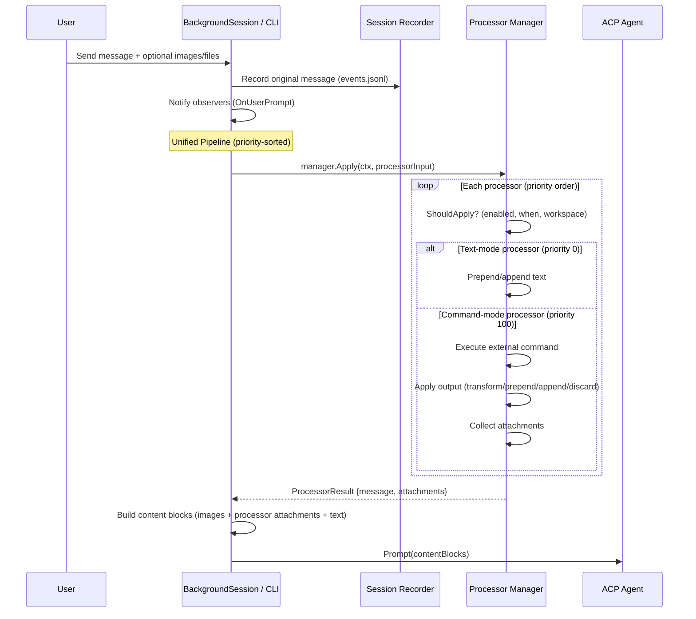
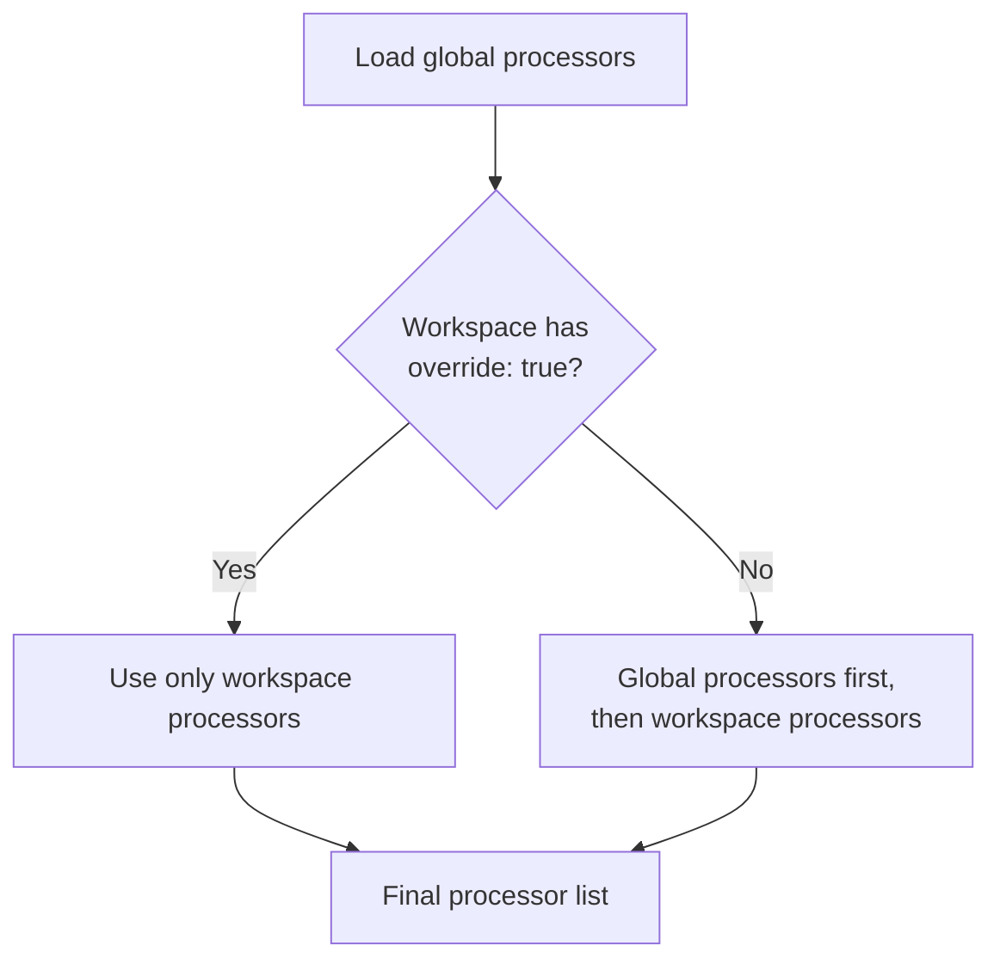
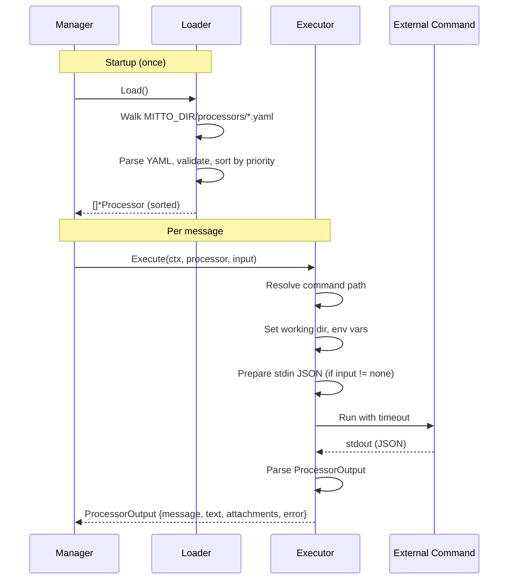

# Message Processing Pipeline

Mitto has a unified message processing pipeline that transforms user messages before sending them to the ACP agent. All processors run **before** the message reaches the agent, and the **original** (untransformed) message is what gets recorded in session history.

## Architecture Overview

The pipeline is managed by a single `processors.Manager` that merges two types of processors into a priority-sorted(stable) list:

1. **Text-mode Processors** (from `config.MessageProcessor`) — Lightweight, declarative text prepend/append rules defined in YAML configuration. These run at priority 0 by default.
2. **Command-mode Processors** (from `internal/processors/`) — External command-based transformations that can run arbitrary scripts, produce attachments, and fully replace messages. These run at priority 100 by default.

Both types share the same `when` condition types (`first`, `all`, `all-except-first`) from the `config.ProcessorWhen` type. Text-mode processors from config are merged into the unified pipeline via `Manager.CloneWithTextProcessors()`, which returns a per-session copy to avoid data races on the shared Manager instance.

## Processing Flow



## Stage 1: Declarative Processors

Declarative processors are simple text insertion rules defined in configuration files.

### Configuration

Defined at two levels, merged at runtime:

| Level         | Source                        | Scope            |
| ------------- | ----------------------------- | ---------------- |
| **Global**    | `~/.mittorc` or `config.yaml` | All workspaces   |
| **Workspace** | `<project>/.mittorc`          | Single workspace |

```yaml
conversations:
  processing:
    override: false # true = replace global processors entirely
    processors:
      - when: first # first | all | all-except-first
        position: prepend # prepend | append
        text: "System prompt.\n\n"
```

### Merge Behavior



`config.MergeProcessors(global, workspace)` implements this logic. The merged list is stored on `BackgroundSession.processors` at creation time.

### Execution

Each processor is checked with `ShouldApply(isFirstMessage)` and applied with `Apply(message)`. Processors run in order — the output of one feeds into the next.

### Key Types

| Type                     | Package           | Purpose                                     |
| ------------------------ | ----------------- | ------------------------------------------- |
| `MessageProcessor`       | `internal/config` | Single prepend/append rule                  |
| `ConversationProcessing` | `internal/config` | Processor list + override flag              |
| `ConversationsConfig`    | `internal/config` | Top-level config (processors + queue + ...) |

## Stage 2: Command Processors

Command processors execute external commands (scripts, binaries) to transform messages. They are more powerful than declarative processors: they can read conversation history, produce file attachments, and fully replace messages.

### Configuration

Command processors are YAML files in `MITTO_DIR/processors/*.yaml` (typically `~/Library/Application Support/Mitto/processors/`):

```yaml
name: code-context
description: Adds project context from a script
when: first
command: ./gather-context.sh
input: message # message | conversation | none
output: prepend # transform | prepend | append | discard
priority: 50 # Lower = runs first (default: 100)
timeout: 5s
working_dir: session # session | hook
on_error: skip # skip | fail
workspaces: # Optional: limit to specific projects
  - /path/to/project
```

### Processor Execution Flow



### Input/Output Protocol

**Input** (JSON on stdin, `input: message`):

```json
{
  "message": "user's message",
  "is_first_message": true,
  "session_id": "abc-123",
  "working_dir": "/path/to/project",
  "parent_session_id": "",
  "session_name": "Fix login bug",
  "acp_server": "claude-code",
  "workspace_uuid": "d4e5f6a7-...",
  "available_acp_servers": [
    {
      "name": "auggie",
      "type": "auggie",
      "tags": ["coding"],
      "current": false
    },
    {
      "name": "claude-code",
      "type": "claude-code",
      "tags": ["coding"],
      "current": true
    }
  ]
}
```

When `input: conversation`, the object additionally includes a `"history"` array of `{"role","content"}` objects.

**Output** (JSON on stdout):

```json
{
  "message": "replaced message", // For output: transform
  "text": "text to prepend or append", // For output: prepend/append
  "attachments": [
    // Optional file attachments
    { "type": "image", "path": "./diagram.png", "mime_type": "image/png" }
  ],
  "error": "", // Non-empty = hook failed
  "metadata": {} // Optional logging data
}
```

### Environment Variables

Command processors receive these environment variables:

| Variable                      | Value                                                                 |
| ----------------------------- | --------------------------------------------------------------------- |
| `MITTO_SESSION_ID`            | Current session ID                                                    |
| `MITTO_WORKING_DIR`           | Session working directory                                             |
| `MITTO_IS_FIRST_MESSAGE`      | `"true"` or `"false"`                                                 |
| `MITTO_PROCESSORS_DIR`        | Processors directory path                                             |
| `MITTO_PROCESSOR_FILE`        | This processor's YAML file path                                       |
| `MITTO_PROCESSOR_DIR`         | Directory containing the processor file                               |
| `MITTO_PARENT_SESSION_ID`     | Parent conversation ID (empty if root session)                        |
| `MITTO_SESSION_NAME`          | Conversation title/name                                               |
| `MITTO_ACP_SERVER`            | Active ACP server name (e.g. `claude-code`)                           |
| `MITTO_WORKSPACE_UUID`        | Workspace UUID                                                        |
| `MITTO_AVAILABLE_ACP_SERVERS` | JSON array of servers with workspaces for this folder; `[]` when none |

#### Examples

**A shell script that adds project context on the first message:**

```bash
#!/bin/bash
# gather-context.sh — prepends project info using env vars

if [ "$MITTO_IS_FIRST_MESSAGE" = "true" ]; then
  PROJECT=$(basename "$MITTO_WORKING_DIR")
  BRANCH=$(git -C "$MITTO_WORKING_DIR" rev-parse --abbrev-ref HEAD 2>/dev/null || echo "unknown")

  cat <<EOF
{
  "text": "Project: ${PROJECT} (branch: ${BRANCH})\nSession: ${MITTO_SESSION_ID}\n\n"
}
EOF
else
  echo '{}' # no-op for subsequent messages
fi
```

With its processor YAML (`MITTO_DIR/processors/gather-context.yaml`):

```yaml
name: gather-context
description: Adds project and branch info on the first message
when: first
command: ./gather-context.sh
output: prepend
priority: 10
working_dir: hook # resolve command relative to the YAML file
```

**A processor that loads helper scripts from its own directory:**

```bash
#!/bin/bash
# Uses MITTO_PROCESSOR_DIR to find sibling files
source "$MITTO_PROCESSOR_DIR/helpers.sh"
# ...
```

### Key Types

| Type              | File          | Purpose                                   |
| ----------------- | ------------- | ----------------------------------------- |
| `Processor`       | `types.go`    | Processor definition (parsed from YAML)   |
| `Manager`         | `apply.go`    | High-level load + apply interface         |
| `Loader`          | `loader.go`   | Discovers and parses processor YAML files |
| `Executor`        | `executor.go` | Runs a single processor as subprocess     |
| `ProcessorInput`  | `input.go`    | Context sent to processor stdin           |
| `ProcessorOutput` | `input.go`    | Parsed result from processor stdout       |
| `Attachment`      | `input.go`    | File attachment from processor            |

## Variable Substitution

After all processors have run, a final substitution pass replaces `@mitto:variable` placeholders in the resulting message with session metadata values. This works in both processor-injected text and the user's original message text.

### Syntax

Use the `@mitto:` prefix followed by the variable name: `@mitto:variable_name`

This is consistent with the existing `@namespace:value` convention used by processor triggers (e.g., `@git:status`, `@file:path`).

### Available Variables

| Variable                       | Value                                                            |
| ------------------------------ | ---------------------------------------------------------------- |
| `@mitto:session_id`            | Current session ID                                               |
| `@mitto:parent_session_id`     | Parent conversation ID (empty if root session)                   |
| `@mitto:session_name`          | Conversation title/name (empty if not yet set)                   |
| `@mitto:working_dir`           | Session working directory                                        |
| `@mitto:acp_server`            | ACP server name (e.g., `"claude-code"`)                          |
| `@mitto:workspace_uuid`        | Workspace identifier                                             |
| `@mitto:available_acp_servers` | ACP servers with workspaces for the session's folder — see below |

### `@mitto:available_acp_servers` detail

This variable renders the ACP servers that have workspaces configured for the session's working directory — the same set reported by the `mitto_conversation_get_current` MCP tool. It uses the format:

```
name [tag1, tag2] (current), name2 [tag3]
```

Each entry contains:

- **name** — ACP server identifier
- **[tags]** — optional tag list in brackets (omitted if the server has no tags)
- **(current)** — appended to the active server's entry

Example output with two servers configured for the same folder:

```
auggie [coding, ai-assistant] (current), claude-code [coding, fast-model]
```

The full structured data (including `type` field) is also available:

- As a JSON array in the `available_acp_servers` field of the JSON stdin payload sent to command processors
- As a JSON array in the `MITTO_AVAILABLE_ACP_SERVERS` environment variable (set to `[]` when no servers are available)

### Behavior

- **Unknown variables** (e.g., `@mitto:unknown`) are left as-is — they are NOT replaced with an empty string.
- **Empty values** substitute to an empty string (e.g., `@mitto:parent_session_id` → `""` when there is no parent).
- **`@mitto:available_acp_servers`** substitutes to an empty string when the workspace has no servers configured.
- **Fast path**: if the message contains no `@mitto:`, substitution is skipped entirely.
- Substitution runs on the **final message** after all processor text has been applied — both declarative (prepend/append) and command-processor output are included.

### Where Substitution Happens

Substitution is applied **after** `processorManager.Apply()` returns:

- **Web mode**: Called in `BackgroundSession.PromptWithMeta()` (`internal/web/background_session.go`) after the processor pipeline completes.
- **CLI mode**: Called in `runOnceMode()` / `runInteractiveLoop()` (`internal/cmd/cli.go`) after the processor pipeline completes. CLI variables that require a running session (e.g., `@mitto:session_id`) substitute to empty strings.

The implementation is in `SubstituteVariables()` in `internal/processors/variables.go`.

### Data Flow for `@mitto:available_acp_servers`

The available server list is computed once per session, not per prompt:

1. `SessionManager.buildAvailableACPServers(folder, currentACPServer)` is called in both `CreateSessionWithWorkspace` and `ResumeSession`
2. It mirrors the MCP tool logic: calls `GetWorkspacesForFolder(folder)` to find workspaces, then filters `mittoConfig.ACPServers` to those with a matching workspace
3. The result (`[]processors.AvailableACPServer`) is stored in `BackgroundSessionConfig.AvailableACPServers`
4. `BackgroundSession` stores it as `availableACPServers`
5. At prompt time, `PromptWithMeta` copies it into `ProcessorInput.AvailableACPServers`
6. `SubstituteVariables` calls `formatAvailableACPServers()` to produce the text value

The `AvailableACPServer` type is defined in `internal/processors/input.go` to avoid import cycles between `internal/processors` and `internal/mcpserver`.

### See Also

- [`docs/config/conversations.md`](../../docs/config/conversations.md) — user guide for declarative processor `text` fields with `@mitto:variable` examples
- [`docs/config/processors.md`](../../docs/config/processors.md) — user guide for command processors: full input JSON, env-var table, and substitution reference

### Example: System prompt with session metadata

A declarative processor in `.mittorc`:

```yaml
conversations:
  processing:
    processors:
      - when: first
        position: prepend
        text: "Session: @mitto:session_id\nProject: @mitto:working_dir\n\n"
```

A command processor YAML that uses a variable in its `text` field is also supported — the substitution runs on the final assembled message, so any text that ends up in the output will have its variables replaced.

### CLI Mode

In CLI mode (`internal/cmd/cli.go`), all session metadata variables (`@mitto:session_id`, `@mitto:session_name`, `@mitto:parent_session_id`, `@mitto:workspace_uuid`, `@mitto:acp_server`) substitute to empty string since there is no backing session store. `@mitto:working_dir` substitutes to the CLI working directory.

## Integration Points

The unified pipeline integrates at a single point in `BackgroundSession.PromptWithMeta()`:

```
1. Record original message → observers + events.jsonl
2. processorManager.Apply(ctx, processorInput)               ← unified pipeline
3. Build content blocks (uploaded images + processor attachments + text)
4. Send to ACP agent
```

The CLI (`internal/cmd/cli.go`) follows the same pattern in both `runOnceMode()` and `runInteractiveLoop()`. Text-mode processors from config are merged into the Manager via `CloneWithTextProcessors()` during session creation.

### First-Message Tracking

- **New sessions**: `isFirstPrompt = true`, set to `false` after first prompt
- **Resumed sessions**: `isFirstPrompt = false` (first-only processors won't fire)
- **CLI once mode**: Always `isFirst = true` (single message)
- **CLI interactive**: Tracks `isFirstMessage` boolean, flipped after first send
