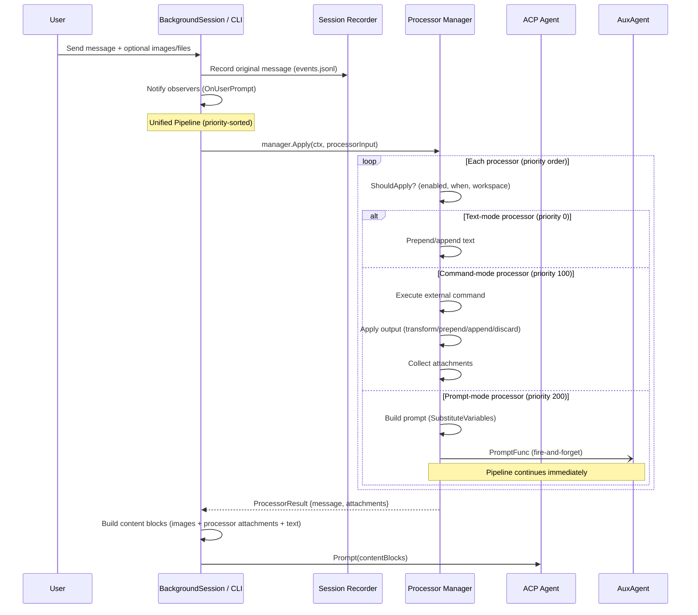
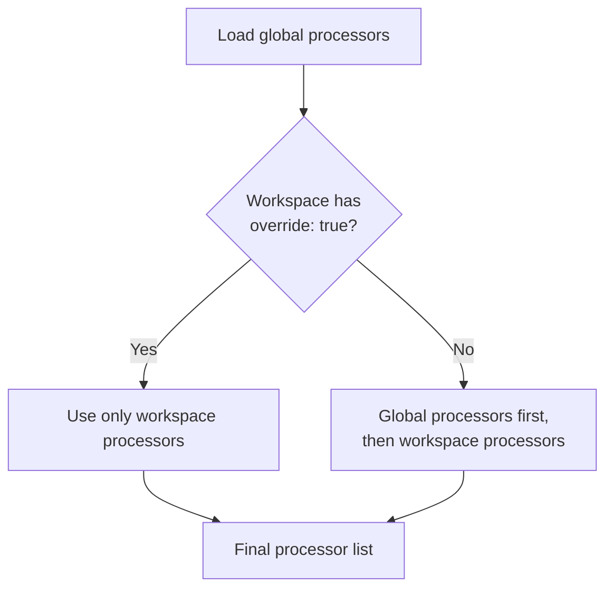
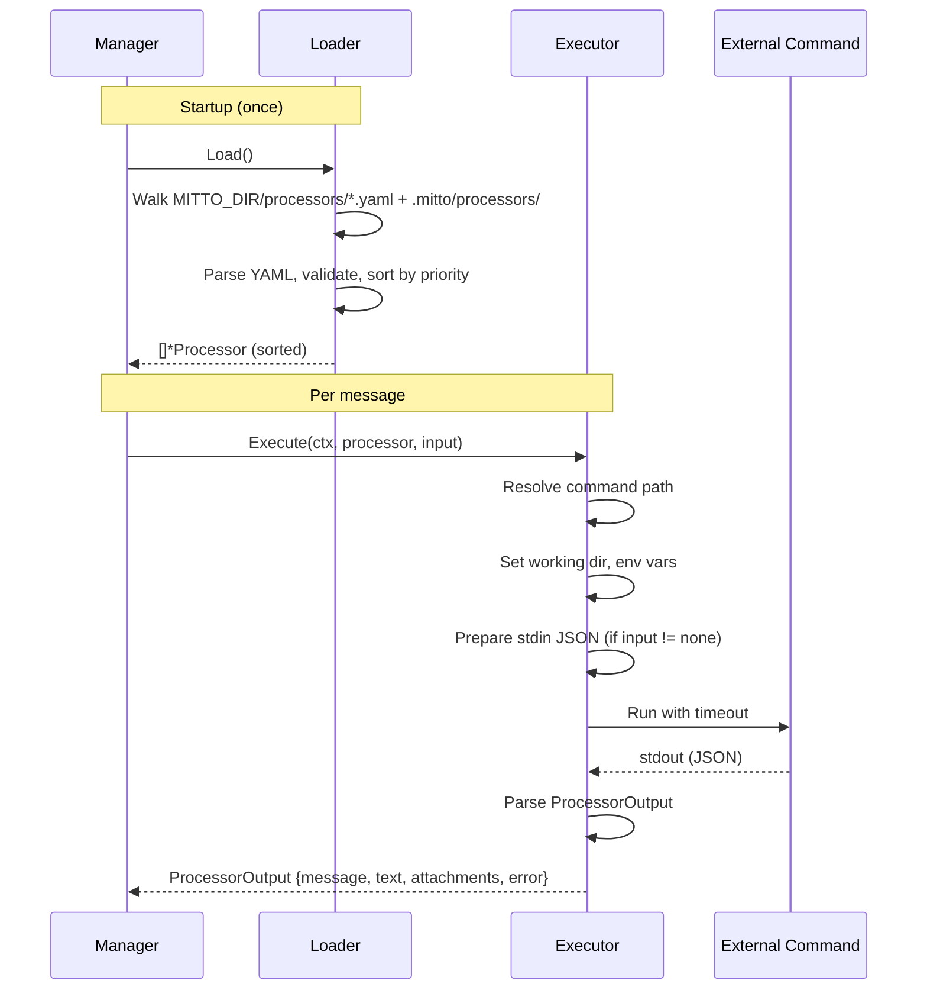
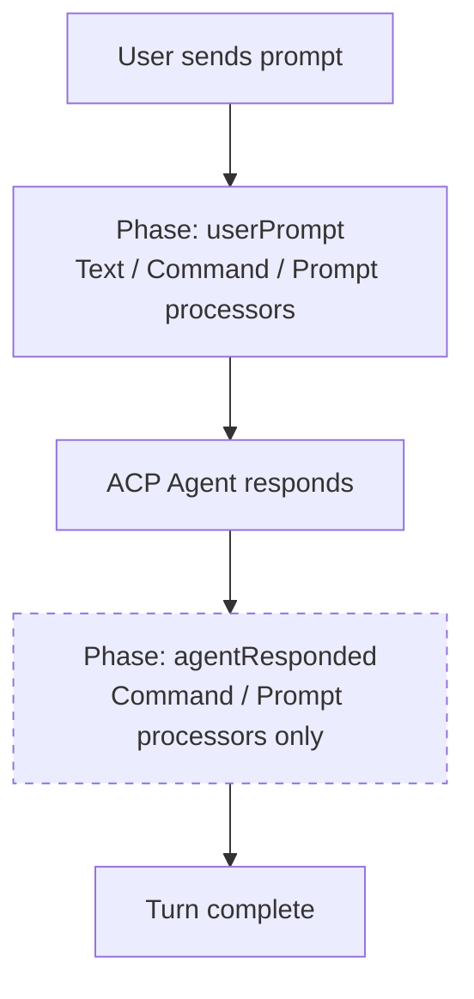

# Message Processing Pipeline

Mitto has a unified message processing pipeline. Processors can run at two points in the conversation lifecycle:

- **`userPrompt` phase** — fires *before* the user's message is sent to the ACP agent. All three modes (text, command, prompt) are valid. The original (untransformed) message is what gets recorded in session history.
- **`agentResponded` phase** — fires *after* the agent finishes a turn. Only command-mode and prompt-mode are valid. Data-extraction processors (e.g., `identify-user-data`, `memorize-preferences`) run here because they benefit from seeing the agent's reply.

## Architecture Overview

The pipeline is managed by a single `processors.Manager` that merges three types of processors into a priority-sorted (stable) list:

1. **Text-mode Processors** (from `config.MessageProcessor`) — Lightweight, declarative text prepend/append rules defined in YAML configuration. Only valid for `on: userPrompt`. Run at priority 0 by default.
2. **Command-mode Processors** (from `internal/processors/`) — External command-based transformations that can run arbitrary scripts, produce attachments, and fully replace messages. Valid for both phases. Run at priority 100 by default.
3. **Prompt-mode Processors** (from `internal/processors/`) — Fire-and-forget prompts dispatched to a workspace-scoped auxiliary AI agent. They do not modify the outgoing message. Valid for both phases. Run at priority 200 by default.

All processors use the same `when:` block schema with `on:` (phase) and `match:` fields. Text-mode processors from config are merged into the unified pipeline via `Manager.CloneWithTextProcessors()`, which returns a per-session copy to avoid data races on the shared Manager instance.

## Processing Flow



## Stage 1: Declarative Processors

Declarative processors are simple text insertion rules defined in configuration files.

### Configuration

Defined at two levels, merged at runtime:

| Level         | Source                        | Scope            |
| ------------- | ----------------------------- | ---------------- |
| **Global**    | `~/.mittorc` or `config.yaml` | All workspaces   |
| **Workspace** | `<project>/.mittorc`          | Single workspace |

```yaml
conversations:
  processing:
    override: false # true = replace global processors entirely
    processors:
      - when:
          on: userPrompt    # required: userPrompt | agentResponded
          match: first      # required: first | all | allExceptFirst
        mutate: prepend     # prepend | append (required for text mode)
        text: "System prompt.\n\n"
```

> **Note:** Inline `.mittorc` processors support `on:` and `match:` only — `rerun:`, `stopReasons:`, and `excludeOrigins:` are not available inline. Use standalone YAML processor files for those features.

### Merge Behavior



`config.MergeProcessors(global, workspace)` implements this logic. The merged list is stored on `BackgroundSession.processors` at creation time.

### Execution

Each processor is checked with `ShouldApply(isFirstMessage)` and applied with `Apply(message)`. Processors run in order — the output of one feeds into the next.

### Key Types

| Type                     | Package           | Purpose                                     |
| ------------------------ | ----------------- | ------------------------------------------- |
| `MessageProcessor`       | `internal/config` | Single prepend/append rule (inline `.mittorc`) |
| `ProcessorPhase`         | `internal/config` | Phase enum: `"userPrompt"` / `"agentResponded"` |
| `ProcessorMatch`         | `internal/config` | Match enum: `"first"` / `"all"` / `"allExceptFirst"` |
| `ProcessorMutate`        | `internal/config` | Mutate enum: `"prepend"` / `"append"` |
| `ProcessorWhenBlock`     | `internal/config` | `when:` block for inline processors (On + Match only) |
| `ConversationProcessing` | `internal/config` | Processor list + override flag              |
| `ConversationsConfig`    | `internal/config` | Top-level config (processors + queue + ...) |

## Stage 2: Command Processors

Command processors execute external commands (scripts, binaries) to transform messages. They are more powerful than declarative processors: they can read conversation history, produce file attachments, and fully replace messages.

### Configuration

Command processors are YAML files in `MITTO_DIR/processors/*.yaml` (typically `~/Library/Application Support/Mitto/processors/`):

```yaml
name: code-context
description: Adds project context from a script
when:
  on: userPrompt    # userPrompt | agentResponded
  match: first      # first | all | allExceptFirst
command: ./gather-context.sh
input: message      # message | conversation | none
output: prepend     # transform | prepend | append | discard
priority: 50        # Lower = runs first (default: 100)
timeout: 5s
working_dir: session # session | hook
on_error: skip      # skip | fail
workspaces:         # Optional: limit to specific projects
  - /path/to/project
```

### Processor Execution Flow



### Input/Output Protocol

**Input** (JSON on stdin, `input: message`):

```json
{
  "message": "user's message",
  "is_first_message": true,
  "session_id": "abc-123",
  "working_dir": "/path/to/project",
  "parent_session_id": "",
  "session_name": "Fix login bug",
  "acp_server": "claude-code",
  "workspace_uuid": "d4e5f6a7-...",
  "available_acp_servers": [
    {
      "name": "auggie",
      "type": "auggie",
      "tags": ["coding"],
      "current": false
    },
    {
      "name": "claude-code",
      "type": "claude-code",
      "tags": ["coding"],
      "current": true
    }
  ]
}
```

When `input: conversation`, the object additionally includes a `"history"` array of `{"role","content"}` objects.

**Output** (JSON on stdout):

```json
{
  "message": "replaced message", // For output: transform
  "text": "text to prepend or append", // For output: prepend/append
  "attachments": [
    // Optional file attachments
    { "type": "image", "path": "./diagram.png", "mime_type": "image/png" }
  ],
  "error": "", // Non-empty = hook failed
  "metadata": {} // Optional logging data
}
```

### Environment Variables

Command processors receive these environment variables:

| Variable                      | Value                                                                 |
| ----------------------------- | --------------------------------------------------------------------- |
| `MITTO_SESSION_ID`            | Current session ID                                                    |
| `MITTO_WORKING_DIR`           | Session working directory                                             |
| `MITTO_IS_FIRST_MESSAGE`      | `"true"` or `"false"`                                                 |
| `MITTO_PROCESSORS_DIR`        | Processors directory path                                             |
| `MITTO_PROCESSOR_FILE`        | This processor's YAML file path                                       |
| `MITTO_PROCESSOR_DIR`         | Directory containing the processor file                               |
| `MITTO_PARENT_SESSION_ID`     | Parent conversation ID (empty if root session)                        |
| `MITTO_SESSION_NAME`          | Conversation title/name                                               |
| `MITTO_ACP_SERVER`            | Active ACP server name (e.g. `claude-code`)                           |
| `MITTO_WORKSPACE_UUID`        | Workspace UUID                                                        |
| `MITTO_AVAILABLE_ACP_SERVERS` | JSON array of servers with workspaces for this folder; `[]` when none |

#### Examples

**A shell script that adds project context on the first message:**

```bash
#!/bin/bash
# gather-context.sh — prepends project info using env vars

if [ "$MITTO_IS_FIRST_MESSAGE" = "true" ]; then
  PROJECT=$(basename "$MITTO_WORKING_DIR")
  BRANCH=$(git -C "$MITTO_WORKING_DIR" rev-parse --abbrev-ref HEAD 2>/dev/null || echo "unknown")

  cat <<EOF
{
  "text": "Project: ${PROJECT} (branch: ${BRANCH})\nSession: ${MITTO_SESSION_ID}\n\n"
}
EOF
else
  echo '{}' # no-op for subsequent messages
fi
```

With its processor YAML (`MITTO_DIR/processors/gather-context.yaml`):

```yaml
name: gather-context
description: Adds project and branch info on the first message
when:
  on: userPrompt
  match: first
command: ./gather-context.sh
output: prepend
priority: 10
working_dir: hook # resolve command relative to the YAML file
```

**A processor that loads helper scripts from its own directory:**

```bash
#!/bin/bash
# Uses MITTO_PROCESSOR_DIR to find sibling files
source "$MITTO_PROCESSOR_DIR/helpers.sh"
# ...
```

### Key Types

| Type              | File             | Purpose                                   |
| ----------------- | ---------------- | ----------------------------------------- |
| `Processor`       | `types.go`       | Processor definition (parsed from YAML)   |
| `Phase`           | `types.go`       | Phase enum (`PhaseUserPrompt`, `PhaseAgentResponded`) |
| `Match`           | `types.go`       | Match enum (`MatchFirst`, `MatchAll`, `MatchAllExceptFirst`) |
| `WhenConfig`      | `types.go`       | `when:` block (On, Match, Rerun, Cadence, StopReasons, ExcludeOrigins) |
| `RerunConfig`     | `types.go`       | Rerun thresholds (AfterTime, AfterSentMsgs, AfterTokens) |
| `CadenceConfig`   | `types.go`       | Cadence thresholds (EveryNTurns, EveryNTokens, AfterInterval) |
| `ProcessorStateData` | `state.go`    | Persisted state (AgentResponseCount + per-processor cadence map) |
| `ProcessorCadenceState` | `state.go` | Per-processor cadence state (TurnsSinceLastFire, TokensSinceLastFire, LastFiredAt) |
| `StateStore`      | `state.go`       | Interface: Load/Save ProcessorStateData by session dir |
| `FileStateStore`  | `state.go`       | Prod implementation: atomic JSON writes to `processor_state.json` |
| `MemoryStateStore`| `state.go`       | Test implementation: in-memory map |
| `ProcessorSource` | `types.go`       | Source enum: `global`, `builtin`, `workspace`, `config` |
| `Manager`         | `apply.go`       | High-level load + apply interface         |
| `Loader`          | `loader.go`      | Discovers, parses, and validates processor YAML files |
| `Executor`        | `executor.go`    | Runs a single processor as subprocess     |
| `ProcessorInput`  | `input.go`       | Context sent to processor stdin           |
| `ProcessorOutput` | `input.go`       | Parsed result from processor stdout       |
| `Attachment`      | `input.go`       | File attachment from processor            |
| `WebProcessor`    | `session_api.go` | API response type for workspace processors endpoint |

## Validation Rules (`internal/processors/loader.go`)

The loader enforces 16 strict rules. Processors that fail any rule are skipped with a WARN log.

| # | Rule                                                                                 |
|---|--------------------------------------------------------------------------------------|
| 1 | `when.on` is required — must be `"userPrompt"` or `"agentResponded"`                |
| 2 | `when.match` is required — must be `"first"`, `"all"`, or `"allExceptFirst"`        |
| 3 | `when.match: "all-except-first"` (kebab-case) is explicitly rejected                |
| 4 | `on: agentResponded` forbids `text:` (text mode not meaningful post-response)        |
| 5 | `on: agentResponded` forbids `mutate:`                                               |
| 6 | `on: agentResponded` forbids `when.rerun:`                                           |
| 7 | `on: agentResponded` forbids `output: transform/prepend/append`                     |
| 8 | `on: agentResponded` defaults `stopReasons` to `["end_turn"]` if not specified       |
| 9 | `on: userPrompt` forbids `when.stopReasons:`                                         |
| 10| `on: userPrompt` forbids `when.excludeOrigins:`                                     |
| 11| Text-mode processors (`text:` set, `command:` empty) require `mutate: prepend` or `mutate: append` |
| 12| `when.cadence` is only valid with `on: agentResponded`                               |
| 13| `when.cadence` is not valid with `match: first` (firing once needs no cadence)       |
| 14| `when.cadence` requires at least one threshold field to be set                       |
| 15| `when.cadence.everyNTurns` and `when.cadence.everyNTokens` must be non-negative      |
| 16| `when.cadence.afterInterval` must be a parseable Go duration string (e.g. `"5m"`)    |

Additionally, `when.rerun:` is only allowed with `match: first` — combining with `match: all` or `match: allExceptFirst` is rejected.

## Cadence and Persisted State

`on: agentResponded` processors with `match: all` can use the `cadence:` block to throttle
how frequently they fire. All specified thresholds are evaluated with AND logic — every
specified threshold must be met simultaneously.

### `CadenceConfig` struct (`internal/processors/types.go`)

```go
type CadenceConfig struct {
    EveryNTurns  int    // fire every N agent responses since last firing
    EveryNTokens int    // AND: only after N cumulative tokens since last firing
    AfterInterval string // AND: only after this wall-clock duration since last firing
}
```

`GetAfterIntervalDuration()` parses `AfterInterval` via `time.ParseDuration`.

### Pre-increment semantics

The turn counter is incremented **before** the gate check, so `everyNTurns: 3` fires on
agent responses 3, 6, 9, … (every 3rd response), not 4, 7, 10, … This is the most
intuitive interpretation of "every N turns".

### `StateStore` interface (`internal/processors/state.go`)

```go
type StateStore interface {
    Load(sessionDir string) (*ProcessorStateData, error)
    Save(sessionDir string, state *ProcessorStateData) error
}
```

| Implementation    | Used when          | Behavior                                         |
| ----------------- | ------------------ | ------------------------------------------------ |
| `FileStateStore`  | Production         | Reads/writes `<session_dir>/processor_state.json` via `fileutil.WriteJSONAtomic` |
| `MemoryStateStore`| Tests              | In-memory map keyed by `sessionDir`; never hits disk |

### Persisted state shape (`ProcessorStateData`)

```go
type ProcessorStateData struct {
    AgentResponseCount int                          // global response counter
    Processors         map[string]*ProcessorCadenceState // per-processor cadence state
}

type ProcessorCadenceState struct {
    TurnsSinceLastFire  int       // how many turns since this processor last fired
    TokensSinceLastFire int       // cumulative tokens since last firing
    LastFiredAt         time.Time // wall-clock time of last firing (zero = never)
}
```

State file location: `<session_dir>/processor_state.json`
(e.g., `~/Library/Application Support/Mitto/sessions/{id}/processor_state.json`)

### Q1 resolution: `match: first` across session restarts

The old in-memory `agentResponseCount` on `Manager` was replaced by the persisted
`AgentResponseCount` field in `ProcessorStateData`. On session resume, `ApplyAfter`
loads the state file and checks whether `AgentResponseCount > 0` — if so, the processor
has already fired and `match: first` is honoured correctly across restarts.

### Clock injection for tests

`Manager` exposes `SetClock(func() time.Time)` to allow deterministic time-based testing:

```go
fakeNow := time.Now()
mgr.SetClock(func() time.Time { return fakeNow })
// Advance time in tests:
fakeNow = fakeNow.Add(10 * time.Minute)
```

### Crash safety

State is saved at the **end** of `ApplyAfter`. A crash mid-flight may lose one turn
increment, which is acceptable — the cadence will fire one turn later at worst. Atomic
writes via `fileutil.WriteJSONAtomic` prevent partial writes from corrupting the file.

## Two-Phase Architecture



## Variable Substitution

After all processors have run, a final substitution pass replaces `@mitto:variable` placeholders in the resulting message with session metadata values. This works in both processor-injected text and the user's original message text.

### Syntax

Use the `@mitto:` prefix followed by the variable name: `@mitto:variable_name`

This is consistent with the existing `@namespace:value` convention used by processor triggers (e.g., `@git:status`, `@file:path`).

### Available Variables

| Variable                       | Value                                                            |
| ------------------------------ | ---------------------------------------------------------------- |
| `@mitto:session_id`            | Current session ID                                               |
| `@mitto:parent_session_id`     | Parent conversation ID (empty if root session)                   |
| `@mitto:session_name`          | Conversation title/name (empty if not yet set)                   |
| `@mitto:working_dir`           | Session working directory                                        |
| `@mitto:acp_server`            | ACP server name (e.g., `"claude-code"`)                          |
| `@mitto:workspace_uuid`        | Workspace identifier                                             |
| `@mitto:available_acp_servers` | ACP servers with workspaces for the session's folder — see below |
| `@mitto:periodic`              | `"true"` if this prompt was triggered by the periodic runner, `"false"` otherwise |
| `@mitto:periodic_forced`       | `"true"` if this is a manually-triggered periodic run (via "run now"), `"false"` otherwise |

### `@mitto:available_acp_servers` detail

This variable renders the ACP servers that have workspaces configured for the session's working directory — the same set reported by the `mitto_conversation_get_current` MCP tool. It uses the format:

```
name [tag1, tag2] (current), name2 [tag3]
```

Each entry contains:

- **name** — ACP server identifier
- **[tags]** — optional tag list in brackets (omitted if the server has no tags)
- **(current)** — appended to the active server's entry

Example output with two servers configured for the same folder:

```
auggie [coding, ai-assistant] (current), claude-code [coding, fast-model]
```

The full structured data (including `type` field) is also available:

- As a JSON array in the `available_acp_servers` field of the JSON stdin payload sent to command processors
- As a JSON array in the `MITTO_AVAILABLE_ACP_SERVERS` environment variable (set to `[]` when no servers are available)

### Behavior

- **Unknown variables** (e.g., `@mitto:unknown`) are left as-is — they are NOT replaced with an empty string.
- **Empty values** substitute to an empty string (e.g., `@mitto:parent_session_id` → `""` when there is no parent).
- **`@mitto:available_acp_servers`** substitutes to an empty string when the workspace has no servers configured.
- **Fast path**: if the message contains no `@mitto:`, substitution is skipped entirely.
- **Escaping**: prefix a variable with a backslash (`\@mitto:variable`) to suppress substitution. The backslash is stripped and the variable name is passed through as-is (e.g. `\@mitto:session_id` → `@mitto:session_id`).
- Substitution runs on the **final message** after all processor text has been applied — both declarative (prepend/append) and command-processor output are included.

### Where Substitution Happens

Substitution is applied **after** `processorManager.Apply()` returns:

- **Web mode**: Called in `BackgroundSession.PromptWithMeta()` (`internal/web/background_session.go`) after the processor pipeline completes.
- **CLI mode**: Called in `runOnceMode()` / `runInteractiveLoop()` (`internal/cmd/cli.go`) after the processor pipeline completes. CLI variables that require a running session (e.g., `@mitto:session_id`) substitute to empty strings.

The implementation is in `SubstituteVariables()` in `internal/processors/variables.go`.

### Data Flow for `@mitto:available_acp_servers`

The available server list is computed once per session, not per prompt:

1. `SessionManager.buildAvailableACPServers(folder, currentACPServer)` is called in both `CreateSessionWithWorkspace` and `ResumeSession`
2. It mirrors the MCP tool logic: calls `GetWorkspacesForFolder(folder)` to find workspaces, then filters `mittoConfig.ACPServers` to those with a matching workspace
3. The result (`[]processors.AvailableACPServer`) is stored in `BackgroundSessionConfig.AvailableACPServers`
4. `BackgroundSession` stores it as `availableACPServers`
5. At prompt time, `PromptWithMeta` copies it into `ProcessorInput.AvailableACPServers`
6. `SubstituteVariables` calls `formatAvailableACPServers()` to produce the text value

The `AvailableACPServer` type is defined in `internal/processors/input.go` to avoid import cycles between `internal/processors` and `internal/mcpserver`.

### See Also

- [`docs/config/conversations.md`](../../docs/config/conversations.md) — user guide for declarative processor `text` fields with `@mitto:variable` examples
- [`docs/config/processors.md`](../../docs/config/processors.md) — user guide for command processors: full input JSON, env-var table, and substitution reference

### Example: System prompt with session metadata

A declarative processor in `.mittorc`:

```yaml
conversations:
  processing:
    processors:
      - when:
          on: userPrompt
          match: first
        mutate: prepend
        text: "Session: @mitto:session_id\nProject: @mitto:working_dir\n\n"
```

A command processor YAML that uses a variable in its `text` field is also supported — the substitution runs on the final assembled message, so any text that ends up in the output will have its variables replaced.

### CLI Mode

In CLI mode (`internal/cmd/cli.go`), all session metadata variables (`@mitto:session_id`, `@mitto:session_name`, `@mitto:parent_session_id`, `@mitto:workspace_uuid`, `@mitto:acp_server`) substitute to empty string since there is no backing session store. `@mitto:working_dir` substitutes to the CLI working directory.

## Workspace Processor Management

### Source Tracking

Each processor carries a `Source` field (`ProcessorSource` type in `types.go`) indicating where it was loaded from:

| Source      | Constant                   | Set when                                                               |
| ----------- | -------------------------- | ---------------------------------------------------------------------- |
| `global`    | `ProcessorSourceGlobal`    | Loaded from `MITTO_DIR/processors/`                                    |
| `builtin`   | `ProcessorSourceBuiltin`   | Loaded from `MITTO_DIR/processors/builtin/`                            |
| `workspace` | `ProcessorSourceWorkspace` | Loaded from `.mitto/processors/` via `CloneWithDirProcessors`          |
| `config`    | `ProcessorSourceConfig`    | Text-mode processors from `.mittorc` configuration                     |

Source stamping happens in `apply.go`:
- `Load()` stamps `ProcessorSourceGlobal` on all loaded processors
- `AddTextProcessors()` stamps `ProcessorSourceConfig`
- `CloneWithDirProcessors()` stamps `ProcessorSourceWorkspace`

### Enable/Disable API

Two REST endpoints manage processor enabled state per workspace:

| Endpoint                                      | Method | Description                                                  |
| --------------------------------------------- | ------ | ------------------------------------------------------------ |
| `/api/workspace-processors?dir=...`           | GET    | List all processors for a workspace with source and enabled state |
| `/api/workspace-processors/toggle-enabled`    | PUT    | Toggle a processor's enabled state                           |

**GET response** includes processors sorted by source (workspace first, then global) and name, with the `processors` overrides from `.mittorc` applied.

**PUT request body:**
```json
{
  "dir": "/path/to/workspace",
  "name": "processor-name",
  "enabled": false
}
```

Toggle logic:
- **Workspace YAML files**: Updates `enabled` field directly via `UpdateProcessorFileEnabled()` in `yaml_update.go`
- **Global/builtin processors**: Records in `.mittorc` `processors` section (list of `{name, enabled}` entries) via `SaveWorkspaceRCProcessorEnabled()`. Mirrors the prompts pattern.
- Cache is invalidated via `SessionManager.InvalidateWorkspaceRC()` after each toggle

### Processor Statistics

The `Manager` tracks runtime statistics (thread-safe):

| Field              | Type        | Description                                          |
| ------------------ | ----------- | ---------------------------------------------------- |
| `totalActivations` | `int`       | Total calls to `Apply()` or `applyWithRerun()`       |
| `lastActivationAt` | `time.Time` | Timestamp of the most recent activation              |

Getters: `ProcessorCount()`, `TotalActivations()`, `LastActivationAt()`.

Stats are sent to the frontend via:
- `connected` WebSocket message (initial values)
- `prompt_complete` message (after each prompt)
- `keepalive_ack` message (periodic refresh)

Fields in WebSocket payloads: `processor_count`, `processor_activations`, `processor_last_activation`.

## Integration Points

The unified pipeline integrates at a single point in `BackgroundSession.PromptWithMeta()`:

```
1. Record original message → observers + events.jsonl
2. processorManager.Apply(ctx, processorInput)               ← unified pipeline
3. Build content blocks (uploaded images + processor attachments + text)
4. Send to ACP agent
```

The CLI (`internal/cmd/cli.go`) follows the same pattern in both `runOnceMode()` and `runInteractiveLoop()`. Text-mode processors from config are merged into the Manager via `CloneWithTextProcessors()` during session creation.

### First-Message Tracking

- **New sessions**: `isFirstPrompt = true`, set to `false` after first prompt
- **Resumed sessions**: `isFirstPrompt = true` (context re-injected after restart/unarchive since agent process is fresh)
- **CLI once mode**: Always `isFirst = true` (single message)
- **CLI interactive**: Tracks `isFirstMessage` boolean, flipped after first send

### First-Message User-Request Delimiting

On the first message of a conversation (`IsFirstMessage=true`), both `ApplyProcessors` and
`applyWithRerun` wrap the original user text in an explicit XML delimiter before any processor
runs:

```
<user_request>
{original user message}
</user_request>
```

**Rationale:** The always-on `session-context` processor prepends a block of session metadata
ending with `---`, and several first-message-only processors (beads tracking, delegation rules,
tool checks, etc.) append instruction walls after the user text. On a short first message the
model would sometimes classify the real request as setup boilerplate and reply "no task — just
setup context". The delimiter makes the boundary unambiguous regardless of how much text
processors inject before or after.

**Scope:** The wrapping is applied only to the ACP-bound assembled text. The original message
stored in `events.jsonl` and shown in the UI transcript is never modified — only the outgoing
ACP payload receives the wrapper.

**Rerun case:** The wrapping also applies in `applyWithRerun` when `origIsFirst` is true OR
when any rerun override is active. This covers later messages where session-context and
append-mode processors re-fire (e.g. after a long context window gap) and would otherwise
bury the current user message again.

**Command-mode stdin tradeoff:** Command-mode processors receive `result.Message` as stdin,
so on a first message they see the wrapped text. This is an accepted minor tradeoff; the
impactful built-in processors (session-context, delegation rules, reminders) are all text-mode
or prompt-mode and are not affected.
