# Prompt Menus & Dispatch

This document covers how prompts are surfaced across the different UI menus
(ChatInput drop-up, per-conversation context menu, Beads list menus) and how
selecting one either **sends into an existing conversation** or **creates a new
conversation**. For the user-facing front-matter reference (all fields, `menus`,
`enabledWhen`, `requires`, `periodic`, parameters), see
[docs/config/prompts.md](../config/prompts.md). For the underlying queue
mechanics, see [Message Queue](message-queue.md).

## Overview

Every prompt — regardless of source (built-in YAML, global file, settings,
ACP-specific, workspace dir, or workspace inline) — carries an optional `menus`
front-matter field. That single field is the **routing key** that decides which
UI surfaces show the prompt. The *start behavior* (existing vs new conversation)
is then determined by which menu the user invoked it from, not by the prompt
itself.

```mermaid
flowchart TB
    EP[GET /api/workspace-prompts<br/>merge sources + enabledWhen filter]
    EP --> CM[conversation menu]
    EP --> BI[beadsIssues / beadsList menus]
    EP --> DP[prompts dropup]

    CM -->|handleSendPromptToConversation| SEED[seedConversationWithPrompt]
    BI -->|handleRunBeads*Prompt| START[startConversationWithPrompt]

    SEED -->|POST /sessions/&#123;id&#125;/queue| Q[(existing conversation queue)]
    START -->|POST /sessions<br/>initial_prompt_name| NEW[seedQueueWithNamedPrompt]
    NEW --> Q2[(new conversation queue)]

    Q --> DISP[dispatch: promptResolver + SubstituteArguments]
    Q2 --> DISP
    DISP --> AGENT[ACP agent]
```



## 1. The `menus` field is the routing key

`Menus` is a comma-separated list declaring which UI menus a prompt appears in.
Defined on both `PromptFile` and `WebPrompt` in `internal/config/prompts.go` /
`internal/config/config.go`. A missing/empty value defaults to `["prompts"]`
(see `promptMenus` in `web/static/utils/prompts.js`).

| `menus` value     | UI surface                                                    | Start behavior                                  |
| ----------------- | ------------------------------------------------------------ | ----------------------------------------------- |
| `prompts`         | ChatInput drop-up (default)                                   | sends into the **active** conversation          |
| `promptsPeriodic` | periodic prompt selector                                      | configures a periodic schedule                  |
| `conversation`    | per-conversation context menu (sidebar row + chat header ⋯)  | **sends into the clicked existing conversation** |
| `beadsIssues`     | per-issue right-click **New ›** submenu in the Beads list     | **creates a new conversation** (with `ISSUE_ID`) |
| `beadsList`       | list-level prompts button in the Beads list footer           | **creates a new conversation** (no per-issue arg)|

### `requires` capability gating

Independently of `menus`, a prompt may declare `requires` (comma-separated
capabilities). A menu only shows the prompt if it provides **all** required
capabilities. Menus advertise their capabilities in `MENU_CAPABILITIES`
(`web/static/utils/prompts.js`); today only `beadsIssues` provides
`parameters`, so parameterized prompts (those needing `${ISSUE_ID}`) surface
only there. The client check is `menuSatisfiesRequires(prompt, menu)`.

## 2. One endpoint feeds every menu

All menus fetch from `GET /api/workspace-prompts`
(`handleWorkspacePromptsGET`, `internal/web/session_api.go`). The endpoint:

1. **Merges** prompts from all sources, lowest-to-highest priority: global file
   → settings → ACP-specific → workspace dir → workspace inline.
2. **Filters** by evaluating each prompt's `enabledWhen` CEL expression against
   a `config.PromptEnabledContext`, dropping disabled prompts.

The **evaluation context differs by caller** — this is the subtle part:

- **Conversation menu** (`fetchConversationPromptsForSession` in
  `web/static/hooks/useWorkspacePrompts.js`) passes
  `?dir=...&session_id=<that conversation>`. `enabledWhen` is therefore
  evaluated against *the specific conversation being right-clicked* — its
  `session.isChild`, `children.*`, `permissions.*`, `parent.*`, `tools.*`.
- **Beads menus** (`fetchBeadsPromptsForWorkspace` /
  `fetchBeadsListPromptsForWorkspace` in
  `web/static/hooks/useBeadsIntegration.js`) pass
  `?dir=...&enabled_context=workspace`, optionally the active `session_id`, and
  for per-issue rows the `item_*` params (`item_kind`, `item_id`,
  `item_status`, `item_type`, `item_priority`). When no session is active the
  backend builds a session-less context via `buildWorkspacePromptEnabledContext`
  so gates like `commandExists("bd")`, `dirExists(".beads")`, and
  `item.status != "closed"` still evaluate. The `item.*` namespace lets each row
  gate itself (e.g. hide **Start work** on closed issues).

After fetching, the client filters once more by
`promptMenus(p).includes(<menu>) && menuSatisfiesRequires(p, <menu>)`.

## 3. The two start behaviors

Both paths converge on the **same queue + named-prompt mechanism**; they differ
only in *which conversation* receives the prompt. Critically, neither path sends
the resolved prompt text — both send the prompt **by name** and let the target
conversation resolve it at dispatch (see §4).

### Case 1 — send into an EXISTING conversation (`menus: conversation`)

Flow: context-menu click → `useConversationMenu` →
`handleSendPromptToConversation(session, prompt)` (`app.js`) →
`seedConversationWithPrompt(sessionId, prompt)`
(`web/static/hooks/useConversationSeeding.js`).

It POSTs the prompt **by name** to that conversation's queue:

```
POST /api/sessions/{id}/queue
{ "prompt_name": "Summarize Progress", "arguments": { ... } }
```

Backend `handleAddToQueue` (`internal/web/queue_api.go`) stores a
`QueuedMessage{ PromptName, Arguments, Message: "" }`, skips title generation
(the prompt name is the label), then calls `bs.TryProcessQueuedMessage()`. The
queue delivers it when that conversation is idle — so it works for **any**
conversation, not just the active one.

### Case 2 — create a NEW conversation (`menus: beadsIssues` / `beadsList`)

Flow: per-issue **New ›** click → `handleRunBeadsPrompt(prompt, issue)` (or
`handleRunBeadsListPrompt`) in `web/static/hooks/useBeadsIntegration.js` →
`startConversationWithPrompt({ ... })`.

`startConversationWithPrompt` (non-periodic) calls `newSession` with
`initialPromptName` + `arguments`:

```
POST /api/sessions
{ "working_dir": "...", "acp_server": "...", "name": "<id> · <title>",
  "beads_issue": "<id>", "initial_prompt_name": "Start work",
  "arguments": { "ISSUE_ID": "<id>" } }
```

The backend creates the session then **atomically seeds its queue** via
`seedQueueWithNamedPrompt` (`internal/web/session_api.go`) — the same queue
plumbing as Case 1, just on a fresh conversation. `beads_issue` links the new
conversation to the bead; the `<id> · <title>` name suppresses auto-titling.
`beadsList` prompts are identical but carry no `ISSUE_ID` (they operate on the
whole tracker).

## 4. Why both paths defer resolution to dispatch

Neither path embeds the resolved prompt text in the request — both store only
`prompt_name` (+ `arguments`) in the queue. Resolution is **deferred to the
target conversation's context**. When the queued message is popped and
dispatched, `BackgroundSession` resolves it (`internal/web/background_session.go`):

```go
resolved, err := bs.promptResolver(meta.PromptName, bs.workingDir)
// ...
if len(meta.Arguments) > 0 {
    message = processors.SubstituteArguments(message, meta.Arguments)
}
```

This guarantees that workspace-specific overrides, ACP-server filtering, and
`enabledWhen` are evaluated in the **right** environment — important because the
request may have originated from a different workspace (e.g. the Beads view is
open for project A while the active conversation is in project B). The
`${ISSUE_ID}` placeholder in a bead prompt body is filled here; the prompt then
loads further detail itself via `bd show ${ISSUE_ID}`. The `arguments` map
supports bash-like `${VAR}` and `${VAR:-default}` syntax
(`processors.SubstituteArguments`). The argument count (`len(meta.Arguments)`) is
persisted as `argument_count` on `UserPromptData` and broadcast via the `user_prompt`
WebSocket message; the frontend renders a small numeric badge on the `NamedPromptPill`
component when `argument_count > 0`.

See [Message Queue → Named prompts](message-queue.md) for the queue field
semantics (`prompt_name`, `arguments`, skipped title generation).

## 5. The periodic overlay

Any prompt in any of these menus may additionally declare `periodic:`. When
present, the start handlers branch instead of doing a one-shot seed:

- **Conversation menu** — `decidePeriodicAction` chooses:
  - `new-periodic` — no session yet → open the schedule dialog → create a NEW
    periodic conversation.
  - `make-periodic` — a regular conversation → configure it as periodic + fire
    the first run.
  - `one-shot` — already periodic, or a child conversation → enqueue once
    without changing config (the backend also returns HTTP 400 for
    periodic-on-child).
- **Beads menus** — `onOpenPeriodicDialog` → `startConversationWithPrompt({
  periodic })`, which creates the session **without** a queue seed and instead
  `PUT`s `/api/sessions/{id}/periodic` with the `prompt_name` + frequency.

Periodic conversations can only be **top-level** (not children). The `at` field
(HH:MM UTC) is only sent for `unit: days`.

## 6. Key files

| Layer    | File                                              | Responsibility                                                        |
| -------- | ------------------------------------------------- | --------------------------------------------------------------------- |
| Model    | `internal/config/prompts.go`, `config.go`         | `PromptFile`/`WebPrompt`, `Menus`, `EnabledWhen`, `Periodic`, params   |
| Backend  | `internal/web/session_api.go`                     | `handleWorkspacePromptsGET`, `seedQueueWithNamedPrompt`, contexts      |
| Backend  | `internal/web/queue_api.go`                       | `handleAddToQueue` (stores `prompt_name`/`arguments`)                  |
| Backend  | `internal/web/background_session.go`              | dispatch-time `promptResolver` + `SubstituteArguments`                 |
| Backend  | `internal/session/queue.go`                       | `QueuedMessage{ PromptName, Arguments }`, `Add`/`Pop`                  |
| Frontend | `web/static/utils/prompts.js`                     | `promptMenus`, `MENU_CAPABILITIES`, `menuSatisfiesRequires`            |
| Frontend | `web/static/hooks/useWorkspacePrompts.js`         | `fetchConversationPromptsForSession`                                   |
| Frontend | `web/static/hooks/useBeadsIntegration.js`         | `fetchBeads*PromptsForWorkspace`, `handleRunBeads*Prompt`              |
| Frontend | `web/static/hooks/useConversationSeeding.js`      | `seedConversationWithPrompt`, `startConversationWithPrompt`            |
| Frontend | `web/static/hooks/useConversationMenu.js`         | per-conversation context menu assembly                                |
| Frontend | `web/static/app.js`                               | `handleSendPromptToConversation` (periodic branching)                 |

## See Also

- [docs/config/prompts.md](../config/prompts.md) — user-facing front-matter
  reference (`menus`, `enabledWhen`, `requires`, `periodic`, parameters)
- [Message Queue](message-queue.md) — queue storage, named-prompt dispatch,
  REST API
- [Message Processing Pipeline](processors.md) — `@mitto:` variable substitution
  and `${VAR}` argument substitution
