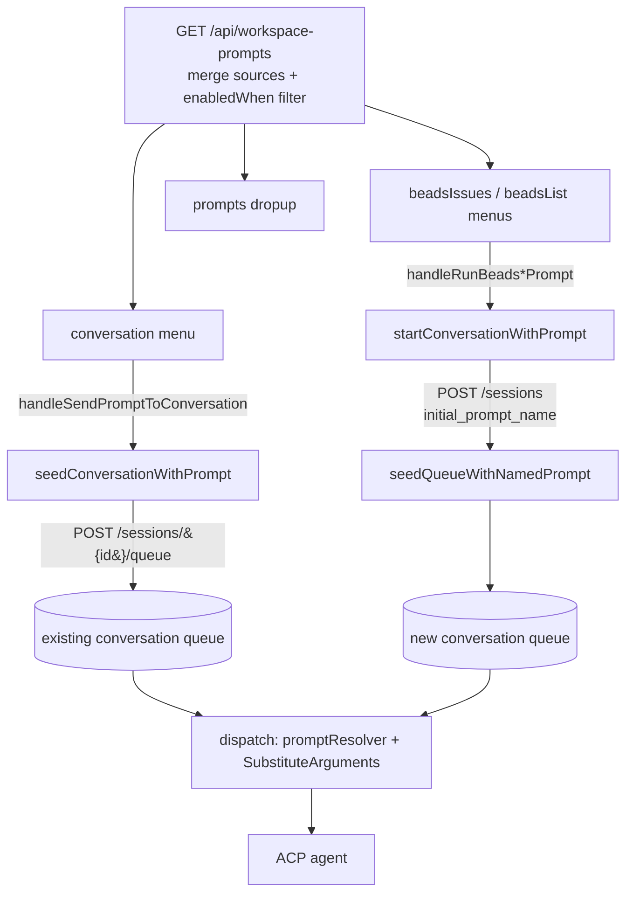

# Prompt Menus & Dispatch

This document covers how prompts are surfaced across the different UI menus
(ChatInput drop-up, per-conversation context menu, Beads list menus) and how
selecting one either **sends into an existing conversation** or **creates a new
conversation**. For the user-facing front-matter reference (all fields, `menus`,
`enabledWhen`, `requires`, `loop`, parameters), see
[docs/config/prompts.md](../config/prompts.md). For the underlying queue
mechanics, see [Message Queue](message-queue.md).

## Overview

Every prompt — regardless of source (built-in YAML, global file, settings,
ACP-specific, workspace dir, or workspace inline) — carries an optional `menus`
front-matter field. That single field is the **routing key** that decides which
UI surfaces show the prompt. The *start behavior* (existing vs new conversation)
is then determined by which menu the user invoked it from, not by the prompt
itself.


```mermaid
flowchart TB
    EP[GET /api/workspace-prompts<br/>merge sources + enabledWhen filter]
    EP --> CM[conversation menu]
    EP --> BI[beadsIssues / beadsList menus]
    EP --> DP[prompts dropup]

    CM -->|handleSendPromptToConversation| SEED[seedConversationWithPrompt]
    BI -->|handleRunBeads*Prompt| START[startConversationWithPrompt]

    SEED -->|POST /sessions/&#123;id&#125;/queue| Q[(existing conversation queue)]
    START -->|POST /sessions<br/>initial_prompt_name| NEW[seedQueueWithNamedPrompt]
    NEW --> Q2[(new conversation queue)]

    Q --> DISP[dispatch: promptResolver + SubstituteArguments]
    Q2 --> DISP
    DISP --> AGENT[ACP agent]
```

## 1. The `menus` field is the routing key

`Menus` is a comma-separated list declaring which UI menus a prompt appears in.
Defined on both `PromptFile` and `WebPrompt` in `internal/config/prompts.go` /
`internal/config/config.go`. A missing/empty value defaults to `["prompts"]`
(see `promptMenus` in `web/static/utils/prompts.js`).

| `menus` value     | UI surface                                                    | Start behavior                                  |
| ----------------- | ------------------------------------------------------------ | ----------------------------------------------- |
| `prompts`         | ChatInput drop-up (default)                                   | sends into the **active** conversation          |
| `promptsLoop` | loop prompt selector                                      | configures a loop schedule                  |
| `conversation`    | per-conversation context menu (sidebar row + chat header ⋯)  | **sends into the clicked existing conversation** |
| `beadsIssues`     | per-issue right-click **New ›** submenu in the Beads list     | **creates a new conversation** (with `ISSUE_ID`) |
| `beadsList`       | list-level prompts button in the Beads list footer           | **creates a new conversation** (no per-issue arg)|

**Exclusion syntax (`!menu`):** A `!`-prefixed token explicitly opts the prompt
*out* of a menu, taking precedence over any union or implicit inclusion rule.
For example, `menus: prompts, !promptsLoop` shows the prompt in the ChatInput
dropup but hides it from the loop prompt selector (which otherwise includes all
`prompts`-tagged prompts via a union rule). Exclusion tokens are parsed and applied
on the frontend (`promptMenuExcludes` / `promptMenuIncludes` in
`web/static/utils/prompts.js`); the backend ignores them during validation.

### Type-based menu gating

Independently of `menus`, a prompt that declares `parameters` is subject to
type-based gating: a menu only shows the prompt when it can auto-supply every
**required** parameter type. Menus advertise their provided types in
`MENU_PARAM_TYPES` (`web/static/utils/prompts.js`); today only `beadsIssues`
provides `{beadsId, beadsTitle}`. The client check is `menuSatisfies(prompt, menu)`.

A parameter with `required: false` is **optional** — it does not gate menu
visibility. The prompt appears in any menu regardless of whether that menu can
supply the type. When the menu *can* supply the type the argument is auto-filled;
when it cannot, the parameter is silently omitted (no blocking form is shown).

## 2. One endpoint feeds every menu

All menus fetch from `GET /api/workspace-prompts`
(`handleWorkspacePromptsGET`, `internal/web/session_api.go`). The endpoint:

1. **Merges** prompts from all sources, lowest-to-highest priority: global file
   → settings → ACP-specific → workspace dir → workspace inline.
2. **Filters** by evaluating each prompt's `enabledWhen` CEL expression against
   a `config.PromptEnabledContext`, dropping disabled prompts.

The **evaluation context differs by caller** — this is the subtle part:

- **Conversation menu** (`fetchConversationPromptsForSession` in
  `web/static/hooks/useWorkspacePrompts.js`) passes
  `?dir=...&session_id=<that conversation>`. `enabledWhen` is therefore
  evaluated against *the specific conversation being right-clicked* — its
  `Session.IsChild`, `Children.*`, `Permissions.*`, `Parent.*`, `Tools.*`.
- **Beads menus** (`fetchBeadsPromptsForWorkspace` /
  `fetchBeadsListPromptsForWorkspace` in
  `web/static/hooks/useBeadsIntegration.js`) pass only
  `?dir=...&enabled_context=workspace` (and for per-issue rows the `item_*`
  params: `item_kind`, `item_id`, `item_status`, `item_type`, `item_priority`,
  `item_labels`). `session_id` is intentionally **not** sent (mitto-kvot):
  these menus always spawn NEW root conversations via `newSession`, so gating
  by the incidentally-open sidebar conversation's `Session.IsChild` /
  `Permissions.*` / `Tools.*` would be semantically wrong. The backend builds
  a session-less context via `buildWorkspacePromptEnabledContext` with
  `Session.IsChild=false` and `Permissions.CanStartConversation=true`, so
  gates like `CommandExists("bd")`, `DirExists(".beads")`, and
  `Item.Status != "closed"` still evaluate. The `Item.*` namespace lets each
  row gate itself (e.g. hide **Start work** on closed issues).

After fetching, the client filters once more by
`promptMenus(p).includes(<menu>) && menuSatisfies(p, <menu>)`.

**All of those call sites go through one shared client-side cache**
(`fetchWorkspacePromptsCached` in `web/static/utils/promptsCache.js`, mitto-8x9).
Because every prompt's `enabledWhen` is re-evaluated server-side per request, a
burst (menu open, re-render, `beads_changed` fan-out, one row per beads issue)
would otherwise trigger one full evaluation pass each. The cache collapses them
in three layers, keyed on the canonicalized request params (`working_dir`,
`session_id`, `enabled_context`, `item_*`):

1. **TTL** — a response is reused for 3s.
2. **In-flight dedup** — concurrent calls with the same key share one promise,
   so N simultaneous callers issue one request.
3. **Revalidation** — once the TTL expires the request carries
   `If-Modified-Since` from the remembered `Last-Modified`; a 304 re-serves the
   cached body.

`{ force: true }` bypasses layers 1–3 (still deduping in flight) and is used
where a stale answer would be wrong: workspace change, session switch, and the
`mitto:prompts_changed` handler. That handler is itself **trailing-edge
debounced by 250ms** (`useWorkspacePrompts.js`), because one on-disk change fans
out over several events (`prompts_changed`, `mcp_tools_available`, plus the
server's re-broadcast after an async MCP-tools re-verify).
`invalidateWorkspacePromptsCache(workingDir?)` clears everything or one
workspace's entries after a mutation.

## 3. The two start behaviors

Both paths converge on the **same queue + named-prompt mechanism**; they differ
only in *which conversation* receives the prompt. Critically, neither path sends
the resolved prompt text — both send the prompt **by name** and let the target
conversation resolve it at dispatch (see §4).

### Case 1 — send into an EXISTING conversation (`menus: conversation`)

Flow: context-menu click → `useConversationMenu` →
`handleSendPromptToConversation(session, prompt)` (`app.js`) →
`seedConversationWithPrompt(sessionId, prompt)`
(`web/static/hooks/useConversationSeeding.js`).

It POSTs the prompt **by name** to that conversation's queue:

```
POST /api/sessions/{id}/queue
{ "prompt_name": "Summarize Progress", "arguments": { ... } }
```

Backend `handleAddToQueue` (`internal/web/queue_api.go`) stores a
`QueuedMessage{ PromptName, Arguments, Message: "" }`, skips title generation
(the prompt name is the label), then calls `bs.TryProcessQueuedMessage()`. The
queue delivers it when that conversation is idle — so it works for **any**
conversation, not just the active one.

### Case 2 — create a NEW conversation (`menus: beadsIssues` / `beadsList`)

Flow: per-issue **New ›** click → `handleRunBeadsPrompt(prompt, issue)` (or
`handleRunBeadsListPrompt`) in `web/static/hooks/useBeadsIntegration.js` →
`startConversationWithPrompt({ ... })`.

`startConversationWithPrompt` (non-loop) calls `newSession` with
`initialPromptName` + `arguments`:

```
POST /api/sessions
{ "working_dir": "...", "acp_server": "...", "name": "<id> · <title>",
  "beads_issue": "<id>", "initial_prompt_name": "Start work",
  "arguments": { "ISSUE_ID": "<id>" } }
```

The backend creates the session then **atomically seeds its queue** via
`seedQueueWithNamedPrompt` (`internal/web/session_api.go`) — the same queue
plumbing as Case 1, just on a fresh conversation. `beads_issue` links the new
conversation to the bead; the `<id> · <title>` name suppresses auto-titling.
`beadsList` prompts are identical but carry no `ISSUE_ID` (they operate on the
whole tracker).

## 4. Why both paths defer resolution to dispatch

Neither path embeds the resolved prompt text in the request — both store only
`prompt_name` (+ `arguments`) in the queue. Resolution is **deferred to the
target conversation's context**. When the queued message is popped and
dispatched, `BackgroundSession` resolves it (`internal/web/background_session.go`):

```go
resolved, err := bs.promptResolver(meta.PromptName, bs.workingDir)
// ...
// Template rendering: {{ .Args.NAME }} / {{ Arg "NAME" "default" }} are resolved here
message, err = renderTemplateBody(message, ctx, meta.Arguments)
```

The body is rendered with Go `text/template` (fail-closed: a template error aborts the send)
when it contains `{{`. Argument values from `meta.Arguments` are available in the template as
`{{ .Args.NAME }}` (direct access, empty string if absent) and `{{ Arg "NAME" "default" }}`
(with fallback). Legacy `@mitto:` substitution runs later in `applyProcessorsAndBuildBlocks`,
after the processors pipeline. The full authoritative dispatch order is documented in
[prompt-templates.md §3.2](prompt-templates.md#32-new-order-after-mitto-m7sb2-insertion-point-in-resolveandsubstitute).

This guarantees that workspace-specific overrides, ACP-server filtering, and
`enabledWhen` are evaluated in the **right** environment — important because the
request may have originated from a different workspace (e.g. the Beads view is
open for project A while the active conversation is in project B). The
`{{ .Args.ISSUE_ID }}` template expression in a bead prompt body is resolved here;
the prompt then loads further detail itself via `bd show {{ .Args.ISSUE_ID }}`.
The argument count (`len(meta.Arguments)`) is
persisted as `argument_count` on `UserPromptData` and broadcast via the `user_prompt`
WebSocket message; the frontend renders a small numeric badge on the `NamedPromptPill`
component when `argument_count > 0`.

See [Message Queue → Named prompts](message-queue.md) for the queue field
semantics (`prompt_name`, `arguments`, skipped title generation).

## Context-adaptive prompts (one prompt, three modes)

Building on the dispatch-time resolution described in §4, a single prompt body
can serve **both** the per-issue `beadsIssues` menu and the generic
`conversation` menu by combining three techniques:

1. **`menus: beadsIssues, conversation`** — lists both routing keys so the
   prompt appears in both surfaces (§1). Because the `beadsId` parameter is
   marked `required: false`, the optional-param rule (§1 → type-based menu
   gating) keeps it visible in `conversation` even when no issue is selected.

2. **The `$target` ladder** — at dispatch time (§4) the body resolves which
   issue to act on:
   ```text
   {{ $target := "" -}}
   {{ if .Session.BeadsIssue }}{{ $target = .Session.BeadsIssue }}
   {{ else if .Args.IssueID }}{{ $target = .Args.IssueID }}{{ end -}}
   ```
   Priority: `.Session.BeadsIssue` first (durable across loop re-runs),
   then `.Args.IssueID` (auto-filled by the Beads per-issue menu), then empty
   (mode 3 — no linked issue).

3. **Command gating** — every `bd` command and every id-specific `git grep`
   is wrapped in `{{ if $target }} … {{ end }}`, so mode 3 emits **zero** `bd`
   calls and acts as a general codebase advisor on the current conversation.

> **Important**: `.Item.*` (status, type, priority, …) is populated at
> *menu-evaluation* time and is **empty by the time the body runs** at dispatch.
> The body MUST resolve the target from `$target` (or `.Session.BeadsIssue` /
> `.Args.IssueID` directly), never from `.Item.*`.

This same menu-time/send-time split underpins loop, multi-run prompts that
advance a beads issue through a sequence of `bd` labels one stage per run —
see [Label-as-state-machine pattern for loop beads prompts](prompt-templates.md#13-label-as-state-machine-pattern-for-loop-beads-prompts).

For the full YAML header recipe, ladder, and gating examples see
[Context-adaptive prompts (three modes)](../config/prompts.md#context-adaptive-prompts-three-modes)
in the user-facing config reference. The six builtin exemplars are
`beads-issue-investigate`, `beads-issue-assess`, `beads-issue-status`,
`beads-issue-resolved`, `beads-issue-work`, and `beads-followup-work`; their
render correctness is guarded by the `*ThreeModeTargetResolution` tests in
`internal/config/prompt_template_test.go`.

## Argument caching

Parameters that declare a `cache` block enable **per-conversation, per-prompt value caching** so the UI stops re-asking users for the same input within a TTL window. Values are stored in memory on the `BackgroundSession` and are lost on restart/suspend.

### The four-stage loop

```mermaid
sequenceDiagram
    participant U as User
    participant F as Frontend
    participant B as Backend (dispatcher)
    participant C as Cache (promptArgCache)

    Note over U,C: Stage 1 — first dispatch (user supplies the value)
    U->>F: Selects prompt "cache-loop", fills CITY=Paris
    F->>B: POST /sessions/{id}/queue  {prompt_name, arguments:{CITY:Paris}}
    B->>C: Set("cache-loop", "CITY", "Paris", ttl)
    B->>B: SubstituteArguments → PCHXMARK city=Paris
    B-->>F: prompt_complete

    Note over U,C: Stage 2 — frontend status check (before re-sending)
    F->>B: GET /sessions/{id}/prompt-arg-cache?prompt=cache-loop
    B->>C: FreshNames("cache-loop")
    C-->>B: ["CITY"]
    B-->>F: {cached:["CITY"]}
    F->>F: shouldOpenPromptDialog(cachedNames) → CITY excluded from open decision
    Note over F: Dialog skipped; dispatches directly

    Note over U,C: Stage 3 — second dispatch (no args supplied)
    F->>B: POST /sessions/{id}/queue  {prompt_name}  (no arguments)
    B->>C: Get("cache-loop", "CITY") → "Paris" (fresh)
    B->>B: Inject CITY=Paris into meta.Arguments
    B->>C: Set("cache-loop", "CITY", "Paris", ttl)  ← TTL refreshed
    B->>B: SubstituteArguments → PCHXMARK city=Paris
    B-->>F: prompt_complete

    Note over U,C: Stage 4 — after TTL expiry
    F->>B: GET /sessions/{id}/prompt-arg-cache?prompt=cache-loop
    B->>C: FreshNames("cache-loop") → expired, deleted
    C-->>B: []
    B-->>F: {cached:[]}
    F->>F: CITY still in missing list → dialog shown again
    U->>F: User re-enters CITY
```

### Names-only contract

Cached **values** are never sent to the frontend. The status endpoint
(`GET /api/sessions/{id}/prompt-arg-cache?prompt=<name>`) returns parameter
**names** only. The frontend uses the names to subtract already-cached params
from the "missing" list; it never reads or displays cached values.

### Lifetime and semantics

- **In-memory**: owned by `BackgroundSession`; lost on restart or suspend.
- **Per-conversation, per-prompt**: composite key `promptName\x00paramName` prevents prefix collisions.
- **TTL**: absent/empty `ttl` = conversation lifetime (no expiry). Each write-back on re-dispatch **refreshes** the TTL — expiry is measured from the last dispatch that touched the cache.
- **Non-cacheable params** (`cache` absent): never written to or read from cache; behavior unchanged.

### See Also

- [docs/config/prompts.md](../config/prompts.md) — `cache` block schema, field reference, validation rules.

## 5. The loop overlay

Any prompt in any of these menus may additionally declare `loop:`. When
present, the start handlers branch instead of doing a one-shot seed:

- **Conversation menu** — `decideLoopAction` chooses:
  - `new-loop` — no session yet → open the schedule dialog → create a NEW
    loop conversation.
  - `make-loop` — a regular conversation → configure it as loop + fire
    the first run.
  - `one-shot` — already loop, or a child conversation → enqueue once
    without changing config (the backend also returns HTTP 400 for
    loop-on-child).
- **Beads menus** — `onOpenLoopDialog` → `startConversationWithPrompt({
  loop })`, which creates the session **without** a queue seed and instead
  `PUT`s `/api/sessions/{id}/loop` with the `prompt_name` + frequency.

Loop conversations can only be **top-level** (not children). The `at` field
(HH:MM UTC) is only sent for `unit: days`.

## 6. Key files

| Layer    | File                                              | Responsibility                                                        |
| -------- | ------------------------------------------------- | --------------------------------------------------------------------- |
| Model    | `internal/config/prompts.go`, `config.go`         | `PromptFile`/`WebPrompt`, `Menus`, `EnabledWhen`, `Loop`, params   |
| Backend  | `internal/web/session_api.go`                     | `handleWorkspacePromptsGET`, `seedQueueWithNamedPrompt`, contexts      |
| Backend  | `internal/web/queue_api.go`                       | `handleAddToQueue` (stores `prompt_name`/`arguments`)                  |
| Backend  | `internal/web/background_session.go`              | dispatch-time `promptResolver` + `SubstituteArguments`                 |
| Backend  | `internal/config/prompt_template.go`              | Go template engine (`RenderPromptTemplate`, `PrecompileTemplateConds`) |
| Backend  | `internal/conversation/prompt_dispatcher.go`      | template render + arg-cache read/merge/write-back in `resolveAndSubstitute` |
| Backend  | `internal/conversation/prompt_arg_cache.go`       | per-conversation in-memory cache store (`Get`/`Set`/`FreshNames`, TTL) |
| Backend  | `internal/web/handlers/session_prompt_arg_cache.go` | `GET /sessions/{id}/prompt-arg-cache` status endpoint (names only)   |
| Backend  | `internal/session/queue.go`                       | `QueuedMessage{ PromptName, Arguments }`, `Add`/`Pop`                  |
| Frontend | `web/static/utils/prompts.js`                     | `promptMenus`, `shouldOpenPromptDialog`, `promptDialogParameters`, `fetchCachedParamNames` |
| Frontend | `web/static/utils/promptsCache.js`                | `fetchWorkspacePromptsCached`, `invalidateWorkspacePromptsCache` (TTL + dedup + 304) |
| Frontend | `web/static/hooks/useWorkspacePrompts.js`         | `fetchConversationPromptsForSession`                                   |
| Frontend | `web/static/hooks/useBeadsIntegration.js`         | `fetchBeads*PromptsForWorkspace`, `handleRunBeads*Prompt`              |
| Frontend | `web/static/hooks/useConversationSeeding.js`      | `seedConversationWithPrompt`, `startConversationWithPrompt`            |
| Frontend | `web/static/hooks/useConversationMenu.js`         | per-conversation context menu assembly                                |
| Frontend | `web/static/app.js`                               | `handleSendPromptToConversation` (loop branching)                 |
| Builtin  | `config/prompts/builtin/beads-issue-*.prompt.yaml` | Five context-adaptive exemplar prompts (three-mode pattern)          |
| Test     | `internal/config/prompt_template_test.go`          | `*ThreeModeTargetResolution` render tests + `TestBuiltinPrompts_NoDeprecatedMittoVars` guard |

## Prompt `target:` block — find-or-route dispatch

Prompts can declare a `target:` frontmatter block to control what happens when
the prompt is used to **create a new conversation** (via `beadsIssues` /
`beadsList` menus, `POST /api/sessions`, or `mitto_conversation_new`). The
block groups routing/dispatch keys that funnel dispatches into an *existing*
conversation instead of creating a duplicate. When no candidate matches, the
handler falls through to normal creation. Both REST and MCP paths mirror the
same ladder.

```yaml
target:
  title: "Weekly triage"    # canonical conversation Name
  backgroundColor: "#E1BEE7" # sidebar accent color for the created conversation
  reuse:
    issue: true             # requires the request to carry beads_issue
    title: true             # requires title above; funnels by Name match
    coalesce: true          # skip dispatch when an identical prompt is already in flight/queued
  suppressAutoChildren: true # skip workspace auto_children on top-level creates from this prompt
```

### Fields

`target.title` is a peer of the nested `target.reuse` block. All three
reuse-mode flags live under `target.reuse`; an absent `reuse:` block is
equivalent to all three off (`issue: false`, `title: false`,
`coalesce: unset`).

| Field                  | Type   | Description                                                                                                          |
| ---------------------- | ------ | -------------------------------------------------------------------------------------------------------------------- |
| `title`                | string | Canonical name for the conversation. When `reuse.title` is true, also the lookup key. When the caller omits an explicit name and this prompt originates a new conversation, the created conversation's Name is set to this value. |
| `backgroundColor`      | string | Hex color (`#RGB` / `#RRGGBB`, case-insensitive; validated by `ValidatePromptTarget` against `hexColorRe`) persisted as `session.Metadata.BackgroundColor` (`background_color`) on the conversation the prompt **creates**. Resolved on both create paths: REST via `Deps.ResolvePromptTarget` → `ResolvedPromptTarget.BackgroundColor` (hoisted above the reuse ladder in `session_create.go` so it is available on every create branch, including one whose prompt sets `reuse.issue`), MCP via `p.Target.BackgroundColor` → `newMeta.BackgroundColor`. All reuse branches return before the metadata write, so a reused conversation's color — including a manual recolor via `PATCH /api/sessions/{id}` — is never overwritten. Transport is free: `SessionListResponse` embeds `session.Metadata`, and `background_color` is also included in the `session_created` broadcast payload. `SessionItem.js` renders it as a left accent stripe, suppressed while the row is active (`bg-mitto-accent` owns that state). Orthogonal to the workspace color pill, and to the top-level prompt `BackgroundColor` (which colors the prompt button and stays unvalidated). |
| `reuse.issue`          | bool   | When true and the request carries a `beads_issue`, funnel into an existing non-archived conversation with the same `beads_issue` in the same `working_dir`. |
| `reuse.title`          | bool   | When true (requires non-empty `title`), funnel into an existing non-archived conversation in the same `working_dir` whose `Name` equals `title` (byte-for-byte, case-sensitive). On miss, create with `Name = title` so a subsequent scan matches. |
| `reuse.coalesce`       | \*bool | When true, suppresses a dispatch to the reused conversation when an identical prompt (same `PromptName` and `Arguments`, deep-equal treating nil and empty maps as equivalent) is already queued or currently in flight on that conversation. The second dispatch becomes a no-op — the caller still gets `{"session_id": existingID, "reused": true, "coalesced": true}` so it can focus the target, but no duplicate work is enqueued. Free-text (empty `PromptName`) dispatches never coalesce. Requires at least one reuse mode (`reuse.issue`, `reuse.title`, or top-level `singleton: true`). Defaults to nil (behavior unchanged: every dispatch is delivered). |
| `suppressAutoChildren` | bool   | When true, the REST create path (`POST /api/sessions`) skips the workspace-level [`auto_children`](../config/auto-children.md) goroutine for creates originating from this prompt — the `if !opts.SuppressAutoChildren { go sm.createAutoChildren(...) }` guard in `SessionManager.CreateSessionWithWorkspaceAndOptions`. Create-time only; orthogonal to the reuse modes (no `ValidatePromptTarget` cross-field rule). Resolved from the merged prompt list by `Server.resolveSuppressAutoChildrenByPromptName` (`internal/web/server.go`) and plumbed through `CreateSessionOptions`. MCP `mitto_conversation_new` never spawns auto-children (its create path uses `ParentSessionID` + `ResumeSession`, bypassing the spawn goroutine entirely), so the flag has no effect there today; the MCP mirror is a documented future symmetry point (mitto-nlx). Defaults to false. |
| `noArchive`            | bool   | `PromptTarget.NoArchive` (`internal/prompts/prompts.go`), `yaml:"noArchive,omitempty"` / `json:"noArchive,omitempty"`. Marks the conversation this prompt **creates** as non-archivable, persisted as `session.Metadata.NoArchive` (`no_archive`). Resolved on both create paths (mitto-yvel.2): REST via `Deps.ResolvePromptTarget` → `ResolvedPromptTarget.NoArchive`, written in the post-create `UpdateMetadata` call in `session_create.go` and echoed in the `session_created` broadcast; MCP via `p.Target.NoArchive` → `newMeta.NoArchive`. Create-time only and immutable afterwards: all reuse branches return before the metadata write, so a reused conversation's flag is never changed, and neither `SessionUpdateRequest` nor `mitto_conversation_update` accepts it. Orthogonal to the reuse modes and to `suppressAutoChildren` (no `ValidatePromptTarget` cross-field rule). Enforced at every archive entry point via the shared `Metadata.IsArchivable()` predicate and the `session.ErrSessionNoArchive` message (mitto-yvel.3): `HandleUpdateSession` (409 `conflict`), `handleArchiveConversation` (`Success:false`), `LoopRunner.checkAutoArchive` (inactivity) and its ACP-resume-failure branch, `SessionManager.resumeSessionWithConstraint` (`ACPStartFailureThreshold`), and `Handlers.reassignFolder` (ACP-server delete/reassign). Each guard sits *after* the child-archive-to-delete redirect, so deletion — the only way to remove a protected conversation per epic decision 3 — stays unguarded, as does `DeleteChildSessions` in the parent cascade. `CleanupArchivedSessions` needs no check: a protected conversation can never reach `Archived == true`. Defaults to false. Builtin adoption (mitto-yvel.5): only **standing supervisors** — an unconditional loop (`mode` absent or `always`) with `maxIterations: 0` **and** `maxDuration: 0`, i.e. one that never terminates on its own — carry the flag; today that is `beads-issues/loop-processing.prompt.yaml` alone. **Bounded** drivers (`beads-issues/loop-fixing-bug`, `loop-implementing-feature`, `loop-until-complete`, `mention-driver`) self-terminate, so archiving them is expected cleanup rather than silent loss, and **optional**-mode loops (`ci/check-ci`, `docs/architectural-analysis`) are also dispatchable as one-shots, which a static create-time flag would make unarchivable too. `TestBuiltinPromptsNoArchivePolicy` (`internal/prompts/template_test.go`) enforces both directions — an exact allowlist plus the mechanical invariant that any unconditional, unbounded loop must set `noArchive` (a missing `target:` block is not an exemption — that was `loop-processing`'s own pre-fix state) — and `TestBuiltinPromptsNoArchivePolicy_AuditedCandidatesNotProtected` pins the per-file discriminator for the audited exclusions. Client-side (mitto-yvel.4): `SessionItem.js` derives `isProtected = !!session.no_archive` and folds it into `canArchive` (direction-aware — only the archive direction is blocked, unarchive is never affected) and `archiveBlockedReason`; `useConversationMenu.js` renders the Archive item `disabled` with that reason as its `title` tooltip rather than hiding it, while Delete stays enabled (deletion is the only removal path for a protected conversation); the mobile swipe-to-archive gesture (`useSwipeToAction`, `disabled: !isSwipeToDelete && isProtected`) does not start at all — no partial reveal — while swipe-to-delete (archived tab / spawned children) is unaffected. End-to-end coverage: `tests/ui/specs/no-archive-affordances.spec.ts` (mitto-yvel.6). |

`ValidatePromptTarget` (`internal/prompts/prompts.go`) is run by
`ParsePromptFile` at load time and rejects prompts that set
`reuse.title: true` without a `title` (a title-keyed lookup with no key),
`reuse.coalesce: true` without any reuse mode (no target conversation
to coalesce against), or a `backgroundColor` that is not a valid hex color.
`ParsePromptFile` also migrates the legacy flat form
(`target.reuseIssue` / `target.reuseTitle` / `target.reuseCoalesce`, removed
in mitto-6b3) onto the nested equivalent in memory, logging one WARN per
migrated key (`migrateLegacyTargetReuseKeys`). This previously hard-failed
the whole file — fixed by mitto-a4yg, which found that a single lint-class
field error evicted the entire prompt (body, `enabledWhen`, everything) from
`PromptsCache`, mirroring the same blast-radius bug already fixed for
`loop.*` by mitto-r6j.3's migration registry.

### Find-or-route ladder

Both `HandleCreateSession` (REST, `internal/web/handlers/session_create.go`)
and `handleConversationStart` (MCP, `internal/mcpserver/tools_conversation_new.go`)
evaluate three routing modes in this fixed order:

1. **`reuse.issue`** — requires `beads_issue` + `target.reuse.issue: true` on
   the originating prompt. Scans via `session.FindConversationByBeadsIssue`.
2. **`reuse.title`** — requires `target.reuse.title: true` + non-empty
   `target.title`. Scans via `session.FindConversationByTitle`. On a caller-
   supplied title that differs from `target.title`, the request title is
   overridden (debug-logged) since `target.title` is the canonical lookup key.
3. **`singleton`** — prompt-level `singleton: true`. Scans via
   `session.FindSingletonCandidate` (keyed on `WorkingDir` + `OriginPromptName`).

The steps are **mutually exclusive per request**: once step 1 or step 2
is *evaluated* (regardless of hit/miss), later fallbacks are skipped. This
prevents different beads issues or different titles from silently collapsing
into a shared singleton conversation.

Each step holds a per-key mutex (`workingDir + "\x00" + <key>`) across the
scan + create/persist window, so two concurrent requests for the same key
cannot both miss the scan and create duplicates. The MCP and REST paths
maintain independent lock maps — MCP-only vs HTTP-only bursts stay
serialized within their own path, and cross-path duplicates are prevented
by the atomic scan+create window plus the store's session-list snapshot.

When a candidate is found and `target.reuse.coalesce: true` is set, the
handler consults `conversation.PromptMatchesActiveOrQueued` **inside the
same per-key lock** before falling through to the normal reuse-and-enqueue
path. If the target conversation is currently executing an identical
dispatch (same `PromptName` + `Arguments`) or has one already queued, the
handler short-circuits with `{"session_id": existingID, "reused": true,
"coalesced": true}` and enqueues nothing. The check is atomic against
concurrent duplicate dispatches on the same key.

## See Also

- [docs/config/prompts.md](../config/prompts.md) — user-facing front-matter
  reference (`menus`, `enabledWhen`, `requires`, `loop`, parameters)
- [Message Queue](message-queue.md) — queue storage, named-prompt dispatch,
  REST API
- [Message Processing Pipeline](processors.md) — `@mitto:` variable substitution in processors
