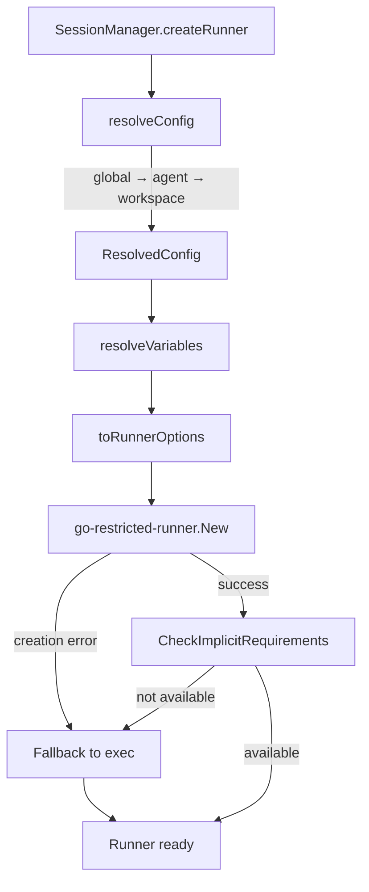

# Restricted Runner System

## Overview

The restricted runner system (`internal/runner/`) sandboxes ACP agent execution. It wraps [go-restricted-runner](https://github.com/inercia/go-restricted-runner) to provide configurable isolation for agent subprocesses.

**Key design decisions:**

- **Opt-in sandboxing**: By default, Mitto uses the `exec` runner (no restrictions). Users explicitly configure restricted runners.
- **Pipe-based communication**: All runner types use `RunWithPipes()` to preserve stdin/stdout for ACP JSON-RPC.
- **Graceful fallback**: If a requested runner is unavailable (wrong platform, missing binary), Mitto falls back to `exec` and logs a warning.
- **Variable substitution**: Paths in restrictions support runtime variables (`$WORKSPACE`, `$HOME`, etc.) resolved per-session.

## Architecture

### Package Structure

```
internal/runner/
├── runner.go                      # Runner type, NewRunner factory, RunWithPipes
├── config.go                      # resolveConfig, MergeRestrictions, toRunnerOptions
├── variables.go                   # VariableResolver (path variable substitution)
├── integration_test.go            # Unit tests (exec, firejail runners)
├── sandbox_integration_test.go    # Integration tests (sandbox-exec, build tag)
└── variables_test.go              # Variable substitution tests
```

### Key Types

| Type | File | Purpose |
|------|------|---------|
| `Runner` | `runner.go` | Wraps `grrunner.Runner`, holds resolved config and fallback info |
| `ResolvedConfig` | `runner.go` | Fully resolved runner type + restrictions after hierarchy merge |
| `FallbackInfo` | `runner.go` | Records when fallback occurred: requested type, actual type, reason |
| `VariableResolver` | `variables.go` | Resolves `$WORKSPACE`, `$HOME`, etc. in restriction paths |

### Data Flow



## Runner Types

| Type | Platform | Enforcement | Binary |
|------|----------|-------------|--------|
| `exec` | All | None (direct execution) | — |
| `sandbox-exec` | macOS | Apple Sandbox profiles | `sandbox-exec` |
| `firejail` | Linux | Firejail namespace isolation | `firejail` |
| `docker` | All (Docker required) | Container isolation | `docker` |

Type conversion from config string to `grrunner.Type`:

```go
func toRunnerType(typeStr string) grrunner.Type {
    switch typeStr {
    case "sandbox-exec": return grrunner.TypeSandboxExec
    case "firejail":     return grrunner.TypeFirejail
    case "docker":       return grrunner.TypeDocker
    default:             return grrunner.TypeExec
    }
}
```

## Configuration Hierarchy

Configuration is resolved in three levels (highest priority last):

1. **Global per-runner-type** — `Config.RestrictedRunners` (from `settings.json` or `.mittorc`)
2. **Agent per-runner-type** — `ACPServer.RestrictedRunners` (per ACP server)
3. **Workspace per-runner-type** — `WorkspaceRC.RestrictedRunners` (from workspace `.mittorc`)

All levels use `map[string]*config.WorkspaceRunnerConfig` keyed by runner type string.

### Config Types

```go
// WorkspaceRunnerConfig — used at all three levels
type WorkspaceRunnerConfig struct {
    Type          string              `yaml:"type,omitempty"`
    Restrictions  *RunnerRestrictions `yaml:"restrictions,omitempty"`
    MergeStrategy string              `yaml:"merge_strategy,omitempty"` // "extend" (default) or "replace"
}

// RunnerRestrictions — the actual sandbox rules
type RunnerRestrictions struct {
    AllowNetworking   *bool              `yaml:"allow_networking,omitempty"`
    AllowReadFolders  []string           `yaml:"allow_read_folders,omitempty"`
    AllowWriteFolders []string           `yaml:"allow_write_folders,omitempty"`
    MergeWithDefaults *bool              `yaml:"merge_with_defaults,omitempty"`
    Docker            *DockerRestrictions `yaml:"docker,omitempty"`
}

// DockerRestrictions — Docker-specific options
type DockerRestrictions struct {
    Image       string `yaml:"image,omitempty"`
    MemoryLimit string `yaml:"memory_limit,omitempty"`
    CPULimit    string `yaml:"cpu_limit,omitempty"`
}
```

### Merge Strategies

| Strategy | Behavior |
|----------|----------|
| `extend` (default) | Merge with parent: override scalars, append unique folder entries, Docker config overrides completely |
| `replace` | Ignore parent config entirely, use only this level's restrictions |

The merge logic in `MergeRestrictions()`:
- `AllowNetworking`: overridden if non-nil
- Folder lists (`AllowReadFolders`, `AllowWriteFolders`): deduplicated union
- `Docker`: replaced entirely if non-nil in override

### Resolution Example

Given global `sandbox-exec` config with `allow_networking: true` and `allow_read_folders: ["$WORKSPACE"]`, an agent config with `allow_networking: false` and `allow_read_folders: ["$HOME/.experimental"]` using `extend`, and a workspace config adding `allow_read_folders: ["$WORKSPACE/vendor"]`:

**Result**: `allow_networking: false`, `allow_read_folders: ["$WORKSPACE", "$HOME/.experimental", "$WORKSPACE/vendor"]`

## Variable Substitution

Paths in restrictions support runtime variables resolved when the runner is created (per-session).

| Variable | Source | Example |
|----------|--------|---------|
| `$WORKSPACE` / `${WORKSPACE}` | Workspace directory passed to `NewRunner` | `/Users/user/project` |
| `$HOME` / `${HOME}` | `os.UserHomeDir()` | `/Users/user` |
| `$MITTO_DIR` / `${MITTO_DIR}` | `appdir.Dir()` | `~/Library/Application Support/Mitto` |
| `$USER` / `${USER}` | `$USER` env var (falls back to `$USERNAME`) | `user` |
| `$TMPDIR` / `${TMPDIR}` | `os.TempDir()` | `/tmp` |

Also supports `~/` prefix expansion to home directory.

## Integration Points

### SessionManager → Runner Creation

`SessionManager.createRunner()` in `internal/web/session_manager.go` assembles the three config levels and calls `NewRunner`:

```go
func (sm *SessionManager) createRunner(workingDir, acpServer string) (*runner.Runner, error) {
    // 1. Workspace .mittorc configs
    var workspaceRunnerConfigByType map[string]*config.WorkspaceRunnerConfig
    if rc, err := sm.workspaceRCCache.Get(workingDir); err == nil && rc != nil {
        workspaceRunnerConfigByType = rc.RestrictedRunners
    }

    // 2. Global configs
    globalRunnersByType := sm.globalRestrictedRunners

    // 3. Agent-specific configs from settings
    var agentRunnersByType map[string]*config.WorkspaceRunnerConfig
    if server, err := mittoConfig.GetServer(acpServer); err == nil && server != nil {
        agentRunnersByType = server.RestrictedRunners
    }

    return runner.NewRunner(globalRunnersByType, agentRunnersByType,
        workspaceRunnerConfigByType, workingDir, logger)
}
```

The runner is created during `GetOrCreateSession()` and passed to `BackgroundSession` via its config.

### BackgroundSession → Runner Storage

`BackgroundSession` stores the runner as an optional field and passes it to the ACP connection:

```go
type BackgroundSession struct {
    runner *runner.Runner // nil = direct execution
    // ...
}
```

Runner metadata (type, restricted flag) is recorded in session metadata on creation.

### acp.Connection → Process Execution

`NewConnection()` in `internal/acp/connection.go` accepts an optional `*runner.Runner`:

```go
func NewConnection(ctx context.Context, command string, autoApprove bool,
    output func(string), logger *slog.Logger, r *runner.Runner,
) (*Connection, error)
```

When `r != nil`, it uses `r.RunWithPipes()` instead of `exec.Command`. The `cancel` function from context cancellation replaces `cmd.Process.Kill()` for process termination.

### SharedACPProcess → Shared Runner

`SharedACPProcess` in `internal/web/shared_acp_process.go` accepts a runner via `SharedACPProcessConfig.Runner` and uses the same `RunWithPipes` pattern.

## Fallback Logic

Runner creation has two fallback checkpoints:

1. **Creation error** — `grrunner.New()` fails (e.g., unsupported platform)
2. **Implicit requirements** — `r.CheckImplicitRequirements()` fails (e.g., `firejail` binary not in PATH)

Both cases:
- Log a warning with the requested type and error
- Store a `FallbackInfo` struct on the `Runner`
- Fall back to `exec` runner (no restrictions)
- The caller (`SessionManager`) broadcasts a `runner_fallback` WebSocket message

```go
if r != nil && r.FallbackInfo != nil {
    sm.eventsManager.Broadcast(WSMsgTypeRunnerFallback, map[string]interface{}{
        "session_id":     bs.GetSessionID(),
        "requested_type": r.FallbackInfo.RequestedType,
        "fallback_type":  r.FallbackInfo.FallbackType,
        "reason":         r.FallbackInfo.Reason,
    })
}
```

## ACP Communication via RunWithPipes

All runner types use `RunWithPipes()` for interactive stdin/stdout/stderr access:

```go
func (r *Runner) RunWithPipes(ctx context.Context, command string, args []string, env []string,
) (stdin WriteCloser, stdout ReadCloser, stderr ReadCloser, wait func() error, err error) {
    return r.runner.RunWithPipes(ctx, command, args, env, nil)
}
```

**Why not `Run()`?** ACP requires bidirectional JSON-RPC over stdio. `Run()` captures output as a string; `RunWithPipes()` provides live pipe access.

**Why cwd isn't supported**: When using a restricted runner, the `cwd` parameter is ignored (logged as warning). The workspace directory is made available through `$WORKSPACE` variable in `allow_read_folders`/`allow_write_folders` instead.

**Process lifecycle**: The caller must close stdin and call `wait()` for cleanup. Context cancellation kills the process. For restricted runner processes, `Connection.Close()` calls the stored `cancel` function.

## Testing

### Unit Tests (`integration_test.go`)

- `TestRunnerWithPipes_ExecRunner` — exec runner stdin/stdout round-trip
- `TestRunnerWithPipes_FirejailRunner` — firejail runner (skipped if firejail not in PATH)
- Config merge tests in `config.go` tests

### Integration Tests (`sandbox_integration_test.go`, build tag `integration`)

- `TestSandboxExec_Integration` — macOS-only sandbox-exec with restrictions
- Platform-gated via `runtime.GOOS` checks and binary availability

### Variable Tests (`variables_test.go`)

- All supported variables (`$WORKSPACE`, `$HOME`, `$MITTO_DIR`, `$USER`, `$TMPDIR`)
- `~/` expansion
- Both `$VAR` and `${VAR}` syntax

```bash
# Run unit tests
go test ./internal/runner/...

# Run integration tests (includes sandbox-exec on macOS)
go test -tags integration ./internal/runner/...
```

## Known Limitations

| Limitation | Details |
|-----------|---------|
| **MCP server compatibility** | Restricted runners can break MCP access. Agents may not reach MCP executables, configs, or network endpoints. Use `exec` if MCP servers are needed, or carefully allow required paths. |
| **cwd not supported** | Restricted runners ignore the `cwd` parameter. Use `$WORKSPACE` in folder allowlists instead. |
| **Platform-specific runners** | `sandbox-exec` is macOS-only, `firejail` is Linux-only. Automatic fallback to `exec` if unavailable. |
| **Docker requires pre-installed agent** | The agent binary must exist in the Docker image. Workspace is auto-mounted at the same path. |

## References

- **User documentation**: [docs/config/restricted.md](../config/restricted.md)
- **go-restricted-runner**: [github.com/inercia/go-restricted-runner](https://github.com/inercia/go-restricted-runner)
- **Architecture overview**: [docs/devel/architecture.md](architecture.md)
- **Session management**: [docs/devel/session-management.md](session-management.md)
- **Workspaces**: [docs/devel/workspaces.md](workspaces.md)
