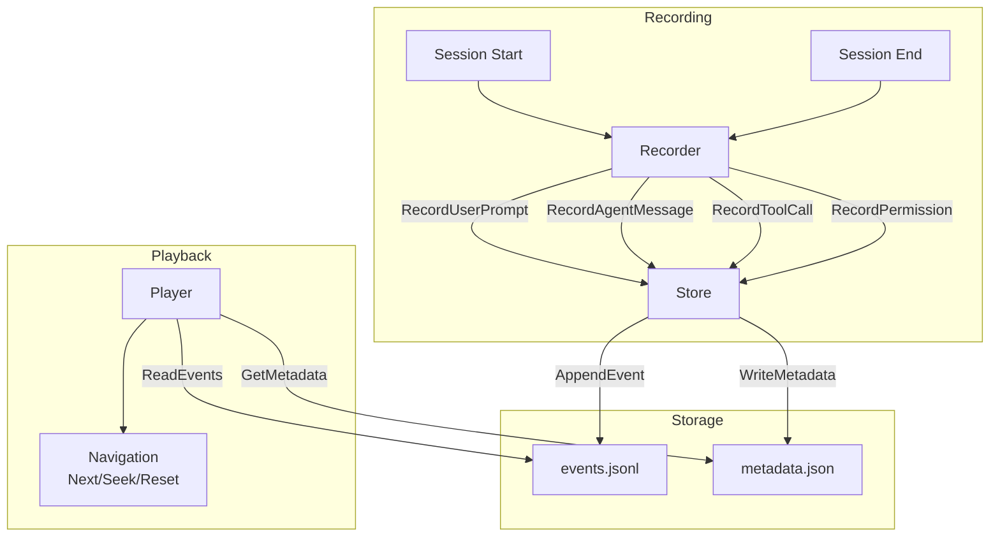
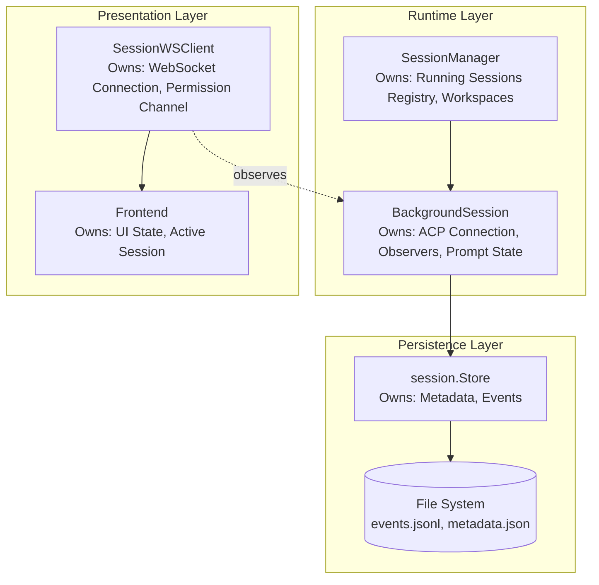
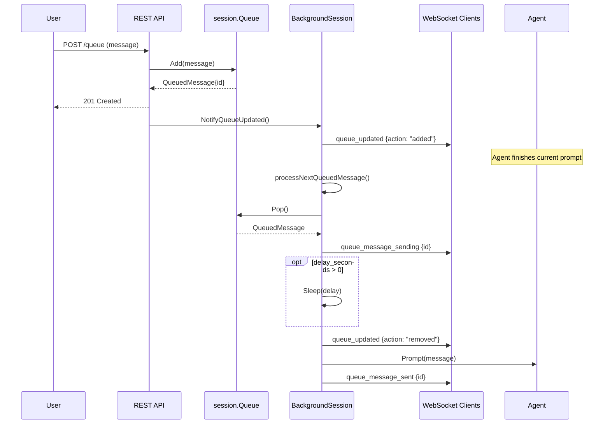

# Session Management

This document covers session recording, playback, state management, and the message queue system.

## Session Recording Flow



## Session Lifecycle

1. **Creation**: `Recorder.Start()` creates session directory and files
2. **Recording**: Events appended via `Recorder.Record*()` methods
3. **Completion**: `Recorder.End()` marks session as completed
4. **Playback**: `Player` loads events for review/replay

## Event Types

| Event Type | Description |
|------------|-------------|
| `session_start` | Session initialization with metadata |
| `session_end` | Session termination with reason |
| `user_prompt` | User input message |
| `agent_message` | Agent response text |
| `agent_thought` | Agent's internal reasoning |
| `tool_call` | Tool invocation by agent |
| `tool_call_update` | Tool execution status update |
| `plan` | Agent's task plan |
| `permission` | Permission request and outcome |
| `file_read` | File read operation |
| `file_write` | File write operation |
| `error` | Error occurrence |

## Session State Ownership Model

Session state is distributed across multiple components with clear ownership boundaries:



### Component Responsibilities

| Component | Owns | Does NOT Own |
|-----------|------|--------------|
| `session.Store` | Persisted metadata, event log, file I/O | Runtime state, ACP connection |
| `BackgroundSession` | ACP process, observers, prompt state, message buffers | Persistence (delegates to Store), UI state |
| `SessionManager` | Running session registry, workspace config, session limits | Individual session state, persistence |
| `SessionWSClient` | WebSocket connection, permission response channel | Session lifecycle, persistence |
| Frontend | UI state, active session selection, message display | Backend state, persistence |

### State Flow

1. **Session Creation**: `SessionManager` creates `BackgroundSession`, which creates `session.Recorder` (wraps `Store`)
2. **Runtime Updates**: `BackgroundSession` notifies observers via `SessionObserver` interface
3. **Persistence**: `BackgroundSession` delegates to `Recorder` which writes to `Store`
4. **UI Updates**: `SessionWSClient` (observer) forwards events to frontend via WebSocket

### Observer Pattern

`BackgroundSession` uses the observer pattern to decouple from WebSocket clients:

```go
// SessionObserver receives real-time updates from a BackgroundSession
type SessionObserver interface {
    OnAgentMessage(html string)
    OnAgentThought(text string)
    OnToolCall(id, title, status string)
    OnToolUpdate(id string, status *string)
    OnPlan()
    OnFileWrite(path string, size int)
    OnFileRead(path string, size int)
    OnPermission(ctx context.Context, params acp.RequestPermissionRequest) (acp.RequestPermissionResponse, error)
    OnPromptComplete(eventCount int)
    OnError(message string)
    GetClientID() string
}
```

Multiple `SessionWSClient` instances can observe the same `BackgroundSession`, enabling:
- Multiple browser tabs viewing the same session
- Session continues running when all clients disconnect
- Clients can reconnect and sync via incremental updates

## Message Queue System

Each session has an optional message queue that allows users to queue messages while the agent is processing. Queued messages are automatically delivered when the agent becomes idle.

### Overview

The queue system enables a "fire-and-forget" workflow where users can queue multiple messages without waiting for each response. This is useful when:
- Providing follow-up context while the agent is still working
- Queuing multiple tasks for sequential processing
- Building automated workflows that submit work to the agent

### Queue Package (`internal/session/queue.go`)

The `Queue` type manages the message queue for a single session. It provides thread-safe FIFO operations with atomic file persistence.

#### Key Types

| Type | Purpose |
|------|---------|
| `Queue` | Thread-safe queue manager for a session |
| `QueuedMessage` | A message waiting to be sent to the agent |

#### Error Values

| Error | Condition |
|-------|-----------|
| `ErrQueueEmpty` | Returned by `Pop()` when queue is empty |
| `ErrMessageNotFound` | Returned by `Get()` or `Remove()` when ID not found |

#### Usage Example

```go
// Get queue for a session
queue := store.Queue(sessionID)

// Add a message
msg, err := queue.Add("What's the status?", nil, "client-123")
if err != nil {
    return err
}
fmt.Printf("Queued message %s\n", msg.ID)

// Process next message when agent is idle
msg, err := queue.Pop()
if errors.Is(err, session.ErrQueueEmpty) {
    // Nothing to process
    return nil
}
// Send msg.Message to agent...
```

### Message ID Format

Message IDs use the format `q-{unix_timestamp}-{random_hex}`:
```
q-1738396800-abc12345
```

This format provides:
- **Uniqueness**: Timestamp + random hex ensures no collisions
- **Sortability**: IDs sort chronologically by queue time
- **Debuggability**: Human-readable timestamp for troubleshooting

### Thread Safety

The `Queue` type uses a mutex to ensure thread-safe operations:
- Multiple goroutines can safely call queue methods concurrently
- File I/O is atomic (write to temp file → sync → rename)
- The mutex is held only during the read-modify-write cycle

### Queue Storage

**File Location:**

```
sessions/
└── {session_id}/
    ├── events.jsonl      # Event log
    ├── metadata.json     # Session metadata
    └── queue.json        # Message queue
```

**Queue File Format (`queue.json`):**

```json
{
  "messages": [
    {
      "id": "q-1738396800-abc12345",
      "message": "What's the status?",
      "image_ids": [],
      "queued_at": "2026-02-01T12:00:00Z",
      "client_id": "a1b2c3d4"
    }
  ],
  "updated_at": "2026-02-01T12:00:00Z"
}
```

**Design Decisions:**

1. **Separate file**: Queue state is stored in `queue.json` rather than `events.jsonl` because:
   - Queue is transient (messages are removed when processed)
   - Events are append-only (queue requires modification)
   - Easier to clear queue without touching event history

2. **Atomic writes**: Uses `fileutil.WriteJSONAtomic()` to prevent corruption during crashes

3. **No max size limit**: Queues are expected to be small; users manually add messages

### Queue REST API Endpoints

| Method | Path | Description |
|--------|------|-------------|
| `GET` | `/api/sessions/{id}/queue` | List all queued messages |
| `POST` | `/api/sessions/{id}/queue` | Add a message to the queue |
| `GET` | `/api/sessions/{id}/queue/{msg_id}` | Get a specific message |
| `DELETE` | `/api/sessions/{id}/queue/{msg_id}` | Delete a specific message |
| `DELETE` | `/api/sessions/{id}/queue` | Clear entire queue |

**Request/Response Examples:**

*POST /api/sessions/{id}/queue*
```json
// Request
{"message": "What's the status?", "image_ids": []}

// Response (201 Created)
{
  "id": "q-1738396800-abc12345",
  "message": "What's the status?",
  "queued_at": "2026-02-01T12:00:00Z"
}
```

*GET /api/sessions/{id}/queue*
```json
// Response (200 OK)
{
  "messages": [...],
  "count": 3
}
```

### Queue Processing Flow

When the agent finishes processing a prompt, the `BackgroundSession` automatically checks for queued messages and sends the next one:



### Queue Configuration

Queue processing is configured in the `conversations` section of the config file:

```yaml
conversations:
  queue:
    enabled: true        # Enable/disable auto-processing (default: true)
    delay_seconds: 0     # Delay before sending next message (default: 0)
```

### WebSocket Notifications

The queue system sends real-time notifications to connected WebSocket clients via the `SessionObserver` interface:

| Notification | When | Data |
|--------------|------|------|
| `queue_updated` | Message added/removed/cleared | `{queue_length, action, message_id}` |
| `queue_message_sending` | Queued message about to be sent | `{message_id}` |
| `queue_message_sent` | Queued message was delivered | `{message_id}` |

### Store Integration

The `session.Store` provides access to queues via the `Queue()` method:

```go
// Queue returns a Queue instance for managing the message queue of a session.
// The returned Queue is safe for concurrent use.
func (s *Store) Queue(sessionID string) *Queue
```

This method creates a new `Queue` instance pointing to the session's directory. Multiple calls return independent instances that share the same underlying file.