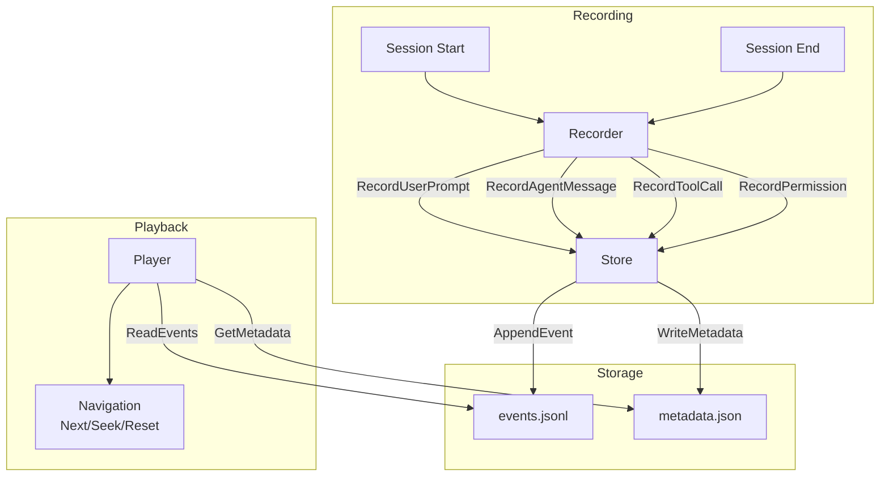
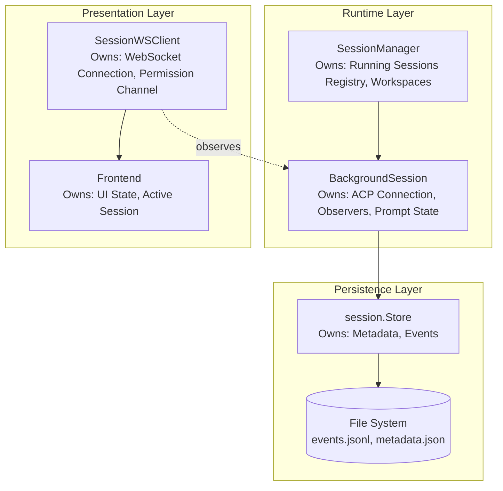

# Session Management

This document covers session recording, playback, and state management. For the message queue system, see [Message Queue](message-queue.md).

## Session Recording Flow



## Session Lifecycle

1. **Creation**: `Recorder.Start()` creates session directory and files
2. **Recording**: Events appended via `Recorder.Record*()` methods
3. **Completion**: `Recorder.End()` marks session as completed
4. **Playback**: `Player` loads events for review/replay

## Event Types

| Event Type         | Description                          |
| ------------------ | ------------------------------------ |
| `session_start`    | Session initialization with metadata |
| `session_end`      | Session termination with reason      |
| `user_prompt`      | User input message                   |
| `agent_message`    | Agent response text                  |
| `agent_thought`    | Agent's internal reasoning           |
| `tool_call`        | Tool invocation by agent             |
| `tool_call_update` | Tool execution status update         |
| `plan`             | Agent's task plan                    |
| `permission`       | Permission request and outcome       |
| `file_read`        | File read operation                  |
| `file_write`       | File write operation                 |
| `error`            | Error occurrence                     |

## Session State Ownership Model

Session state is distributed across multiple components with clear ownership boundaries:



### Component Responsibilities

| Component           | Owns                                                       | Does NOT Own                               |
| ------------------- | ---------------------------------------------------------- | ------------------------------------------ |
| `session.Store`     | Persisted metadata, event log, file I/O                    | Runtime state, ACP connection              |
| `BackgroundSession` | ACP process, observers, prompt state, message buffers      | Persistence (delegates to Store), UI state |
| `SessionManager`    | Running session registry, workspace config, session limits | Individual session state, persistence      |
| `SessionWSClient`   | WebSocket connection, permission response channel          | Session lifecycle, persistence             |
| Frontend            | UI state, active session selection, message display        | Backend state, persistence                 |

### State Flow

1. **Session Creation**: `SessionManager` creates `BackgroundSession`, which creates `session.Recorder` (wraps `Store`)
2. **Runtime Updates**: `BackgroundSession` notifies observers via `SessionObserver` interface
3. **Persistence**: `BackgroundSession` delegates to `Recorder` which writes to `Store`
4. **UI Updates**: `SessionWSClient` (observer) forwards events to frontend via WebSocket

### Observer Pattern

`BackgroundSession` uses the observer pattern to decouple from WebSocket clients:

```go
// SessionObserver receives real-time updates from a BackgroundSession
// Events include a sequence number (seq) for ordering and deduplication.
type SessionObserver interface {
    OnAgentMessage(seq int64, html string)
    OnAgentThought(seq int64, text string)
    OnToolCall(seq int64, id, title, status string)
    OnToolUpdate(seq int64, id string, status *string)
    OnPlan(seq int64)
    OnFileWrite(seq int64, path string, size int)
    OnFileRead(seq int64, path string, size int)
    OnPermission(ctx context.Context, params acp.RequestPermissionRequest) (acp.RequestPermissionResponse, error)
    OnPromptComplete(eventCount int)
    OnUserPrompt(seq int64, senderID, promptID, message string, imageIDs []string)
    OnError(message string)
    // ... queue and action button methods
}
```

**Sequence numbers (`seq`)**: All event methods include a `seq` parameter that uniquely identifies the event within the session. This enables:

- **Deduplication**: Same `(session_id, seq)` = same event
- **Ordering**: Sort by `seq` for correct chronological order
- **Sync tracking**: Clients track `lastSeenSeq` to request missed events

Multiple `SessionWSClient` instances can observe the same `BackgroundSession`, enabling:

- Multiple browser tabs viewing the same session
- Session continues running when all clients disconnect
- Clients can reconnect and sync via incremental updates

## Message Queue

Each session has an optional message queue that allows users to queue messages while the agent is processing. Queued messages are automatically delivered when the agent becomes idle.

For detailed documentation on the queue system, including:

- Queue configuration and scope
- REST API endpoints
- WebSocket notifications
- Automatic title generation
- Thread safety and storage

See **[Message Queue](message-queue.md)**.
