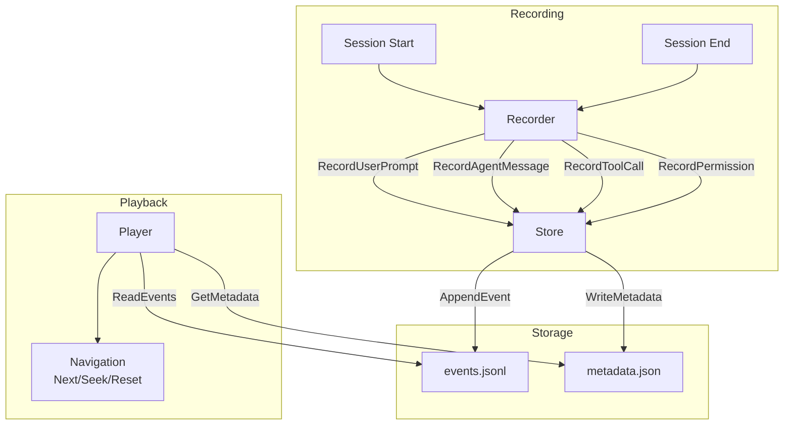
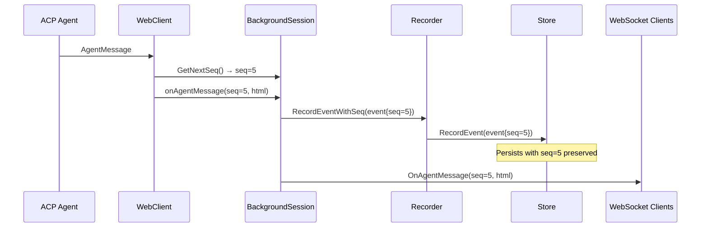
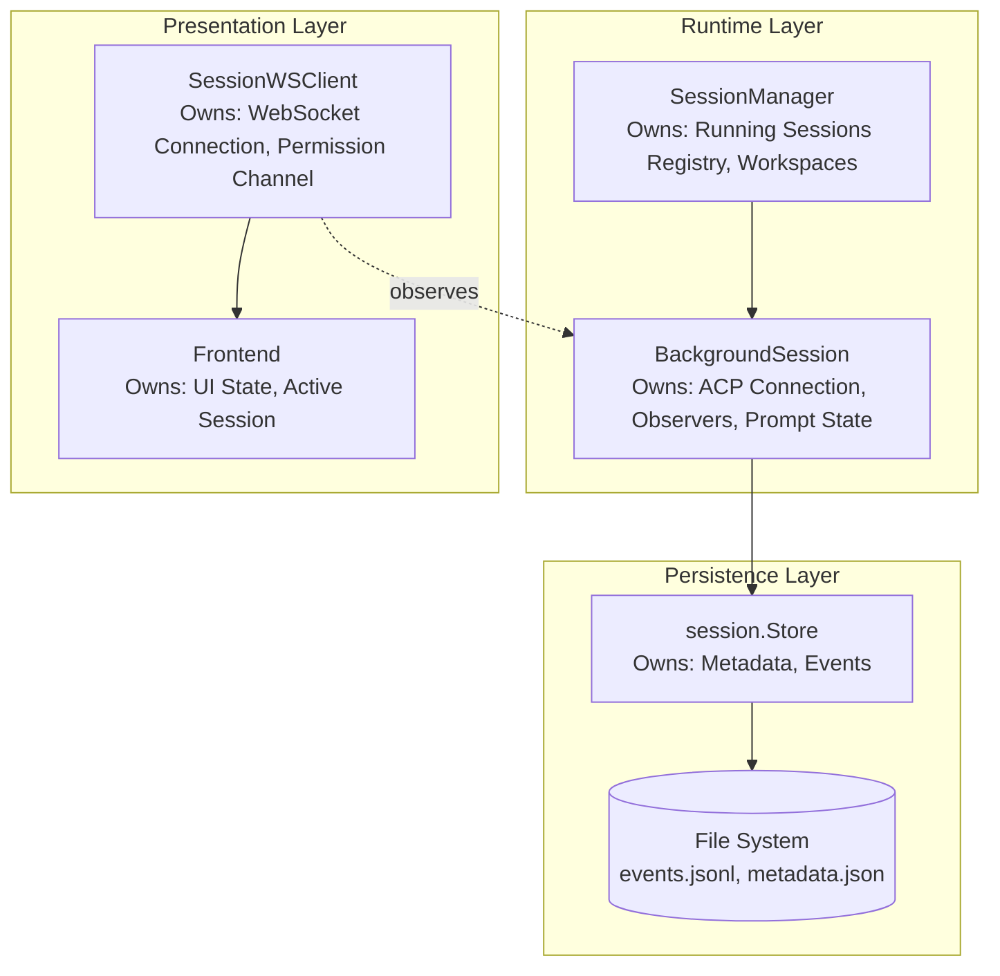
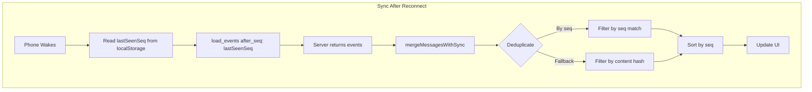

# Session Management

This document covers session recording, playback, and state management. For the message queue system, see [Message Queue](message-queue.md).

## Session Recording Flow



## Session Lifecycle

1. **Creation**: `Recorder.Start()` creates session directory and files
2. **Recording**: Events persisted immediately via `Recorder.RecordEventWithSeq()` (web) or `Recorder.Record*()` (CLI)
3. **Completion**: `Recorder.End()` marks session as completed
4. **Playback**: `Player` loads events for review/replay

## Immediate Persistence

Events are persisted **immediately** when received from ACP, preserving the sequence numbers assigned at streaming time. This ensures:

- **Consistent seq numbers**: Streaming and persisted events have identical `seq` values
- **Crash resilience**: No data loss window (no buffering)
- **Simpler architecture**: No periodic persistence timers or buffer management

### Event Flow



### Key Methods

| Method                          | Purpose                   | Seq Handling                       |
| ------------------------------- | ------------------------- | ---------------------------------- |
| `Store.AppendEvent()`           | CLI recording             | Assigns seq = EventCount + 1       |
| `Store.RecordEvent()`           | Web immediate persistence | Preserves pre-assigned seq         |
| `Recorder.RecordEventWithSeq()` | Web recording wrapper     | Delegates to `Store.RecordEvent()` |

### MaxSeq Tracking

The `Metadata.MaxSeq` field tracks the highest sequence number persisted:

```go
type Metadata struct {
    // ...
    EventCount int   `json:"event_count"`
    MaxSeq     int64 `json:"max_seq,omitempty"` // Highest seq persisted
    // ...
}
```

This is used by `SessionWSClient.getServerMaxSeq()` to determine the server's authoritative sequence state for client synchronization.

## Event Types

| Event Type         | Description                          |
| ------------------ | ------------------------------------ |
| `session_start`    | Session initialization with metadata |
| `session_end`      | Session termination with reason      |
| `user_prompt`      | User input message                   |
| `agent_message`    | Agent response text                  |
| `agent_thought`    | Agent's internal reasoning           |
| `tool_call`        | Tool invocation by agent             |
| `tool_call_update` | Tool execution status update         |
| `plan`             | Agent's task plan                    |
| `permission`       | Permission request and outcome       |
| `file_read`        | File read operation                  |
| `file_write`       | File write operation                 |
| `error`            | Error occurrence                     |

## Session State Ownership Model

Session state is distributed across multiple components with clear ownership boundaries:



### Component Responsibilities

| Component           | Owns                                                        | Does NOT Own                          |
| ------------------- | ----------------------------------------------------------- | ------------------------------------- |
| `session.Store`     | Persisted metadata, event log, file I/O                     | Runtime state, ACP connection         |
| `BackgroundSession` | ACP process, observers, prompt state, immediate persistence | UI state                              |
| `SessionManager`    | Running session registry, workspace config, session limits  | Individual session state, persistence |
| `SessionWSClient`   | WebSocket connection, permission response channel           | Session lifecycle, persistence        |
| Frontend            | UI state, active session selection, message display         | Backend state, persistence            |

### State Flow

1. **Session Creation**: `SessionManager` creates `BackgroundSession`, which creates `session.Recorder` (wraps `Store`)
2. **Runtime Updates**: `BackgroundSession` notifies observers via `SessionObserver` interface
3. **Persistence**: `BackgroundSession` delegates to `Recorder` which writes to `Store`
4. **UI Updates**: `SessionWSClient` (observer) forwards events to frontend via WebSocket

### Observer Pattern

`BackgroundSession` uses the observer pattern to decouple from WebSocket clients:

```go
// SessionObserver receives real-time updates from a BackgroundSession
// Events include a sequence number (seq) for ordering and deduplication.
type SessionObserver interface {
    OnAgentMessage(seq int64, html string)
    OnAgentThought(seq int64, text string)
    OnToolCall(seq int64, id, title, status string)
    OnToolUpdate(seq int64, id string, status *string)
    OnPlan(seq int64)
    OnFileWrite(seq int64, path string, size int)
    OnFileRead(seq int64, path string, size int)
    OnPermission(ctx context.Context, params acp.RequestPermissionRequest) (acp.RequestPermissionResponse, error)
    OnPromptComplete(eventCount int)
    OnUserPrompt(seq int64, senderID, promptID, message string, imageIDs []string)
    OnError(message string)
    // ... queue and action button methods
}
```

**Sequence numbers (`seq`)**: All event methods include a `seq` parameter that uniquely identifies the event within the session. This enables:

- **Deduplication**: Same `(session_id, seq)` = same event
- **Ordering**: Sort by `seq` for correct chronological order
- **Sync tracking**: Clients track `lastSeenSeq` to request missed events

Multiple `SessionWSClient` instances can observe the same `BackgroundSession`, enabling:

- Multiple browser tabs viewing the same session
- Session continues running when all clients disconnect
- Clients can reconnect and sync via incremental updates

## Message Processing and Deduplication

The system uses a **two-tier deduplication** strategy to ensure messages are never duplicated in the UI:

### Server-Side Deduplication

Each `SessionWSClient` tracks `lastSentSeq` - the highest sequence number sent to that client. Before sending any event, the server checks `seq > lastSentSeq`:

```go
type SessionWSClient struct {
    lastSentSeq int64      // Highest seq sent to this client
    seqMu       sync.Mutex // Protects lastSentSeq
}
```

This prevents duplicates during normal streaming operations.

### Client-Side Deduplication

When syncing after reconnect (e.g., phone wake), the frontend uses `mergeMessagesWithSync` to handle cases where:

1. **Stale `lastSeenSeq`**: The `lastSeenSeq` in localStorage is only updated at specific points (`prompt_complete`, `events_loaded`). If a visibility change occurs during streaming, it may be stale.

2. **Overlapping events**: The server returns events that are already displayed in the UI.

The `mergeMessagesWithSync` function deduplicates by:

- **Sequence number** (preferred): Same `seq` = same event
- **Content hash** (fallback): For messages without `seq`



### When `lastSeenSeq` is Updated

The `lastSeenSeq` is updated at these specific points:

| Event                       | Update Source                   |
| --------------------------- | ------------------------------- |
| `events_loaded`             | `last_seq` field in response    |
| `prompt_complete`           | `event_count` field in response |
| `session_sync` (deprecated) | `event_count` field in response |

**Important:** `lastSeenSeq` is NOT updated during streaming. This is intentional - it ensures that if a reconnect happens mid-stream, the client can request all events from the last known checkpoint.

For detailed documentation on WebSocket message handling and ordering, see [WebSocket Documentation](websockets/).

## Mobile Considerations

Mobile clients face unique challenges due to network variability and browser behavior. The system includes several mitigations:

### Extended Timeouts

- **Prompt ACK timeout**: 30 seconds on mobile (vs 15 seconds on desktop)
- Mobile networks have higher latency and more variability
- iOS Safari may suspend WebSocket activity during app transitions

### Agent Response as Implicit ACK

If the agent starts responding (`agent_message` or `agent_thought`), pending sends are automatically resolved. This handles cases where:

1. The `prompt_received` ACK was lost due to a network hiccup
2. The prompt was received but ACK timing was disrupted
3. Mobile network transitions caused ACK delivery issues

For detailed documentation on these mechanisms, see [Communication Flows](websockets/communication-flows.md).

## Message Queue

Each session has an optional message queue that allows users to queue messages while the agent is processing. Queued messages are automatically delivered when the agent becomes idle.

For detailed documentation on the queue system, including:

- Queue configuration and scope
- REST API endpoints
- WebSocket notifications
- Automatic title generation
- Thread safety and storage

See **[Message Queue](message-queue.md)**.
