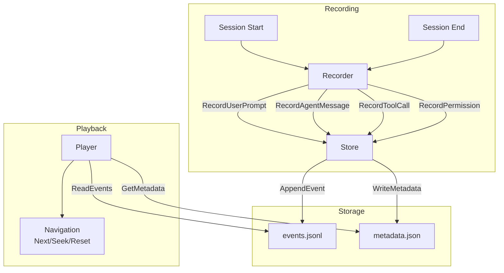
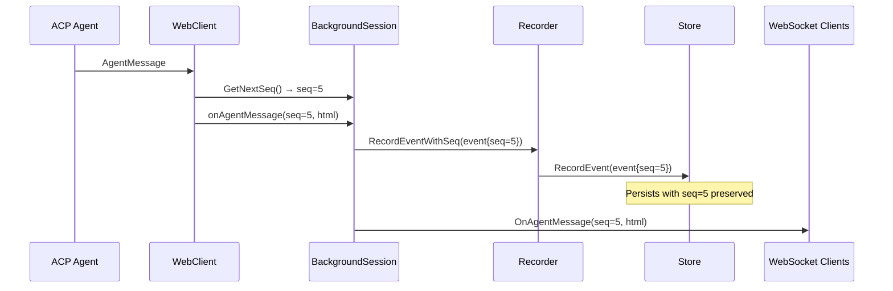
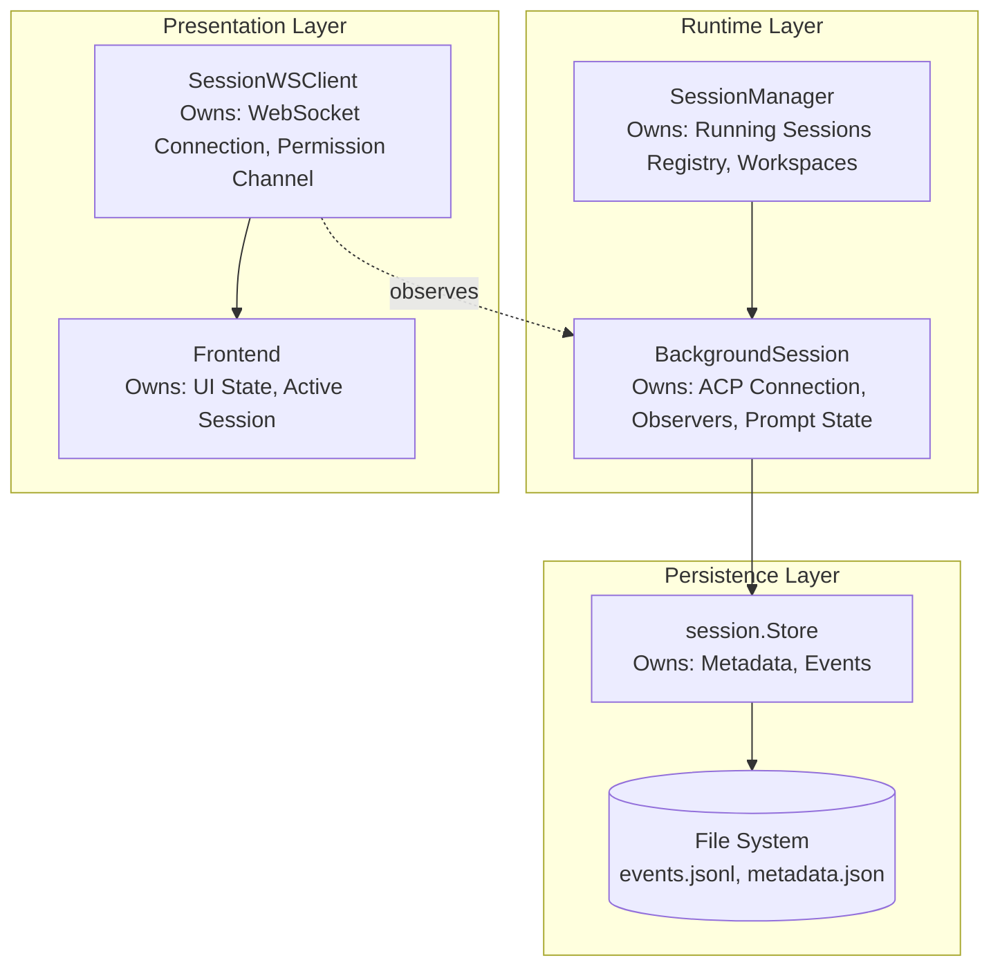

# Session Management

This document covers session recording, playback, and state management.
For the message queue system, see [Message Queue](message-queue.md).

## Session Recording Flow


```mermaid
flowchart TB
    subgraph "Recording"
        START[Session Start] --> REC[Recorder]
        REC --> |RecordUserPrompt| STORE[Store]
        REC --> |RecordAgentMessage| STORE
        REC --> |RecordToolCall| STORE
        REC --> |RecordPermission| STORE
        END[Session End] --> REC
    end

    subgraph "Storage"
        STORE --> |AppendEvent| JSONL[events.jsonl]
        STORE --> |WriteMetadata| META[metadata.json]
    end

    subgraph "Playback"
        PLAYER[Player] --> |ReadEvents| JSONL
        PLAYER --> |GetMetadata| META
        PLAYER --> NAV[Navigation<br/>Next/Seek/Reset]
    end
```

## Session Lifecycle

1. **Creation**: `Recorder.Start()` creates session directory and files
2. **Recording**: Events persisted immediately via `Recorder.RecordEventWithSeq()` (web) or `Recorder.Record*()` (CLI)
3. **Completion**: `Recorder.End()` marks session as completed
4. **Playback**: `Player` loads events for review/replay

## Immediate Persistence

Events are persisted **immediately** when received from ACP, preserving the sequence numbers assigned at streaming time. This ensures:

- **Consistent seq numbers**: Streaming and persisted events have identical `seq` values
- **Crash resilience**: No data loss window (no buffering)
- **Simpler architecture**: No periodic persistence timers or buffer management

### Event Flow


```mermaid
sequenceDiagram
    participant ACP as ACP Agent
    participant WC as WebClient
    participant BS as BackgroundSession
    participant REC as Recorder
    participant STORE as Store
    participant WS as WebSocket Clients

    ACP->>WC: AgentMessage
    WC->>BS: GetNextSeq() → seq=5
    WC->>BS: onAgentMessage(seq=5, html)
    BS->>REC: RecordEventWithSeq(event{seq=5})
    REC->>STORE: RecordEvent(event{seq=5})
    Note over STORE: Persists with seq=5 preserved
    BS->>WS: OnAgentMessage(seq=5, html)
```

### Key Methods

| Method                          | Purpose                   | Seq Handling                       |
| ------------------------------- | ------------------------- | ---------------------------------- |
| `Store.AppendEvent()`           | CLI recording             | Assigns seq = EventCount + 1       |
| `Store.RecordEvent()`           | Web immediate persistence | Preserves pre-assigned seq         |
| `Recorder.RecordEventWithSeq()` | Web recording wrapper     | Delegates to `Store.RecordEvent()` |

### MaxSeq Tracking

The `Metadata.MaxSeq` field tracks the highest sequence number persisted:

```go
type Metadata struct {
    // ...
    EventCount int   `json:"event_count"`
    MaxSeq     int64 `json:"max_seq,omitempty"` // Highest seq persisted
    // ...
}
```

This is used by `SessionWSClient.getServerMaxSeq()` to determine the server's authoritative sequence state for client synchronization.

### Advanced Settings (Feature Flags)

Sessions can have per-conversation feature flags stored in metadata:

```go
type Metadata struct {
    // ...
    AdvancedSettings map[string]bool `json:"advanced_settings,omitempty"`
    // ...
}
```

**Key characteristics:**

- **Backward compatible**: Missing field deserializes to `nil` (treated as empty)
- **Compile-time registry**: Available flags defined in `internal/session/flags.go`
- **Safe defaults**: All flags default to `false` via `GetFlagDefault()`
- **Partial updates**: PATCH API merges new settings with existing

**Example usage:**

```go
import "github.com/inercia/mitto/internal/session"

// Check if introspection is enabled for this session
enabled := session.GetFlagValue(meta.AdvancedSettings, session.FlagCanDoIntrospection)
```

See [MCP Documentation](mcp.md) for how flags control MCP server behavior.

## Event Types

| Event Type         | Description                          |
| ------------------ | ------------------------------------ |
| `session_start`    | Session initialization with metadata |
| `session_end`      | Session termination with reason      |
| `user_prompt`      | User input message                   |
| `agent_message`    | Agent response text                  |
| `agent_thought`    | Agent's internal reasoning           |
| `tool_call`        | Tool invocation by agent             |
| `tool_call_update` | Tool execution status update         |
| `plan`             | Agent's task plan                    |
| `permission`       | Permission request and outcome       |
| `file_read`        | File read operation                  |
| `file_write`       | File write operation                 |
| `error`            | Error occurrence                     |

## Session State Ownership Model

Session state is distributed across multiple components with clear ownership boundaries:


```mermaid
graph TB
    subgraph "Persistence Layer"
        STORE[session.Store<br/>Owns: Metadata, Events]
        FS[(File System<br/>events.jsonl, metadata.json)]
        STORE --> FS
    end

    subgraph "Runtime Layer"
        BS[BackgroundSession<br/>Owns: ACP Connection, Observers, Prompt State]
        SM[SessionManager<br/>Owns: Running Sessions Registry, Workspaces]
        SM --> BS
    end

    subgraph "Presentation Layer"
        WSC[SessionWSClient<br/>Owns: WebSocket Connection, Permission Channel]
        FE[Frontend<br/>Owns: UI State, Active Session]
        WSC --> FE
    end

    BS --> STORE
    WSC -.->|observes| BS
```

### Component Responsibilities

| Component           | Owns                                                        | Does NOT Own                          |
| ------------------- | ----------------------------------------------------------- | ------------------------------------- |
| `session.Store`     | Persisted metadata, event log, file I/O                     | Runtime state, ACP connection         |
| `BackgroundSession` | ACP process, observers, prompt state, immediate persistence | UI state                              |
| `SessionManager`    | Running session registry, workspace config, session limits  | Individual session state, persistence |
| `SessionWSClient`   | WebSocket connection, permission response channel           | Session lifecycle, persistence        |
| Frontend            | UI state, active session selection, message display         | Backend state, persistence            |

### State Flow

1. **Session Creation**: `SessionManager` creates `BackgroundSession`, which creates `session.Recorder` (wraps `Store`)
2. **Runtime Updates**: `BackgroundSession` notifies observers via `SessionObserver` interface
3. **Persistence**: `BackgroundSession` delegates to `Recorder` which writes to `Store`
4. **UI Updates**: `SessionWSClient` (observer) forwards events to frontend via WebSocket

### Observer Pattern

`BackgroundSession` uses the observer pattern to decouple from WebSocket clients:

```go
// SessionObserver receives real-time updates from a BackgroundSession.
// Events include a sequence number (seq) for ordering and deduplication.
type SessionObserver interface {
    OnAgentMessage(seq int64, html string)
    OnAgentThought(seq int64, text string)
    OnToolCall(seq int64, id, title, status string)
    OnToolUpdate(seq int64, id string, status *string)
    OnPlan(seq int64)
    OnFileWrite(seq int64, path string, size int)
    OnFileRead(seq int64, path string, size int)
    OnPermission(ctx context.Context, params acp.RequestPermissionRequest) (acp.RequestPermissionResponse, error)
    OnPromptComplete(eventCount int)
    OnUserPrompt(seq int64, senderID, promptID, message string, imageIDs []string)
    OnError(message string)
    // ... queue and action button methods
}
```

Multiple `SessionWSClient` instances can observe the same `BackgroundSession`, enabling
multi-tab viewing and reconnection with sync.

> **📖 See also:** [WebSocket Sequence Numbers](websockets/sequence-numbers.md) for how `seq`
> values are assigned and tracked, and [WebSocket Synchronization](websockets/synchronization.md)
> for deduplication and reconnection strategies.

## Mobile Considerations

Mobile clients face unique challenges due to network variability and browser behavior:

- **Extended timeouts**: Prompt ACK timeout is 30 seconds on mobile (vs 15 seconds on desktop)
- **Agent response as implicit ACK**: If the agent starts responding, pending sends are auto-resolved
- **Zombie detection**: Keepalive mechanism detects dead connections

> **📖 Full details:** See [Communication Flows — Agent Response as Implicit ACK](websockets/communication-flows.md)
> and [Synchronization — Mobile Wake Resync](websockets/synchronization.md).

## Connecting to Non-Existent Sessions

When a client attempts to connect to a session that no longer exists, the server uses a
**circuit breaker** pattern to prevent error storms.

> **📖 Full details:** See [Synchronization — Circuit Breaker](websockets/synchronization.md#circuit-breaker-terminal-session-errors)
> and [Protocol Spec — session_gone](websockets/protocol-spec.md#session_gone--terminal-session-no-longer-exists).

## Message Queue

Each session has an optional message queue that allows users to queue messages while the agent
is processing. Queued messages are automatically delivered when the agent becomes idle.

For detailed documentation on the queue system, including:

- Queue configuration and scope
- REST API endpoints
- WebSocket notifications
- Automatic title generation
- Thread safety and storage

See **[Message Queue](message-queue.md)**.
