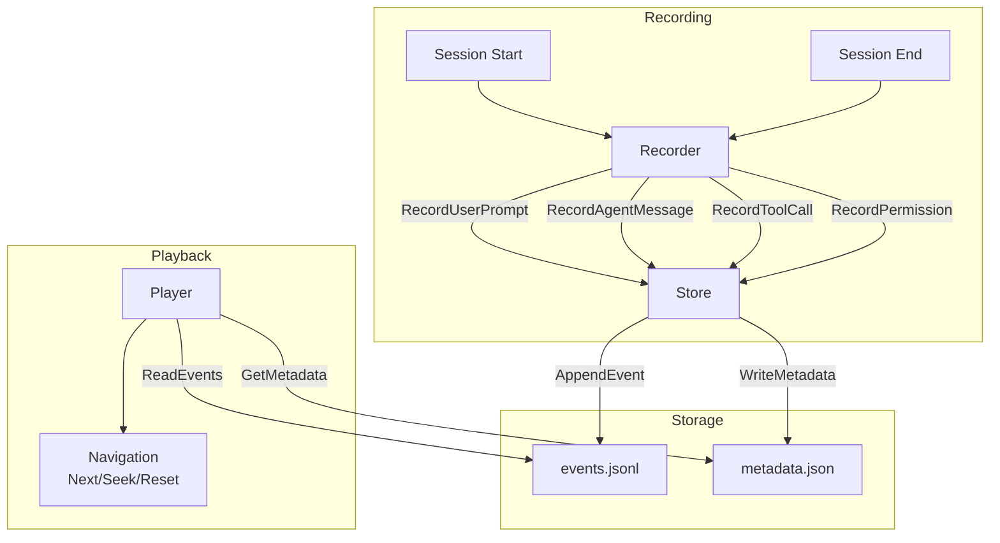
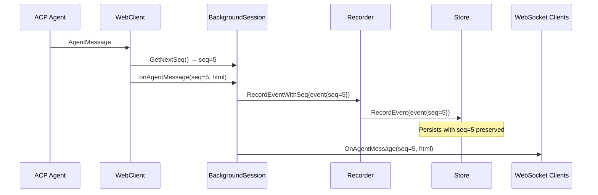
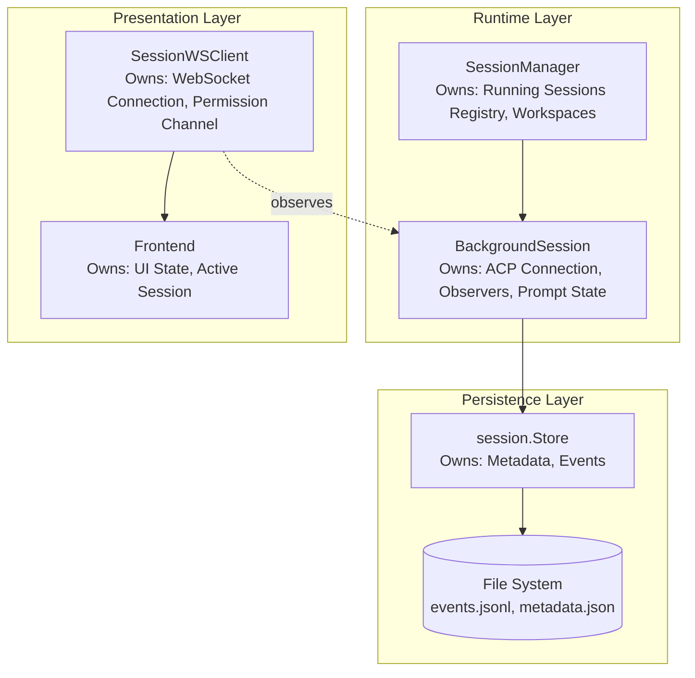
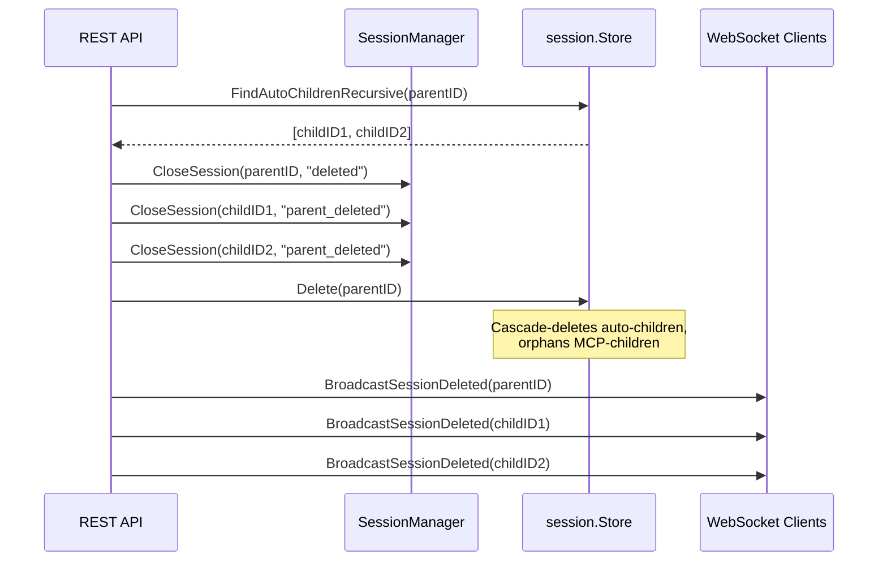

# Session Management

This document covers session recording, playback, and state management.
For the message queue system, see [Message Queue](message-queue.md).

## Session Recording Flow


```mermaid
flowchart TB
    subgraph "Recording"
        START[Session Start] --> REC[Recorder]
        REC --> |RecordUserPrompt| STORE[Store]
        REC --> |RecordAgentMessage| STORE
        REC --> |RecordToolCall| STORE
        REC --> |RecordPermission| STORE
        END[Session End] --> REC
    end

    subgraph "Storage"
        STORE --> |AppendEvent| JSONL[events.jsonl]
        STORE --> |WriteMetadata| META[metadata.json]
    end

    subgraph "Playback"
        PLAYER[Player] --> |ReadEvents| JSONL
        PLAYER --> |GetMetadata| META
        PLAYER --> NAV[Navigation<br/>Next/Seek/Reset]
    end
```

## Session Lifecycle

1. **Creation**: `Recorder.Start()` creates session directory and files
2. **Recording**: Events persisted immediately via `Recorder.RecordEventWithSeq()` (web) or `Recorder.Record*()` (CLI)
3. **Completion**: `Recorder.End()` marks session as completed
4. **Playback**: `Player` loads events for review/replay

### Per-conversation current model

`Metadata.BaselineModel` is the conversation's **persistent current model**.
It is not a workspace-wide setting and is not the temporary model used by a
particular prompt. Each `BackgroundSession` owns its baseline independently,
even when several conversations share one ACP process.

At the first model-catalog advertisement, `cbInitBaselineModelIfEmpty` resolves:

1. The existing in-memory or persisted conversation model, if present.
2. The configured initial-model preference (workspace, then ACP-server setting),
   resolved by `SelectHighestPriorityModel`: the highest-priority `models:`
   profile matching an available model wins, even if the agent default already
   satisfies a lower-priority profile with the same tag.
3. A matching legacy ACP-server model default/child initial-model constraint.
4. The agent-reported default.

The resolved choice is persisted **before** scheduling the startup model RPC.
There is one startup worker and one readiness barrier, not competing initial-
preference and constraint workers. A failed RPC retains the intended model for
bounded startup recovery. An unavailable persisted model fails the startup gate
rather than silently replacing the user's choice.

On resume/restart, startup settings do not choose again: the same conversation
model is reapplied to the newly advertised ACP session. Manual dropdown/MCP
model selections update this conversation's baseline; prompt `preferredModels`
only change its active model and restore the baseline afterward. The UI's
active-model value may temporarily differ from the persisted baseline.

Model selection is synchronous **within the reserved turn**, with a 90-second
total retry budget, not a detached background switch. Reservation precedes
template rendering, so overlapping sends cannot change the running turn's model.
Stop/reset cancels preparation and joins it before releasing the reservation;
old completions cannot restore a model or finalize a newer turn. Completion
restores the baseline and drains manual selections before admitting another turn,
including when queue processing is disabled. A failed restore remains pending.
Manual choices arriving during cleanup are drained before the atomic idle transition.

Fresh-context session replacement adopts the new ACP session ID and catalog,
reapplies the same baseline, then applies that turn's preference. Failed fresh
initialization aborts the prompt. Published model catalogs are owned snapshots,
so concurrent startup updates cannot mutate readers' state.

WebSocket dispatch keeps slow preparation off the reader so keepalives and Stop
remain available. ACK still follows persistence, never mere receipt; the browser
allows 180 seconds for startup plus model preparation before delivery verification.
Regression coverage includes `TestPromptTurn_*`, `TestFreshContext_DirectACP*`,
`TestAgentModelsSnapshot_*`, and `TestWebSocketPromptPreparationDoesNotBlockReadPump`.

`SharedACPProcess.SetSessionModel` addresses the **ACP session ID** on each RPC.
A saturation shed must return a retryable error, never `nil`: without an agent
acknowledgement the switch has not succeeded, and local model state must not
claim otherwise. Tests: `TestModelLifecycle_InitializeOnce`,
`TestConversationModelLifecycle`, and the `TestSetSessionModel_*` shed tests.

### Store locking model

`session.Store` uses two lock levels so disk I/O for one conversation does not
block unrelated conversations:

- `Store.mu` is the lifecycle/global-operation gate. Session-scoped operations
  hold its shared side for their full duration, which makes `Close` wait for
  in-flight work and prevents new work after closure.
- A ref-counted keyed `RWMutex` serializes metadata, events, files, images,
  user data, lock-file operations, and pruning for each session ID. Different
  session IDs therefore proceed concurrently while same-session ordering is
  preserved. Entries include waiters in their reference count and are removed
  only after the keyed mutex is unlocked.
- Operations requiring an all-store snapshot or destructive barrier use the
  exclusive lifecycle gate: `List`, child traversal/counting, `Delete` and its
  cascade, retention cleanup, file/image cleanup, observer mutation, and
  `Close`.

The lock order is lifecycle gate, keyed-lock registry, then session mutex; locks
are released in reverse order. Internal helpers called by global operations must
not reacquire either public lock layer.

### Archive / Auto-Unarchive Recovery Lifecycle

Sessions can be archived manually (`ArchiveReasonManual`), for inactivity (`ArchiveReasonInactivity`), or automatically after repeated ACP process start failures (`ArchiveReasonACPFailures`). The last case is the only one considered transient: a loop conversation archived this way is automatically retried by `LoopRunner.checkAutoUnarchiveRecovery()` (see `internal/web/loop_runner.go`), polled once per minute alongside the other loop housekeeping checks.

- A loop conversation qualifies when it is archived with `ArchiveReasonACPFailures` and still has a loop configuration (`store.Loop(id).Get()` succeeds).
- Each eligible conversation is retried roughly hourly, anchored on `Metadata.AutoUnarchiveLastAttemptAt` (or `ArchivedAt` if no attempt has been made yet) so the cadence survives a Mitto restart.
- A 10-minute global stagger ensures at most one conversation is retried per poll, even if several become due simultaneously — the most-overdue one is picked.
- A retry performs the same steps as a manual unarchive: clear the archive fields, resume the ACP process, broadcast the state change, and re-enable the loop. Failures leave the conversation archived so the schedule retries again after another interval; if the ACP outage persists, the normal resume-failure archiving path will typically re-archive the conversation, restarting the cadence from a fresh `ArchivedAt`.

## Immediate Persistence

Events are persisted **immediately** when received from ACP, preserving the sequence numbers assigned at streaming time. This ensures:

- **Consistent seq numbers**: Streaming and persisted events have identical `seq` values
- **Crash resilience**: No data loss window (no buffering)
- **Simpler architecture**: No loop persistence timers or buffer management

### Event Flow


```mermaid
sequenceDiagram
    participant ACP as ACP Agent
    participant WC as WebClient
    participant BS as BackgroundSession
    participant REC as Recorder
    participant STORE as Store
    participant WS as WebSocket Clients

    ACP->>WC: AgentMessage
    WC->>BS: GetNextSeq() → seq=5
    WC->>BS: onAgentMessage(seq=5, html)
    BS->>REC: RecordEventWithSeq(event{seq=5})
    REC->>STORE: RecordEvent(event{seq=5})
    Note over STORE: Persists with seq=5 preserved
    BS->>WS: OnAgentMessage(seq=5, html)
```

### Key Methods

| Method                          | Purpose                   | Seq Handling                       |
| ------------------------------- | ------------------------- | ---------------------------------- |
| `Store.AppendEvent()`           | CLI recording             | Assigns seq = EventCount + 1       |
| `Store.RecordEvent()`           | Web immediate persistence | Preserves pre-assigned seq         |
| `Recorder.RecordEventWithSeq()` | Web recording wrapper     | Delegates to `Store.RecordEvent()` |

### MaxSeq Tracking

The `Metadata.MaxSeq` field tracks the highest sequence number persisted:

```go
type Metadata struct {
    // ...
    EventCount int   `json:"event_count"`
    MaxSeq     int64 `json:"max_seq,omitempty"` // Highest seq persisted
    // ...
}
```

This is used by `SessionWSClient.getServerMaxSeq()` to determine the server's authoritative sequence state for client synchronization.

### Advanced Settings (Feature Flags)

Sessions can have per-conversation feature flags stored in metadata:

```go
type Metadata struct {
    // ...
    AdvancedSettings map[string]bool `json:"advanced_settings,omitempty"`
    // ...
}
```

**Key characteristics:**

- **Backward compatible**: Missing field deserializes to `nil` (treated as empty)
- **Compile-time registry**: Available flags defined in `internal/session/flags.go`
- **Safe defaults**: All flags default to `false` via `GetFlagDefault()`
- **Partial updates**: PATCH API merges new settings with existing

**Example usage:**

```go
import "github.com/inercia/mitto/internal/session"

// Check if introspection is enabled for this session
enabled := session.GetFlagValue(meta.AdvancedSettings, session.FlagCanDoIntrospection)
```

See [MCP Documentation](mcp.md) for how flags control MCP server behavior.

## Event Types

| Event Type         | Description                                               |
| ------------------ | --------------------------------------------------------- |
| `session_start`    | Session initialization with metadata                      |
| `session_end`      | Session termination with reason                           |
| `user_prompt`      | User input message                                        |
| `agent_message`    | Agent response (HTML + raw markdown)                      |
| `agent_thought`    | Agent's internal reasoning                                |
| `tool_call`        | Tool invocation by agent                                  |
| `tool_call_update` | Tool execution status update                              |
| `plan`             | Agent's task plan                                         |
| `permission`       | Permission request and outcome                            |
| `file_read`        | File read operation                                       |
| `file_write`       | File write operation                                      |
| `error`            | Error occurrence                                          |
| `processor_run`    | One processor invocation (name, phase, outcome, duration) |

## Generic Event Metadata

Each `Event` carries an optional `Meta map[string]any` field (JSON key `"meta"`, `omitempty`) for lightweight, experimental annotations that do not yet warrant a dedicated typed field on the event's `*Data` struct.

### Event.Meta field

```go
type Event struct {
    // ... typed fields ...
    Meta map[string]any `json:"meta,omitempty"`
}
```

- **Absent by default** — `omitempty` means `nil` meta serialises to nothing; old events need no migration and old readers ignore the field.
- **Established annotations should stay typed** — fields like `ArgumentCount` on `UserPromptData` remain as strongly-typed struct fields. `Meta` is for experimental / low-traffic data only.

### RecordOption API

All `Recorder.Record*` methods accept a final variadic `...RecordOption` parameter:

```go
// Attach a single key.
recorder.RecordUserPrompt(message, session.WithMeta("source", "queue"))

// Merge a map.
recorder.RecordUserPromptComplete(msg, imgs, files, pid, pname, argC,
    session.WithMetaMap(map[string]any{"run_id": runID, "loop": true}))
```

`WithMeta` and `WithMetaMap` accumulate: multiple calls to either option on the same event merge their entries. Existing callers with no options compile and behave unchanged.

### Size cap and drop-on-oversize behaviour

The constant `session.MaxMetaBytes = 4096` limits the JSON-encoded size of the metadata bag. If the bag exceeds the cap, **the entire map is dropped** (not truncated per-key) and a `WARN` log is emitted:

```
WARN event meta exceeds size cap, dropped  size=N cap=4096
```

This "drop whole" policy keeps behaviour predictable: either the full annotation is present or nothing is, with no partial/silently-truncated state.

### Sensitivity policy

`Meta` **must NOT** carry:

- Secrets, credentials, or API keys
- Full argument values or full prompt text
- Any personally identifiable information

Store only small, non-sensitive identifiers, counters, or boolean flags. Violating this rule risks leaking sensitive data into `events.jsonl` which is a plain-text file on disk.

### Propagation to observers and WebSocket

`EventMetaObserver` is an **optional sibling** of `SessionObserver`. Observers that implement it receive meta alongside the typed notification:

```go
type EventMetaObserver interface {
    OnEventMeta(seq int64, meta map[string]any)
}
```

In `BackgroundSession.PromptWithMeta`, `OnEventMeta` is called **before** `OnUserPrompt` so observers can store meta keyed by seq and attach it to the outgoing payload.

`SessionWSClient` implements `EventMetaObserver`: it stores pending meta in a `map[int64]map[string]any` (guarded by a mutex), consumes and deletes the entry inside `OnUserPrompt`, and attaches it to the WebSocket payload as `data["meta"]`. If no meta was stored for a given seq, the key is absent from the payload.

Frontend (`useWebSocket.js`): the `meta` field is extracted from the live `user_prompt` message payload and stored on the message object. For **persisted** events, `lib.js` `convertEventsToMessages` also maps `event.data.meta` onto the message so annotations survive a reload.

### Concrete consumer: `argument_names`

When a named/workspace prompt is dispatched with user-supplied arguments, `BackgroundSession.PromptWithMeta` records the **names only** (sorted, never the values) of the template arguments (formerly `${VAR}`, now `{{ .Args.NAME }}`) under `meta["argument_names"]`. Values are substituted into the prompt text before persistence and are forbidden by the sensitivity policy above. The frontend `NamedPromptPill` (in `Message.js`) surfaces these names in the argument-count badge's tooltip (e.g. `Arguments: ISSUE_ID, PROJECT`), falling back to `N argument(s)` when names are unavailable (older events).

## Session State Ownership Model

Session state is distributed across multiple components with clear ownership boundaries:


```mermaid
graph TB
    subgraph "Persistence Layer"
        STORE[session.Store<br/>Owns: Metadata, Events]
        FS[(File System<br/>events.jsonl, metadata.json)]
        STORE --> FS
    end

    subgraph "Runtime Layer"
        BS[BackgroundSession<br/>Owns: ACP Connection, Observers, Prompt State]
        SM[SessionManager<br/>Owns: Running Sessions Registry, Workspaces]
        SM --> BS
    end

    subgraph "Presentation Layer"
        WSC[SessionWSClient<br/>Owns: WebSocket Connection, Permission Channel]
        FE[Frontend<br/>Owns: UI State, Active Session]
        WSC --> FE
    end

    BS --> STORE
    WSC -.->|observes| BS
```

### Component Responsibilities

| Component           | Owns                                                        | Does NOT Own                          |
| ------------------- | ----------------------------------------------------------- | ------------------------------------- |
| `session.Store`     | Persisted metadata, event log, file I/O                     | Runtime state, ACP connection         |
| `BackgroundSession` | ACP process, observers, prompt state, immediate persistence | UI state                              |
| `SessionManager`    | Running session registry, workspace config, session limits  | Individual session state, persistence |
| `SessionWSClient`   | WebSocket connection, permission response channel           | Session lifecycle, persistence        |
| Frontend            | UI state, active session selection, message display         | Backend state, persistence            |

### State Flow

1. **Session Creation**: `SessionManager` creates `BackgroundSession`, which creates `session.Recorder` (wraps `Store`)
2. **Runtime Updates**: `BackgroundSession` notifies observers via `SessionObserver` interface
3. **Persistence**: `BackgroundSession` delegates to `Recorder` which writes to `Store`
4. **UI Updates**: `SessionWSClient` (observer) forwards events to frontend via WebSocket

### Observer Pattern

`BackgroundSession` uses the observer pattern to decouple from WebSocket clients:

```go
// SessionObserver receives real-time updates from a BackgroundSession.
// Events include a sequence number (seq) for ordering and deduplication.
type SessionObserver interface {
    OnAgentMessage(seq int64, html string)
    OnAgentThought(seq int64, text string)
    OnToolCall(seq int64, id, title, status string)
    OnToolUpdate(seq int64, id string, status *string)
    OnPlan(seq int64)
    OnFileWrite(seq int64, path string, size int)
    OnFileRead(seq int64, path string, size int)
    OnPermission(ctx context.Context, params acp.RequestPermissionRequest) (acp.RequestPermissionResponse, error)
    OnPromptComplete(eventCount int)
    OnUserPrompt(seq int64, senderID, promptID, message string, imageIDs []string)
    OnError(message string)
    // ... queue and action button methods
}
```

Multiple `SessionWSClient` instances can observe the same `BackgroundSession`, enabling
multi-tab viewing and reconnection with sync.

> **📖 See also:** [WebSocket Sequence Numbers](websockets/sequence-numbers.md) for how `seq`
> values are assigned and tracked, and [WebSocket Synchronization](websockets/synchronization.md)
> for deduplication and reconnection strategies.

## Mobile Considerations

Mobile clients face unique challenges due to network variability and browser behavior:

- **Extended timeouts**: Prompt ACK timeout is 30 seconds on mobile (vs 15 seconds on desktop)
- **Agent response as implicit ACK**: If the agent starts responding, pending sends are auto-resolved
- **Zombie detection**: Keepalive mechanism detects dead connections

> **📖 Full details:** See [Communication Flows — Agent Response as Implicit ACK](websockets/communication-flows.md)
> and [Synchronization — Mobile Wake Resync](websockets/synchronization.md).

## Connecting to Non-Existent Sessions

When a client attempts to connect to a session that no longer exists, the server uses a
**circuit breaker** pattern to prevent error storms.

> **📖 Full details:** See [Synchronization — Circuit Breaker](websockets/synchronization.md#circuit-breaker-terminal-session-errors)
> and [Protocol Spec — session_gone](websockets/protocol-spec.md#session_gone--terminal-session-no-longer-exists).

## Auto-Children

The **auto-children** feature automatically creates child conversations when a new top-level conversation is started in a workspace. See [Auto-Children Configuration](../config/auto-children.md) for usage.

### IsAutoChild Field

`session.Metadata` has an `IsAutoChild` flag that distinguishes auto-children from MCP-created children:

```go
type Metadata struct {
    // ...
    ParentSessionID string `json:"parent_session_id,omitempty"` // Parent session ID
    IsAutoChild     bool   `json:"is_auto_child,omitempty"`     // Created via auto_children config
}
```

Both auto-children and MCP-created children have a `ParentSessionID`, but only auto-children have `IsAutoChild: true`. This distinction controls deletion behavior.

### Cascade Delete vs. Orphan

`store.Delete()` calls `handleChildSessionsOnParentDelete()` before removing the session:

| Child type                      | On parent delete                         |
| ------------------------------- | ---------------------------------------- |
| Auto-child (`IsAutoChild=true`) | **Cascade deleted** (recursively)        |
| MCP-child (`IsAutoChild=false`) | **Orphaned** (`ParentSessionID` cleared) |

### createAutoChildren() Flow

`SessionManager.createAutoChildren()` in `session_manager.go`:

1. Resolves each `AutoChild` entry to a `WorkspaceSettings` (via `target_workspace_uuid`)
2. Generates a new `SessionID` for each child
3. Creates `session.Metadata` with `IsAutoChild: true` and `ParentSessionID` set
4. Calls `store.Create(childMeta)` to persist to disk
5. Resolves an initial-model preference via `resolveAutoChildInitialModelPreference()`
   — `child.ModelTag` if set, else the target workspace's own initial-model
   preference, else the target ACP server's, else nil — and calls
   `ResumeSessionWithInitialModelPreference()` to start the ACP subprocess.
   The preference is only a **tag**; the concrete Model profile is resolved
   later, once the child's agent reports its available models
   (`cbInitBaselineModelIfEmpty`), and is then persisted as the child's
   baseline model so it is never re-resolved on subsequent resumes.
6. Broadcasts `session_created` to all WebSocket clients

Children inherit the **parent's working directory**, not the target workspace's directory.

### ACP Cleanup on Delete

`handleDeleteSession()` in `session_api.go`:

```
1. FindAutoChildrenRecursive(sessionID) → collect all auto-child IDs
2. CloseSession() for parent and each auto-child (stop ACP processes)
3. store.Delete(sessionID) → cascade-deletes auto-children, orphans MCP-children
4. BroadcastSessionDeleted() for parent and each auto-child
```


```mermaid
sequenceDiagram
    participant API as REST API
    participant SM as SessionManager
    participant Store as session.Store
    participant WS as WebSocket Clients

    API->>Store: FindAutoChildrenRecursive(parentID)
    Store-->>API: [childID1, childID2]
    API->>SM: CloseSession(parentID, "deleted")
    API->>SM: CloseSession(childID1, "parent_deleted")
    API->>SM: CloseSession(childID2, "parent_deleted")
    API->>Store: Delete(parentID)
    Note over Store: Cascade-deletes auto-children,<br/>orphans MCP-children
    API->>WS: BroadcastSessionDeleted(parentID)
    API->>WS: BroadcastSessionDeleted(childID1)
    API->>WS: BroadcastSessionDeleted(childID2)
```

## Message Queue

Each session has an optional message queue that allows users to queue messages while the agent
is processing. Queued messages are automatically delivered when the agent becomes idle.

For detailed documentation on the queue system, including:

- Queue configuration and scope
- REST API endpoints
- WebSocket notifications
- Automatic title generation
- Thread safety and storage

See **[Message Queue](message-queue.md)**.

## Moving a Conversation to a Different Agent

`SessionManager.MoveSessionToAgent(sessionID, targetAgent string, opts MoveAgentOptions) (MoveAgentResult, error)`
(`internal/conversation/session_manager_move_agent.go`, bead `mitto-f7yo.1`) rebinds an existing
conversation to a different ACP agent configured for the same folder, while keeping the
conversation active, its persisted history visible, and its loop config (`loop.json`) untouched.
It is the backend core that REST (`mitto-f7yo.2`) and MCP (`mitto-f7yo.3`) entry points call; this
bead does not add either of those entry points or richer context handoff on the first post-move
prompt (`mitto-f7yo.5`) — only clean seams for them. Model mapping (`mitto-f7yo.4`, described
below) consumes the `PreviousBaselineModel`/`PendingModelMappingFrom` seam this bead leaves behind.

### Preflight

Before touching anything, the request is validated and a typed sentinel error is returned on
failure (callers such as the REST handler can map these with `errors.Is`):

| Condition | Error |
|---|---|
| Session does not exist | `session.ErrSessionNotFound` |
| Conversation is archived | `ErrMoveAgentArchived` |
| `targetAgent == meta.ACPServer` | `ErrMoveAgentSameAgent` |
| `targetAgent` not configured | `ErrMoveAgentUnknownTarget` |
| No workspace for `(meta.WorkingDir, targetAgent)` | `ErrMoveAgentNoWorkspace` |
| A turn is streaming (`BackgroundSession.IsPrompting()`) or a loop run is in flight (`SessionManager.IsWaitingForChildren`) | `ErrMoveAgentBusy` |

### Move steps

1. **Stop.** The live `BackgroundSession` (if any) is stopped via `CloseSessionGracefully(id,
   "agent_moved", timeout)`, falling back to `CloseSession(id, "agent_moved_timeout")` if the
   timeout expires. This bounds the whole stop step even when the old agent's process is
   wedged/unreachable — `timeout` defaults to `DefaultMoveAgentCloseTimeout` (30s) and is
   configurable via `MoveAgentOptions.CloseTimeout` (tests shorten it). Both close paths already
   broadcast "ACP stopped" to observers via `BackgroundSession.Close`'s existing
   `notifyObservers(OnACPStopped)` call — no separate broadcast step is needed. The `"agent_moved"`
   reason is treated the same as `"acp_server_reconfigured"`: `Close` calls `recorder.Suspend()`
   instead of recording a `session_end` event, since the conversation is resumed immediately after.
2. **Rewrite metadata** in one `store.UpdateMetadata` call: `ACPServer` is set to `targetAgent`;
   `ACPSessionID`, `CurrentModeID`, and `ACPStartFailureCount` (all agent-specific) are cleared;
   the previous `BaselineModel` is captured into `MoveAgentResult.PreviousBaselineModel` and
   cleared, and the same value is stashed into `Metadata.PendingModelMappingFrom` so it survives
   an asynchronous/after-restart resume (consumed once by the model-mapping hook, `mitto-f7yo.4`,
   described below).
3. **Record** a `session_change` event with `{kind: "agent", value: targetAgent, previous_value:
   previousAgent}` via a fresh `session.Recorder` bound to the persisted session (the live
   recorder was just stopped), so the timeline shows the move.
4. **Resume** on the new agent via `ResumeSessionBackground`, so the next prompt goes to the new
   agent through the existing resumed-session history injection (`buildPromptWithHistory`). A
   resume failure does **not** roll back the metadata rewrite — the move already stands, and
   rolling back would silently rebind the conversation back to a (possibly still-unreachable) old
   agent behind the caller's back. Instead the error is reported via `MoveAgentResult.ResumeError`,
   and the conversation is left idle/persisted on the new agent: it resumes normally on the next
   access, like any other idle conversation whose ACP process isn't currently running.

### `IncludeChildren`

When `MoveAgentOptions.IncludeChildren` is set, every descendant of `sessionID`
(`store.FindAllChildrenRecursive`, so grandchildren are covered too) that is still non-archived,
idle, and bound to the *old* agent is moved through the same stop/rewrite/record/resume steps.
Descendants that are archived, busy, or already bound to a different agent are left untouched and
reported in `MoveAgentResult.Skipped` (`{ID, Reason}`).

### Result

```go
type MoveAgentResult struct {
    Moved                 []string        // sessionID first, then any moved descendants
    Skipped               []MoveAgentSkip // descendants IncludeChildren declined to move, with why
    PreviousAgent          string
    PreviousBaselineModel  string          // seam for mitto-f7yo.4
    ResumeError            error           // set when metadata was rewritten but resume failed
}
```

### Model mapping (`mitto-f7yo.4`)

Model IDs are agent-specific (an Auggie model ID has no relationship to a GitHub Copilot one), so
step 2 above clears `BaselineModel` outright rather than carrying it over verbatim. Instead it
persists the previous value into `session.Metadata.PendingModelMappingFrom`
(`json:"pending_model_mapping_from,omitempty"`) — durable, since the resume that will need it may
happen asynchronously or after a restart. `moveAgentStopAndRebind` sets it in the very same
`UpdateMetadata` call, so it's also set for every descendant moved via `IncludeChildren` (each
child goes through the same function).

The pending value is consumed once the moved session's ACP session (re)starts on the new agent and
its model catalog is known: `acp_callback_sink.go`'s `setAgentModels` — the existing hook that
already seeds/reapplies the baseline model on first start (`cbInitBaselineModelIfEmpty`,
`cbApplyConfigConstraintsAsync`) — additionally calls `cbApplyPendingModelMapping(models)`
(`internal/conversation/bgsession_model_mapping.go`). That method:

1. Atomically reads and clears `PendingModelMappingFrom` via a single `store.UpdateMetadata` call
   (no-op, including the atomic read/clear, when nothing is pending) — this is what makes the
   mapping attempt run-once regardless of how many times `setAgentModels` fires afterward (e.g. a
   later resume), and what makes a manual model change made before the attempt fires stick instead
   of being silently overwritten by a stale pending value.
2. Resolves the closest available model via `resolveClosestModel`, in order: case-insensitive
   exact model-ID match, exact display-name match, then a **normalized** `lookAlike` match against
   the display name. Normalization maps `-`/`_`/`.`/`/` in the previous raw ID to spaces before
   matching, because `config.ConstraintMatchesName`'s `lookAlike` mode tokenizes its pattern on
   whitespace only (`strings.Fields`) — an un-normalized hyphen/dot-separated model ID would be
   treated as one opaque token and never usefully match a differently-punctuated target name.
   **Deliberate deviation from a literal reading of the bead**: this uses the raw-string matching
   engine (`MatchConstraintOption`/`config.ConstraintMatchesName`, the same one
   `ResolveAuxModelSwitch` already uses) rather than `SelectPreferredModel`/
   `config.PromptPreferredModel`, because that mechanism resolves *named global `Models` profiles*
   by exact profile name/tag — a previous agent's raw model ID has no relationship to any
   configured profile's `Name`, so it is the wrong tool for matching one agent's raw ID against
   another agent's raw catalog.
3. If nothing matches, the agent's own default stands — no error, logged at info/debug.
4. If the resolved model already equals the agent's current/default model, it is promoted straight
   to the persisted baseline (`cmSetBaselineAndClearOverride` + `cmPersistBaselineModel`) without
   an RPC or a timeline event — mirroring `ApplyModelTag`'s existing "already the active model"
   short-circuit (mitto-1yo).
5. Otherwise the match is applied via the same **persistent** path manual selection uses,
   `bs.SetConfigOption(ctx, "model", resolved)` (→ `applyConfigOption` → `cmRecordSessionChange`),
   so it lands as a `session_change` timeline event and reaches the frontend through the existing
   `config_option_changed` broadcast — not the silent `setActiveModelOnly` per-prompt override
   path. The RPC dispatch runs in an unmanaged goroutine, deliberately mirroring
   `cbApplyConfigConstraintsAsync`'s own fire-and-forget pattern, so a slow/unreachable new agent
   can't stall ACP callback processing.

**Ordering versus `ApplyModelTag` (mitto-9eci — strict tag selection).** No new priority flag was
introduced to arbitrate between the mapping attempt and an explicit `model_tag` pin. Instead, the
existing causality already guarantees the tag wins when both apply to the same first-start:
`ApplyModelTag` requires `bs.AgentModels() != nil`, which is set as literally the first line of
`setAgentModels` — so an `ApplyModelTag` call (a separate MCP/REST request, always causally *after*
the caller has observed the move/resume as complete) can only ever run at or after
`cbApplyPendingModelMapping` has already been invoked (and, in virtually every real flow, already
finished). Both funnel through the same `SetConfigOption` persistent path, so whichever request's
RPC response lands last simply wins the persisted baseline and timeline record — exactly the
"tag wins" behavior the acceptance criteria call for, without touching the tag-selection logic
itself.

### Context handoff (`mitto-f7yo.5`)

Normally, `buildPromptWithHistory` (`internal/conversation/bgsession_prompt.go`) prepends the last
**5** turns (`session.BuildConversationHistory(events, 5)`) on the first prompt of a resumed
session that got a fresh ACP session — for an agent migration that would be the *only* context the
new agent ever receives, since the previous agent's tools/MCP servers/prompt behaviour may differ
entirely.

Like model mapping above, this is driven by a durable metadata flag set by
`moveAgentStopAndRebind` in the *same* `UpdateMetadata` call: `Metadata.PendingAgentHandoffFrom`
(`json:"pending_agent_handoff_from,omitempty"`) holds the previous agent's name, so it's set for a
moved session and, via the same reused rebind function, for every descendant moved with
`IncludeChildren` too.

The flag is consumed inside `buildPromptWithHistory` itself
(`internal/conversation/bgsession_agent_handoff.go`), which is only ever called when
`shouldInjectHistory` is true — i.e. behind the *exact same*
`bs.isResumed && !bs.historyInjected && !meta.FreshContext` gate that already exists for normal
history injection. This single placement gives all of the required behaviour for free, with no new
gating logic:

- **FreshContext loops** compute `shouldInjectHistory=false` and so never call
  `buildPromptWithHistory` at all — `PendingAgentHandoffFrom` is therefore left **untouched**
  (not cleared) rather than silently dropped, so it still fires correctly on a later,
  non-FreshContext prompt instead of being lost to a loop run the operator didn't initiate.
- **Normal resumes** (nothing pending) are unaffected — same 5-turn call, no preamble, byte-for-byte
  identical output to before this bead.
- **The first real history-injecting prompt after a move** atomically reads-and-clears the flag
  (`consumePendingAgentHandoff`, same read-and-clear-in-one-`UpdateMetadata` pattern
  `cbApplyPendingModelMapping` uses for `PendingModelMappingFrom`) and, when it was set, uses:
  1. A larger, **character-capped** history budget —
     `session.BuildConversationHistoryCapped(events, agentHandoffMaxTurns, agentHandoffMaxChars)`
     (`internal/session/player.go`), with `agentHandoffMaxTurns = 20` and
     `agentHandoffMaxChars = 24000` as named constants in `bgsession_agent_handoff.go`. Unlike the
     plain `BuildConversationHistory(events, maxTurns)` used elsewhere, this additionally trims the
     **oldest** turns first to stay under the character budget regardless of how large the raised
     turn count could otherwise make the prompt — the most recent context is always kept, and if
     even the single most recent turn alone still overflows the budget, its text is truncated from
     the beginning (keeping the tail) with a clear `[...earlier content truncated...]` marker
     rather than being dropped to nothing.
  2. A short preamble prepended ahead of that history, naming the previous agent (e.g. *"This
     conversation was previously handled by agent "auggie" and has been moved to you. Tools, MCP
     servers and prompts may differ from what the previous agent had. Below is the recent
     transcript for context."*).

Because the flag is consumed exactly once and only from within the existing history-injection
gate, no new synchronization or generation-tracking was needed, and `BuildConversationHistory`'s
own behaviour (used everywhere else) is completely unchanged — `BuildConversationHistoryCapped` is
an additive sibling function next to it.

### REST endpoints (`mitto-f7yo.2`)


Two routes in `internal/web/routes.go`, handlers in `internal/web/handlers/session_move_agent.go`:

- **`GET /api/sessions/{id}/move-agent/preflight`** — read-only affordance check, backed by
  `SessionManager.MoveSessionToAgentPreflight(sessionID)`. Unlike the private preflight gate
  `MoveSessionToAgent` itself uses, this call never errors on archived/busy — those are reported
  as plain fields so a UI can render an informative state instead of a hard failure. It only
  returns 404 (`session.ErrSessionNotFound`) when the session itself doesn't exist. Response body
  (`conversation.MoveAgentPreflight`):

  ```json
  {
    "current_agent": "agent-a",
    "candidates": [
      { "name": "agent-b", "type": "agent-b", "available": true, "loop_prompt_available": true }
    ],
    "busy": false,
    "busy_reason": "",
    "archived": false,
    "is_loop": true,
    "loop_prompt_name": "my-loop-prompt",
    "children_count": 2,
    "baseline_model": "gpt-x"
  }
  ```

  `candidates` lists every other configured ACP server with a workspace for the conversation's
  `working_dir`. `available` currently just means "configured and has a workspace for this
  folder" — the richer four-state installed/configured/connected view from `mitto-lrt.9`
  (`agents.ComposeAvailability`) is not wired into a cheap per-request lookup here; a future bead
  can tighten the field's value without changing its meaning. `loop_prompt_available` is only
  present when the conversation has a loop with a named prompt (`is_loop` and `loop_prompt_name`
  set); it is resolved **by prompt name only**, against the same source-merge pipeline as
  `resolvePromptByName` (global file prompts → settings prompts → ACP-server-specific prompts →
  workspace directory prompts → workspace inline `.mittorc` prompts), **without** evaluating
  `enabledWhen` CEL gates — see `Handlers.loopPromptAvailableForAgent`'s doc comment for the
  documented limitation (a prompt hidden for the target agent by an `enabledWhen` gate would still
  report `true`). `children_count` mirrors the recursive, same-folder, same-agent, non-archived
  filter described above.

- **`POST /api/sessions/{id}/move-agent`** — executes the move. Body:
  `{"target_agent": "agent-b", "include_children": true}`. Calls
  `SessionManager.MoveSessionToAgent` and returns its `MoveAgentResult` as JSON (`resume_error` is
  included as a string when non-nil). On success, broadcasts
  `WSMsgTypeSessionAgentMoved` (`"session_agent_moved"`, data
  `{session_id, acp_server, previous_agent}`) on the **global events socket**
  (`GlobalEventsManager.Broadcast`) once per entry in `MoveAgentResult.Moved` — the requested
  session and every moved child. This is an additive wire-shape-only broadcast, mirroring
  `session_beads_issue_updated`'s pattern; the frontend handler that refreshes a sidebar row's
  `acp_server` on receipt is added by the UI bead (`mitto-f7yo.6`).

  Error mapping (`errors.Is` against the sentinels above):

  | Error | HTTP status |
  |---|---|
  | `session.ErrSessionNotFound` | 404 |
  | `ErrMoveAgentArchived`, `ErrMoveAgentBusy` | 409 |
  | `ErrMoveAgentSameAgent`, `ErrMoveAgentUnknownTarget`, `ErrMoveAgentNoWorkspace`, missing/invalid `target_agent` or body | 400 |

  Both routes are registered in the same declarative `apiRoute` table as every other
  `/api/sessions/{id}/...` mutation route, so they get the same auth/CSRF/rate-limit middleware
  chain automatically (`internal/web/server.go`'s single `mux` wrap) — no extra per-route wiring
  needed. JS SDK entries: `endpoints.sessions.moveAgentPreflight(id)` /
  `endpoints.sessions.moveAgent(id)` (`web/static/sdk/core/endpoints.js`).

### MCP tool (`mitto-f7yo.3`)

`mitto_conversation_move_agent` (`internal/mcpserver/tools_conversation_move_agent.go`) is the
programmatic entry point, for agents/loops that want to hand a conversation off to a different
ACP server without going through the UI.

- **Params**: `self_id` (required, caller's own session ID for permission/context resolution —
  same convention as every other `mitto_conversation_*` tool), `conversation_id` (required;
  accepts the literal `"self"`, resolved the same way `mitto_conversation_update` resolves it),
  target agent as **either** `agent` (fuzzy name/alias, resolved via the same
  `resolveAgentOrACPServerName` helper `mitto_conversation_new` uses for its `agent` param —
  mitto-lrt.13) **or** `acp_server` (exact configured server name); supplying both is only
  accepted when they agree on the same canonical server, otherwise the tool errors. Also accepts
  `include_children` (bool, default `false`), mapped straight to `MoveAgentOptions.IncludeChildren`.
- **Import-cycle workaround**: `internal/conversation` already imports `internal/mcpserver` (for
  session registration), so `internal/mcpserver` cannot import `internal/conversation` back
  without a cycle. The tool therefore defines its own mirror types
  (`MoveAgentOptions`/`MoveAgentResult`/`MoveAgentSkip` and the `ErrMoveAgent*` sentinels) and
  calls a new adapter method, `(*conversation.SessionManager).MoveSessionToAgentForMCP`
  (`internal/conversation/session_manager_move_agent_mcp.go`), which lives on the `conversation`
  side (which *can* import `mcpserver`) and translates the real `MoveSessionToAgent`
  result/sentinels to/from the mirrors via `errors.Is`. `mcpserver.SessionManager`'s interface
  gained two entries for this: `MoveSessionToAgentForMCP` and `BroadcastSessionAgentMoved`
  (documented inline with the same rationale). `internal/web`'s `sessionManagerAdapter` (the
  concrete type wiring `conversation.SessionManager` into the `mcpserver.SessionManager`
  interface) got matching one-line delegating methods, following the exact pattern already used
  for every other `Broadcast*` method — `web.Server` and `conversation.SessionManager` each
  broadcast independently through the *same* shared `GlobalEventsManager` instance rather than one
  delegating to the other.
- **Permission gating**: intentionally mirrors `mitto_conversation_update`'s *actual* behavior —
  which, on inspection, has no extra permission flag/workspace-scope check for acting on another
  conversation beyond "caller is a registered session" + "target conversation exists" (unlike
  `mitto_conversation_get`'s `FlagCanInteractOtherWorkspaces` cross-workspace check, or
  archive/delete's parent-only check for children). No additional gate was added here to stay
  consistent. Moving `self` is allowed (same as update), but since `MoveSessionToAgent`'s own
  preflight rejects any move while the conversation is prompting or waiting for children, a
  self-move issued mid-turn always fails as busy — this is inherent to the caller's own turn
  still being in flight, not a special case in the tool.
- **Errors**: the same `ErrMoveAgent*` sentinels and `session.ErrSessionNotFound` used by the REST
  handler map to clear tool-level error messages; busy specifically tells the caller to retry once
  the conversation is idle (echoing `busy_reason` from the core preflight).
- **Broadcast**: on success, emits the identical `session_agent_moved` global WS broadcast the
  REST handler emits (`BroadcastSessionAgentMoved`, once per entry in `MoveAgentResult.Moved`) so
  the UI updates the same way regardless of whether the move was triggered from the UI or an MCP
  client.
- **Scope**: no `dry_run`/preflight variant was added (the bead's acceptance criteria only require
  alias resolution, busy rejection, and success; `MoveSessionToAgentPreflight` remains
  REST/UI-only via mitto-f7yo.2/`.6`) — a future bead can add one if a caller needs a read-only
  affordance check.

### Frontend UI (`mitto-f7yo.6`)

- **Entry point**: a **"Move to agent ›"** submenu in the shared per-conversation actions menu
  (`web/static/hooks/useConversationMenu.js`), wired from both the sidebar row menu
  (`SessionItem.js`, via `SessionList.js`) and the chat header menu (`app.js`). It lists every
  other ACP server that has a workspace registered for the conversation's `working_dir` (derived
  client-side from `stores/workspacesStore.js`, excluding the conversation's current
  `acp_server`, deduped by `acp_server`), and is hidden entirely when there are no candidates or
  the conversation is archived — a lightweight, purely client-side filter; the authoritative
  busy/archived/candidate-availability check happens server-side in the confirmation dialog
  below, not here.
- **Confirmation dialog** (`web/static/components/MoveAgentDialog.js`, a daisyUI `Modal`):
  selecting a candidate opens this dialog, which fetches
  `GET /api/sessions/{id}/move-agent/preflight` via the SDK resource layer
  (`getSdkClient().sessions.moveAgentPreflight(id)` — **not** `authFetch` +
  `endpoints.sessions.*`, per the codebase-wide convention enforced by guard tests such as
  `SessionList.test.js`/`SessionPanel.test.js`/`ConversationPropertiesPanel.test.js`) and renders:
  context-loss and MCP/tools/prompts/model-drift warnings (always shown), the loop prompt name
  when `is_loop` (plus a warning when the target candidate's `loop_prompt_available` is `false`),
  a disabled Confirm button with `busy_reason` (or an archived-specific message) when
  `busy`/`archived`, and an "Also move N child conversations" checkbox (→ `include_children`) when
  `children_count > 0`. Confirming POSTs `{target_agent, include_children}` via
  `getSdkClient().sessions.moveAgent(id, body)`; the server's own error messages
  (`errorMessage(err, fallback)`) are surfaced directly in the error toast without client-side
  status-code branching, since `HandleSessionMoveAgentExecute`'s error bodies are already
  human-readable (see the error-mapping table above).
- **Live update propagation**: the `session_agent_moved` broadcast (data
  `{session_id, acp_server, previous_agent}`) is handled in `useWebSocket.js`'s
  `handleGlobalEvent`, mirroring the `session_renamed`/`session_archived` pattern exactly — it
  updates `acp_server` on both the matching `storedSessions` entry and the matching active
  `sessions[id].info`, so the sidebar row and the chat header's agent badge both reflect the new
  agent on next render. No forced WebSocket reconnect is triggered: the per-session WS connection
  is keyed on `session_id`, not on the agent, and `ResumeSessionBackground` (bead `mitto-f7yo.1`)
  already transparently continues serving the same session under the new agent.
- **Timeline entry**: the `"session_change"` event with `kind: "agent"` that
  `recordMoveAgentEvent` appends (see the backend section above) renders in
  `web/static/components/Message.js`'s `sessionChangeText` as `"Moved from <previous_agent> to
  <new_agent>"`.
