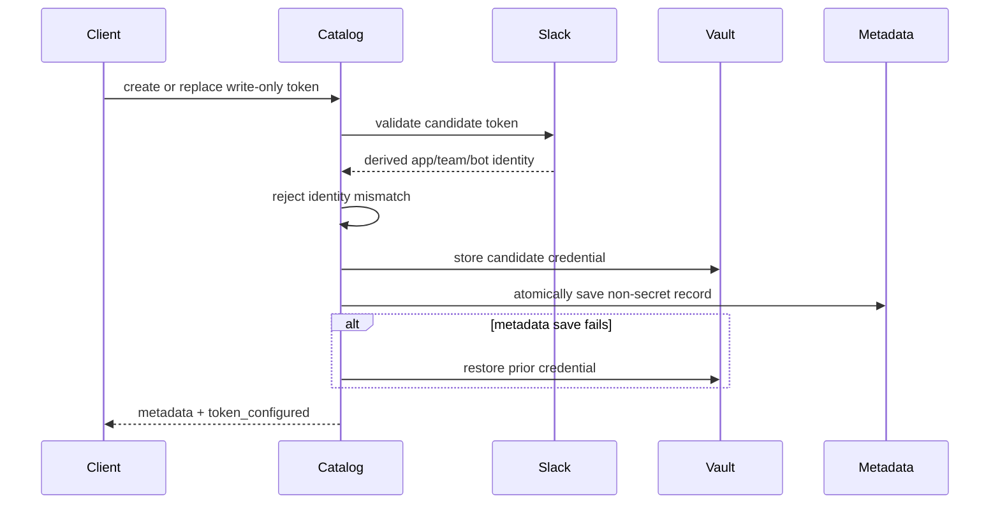

# Slack Integration Catalog

The Slack integration catalog is a process-global registry of Slack app profiles
and their workspace installations. It gives later `onSlack` loop triggers stable
installation IDs without putting credentials in loop files, workspace files, or
API responses.

Package: `internal/slackcatalog`. REST handlers live in
`internal/web/handlers/slack_integrations.go`; Go SDK methods live in
`pkg/api/slack.go`.

## Storage and secret boundary

Non-secret metadata is stored in the versioned
`$MITTO_DIR/slack_integrations.json` document with mode `0600` and atomic writes.
It contains:

- app and installation UUIDs and display names;
- Slack app, team, bot, and bot-user IDs derived during validation;
- validation, creation, and update timestamps.

App (`xapp-`) and bot (`xoxb-`) tokens never enter that document. They are stored
through `internal/secrets` with `NamespaceSlackApp` or
`NamespaceSlackInstallation` credential references. API request bodies accept
tokens only on create or explicit token-replacement operations. Response DTOs
contain `token_configured` booleans, never token values.

Token-bearing create and replacement requests are accepted only through Mitto's
localhost interface. The external listener and reverse-proxied hostnames are
rejected before their request bodies are decoded, even when authenticated, because
Mitto does not currently have request-level TLS/proxy attestation suitable for
transporting bearer credentials. Non-secret catalog operations remain available
through the authenticated external API.

Catalog and vault writes are coordinated with compensating rollback: candidate
credentials are validated before replacement, and a failed metadata save restores
the prior credential. Identity mismatches therefore leave the last working token
and metadata unchanged.

## Validation flow



App tokens are checked through `apps.connections.open`; the app ID is derived from
the validated `xapp` token shape. Workspace bot tokens are checked with `auth.test`
and `bots.info`, which derive the team, bot user, bot, and parent app IDs. A supplied
team ID or an existing app/installation identity must match those derived values.

## REST API

All paths are private Mitto API routes. Authentication applies to every route;
CSRF validation additionally applies to `POST`, `PUT`, `PATCH`, and `DELETE`.
Request bodies are limited to 64 KiB. Oversized Slack bodies return canonical
`413 too_large`; malformed bodies and service failures use fixed, value-free
messages rather than decoder, provider, or credential text.

| Method                   | Path                                                       | Purpose                                              |
| ------------------------ | ---------------------------------------------------------- | ---------------------------------------------------- |
| `GET`, `POST`            | `/api/slack/apps`                                          | List or create app profiles                          |
| `GET`, `PATCH`, `DELETE` | `/api/slack/apps/{appId}`                                  | Read, rename, or delete an app                       |
| `POST`                   | `/api/slack/apps/{appId}/validate`                         | Revalidate the configured app token                  |
| `PUT`                    | `/api/slack/apps/{appId}/token`                            | Validate and replace an app token                    |
| `GET`                    | `/api/slack/apps/{appId}/prepare-delete`                   | Report cascading installations and references        |
| `GET`, `POST`            | `/api/slack/apps/{appId}/installations`                    | List or create workspace installations               |
| `GET`, `PATCH`, `DELETE` | `/api/slack/installations/{installationId}`                | Read, rename, or delete an installation              |
| `POST`                   | `/api/slack/installations/{installationId}/validate`       | Revalidate the configured bot token                  |
| `PUT`                    | `/api/slack/installations/{installationId}/token`          | Validate and replace a bot token                     |
| `GET`                    | `/api/slack/installations/{installationId}/prepare-delete` | Report loop references                               |
| `GET`                    | `/api/slack/installations/{installationId}/channels`       | Discover public and visible private channels         |
| `GET`, `POST`            | `/api/slack/environment-import`                            | Inspect or import the deprecated environment adapter |

Errors use the canonical Mitto JSON envelope: malformed input is `400`, missing
records are `404`, duplicate identities, identity mismatches, and active references
are `409`, and unavailable Slack or credential services are retryable `503` errors.

Equivalent typed methods are exposed on `pkg/api.Client` (`ListSlackApps`,
`CreateSlackInstallation`, `ReplaceSlackInstallationToken`,
`ListSlackChannels`, `GetSlackEnvironmentStatus`, `ImportSlackPoC`, and related
CRUD/validation methods).

## Channel discovery

`GET .../channels` calls Slack `conversations.list` with
`public_channel,private_channel` and `exclude_archived=true`. It returns channel
IDs, names, `is_private`, `is_member`, and `next_cursor`; it never retrieves
message content. Slack exposes a private channel to a bot token only after the
bot has been invited, so absence from a complete page set does not prove the
channel was deleted.

The endpoint accepts an opaque `cursor` (at most 1024 bytes) and a `limit` from 1
through 200 (default 100). Pages are cached in memory for one minute by
installation/cursor/limit. Token replacement and deletion invalidate every page
for that installation. A generation guard prevents an in-flight request using an
old credential from repopulating the cache after invalidation.

The bot token needs `channels:read` for public-channel discovery and
`channels:history` for the default `message.channels` event flow. Add
`app_mentions:read` and the `app_mention` bot event only when mention mode is used.
The app-level Socket Mode token separately needs `connections:write`.
`chat:write`, private-channel scopes, attachments, and automatic file fetching are
not part of v1.

## Reference-aware deletion

The catalog accepts a `ReferenceChecker` and refuses app or installation deletion
when it reports active loop subscriptions. `prepare-delete` uses the same checker
to return the affected installation IDs and session references before mutation.

The production `onSlack` loop schema stores installation references, and server
wiring injects a session scanner into the catalog. No conversation/session
dependency is imported into `internal/slackcatalog`.

## Settings UI

Settings > Slack manages the process-global catalog. The left pane selects an
app profile; the detail pane manages its app credential and any number of Slack
workspace installations. A Slack workspace here means a Slack team, not a Mitto
project workspace.

Token fields are always blank write-only inputs. Successful create or replace
operations clear the input immediately, while every GET response and rendered
status uses only `token_configured`, validated identities, and validation time.
The UI calls `prepare-delete` before offering deletion and shows active loop
references as blockers rather than issuing a destructive request.

When legacy `MITTO_SLACK_*` configuration is present, the tab shows only its
non-secret team/channel/target metadata and missing variable names. An explicit
confirmation imports into the selected app/installation or creates named records.
The operation is transactional across catalog metadata, both vault credentials,
the target loop subscription, and listener handoff; failure restores the prior
catalog, credentials, loop file, and development adapter.

External Slack links use the native-aware `openExternalURL` helper. The empty
state opens Slack's app creation flow; known Slack App IDs deep-link to their app
settings, with the Slack apps index as the fallback. The tab also links to the
Socket Mode and scope setup in `slack-bridge.md` and explains the hardened Linux
file-vault permissions.

Loop settings expose `onSlack` as a canonical trigger that can be armed alone or
with the other trigger types. Each staged subscription selects a stable workspace
installation and public channel ID, plus message and thread filters. The editor
loads channel pages lazily through the catalog API, searches the accumulated pages,
and retains unresolved saved IDs as degraded options instead of erasing the draft.
Its **Manage Slack integrations** action opens this Settings tab without unmounting
the loop panel. Successful catalog mutations publish a value-free local refresh
event so names and credential health update while staged loop edits remain intact.

## Verification

Focused regression coverage is in `internal/slackcatalog`,
`internal/web/handlers`, and `internal/web/middleware`. It uses fake Slack and
credential providers; tests never require real tokens or touch the real Keychain.
Managed multi-team fan-out, reconnect, rotation, and restart behavior must also
be checked with the value-free development-workspace procedure in
[Slack Socket Mode Bridge](slack-bridge.md#production-validation); real Slack
credentials and network access are never part of CI.

Run the relevant suite with:

```bash
go test -race ./internal/slackcatalog
go test ./internal/slackcatalog ./internal/appdir ./internal/web/middleware ./internal/web/handlers ./internal/web ./pkg/api
```
