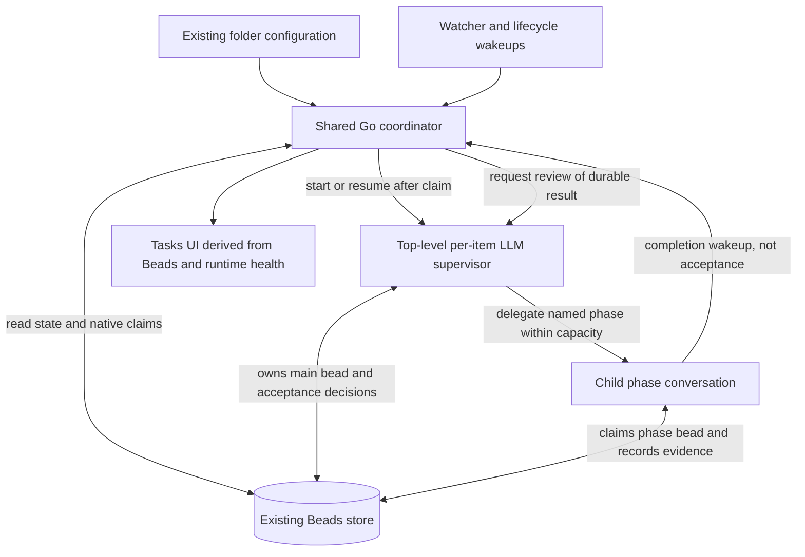

# Task Automation Manager (Design)

This document proposes a shared Go coordinator for task automation, with an
LLM supervisor for each bug, feature, or other work item and focused workers
for its delegated phases.

> **Beads owns workflow state and ownership. Go schedules and reconciles.
> LLM supervisors judge the work. Conversations execute it.**

> Status: **Design / proposal**, revised 2026-09-05. The Beads-only storage
> and native-claim constraints below are agreed requirements. Metadata
> schemas, phase granularity, APIs, and defaults are proposals, not shipped
> functionality. Open questions include possible solutions and recommended
> starting points; they are not implicit implementation commitments.

This revision supersedes the earlier proposals for separate task-run storage,
Mitto-managed ownership leases, label-only completion, and automatic stale-claim
reclamation. See [Message Queue](message-queue.md),
[Session Management](session-management.md), and [MCP](mcp.md) for reusable
infrastructure, whose existing guarantees must not be overstated.

## Agreed Constraints

1. **Beads is the sole authoritative store for workflow state.** Goals,
   ownership, selected workflow, current phase, attempts, outcomes, decisions,
   and recovery information belong in tickets, metadata, comments, and links.
2. **No new database or parallel workflow store.** No task-run sidecar, lease
   database, durable scheduler queue, or workflow journal outside Beads.
   In-memory caches and queues are disposable and rebuildable from Beads.
3. **Ownership is acquired through native Beads claiming.** A competing owner
   must cause the claim attempt to fail; no assignee overwrite or passive
   metadata protocol may substitute for the claim.
4. **Preserve semantic supervision.** Go must not decide that an implementation
   is correct merely because a worker stopped or a terminal label appeared.
5. **Explicit folder opt-in.** Opening a folder is not authorization to work,
   commit, push, merge, or perform unrelated external actions.
6. **No automatic claim theft.** Silence or an old heartbeat is not permission
   to replace an owner. Resume verified owned work or use an explicit handoff.

Existing configuration files may still hold folder opt-in and workflow
definitions; normal session storage still holds conversations. Neither becomes
an independent authority for task progress. The workflow selected for an active
task and the information needed to reconstruct it must be recorded in Beads.

## Motivation

There are two independent orchestration loops:

- **Outer / fleet loop:** choose eligible work across folders, claim tickets,
  enforce capacity, start conversations, and recover interrupted dispatch.
  Today much of this is expressed in `Loop processing tasks`.
- **Inner / per-item loop:** interpret one goal, investigate, implement, test,
  review, and decide whether the evidence satisfies that goal. Today bug and
  feature drivers self-dispatch named phases using labels.

The fleet loop repeatedly uses model turns for mechanical work and duplicates
scheduling policy across folders. Its read-then-write passive claims and
title-based conversation discovery are fragile coordination mechanisms.

The inner loop still needs intelligence. The existing feature review already
checks acceptance criteria and downstream impact; this design strengthens its
decision and rework contracts rather than claiming supervision is absent today.
Likewise, `freshContext: true` does not preclude semantic oversight: an LLM can
reconstruct intent and prior decisions from Beads on every turn.

## Verdict

Adopt a **Beads-backed coordinator**, not a new workflow platform:

- A shared Go `TaskAutomationManager` handles admission and reconciliation.
- A per-item LLM supervisor owns the main bead and semantic acceptance.
- Delegated workers claim their own phase beads and persist evidence there.
- Small steps done by the supervisor itself need not create another bead.

This is a moderate-to-large integration effort. Beads eliminates a second
persistence subsystem, but claim identity, interrupted starts, rework, and
safe repository access still need explicit contracts and tests.

## Existing Building Blocks

| Capability                            | Existing component                              | Reuse boundary                                                     |
| ------------------------------------- | ----------------------------------------------- | ------------------------------------------------------------------ |
| Folder change notifications           | Shared `BeadsWatcher`                           | Debounced wakeups, not a durable event queue                       |
| Loop dispatch and lifecycle wakeups   | `LoopRunner`, including `onChild`               | Reuse dispatch infrastructure, not labels as proof of success      |
| Scheduled-loop capacity               | `tryReserveWorkspaceSlot`                       | Not a universal task or repository-writer limit                    |
| Folder opt-in/configuration surface   | `folders.json`, `BeadsFolderSettings`, Tasks UI | Keep configuration separate from execution state                   |
| Conversation creation/resumption      | `SessionManager`                                | A session link is an association, not ownership                    |
| Named phase prompts and model routing | Bug/feature phase prompts, `preferredModels`    | Adapt existing assumptions about labels, targets, and submission   |
| Beads operations from Go              | `internal/beads` client                         | Extend with native claim and required targeted metadata operations |
| Child messages and reports            | MCP child tools                                 | Notifications/convenience only; outcomes must also be in Beads     |

The installed Beads 1.2.2 help documents `bd update <id> --claim` as atomic,
setting the assignee and `in_progress`, and idempotent for the same owner.
This is documented behavior, not yet a verified concurrent-claim contract for
this feature. The current Go `UpdateParams` does not expose native claiming
or all metadata writes needed here.

## Architecture Overview

The supervisor is a **top-level conversation created by the Go manager**, not
an MCP child of an LLM fleet conversation. The current MCP creation handler
rejects spawning from a conversation with `ParentSessionID != ""`. This shape
supports one level of phase children without relaxing that recursion guard.
Nested bead hierarchies do not require nested conversation hierarchies.

Supervisors request/delegate work, while backend admission checks apply to every
automated phase start. The exact helper/API is still to be designed; direct
MCP spawning must not become a bypass around the coordinator's resource limits.

## Deterministic vs Semantic Boundary

| Go coordinator                                                                        | LLM supervisor and workers                                               |
| ------------------------------------------------------------------------------------- | ------------------------------------------------------------------------ |
| Folder opt-in, priority ordering, fairness, explicit dependency checks                | Interpret goals, acceptance criteria, and ambiguous requests             |
| Native claim attempts and typed conflict handling                                     | Investigate, reproduce, design, implement, and test                      |
| Validate phase identities, ownership associations, limits, and required result fields | Judge whether evidence establishes a root cause or satisfies a criterion |
| Start/resume conversations and reconcile interrupted dispatch                         | Accept a result, request bounded rework, or explain a blocker            |
| Detect a mention and retain its source reference                                      | Decide what the mention asks and whether it is authorized                |
| Check child statuses and submission prerequisites                                     | Judge integrated feature/epic correctness and reopened symptoms          |

The coordinator may execute a close requested by the owning supervisor after
checking policy and persisted acceptance. It must not independently close on
`fixed`, `verified`, all children closed, conversation end, or a report arriving.
Mandatory policy checks cannot be waived by the supervisor's narrative.

Likewise, enumerating existing epic children is mechanical; decomposing a goal
into the right children is semantic. Code uses explicit dependencies. When a
supervisor discovers an implicit prerequisite, it records a dependency or
requests a scope decision rather than expecting the scheduler to infer one.

## Beads State and Ownership Model

### Main bead and delegated phase beads

The main bead holds overall intent, workflow progress, and acceptance. Its
supervisor retains the native claim for the execution. A delegated worker
claims a **separate phase bead**, not the supervisor's main bead. Do not share
the supervisor's actor identity among workers to let them all appear to own it.

Recommended granularity: create a child bead for each independently delegated
unit, but keep small inline supervisor steps on the main bead. Context resets
and individual tool calls are not work items. Phase granularity remains an
explicit trade-off (see Open Questions).

| Information                                               | Authoritative Beads representation                                        |
| --------------------------------------------------------- | ------------------------------------------------------------------------- |
| Goal and definition of done                               | Main bead description and acceptance criteria                             |
| Owner and broad lifecycle                                 | Native assignee established by claim; native status                       |
| Execution identity and selected workflow                  | Main bead namespaced metadata                                             |
| Supervisor association and pending start                  | Main bead metadata                                                        |
| Current step, attempt, accepted outcomes, limits consumed | Main bead metadata, with explanatory comments                             |
| Delegated work                                            | Child beads, parent links, and applicable dependency edges                |
| Worker identity, conversation association, dispatch state | Phase bead metadata and native claim                                      |
| Findings and verification evidence                        | Phase comments and references to tests, diffs, commits, and artifacts     |
| Acceptance/rework decision                                | Main bead structured decision plus rationale comment                      |
| Blocking or human handoff                                 | Native status where appropriate, blocker metadata/labels, and explanation |

Proposed logical metadata fields include `schema_version`, `execution_id`,
`workflow_snapshot`, `supervisor_session_id`, `current_step`, `attempt`,
`phase_bead_id`, `dispatch_state`, `outcome`, and `evidence_revision`. Names and
encoding are not yet an API. Use a reserved automation namespace and targeted
updates that preserve unrelated metadata. Do not replace whole descriptions
or arbitrary metadata objects to advance a phase.

Labels are useful views, not proof. Acceptance references the specific phase
attempt, code revision tested, and goal/acceptance-criteria snapshot retained
in Beads; for uncommitted work, use an identifiable diff/worktree snapshot
rather than pretending a commit SHA identifies it. If implementation or
requirements change, prior verification remains history but no longer proves
the current result. The supervisor must reassess changed requirements and
record fresh acceptance before closure. A reopen creates a new execution
episode on the same bead, preserving history and reassessing the new symptom.

### Claim rules

1. Choose an eligible ticket and a unique, recoverable owner identity.
2. Attempt `bd update <id> --claim` under that identity.
3. Start engineering work only after confirmed success. If the result is
   ambiguous because transport failed, reconcile the assignee before acting.
4. On a foreign-owner conflict, fail that attempt and leave the ticket alone:
   no forced assignment, release, deferral, or claim-clearing comment workflow.
5. On resumption, reuse the verified owning identity rather than inventing a
   new one and treating the old assignment as stale.

A generic shared actor such as `mitto` is unsafe: same-owner idempotency could
let independent workers both succeed. Beads exposes `--actor`, but its precise
relationship to the claim assignee and conflict behavior must be contract-tested
for supported versions. The existing web-client actor is not a worker identity.

`in-flight` may remain a compatibility/UI label. `claimed_by` and heartbeats
must not become a competing claim system. Native claiming sets `in_progress`;
recovery must therefore inspect owned in-progress work, not only `bd ready` or
the old `open + in-flight` reaper query.

Atomic claiming does not establish that every later Beads write is owner-checked.
Use one logical writer for main-bead orchestration state (the owning supervisor,
with validated coordinator operations on its behalf), and each worker for its
own phase. Do not claim security isolation from agents that retain unrestricted
shell access; enforcement and concurrent human-edit behavior remain open.

### Phase completion versus task acceptance

Recommended serial flow:

1. Supervisor records the next step/attempt and creates its phase bead.
2. That worker claims the phase bead, then starts its conversation.
3. Worker persists a structured outcome and evidence before reporting completion.
4. Supervisor reads Beads, reviews the evidence, and records acceptance or rework.
5. Only an accepted result enables the next phase; create it incrementally.
6. Supervisor closes the main bead only after final acceptance and the selected
   submission policy are satisfied.

A worker may close its own phase bead when its assigned deliverable is complete.
For example, a review finding defects can be a completed review deliverable,
with `needs_rework` as its outcome; it is not acceptance of the implementation.
Blocked/incomplete execution must not masquerade as successful completion.

Create a new attempt bead for substantial rework by default, retaining prior
evidence. Distinguish automation-phase children from ordinary feature subtasks:
the fleet picker must not independently dispatch a supervisor's internal phases,
but must still be able to select ordinary eligible child work.

MCP reports and `onChild` events are wakeups. Report receipt, agent idleness,
loop stop, and task acceptance are different states. No transition may depend
solely on an MCP collector or conversation transcript surviving.

## Scheduling & Fairness

Use per-folder priority ordering with stable tie-breaks and round-robin across
eligible folders; add aging/weights only if measurements justify them. Runtime
queues are derived from Beads and need no durable queue store.

Separate three limits:

- **Active task executions:** how many claimed main beads automation pursues.
- **Active agent execution:** capacity at the actual ACP/process boundary.
- **Repository mutation:** concurrent writers and integration operations.

The existing loop semaphore is not sufficient: it is keyed by working directory
and ACP server, covers a turn rather than a task, and the current forced path
used by event-driven triggers bypasses it. Reuse/extract admission mechanisms
only after auditing every automated start/resume path.

Default to one mutating execution per working tree. Distinct claims protect
different tickets, not a shared Git index or shared files. A `work_paths`
manifest is a hint, not proof of independence. Future parallelism should use
isolated worktrees and explicit integration checks, including shared external
resources such as ports and test databases.

A waiting supervisor retains its bead claim but releases agent execution
capacity. Otherwise a single-slot pool can make the parent wait for a child
that cannot start until the parent releases the slot.

## Recovery and Reconciliation

Claiming, updating Beads, creating a session, and performing external actions
are separate operations. Do not promise an atomic claim-and-spawn transaction
or exactly-once external effects. Persist dispatch intent and outcome in the
relevant bead and reconcile ambiguous operations before retrying.

Allocate a stable execution/owner identity before claiming so even a crash
immediately after the claim can be associated with this manager's work. Record
the intended session/attempt before activating it; session discovery confirms
execution health but does not replace Beads workflow state. Exact claim/start
ordering and session-ID allocation are prerequisites to settle in the prototype.

| Interruption                               | Required recovery                                                                                                           |
| ------------------------------------------ | --------------------------------------------------------------------------------------------------------------------------- |
| Claim succeeds, metadata/start incomplete  | Inspect owned in-progress tickets; complete startup for the same verified owner                                             |
| Phase bead creation response lost          | Search the parent's children by execution/step/attempt before creating another; ambiguous duplicates require reconciliation |
| Session start response lost                | Locate the intended session; do not blindly start a second writer                                                           |
| Result persisted, notification lost        | Read the phase bead and request supervisor review                                                                           |
| Notification arrives, result not persisted | Do not advance; retry persistence or flag incomplete evidence                                                               |
| Old phase reports after rework/reopen      | Match execution, attempt, and evidence revision; retain history without advancing the current attempt                       |
| Beads unavailable                          | Admit no new work or transitions; retry access and surface the blocker, with no alternate durable store                     |
| Supervisor/worker disappears               | Reconstruct from its bead and resume only after excluding an active old executor                                            |
| Commit/PR action may already have happened | Inspect its recorded identity and actual external state before retrying                                                     |
| Foreign or uncertain ownership             | Leave the claim intact and escalate; never infer takeover authority from silence                                            |

Watch events mark folders/tickets dirty; bounded reconcilers read current Beads
state. Run reconciliation at startup and use a slow jittered sweep as a safety
net for missed, coalesced, or suppressed events. Do not block watcher callbacks
on agent work, and isolate failures so one folder cannot stall all others.

Claims do not automatically expire. Explicit handoff must stop the old executor
before releasing/reassigning a ticket. Operator decisions and handoff reasons
belong on the bead. If old execution cannot be ruled out, remain blocked rather
than trade a stuck task for concurrent writers.

## Configuration

Use existing global/folder configuration surfaces for defaults, not task state:

- Enabled folders, task types, ACP workspace/server, supervisor model policy.
- Workflow per task type, optional folder override, and additional instructions.
- Submission strategy, base branch, and definition of the completion milestone.
- Task/agent/writer limits; per-step attempts and overall time/spawn budgets.
- Optional post-task hook with explicit permissions and recorded outcome.

Selected execution policy is snapshotted on the main bead. Routine edits apply
to new tasks; migrating an active task requires an explicit recorded decision.
Permission revocation and stop controls must still take effect immediately,
not remain enabled because an old snapshot allowed them.

The UI should distinguish stop-new-admission, pause-at-next-safe-boundary, and
cancel-active-execution. Show phase, owner, blocker, pending review, and last
infrastructure error rather than an ambiguous single "running" state. Expose
effective workflow provenance (global/folder override) before enabling a folder.
Task text and imported mentions cannot broaden permissions.

## Customizable Inner-Loop Sequence

Customizing the work done on one ticket is independent of replacing the fleet
picker. Both should use the same Beads ownership and outcome contracts, so a
supervisor pilot can precede global scheduling without creating a second model.

### Where the inner loop lives today

The sequence is a label-encoded state machine in prompt YAML, not a first-class
Go workflow. Drivers self-send named phase prompts; `LoopRunner` schedules turns
without understanding engineering phases.

| Flow    | Named phase prompts, in order                                                                            | Existing progress labels                          |
| ------- | -------------------------------------------------------------------------------------------------------- | ------------------------------------------------- |
| Bug     | `Bug fix — investigate phase` → `Bug fix — reproduce phase` → `Bug fix — fix phase`                      | `researched` → `reproduced` → `fixed`             |
| Feature | `Feature — plan phase` → `Feature — implement phase` → `Feature — test phase` → `Feature — review phase` | `planned` → `implemented` → `tested` → `verified` |

Both drivers use `onCompletion` and `freshContext: true`; context clearing is
a runtime behavior, not a separately named phase in these sequences. Reasoning
models handle investigation/planning/review; Coding models handle reproduction,
implementation, and tests through each phase's `preferredModels`.

The feature review checks build/lint/docs/acceptance/downstream effects, but a
substantial gap currently leaves `tested` present and `verified` absent, causing
review to be dispatched again rather than explicitly routing to implementation.
Bug verification is included in fix work rather than a separate default peer
review step. These are starting points, not correctness guarantees to preserve.

### Proposed constrained workflow contract

Replace "first missing terminal label" with a configured default sequence plus
bounded rework decisions recorded by the supervisor. A step needs:

- A stable step ID, named prompt, arguments, and optional model policy.
- Inputs: relevant issue scope, accepted predecessor results, code revision,
  and the goal/acceptance-criteria snapshot being evaluated. Workers need the
  main bead's context even though their linked/claimed issue is the phase bead.
- Expected output/evidence and permitted outcomes, such as `reported`,
  `needs_rework`, `blocked`, and `failed`. Acceptance is a supervisor decision.
- Permitted rework destination and maximum attempts; required checks cannot be
  removed by a model deciding to skip a step.
- Execution mode (inline or delegated) and permitted side effects, including
  whether the step may commit or submit anything.

These workflow values are metadata, not proposed replacements for native Beads
statuses. Infrastructure retries are tracked separately from engineering rework
so provider outages do not consume the same budget as rejected implementations.

Example proposed bug path: investigate → reproduce → implement → verify →
supervisor acceptance. If verification finds a gap, the supervisor creates an
implementation rework attempt and then new verification against the changed
artifact. All earlier evidence remains in Beads but is not reused blindly.

Reuse named prompts and existing model selection, but adapt them for separate
main/phase IDs, explicit outcomes, and ownership. Existing phases contain label
and commit assumptions; they cannot be composed unchanged into arbitrary flows.
If loop children are used, mirror arguments into both initial and loop argument
maps. Resolve model availability visibly rather than silently ignoring a choice.

Start with config-driven sequences interpreted by the supervisor and validated
at dispatch boundaries. Do not build a generic DAG engine or encode semantic
acceptance in Go. Validate unique step IDs, resolvable prompts, required inputs,
bounded back-edges, and preservation of mandatory acceptance gates.

Global defaults and folder overrides can use existing settings/RC patterns.
Provide defaults for existing installs, not just first-install YAML seeds. A
later editor can reuse ordered-list and model-picker UI patterns, but must also
explain input contracts, rework, and effective configuration. This is more than
a list of prompt names. Test observable behavior and safety invariants, not
"byte-identical" LLM execution.

## Pros, Cons, and Complexity

| Benefit                                        | Cost or limitation                                                            |
| ---------------------------------------------- | ----------------------------------------------------------------------------- |
| One user-visible source of truth               | Beads availability and schema behavior become critical dependencies           |
| Native atomic claims instead of prose locks    | Unique actors, owner resumption, and explicit handoff still need design       |
| Semantic oversight with focused phase contexts | Reviews and child startup add latency and may add model cost                  |
| Recovery without a second workflow database    | Several Beads/session/external operations still require reconciliation        |
| Child beads expose responsibility and evidence | Ticket volume, parent summaries, ready filters, and upstream sync need care   |
| Shared scheduling reduces idle model work      | A shared coordinator needs bounded per-folder work and fault isolation        |
| Customizable phases                            | Unsafe ordering and stale evidence require validation, not just a list editor |

Net cost is an empirical question: extra reviews may be offset by removing
fleet polling and repeated context. A supervisor that only trusts summaries is
an expensive rubber stamp; one that repeats all worker work is wasteful. It
should inspect the evidence needed for acceptance and request independent
verification for higher-risk changes.

Expected relative effort:

- **Medium:** Beads adapter, metadata contract, config defaults, status UI.
- **Medium-high:** supervisor/phase prompt adaptation, rework and acceptance.
- **High:** crash-window reconciliation, claim identity and recovery across
  process restarts, safe mutation admission, migration from passive claims.
- **Deferred:** arbitrary graphs, multiple active managers, parallel writers,
  and distributed orchestration across independently replicated stores.

## Migration Plan

**Hard constraint:** the programmatic scheduler and existing supervisor loops
**must not run concurrently for the same folder.** The **primary** interlock is
the durable bead lease (pending the R1 exclusivity verification), which is the
only guard that also holds across two Mitto processes. A folder-level advisory
marker (bead label or `folders.json` flag) is the secondary guard. Detecting
active conversations originating from `Loop processing tasks` is a **fragile
fallback only** — it relies on the same conversation-classification technique
this rewrite exists to eliminate (see Risk Register R4), so it must not be the
load-bearing mechanism. On onboarding, the manager either remains blocked for a
folder until the marker/lease is clear, or offers an explicit migration action.

1. **Contracts and adapter:** verify native claim identity/conflicts and
   metadata preservation. Define main/phase identities, outcomes, ownership,
   acceptance, and incomplete-start recovery, all in Beads.
2. **Bounded per-item pilot:** start a top-level supervisor for one explicitly
   selected bug, with serial phase workers and the proposed contracts. Exclude
   it from legacy automation. Do not spawn it as a fleet conversation's child
   and assume it can create grandchildren.
3. **Failure tests:** exercise claim/start/result crash windows, late reports,
   cancellation, Beads outages, and reopening before broader autonomous use.
4. **Shadow fleet evaluation:** compare candidate decisions without claims,
   writes, or starts. Record intentional differences from old heuristics.
5. **Folder migration:** stop legacy admission, inspect queued prompts and
   active descendants, drain them or explicitly adopt stopped owned work, then
   translate passive claims to native claims and enable new admission. Never
   reinterpret a foreign passive claim as free work. Require operator action
   if ownership cannot be established.
6. **Serial shared dispatcher:** opt-in folders, conservative capacity, startup
   reconciliation, and slow repair sweeps. Keep rollback available.
7. **Customization/UI, then optional concurrency:** expose validated defaults
   and folder overrides after the contract is stable; add worktree integration
   only when its safety model is proven.

Pausing the old fleet loop alone is insufficient: its children and queued
prompts may still run. Rollback must stop new admission, drain/stop or explicitly
hand off new work, and reconcile claims before re-enabling legacy automation.
Do not delete phase history or blindly restore the old open-status protocol.

## Validation and Success Criteria

Required implementation tests should cover:

- Two distinct actors claim one ticket: one winner; same-owner retry is safe;
  foreign-owner failure leaves assignee, status, and unrelated metadata intact.
- Two processes attempting to resume the same owner, including through workspace
  aliases, cannot both activate execution; uncertain exclusivity blocks recovery.
- Parent supervisor and phase workers claim different tickets and cannot
  advance each other's scope through the automation adapter.
- Crashes after claim, after phase creation, after session creation, and after
  result persistence recover without duplicate active writers.
- A notification or closed child without usable evidence cannot accept a task;
  old-attempt evidence cannot advance a reopened or modified implementation.
- Changed goals or acceptance criteria after verification but before closure
  require reassessment; acceptance for the old scope cannot close the task.
- Lost watcher events are repaired; failed Beads reads do not look like an empty
  backlog; one unhealthy folder does not stall other folders.
- Pause/cancel/revocation prevent subsequent dispatch as specified; waiting
  supervisors do not deadlock children by holding execution capacity.
- Workflow edits affect new tasks by default; required gates survive overrides;
  queued legacy work is accounted for during migration and rollback.

Measure cost per accepted task, completion latency, reopen/regression rate,
no-progress retries, duplicate writers, human interventions, and recovery
success. Compare against the existing flows on representative bugs/features;
fewer supervisor turns alone does not establish better quality or lower cost.

## Critique / Risk Register

This section is a deliberately adversarial review of the design above. The
architecture is sound and worth building, but several load-bearing statements
elsewhere in this document read as more settled in prose than they are in fact.
It separates **verified** claims from **assumptions that must be proven before
build**, and ranks the risks that most threaten feasibility.

### Is the new system equivalent or better?

Answered along the two axes this document already separates — the honest answer
differs by axis:

| Axis                                                                                           | Verdict                        | Rationale                                                                                                                                                                      |
| ---------------------------------------------------------------------------------------------- | ------------------------------ | ------------------------------------------------------------------------------------------------------------------------------------------------------------------------------ |
| **Mechanical scheduling** (pick / lease / fairness / caps / observability)                     | **Better**                     | Tested Go state transitions beat prose re-executed every turn; cross-folder fairness and global caps are impossible from inside a single folder's loop today.                  |
| **Semantic supervision** (already-landed-fix, prose disjointness, implicit-dependency ranking) | **Not equivalent, as written** | Moving scheduling to Go removes the place these judgments happen _inline_. They are correctly parked with the LLM (§3), but must return as extra verifier/ranker worker turns. |

Net: **better on reliability, observability, and fairness; roughly lateral on
cost; a regression risk on semantic judgment quality unless verifier workers are
explicitly funded.** The cost motivation ("every reconciliation is a premium
turn") is only half true — mechanical ticks become effectively free, but
semantic verification still costs turns. Whether the net cost win survives
depends entirely on how often verification is needed (see Open Question #8).

### Load-bearing risks

| ID  | Severity        | Risk                                                                                                                                                                                                                                                                                                                                                                                            | Evidence / mitigation                                                                                                                                                                                                                                     |
| --- | --------------- | ----------------------------------------------------------------------------------------------------------------------------------------------------------------------------------------------------------------------------------------------------------------------------------------------------------------------------------------------------------------------------------------------- | --------------------------------------------------------------------------------------------------------------------------------------------------------------------------------------------------------------------------------------------------------- |
| R1  | **Critical**    | **Claim exclusivity is assumed, not verified.** The entire Beads-native ownership boundary rests on `bd update --claim` being a _fail-if-held_ mutex. The installed CLI help says only "sets assignee to you, status to in_progress; **idempotent if already claimed by you**" — it is **silent on the foreign-claim case**, which strongly implies it overwrites rather than rejects.          | Verify empirically before any other work. If `--claim` is atomic-but-not-exclusive, ownership needs an explicit compare-and-swap on `claimed_by` (a read-check-write is a TOCTOU race), and the "no Mitto-side lease" simplification is back in question. |
| R2  | **High**        | **The reused semaphore is the wrong primitive and is in-memory only.** `tryReserveWorkspaceSlot` serializes _loop dispatch_ keyed by `WorkingDir+ACPServer` at `DefaultLoopWorkspaceConcurrency = 1`; it does not model "worker capacity," so it cannot express per-folder **Maximum workers** > 1. It is a process-local map, giving **zero** cross-process protection (see Open Question #5). | Model worker capacity as its own concept. Be explicit that per-folder concurrency > 1 is only safe with git worktrees (see R3); otherwise cap serial. Do not conflate "shared-ACP dispatch serialization" with "how many beads may be in flight."         |
| R3  | **High**        | **The shared working tree — not disjointness knowledge — is the concurrency blocker.** Stage 4 gates parallelism on a `work_paths` manifest, but even _perfect_ disjointness does not make two agents editing **one git working tree** safe (git index, build outputs, test runs collide).                                                                                                      | Real parallelism requires **git worktrees or strict serialization**. Name this explicitly; today's safe answer is serial. Matches the recorded concurrent-driver working-tree hazard.                                                                     |
| R4  | **Medium-High** | **The migration guard uses the very technique being deprecated.** Detecting "active conversations originating from `Loop processing tasks`" is exactly the conversation-classification fragility listed as a _motivation_ for the rewrite (§Motivation).                                                                                                                                        | Make the durable bead lease the **primary** cross-process interlock during overlap, and replace origin-sniffing with a folder-level advisory marker (bead label or `folders.json` flag). See the revised Migration Plan constraint below.                 |
| R5  | **Medium**      | **An event-driven Go reconciler is a dispatch-storm risk.** "Reacts to every relevant event" across all folders is the fan-out pattern that produced the mitto-hjx aggregate storm (thousands of retry failures + a healthy loop auto-archived under saturation).                                                                                                                               | Any new dispatch-fanout path must route through an admission barrier (`observeSustainedBusy`/`clearSustainedBusy` or equivalent) and coalesce redundant ticks. Design this in from the start, not as a later patch.                                       |
| R6  | **Medium**      | **The no-progress circuit breaker false-positives on legitimate idle.** `tasksNoProgressLimit = 3` auto-pauses onTasks loops whose touched-bead set repeats, and already misfires on "at concurrency cap / all filtered" states.                                                                                                                                                                | A Go manager that idles correctly ("nothing ready") must not inherit or trip this breaker; ensure the "nothing to do" state produces no churn and no auto-pause.                                                                                          |
| R7  | **Medium**      | **Claim close/release is subtler than "unset the lease."** `claimed_by`/`claim_heartbeat_at` are _liveness_ keys, but `claimed_at` is a _historical fact_ that must be promoted to `work_started_at` before unset (mitto-v3en) or cycle-time signal is destroyed.                                                                                                                               | A Go reimplementation of claim/close must reproduce the promotion logic in `shared/claim-clear.tmpl`, not blindly unset the `claim_*` group.                                                                                                              |

### Corrections to earlier sections

- **§Scheduling & Fairness overstates the semaphore reuse.** The existing
  per-workspace semaphore protects shared-ACP _dispatch_ (default cap 1); it is
  not a worker-capacity model and provides no cross-process guarantee. Treat it
  as one input, not the concurrency solution.
- **§Motivation's cost claim is only half true.** Replace "every reconciliation
  is a premium model turn" with the axis-split verdict above: mechanical ticks
  become free; semantic verification still costs turns.
- **§Migration Plan's primary interlock is inverted.** The durable bead lease
  should be the _primary_ cross-process guard during the overlap window; the
  conversation-origin check is fragile and should be demoted or replaced.
- **§Migration Plan's "parity" is only mechanically measurable.** The shadow
  evaluator (stage 1) cannot compute the semantic decisions (landed-fix,
  disjointness, implicit deps), so it diverges from the current loops _by
  construction_ on exactly the hard cases. Scope "parity" to the deterministic
  subset and measure judgment quality separately.

## Critique / Risk Register

This section is a deliberately adversarial review of the design above. The
architecture is sound and worth building, but several load-bearing statements
elsewhere in this document read as more settled in prose than they are in fact.
It separates **verified** claims from **assumptions that must be proven before
build**, and ranks the risks that most threaten feasibility.

### Is the new system equivalent or better?

Answered along the two axes this document already separates — the honest answer
differs by axis:

| Axis                                                                                             | Verdict                        | Rationale                                                                                                                                                                              |
| ------------------------------------------------------------------------------------------------ | ------------------------------ | ------------------------------------------------------------------------------------------------------------------------------------------------------------------------------------- |
| **Mechanical scheduling** (pick / lease / fairness / caps / observability)                       | **Better**                     | Tested Go state transitions beat prose re-executed every turn; cross-folder fairness and global caps are impossible from inside a single folder's loop today.                         |
| **Semantic supervision** (already-landed-fix, prose disjointness, implicit-dependency ranking)   | **Not equivalent, as written** | Moving scheduling to Go removes the place these judgments happen _inline_. They are correctly parked with the LLM (§3), but must return as extra verifier/ranker worker turns.        |

Net: **better on reliability, observability, and fairness; roughly lateral on
cost; a regression risk on semantic judgment quality unless verifier workers are
explicitly funded.** The cost motivation ("every reconciliation is a premium
turn") is only half true — mechanical ticks become effectively free, but
semantic verification still costs turns. Whether the net cost win survives
depends entirely on how often verification is needed (see Open Question #8).

### Load-bearing risks

| ID  | Severity        | Risk                                                                                                                                                                                                                                                                                                                                                                             | Evidence / mitigation                                                                                                                                                                                                                                             |
| --- | --------------- | -------------------------------------------------------------------------------------------------------------------------------------------------------------------------------------------------------------------------------------------------------------------------------------------------------------------------------------------------------------------------------- | --------------------------------------------------------------------------------------------------------------------------------------------------------------------------------------------------------------------------------------------------------------- |
| R1  | **Critical**    | **Claim exclusivity is assumed, not verified.** The entire Beads-native ownership boundary rests on `bd update --claim` being a _fail-if-held_ mutex. The installed CLI help says only "sets assignee to you, status to in_progress; **idempotent if already claimed by you**" — it is **silent on the foreign-claim case**, which strongly implies it overwrites rather than rejects. | Verify empirically before any other work. If `--claim` is atomic-but-not-exclusive, ownership needs an explicit compare-and-swap on `claimed_by` (a read-check-write is a TOCTOU race), and the "no Mitto-side lease" simplification is back in question.        |
| R2  | **High**        | **The reused semaphore is the wrong primitive and is in-memory only.** `tryReserveWorkspaceSlot` serializes _loop dispatch_ keyed by `WorkingDir+ACPServer` at `DefaultLoopWorkspaceConcurrency = 1`; it does not model "worker capacity," so it cannot express per-folder **Maximum workers** > 1. It is a process-local map, giving **zero** cross-process protection (see Open Question #5). | Model worker capacity as its own concept. Be explicit that per-folder concurrency > 1 is only safe with git worktrees (see R3); otherwise cap serial. Do not conflate "shared-ACP dispatch serialization" with "how many beads may be in flight."               |
| R3  | **High**        | **The shared working tree — not disjointness knowledge — is the concurrency blocker.** Stage 4 gates parallelism on a `work_paths` manifest, but even _perfect_ disjointness does not make two agents editing **one git working tree** safe (git index, build outputs, test runs collide).                                                                                        | Real parallelism requires **git worktrees or strict serialization**. Name this explicitly; today's safe answer is serial. Matches the recorded concurrent-driver working-tree hazard.                                                                          |
| R4  | **Medium-High** | **The migration guard uses the very technique being deprecated.** Detecting "active conversations originating from `Loop processing tasks`" is exactly the conversation-classification fragility listed as a _motivation_ for the rewrite (§Motivation).                                                                                                                          | Make the durable bead lease the **primary** cross-process interlock during overlap, and replace origin-sniffing with a folder-level advisory marker (bead label or `folders.json` flag). See the revised Migration Plan constraint below.                        |
| R5  | **Medium**      | **An event-driven Go reconciler is a dispatch-storm risk.** "Reacts to every relevant event" across all folders is the fan-out pattern that produced the mitto-hjx aggregate storm (thousands of retry failures + a healthy loop auto-archived under saturation).                                                                                                                 | Any new dispatch-fanout path must route through an admission barrier (`observeSustainedBusy`/`clearSustainedBusy` or equivalent) and coalesce redundant ticks. Design this in from the start, not as a later patch.                                              |
| R6  | **Medium**      | **The no-progress circuit breaker false-positives on legitimate idle.** `tasksNoProgressLimit = 3` auto-pauses onTasks loops whose touched-bead set repeats, and already misfires on "at concurrency cap / all filtered" states.                                                                                                                                                 | A Go manager that idles correctly ("nothing ready") must not inherit or trip this breaker; ensure the "nothing to do" state produces no churn and no auto-pause.                                                                                                |
| R7  | **Medium**      | **Claim close/release is subtler than "unset the lease."** `claimed_by`/`claim_heartbeat_at` are _liveness_ keys, but `claimed_at` is a _historical fact_ that must be promoted to `work_started_at` before unset (mitto-v3en) or cycle-time signal is destroyed.                                                                                                                 | A Go reimplementation of claim/close must reproduce the promotion logic in `shared/claim-clear.tmpl`, not blindly unset the `claim_*` group.                                                                                                                    |

### Corrections to earlier sections

- **§Scheduling & Fairness overstates the semaphore reuse.** The existing
  per-workspace semaphore protects shared-ACP _dispatch_ (default cap 1); it is
  not a worker-capacity model and provides no cross-process guarantee. Treat it
  as one input, not the concurrency solution.
- **§Motivation's cost claim is only half true.** Replace "every reconciliation
  is a premium model turn" with the axis-split verdict above: mechanical ticks
  become free; semantic verification still costs turns.
- **§Migration Plan's primary interlock is inverted.** The durable bead lease
  should be the _primary_ cross-process guard during the overlap window; the
  conversation-origin check is fragile and should be demoted or replaced.
- **§Migration Plan's "parity" is only mechanically measurable.** The shadow
  evaluator (stage 1) cannot compute the semantic decisions (landed-fix,
  disjointness, implicit deps), so it diverges from the current loops _by
  construction_ on exactly the hard cases. Scope "parity" to the deterministic
  subset and measure judgment quality separately.

## Open Questions

Items marked **[verify first]** gate the design; items marked **[partially
resolved]** already have a mechanism in the codebase that this document should
adopt rather than re-derive.

1. **Claim exclusivity, then durability. [verify first]** _Before_ asking whether
   the lease is durable enough, confirm the more fundamental property: does
   `bd update --claim` **reject** a claim already held by another actor, or does
   it silently overwrite it? The CLI help implies the latter. If it is not
   exclusive, define a compare-and-swap contract on `claimed_by`. Only then:
   are `in-flight` + `claimed_by` + `claim_heartbeat_at` sufficient as the sole
   durable lease, or is a Mitto-side record needed to survive a `bd` reset?
2. **Worker→manager metadata channel. [partially resolved]** A durable,
   suspension-surviving channel already exists: the per-session
   `child-reports.json` sidecar plus `session.Store.ReadSessionSidecarJSON` /
   `WriteSessionSidecarJSON` (mitto-wubj). The manager should read structured
   worker results from there. The genuinely open part is the **payload schema**
   (verified-landed flag, `work_paths`, deferral cause) — see #7.
3. **Crash-window recovery. [partially resolved]** The heartbeat key
   `claim_heartbeat_at` and the reaper/peer-driver semantics already encoded in
   `shared/claim-clear.tmpl` are the existing primitives. The open decision is
   the exact reconciliation for a crash _between_ lease acquisition and worker
   spawn — heartbeat TTL vs. explicit orphan sweep — expressed in terms of those
   keys, not designed from scratch.
4. **Reopen-episode boundary.** Deterministic rule for attributing terminal
   labels to the current vs a prior episode without semantic inspection.
5. **Duplicate Mitto processes.** Two Mitto instances sharing a folder — the
   in-memory semaphore (R2) does not cover this. Is a process-level advisory
   lock in the folder needed, or does the durable bead lease (pending R1)
   suffice?
6. **Global vs per-folder caps interaction.** Precedence and starvation
   behavior when both are configured.
7. **Structured `work_paths` schema.** Where it lives (the #2 sidecar is the
   likely home), who writes it, and its TTL/staleness policy before it can gate
   parallelism — noting that disjointness alone is insufficient without git
   worktrees (R3).
8. **Verifier-worker cost.** Whether landed-fix verification warrants a
   dedicated cheap-model worker vs folding it into the closing worker's turn.
   This directly determines whether the cost win in the Risk Register survives.

## References

- Fleet prompt: `config/prompts/builtin/beads-issues/loop-processing.prompt.yaml`.
- Current bug driver and phases:
  `config/prompts/builtin/beads-issues/loop-fixing-bug.prompt.yaml`,
  `config/prompts/builtin/beads-issues/fix-phase-{investigate,reproduce,fix}.prompt.yaml`.
- Current feature driver and phases:
  `config/prompts/builtin/beads-issues/loop-implementing-feature.prompt.yaml`,
  `config/prompts/builtin/beads-issues/feature-phase-{plan,implement,test,review}.prompt.yaml`.
- Passive protocol being replaced:
  `config/prompts/builtin/beads-issues/shared/claim-entry.tmpl`,
  `config/prompts/builtin/beads-issues/shared/claim-clear.tmpl`.
- Beads adapter and watcher: `internal/beads/beads.go`, `internal/beads/cli.go`,
  `internal/beads/watcher/watcher.go`; installed CLI reference: `bd update --help`.
- Conversation creation/delegation: `internal/mcpserver/tools_conversation_new.go`,
  `internal/mcpserver/tools_children.go`, [MCP](mcp.md).
- Loop admission and wakeups: `internal/conversation/loop_runner.go`,
  `internal/conversation/loop_runner_tasks.go`, [Message Queue](message-queue.md).
- Session runtime: [Session Management](session-management.md).
- Config layering: `internal/config/workspace_rc.go`,
  `internal/config/folders.go`, `internal/config/settings.go`.
- UI patterns: `web/static/components/SettingsDialog.js`,
  `web/static/components/WorkspaceFolderBeadsTab.js`.
