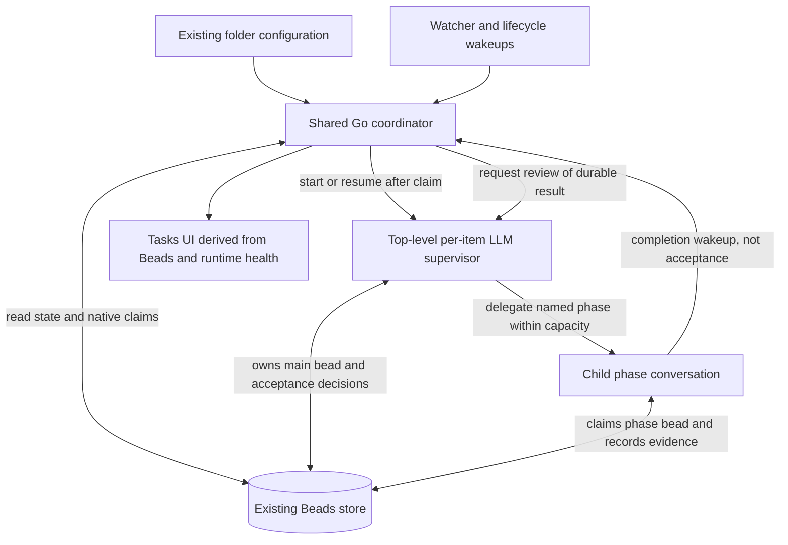

# Task Automation Manager (Design)

This document proposes a shared Go coordinator for task automation, with an
LLM supervisor for each bug, feature, or other work item and focused workers
for its delegated phases.

> **Beads owns workflow state and ownership. Go schedules and reconciles.
> LLM supervisors judge the work. Conversations execute it.**

> Status: **Design / proposal**, revised 2026-09-05. The Beads-only storage
> and native-claim constraints below are agreed requirements. Metadata
> schemas, phase granularity, APIs, and defaults are proposals, not shipped
> functionality. Open questions include possible solutions and recommended
> starting points; they are not implicit implementation commitments.

This revision supersedes the earlier proposals for separate task-run storage,
Mitto-managed ownership leases, label-only completion, and automatic stale-claim
reclamation. See [Message Queue](message-queue.md),
[Session Management](session-management.md), and [MCP](mcp.md) for reusable
infrastructure, whose existing guarantees must not be overstated.

## Agreed Constraints

1. **Beads is the sole authoritative store for workflow state.** Goals,
   ownership, selected workflow, current phase, attempts, outcomes, decisions,
   and recovery information belong in tickets, metadata, comments, and links.
2. **No new database or parallel workflow store.** No task-run sidecar, lease
   database, durable scheduler queue, or workflow journal outside Beads.
   In-memory caches and queues are disposable and rebuildable from Beads.
3. **Ownership is acquired through native Beads claiming.** A competing owner
   must cause the claim attempt to fail; no assignee overwrite or passive
   metadata protocol may substitute for the claim.
4. **Preserve semantic supervision.** Go must not decide that an implementation
   is correct merely because a worker stopped or a terminal label appeared.
5. **Explicit folder opt-in.** Opening a folder is not authorization to work,
   commit, push, merge, or perform unrelated external actions.
6. **No automatic claim theft.** Silence or an old heartbeat is not permission
   to replace an owner. Resume verified owned work or use an explicit handoff.

Existing configuration files may still hold folder opt-in and workflow
definitions; normal session storage still holds conversations. Neither becomes
an independent authority for task progress. The workflow selected for an active
task and the information needed to reconstruct it must be recorded in Beads.

## Motivation

There are two independent orchestration loops:

- **Outer / fleet loop:** choose eligible work across folders, claim tickets,
  enforce capacity, start conversations, and recover interrupted dispatch.
  Today much of this is expressed in `Loop processing tasks`.
- **Inner / per-item loop:** interpret one goal, investigate, implement, test,
  review, and decide whether the evidence satisfies that goal. Today bug and
  feature drivers self-dispatch named phases using labels.

The fleet loop repeatedly uses model turns for mechanical work and duplicates
scheduling policy across folders. Its read-then-write passive claims and
title-based conversation discovery are fragile coordination mechanisms.

The inner loop still needs intelligence. The existing feature review already
checks acceptance criteria and downstream impact; this design strengthens its
decision and rework contracts rather than claiming supervision is absent today.
Likewise, `freshContext: true` does not preclude semantic oversight: an LLM can
reconstruct intent and prior decisions from Beads on every turn.

## Verdict

Adopt a **Beads-backed coordinator**, not a new workflow platform:

- A shared Go `TaskAutomationManager` handles admission and reconciliation.
- A per-item LLM supervisor owns the main bead and semantic acceptance.
- Delegated workers claim their own phase beads and persist evidence there.
- Small steps done by the supervisor itself need not create another bead.

This is a moderate-to-large integration effort. Beads eliminates a second
persistence subsystem, but claim identity, interrupted starts, rework, and
safe repository access still need explicit contracts and tests.

## Existing Building Blocks

| Capability                            | Existing component                              | Reuse boundary                                                     |
| ------------------------------------- | ----------------------------------------------- | ------------------------------------------------------------------ |
| Folder change notifications           | Shared `BeadsWatcher`                           | Debounced wakeups, not a durable event queue                       |
| Loop dispatch and lifecycle wakeups   | `LoopRunner`, including `onChild`               | Reuse dispatch infrastructure, not labels as proof of success      |
| Scheduled-loop capacity               | `tryReserveWorkspaceSlot`                       | Not a universal task or repository-writer limit                    |
| Folder opt-in/configuration surface   | `folders.json`, `BeadsFolderSettings`, Tasks UI | Keep configuration separate from execution state                   |
| Conversation creation/resumption      | `SessionManager`                                | A session link is an association, not ownership                    |
| Named phase prompts and model routing | Bug/feature phase prompts, `preferredModels`    | Adapt existing assumptions about labels, targets, and submission   |
| Beads operations from Go              | `internal/beads` client                         | Extend with native claim and required targeted metadata operations |
| Child messages and reports            | MCP child tools                                 | Notifications/convenience only; outcomes must also be in Beads     |

The installed Beads 1.2.2 help documents `bd update <id> --claim` as atomic,
setting the assignee and `in_progress`, and idempotent for the same owner.
This is documented behavior, not yet a verified concurrent-claim contract for
this feature. The current Go `UpdateParams` does not expose native claiming
or all metadata writes needed here.

## Architecture Overview

The supervisor is a **top-level conversation created by the Go manager**, not
an MCP child of an LLM fleet conversation. The current MCP creation handler
rejects spawning from a conversation with `ParentSessionID != ""`. This shape
supports one level of phase children without relaxing that recursion guard.
Nested bead hierarchies do not require nested conversation hierarchies.

Supervisors request/delegate work, while backend admission checks apply to every
automated phase start. The exact helper/API is still to be designed; direct
MCP spawning must not become a bypass around the coordinator's resource limits.

## Deterministic vs Semantic Boundary

| Go coordinator                                                                        | LLM supervisor and workers                                               |
| ------------------------------------------------------------------------------------- | ------------------------------------------------------------------------ |
| Folder opt-in, priority ordering, fairness, explicit dependency checks                | Interpret goals, acceptance criteria, and ambiguous requests             |
| Native claim attempts and typed conflict handling                                     | Investigate, reproduce, design, implement, and test                      |
| Validate phase identities, ownership associations, limits, and required result fields | Judge whether evidence establishes a root cause or satisfies a criterion |
| Start/resume conversations and reconcile interrupted dispatch                         | Accept a result, request bounded rework, or explain a blocker            |
| Detect a mention and retain its source reference                                      | Decide what the mention asks and whether it is authorized                |
| Check child statuses and submission prerequisites                                     | Judge integrated feature/epic correctness and reopened symptoms          |

The coordinator may execute a close requested by the owning supervisor after
checking policy and persisted acceptance. It must not independently close on
`fixed`, `verified`, all children closed, conversation end, or a report arriving.
Mandatory policy checks cannot be waived by the supervisor's narrative.

Likewise, enumerating existing epic children is mechanical; decomposing a goal
into the right children is semantic. Code uses explicit dependencies. When a
supervisor discovers an implicit prerequisite, it records a dependency or
requests a scope decision rather than expecting the scheduler to infer one.

## Beads State and Ownership Model

### Main bead and delegated phase beads

The main bead holds overall intent, workflow progress, and acceptance. Its
supervisor retains the native claim for the execution. A delegated worker
claims a **separate phase bead**, not the supervisor's main bead. Do not share
the supervisor's actor identity among workers to let them all appear to own it.

Recommended granularity: create a child bead for each independently delegated
unit, but keep small inline supervisor steps on the main bead. Context resets
and individual tool calls are not work items. Phase granularity remains an
explicit trade-off (see Open Questions).

| Information                                               | Authoritative Beads representation                                        |
| --------------------------------------------------------- | ------------------------------------------------------------------------- |
| Goal and definition of done                               | Main bead description and acceptance criteria                             |
| Owner and broad lifecycle                                 | Native assignee established by claim; native status                       |
| Execution identity and selected workflow                  | Main bead namespaced metadata                                             |
| Supervisor association and pending start                  | Main bead metadata                                                        |
| Current step, attempt, accepted outcomes, limits consumed | Main bead metadata, with explanatory comments                             |
| Delegated work                                            | Child beads, parent links, and applicable dependency edges                |
| Worker identity, conversation association, dispatch state | Phase bead metadata and native claim                                      |
| Findings and verification evidence                        | Phase comments and references to tests, diffs, commits, and artifacts     |
| Acceptance/rework decision                                | Main bead structured decision plus rationale comment                      |
| Blocking or human handoff                                 | Native status where appropriate, blocker metadata/labels, and explanation |

Proposed logical metadata fields include `schema_version`, `execution_id`,
`workflow_snapshot`, `supervisor_session_id`, `current_step`, `attempt`,
`phase_bead_id`, `dispatch_state`, `outcome`, and `evidence_revision`. Names and
encoding are not yet an API. Use a reserved automation namespace and targeted
updates that preserve unrelated metadata. Do not replace whole descriptions
or arbitrary metadata objects to advance a phase.

Labels are useful views, not proof. Acceptance references the specific phase
attempt, code revision tested, and goal/acceptance-criteria snapshot retained
in Beads; for uncommitted work, use an identifiable diff/worktree snapshot
rather than pretending a commit SHA identifies it. If implementation or
requirements change, prior verification remains history but no longer proves
the current result. The supervisor must reassess changed requirements and
record fresh acceptance before closure. A reopen creates a new execution
episode on the same bead, preserving history and reassessing the new symptom.

### Claim rules

1. Choose an eligible ticket and a unique, recoverable owner identity.
2. Attempt `bd update <id> --claim` under that identity.
3. Start engineering work only after confirmed success. If the result is
   ambiguous because transport failed, reconcile the assignee before acting.
4. On a foreign-owner conflict, fail that attempt and leave the ticket alone:
   no forced assignment, release, deferral, or claim-clearing comment workflow.
5. On resumption, reuse the verified owning identity rather than inventing a
   new one and treating the old assignment as stale.

A generic shared actor such as `mitto` is unsafe: same-owner idempotency could
let independent workers both succeed. Beads exposes `--actor`, but its precise
relationship to the claim assignee and conflict behavior must be contract-tested
for supported versions. The existing web-client actor is not a worker identity.

`in-flight` may remain a compatibility/UI label. `claimed_by` and heartbeats
must not become a competing claim system. Native claiming sets `in_progress`;
recovery must therefore inspect owned in-progress work, not only `bd ready` or
the old `open + in-flight` reaper query.

Atomic claiming does not establish that every later Beads write is owner-checked.
Use one logical writer for main-bead orchestration state (the owning supervisor,
with validated coordinator operations on its behalf), and each worker for its
own phase. Do not claim security isolation from agents that retain unrestricted
shell access; enforcement and concurrent human-edit behavior remain open.

### Phase completion versus task acceptance

Recommended serial flow:

1. Supervisor records the next step/attempt and creates its phase bead.
2. That worker claims the phase bead, then starts its conversation.
3. Worker persists a structured outcome and evidence before reporting completion.
4. Supervisor reads Beads, reviews the evidence, and records acceptance or rework.
5. Only an accepted result enables the next phase; create it incrementally.
6. Supervisor closes the main bead only after final acceptance and the selected
   submission policy are satisfied.

A worker may close its own phase bead when its assigned deliverable is complete.
For example, a review finding defects can be a completed review deliverable,
with `needs_rework` as its outcome; it is not acceptance of the implementation.
Blocked/incomplete execution must not masquerade as successful completion.

Create a new attempt bead for substantial rework by default, retaining prior
evidence. Distinguish automation-phase children from ordinary feature subtasks:
the fleet picker must not independently dispatch a supervisor's internal phases,
but must still be able to select ordinary eligible child work.

MCP reports and `onChild` events are wakeups. Report receipt, agent idleness,
loop stop, and task acceptance are different states. No transition may depend
solely on an MCP collector or conversation transcript surviving.

## Scheduling & Fairness

Use per-folder priority ordering with stable tie-breaks and round-robin across
eligible folders; add aging/weights only if measurements justify them. Runtime
queues are derived from Beads and need no durable queue store.

Separate three limits:

- **Active task executions:** how many claimed main beads automation pursues.
- **Active agent execution:** capacity at the actual ACP/process boundary.
- **Repository mutation:** concurrent writers and integration operations.

The existing loop semaphore is not sufficient: it is keyed by working directory
and ACP server, covers a turn rather than a task, and the current forced path
used by event-driven triggers bypasses it. Reuse/extract admission mechanisms
only after auditing every automated start/resume path.

Default to one mutating execution per working tree. Distinct claims protect
different tickets, not a shared Git index or shared files. A `work_paths`
manifest is a hint, not proof of independence. Future parallelism should use
isolated worktrees and explicit integration checks, including shared external
resources such as ports and test databases.

A waiting supervisor retains its bead claim but releases agent execution
capacity. Otherwise a single-slot pool can make the parent wait for a child
that cannot start until the parent releases the slot.

## Recovery and Reconciliation

Claiming, updating Beads, creating a session, and performing external actions
are separate operations. Do not promise an atomic claim-and-spawn transaction
or exactly-once external effects. Persist dispatch intent and outcome in the
relevant bead and reconcile ambiguous operations before retrying.

Allocate a stable execution/owner identity before claiming so even a crash
immediately after the claim can be associated with this manager's work. Record
the intended session/attempt before activating it; session discovery confirms
execution health but does not replace Beads workflow state. Exact claim/start
ordering and session-ID allocation are prerequisites to settle in the prototype.

| Interruption                               | Required recovery                                                                                                           |
| ------------------------------------------ | --------------------------------------------------------------------------------------------------------------------------- |
| Claim succeeds, metadata/start incomplete  | Inspect owned in-progress tickets; complete startup for the same verified owner                                             |
| Phase bead creation response lost          | Search the parent's children by execution/step/attempt before creating another; ambiguous duplicates require reconciliation |
| Session start response lost                | Locate the intended session; do not blindly start a second writer                                                           |
| Result persisted, notification lost        | Read the phase bead and request supervisor review                                                                           |
| Notification arrives, result not persisted | Do not advance; retry persistence or flag incomplete evidence                                                               |
| Old phase reports after rework/reopen      | Match execution, attempt, and evidence revision; retain history without advancing the current attempt                       |
| Beads unavailable                          | Admit no new work or transitions; retry access and surface the blocker, with no alternate durable store                     |
| Supervisor/worker disappears               | Reconstruct from its bead and resume only after excluding an active old executor                                            |
| Commit/PR action may already have happened | Inspect its recorded identity and actual external state before retrying                                                     |
| Foreign or uncertain ownership             | Leave the claim intact and escalate; never infer takeover authority from silence                                            |

Watch events mark folders/tickets dirty; bounded reconcilers read current Beads
state. Run reconciliation at startup and use a slow jittered sweep as a safety
net for missed, coalesced, or suppressed events. Do not block watcher callbacks
on agent work, and isolate failures so one folder cannot stall all others.

Claims do not automatically expire. Explicit handoff must stop the old executor
before releasing/reassigning a ticket. Operator decisions and handoff reasons
belong on the bead. If old execution cannot be ruled out, remain blocked rather
than trade a stuck task for concurrent writers.

## Configuration

Use existing global/folder configuration surfaces for defaults, not task state:

- Enabled folders, task types, ACP workspace/server, supervisor model policy.
- Workflow per task type, optional folder override, and additional instructions.
- Submission strategy, base branch, and definition of the completion milestone.
- Task/agent/writer limits; per-step attempts and overall time/spawn budgets.
- Optional post-task hook with explicit permissions and recorded outcome.

Selected execution policy is snapshotted on the main bead. Routine edits apply
to new tasks; migrating an active task requires an explicit recorded decision.
Permission revocation and stop controls must still take effect immediately,
not remain enabled because an old snapshot allowed them.

The UI should distinguish stop-new-admission, pause-at-next-safe-boundary, and
cancel-active-execution. Show phase, owner, blocker, pending review, and last
infrastructure error rather than an ambiguous single "running" state. Expose
effective workflow provenance (global/folder override) before enabling a folder.
Task text and imported mentions cannot broaden permissions.

## Customizable Inner-Loop Sequence

Customizing the work done on one ticket is independent of replacing the fleet
picker. Both should use the same Beads ownership and outcome contracts, so a
supervisor pilot can precede global scheduling without creating a second model.

### Where the inner loop lives today

The sequence is a label-encoded state machine in prompt YAML, not a first-class
Go workflow. Drivers self-send named phase prompts; `LoopRunner` schedules turns
without understanding engineering phases.

| Flow    | Named phase prompts, in order                                                                            | Existing progress labels                          |
| ------- | -------------------------------------------------------------------------------------------------------- | ------------------------------------------------- |
| Bug     | `Bug fix — investigate phase` → `Bug fix — reproduce phase` → `Bug fix — fix phase`                      | `researched` → `reproduced` → `fixed`             |
| Feature | `Feature — plan phase` → `Feature — implement phase` → `Feature — test phase` → `Feature — review phase` | `planned` → `implemented` → `tested` → `verified` |

Both drivers use `onCompletion` and `freshContext: true`; context clearing is
a runtime behavior, not a separately named phase in these sequences. Reasoning
models handle investigation/planning/review; Coding models handle reproduction,
implementation, and tests through each phase's `preferredModels`.

The feature review checks build/lint/docs/acceptance/downstream effects, but a
substantial gap currently leaves `tested` present and `verified` absent, causing
review to be dispatched again rather than explicitly routing to implementation.
Bug verification is included in fix work rather than a separate default peer
review step. These are starting points, not correctness guarantees to preserve.

### Proposed constrained workflow contract

Replace "first missing terminal label" with a configured default sequence plus
bounded rework decisions recorded by the supervisor. A step needs:

- A stable step ID, named prompt, arguments, and optional model policy.
- Inputs: relevant issue scope, accepted predecessor results, code revision,
  and the goal/acceptance-criteria snapshot being evaluated. Workers need the
  main bead's context even though their linked/claimed issue is the phase bead.
- Expected output/evidence and permitted outcomes, such as `reported`,
  `needs_rework`, `blocked`, and `failed`. Acceptance is a supervisor decision.
- Permitted rework destination and maximum attempts; required checks cannot be
  removed by a model deciding to skip a step.
- Execution mode (inline or delegated) and permitted side effects, including
  whether the step may commit or submit anything.

These workflow values are metadata, not proposed replacements for native Beads
statuses. Infrastructure retries are tracked separately from engineering rework
so provider outages do not consume the same budget as rejected implementations.

Example proposed bug path: investigate → reproduce → implement → verify →
supervisor acceptance. If verification finds a gap, the supervisor creates an
implementation rework attempt and then new verification against the changed
artifact. All earlier evidence remains in Beads but is not reused blindly.

Reuse named prompts and existing model selection, but adapt them for separate
main/phase IDs, explicit outcomes, and ownership. Existing phases contain label
and commit assumptions; they cannot be composed unchanged into arbitrary flows.
If loop children are used, mirror arguments into both initial and loop argument
maps. Resolve model availability visibly rather than silently ignoring a choice.

Start with config-driven sequences interpreted by the supervisor and validated
at dispatch boundaries. Do not build a generic DAG engine or encode semantic
acceptance in Go. Validate unique step IDs, resolvable prompts, required inputs,
bounded back-edges, and preservation of mandatory acceptance gates.

Global defaults and folder overrides can use existing settings/RC patterns.
Provide defaults for existing installs, not just first-install YAML seeds. A
later editor can reuse ordered-list and model-picker UI patterns, but must also
explain input contracts, rework, and effective configuration. This is more than
a list of prompt names. Test observable behavior and safety invariants, not
"byte-identical" LLM execution.

## Pros, Cons, and Complexity

| Benefit                                        | Cost or limitation                                                            |
| ---------------------------------------------- | ----------------------------------------------------------------------------- |
| One user-visible source of truth               | Beads availability and schema behavior become critical dependencies           |
| Native atomic claims instead of prose locks    | Unique actors, owner resumption, and explicit handoff still need design       |
| Semantic oversight with focused phase contexts | Reviews and child startup add latency and may add model cost                  |
| Recovery without a second workflow database    | Several Beads/session/external operations still require reconciliation        |
| Child beads expose responsibility and evidence | Ticket volume, parent summaries, ready filters, and upstream sync need care   |
| Shared scheduling reduces idle model work      | A shared coordinator needs bounded per-folder work and fault isolation        |
| Customizable phases                            | Unsafe ordering and stale evidence require validation, not just a list editor |

Net cost is an empirical question: extra reviews may be offset by removing
fleet polling and repeated context. A supervisor that only trusts summaries is
an expensive rubber stamp; one that repeats all worker work is wasteful. It
should inspect the evidence needed for acceptance and request independent
verification for higher-risk changes.

Expected relative effort:

- **Medium:** Beads adapter, metadata contract, config defaults, status UI.
- **Medium-high:** supervisor/phase prompt adaptation, rework and acceptance.
- **High:** crash-window reconciliation, claim identity and recovery across
  process restarts, safe mutation admission, migration from passive claims.
- **Deferred:** arbitrary graphs, multiple active managers, parallel writers,
  and distributed orchestration across independently replicated stores.

## Migration Plan

**Basic recovery must work before live autonomous dispatch**, even with one
worker. The old passive protocol leaves status `open` and relies on a reaper
that scans `open + in-flight`; replacing it requires adapting all relevant
claim/cleanup consumers, not just changing one command to `--claim`.

1. **Contracts and adapter:** verify native claim identity/conflicts and
   metadata preservation. Define main/phase identities, outcomes, ownership,
   acceptance, and incomplete-start recovery, all in Beads.
2. **Bounded per-item pilot:** start a top-level supervisor for one explicitly
   selected bug, with serial phase workers and the proposed contracts. Exclude
   it from legacy automation. Do not spawn it as a fleet conversation's child
   and assume it can create grandchildren.
3. **Failure tests:** exercise claim/start/result crash windows, late reports,
   cancellation, Beads outages, and reopening before broader autonomous use.
4. **Shadow fleet evaluation:** compare candidate decisions without claims,
   writes, or starts. Record intentional differences from old heuristics.
5. **Folder migration:** stop legacy admission, inspect queued prompts and
   active descendants, drain them or explicitly adopt stopped owned work, then
   translate passive claims to native claims and enable new admission. Never
   reinterpret a foreign passive claim as free work. Require operator action
   if ownership cannot be established.
6. **Serial shared dispatcher:** opt-in folders, conservative capacity, startup
   reconciliation, and slow repair sweeps. Keep rollback available.
7. **Customization/UI, then optional concurrency:** expose validated defaults
   and folder overrides after the contract is stable; add worktree integration
   only when its safety model is proven.

Pausing the old fleet loop alone is insufficient: its children and queued
prompts may still run. Rollback must stop new admission, drain/stop or explicitly
hand off new work, and reconcile claims before re-enabling legacy automation.
Do not delete phase history or blindly restore the old open-status protocol.

## Validation and Success Criteria

Required implementation tests should cover:

- Two distinct actors claim one ticket: one winner; same-owner retry is safe;
  foreign-owner failure leaves assignee, status, and unrelated metadata intact.
- Two processes attempting to resume the same owner, including through workspace
  aliases, cannot both activate execution; uncertain exclusivity blocks recovery.
- Parent supervisor and phase workers claim different tickets and cannot
  advance each other's scope through the automation adapter.
- Crashes after claim, after phase creation, after session creation, and after
  result persistence recover without duplicate active writers.
- A notification or closed child without usable evidence cannot accept a task;
  old-attempt evidence cannot advance a reopened or modified implementation.
- Changed goals or acceptance criteria after verification but before closure
  require reassessment; acceptance for the old scope cannot close the task.
- Lost watcher events are repaired; failed Beads reads do not look like an empty
  backlog; one unhealthy folder does not stall other folders.
- Pause/cancel/revocation prevent subsequent dispatch as specified; waiting
  supervisors do not deadlock children by holding execution capacity.
- Workflow edits affect new tasks by default; required gates survive overrides;
  queued legacy work is accounted for during migration and rollback.

Measure cost per accepted task, completion latency, reopen/regression rate,
no-progress retries, duplicate writers, human interventions, and recovery
success. Compare against the existing flows on representative bugs/features;
fewer supervisor turns alone does not establish better quality or lower cost.

## Open Questions

Every option below must respect Beads-only workflow state and native claiming.
No question is an invitation to add an alternate database or automatic lease
takeover. Recommendations identify a starting point, not a settled schema.

### Q1. What is the durable claim identity?

- **Options:** conversation-derived actor, or stable execution-derived actor
  recorded in the claim and linked to a replaceable conversation in metadata.
- **Trade-off:** conversation IDs are easy to inspect, but replacement after
  loss needs handoff; execution IDs survive replacement but must never be shared
  by simultaneously active workers.
- **Recommendation:** prototype a unique execution-derived owner, with explicit
  conversation association and one live executor. Contract-test `--actor`,
  same-owner idempotency, foreign-owner failure, and restart identification.

### Q2. Who applies and enforces orchestration updates?

- **Options:** supervisor runs `bd` directly; or a narrow backend adapter applies
  native claims and targeted Beads updates on the supervisor's behalf.
- **Trade-off:** direct CLI is simple but has weak structural enforcement; an
  adapter can validate ownership, attempts, and transitions but adds API work.
- **Recommendation:** use a narrow validated adapter for orchestration writes,
  with Beads still the only store. Define per-field writers and preserve human
  edits. Investigate conditional updates before promising race-free concurrent
  metadata changes; a claim does not imply every write is owner-checked.

### Q3. How many phase beads should be created?

- **Options:** every named phase gets a bead; group several steps into one
  delegated work bead; or keep inline steps as main-bead metadata.
- **Trade-off:** fine granularity improves claims/audit/retry isolation but
  increases ticket noise, CLI traffic, and possible upstream synchronization.
- **Recommendation:** one bead per independently delegated unit, created only
  when authorized. Tag its automation role explicitly, group it in the UI, and
  define whether internal phases are exported upstream without hiding ordinary
  user subtasks. All delegate-owned work still has its own claim.

### Q4. How are claim/start and phase-creation gaps reconciled?

- **Options:** preallocate a session ID and store intent before activation; or
  create an inert session, claim, and activate only after association persists.
- **Trade-off:** either order has an incomplete-operation window. Retrying a
  session start or child creation blindly can duplicate work even with claims.
- **Recommendation:** select one explicit order, identify attempts in Beads,
  and reconcile before retrying. A serialized owner searches children before
  repeating an uncertain create. Test every boundary; do not promise exactly
  once or use session existence alone as proof of ownership.

### Q5. How is stalled ownership handed off?

- **Options:** resume the same verified owner; operator-authorized release and
  new claim after stopping the old executor; or leave blocked for inspection.
- **Trade-off:** conservative recovery may leave work waiting, but time-based
  reassignment can introduce concurrent writers.
- **Recommendation:** same-owner resume for known interrupted local work;
  explicit handoff for replacement, recording reason and evidence in Beads.
  Define whether any demonstrably stopped local case may be automated later.
  Foreign ownership and uncertain liveness never authorize takeover.

### Q6. What is the multi-folder and multi-process scope?

- **Options:** one manager per local Beads/execution domain; multiple processes
  sharing one authoritative Beads store; or independent replicated copies.
- **Trade-off:** native claims can coordinate against a common authority, but
  asynchronous copies cannot be assumed to reject competing claims globally.
  Two managers resuming the same actor can also bypass claim conflict semantics.
- **Recommendation:** one active local manager initially. Cross-process exclusion
  is an **unverified prerequisite**, not a guarantee supplied by an in-process
  singleton or mutex. Identify and test a process-lifetime exclusion mechanism
  without adding a workflow store or replacing native ticket claims. Canonicalize
  database and working-tree identities so workspace aliases are not separate
  ownership domains. Block autonomous recovery when exclusivity cannot be
  established, and defer multi-manager support pending verified semantics.

### Q7. What is frozen when a workflow starts?

- **Options:** workflow name/version only; ordered steps and arguments; or a
  self-contained snapshot including selected prompt/fragment definitions.
- **Trade-off:** references are compact but mutable prompts can change meaning;
  complete snapshots are reproducible but enlarge tickets and need size limits.
- **Recommendation:** store resolved sequence, arguments, and definition
  versions in Beads, plus enough immutable content to reconstruct execution
  without a second store. A hash alone is insufficient if its content is lost.
  Decide metadata versus a structured Beads comment after testing size limits.
  Never snapshot credentials; resolve them through existing secure facilities.

### Q8. How should rework, reopening, and review independence work?

- **Options:** reopen a phase bead, append attempt records on it, or create a
  new attempt bead; review in the supervisor or use an independent verifier.
- **Trade-off:** reuse reduces clutter; separate attempts preserve clear claims
  and evidence. Independent verification adds cost but reduces self-confirmation.
- **Recommendation:** new beads for substantial rework, bounded attempts, and
  revision-bound acceptance. Use independent verification for higher-risk work.
  Reopened symptoms require reassessment: a previously green reproduction test
  or landed commit alone does not prove the new report is resolved.

### Q9. What does closing the main bead mean?

- **Options:** locally accepted implementation; submitted PR; merged change;
  or deployed and externally verified behavior.
- **Trade-off:** early closure improves throughput but may misrepresent delivery;
  waiting for deployment may require human/external work outside this repository.
- **Recommendation:** explicit per-folder/workflow completion policy recorded
  on the bead, separating engineering acceptance from submission milestones.
  Only the supervisor's acceptance for the current code and requirements plus
  required policy permits closure. Re-read live requirements before closing;
  atomic protection against edits racing that check remains part of Q2's
  conditional-update investigation. For epics, closed children are necessary
  where configured, not integration proof.

### Q10. What do pause, cancellation, and budgets guarantee?

- **Options:** stop admission only, pause between phases, or cancel active
  execution; limits per phase, per main bead, and/or per folder.
- **Trade-off:** immediate cancellation may leave uncommitted work or uncertain
  external actions; boundary pauses finish safely but are not immediate stops.
- **Recommendation:** distinct controls, no destructive rollback by default,
  and durable per-bead pause/recovery reason and consumed-attempt counters.
  Start with elapsed-time, attempt, and spawn limits; cost limits require
  reliable usage accounting. Settle how active work quiesces during Beads outages
  without claiming it can persist new state while the store is unavailable.

### Q11. How are workflows exposed and merged?

- **Options:** per-type presets with full folder replacement; per-step patches;
  or arbitrary user-authored graphs.
- **Trade-off:** patch merging is flexible but makes effective ordering and
  mandatory gates harder to understand; arbitrary graphs greatly enlarge scope.
- **Recommendation:** per-type presets and explicit folder replacement first,
  validated against required gates, with a preview of the effective sequence.
  Show internal phase prompts in the workflow picker without exposing them as
  ordinary chat actions. Defer graph editing and append/patch semantics.

### Q12. What evidence and history are retained?

- **Options:** verbose inline reports, compact structured metadata with comments,
  or references to externally retained test/diff artifacts.
- **Trade-off:** large reports inflate Beads; artifact references can expire;
  conversation cleanup may otherwise erase the only useful evidence.
- **Recommendation:** keep decisions, outcome, tested revision, command/result
  summaries, and enough recovery context in Beads before any conversation
  cleanup. References may supplement but not replace essential workflow facts.
  Define report-size/retention limits and interaction with task upstream sync;
  do not create an automatic task-deletion policy as part of this feature.

## References

- Fleet prompt: `config/prompts/builtin/beads-issues/loop-processing.prompt.yaml`.
- Current bug driver and phases:
  `config/prompts/builtin/beads-issues/loop-fixing-bug.prompt.yaml`,
  `config/prompts/builtin/beads-issues/fix-phase-{investigate,reproduce,fix}.prompt.yaml`.
- Current feature driver and phases:
  `config/prompts/builtin/beads-issues/loop-implementing-feature.prompt.yaml`,
  `config/prompts/builtin/beads-issues/feature-phase-{plan,implement,test,review}.prompt.yaml`.
- Passive protocol being replaced:
  `config/prompts/builtin/beads-issues/shared/claim-entry.tmpl`,
  `config/prompts/builtin/beads-issues/shared/claim-clear.tmpl`.
- Beads adapter and watcher: `internal/beads/beads.go`, `internal/beads/cli.go`,
  `internal/beads/watcher/watcher.go`; installed CLI reference: `bd update --help`.
- Conversation creation/delegation: `internal/mcpserver/tools_conversation_new.go`,
  `internal/mcpserver/tools_children.go`, [MCP](mcp.md).
- Loop admission and wakeups: `internal/conversation/loop_runner.go`,
  `internal/conversation/loop_runner_tasks.go`, [Message Queue](message-queue.md).
- Session runtime: [Session Management](session-management.md).
- Config layering: `internal/config/workspace_rc.go`,
  `internal/config/folders.go`, `internal/config/settings.go`.
- UI patterns: `web/static/components/SettingsDialog.js`,
  `web/static/components/WorkspaceFolderBeadsTab.js`.
