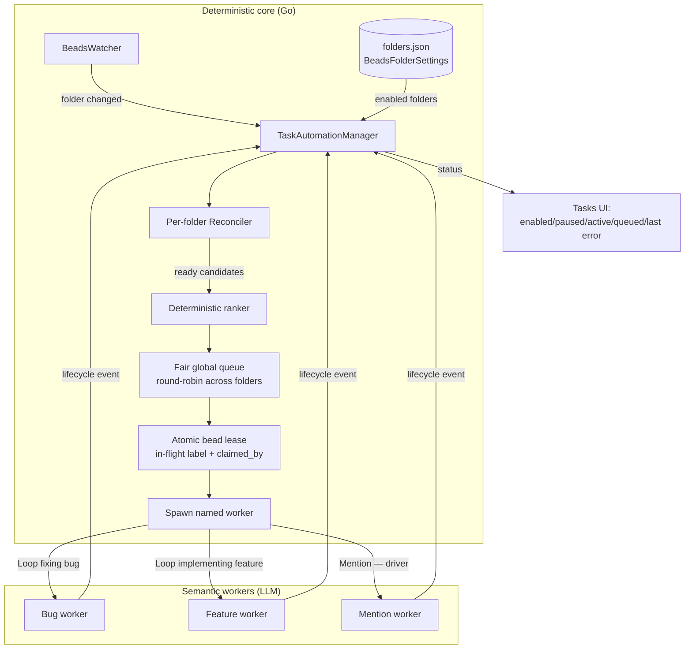

# Task Automation Manager (Design)

This document is a design decision record for replacing the `Loop processing
tasks` **supervisor** prompt with a shared, process-level Go scheduler while
retaining the existing LLM-driven **worker** prompts. It captures the hybrid
architecture, the boundary between deterministic and semantic logic, the
migration plan, and the open questions that must be resolved before build.

> Status: **Design / proposal.** No code exists yet. This document records the
> analysis behind the recommendation and is the reference for a future
> implementation. See [Message Queue](message-queue.md) for the loop trigger
> machinery this design builds on, and
> [Session Management](session-management.md) for the ownership model.

## Motivation

Today, task automation is driven entirely by the `Loop processing tasks`
prompt (`config/prompts/builtin/beads-issues/loop-processing.prompt.yaml`, ~1576
lines). Each watched folder runs its own loop conversation whose model turn
re-executes a long procedural script every fire: it filters ready beads, ranks
them, detects `@mitto` mentions, recovers stale claims, expands epics, spawns
worker conversations, reconciles terminal labels, and reaps completed epics.

That approach has structural costs:

- **Expensive.** Every reconciliation is a premium model turn, even when the
  decision is purely mechanical (nothing ready → nothing to do).
- **Race-prone.** Ownership, claim recovery, and duplicate-worker avoidance are
  expressed as prose the model must execute correctly each time, rather than as
  tested state transitions.
- **Duplicative.** One loop conversation per folder re-derives shared logic;
  cross-folder fairness and global caps are impossible to enforce from inside a
  single folder's loop.
- **Opaque.** Supervisor state (who owns what, how many workers are in flight)
  is reconstructed each turn by parsing textual MCP/`bd` output and counting
  conversation title prefixes (`Fix `, `Post-task: `).

The core insight: **replacing the supervisor turn is very different from
replacing the worker agents.** The supervisor is mostly a stateful
scheduler/reconciler — a natural fit for Go. The workers still require model
reasoning for investigation, implementation, testing, and interpreting
ambiguous human requests.

## Verdict

**Adopt a hybrid system:**

> **Programmatic scheduling and reconciliation; LLM-driven task execution.**

A Go `TaskAutomationManager` owns candidate selection, ownership leases,
lifecycle recovery, fairness, and caps. It spawns the existing named worker
prompts (`Loop fixing bug`, `Loop implementing feature`, `Mention — driver`)
to do the actual engineering. Counting conversations by title prefix and
parsing MCP state as text both disappear.

This is a **moderate-to-large feature, not a greenfield subsystem** — much of
the required infrastructure already exists (see [Existing Building
Blocks](#existing-building-blocks)).

## Existing Building Blocks

The design reuses, rather than reinvents, the following:

| Capability                                        | Existing component                                                                    |
| ------------------------------------------------- | ------------------------------------------------------------------------------------- |
| Watch `.beads` across all workspaces              | single shared `BeadsWatcher`                                                          |
| Event coalescing, startup recovery, retries       | `LoopRunner` (`internal/conversation/loop_runner.go`)                                 |
| Per-workspace concurrency cap + semaphore         | `tryReserveWorkspaceSlot` / `releaseWorkspaceSlot`, `DefaultLoopWorkspaceConcurrency` |
| onTasks diffing against a baseline                | `loop_runner_tasks.go`                                                                |
| Per-folder Beads settings store                   | `folders.json` / `BeadsFolderSettings`                                                |
| Folder-level config UI surface                    | Tasks/Beads settings tab                                                              |
| Resolve default workspace/ACP server for a folder | `SessionManager`                                                                      |
| Formal issue↔conversation ownership               | `beads_issue` link                                                                    |
| `bd` CLI access from Go                           | `internal/beads/beads.go`                                                             |

## Architecture Overview

The manager is **event-driven**: it reacts to beads changes and worker
lifecycle events rather than blocking in waits. Every action re-reads live
issue and conversation state immediately before acting, then acquires a durable
lease atomically before spawning.

## Deterministic vs Semantic Boundary

The single most important design decision is **what moves into Go and what
stays with the model.** The current prompt mixes all three of the following
categories; separating them is what makes the hybrid safe.

### 1. Straightforwardly deterministic → Go logic

These are mechanical rules with no judgment. Encoding them as tested Go is
strictly more reliable than asking a model to execute prose each turn:

- Folder opt-in/opt-out and watcher subscriptions.
- `@mitto` mention detection and exact timestamp back-references.
- Filtering by status, issue type, labels, explicit dependencies, `needs-human`.
- Expanding epics into children.
- Strict A → B → C priority ordering.
- Numeric priority + stable ID tie-break.
- Exact conversation ownership via `beads_issue`.
- Duplicate-worker detection.
- Per-folder worker caps.
- Selecting the correct named worker prompt and arguments.
- Terminal-label closure and basic epic completion.
- Notifications and audit records.

### 2. Deterministic but operationally difficult → careful state machines

No intelligence required, but each needs a deliberate, tested state-machine
design. The current prompt already carries these difficulties as prose; moving
them into code makes them **testable rather than eliminated**:

- Atomic claim-and-spawn without a time-of-check/time-of-use race.
- Crash recovery between claiming a bead and creating its worker.
- Stale/malformed claim reconciliation.
- Reopen episodes: deciding whether terminal labels belong to the _current_
  episode or a prior one.
- Worker cleanup that does not kill a legitimate long-running turn.
- Undefer detection from comment or description changes.
- Post-task hook exclusivity.
- Branch/PR policies sharing one working tree.
- Fairness across folders and global session limits.
- Startup reconciliation and detection of duplicate Mitto processes.
- Migration while old `Loop processing tasks` conversations are still active.

### 3. Genuinely semantic → stays with LLM workers

These must **not** be reproduced as fuzzy programmatic heuristics — doing so
risks incorrectly closing or colliding work:

1. **Already-landed fix detection.** The prompt derives "distinctive keywords,"
   inspects commit subjects/diffs, and judges whether a commit plausibly
   resolves a bead. A keyword heuristic risks wrongly closing work → spawn a
   **verifier worker** instead.
2. **Parallel disjointness from prose.** Extracting file surfaces from design,
   acceptance, or investigation comments is semantic. **Default to serial
   execution** unless workers record a structured `work_paths` manifest.
3. **Implicit dependency / readiness ranking.** The shared ranking fragment
   recognizes undeclared scaffolding dependencies and whether work needs
   "setup." Code should use **explicit dependency edges only**.
4. **Actual task execution and deferral judgment.** Investigation,
   implementation, testing, answering mentions, and deciding that credentials
   or human decisions are required all remain agent work.

## Manager Responsibilities

The process-level `TaskAutomationManager` will:

1. Subscribe to the existing shared `BeadsWatcher`.
2. Load enabled folders from `BeadsFolderSettings`.
3. Maintain one reconciler/state machine per folder.
4. Put ready folders into a fair global queue.
5. Re-read live issue and conversation state before every action.
6. Atomically acquire a durable bead lease (`in-flight` label + `claimed_by`).
7. Spawn the existing named worker prompt with structured arguments.
8. React to task and conversation lifecycle events (not blocking waits).
9. Reconcile claims, terminal work, and epics after startup and every relevant
   event.
10. Expose status in Tasks: enabled, paused, active worker, queued count, and
    last error.

Workers carry structured metadata (automation origin, role) so the manager
never again counts conversations by title prefix.

## Scheduling & Fairness

Reuse the existing per-workspace semaphore
(`tryReserveWorkspaceSlot`/`DefaultLoopWorkspaceConcurrency = 1`) so a shared
ACP process is never wedged by concurrent dispatch. On top of it:

- **Per-folder ranking + round-robin across folders.** A single global P0
  ordering would let one noisy repository starve every other folder. Rank
  within a folder, then rotate fairly across folders.
- **Global worker cap** as an optional process-wide backstop.

## Configuration

The folder toggle belongs in `folders.json`, alongside the existing
`BeadsFolderSettings`. Treat it as **explicit authorization — not enabled by
default.** Likely per-folder policy fields:

- Enabled / paused.
- ACP workspace + server (default workspace is a reasonable initial default).
- Bugs enabled / features enabled.
- Submission strategy + base branch.
- Epic grouping.
- Maximum workers.
- Optional post-task prompt + arguments.
- Additional instructions.
- Optional process-wide worker cap.

## Customizable Inner-Loop Sequence

Distinct from replacing the supervisor: a frequently-requested capability is
letting a user **customize the ordered steps an agent takes to solve one bead**
(the "inner loop", e.g. `investigate → reproduce → fix`). This is a separate,
smaller deliverable that can ship independently of — and before — the
`TaskAutomationManager`.

### Where the inner loop lives today

The inner loop is **not a Go construct**. It is a **label-encoded state machine
implemented entirely in prompt YAML bodies**:

| Layer           | File(s)                                                                                             | Role                                                                                                                                                                                |
| --------------- | --------------------------------------------------------------------------------------------------- | ----------------------------------------------------------------------------------------------------------------------------------------------------------------------------------- |
| Driver          | `beads-issues/loop-fixing-bug.prompt.yaml`                                                          | `onCompletion` loop; reads live bead labels, dispatches the next phase prompt **by name** via `mitto_conversation_send_prompt` (self-send), self-terminates once `fixed` is reached |
| Phases          | `fix-phase-investigate.prompt.yaml`, `fix-phase-reproduce.prompt.yaml`, `fix-phase-fix.prompt.yaml` | Each does one stage, declares its own `preferredModels` tier, appends its terminal label (`researched` / `reproduced` / `fixed`)                                                    |
| Shared partials | `beads-issues/shared/*.tmpl`                                                                        | `target-bead-header-strict`, `tier-check`, `additional-instructions` — reused across phases                                                                                         |

The **sequence itself is implicit**: it is the hardcoded label ordering
(`researched → reproduced → fixed`) plus the driver's branch logic. There is no
structured "sequence" object anywhere. The `LoopRunner` knows nothing about
phases; it only knows "re-fire this one prompt on completion." Changing the
sequence today requires forking the driver prompt and every phase prompt.

### Feasibility

Feasible and architecturally well-supported, because the primitives already
exist and just aren't composed into a first-class sequence:

- **Phase prompts are already named, discrete, self-contained units** with their
  own model tier and label contract — exactly the granularity a sequence needs.
- **Per-phase model tiering already works** via `preferredModels` +
  `setActiveModelOnly()` (transient, no baseline mutation).
- **Config layering already supports global-default + folder-override**
  (`settings.json` ↔ `.mittorc` / `folders.json` via `ApplyFolderDefaults`,
  `LoadWorkspaceRC`). A "sequence" is just another orderable list at those two
  levels — structurally identical to the **Models tab** (ordered, add / remove /
  reorder, order = priority) and the folder **Beads tab** (per-folder overrides
  of a global default).
- **Dispatch is already name-based.** "Pick next phase" generalizes to "walk the
  configured list, find the first entry whose terminal label is absent, dispatch
  it."

Two viable implementation tiers:

- **Tier A (prompt-data, low risk, recommended):** the sequence lives in config
  and is injected into the driver prompt's template context (like
  `.ACP.AvailableText` / `.Children.MCPText` today). The driver iterates it.
  `LoopRunner` is untouched. This is a pure superset of today's behavior.
- **Tier B (Go-native, high risk):** sequencing moves into Go (the
  `TaskAutomationManager`), phases dispatched programmatically. This is the
  larger effort scoped by the rest of this document and should **not** be
  conflated with "make the sequence customizable."

### Complexity estimate (Tier A)

- **Backend (config + injection) — Medium.** New `PhaseSequence []PhaseStep`
  where `PhaseStep{PromptName, TerminalLabel, ModelTag}` — mirror the
  `ModelProfile` / `ShortcutButton` pattern. Add to `Settings` (global default)
  and `WorkspaceRC` / `FolderSettings` (override) with `ApplyFolderDefaults`
  precedence. Seed today's flows as hardcoded Go defaults (the
  `DefaultModelProfiles()` pattern) **and** a first-install-only
  `config.default.yaml` seed, so it resolves even for pre-existing
  `settings.json`. Inject the resolved sequence into the driver's template
  context. New REST `GET/PUT /api/global/phase-sequences` + folder equivalent,
  mirroring `global_shortcuts.go` / `folder_pin.go` (read-modify-write
  preserving unrelated settings; broadcast a `phase_sequences_updated` event).
- **Frontend (Settings + folder tab) — Medium.** A reorderable list editor in
  the Settings dialog — the **Models tab is a near-exact template**. Each row: a
  phase-prompt picker (populated from `menus:internal` phase prompts, like the
  upstream-prompt selectors in `WorkspaceFolderBeadsTab.js`), a terminal-label
  input, and an optional `ModelTagSelect`. A folder-level override in
  `WorkspaceFolderBeadsTab.js` (append/override toggle like `FolderListEditor`).
  Refresh via a `mitto:phase_sequences_updated` window event.
- **Prompts — Medium-High (the real work).** Rewrite `loop-fixing-bug` (and the
  feature driver) to **iterate an injected sequence** instead of hardcoding
  label branches. The driver's phase-detection preamble, the "advance exactly
  one stage per run" invariant, `freshContext`, and the self-terminate
  condition all currently assume the fixed 3-label ladder. Generalizing to
  "first step whose terminal label is absent; terminate when the last configured
  label is present" must preserve those invariants. Phase prompts can stay
  as-is when reused; **arbitrary user phases** need a documented contract (a
  phase MUST append exactly its terminal label and be idempotent) — this
  contract does not exist in writing today and is the main correctness hazard.

### Risks & open questions (inner-loop customization)

1. **Backwards compatibility.** The default sequence must reproduce today's
   behavior byte-for-byte. Mitigation: hardcoded Go defaults + first-install
   YAML seed. Live loops mid-flight tolerate a sequence change between fires
   **only if** terminal-label meanings are unchanged (the driver re-reads bead
   state every fire).
2. **Label contract for user phases.** Nothing enforces "one terminal label per
   run, idempotent on re-run." A malformed custom phase could loop forever or
   skip stages. Needs a validated contract + the existing `maxIterations: 20`
   backstop.
3. **Per-type sequences.** Bug vs feature vs chore flows differ. Per-bead-type
   sequences, or one global sequence with type gates? Unresolved UX decision.
4. **Multi-trigger interaction.** The supervisor forwards
   `AdditionalInstructions` down the chain; a custom sequence must be forwarded
   / resolved consistently across supervisor → driver → phase (mind the
   `arguments` vs `loop_arguments` mirroring trap in `31-loop-prompts.md`).
5. **Model-tag validity.** Custom `modelTag` entries must pass
   `make check-model-tags` / `CanonicalModelTags()` or silently no-op.
6. **UX ambiguity.** Users can already edit prompts. A separate "sequence"
   editor risks two overlapping mental models. Frame the sequence as the
   _ladder_ and phases as the _rungs_.
7. **Discoverability.** Phase prompts are `menus:internal` (hidden); the picker
   must surface them without exposing them in the normal prompt menu.

### Recommended next steps (inner-loop customization)

1. **Commit to Tier A**; defer Tier B to the `TaskAutomationManager` epic —
   these are separate deliverables.
2. **Prototype the data model** — `PhaseStep` / `PhaseSequence` in
   `internal/config`, hardcoded Go default reproducing the bug flow, plus a
   `config.default.yaml` seed. No UI yet.
3. **Rewrite one driver** (`loop-fixing-bug`) to iterate the injected sequence
   behind an unchanged default; verify behavior is byte-identical via the
   existing bug-flow integration/loop tests.
4. **Write the phase contract doc** (terminal-label idempotency, one label per
   run) and add a builtin-prompt lint test asserting each phase declares its
   terminal label — before exposing custom phases.
5. **Add the Settings editor** cloning the Models tab, then the folder override
   in the Beads tab.
6. **Scope per-type sequences** as a follow-up once the single-flow path is
   proven.

## Migration Plan

**Hard constraint:** the programmatic scheduler and existing supervisor loops
**must not run concurrently for the same folder.** On onboarding, the manager
detects active conversations originating from `Loop processing tasks` and
either remains blocked for that folder until they are paused, or offers an
explicit migration action. Durable bead leases are a **secondary** defense —
not the primary migration mechanism.

Suggested staged rollout:

1. **Shadow evaluator.** Compute candidates and decisions without writing or
   spawning; log and compare against what the current loops actually do.
2. **Serial dispatcher.** Opt-in folders, one worker per folder, no fuzzy
   landed-fix detection and no parallelism.
3. **Recovery parity.** Claims, reopen handling, undefer, epic reconciliation,
   post-task hooks.
4. **Optional concurrency.** Only after a structured file-surface (`work_paths`)
   manifest exists to prove disjointness safely.
5. **Deprecate** the supervisor prompt once behavior is proven at parity.

## Open Questions

1. **Lease durability.** Are `in-flight` label + `claimed_by` +
   `claim_heartbeat_at` sufficient as the sole durable lease, or is a
   Mitto-side lease record needed to survive a `bd` database reset?
2. **Worker→manager metadata channel.** How do workers report structured
   results (verified-landed, `work_paths`, deferral cause)? Via child task
   reports, bead comments with a reserved namespace, or a new sidecar?
3. **Crash-window recovery.** Exact reconciliation for a crash _between_ lease
   acquisition and worker spawn — heartbeat TTL vs. explicit orphan sweep.
4. **Reopen-episode boundary.** Deterministic rule for attributing terminal
   labels to the current vs a prior episode without semantic inspection.
5. **Duplicate Mitto processes.** Two Mitto instances sharing a folder — is a
   process-level advisory lock in the folder needed?
6. **Global vs per-folder caps interaction.** Precedence and starvation
   behavior when both are configured.
7. **Structured `work_paths` schema.** Where it lives, who writes it, and its
   TTL/staleness policy before it can gate parallelism.
8. **Verifier-worker cost.** Whether landed-fix verification warrants a
   dedicated cheap-model worker vs folding it into the closing worker's turn.

## References

- Current supervisor:
  `config/prompts/builtin/beads-issues/loop-processing.prompt.yaml`
- Inner-loop driver + phases (customizable-sequence analysis):
  `config/prompts/builtin/beads-issues/loop-fixing-bug.prompt.yaml`,
  `config/prompts/builtin/beads-issues/fix-phase-{investigate,reproduce,fix}.prompt.yaml`
- Config layering + folder overrides: `internal/config/workspace_rc.go`,
  `internal/config/folders.go`, `internal/config/settings.go`
- Settings/folder UI templates for the sequence editor:
  `web/static/components/SettingsDialog.js` (Models tab),
  `web/static/components/WorkspaceFolderBeadsTab.js`
- Loop dispatch machinery: [Message Queue](message-queue.md)
- Ownership model: [Session Management](session-management.md)
- Loop trigger internals: `internal/conversation/loop_runner.go`,
  `internal/conversation/loop_runner_tasks.go`
- Beads client: `internal/beads/beads.go`
