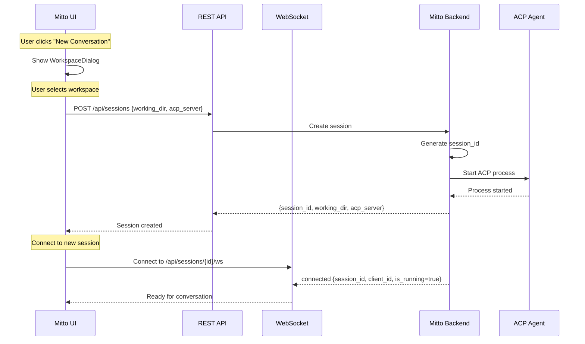
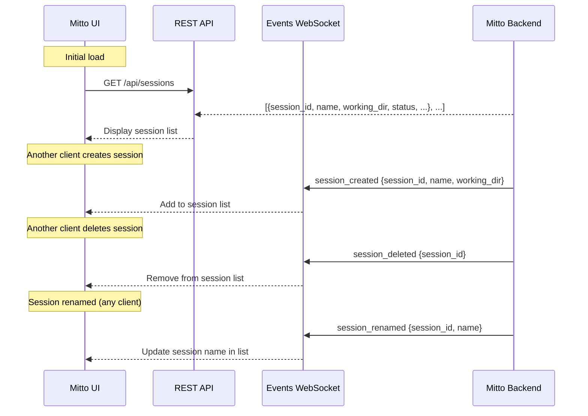
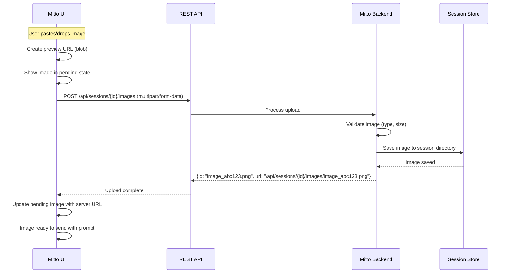
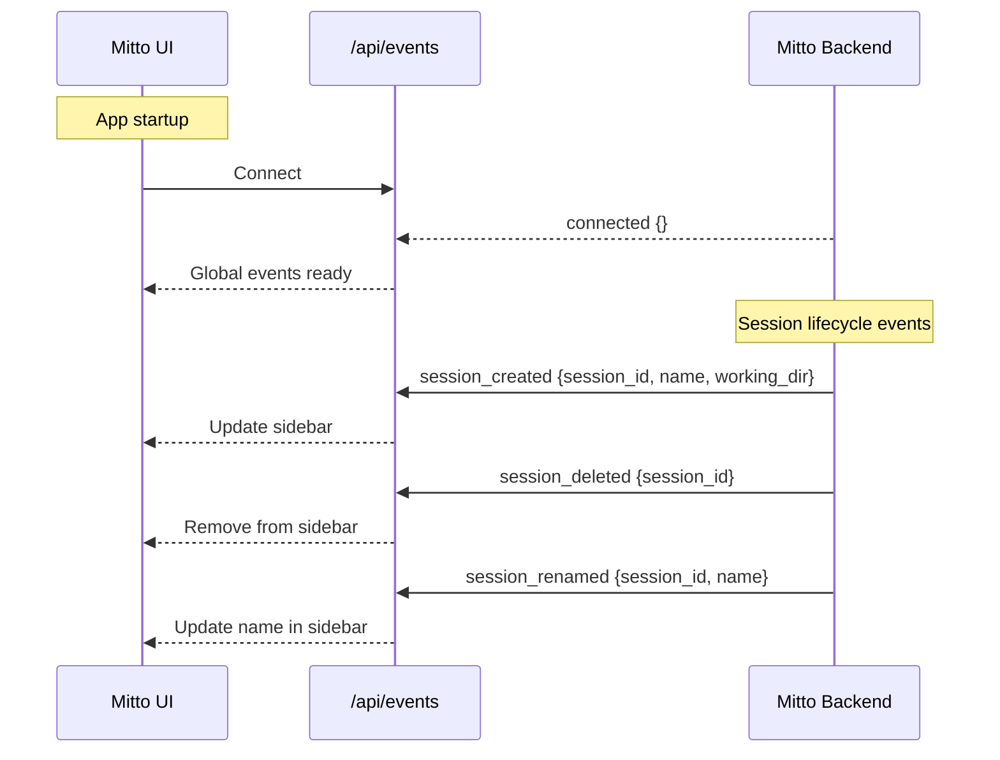
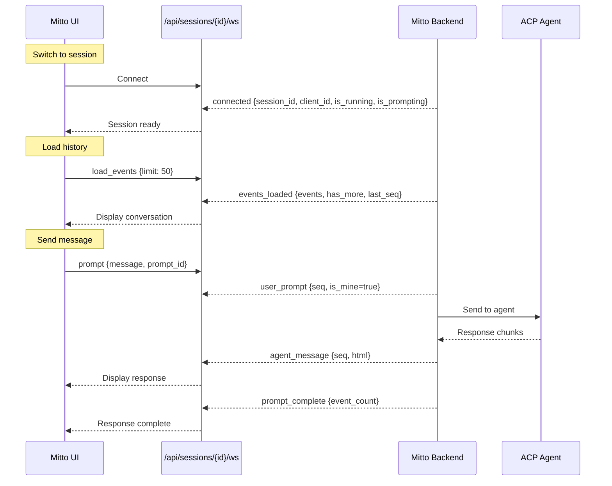
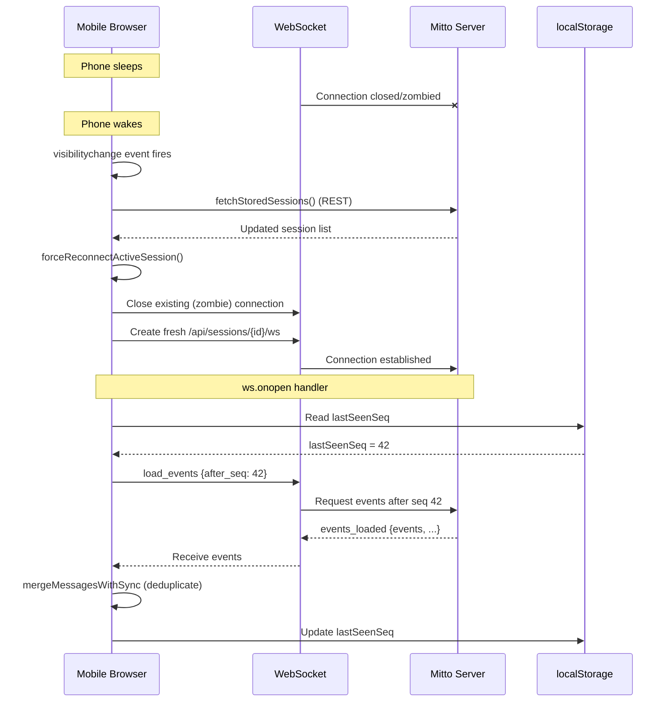

# Web Interface

The web interface provides a browser-based UI for ACP communication, accessible via `mitto web`.

## Architecture Overview

```mermaid
graph TB
    subgraph "Browser"
        UI[Preact UI]
        EVENTS_WS[Events WebSocket<br/>/api/events]
        SESSION_WS[Session WebSocket<br/>/api/sessions/{id}/ws]
    end

    subgraph "Mitto Web Server"
        HTTP[HTTP Server]
        EVENTS_MGR[GlobalEventsManager]
        SESSION_WSC[SessionWSClient]
        BG_SESSION[BackgroundSession]
        MD_BUF[Markdown Buffer]
        WEB_CLIENT[Web ACP Client]
    end

    subgraph "ACP Server"
        AGENT[AI Agent]
    end

    UI <--> EVENTS_WS
    UI <--> SESSION_WS
    EVENTS_WS <-->|lifecycle events| EVENTS_MGR
    SESSION_WS <-->|session events| SESSION_WSC
    HTTP -->|Static Files| UI
    SESSION_WSC -.->|observes| BG_SESSION
    BG_SESSION --> WEB_CLIENT
    WEB_CLIENT <-->|stdin/stdout| AGENT
    WEB_CLIENT -->|chunks| MD_BUF
    MD_BUF -->|HTML| BG_SESSION
```

## REST API Endpoints

The web interface uses REST APIs for session management and configuration:

| Endpoint                          | Method | Purpose                                    |
| --------------------------------- | ------ | ------------------------------------------ |
| `/api/sessions`                   | GET    | List all sessions                          |
| `/api/sessions`                   | POST   | Create new session                         |
| `/api/sessions/{id}`              | DELETE | Delete a session                           |
| `/api/sessions/{id}/events`       | GET    | Load session events (deprecated, use WS)   |
| `/api/sessions/{id}/images`       | POST   | Upload image for session                   |
| `/api/sessions/{id}/images/paths` | POST   | Upload images from file paths (native app) |
| `/api/workspaces`                 | GET    | List workspaces and ACP servers            |
| `/api/workspaces`                 | POST   | Add a new workspace                        |
| `/api/workspaces`                 | DELETE | Remove a workspace                         |
| `/api/config`                     | GET    | Get server configuration                   |
| `/api/queue/{session_id}`         | GET    | Get message queue for session              |
| `/api/queue/{session_id}`         | POST   | Add message to queue                       |
| `/api/queue/{session_id}/{id}`    | DELETE | Remove message from queue                  |

### Session Creation Flow



### Session List Refresh Flow



### Image Upload Flow



## WebSocket Endpoints

The web interface uses two WebSocket endpoints:

| Endpoint                | Handler              | Purpose                                               |
| ----------------------- | -------------------- | ----------------------------------------------------- |
| `/api/events`           | `GlobalEventsClient` | Session lifecycle events (created, deleted, renamed)  |
| `/api/sessions/{id}/ws` | `SessionWSClient`    | Per-session communication (prompts, responses, tools) |

This separation allows:

- Global events to be broadcast to all connected clients
- Per-session events to be scoped to interested clients only
- Sessions to continue running when no clients are connected

### Global Events WebSocket Flow



### Session WebSocket Flow



## Streaming Response Handling

The ACP agent sends responses as text chunks via `SessionUpdate` callbacks. The web interface maintains real-time streaming while converting Markdown to HTML:

1. **Chunk Reception**: `WebClient.SessionUpdate()` receives `AgentMessageChunk` events
2. **Sequence Assignment**: `WebClient` obtains `seq` from `SeqProvider` immediately at receive time
3. **Smart Buffering**: `MarkdownBuffer` accumulates chunks with their `seq` until semantic boundaries
4. **HTML Conversion**: Goldmark converts buffered Markdown to HTML
5. **WebSocket Delivery**: HTML chunks sent with preserved `seq` to browser
6. **Frontend Rendering**: Preact renders HTML via `dangerouslySetInnerHTML`, sorted by `seq`

### Sequence Number Assignment

Sequence numbers are assigned **at ACP receive time**, not when content is emitted from buffers. This ensures correct ordering even when:

- Agent messages are buffered in `MarkdownBuffer` for markdown rendering
- Tool calls arrive while text is still buffered
- Multiple text chunks are coalesced into a single message

The `WebClient` uses a `SeqProvider` interface (implemented by `BackgroundSession`) to obtain sequence numbers:

```go
// In WebClient.SessionUpdate()
case u.AgentMessageChunk != nil:
    seq := c.seqProvider.GetNextSeq()  // Assign seq NOW
    c.mdBuffer.Write(seq, content)      // Pass seq through buffer

case u.ToolCall != nil:
    seq := c.seqProvider.GetNextSeq()  // Assign seq NOW
    c.mdBuffer.SafeFlush()              // Try to flush pending content
    c.onToolCall(seq, id, title, status)
```

See [WebSocket Documentation](websockets/) for detailed documentation on sequence numbers and message ordering.

## Markdown Buffer Strategy

The `MarkdownBuffer` balances real-time streaming with correct Markdown rendering:

| Flush Trigger   | Condition       | Rationale                       |
| --------------- | --------------- | ------------------------------- |
| Line complete   | `\n` received   | Most content is line-based      |
| Code block end  | Closing ```     | Don't break syntax highlighting |
| Paragraph break | `\n\n`          | Natural semantic boundary       |
| Timeout         | 200ms idle      | Ensure eventual delivery        |
| Buffer limit    | 4KB accumulated | Prevent memory issues           |

The buffer also tracks `pendingSeq` - the sequence number from the first chunk of buffered content. When the buffer flushes, this seq is passed to the callback, ensuring correct ordering even after buffering delays.

## Frontend Technology

The frontend uses a CDN-first approach for zero build complexity:

| Library           | Purpose                       | Size    |
| ----------------- | ----------------------------- | ------- |
| Preact            | UI framework                  | ~3KB    |
| HTM               | JSX-like syntax without build | ~1KB    |
| Tailwind Play CDN | Styling                       | Runtime |

All assets are embedded in the Go binary via `go:embed`, enabling single-binary distribution.

## Component Structure

```
App
├── SessionList (sidebar)
│   └── SessionItem
├── Header (connection status, streaming indicator)
├── MessageList
│   ├── Message (user - plain text, blue bubble)
│   ├── Message (agent - HTML/Markdown, gray bubble)
│   ├── Message (thought - italic, purple accent)
│   ├── Message (tool - centered status badge)
│   ├── Message (error - red accent)
│   └── Message (system - centered, subtle)
├── ChatInput (textarea + send/cancel button)
├── WorkspaceDialog (workspace selection for new sessions)
├── WorkspaceConfigDialog (view/add/remove workspaces)
└── SessionPropertiesDialog (rename session, view workspace info)
```

## Responsive Design

- **Desktop (≥768px)**: Sidebar always visible, main chat area
- **Mobile (<768px)**: Sidebar hidden, hamburger menu to open overlay
- **Touch support**: Tap to open/close sidebar on mobile

## Mobile Wake Resync

Mobile browsers (iOS Safari, Android Chrome) suspend WebSocket connections when the device sleeps. When the user wakes their phone, the app may show stale data. The frontend implements a resync mechanism to catch up on missed events.

Additionally, the frontend uses a **client-side keepalive mechanism** to proactively detect "zombie" connections (connections that appear open but are actually dead). See [Synchronization](websockets/synchronization.md) for details.

### Problem Scenario

1. User opens Mitto on phone, views a conversation
2. Phone goes to sleep (screen off)
3. WebSocket connection is terminated by the browser (or becomes a zombie)
4. Agent continues processing in the background (server-side)
5. User wakes phone - UI shows stale messages

### Solution Architecture



### Sync Triggers

1. **WebSocket Connect** (`ws.onopen`):
   - When per-session WebSocket connects, sends `load_events` with `after_seq: lastSeenSeq`
   - Catches up on events missed during disconnection
   - Uses `mergeMessagesWithSync` to deduplicate (handles stale `lastSeenSeq`)
   - Retries pending prompts after 500ms
   - Starts keepalive interval for zombie detection

2. **Visibility Change** (`document.visibilityState === 'visible'`):
   - Refreshes session list via REST API
   - Forces WebSocket reconnect (closes zombie, creates fresh connection)
   - The fresh connection triggers sync via `ws.onopen`

3. **Keepalive Failure** (missed keepalive responses):
   - If 2 consecutive keepalives go unanswered, connection is considered dead
   - WebSocket is force-closed, triggering automatic reconnection
   - See [Synchronization](websockets/synchronization.md)

### Sequence Number Tracking

The `lastSeenSeq` is updated in these scenarios:

- **Session load**: Set to highest sequence number from loaded events
- **Receiving `prompt_complete`**: Updated from `event_count` in server response
- **Receiving `events_loaded`**: Updated from `last_seq` in server response

**Important:** The `lastSeenSeq` is only updated at these specific points, not during streaming. If a visibility change occurs during active streaming (before `prompt_complete`), the `lastSeenSeq` may be stale. This is why the frontend uses `mergeMessagesWithSync` for client-side deduplication when syncing.

### Client-Side Deduplication

When syncing after reconnect, the frontend uses `mergeMessagesWithSync` to handle cases where:

- `lastSeenSeq` in localStorage is stale (visibility change during streaming)
- Messages already in UI have `seq` values from streaming
- Server returns events that overlap with what's already displayed

The function deduplicates by:

1. **Sequence number** (preferred): Same `seq` = same event
2. **Content hash** (fallback): For messages without `seq`

See [Synchronization](websockets/synchronization.md) for detailed documentation on the deduplication strategy.

### Backend Support

The `handleLoadEvents` function in `session_ws.go` handles event loading via WebSocket:

```go
// Client sends: {"type": "load_events", "data": {"limit": 50}}           // Initial load
// Client sends: {"type": "load_events", "data": {"after_seq": 42}}       // Sync after reconnect
// Client sends: {"type": "load_events", "data": {"before_seq": 10, "limit": 50}}  // Load more
// Server responds with events_loaded message
```

See [WebSocket Documentation](websockets/) for details on the WebSocket-only architecture.
