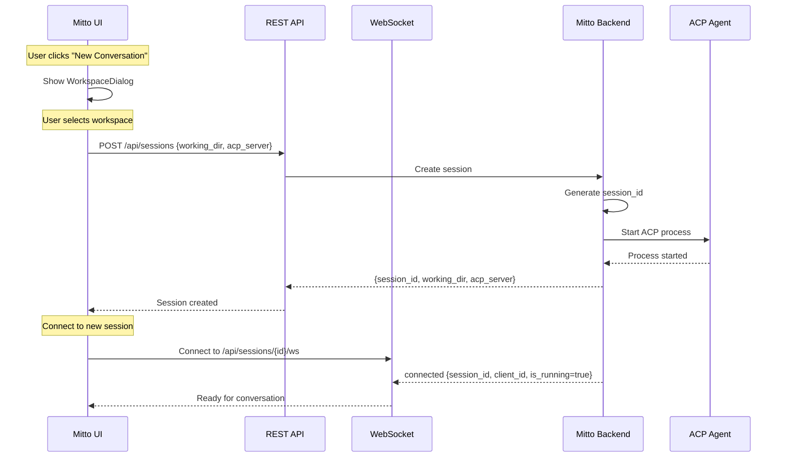
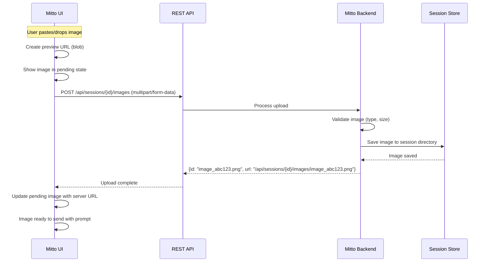
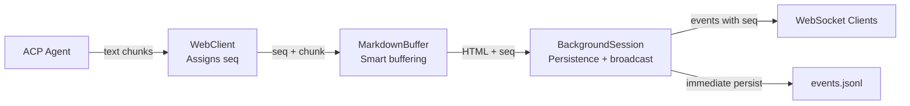
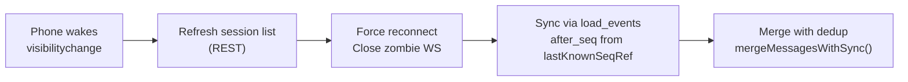

# Web Interface

The web interface provides a browser-based UI for ACP communication, accessible via `mitto web`.

## Architecture Overview

```mermaid
graph TB
    subgraph "Browser"
        UI[Preact UI]
        EVENTS_WS[Events WebSocket<br/>/api/events]
        SESSION_WS[Session WebSocket<br/>/api/sessions/{id}/ws]
    end

    subgraph "Mitto Web Server"
        HTTP[HTTP Server]
        EVENTS_MGR[GlobalEventsManager]
        SESSION_WSC[SessionWSClient]
        BG_SESSION[BackgroundSession]
        MD_BUF[Markdown Buffer]
        WEB_CLIENT[Web ACP Client]
    end

    subgraph "ACP Server"
        AGENT[AI Agent]
    end

    UI <--> EVENTS_WS
    UI <--> SESSION_WS
    EVENTS_WS <-->|lifecycle events| EVENTS_MGR
    SESSION_WS <-->|session events| SESSION_WSC
    HTTP -->|Static Files| UI
    SESSION_WSC -.->|observes| BG_SESSION
    BG_SESSION --> WEB_CLIENT
    WEB_CLIENT <-->|stdin/stdout| AGENT
    WEB_CLIENT -->|chunks| MD_BUF
    MD_BUF -->|HTML| BG_SESSION
```

## REST API Endpoints

The web interface uses REST APIs for session management and configuration:

| Endpoint                          | Method | Purpose                                    |
| --------------------------------- | ------ | ------------------------------------------ |
| `/api/sessions`                   | GET    | List all sessions                          |
| `/api/sessions`                   | POST   | Create new session                         |
| `/api/sessions/{id}`              | DELETE | Delete a session                           |
| `/api/sessions/{id}/events`       | GET    | Load session events (deprecated, use WS)   |
| `/api/sessions/{id}/images`       | POST   | Upload image for session                   |
| `/api/sessions/{id}/images/paths` | POST   | Upload images from file paths (native app) |
| `/api/workspaces`                 | GET    | List workspaces and ACP servers            |
| `/api/workspaces`                 | POST   | Add a new workspace                        |
| `/api/workspaces`                 | DELETE | Remove a workspace                         |
| `/api/config`                     | GET    | Get server configuration                   |
| `/api/queue/{session_id}`         | GET    | Get message queue for session              |
| `/api/queue/{session_id}`         | POST   | Add message to queue                       |
| `/api/queue/{session_id}/{id}`    | DELETE | Remove message from queue                  |

### Callback Endpoints

| Endpoint                              | Method | Auth                   | Description                    |
| ------------------------------------- | ------ | ---------------------- | ------------------------------ |
| `{prefix}/api/callback/{token}`       | POST   | Token (capability URL) | Trigger periodic prompt run    |
| `{prefix}/api/sessions/{id}/callback` | GET    | Session auth           | Get callback status            |
| `{prefix}/api/sessions/{id}/callback` | POST   | Session auth           | Generate/rotate callback token |
| `{prefix}/api/sessions/{id}/callback` | DELETE | Session auth           | Revoke callback token          |

### Session Metadata Fields

The `/api/sessions` endpoint returns an array of session objects with the following key fields:

| Field               | Type      | Description                                                          |
| ------------------- | --------- | -------------------------------------------------------------------- |
| `session_id`        | string    | Unique session identifier                                            |
| `name`              | string    | User-friendly session name (auto-generated or user-set)              |
| `acp_server`        | string    | ACP server name used for this session                                |
| `working_dir`       | string    | Workspace directory path                                             |
| `created_at`        | timestamp | Session creation time                                                |
| `updated_at`        | timestamp | Last activity time                                                   |
| `status`            | string    | Session status (active, idle, error)                                 |
| `archived`          | boolean   | Whether session is archived                                          |
| `parent_session_id` | string    | Parent session ID (if created via `mitto_conversation_new` MCP tool) |
| `periodic_enabled`  | boolean   | Whether periodic execution is configured                             |

#### Parent-Child Relationships

Sessions can have parent-child relationships when created via the `mitto_conversation_new` MCP tool:

- **Parent Session**: A session that spawns child sessions (no `parent_session_id`)
- **Child Session**: A session created by another session (has `parent_session_id` set)

**Use Cases**:

- Delegating subtasks to parallel agents
- Running background analysis while main conversation continues
- Preventing infinite recursion (children cannot spawn more children)

### Session Creation Flow


```mermaid
sequenceDiagram
    participant UI as Mitto UI
    participant REST as REST API
    participant WS as WebSocket
    participant Backend as Mitto Backend
    participant ACP as ACP Agent

    Note over UI: User clicks "New Conversation"
    UI->>UI: Show WorkspaceDialog

    Note over UI: User selects workspace
    UI->>REST: POST /api/sessions {working_dir, acp_server}
    REST->>Backend: Create session
    Backend->>Backend: Generate session_id
    Backend->>ACP: Start ACP process
    ACP-->>Backend: Process started
    Backend-->>REST: {session_id, working_dir, acp_server}
    REST-->>UI: Session created

    Note over UI: Connect to new session
    UI->>WS: Connect to /api/sessions/{id}/ws
    Backend-->>WS: connected {session_id, client_id, is_running=true}
    WS-->>UI: Ready for conversation
```

### Image Upload Flow


```mermaid
sequenceDiagram
    participant UI as Mitto UI
    participant REST as REST API
    participant Backend as Mitto Backend
    participant Store as Session Store

    Note over UI: User pastes/drops image
    UI->>UI: Create preview URL (blob)
    UI->>UI: Show image in pending state

    UI->>REST: POST /api/sessions/{id}/images (multipart/form-data)
    REST->>Backend: Process upload
    Backend->>Backend: Validate image (type, size)
    Backend->>Store: Save image to session directory
    Store-->>Backend: Image saved
    Backend-->>REST: {id: "image_abc123.png", url: "/api/sessions/{id}/images/image_abc123.png"}
    REST-->>UI: Upload complete

    UI->>UI: Update pending image with server URL
    UI->>UI: Image ready to send with prompt
```

## WebSocket Communication

> **📖 Complete reference:** See [WebSocket Documentation](websockets/) for the authoritative
> protocol specification, message types, sequence numbers, synchronization, and communication flows.

The web interface uses two WebSocket endpoints:

| Endpoint                | Handler              | Purpose                                               |
| ----------------------- | -------------------- | ----------------------------------------------------- |
| `/api/events`           | `GlobalEventsClient` | Session lifecycle events (created, deleted, renamed)  |
| `/api/sessions/{id}/ws` | `SessionWSClient`    | Per-session communication (prompts, responses, tools) |

This separation allows global events to be broadcast to all connected clients while per-session
events are scoped to interested clients only.

## Streaming Response Handling

The ACP agent sends responses as text chunks via `SessionUpdate` callbacks. The web interface
maintains real-time streaming while converting Markdown to HTML:


```mermaid
flowchart LR
    ACP["ACP Agent"] -->|"text chunks"| WC["WebClient<br/>Assigns seq"]
    WC -->|"seq + chunk"| MD["MarkdownBuffer<br/>Smart buffering"]
    MD -->|"HTML + seq"| BS["BackgroundSession<br/>Persistence + broadcast"]
    BS -->|"events with seq"| WS["WebSocket Clients"]
    BS -->|"immediate persist"| STORE["events.jsonl"]
```

1. **Chunk Reception**: `WebClient.SessionUpdate()` receives `AgentMessageChunk` events
2. **Sequence Assignment**: `WebClient` obtains `seq` from `SeqProvider` immediately at receive time
3. **Smart Buffering**: `MarkdownBuffer` accumulates chunks with their `seq` until semantic boundaries
4. **HTML Conversion**: Goldmark converts buffered Markdown to HTML
5. **WebSocket Delivery**: HTML chunks sent with preserved `seq` to browser
6. **Frontend Rendering**: Preact renders HTML via `dangerouslySetInnerHTML`, sorted by `seq`

For details on sequence number assignment and ordering guarantees, see
[Sequence Numbers](websockets/sequence-numbers.md).

### Markdown Buffer Strategy

The `MarkdownBuffer` balances real-time streaming with correct Markdown rendering:

| Flush Trigger   | Condition       | Rationale                       |
| --------------- | --------------- | ------------------------------- |
| Line complete   | `\n` received   | Most content is line-based      |
| Code block end  | Closing ```     | Don't break syntax highlighting |
| Paragraph break | `\n\n`          | Natural semantic boundary       |
| Timeout         | 200ms idle      | Ensure eventual delivery        |
| Buffer limit    | 4KB accumulated | Prevent memory issues           |

The buffer also tracks `pendingSeq` — the sequence number from the first chunk of buffered
content. When the buffer flushes, this seq is passed to the callback, ensuring correct ordering
even after buffering delays.

## Frontend Technology

The frontend uses a CDN-first approach for zero build complexity:

| Library           | Purpose                       | Size    |
| ----------------- | ----------------------------- | ------- |
| Preact            | UI framework                  | ~3KB    |
| HTM               | JSX-like syntax without build | ~1KB    |
| Tailwind Play CDN | Styling                       | Runtime |

All assets are embedded in the Go binary via `go:embed`, enabling single-binary distribution.

## Component Structure

```
App
├── SessionList (sidebar — unified daisyUI `menu` tree)
│   ├── Folder groups (by working_dir; nested children; per-folder Archived subgroup + Tasks node)
│   ├── Static nodes (Dashboard, per-folder Tasks)
│   └── SessionItem (per-row three-dot menu → ContextMenu)
├── Header (connection status, streaming indicator)
├── MessageList
│   ├── Message (user - plain text, blue bubble)
│   ├── Message (agent - HTML/Markdown, gray bubble)
│   ├── Message (thought - italic, purple accent)
│   ├── Message (tool - centered status badge)
│   ├── Message (error - red accent)
│   └── Message (system - centered, subtle)
├── ChatInput (textarea + send/cancel button)
├── WorkspaceDialog (workspace selection for new sessions)
├── WorkspaceConfigDialog (view/add/remove workspaces)
└── SessionPropertiesDialog (rename session, view workspace info)
```

## Sidebar: Unified Conversation Tree

The sidebar renders all conversations as a single hierarchical daisyUI `menu`
tree (`SessionList` → `SessionItem`), replacing the former three tabs
(Conversations / Periodic / Archived) and the group-by toggle.

- **Folders** group conversations by working directory (resolved to the root
  parent for nested children). Child conversations nest under their parent.
- Each folder has an **Archived** subgroup (collapsed by default) and a static
  **Tasks** node (opens the beads view for that folder).
- A static **Dashboard** node clears the active conversation.
- **Category filter** (sidebar header dropdown): show/hide Regular, Periodic,
  Archived, and Tasks. Persisted per-device in `sessionStorage`.
- Each row exposes an always-visible **three-dot (ellipsis) menu** that opens the
  shared `ContextMenu` (rename, pin, archive, delete, prompt groups…).
- **Expansion state** is persisted in `localStorage`
  (`mitto_conversation_expanded_groups`) and synced to the server via UI
  preferences. Keys are unscoped: a folder's `working_dir`,
  `archived:<folderKey>`, and `parent:<id>`.
- **Keyboard (⌘-[ / ⌘-]) and swipe** navigation traverse the flattened tree in
  visual order, skipping static nodes and respecting the category filter; the
  target's folder/archived/parent auto-expands and scrolls into view.

> Conversations are categorized by `getFilterTabForSession` (regular / periodic /
> archived). Periodic prompts are configured per-conversation (ChatInput /
> SessionPanel), not via a creation tab. Startup restores the single last-active
> conversation regardless of category (falling back to the most recent overall).

## Responsive Design

- **Desktop (≥768px)**: Sidebar always visible, main chat area
- **Mobile (<768px)**: Sidebar hidden, hamburger menu to open overlay
- **Touch support**: Tap to open/close sidebar on mobile

## Mobile Wake Resync

Mobile browsers (iOS Safari, Android Chrome) suspend WebSocket connections when the device
sleeps. The frontend detects this and automatically recovers.

> **📖 Full details:** See [Synchronization — Mobile Wake Resync](websockets/synchronization.md)
> for the complete sync flow, keepalive mechanism, and zombie connection detection.

### Problem Scenario

1. User opens Mitto on phone, views a conversation
2. Phone goes to sleep (screen off)
3. WebSocket connection is terminated by the browser (or becomes a zombie)
4. Agent continues processing in the background (server-side)
5. User wakes phone — UI shows stale messages

### Solution Summary


```mermaid
flowchart LR
    WAKE["Phone wakes<br/>visibilitychange"] --> REFRESH["Refresh session list<br/>(REST)"]
    REFRESH --> RECONNECT["Force reconnect<br/>Close zombie WS"]
    RECONNECT --> SYNC["Sync via load_events<br/>after_seq from lastKnownSeqRef"]
    SYNC --> MERGE["Merge with dedup<br/>mergeMessagesWithSync()"]
```

- **Sequence tracking via `lastKnownSeqRef`** (not localStorage or React state alone)
- **Three-tier deduplication**: Server-side `lastSentSeq` + client-side seq tracker + content merge
- **Server authority**: When client and server disagree, the server always wins

---

## webview.log Staleness While App Hidden (macOS — Expected)

When auditing logs for the macOS app (`cmd/mitto-app`, a WKWebView host), `webview.log` frequently shows long stretches with no new output while `mitto.log` and `access.log` continue to advance. This is **expected behavior**, not a logging defect.

### Symptom

`webview.log` (WKWebView JS console output bridged to a native file) stops advancing for minutes or hours, creating apparent gaps in frontend observability. Backend logs keep flowing normally during the same window.

### Root Cause (Confirmed)

When the macOS app is hidden or backgrounded, WKWebView throttles and then fully suspends JS execution — including timers and `console.*` emission. The native console→file bridge receives nothing to write, so `webview.log` stops advancing. The suspension follows a two-phase pattern:

- **Throttle phase** (~2–3 min): output trickles after the `"App hidden, tracking time"` log marker
- **Suspend phase**: output stops entirely; console output produced while suspended is **dropped, not buffered**

### Recovery

Resumption is marked by the line:

```
[macOS] App became active, triggering staggered reconnect and sync
```

Logging restarts on activation. Sync recovers via seq-aligned `load_events`, with no data loss and no zombie sessions. Overnight or multi-hour gaps are simply long hidden/sleep periods.

### Guidance for Log Audits

Treat `webview.log` staleness during hidden periods as expected. To distinguish expected gaps from genuine defects:

- **Expected**: staleness is preceded by `"App hidden, tracking time"` and followed by `"App became active, triggering staggered reconnect and sync"`
- **Genuine defect**: staleness occurs **without** a preceding `"App hidden"` marker, or while the app is demonstrably active in the foreground

### Cross-References

- `.augment/rules/09-macos-app.md` — native WKWebView bridge and console capture
- `.augment/rules/23-web-frontend-mobile.md` — visibility change handling, wake resync
- `websockets/synchronization.md` — seq-aligned `load_events` and reconnection flow
