# WebSocket Message Handling Architecture

This document covers the WebSocket message handling system, including how message order is guaranteed, how clients resync after disconnection, and how reconnections are managed.

## Message Ordering

Message ordering is critical for ensuring all clients display conversations correctly. The system uses a **unified event buffer** to preserve streaming order and **sequence numbers** for tracking.

### Unified Event Buffer

All streaming events (agent messages, thoughts, tool calls, file operations) are buffered in a single `EventBuffer` during a prompt. Events are stored in the order they arrive and persisted together when the prompt completes.

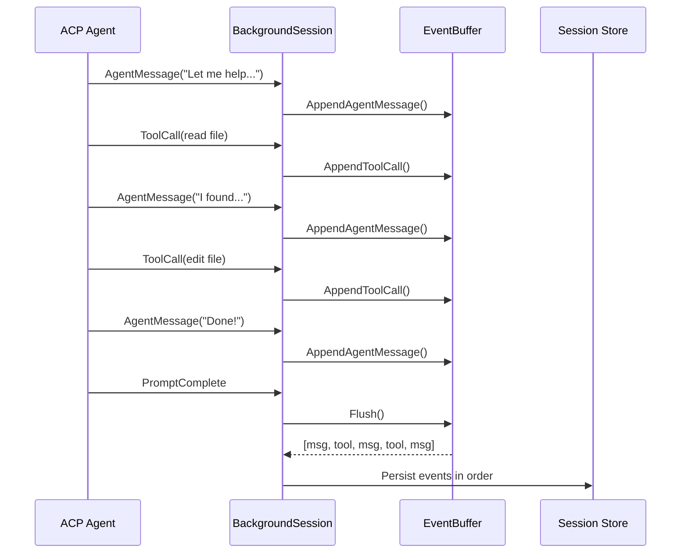
```mermaid
sequenceDiagram
    participant Agent as ACP Agent
    participant BS as BackgroundSession
    participant Buffer as EventBuffer
    participant Store as Session Store

    Agent->>BS: AgentMessage("Let me help...")
    BS->>Buffer: AppendAgentMessage()

    Agent->>BS: ToolCall(read file)
    BS->>Buffer: AppendToolCall()

    Agent->>BS: AgentMessage("I found...")
    BS->>Buffer: AppendAgentMessage()

    Agent->>BS: ToolCall(edit file)
    BS->>Buffer: AppendToolCall()

    Agent->>BS: AgentMessage("Done!")
    BS->>Buffer: AppendAgentMessage()

    Agent->>BS: PromptComplete
    BS->>Buffer: Flush()
    Buffer-->>BS: [msg, tool, msg, tool, msg]
    BS->>Store: Persist events in order
```

This ensures events are persisted in the correct streaming order, preserving the interleaving of agent messages and tool calls.

### Sequence Number Assignment

Every event is assigned a monotonically increasing sequence number (`seq`) **when it is received from the ACP**, not at persistence time or when content is emitted from buffers. This ensures streaming and persisted events have the same `seq`, enabling proper deduplication and ordering across WebSocket reconnections.

**Key properties:**

- `seq` starts at 1 for each session
- `seq` is assigned immediately when the event is received from ACP (in `WebClient.SessionUpdate()`)
- `seq` is passed through the `MarkdownBuffer` for agent messages (preserving receive-time ordering)
- `seq` is included in WebSocket messages to observers
- `seq` is preserved when events are persisted to `events.jsonl`
- `seq` is never reused or reassigned
- For coalescing events (agent messages, thoughts), multiple chunks share the same `seq`

**Architecture: SeqProvider Interface**

The `WebClient` uses a `SeqProvider` interface to obtain sequence numbers. `BackgroundSession` implements this interface:

```go
// SeqProvider provides sequence numbers for event ordering.
type SeqProvider interface {
    GetNextSeq() int64
}

// BackgroundSession implements SeqProvider
func (bs *BackgroundSession) GetNextSeq() int64 {
    return bs.getNextSeq()
}
```

This decoupling allows `WebClient` to assign seq at ACP receive time while `BackgroundSession` manages the sequence counter.

**Sequence number flow:**

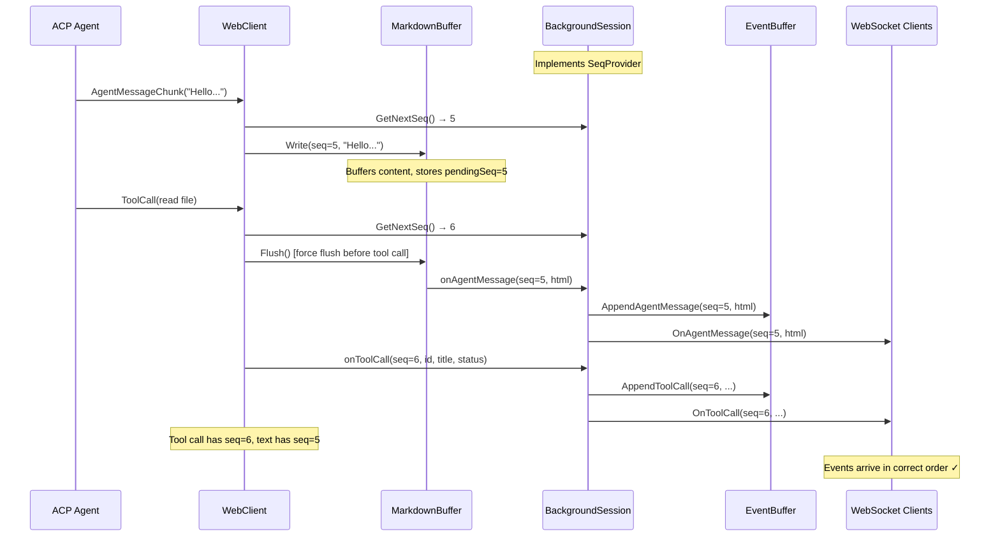
```mermaid
sequenceDiagram
    participant ACP as ACP Agent
    participant WC as WebClient
    participant MD as MarkdownBuffer
    participant BS as BackgroundSession
    participant Buffer as EventBuffer
    participant WS as WebSocket Clients

    Note over BS: Implements SeqProvider

    ACP->>WC: AgentMessageChunk("Hello...")
    WC->>BS: GetNextSeq() → 5
    WC->>MD: Write(seq=5, "Hello...")
    Note over MD: Buffers content, stores pendingSeq=5

    ACP->>WC: ToolCall(read file)
    WC->>BS: GetNextSeq() → 6
    WC->>MD: Flush() [force flush before tool call]
    MD->>BS: onAgentMessage(seq=5, html)
    BS->>Buffer: AppendAgentMessage(seq=5, html)
    BS->>WS: OnAgentMessage(seq=5, html)
    WC->>BS: onToolCall(seq=6, id, title, status)
    BS->>Buffer: AppendToolCall(seq=6, ...)
    BS->>WS: OnToolCall(seq=6, ...)

    Note over WC: Tool call has seq=6, text has seq=5
    Note over WS: Events arrive in correct order ✓
```

**Why assign seq at receive time (not emit time)?**

1. **Correct ordering with buffered content**: Agent messages are buffered in `MarkdownBuffer` for markdown rendering. If seq were assigned when the buffer flushes, tool calls could "leapfrog" text that was received earlier but buffered.

2. **Streaming and sync use same seq**: Clients can deduplicate by `(session_id, seq)`

3. **Correct ordering after reconnect**: Sort by `seq` gives correct order

4. **No race conditions**: Seq is assigned once, upfront, before any buffering or notification

**MarkdownBuffer and Seq Tracking**

The `MarkdownBuffer` tracks the sequence number for buffered content:

```go
// Write accepts seq when content is received
func (mb *MarkdownBuffer) Write(seq int64, chunk string) {
    // First chunk's seq becomes pendingSeq
    if mb.buffer.Len() == 0 {
        mb.pendingSeq = seq
    }
    // ... buffer content ...
}

// Flush passes the preserved seq to callback
func (mb *MarkdownBuffer) flushLocked() {
    seq := mb.pendingSeq  // Capture before reset
    mb.pendingSeq = 0
    // ... convert to HTML ...
    mb.onFlush(seq, htmlStr)
}
```

This ensures that even if multiple text chunks are buffered together, the seq from the first chunk is preserved and used when the content is eventually flushed.

### Frontend Ordering Strategy

The frontend preserves message order using these principles:

1. **Streaming messages** include `seq` and are displayed in arrival order
2. **Loaded sessions** use the order from `events.jsonl` (which preserves streaming order)
3. **Sync messages** are merged with existing messages and sorted by `seq`
4. **Deduplication** uses `seq` (preferred) or content hash (fallback)

## Sequence Number Contract

This section formalizes the sequence number contract between the backend and frontend. Adhering to this contract is critical for correct message ordering, deduplication, and reconnection sync.

### Contract Summary

| Property            | Guarantee                                                                 |
| ------------------- | ------------------------------------------------------------------------- |
| **Uniqueness**      | Each event in a session has a unique `seq` (except coalescing chunks)     |
| **Monotonicity**    | `seq` values are strictly increasing within a session                     |
| **Assignment Time** | `seq` is assigned when the event is received from ACP, not at persistence |
| **Persistence**     | `seq` is preserved when events are written to `events.jsonl`              |
| **Coalescing**      | Multiple chunks of the same logical message share the same `seq`          |
| **No Gaps**         | `seq` values are contiguous (1, 2, 3, ...) with no gaps                   |
| **No Reuse**        | Once assigned, a `seq` is never reused or reassigned                      |

### Backend Responsibilities

1. **Assign seq at receive time**: The `WebClient.SessionUpdate()` method assigns `seq` immediately when an event is received from ACP, before any buffering or processing.

2. **Preserve seq through buffers**: The `MarkdownBuffer` stores `pendingSeq` from the first chunk and passes it to the flush callback.

3. **Track lastSentSeq per client**: Each `SessionWSClient` tracks the highest `seq` sent to prevent duplicates:

   ```go
   type SessionWSClient struct {
       lastSentSeq int64      // Highest seq sent to this client
       seqMu       sync.Mutex // Protects lastSentSeq
   }
   ```

4. **Sync missed events on observer registration**: When a client is registered as an observer after loading events, the server checks for events that were persisted between the load and registration (H2 fix).

5. **Replay buffered events with dedup**: When a client connects mid-stream, buffered events are replayed with `seq > lastSentSeq` check to prevent duplicates.

6. **Persist events with seq**: Events are written to `events.jsonl` with their assigned `seq` values preserved.

### Frontend Responsibilities

1. **Update lastSeenSeq immediately during streaming**: The frontend updates `lastSeenSeq` in localStorage when streaming events arrive, not just at `prompt_complete` (H1 fix):

   ```javascript
   // Called for agent_message, agent_thought, tool_call, user_prompt
   function updateLastSeenSeqIfHigher(sessionId, seq) {
     if (!seq || seq <= 0) return;
     const currentSeq = getLastSeenSeq(sessionId);
     if (seq > currentSeq) {
       setLastSeenSeq(sessionId, seq);
     }
   }
   ```

2. **Client-side deduplication by seq**: The frontend tracks seen `seq` values and skips duplicates (M1 fix):

   ```javascript
   // Track seen seqs per session
   const seenSeqsRef = useRef({});
   // { sessionId: { highestSeq: number, recentSeqs: Set<number> } }

   // Check before processing an event
   if (isSeqDuplicate(sessionId, msgSeq, lastMessageSeq)) {
     return; // Skip duplicate
   }

   // Mark as seen after processing
   markSeqSeen(sessionId, msgSeq);
   ```

3. **Allow same-seq for coalescing**: When checking for duplicates, allow the same `seq` as the last message (for streaming continuation):

   ```javascript
   // Allow same seq as last message (coalescing/continuation)
   if (lastMessageSeq && seq === lastMessageSeq) return false;
   ```

4. **Request sync with lastSeenSeq**: On reconnection, request events after the stored `lastSeenSeq`:

   ```javascript
   ws.send(
     JSON.stringify({
       type: "load_events",
       data: { after_seq: lastSeenSeq },
     }),
   );
   ```

5. **Merge with deduplication on sync**: Use `mergeMessagesWithSync()` to handle overlapping events after reconnection.

### Sequence Number Flow Diagram

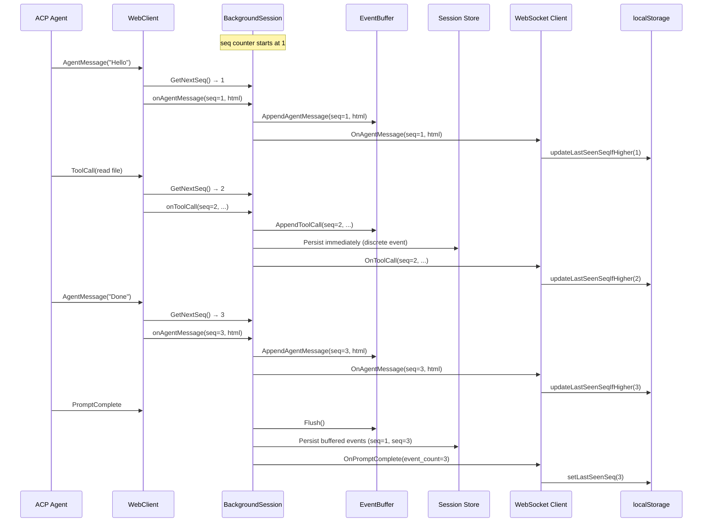
```mermaid
sequenceDiagram
    participant ACP as ACP Agent
    participant WC as WebClient
    participant BS as BackgroundSession
    participant Buffer as EventBuffer
    participant Store as Session Store
    participant WS as WebSocket Client
    participant LS as localStorage

    Note over BS: seq counter starts at 1

    ACP->>WC: AgentMessage("Hello")
    WC->>BS: GetNextSeq() → 1
    WC->>BS: onAgentMessage(seq=1, html)
    BS->>Buffer: AppendAgentMessage(seq=1, html)
    BS->>WS: OnAgentMessage(seq=1, html)
    WS->>LS: updateLastSeenSeqIfHigher(1)

    ACP->>WC: ToolCall(read file)
    WC->>BS: GetNextSeq() → 2
    WC->>BS: onToolCall(seq=2, ...)
    BS->>Buffer: AppendToolCall(seq=2, ...)
    BS->>Store: Persist immediately (discrete event)
    BS->>WS: OnToolCall(seq=2, ...)
    WS->>LS: updateLastSeenSeqIfHigher(2)

    ACP->>WC: AgentMessage("Done")
    WC->>BS: GetNextSeq() → 3
    WC->>BS: onAgentMessage(seq=3, html)
    BS->>Buffer: AppendAgentMessage(seq=3, html)
    BS->>WS: OnAgentMessage(seq=3, html)
    WS->>LS: updateLastSeenSeqIfHigher(3)

    ACP->>WC: PromptComplete
    BS->>Buffer: Flush()
    BS->>Store: Persist buffered events (seq=1, seq=3)
    BS->>WS: OnPromptComplete(event_count=3)
    WS->>LS: setLastSeenSeq(3)
```

### Edge Cases and Fixes

#### H1: Stale lastSeenSeq During Streaming

**Problem**: If the client disconnects during streaming (before `prompt_complete`), the `lastSeenSeq` in localStorage was stale because it was only updated at `prompt_complete`.

**Fix**: Update `lastSeenSeq` immediately when streaming events arrive:

- `agent_message` → update lastSeenSeq
- `agent_thought` → update lastSeenSeq
- `tool_call` → update lastSeenSeq
- `user_prompt` → update lastSeenSeq

#### H2: Observer Registration Race

**Problem**: Events could be missed between loading events from storage and being registered as an observer.

**Fix**: After registering as an observer, the server checks for events that were persisted between the load and registration, and sends them to the client.

```go
// After adding client as observer
if lastSeq > 0 {
    c.syncMissedEventsDuringRegistration(lastSeq)
}
```

#### M1: Client-Side Deduplication

**Problem**: Despite server-side deduplication, edge cases could still result in duplicate events reaching the frontend.

**Fix**: The frontend tracks seen `seq` values in a sliding window and skips duplicates:

- Track `{ highestSeq, recentSeqs: Set }` per session
- Check `isSeqDuplicate()` before processing events
- Allow same-seq for coalescing (streaming continuation)
- Mark seq as seen after processing
- Prune old seqs to prevent unbounded memory growth

### Testing the Contract

The following tests verify the sequence number contract:

1. **`TestEventBuffer_OutOfOrderSeqPreserved`**: Verifies that out-of-order events preserve their assigned seq values.

2. **`TestEventBuffer_CoalescingPreservesFirstSeq`**: Verifies that coalescing preserves the first chunk's seq.

3. **`TestReconnectDuringAgentStreaming`**: Verifies that reconnection during streaming correctly syncs missed events.

4. **`TestStaleSeqSync`**: Verifies that syncing with a stale seq correctly retrieves missed events.

5. **`TestMultipleClientsSeeSameEvents`**: Verifies that multiple clients receive the same events with the same seq values.

## Message Format

All WebSocket messages use a JSON envelope format with `type` and optional `data` fields.

### Frontend → Backend Messages

| Type                | Data                                | Description                                      |
| ------------------- | ----------------------------------- | ------------------------------------------------ |
| `prompt`            | `{message, image_ids?, prompt_id}`  | Send user message to agent                       |
| `cancel`            | `{}`                                | Cancel current agent operation                   |
| `permission_answer` | `{request_id, approved}`            | Respond to permission request                    |
| `load_events`       | `{limit?, before_seq?, after_seq?}` | Load events (initial, pagination, or sync)       |
| `sync_session`      | `{after_seq}`                       | (DEPRECATED) Request events after seq            |
| `keepalive`         | `{client_time}`                     | Application-level keepalive for zombie detection |
| `rename_session`    | `{name}`                            | Rename the current session                       |

### Backend → Frontend Messages

| Type              | Data                                                                          | Description                                  |
| ----------------- | ----------------------------------------------------------------------------- | -------------------------------------------- |
| `connected`       | `{session_id, client_id, acp_server, is_running}`                             | Connection established                       |
| `prompt_received` | `{prompt_id}`                                                                 | ACK that prompt was received and persisted   |
| `user_prompt`     | `{seq, sender_id, prompt_id, message, is_mine}`                               | Broadcast of user prompt to all clients      |
| `agent_message`   | `{seq, html, is_prompting}`                                                   | HTML-rendered agent response chunk           |
| `agent_thought`   | `{seq, text, is_prompting}`                                                   | Agent thinking/reasoning (plain text)        |
| `tool_call`       | `{seq, id, title, status, is_prompting}`                                      | Tool invocation notification                 |
| `tool_update`     | `{seq, id, status, is_prompting}`                                             | Tool status update                           |
| `permission`      | `{request_id, title, description, options}`                                   | Permission request                           |
| `prompt_complete` | `{event_count}`                                                               | Agent finished responding                    |
| `events_loaded`   | `{events, has_more, first_seq, last_seq, total_count, prepend, is_prompting}` | Response to load_events request              |
| `session_sync`    | `{events, event_count, is_running, is_prompting}`                             | (DEPRECATED) Response to sync_session        |
| `keepalive_ack`   | `{client_time, server_time}`                                                  | Response to keepalive (for zombie detection) |
| `error`           | `{message, code?}`                                                            | Error notification                           |

**Note on `seq`**: All event messages (`user_prompt`, `agent_message`, `agent_thought`, `tool_call`, `tool_update`) include a sequence number for ordering and deduplication. Multiple chunks of the same logical message (e.g., streaming agent message) share the same `seq`.

## Communication Flows

This section documents the complete communication flows between the Mitto UI (frontend) and backend, covering both the golden path (happy path) and various corner cases.

### Golden Path: Complete Conversation Flow

This diagram shows a complete successful interaction from session connection through agent response:

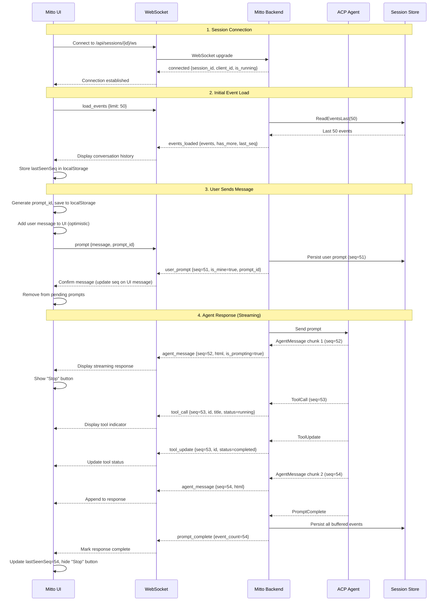
```mermaid
sequenceDiagram
    participant UI as Mitto UI
    participant WS as WebSocket
    participant Backend as Mitto Backend
    participant ACP as ACP Agent
    participant Store as Session Store

    Note over UI,Store: 1. Session Connection
    UI->>WS: Connect to /api/sessions/{id}/ws
    WS->>Backend: WebSocket upgrade
    Backend-->>WS: connected {session_id, client_id, is_running}
    WS-->>UI: Connection established

    Note over UI,Store: 2. Initial Event Load
    UI->>WS: load_events {limit: 50}
    Backend->>Store: ReadEventsLast(50)
    Store-->>Backend: Last 50 events
    Backend-->>WS: events_loaded {events, has_more, last_seq}
    WS-->>UI: Display conversation history
    UI->>UI: Store lastSeenSeq in localStorage

    Note over UI,Store: 3. User Sends Message
    UI->>UI: Generate prompt_id, save to localStorage
    UI->>UI: Add user message to UI (optimistic)
    UI->>WS: prompt {message, prompt_id}
    Backend->>Store: Persist user prompt (seq=51)
    Backend-->>WS: user_prompt {seq=51, is_mine=true, prompt_id}
    WS-->>UI: Confirm message (update seq on UI message)
    UI->>UI: Remove from pending prompts

    Note over UI,Store: 4. Agent Response (Streaming)
    Backend->>ACP: Send prompt
    ACP-->>Backend: AgentMessage chunk 1 (seq=52)
    Backend-->>WS: agent_message {seq=52, html, is_prompting=true}
    WS-->>UI: Display streaming response
    UI->>UI: Show "Stop" button

    ACP-->>Backend: ToolCall (seq=53)
    Backend-->>WS: tool_call {seq=53, id, title, status=running}
    WS-->>UI: Display tool indicator

    ACP-->>Backend: ToolUpdate
    Backend-->>WS: tool_update {seq=53, id, status=completed}
    WS-->>UI: Update tool status

    ACP-->>Backend: AgentMessage chunk 2 (seq=54)
    Backend-->>WS: agent_message {seq=54, html}
    WS-->>UI: Append to response

    ACP-->>Backend: PromptComplete
    Backend->>Store: Persist all buffered events
    Backend-->>WS: prompt_complete {event_count=54}
    WS-->>UI: Mark response complete
    UI->>UI: Update lastSeenSeq=54, hide "Stop" button
```

### Golden Path: Permission Request Flow

When the agent needs user permission for an action:

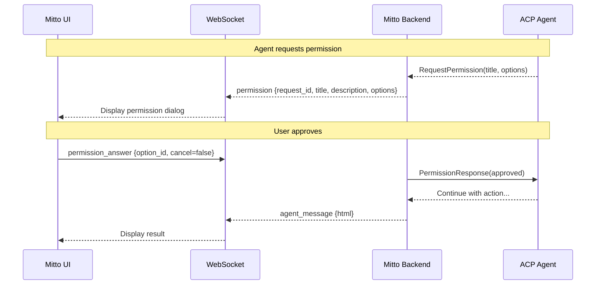
```mermaid
sequenceDiagram
    participant UI as Mitto UI
    participant WS as WebSocket
    participant Backend as Mitto Backend
    participant ACP as ACP Agent

    Note over UI,ACP: Agent requests permission
    ACP-->>Backend: RequestPermission(title, options)
    Backend-->>WS: permission {request_id, title, description, options}
    WS-->>UI: Display permission dialog

    Note over UI,ACP: User approves
    UI->>WS: permission_answer {option_id, cancel=false}
    Backend->>ACP: PermissionResponse(approved)
    ACP-->>Backend: Continue with action...
    Backend-->>WS: agent_message {html}
    WS-->>UI: Display result
```

### Corner Case: Mobile Phone Sleep/Wake

When the phone sleeps and wakes, the WebSocket may be dead but appear open:

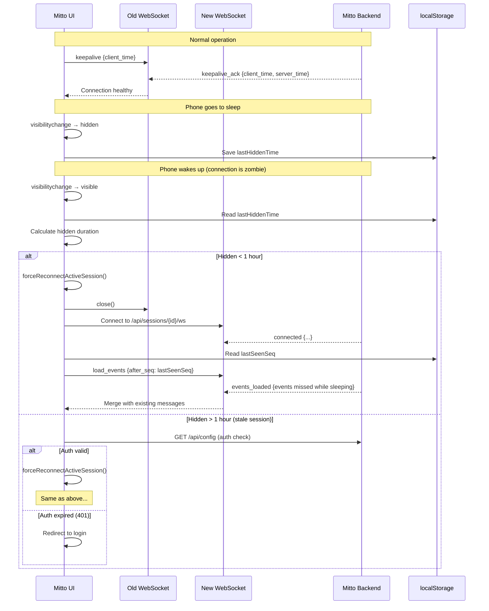
```mermaid
sequenceDiagram
    participant UI as Mitto UI
    participant OldWS as Old WebSocket
    participant NewWS as New WebSocket
    participant Backend as Mitto Backend
    participant Storage as localStorage

    Note over UI,Backend: Normal operation
    UI->>OldWS: keepalive {client_time}
    Backend-->>OldWS: keepalive_ack {client_time, server_time}
    OldWS-->>UI: Connection healthy

    Note over UI,Backend: Phone goes to sleep
    UI->>UI: visibilitychange → hidden
    UI->>Storage: Save lastHiddenTime

    Note over UI,Backend: Phone wakes up (connection is zombie)
    UI->>UI: visibilitychange → visible
    UI->>Storage: Read lastHiddenTime
    UI->>UI: Calculate hidden duration

    alt Hidden < 1 hour
        UI->>UI: forceReconnectActiveSession()
        UI->>OldWS: close()
        UI->>NewWS: Connect to /api/sessions/{id}/ws
        Backend-->>NewWS: connected {...}
        UI->>Storage: Read lastSeenSeq
        UI->>NewWS: load_events {after_seq: lastSeenSeq}
        Backend-->>NewWS: events_loaded {events missed while sleeping}
        NewWS-->>UI: Merge with existing messages
    else Hidden > 1 hour (stale session)
        UI->>Backend: GET /api/config (auth check)
        alt Auth valid
            UI->>UI: forceReconnectActiveSession()
            Note over UI: Same as above...
        else Auth expired (401)
            UI->>UI: Redirect to login
        end
    end
```

### Corner Case: Send Message During Zombie Connection

When user tries to send a message but the connection is actually dead:

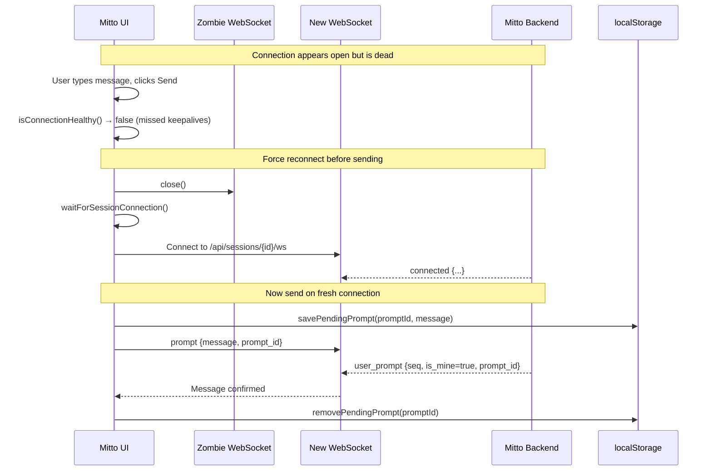
```mermaid
sequenceDiagram
    participant UI as Mitto UI
    participant ZombieWS as Zombie WebSocket
    participant NewWS as New WebSocket
    participant Backend as Mitto Backend
    participant Storage as localStorage

    Note over UI,Backend: Connection appears open but is dead
    UI->>UI: User types message, clicks Send
    UI->>UI: isConnectionHealthy() → false (missed keepalives)

    Note over UI,Backend: Force reconnect before sending
    UI->>ZombieWS: close()
    UI->>UI: waitForSessionConnection()
    UI->>NewWS: Connect to /api/sessions/{id}/ws
    Backend-->>NewWS: connected {...}

    Note over UI,Backend: Now send on fresh connection
    UI->>Storage: savePendingPrompt(promptId, message)
    UI->>NewWS: prompt {message, prompt_id}
    Backend-->>NewWS: user_prompt {seq, is_mine=true, prompt_id}
    NewWS-->>UI: Message confirmed
    UI->>Storage: removePendingPrompt(promptId)
```

### Corner Case: Send Timeout with Uncertain Delivery

When the ACK doesn't arrive within the timeout period (15s desktop, 30s mobile):

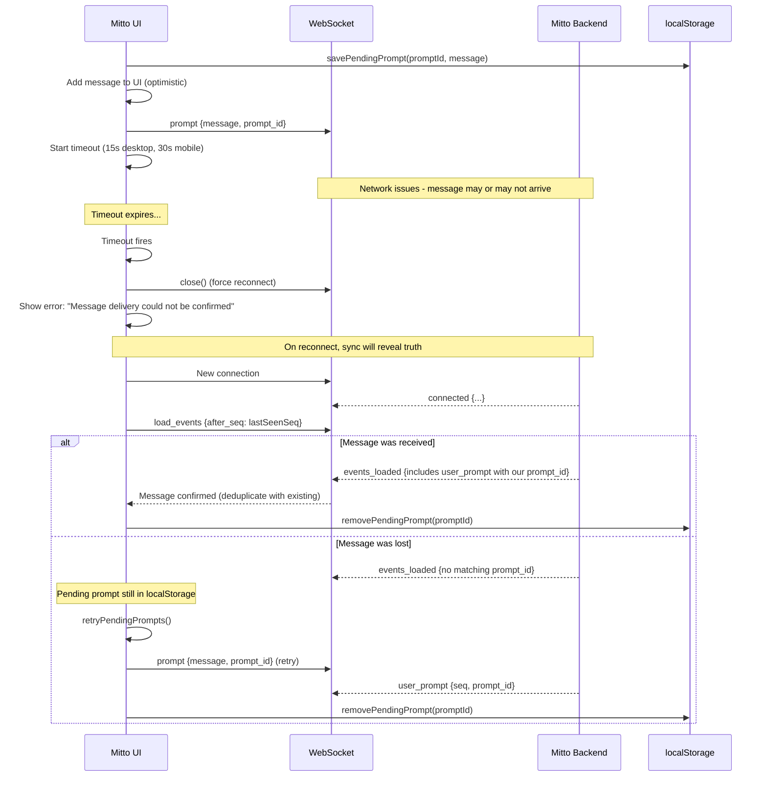
```mermaid
sequenceDiagram
    participant UI as Mitto UI
    participant WS as WebSocket
    participant Backend as Mitto Backend
    participant Storage as localStorage

    UI->>Storage: savePendingPrompt(promptId, message)
    UI->>UI: Add message to UI (optimistic)
    UI->>WS: prompt {message, prompt_id}
    UI->>UI: Start timeout (15s desktop, 30s mobile)

    Note over WS,Backend: Network issues - message may or may not arrive

    Note over UI: Timeout expires...
    UI->>UI: Timeout fires
    UI->>WS: close() (force reconnect)
    UI->>UI: Show error: "Message delivery could not be confirmed"

    Note over UI,Backend: On reconnect, sync will reveal truth
    UI->>WS: New connection
    Backend-->>WS: connected {...}
    UI->>WS: load_events {after_seq: lastSeenSeq}

    alt Message was received
        Backend-->>WS: events_loaded {includes user_prompt with our prompt_id}
        WS-->>UI: Message confirmed (deduplicate with existing)
        UI->>Storage: removePendingPrompt(promptId)
    else Message was lost
        Backend-->>WS: events_loaded {no matching prompt_id}
        Note over UI: Pending prompt still in localStorage
        UI->>UI: retryPendingPrompts()
        UI->>WS: prompt {message, prompt_id} (retry)
        Backend-->>WS: user_prompt {seq, prompt_id}
        UI->>Storage: removePendingPrompt(promptId)
    end
```

#### Mobile Timeout Considerations

The prompt ACK timeout is **30 seconds on mobile** vs **15 seconds on desktop**. This is because:

1. **Network variability**: Mobile networks have higher latency and more variability than desktop connections
2. **Background/foreground transitions**: iOS Safari may suspend WebSocket activity briefly when switching apps
3. **ACK path**: The `prompt_received` ACK is only sent after the message is persisted and broadcast, which involves more server-side work than just receiving the WebSocket message

Mobile detection uses user-agent detection:

```javascript
const isMobile =
  /iPhone|iPad|iPod|Android|webOS|BlackBerry|IEMobile|Opera Mini/i.test(
    navigator.userAgent,
  );
const ACK_TIMEOUT_MS = isMobile ? 30000 : 15000;
```

#### Agent Response as Implicit ACK

As a fallback, if the agent starts responding (with `agent_message` or `agent_thought`), any pending sends for that session are automatically resolved. This handles edge cases where:

1. The `prompt_received` ACK was lost due to a network hiccup
2. The prompt was received and the agent started responding, but the ACK timing was disrupted
3. Mobile network transitions caused ACK delivery issues

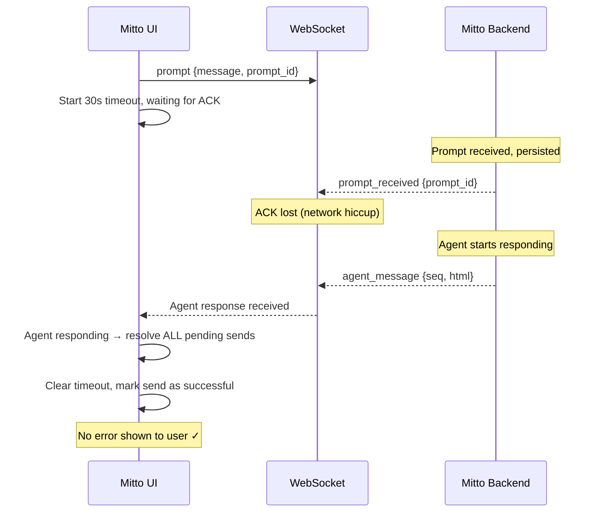
```mermaid
sequenceDiagram
    participant UI as Mitto UI
    participant WS as WebSocket
    participant Backend as Mitto Backend

    UI->>WS: prompt {message, prompt_id}
    UI->>UI: Start 30s timeout, waiting for ACK

    Note over Backend: Prompt received, persisted
    Backend-->>WS: prompt_received {prompt_id}
    Note over WS: ACK lost (network hiccup)

    Note over Backend: Agent starts responding
    Backend-->>WS: agent_message {seq, html}
    WS-->>UI: Agent response received

    UI->>UI: Agent responding → resolve ALL pending sends
    UI->>UI: Clear timeout, mark send as successful
    Note over UI: No error shown to user ✓
```

This is implemented by checking for pending sends whenever an agent response is received:

```javascript
case "agent_message":
case "agent_thought":
  // If agent is responding, any pending sends succeeded
  // (the agent wouldn't respond if it didn't get the prompt)
  resolvePendingSends(sessionId);
  // ... handle message display ...
  break;
```

### Corner Case: Client Connects Mid-Stream

When a client connects while the agent is actively responding:

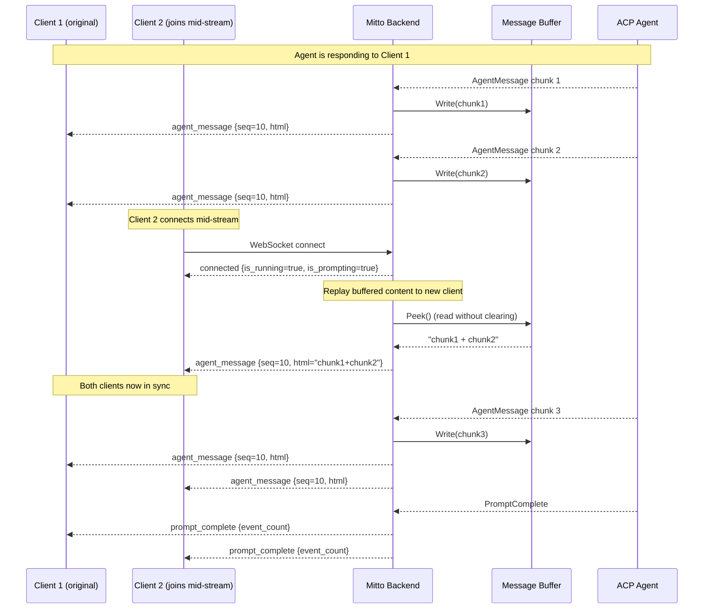
```mermaid
sequenceDiagram
    participant Client1 as Client 1 (original)
    participant Client2 as Client 2 (joins mid-stream)
    participant Backend as Mitto Backend
    participant Buffer as Message Buffer
    participant ACP as ACP Agent

    Note over Client1,ACP: Agent is responding to Client 1
    ACP-->>Backend: AgentMessage chunk 1
    Backend->>Buffer: Write(chunk1)
    Backend-->>Client1: agent_message {seq=10, html}

    ACP-->>Backend: AgentMessage chunk 2
    Backend->>Buffer: Write(chunk2)
    Backend-->>Client1: agent_message {seq=10, html}

    Note over Client2: Client 2 connects mid-stream
    Client2->>Backend: WebSocket connect
    Backend-->>Client2: connected {is_running=true, is_prompting=true}

    Note over Backend: Replay buffered content to new client
    Backend->>Buffer: Peek() (read without clearing)
    Buffer-->>Backend: "chunk1 + chunk2"
    Backend-->>Client2: agent_message {seq=10, html="chunk1+chunk2"}

    Note over Client1,Client2: Both clients now in sync
    ACP-->>Backend: AgentMessage chunk 3
    Backend->>Buffer: Write(chunk3)
    Backend-->>Client1: agent_message {seq=10, html}
    Backend-->>Client2: agent_message {seq=10, html}

    ACP-->>Backend: PromptComplete
    Backend-->>Client1: prompt_complete {event_count}
    Backend-->>Client2: prompt_complete {event_count}
```

### Corner Case: Multiple Clients, One Sends Prompt

When multiple clients are connected and one sends a message:

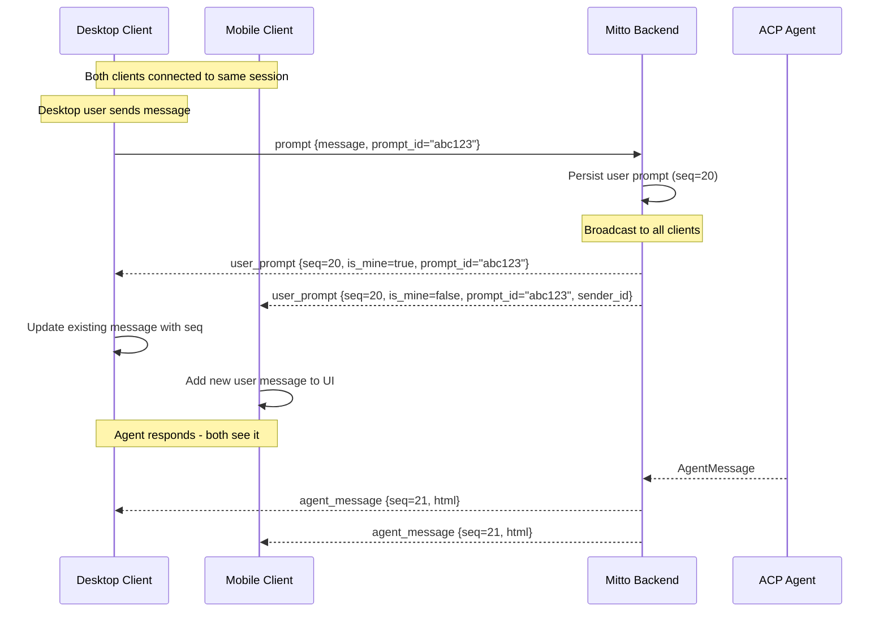
```mermaid
sequenceDiagram
    participant Desktop as Desktop Client
    participant Mobile as Mobile Client
    participant Backend as Mitto Backend
    participant ACP as ACP Agent

    Note over Desktop,Mobile: Both clients connected to same session

    Note over Desktop: Desktop user sends message
    Desktop->>Backend: prompt {message, prompt_id="abc123"}
    Backend->>Backend: Persist user prompt (seq=20)

    Note over Backend: Broadcast to all clients
    Backend-->>Desktop: user_prompt {seq=20, is_mine=true, prompt_id="abc123"}
    Backend-->>Mobile: user_prompt {seq=20, is_mine=false, prompt_id="abc123", sender_id}

    Desktop->>Desktop: Update existing message with seq
    Mobile->>Mobile: Add new user message to UI

    Note over Desktop,Mobile: Agent responds - both see it
    ACP-->>Backend: AgentMessage
    Backend-->>Desktop: agent_message {seq=21, html}
    Backend-->>Mobile: agent_message {seq=21, html}
```

### Corner Case: Reconnect During Active Streaming

When WebSocket disconnects while agent is responding:

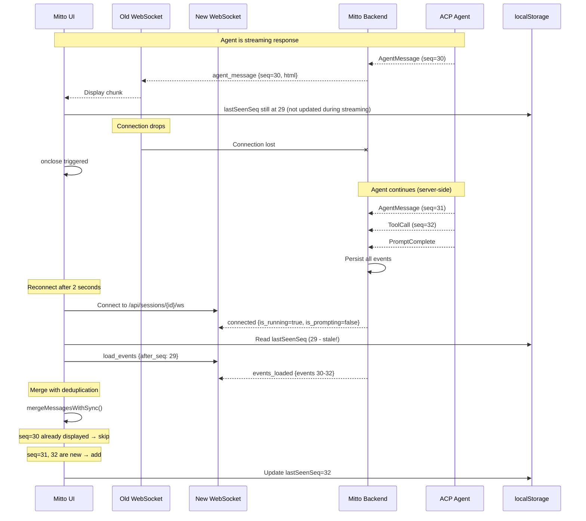
```mermaid
sequenceDiagram
    participant UI as Mitto UI
    participant OldWS as Old WebSocket
    participant NewWS as New WebSocket
    participant Backend as Mitto Backend
    participant ACP as ACP Agent
    participant Storage as localStorage

    Note over UI,ACP: Agent is streaming response
    ACP-->>Backend: AgentMessage (seq=30)
    Backend-->>OldWS: agent_message {seq=30, html}
    OldWS-->>UI: Display chunk
    UI->>Storage: lastSeenSeq still at 29 (not updated during streaming)

    Note over OldWS: Connection drops
    OldWS-xBackend: Connection lost
    UI->>UI: onclose triggered

    Note over ACP,Backend: Agent continues (server-side)
    ACP-->>Backend: AgentMessage (seq=31)
    ACP-->>Backend: ToolCall (seq=32)
    ACP-->>Backend: PromptComplete
    Backend->>Backend: Persist all events

    Note over UI: Reconnect after 2 seconds
    UI->>NewWS: Connect to /api/sessions/{id}/ws
    Backend-->>NewWS: connected {is_running=true, is_prompting=false}

    UI->>Storage: Read lastSeenSeq (29 - stale!)
    UI->>NewWS: load_events {after_seq: 29}
    Backend-->>NewWS: events_loaded {events 30-32}

    Note over UI: Merge with deduplication
    UI->>UI: mergeMessagesWithSync()
    Note over UI: seq=30 already displayed → skip
    Note over UI: seq=31, 32 are new → add
    UI->>Storage: Update lastSeenSeq=32
```

### Corner Case: Load More (Pagination)

When user scrolls up to load older messages:

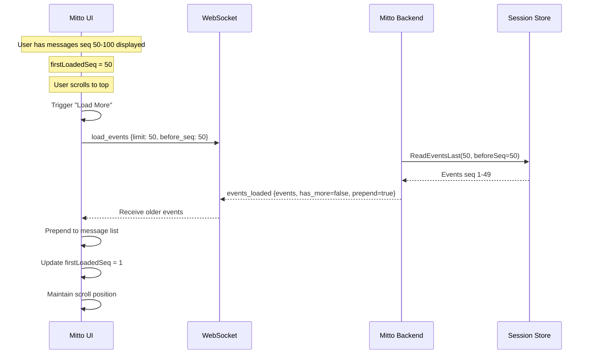
```mermaid
sequenceDiagram
    participant UI as Mitto UI
    participant WS as WebSocket
    participant Backend as Mitto Backend
    participant Store as Session Store

    Note over UI: User has messages seq 50-100 displayed
    Note over UI: firstLoadedSeq = 50

    Note over UI: User scrolls to top
    UI->>UI: Trigger "Load More"
    UI->>WS: load_events {limit: 50, before_seq: 50}

    Backend->>Store: ReadEventsLast(50, beforeSeq=50)
    Store-->>Backend: Events seq 1-49
    Backend-->>WS: events_loaded {events, has_more=false, prepend=true}

    WS-->>UI: Receive older events
    UI->>UI: Prepend to message list
    UI->>UI: Update firstLoadedSeq = 1
    UI->>UI: Maintain scroll position
```

### Corner Case: Session Deleted While Phone Sleeping

When the active session is deleted by another client while the phone is asleep:

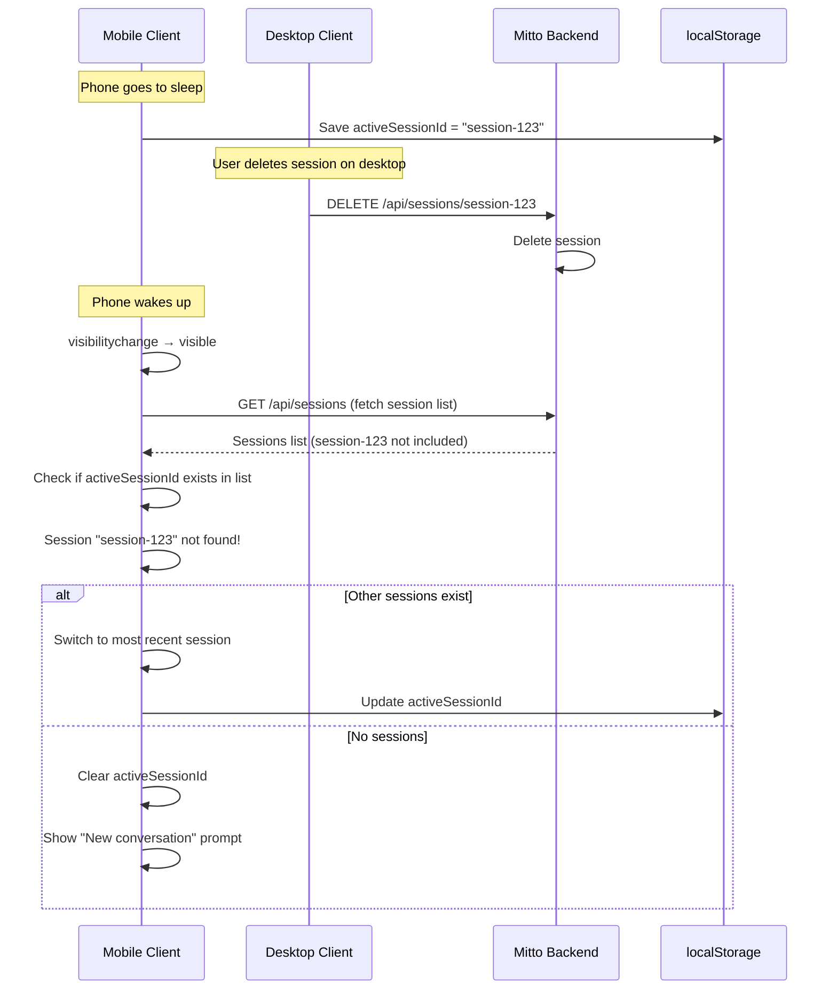
```mermaid
sequenceDiagram
    participant Mobile as Mobile Client
    participant Desktop as Desktop Client
    participant Backend as Mitto Backend
    participant Storage as localStorage

    Note over Mobile: Phone goes to sleep
    Mobile->>Storage: Save activeSessionId = "session-123"

    Note over Desktop: User deletes session on desktop
    Desktop->>Backend: DELETE /api/sessions/session-123
    Backend->>Backend: Delete session

    Note over Mobile: Phone wakes up
    Mobile->>Mobile: visibilitychange → visible
    Mobile->>Backend: GET /api/sessions (fetch session list)
    Backend-->>Mobile: Sessions list (session-123 not included)

    Mobile->>Mobile: Check if activeSessionId exists in list
    Mobile->>Mobile: Session "session-123" not found!

    alt Other sessions exist
        Mobile->>Mobile: Switch to most recent session
        Mobile->>Storage: Update activeSessionId
    else No sessions
        Mobile->>Mobile: Clear activeSessionId
        Mobile->>Mobile: Show "New conversation" prompt
    end
```

## Replay of Missing Content

When a client connects mid-stream (while the agent is actively responding), it needs to catch up on content that has been streamed but not yet persisted.

### The Problem

Agent messages and thoughts are **buffered** during streaming and only **persisted** when the prompt completes. A client connecting mid-stream would miss buffered content.

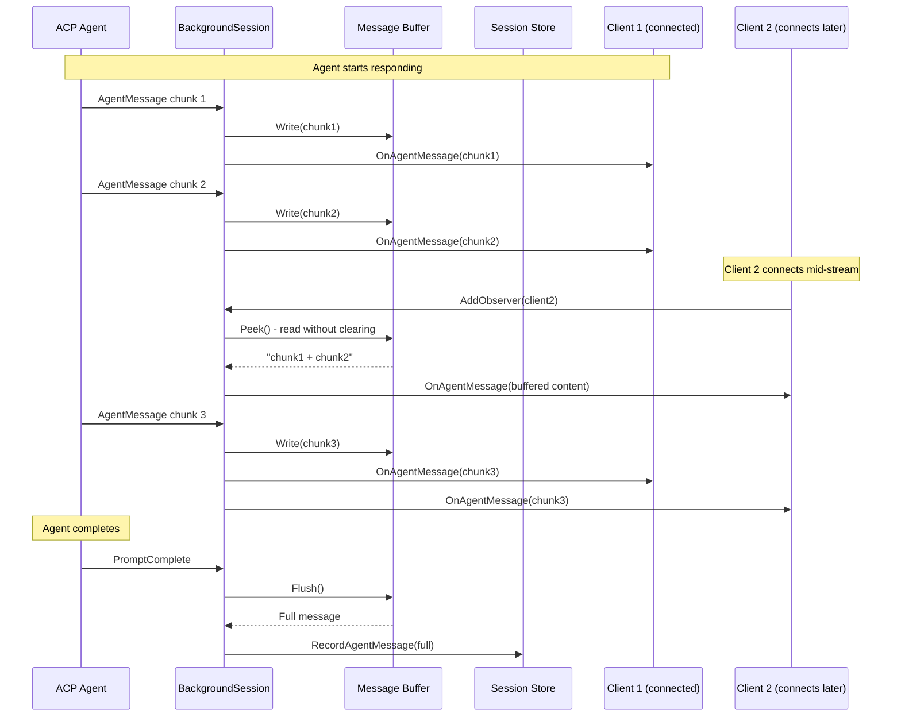
```mermaid
sequenceDiagram
    participant Agent as ACP Agent
    participant BS as BackgroundSession
    participant Buffer as Message Buffer
    participant Store as Session Store
    participant Client1 as Client 1 (connected)
    participant Client2 as Client 2 (connects later)

    Note over Agent,Client1: Agent starts responding
    Agent->>BS: AgentMessage chunk 1
    BS->>Buffer: Write(chunk1)
    BS->>Client1: OnAgentMessage(chunk1)

    Agent->>BS: AgentMessage chunk 2
    BS->>Buffer: Write(chunk2)
    BS->>Client1: OnAgentMessage(chunk2)

    Note over Client2: Client 2 connects mid-stream
    Client2->>BS: AddObserver(client2)
    BS->>Buffer: Peek() - read without clearing
    Buffer-->>BS: "chunk1 + chunk2"
    BS->>Client2: OnAgentMessage(buffered content)

    Agent->>BS: AgentMessage chunk 3
    BS->>Buffer: Write(chunk3)
    BS->>Client1: OnAgentMessage(chunk3)
    BS->>Client2: OnAgentMessage(chunk3)

    Note over Agent: Agent completes
    Agent->>BS: PromptComplete
    BS->>Buffer: Flush()
    Buffer-->>BS: Full message
    BS->>Store: RecordAgentMessage(full)
```

### The Solution

When a new observer connects to a `BackgroundSession`, the session checks if it's currently prompting. If so, it sends any buffered thought and message content to the new observer using `Peek()` (which reads without clearing the buffer).

**Key methods in `agentMessageBuffer`:**

- `Peek()`: Returns buffer content without clearing it
- `Flush()`: Returns buffer content and clears it (used at prompt completion)

This ensures all clients see the same content, regardless of when they connect.

## WebSocket-Only Event Loading

The frontend uses a **WebSocket-only architecture** for loading events. This eliminates race conditions between REST and WebSocket, simplifies deduplication, and provides a unified approach for initial load, pagination, and sync.

### Server-Side Deduplication

The server tracks `lastSentSeq` per WebSocket client to guarantee no duplicate events are sent:

```go
type SessionWSClient struct {
    // Seq tracking for deduplication - prevents sending the same event twice
    lastSentSeq int64      // Highest seq sent to this client
    seqMu       sync.Mutex // Protects lastSentSeq
}
```

**Key properties:**

- Each observer callback checks `seq > lastSentSeq` before sending
- For streaming events (agent_message, agent_thought), chunks with the same seq are allowed (continuations)
- After `load_events` response, `lastSentSeq` is updated to the highest seq returned
- This guarantees the frontend never receives duplicate events

### load_events Message

The `load_events` message is the unified approach for all event loading:

| Parameter    | Type  | Description                                      |
| ------------ | ----- | ------------------------------------------------ |
| `limit`      | int   | Maximum events to return (default: 50, max: 500) |
| `before_seq` | int64 | Load events with seq < before_seq (pagination)   |
| `after_seq`  | int64 | Load events with seq > after_seq (sync)          |

**Note:** `before_seq` and `after_seq` are mutually exclusive.

### Event Loading Flows

**Initial Load (on WebSocket connect):**

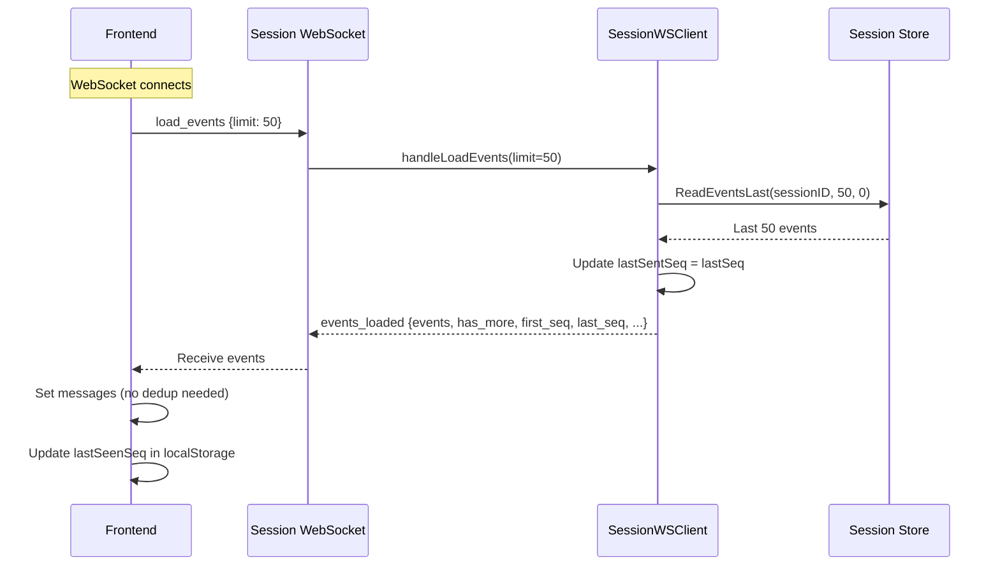
```mermaid
sequenceDiagram
    participant Client as Frontend
    participant WS as Session WebSocket
    participant Handler as SessionWSClient
    participant Store as Session Store

    Note over Client: WebSocket connects
    Client->>WS: load_events {limit: 50}
    WS->>Handler: handleLoadEvents(limit=50)
    Handler->>Store: ReadEventsLast(sessionID, 50, 0)
    Store-->>Handler: Last 50 events
    Handler->>Handler: Update lastSentSeq = lastSeq
    Handler-->>WS: events_loaded {events, has_more, first_seq, last_seq, ...}
    WS-->>Client: Receive events
    Client->>Client: Set messages (no dedup needed)
    Client->>Client: Update lastSeenSeq in localStorage
```

**Pagination (load more older events):**

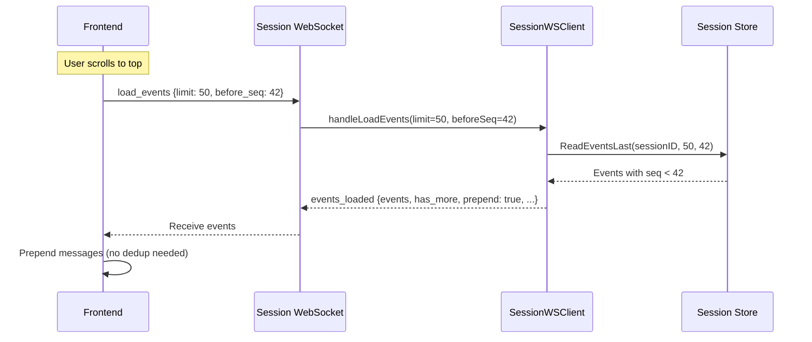
```mermaid
sequenceDiagram
    participant Client as Frontend
    participant WS as Session WebSocket
    participant Handler as SessionWSClient
    participant Store as Session Store

    Note over Client: User scrolls to top
    Client->>WS: load_events {limit: 50, before_seq: 42}
    WS->>Handler: handleLoadEvents(limit=50, beforeSeq=42)
    Handler->>Store: ReadEventsLast(sessionID, 50, 42)
    Store-->>Handler: Events with seq < 42
    Handler-->>WS: events_loaded {events, has_more, prepend: true, ...}
    WS-->>Client: Receive events
    Client->>Client: Prepend messages (no dedup needed)
```

**Sync (after reconnect):**

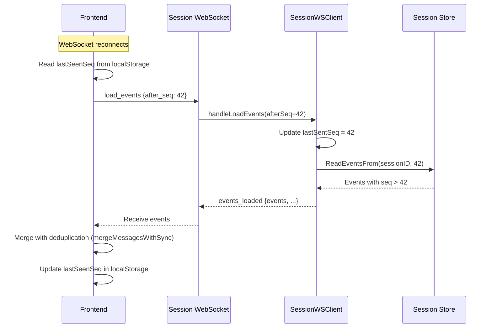
```mermaid
sequenceDiagram
    participant Client as Frontend
    participant WS as Session WebSocket
    participant Handler as SessionWSClient
    participant Store as Session Store

    Note over Client: WebSocket reconnects
    Client->>Client: Read lastSeenSeq from localStorage
    Client->>WS: load_events {after_seq: 42}
    WS->>Handler: handleLoadEvents(afterSeq=42)
    Handler->>Handler: Update lastSentSeq = 42
    Handler->>Store: ReadEventsFrom(sessionID, 42)
    Store-->>Handler: Events with seq > 42
    Handler-->>WS: events_loaded {events, ...}
    WS-->>Client: Receive events
    Client->>Client: Merge with deduplication (mergeMessagesWithSync)
    Client->>Client: Update lastSeenSeq in localStorage
```

### Frontend Message Handling

The frontend handles different loading scenarios with appropriate strategies:

```javascript
case "events_loaded": {
  const events = msg.data.events || [];
  const isPrepend = msg.data.prepend || false;
  const newMessages = convertEventsToMessages(events, {...});

  setSessions((prev) => {
    const session = prev[sessionId] || { messages: [] };
    let messages;

    if (isPrepend) {
      // Load more (older events) - prepend to existing messages
      // No deduplication needed - server guarantees no duplicates
      messages = [...newMessages, ...session.messages];
    } else if (session.messages.length === 0) {
      // Initial load - just use the new messages
      messages = newMessages;
    } else {
      // Sync after reconnect - merge with deduplication
      messages = mergeMessagesWithSync(session.messages, newMessages);
    }

    return { ...prev, [sessionId]: { ...session, messages } };
  });
}
```

### Deduplication Strategy

The system uses a **two-tier deduplication** approach:

1. **Server-side deduplication** (`lastSentSeq` tracking): The server tracks the highest sequence number sent to each WebSocket client. Streaming events are only sent if `seq > lastSentSeq`. This prevents duplicates during normal streaming.

2. **Client-side deduplication** (`mergeMessagesWithSync`): When syncing after reconnect, the client uses `mergeMessagesWithSync` to handle cases where:
   - `lastSeenSeq` in localStorage is stale (e.g., visibility change during streaming)
   - Messages already in UI have `seq` values from streaming
   - Server returns events that overlap with what's already displayed

**Why client-side deduplication is needed for sync:**

The `lastSeenSeq` stored in localStorage is only updated at specific points:

- When `prompt_complete` is received
- When `events_loaded` is received
- When `session_sync` is received

If a visibility change (phone wake) triggers a reconnect **during streaming** (before `prompt_complete`), the `lastSeenSeq` may be stale. The server will return events that are already displayed in the UI, requiring client-side deduplication.

**The `mergeMessagesWithSync` function:**

```javascript
export function mergeMessagesWithSync(existingMessages, newMessages) {
  // Create a map of existing messages by seq for fast lookup
  const existingBySeq = new Map();
  const existingHashes = new Set();
  for (const m of existingMessages) {
    if (m.seq) existingBySeq.set(m.seq, m);
    existingHashes.add(getMessageHash(m));
  }

  // Filter out duplicates from new messages
  // Prefer seq-based deduplication, fall back to content hash
  const filteredNewMessages = newMessages.filter((m) => {
    if (m.seq && existingBySeq.has(m.seq)) return false;
    return !existingHashes.has(getMessageHash(m));
  });

  // Combine and sort by seq for correct ordering
  const allMessages = [...existingMessages, ...filteredNewMessages];
  allMessages.sort((a, b) => {
    if (a.seq && b.seq) return a.seq - b.seq;
    return 0; // Keep relative order for messages without seq
  });

  return allMessages;
}
```

This ensures no duplicate messages appear in the UI, even when:

- The phone wakes during active streaming
- Multiple reconnections occur in quick succession
- The `lastSeenSeq` is out of sync with the displayed messages

### Sequence Number Tracking

The frontend tracks the last seen sequence number in localStorage. This is updated when:

- Loading a session (set to highest `seq` from loaded events)
- Receiving `prompt_complete` (updated from `event_count` field)
- Receiving `events_loaded` (updated from `last_seq` field)

### Legacy Sync (Deprecated)

The `sync_session` message type is deprecated but still supported for backward compatibility. New code should use `load_events` with `after_seq` instead.

## Reconnection Handling

The reconnection system handles WebSocket disconnections gracefully, including the "zombie connection" problem on mobile devices. See also [Zombie Connection Detection](#zombie-connection-detection-keepalive) for proactive detection of dead connections.

### Automatic Reconnection on Close

When a WebSocket closes unexpectedly, the frontend schedules a reconnection after a 2-second delay. The reconnection only occurs if:

- The session is still the active session
- No newer WebSocket has been created for that session

Reconnections can be triggered by:

1. **Server-initiated close**: Server closes the connection (e.g., timeout, error)
2. **Network failure**: Connection drops due to network issues
3. **Keepalive failure**: Client detects zombie connection via missed keepalives (see [Zombie Connection Detection](#zombie-connection-detection-keepalive))

### Pending Prompt Retry

Prompts are saved to localStorage before sending (with a unique `prompt_id`). After reconnection, any prompts that weren't acknowledged are automatically retried. Prompts older than 5 minutes are cleaned up to prevent stale retries.

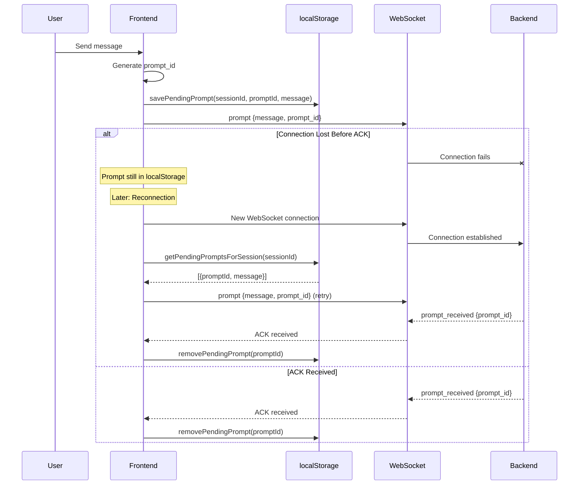
```mermaid
sequenceDiagram
    participant User
    participant Frontend
    participant Storage as localStorage
    participant WS as WebSocket
    participant Server as Backend

    User->>Frontend: Send message
    Frontend->>Frontend: Generate prompt_id
    Frontend->>Storage: savePendingPrompt(sessionId, promptId, message)
    Frontend->>WS: prompt {message, prompt_id}

    alt Connection Lost Before ACK
        WS-xServer: Connection fails
        Note over Frontend: Prompt still in localStorage

        Note over Frontend: Later: Reconnection
        Frontend->>WS: New WebSocket connection
        WS->>Server: Connection established
        Frontend->>Storage: getPendingPromptsForSession(sessionId)
        Storage-->>Frontend: [{promptId, message}]
        Frontend->>WS: prompt {message, prompt_id} (retry)
        Server-->>WS: prompt_received {prompt_id}
        WS-->>Frontend: ACK received
        Frontend->>Storage: removePendingPrompt(promptId)
    else ACK Received
        Server-->>WS: prompt_received {prompt_id}
        WS-->>Frontend: ACK received
        Frontend->>Storage: removePendingPrompt(promptId)
    end
```

### Multi-Client Prompt Broadcast

When multiple clients are connected to the same session, prompts are broadcast to all clients:

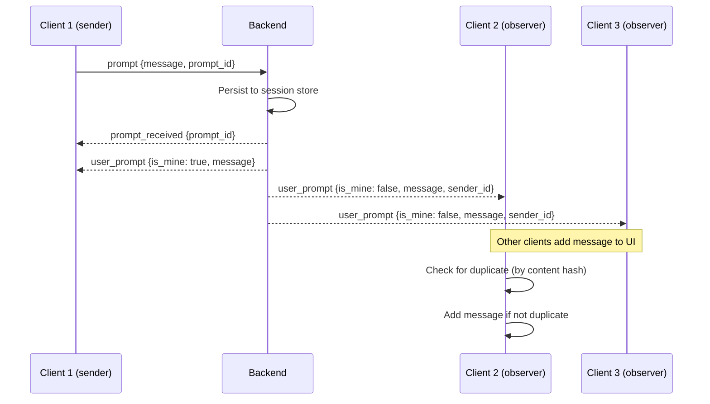
```mermaid
sequenceDiagram
    participant Client1 as Client 1 (sender)
    participant Server as Backend
    participant Client2 as Client 2 (observer)
    participant Client3 as Client 3 (observer)

    Client1->>Server: prompt {message, prompt_id}
    Server->>Server: Persist to session store
    Server-->>Client1: prompt_received {prompt_id}
    Server-->>Client1: user_prompt {is_mine: true, message}
    Server-->>Client2: user_prompt {is_mine: false, message, sender_id}
    Server-->>Client3: user_prompt {is_mine: false, message, sender_id}

    Note over Client2,Client3: Other clients add message to UI
    Client2->>Client2: Check for duplicate (by content hash)
    Client2->>Client2: Add message if not duplicate
```

### Zombie Connection Detection (Keepalive)

On mobile devices, WebSocket connections can become "zombies" - they appear open (`readyState === OPEN`) but are actually dead. This happens when:

- The phone goes to sleep
- The network changes (WiFi to cellular)
- The browser is backgrounded for extended periods

The WebSocket API doesn't immediately detect these dead connections, which can cause messages to be "sent" but never received.

**The Problem:**

```mermaid
sequenceDiagram
    participant User
    participant Frontend
    participant WS as WebSocket (zombie)
    participant Server as Backend

    Note over WS: Connection appears OPEN but is dead

    User->>Frontend: Send message
    Frontend->>Frontend: Check ws.readyState === OPEN ✓
    Frontend->>WS: prompt {message, prompt_id}
    Note over WS: Message goes nowhere

    Note over Frontend: 15 second timeout...
    Frontend->>Frontend: Show "Message send timed out" error
    Note over User: Confused - message may have been sent!
```

**The Solution: Client-Side Keepalive**

The frontend sends periodic `keepalive` messages and tracks responses to detect zombie connections:

```javascript
// Configuration
const KEEPALIVE_INTERVAL_MS = 25000; // Send keepalive every 25 seconds
const KEEPALIVE_MAX_MISSED = 2; // Force reconnect after 2 missed keepalives
```

**Keepalive Flow:**

```mermaid
sequenceDiagram
    participant Frontend
    participant WS as WebSocket
    participant Server as Backend

    Note over Frontend: Every 25 seconds...
    Frontend->>WS: keepalive {client_time}
    WS->>Server: keepalive {client_time}
    Server-->>WS: keepalive_ack {client_time, server_time}
    WS-->>Frontend: keepalive_ack received
    Frontend->>Frontend: Update lastAckTime, reset missedCount

    Note over Frontend: 25 seconds later...
    Frontend->>WS: keepalive {client_time}
    Note over WS: Connection is dead (zombie)
    Note over Frontend: No response received
    Frontend->>Frontend: missedCount++

    Note over Frontend: 25 seconds later...
    Frontend->>WS: keepalive {client_time}
    Note over Frontend: Still no response, missedCount = 2
    Frontend->>Frontend: Force close WebSocket
    Note over Frontend: onclose triggers reconnection
```

**Connection Health Check Before Sending:**

Before sending a message, the frontend checks if the connection is healthy:

```javascript
const isConnectionHealthy = (sessionId) => {
  const keepalive = keepaliveRef.current[sessionId];
  if (!keepalive) return true; // No tracking yet, assume healthy

  const timeSinceLastAck = Date.now() - (keepalive.lastAckTime || 0);
  // Unhealthy if no ACK in 2x the keepalive interval or missed keepalives
  return (
    timeSinceLastAck < KEEPALIVE_INTERVAL_MS * 2 &&
    (keepalive.missedCount || 0) === 0
  );
};
```

If the connection is unhealthy, the frontend forces a reconnection before sending:

```mermaid
sequenceDiagram
    participant User
    participant Frontend
    participant OldWS as Old WebSocket (zombie)
    participant NewWS as New WebSocket
    participant Server as Backend

    User->>Frontend: Send message
    Frontend->>Frontend: isConnectionHealthy() → false
    Frontend->>OldWS: close()
    Frontend->>Frontend: waitForSessionConnection()
    Frontend->>NewWS: New WebSocket connection
    NewWS->>Server: Connection established
    Server-->>NewWS: connected {session_id, ...}
    Frontend->>NewWS: prompt {message, prompt_id}
    Server-->>NewWS: prompt_received {prompt_id}
    Note over User: Message delivered successfully!
```

**Key Benefits:**

1. **Proactive detection**: Zombie connections are detected within ~50 seconds (2 missed keepalives)
2. **Pre-send validation**: Unhealthy connections are replaced before sending messages
3. **Improved reliability**: Messages are sent over fresh, verified connections
4. **Better UX**: Users don't see confusing timeout errors for messages that may have been sent

**Server-Side Keepalive:**

The server also sends WebSocket ping frames every 54 seconds (configured in `WebSocketSecurityConfig`). However, the browser's WebSocket API doesn't expose ping/pong events to JavaScript, so the client-side keepalive is necessary for application-level health monitoring.
