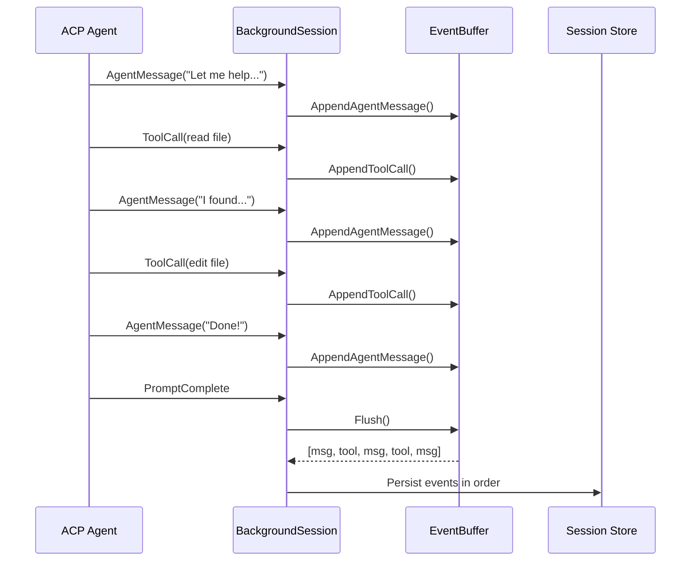
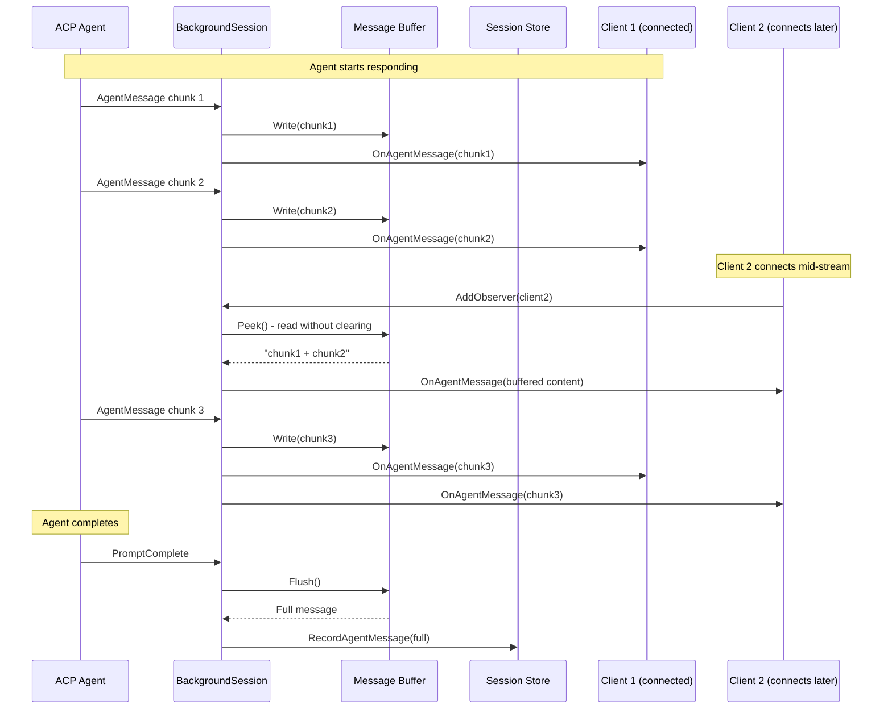
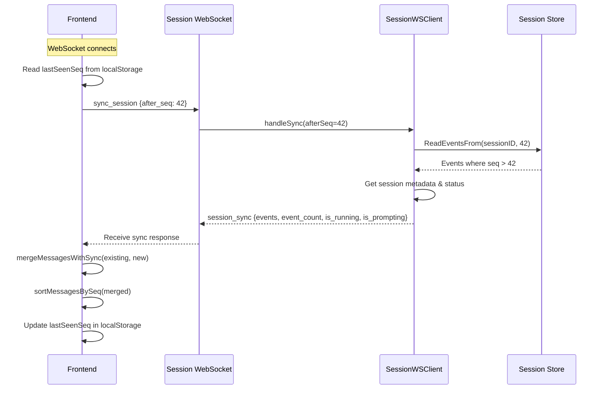
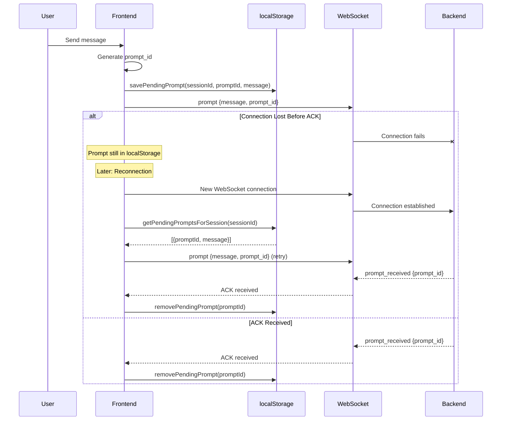
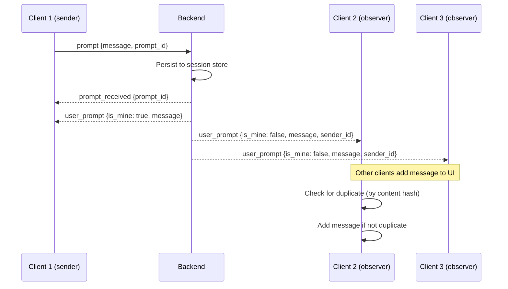

# WebSocket Message Handling Architecture

This document covers the WebSocket message handling system, including how message order is guaranteed, how clients resync after disconnection, and how reconnections are managed.

## Message Ordering

Message ordering is critical for ensuring all clients display conversations correctly. The system uses a **unified event buffer** to preserve streaming order and **sequence numbers** for tracking.

### Unified Event Buffer

All streaming events (agent messages, thoughts, tool calls, file operations) are buffered in a single `EventBuffer` during a prompt. Events are stored in the order they arrive and persisted together when the prompt completes.

This ensures events are persisted in the correct streaming order, preserving the interleaving of agent messages and tool calls.

### Sequence Number Assignment

Every event persisted to the session store is assigned a monotonically increasing sequence number (`seq`). The sequence number is assigned at persistence time by `session.Store.AppendEvent()`.

**Key properties:**
- `seq` starts at 1 for each session
- `seq` is assigned at persistence time, not at event creation
- `seq` is never reused or reassigned
- Events are stored in `seq` order in `events.jsonl`

### Frontend Ordering Strategy

The frontend preserves message order using these principles:

1. **Streaming messages** are displayed in the order they arrive via WebSocket
2. **Loaded sessions** use the order from `events.jsonl` (which preserves streaming order)
3. **Sync messages** are appended at the end (they represent events that happened AFTER the last seen event)
4. **Deduplication** prevents the same message from appearing twice

## Message Format

All WebSocket messages use a JSON envelope format with `type` and optional `data` fields.

### Frontend → Backend Messages

| Type | Data | Description |
|------|------|-------------|
| `prompt` | `{message, image_ids?, prompt_id}` | Send user message to agent |
| `cancel` | `{}` | Cancel current agent operation |
| `permission_answer` | `{request_id, approved}` | Respond to permission request |
| `sync_session` | `{after_seq}` | Request events after sequence number |
| `keepalive` | `{client_time}` | Application-level keepalive |
| `rename_session` | `{name}` | Rename the current session |

### Backend → Frontend Messages

| Type | Data | Description |
|------|------|-------------|
| `connected` | `{session_id, client_id, acp_server, is_running}` | Connection established |
| `prompt_received` | `{prompt_id}` | ACK that prompt was received and persisted |
| `user_prompt` | `{sender_id, prompt_id, message, is_mine}` | Broadcast of user prompt to all clients |
| `agent_message` | `{html}` | HTML-rendered agent response chunk |
| `agent_thought` | `{text}` | Agent thinking/reasoning (plain text) |
| `tool_call` | `{id, title, status}` | Tool invocation notification |
| `tool_update` | `{id, status}` | Tool status update |
| `permission` | `{request_id, title, description, options}` | Permission request |
| `prompt_complete` | `{event_count}` | Agent finished responding |
| `session_sync` | `{events, event_count, is_running, is_prompting}` | Response to sync request |
| `error` | `{message, code?}` | Error notification |

## Replay of Missing Content

When a client connects mid-stream (while the agent is actively responding), it needs to catch up on content that has been streamed but not yet persisted.

### The Problem

Agent messages and thoughts are **buffered** during streaming and only **persisted** when the prompt completes. A client connecting mid-stream would miss buffered content.

### The Solution

When a new observer connects to a `BackgroundSession`, the session checks if it's currently prompting. If so, it sends any buffered thought and message content to the new observer using `Peek()` (which reads without clearing the buffer).

**Key methods in `agentMessageBuffer`:**
- `Peek()`: Returns buffer content without clearing it
- `Flush()`: Returns buffer content and clears it (used at prompt completion)

This ensures all clients see the same content, regardless of when they connect.

## Resync Mechanism

The resync mechanism allows clients to catch up on events they missed while disconnected (e.g., phone sleep, network loss).

### Sequence Number Tracking

The frontend tracks the last seen sequence number in localStorage. This is updated when:
- Loading a session (set to highest `seq` from loaded events)
- Receiving `prompt_complete` (updated from `event_count` field)
- Receiving `session_sync` (updated after merge)

### Sync Request Flow

### Merge and Deduplication

When sync events arrive, they're merged with existing messages using `mergeMessagesWithSync()` which:
1. Creates a hash set of existing messages for deduplication
2. Filters out duplicates from new messages
3. Merges both lists and sorts by `seq`

This handles the case where some messages were received via streaming (no `seq`) and the same messages arrive via sync (with `seq`).

## Reconnection Handling

The reconnection system handles WebSocket disconnections gracefully, including the "zombie connection" problem on mobile devices.

### Automatic Reconnection on Close

When a WebSocket closes unexpectedly, the frontend schedules a reconnection after a 2-second delay. The reconnection only occurs if:
- The session is still the active session
- No newer WebSocket has been created for that session

### Pending Prompt Retry

Prompts are saved to localStorage before sending (with a unique `prompt_id`). After reconnection, any prompts that weren't acknowledged are automatically retried. Prompts older than 5 minutes are cleaned up to prevent stale retries.

### Multi-Client Prompt Broadcast

When multiple clients are connected to the same session, prompts are broadcast to all clients:

