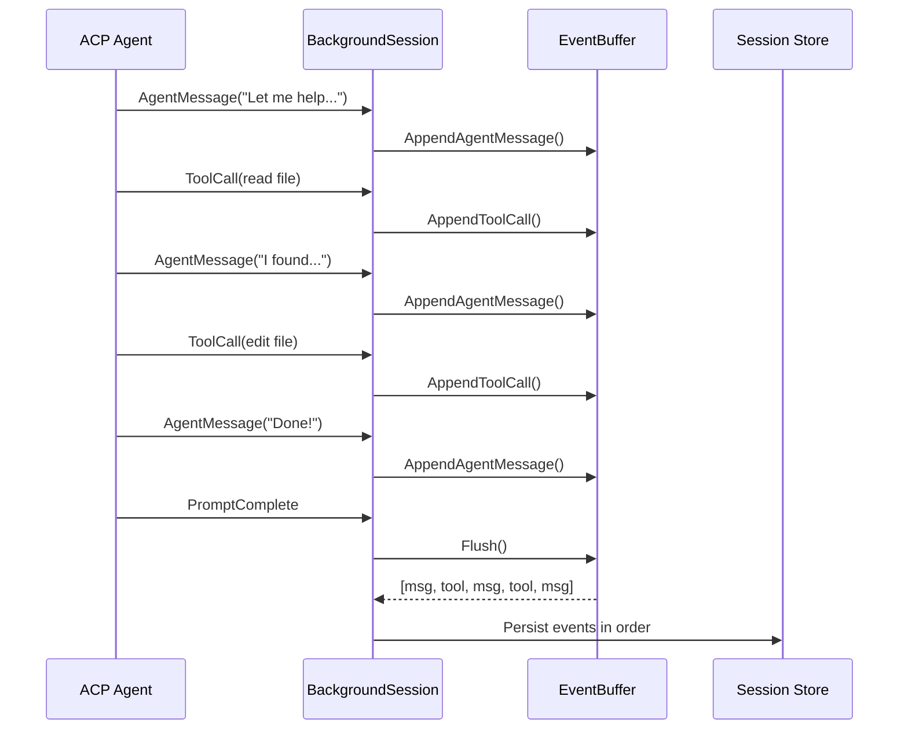
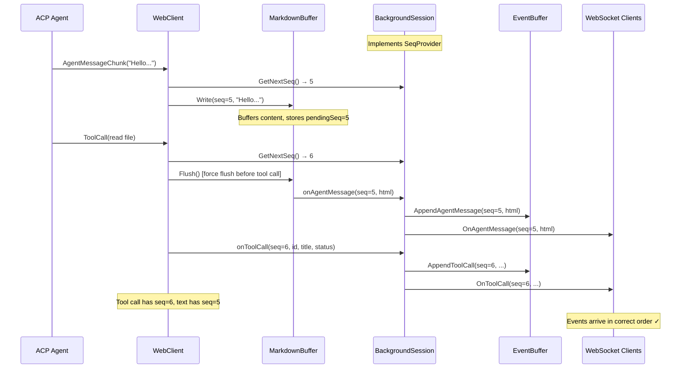
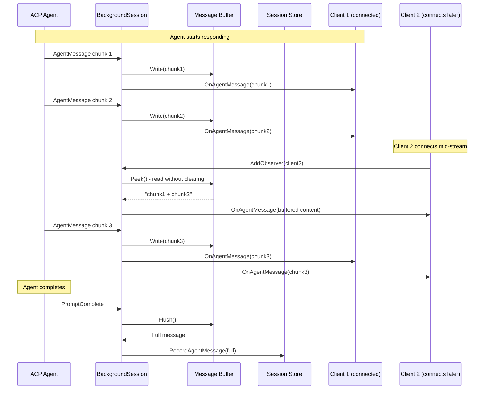
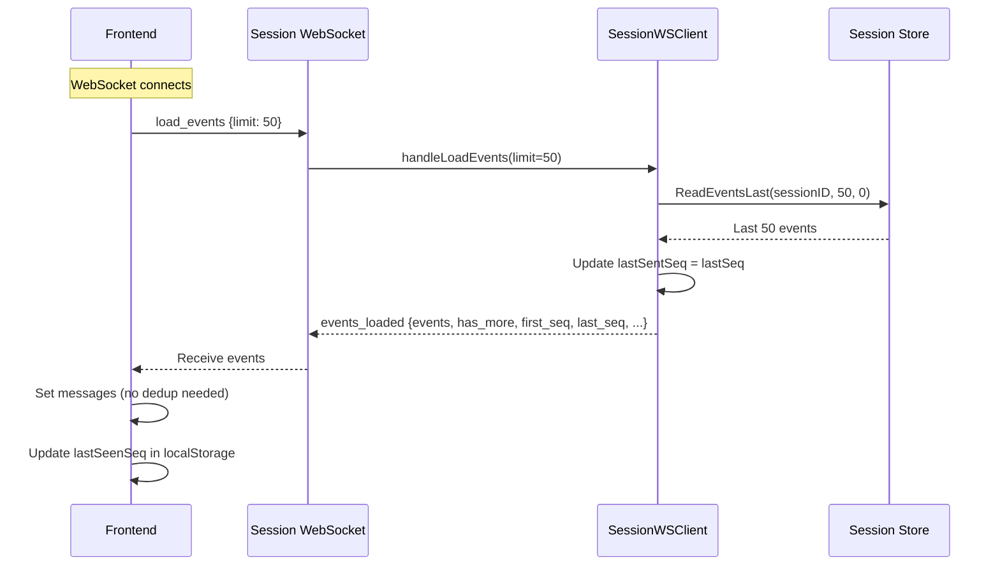
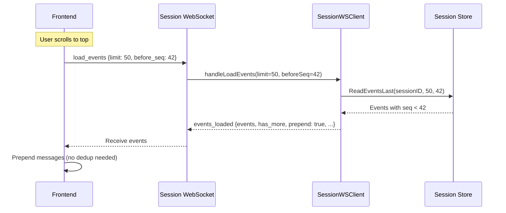
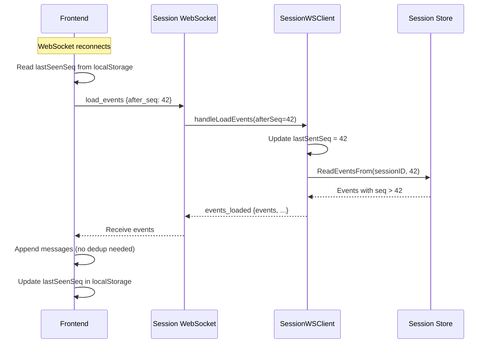
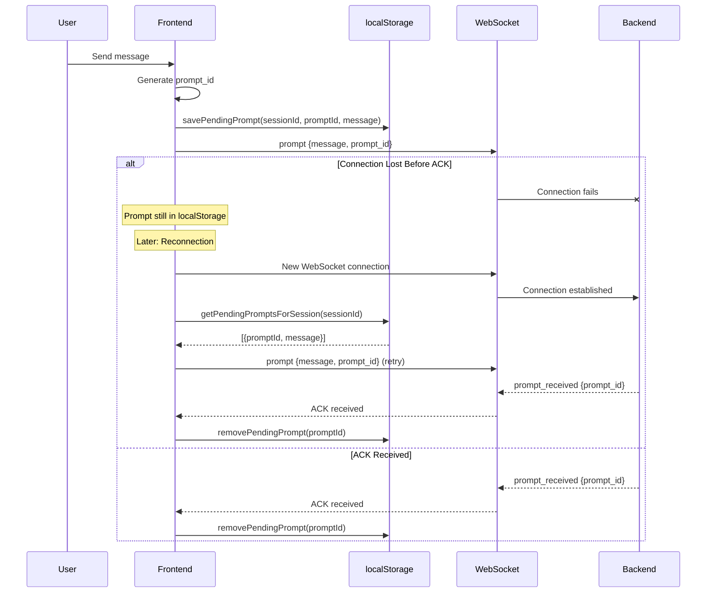
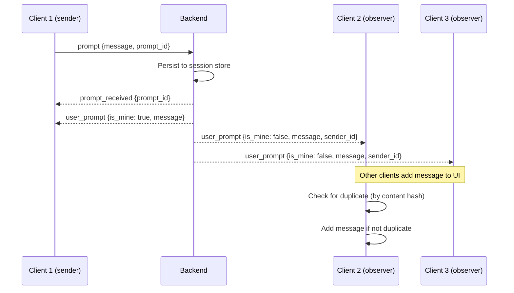

# WebSocket Message Handling Architecture

This document covers the WebSocket message handling system, including how message order is guaranteed, how clients resync after disconnection, and how reconnections are managed.

## Message Ordering

Message ordering is critical for ensuring all clients display conversations correctly. The system uses a **unified event buffer** to preserve streaming order and **sequence numbers** for tracking.

### Unified Event Buffer

All streaming events (agent messages, thoughts, tool calls, file operations) are buffered in a single `EventBuffer` during a prompt. Events are stored in the order they arrive and persisted together when the prompt completes.



This ensures events are persisted in the correct streaming order, preserving the interleaving of agent messages and tool calls.

### Sequence Number Assignment

Every event is assigned a monotonically increasing sequence number (`seq`) **when it is received from the ACP**, not at persistence time or when content is emitted from buffers. This ensures streaming and persisted events have the same `seq`, enabling proper deduplication and ordering across WebSocket reconnections.

**Key properties:**

- `seq` starts at 1 for each session
- `seq` is assigned immediately when the event is received from ACP (in `WebClient.SessionUpdate()`)
- `seq` is passed through the `MarkdownBuffer` for agent messages (preserving receive-time ordering)
- `seq` is included in WebSocket messages to observers
- `seq` is preserved when events are persisted to `events.jsonl`
- `seq` is never reused or reassigned
- For coalescing events (agent messages, thoughts), multiple chunks share the same `seq`

**Architecture: SeqProvider Interface**

The `WebClient` uses a `SeqProvider` interface to obtain sequence numbers. `BackgroundSession` implements this interface:

```go
// SeqProvider provides sequence numbers for event ordering.
type SeqProvider interface {
    GetNextSeq() int64
}

// BackgroundSession implements SeqProvider
func (bs *BackgroundSession) GetNextSeq() int64 {
    return bs.getNextSeq()
}
```

This decoupling allows `WebClient` to assign seq at ACP receive time while `BackgroundSession` manages the sequence counter.

**Sequence number flow:**



**Why assign seq at receive time (not emit time)?**

1. **Correct ordering with buffered content**: Agent messages are buffered in `MarkdownBuffer` for markdown rendering. If seq were assigned when the buffer flushes, tool calls could "leapfrog" text that was received earlier but buffered.

2. **Streaming and sync use same seq**: Clients can deduplicate by `(session_id, seq)`

3. **Correct ordering after reconnect**: Sort by `seq` gives correct order

4. **No race conditions**: Seq is assigned once, upfront, before any buffering or notification

**MarkdownBuffer and Seq Tracking**

The `MarkdownBuffer` tracks the sequence number for buffered content:

```go
// Write accepts seq when content is received
func (mb *MarkdownBuffer) Write(seq int64, chunk string) {
    // First chunk's seq becomes pendingSeq
    if mb.buffer.Len() == 0 {
        mb.pendingSeq = seq
    }
    // ... buffer content ...
}

// Flush passes the preserved seq to callback
func (mb *MarkdownBuffer) flushLocked() {
    seq := mb.pendingSeq  // Capture before reset
    mb.pendingSeq = 0
    // ... convert to HTML ...
    mb.onFlush(seq, htmlStr)
}
```

This ensures that even if multiple text chunks are buffered together, the seq from the first chunk is preserved and used when the content is eventually flushed.

### Frontend Ordering Strategy

The frontend preserves message order using these principles:

1. **Streaming messages** include `seq` and are displayed in arrival order
2. **Loaded sessions** use the order from `events.jsonl` (which preserves streaming order)
3. **Sync messages** are merged with existing messages and sorted by `seq`
4. **Deduplication** uses `seq` (preferred) or content hash (fallback)

## Message Format

All WebSocket messages use a JSON envelope format with `type` and optional `data` fields.

### Frontend → Backend Messages

| Type                | Data                                | Description                                |
| ------------------- | ----------------------------------- | ------------------------------------------ |
| `prompt`            | `{message, image_ids?, prompt_id}`  | Send user message to agent                 |
| `cancel`            | `{}`                                | Cancel current agent operation             |
| `permission_answer` | `{request_id, approved}`            | Respond to permission request              |
| `load_events`       | `{limit?, before_seq?, after_seq?}` | Load events (initial, pagination, or sync) |
| `sync_session`      | `{after_seq}`                       | (DEPRECATED) Request events after seq      |
| `keepalive`         | `{client_time}`                     | Application-level keepalive                |
| `rename_session`    | `{name}`                            | Rename the current session                 |

### Backend → Frontend Messages

| Type              | Data                                                                          | Description                                |
| ----------------- | ----------------------------------------------------------------------------- | ------------------------------------------ |
| `connected`       | `{session_id, client_id, acp_server, is_running}`                             | Connection established                     |
| `prompt_received` | `{prompt_id}`                                                                 | ACK that prompt was received and persisted |
| `user_prompt`     | `{seq, sender_id, prompt_id, message, is_mine}`                               | Broadcast of user prompt to all clients    |
| `agent_message`   | `{seq, html, is_prompting}`                                                   | HTML-rendered agent response chunk         |
| `agent_thought`   | `{seq, text, is_prompting}`                                                   | Agent thinking/reasoning (plain text)      |
| `tool_call`       | `{seq, id, title, status, is_prompting}`                                      | Tool invocation notification               |
| `tool_update`     | `{seq, id, status, is_prompting}`                                             | Tool status update                         |
| `permission`      | `{request_id, title, description, options}`                                   | Permission request                         |
| `prompt_complete` | `{event_count}`                                                               | Agent finished responding                  |
| `events_loaded`   | `{events, has_more, first_seq, last_seq, total_count, prepend, is_prompting}` | Response to load_events request            |
| `session_sync`    | `{events, event_count, is_running, is_prompting}`                             | (DEPRECATED) Response to sync_session      |
| `error`           | `{message, code?}`                                                            | Error notification                         |

**Note on `seq`**: All event messages (`user_prompt`, `agent_message`, `agent_thought`, `tool_call`, `tool_update`) include a sequence number for ordering and deduplication. Multiple chunks of the same logical message (e.g., streaming agent message) share the same `seq`.

## Replay of Missing Content

When a client connects mid-stream (while the agent is actively responding), it needs to catch up on content that has been streamed but not yet persisted.

### The Problem

Agent messages and thoughts are **buffered** during streaming and only **persisted** when the prompt completes. A client connecting mid-stream would miss buffered content.



### The Solution

When a new observer connects to a `BackgroundSession`, the session checks if it's currently prompting. If so, it sends any buffered thought and message content to the new observer using `Peek()` (which reads without clearing the buffer).

**Key methods in `agentMessageBuffer`:**

- `Peek()`: Returns buffer content without clearing it
- `Flush()`: Returns buffer content and clears it (used at prompt completion)

This ensures all clients see the same content, regardless of when they connect.

## WebSocket-Only Event Loading

The frontend uses a **WebSocket-only architecture** for loading events. This eliminates race conditions between REST and WebSocket, simplifies deduplication, and provides a unified approach for initial load, pagination, and sync.

### Server-Side Deduplication

The server tracks `lastSentSeq` per WebSocket client to guarantee no duplicate events are sent:

```go
type SessionWSClient struct {
    // Seq tracking for deduplication - prevents sending the same event twice
    lastSentSeq int64      // Highest seq sent to this client
    seqMu       sync.Mutex // Protects lastSentSeq
}
```

**Key properties:**

- Each observer callback checks `seq > lastSentSeq` before sending
- For streaming events (agent_message, agent_thought), chunks with the same seq are allowed (continuations)
- After `load_events` response, `lastSentSeq` is updated to the highest seq returned
- This guarantees the frontend never receives duplicate events

### load_events Message

The `load_events` message is the unified approach for all event loading:

| Parameter    | Type  | Description                                      |
| ------------ | ----- | ------------------------------------------------ |
| `limit`      | int   | Maximum events to return (default: 50, max: 500) |
| `before_seq` | int64 | Load events with seq < before_seq (pagination)   |
| `after_seq`  | int64 | Load events with seq > after_seq (sync)          |

**Note:** `before_seq` and `after_seq` are mutually exclusive.

### Event Loading Flows

**Initial Load (on WebSocket connect):**



**Pagination (load more older events):**



**Sync (after reconnect):**



### Frontend Simplification

With server-side deduplication, the frontend no longer needs complex merge logic:

```javascript
case "events_loaded": {
  const events = msg.data.events || [];
  const isPrepend = msg.data.prepend || false;
  const newMessages = convertEventsToMessages(events, {...});

  setSessions((prev) => {
    const session = prev[sessionId] || { messages: [] };
    let messages;

    if (isPrepend) {
      // Load more - prepend older events
      messages = [...newMessages, ...session.messages];
    } else if (session.messages.length === 0) {
      // Initial load
      messages = newMessages;
    } else {
      // Sync - append new events
      messages = [...session.messages, ...newMessages];
    }

    return { ...prev, [sessionId]: { ...session, messages } };
  });
}
```

No deduplication is needed because the server guarantees no duplicates via `lastSentSeq` tracking.

### Sequence Number Tracking

The frontend tracks the last seen sequence number in localStorage. This is updated when:

- Loading a session (set to highest `seq` from loaded events)
- Receiving `prompt_complete` (updated from `event_count` field)
- Receiving `events_loaded` (updated from `last_seq` field)

### Legacy Sync (Deprecated)

The `sync_session` message type is deprecated but still supported for backward compatibility. New code should use `load_events` with `after_seq` instead.

## Reconnection Handling

The reconnection system handles WebSocket disconnections gracefully, including the "zombie connection" problem on mobile devices.

### Automatic Reconnection on Close

When a WebSocket closes unexpectedly, the frontend schedules a reconnection after a 2-second delay. The reconnection only occurs if:

- The session is still the active session
- No newer WebSocket has been created for that session

### Pending Prompt Retry

Prompts are saved to localStorage before sending (with a unique `prompt_id`). After reconnection, any prompts that weren't acknowledged are automatically retried. Prompts older than 5 minutes are cleaned up to prevent stale retries.



### Multi-Client Prompt Broadcast

When multiple clients are connected to the same session, prompts are broadcast to all clients:


