# WebSocket Documentation

This directory contains the complete WebSocket messaging architecture documentation for Mitto.
It is the **single source of truth** for real-time communication between frontend and backend.

## Table of Contents

| Document                                        | Description                                                                |
| ----------------------------------------------- | -------------------------------------------------------------------------- |
| [Protocol Specification](./protocol-spec.md)    | Message types, formats, event types, and endpoints                         |
| [Sequence Numbers](./sequence-numbers.md)       | Ordering, assignment, contract, and guarantees                             |
| [Synchronization](./synchronization.md)         | Reconnection, event loading, gap detection, deduplication, circuit breaker |
| [Communication Flows](./communication-flows.md) | Golden path flows and corner cases with diagrams                           |

## Overview

The WebSocket messaging system provides real-time bidirectional communication between the Mitto
frontend and backend. Key features include:

- **Message ordering**: Guaranteed ordering using sequence numbers assigned at ACP receive time
- **Reliable delivery**: Prompt acknowledgment with retry on failure
- **Reconnection support**: Automatic reconnection with sync to catch up on missed events
- **Zombie detection**: Keepalive mechanism to detect and recover from dead connections
- **Multi-client support**: Multiple clients can connect to the same session
- **Circuit breaker**: Terminal `session_gone` message prevents error storms for deleted sessions
- **Unified UI prompts**: Single system for MCP questions, permissions, and follow-up suggestions

## Reading Order

For a complete understanding of the WebSocket system:

1. **[Protocol Specification](./protocol-spec.md)** — Start here for message types, endpoints, and formats
2. **[Sequence Numbers](./sequence-numbers.md)** — Learn how messages are ordered and deduplicated
3. **[Synchronization](./synchronization.md)** — Understand reconnection, sync, and gap filling
4. **[Communication Flows](./communication-flows.md)** — See complete interaction flows with diagrams

## Architecture

```mermaid
graph TB
    subgraph "Frontend — Mitto UI"
        direction TB
        APP[Preact App]
        USE_WS["useWebSocket.js<br/>Connection management<br/>Keepalive · Gap detection<br/>Sequence tracking"]
        WS_UTIL["websocket.js<br/>Reconnection · Backoff"]
    end

    subgraph "WebSocket Endpoints"
        EVENTS_WS["/api/events<br/>Global lifecycle events"]
        SESSION_WS["/api/sessions/{id}/ws<br/>Per-session communication"]
    end

    subgraph "Backend — Mitto Web Server"
        direction TB
        GEM["GlobalEventsManager<br/>Session CRUD broadcasts"]
        WSC["SessionWSClient<br/>lastSentSeq tracking<br/>Observer pattern"]
        BS["BackgroundSession<br/>SeqProvider · EventBuffer<br/>Observer notifications"]
        WC["WebClient<br/>ACP ↔ Web bridge<br/>Seq assignment at receive"]
        MD["MarkdownBuffer<br/>Smart buffering<br/>Seq preservation"]
        SB["StreamBuffer<br/>Block detection<br/>Event ordering"]
        REC["Recorder<br/>Immediate persistence"]
    end

    subgraph "External"
        ACP["ACP Agent"]
        STORE["Session Store<br/>events.jsonl · metadata.json"]
    end

    APP --> USE_WS
    USE_WS --> WS_UTIL
    WS_UTIL <--> EVENTS_WS
    WS_UTIL <--> SESSION_WS

    EVENTS_WS <--> GEM
    SESSION_WS <--> WSC
    WSC -.->|observes| BS
    BS --> WC
    WC --> MD
    MD --> SB
    SB --> BS
    WC <-->|stdin/stdout| ACP
    BS --> REC
    REC --> STORE
```

## Quick Reference

### Frontend → Backend Messages

| Type                      | Purpose                                 |
| ------------------------- | --------------------------------------- |
| `prompt`                  | Send user message                       |
| `load_events`             | Load events (initial, pagination, sync) |
| `keepalive`               | Connection health check                 |
| `cancel`                  | Cancel agent operation                  |
| `force_reset`             | Forcefully reset stuck session          |
| `ui_prompt_answer`        | Respond to UI prompt (MCP, permissions) |
| `rename_session`          | Rename the current session              |
| `set_config_option`       | Change a session config option          |
| `run_mcp_install_command` | Execute MCP installation command        |
| `permission_answer`       | ⚠️ Legacy — use `ui_prompt_answer`      |

### Backend → Frontend Messages (Session WS)

| Type                              | Purpose                                     |
| --------------------------------- | ------------------------------------------- |
| `connected`                       | Connection established                      |
| `prompt_received`                 | Prompt ACK                                  |
| `user_prompt`                     | Broadcast of user prompt to all clients     |
| `agent_message`                   | Streaming agent response (HTML)             |
| `agent_thought`                   | Agent thinking/reasoning (plain text)       |
| `tool_call` / `tool_update`       | Tool invocations and status updates         |
| `plan`                            | Agent task plan                             |
| `file_read` / `file_write`        | File operations by agent                    |
| `events_loaded`                   | Response to `load_events`                   |
| `keepalive_ack`                   | Connection health + state sync              |
| `prompt_complete`                 | Agent finished responding                   |
| `ui_prompt` / `ui_prompt_dismiss` | Interactive prompts (MCP, permissions)      |
| `action_buttons`                  | AI-generated follow-up suggestions          |
| `available_commands_updated`      | Agent's available slash commands            |
| `config_option_changed`           | Session config option changed               |
| `error`                           | Error notification                          |
| `session_gone`                    | Terminal: session no longer exists          |
| `session_reset`                   | Session was forcefully reset                |
| `session_renamed`                 | Session name changed                        |
| `acp_stopped` / `acp_started`     | ACP process lifecycle                       |
| `acp_start_failed`                | ACP process failed to start                 |
| `acp_error_permanent`             | Permanent ACP error with user guidance      |
| `runner_fallback`                 | Runner fell back to exec mode               |
| `hook_failed`                     | Lifecycle hook execution failed             |
| `mcp_tools_unavailable`           | MCP tools not available in workspace        |
| `queue_updated`                   | Queue state changed                         |
| `queue_message_sending/sent`      | Queue message delivery lifecycle            |
| `queue_message_titled`            | Queue message received auto-generated title |
| `queue_reordered`                 | Queue order changed                         |

### Backend → Frontend Messages (Global Events WS)

| Type                       | Purpose                              |
| -------------------------- | ------------------------------------ |
| `connected`                | Global events connection established |
| `session_created`          | New session created                  |
| `session_deleted`          | Session deleted                      |
| `session_renamed`          | Session renamed                      |
| `session_pinned`           | Session pin state changed            |
| `session_archived`         | Session archive state changed        |
| `session_archive_pending`  | Session archiving initiated          |
| `session_streaming`        | Session streaming state changed      |
| `session_settings_updated` | Session advanced settings changed    |
| `periodic_updated`         | Periodic prompt config changed       |
| `periodic_started`         | Periodic prompt was delivered        |
| `acp_started`              | ACP process started for session      |
| `acp_start_failed`         | ACP process failed to start          |
| `hook_failed`              | Lifecycle hook failed                |
| `prompts_changed`          | Prompt files changed on disk         |

### Key Concepts

- **`seq`**: Monotonically increasing sequence number for ordering
- **`max_seq`**: Highest seq on server, enables immediate gap detection
- **`lastSentSeq`**: Server-side tracking to prevent duplicate events
- **Three-tier deduplication**: Server-side + client-side seq + content hash

## Related Rules Files

The following `.augment/rules/` files contain implementation patterns:

- **[11-web-backend-sequences.md](../../../.augment/rules/11-web-backend-sequences.md)** — Backend implementation patterns
- **[22-web-frontend-websocket.md](../../../.augment/rules/22-web-frontend-websocket.md)** — Frontend implementation patterns
- **[27-web-frontend-sync.md](../../../.augment/rules/27-web-frontend-sync.md)** — Sequence sync and deduplication patterns

## Testing

Key tests for the WebSocket system:

- `TestEventBuffer_OutOfOrderSeqPreserved`
- `TestEventBuffer_CoalescingPreservesFirstSeq`
- `TestReconnectDuringAgentStreaming`
- `TestStaleSeqSync`
- `TestMultipleClientsSeeSameEvents`

See `internal/web/*_test.go` for the complete test suite.
