# Communication Flows

This document shows complete communication flows between the Mitto UI (frontend) and backend, covering both the golden path (happy path) and various corner cases.

## Related Documentation

- [Protocol Specification](./protocol-spec.md) - Message types and formats
- [Sequence Numbers](./sequence-numbers.md) - Ordering and deduplication
- [Synchronization](./synchronization.md) - Reconnection and sync

## Golden Path: Complete Conversation Flow

This diagram shows a complete successful interaction from session connection through agent response:

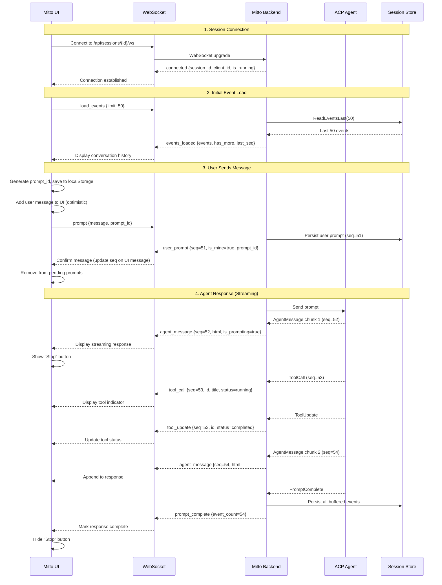

## Golden Path: Permission Request Flow

When the agent needs user permission for an action:

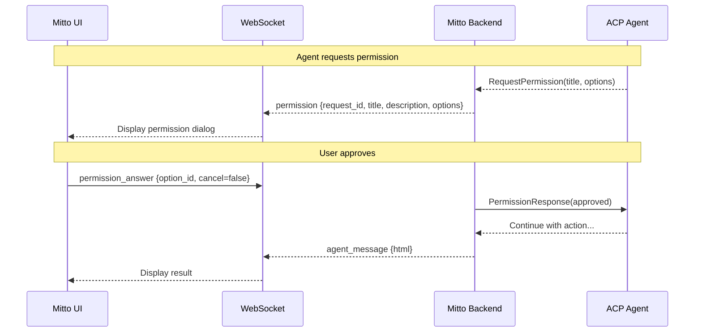

## Corner Case: Mobile Phone Sleep/Wake

When the phone sleeps and wakes, the WebSocket may be dead but appear open:

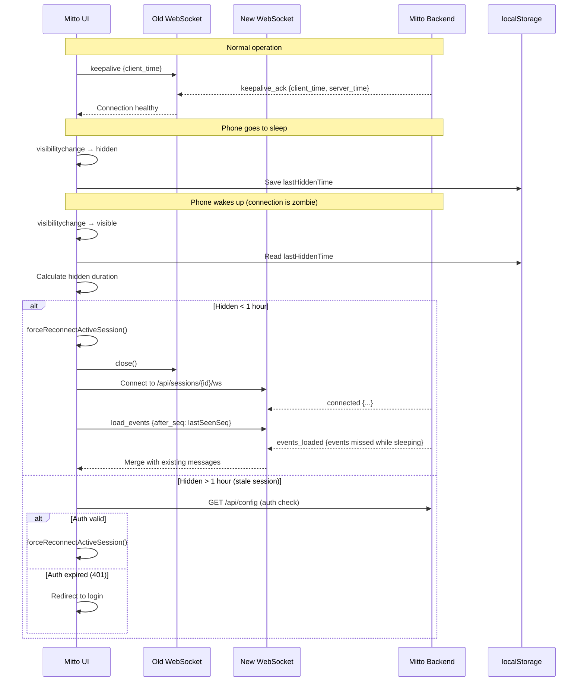

## Corner Case: Send Message During Zombie Connection

When user tries to send a message but the connection is actually dead:

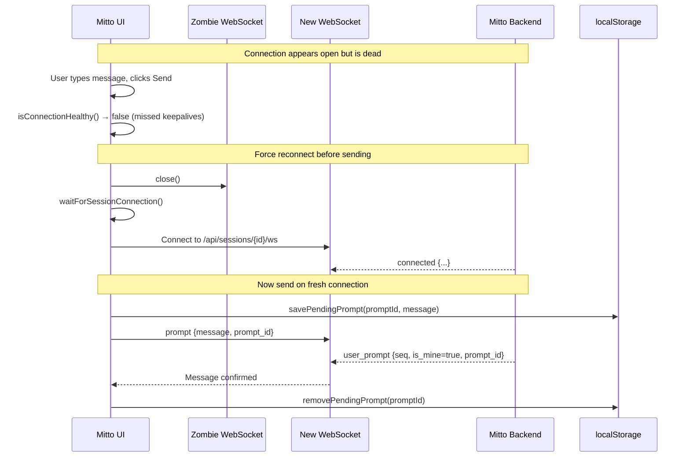

## Corner Case: Send Timeout with Automatic Retry

When the ACK doesn't arrive within the initial timeout period, the frontend automatically reconnects and retries delivery.

**Timing budget (10 seconds total):**

- Initial ACK timeout: **3 seconds** (desktop) / **4 seconds** (mobile)
- Reconnect + delivery verification: up to 4 seconds
- Retry delivery + second ACK: up to 3 seconds

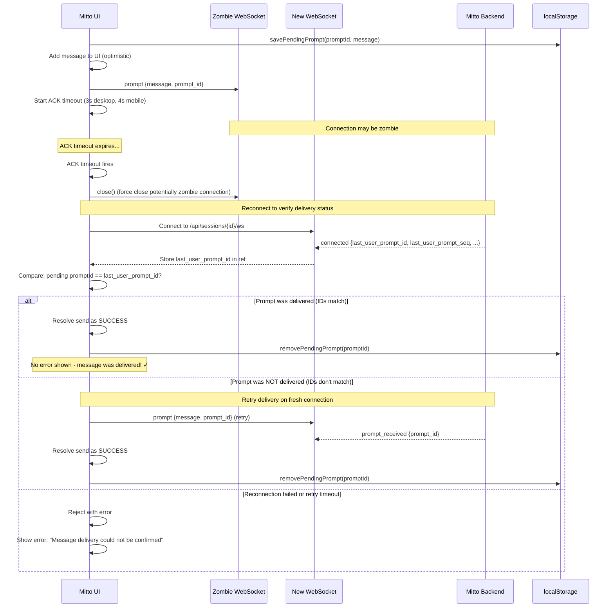

## Corner Case: Client Connects Mid-Stream

When a client connects while the agent is actively responding:

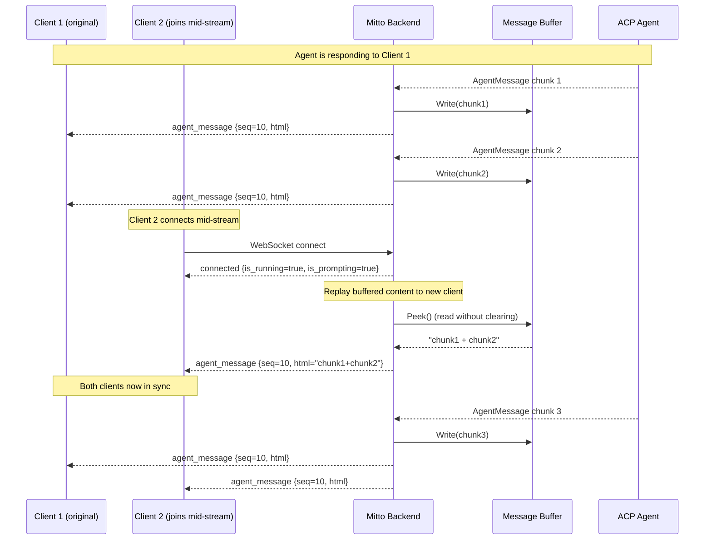

## Corner Case: Multiple Clients, One Sends Prompt

When multiple clients are connected and one sends a message:

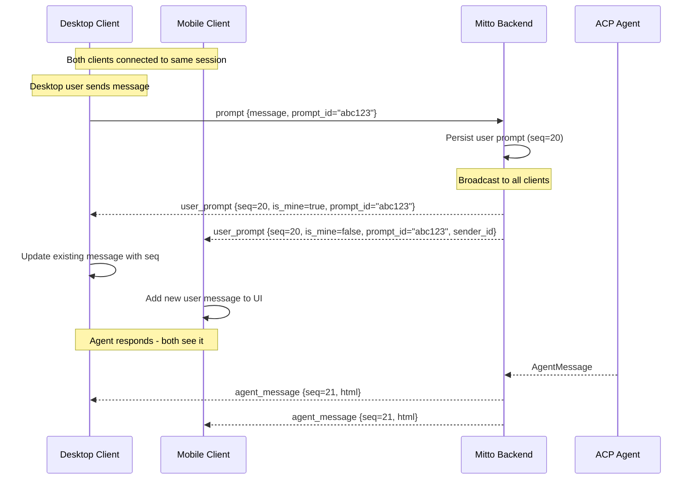

## Corner Case: Reconnect During Active Streaming

When WebSocket disconnects while agent is responding:

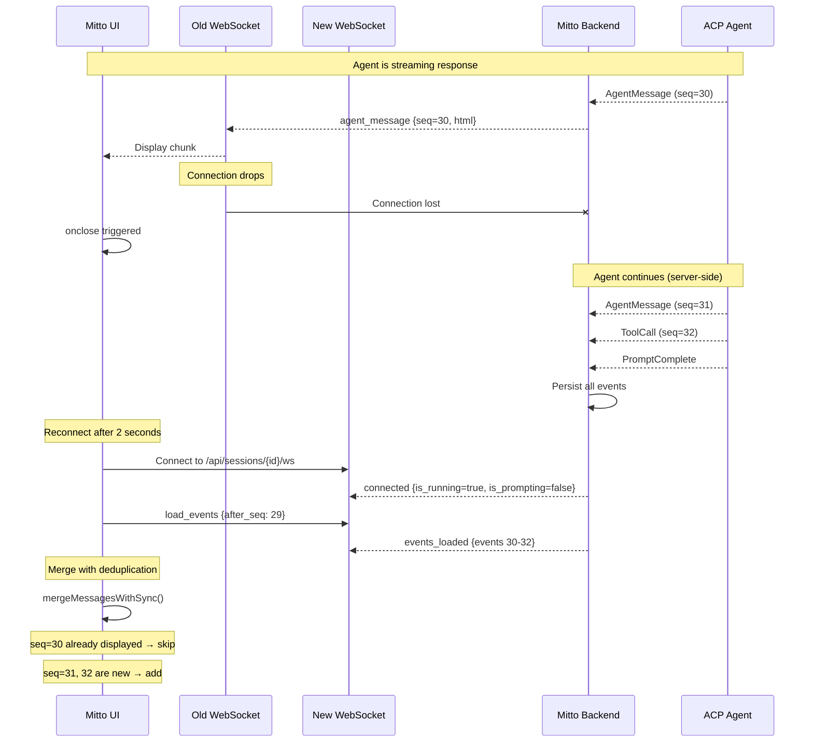

## Corner Case: Load More (Pagination)

When user scrolls up to load older messages:

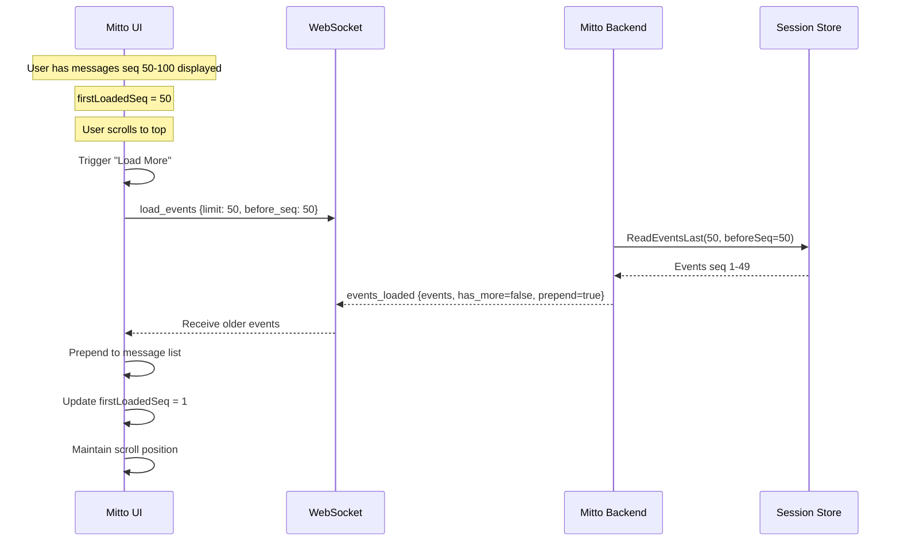

## Corner Case: Session Deleted While Phone Sleeping

When the active session is deleted by another client while the phone is asleep:

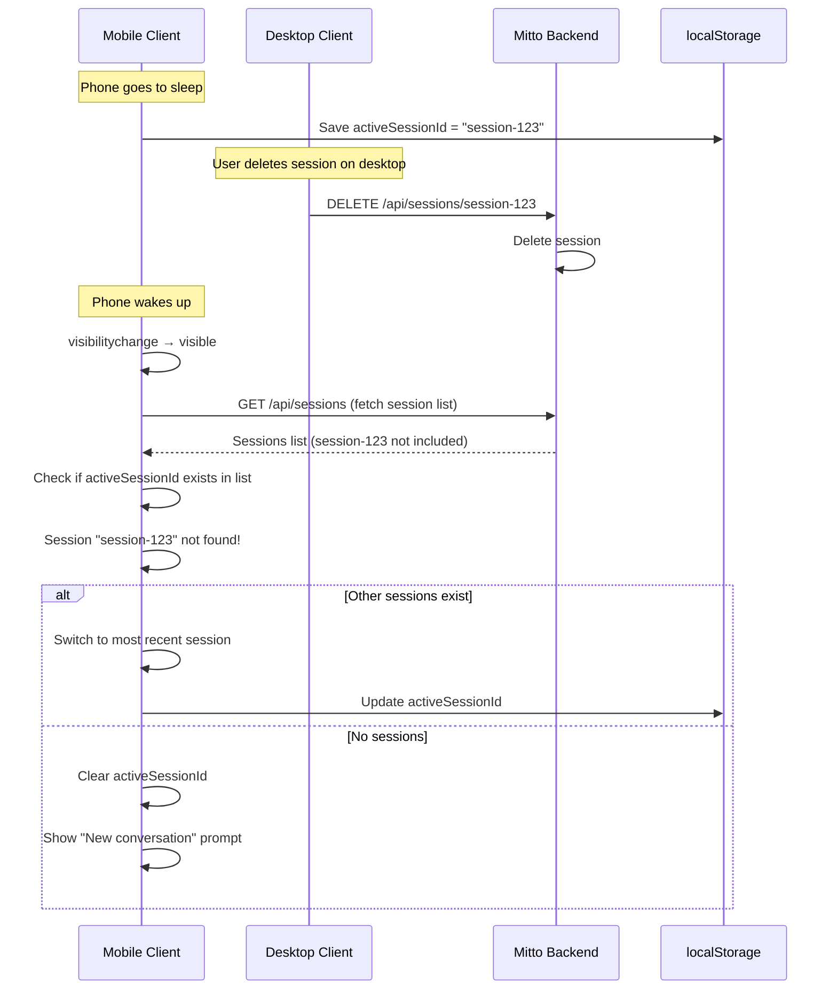

## Agent Response as Implicit ACK

As a fallback, if the agent starts responding (with `agent_message` or `agent_thought`), any pending sends for that session are automatically resolved:

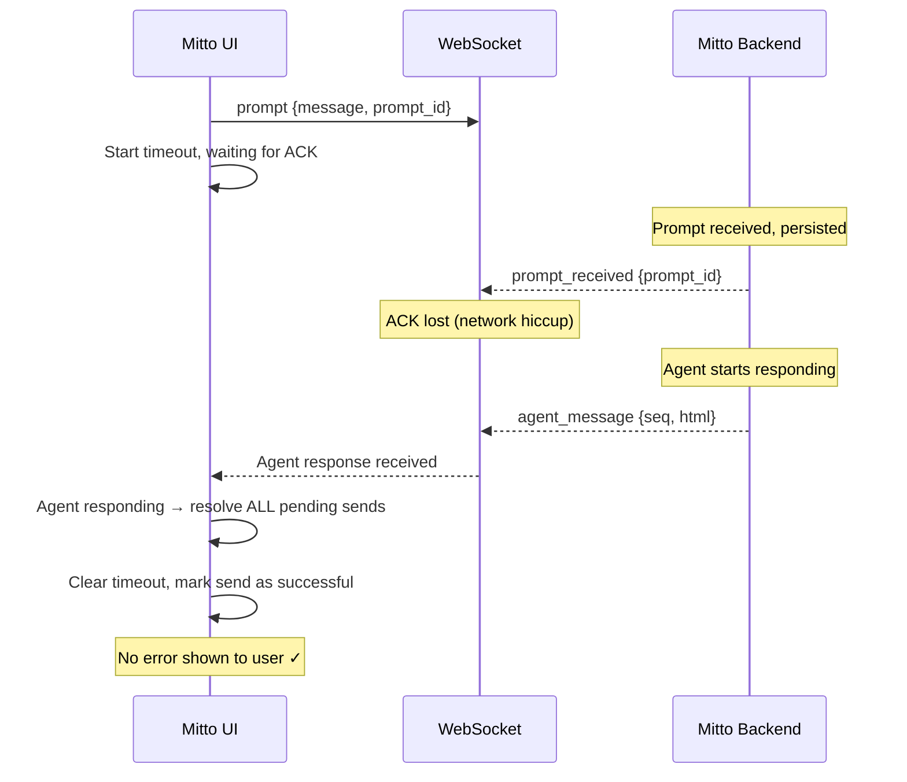
