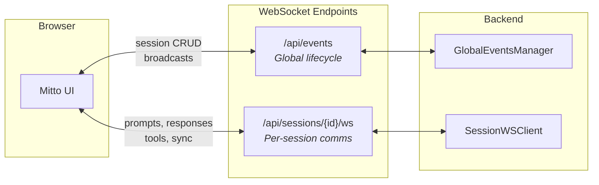
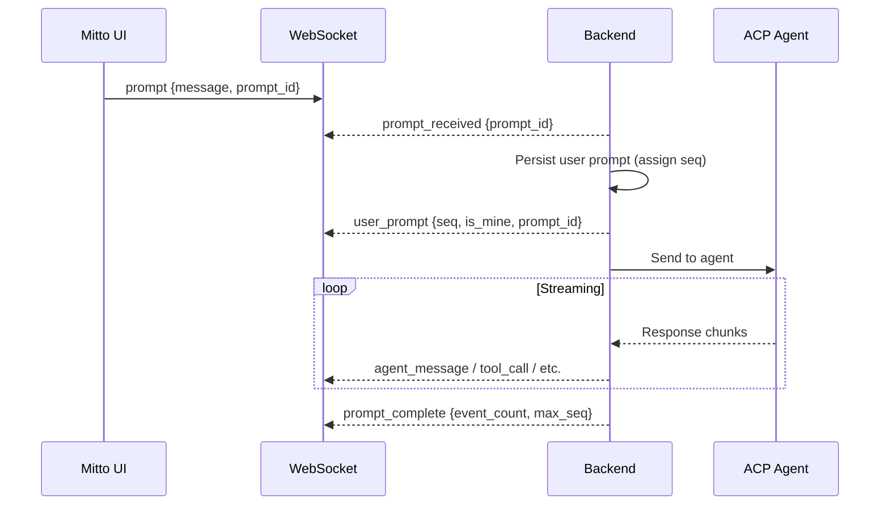
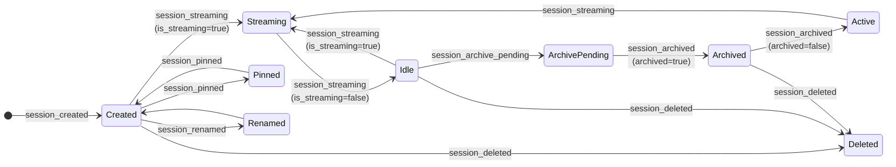

# WebSocket Protocol Specification

This document defines all WebSocket message types and formats used for real-time communication
between the Mitto frontend and backend. It covers both WebSocket endpoints.

## Related Documentation

- [Sequence Numbers](./sequence-numbers.md) — Ordering and deduplication
- [Synchronization](./synchronization.md) — Reconnection and sync
- [Communication Flows](./communication-flows.md) — Complete interaction flows

---

## Endpoints

Mitto uses two WebSocket endpoints with distinct responsibilities:



| Endpoint                | Handler              | Purpose                                               |
| ----------------------- | -------------------- | ----------------------------------------------------- |
| `/api/events`           | `GlobalEventsClient` | Session lifecycle events (created, deleted, renamed)  |
| `/api/sessions/{id}/ws` | `SessionWSClient`    | Per-session communication (prompts, responses, tools) |

This separation allows:

- Global events to be broadcast to all connected clients
- Per-session events to be scoped to interested clients only
- Sessions to continue running when no clients are connected

---

## Message Envelope

All WebSocket messages use a JSON envelope:

```json
{
  "type": "message_type",
  "data": { ... }
}
```

---

## Frontend → Backend Messages

These messages are sent from the browser to the server on the **session WebSocket**.

### `prompt` — Send user message

```json
{
  "type": "prompt",
  "data": {
    "message": "Fix the login bug",
    "image_ids": ["img_abc123"],
    "prompt_id": "p-1738396800-xyz"
  }
}
```

| Field       | Type     | Required | Description                                   |
| ----------- | -------- | -------- | --------------------------------------------- |
| `message`   | string   | Yes      | User message text                             |
| `image_ids` | string[] | No       | Attached image IDs                            |
| `prompt_id` | string   | No       | Client-generated ID for delivery verification |

### `cancel` — Cancel agent operation

```json
{ "type": "cancel", "data": {} }
```

### `force_reset` — Forcefully reset stuck session

Used when the agent is unresponsive and `cancel` doesn't work. Resets the `isPrompting` flag
so new prompts can be sent.

```json
{ "type": "force_reset", "data": {} }
```

### `load_events` — Load events (initial, pagination, sync)

Unified message type for all event loading. Parameters are mutually exclusive.

```json
// Initial load
{ "type": "load_events", "data": { "limit": 50 } }

// Load older events (pagination)
{ "type": "load_events", "data": { "limit": 50, "before_seq": 50 } }

// Sync after reconnect
{ "type": "load_events", "data": { "after_seq": 42 } }
```

| Field        | Type  | Description                                      |
| ------------ | ----- | ------------------------------------------------ |
| `limit`      | int   | Maximum events to return (default: 50, max: 500) |
| `before_seq` | int64 | Load events with seq < value (pagination)        |
| `after_seq`  | int64 | Load events with seq > value (sync)              |

> **Note:** `before_seq` and `after_seq` are mutually exclusive.

### `keepalive` — Connection health check

Application-level keepalive for zombie detection and state sync.

```json
{
  "type": "keepalive",
  "data": {
    "client_time": 1738396800000,
    "last_seen_seq": 42
  }
}
```

| Field           | Type  | Description                             |
| --------------- | ----- | --------------------------------------- |
| `client_time`   | int64 | Unix timestamp in milliseconds          |
| `last_seen_seq` | int64 | Highest sequence number client has seen |

### `ui_prompt_answer` — Respond to UI prompt

Sent when the user responds to a `ui_prompt` (MCP questions, permissions, follow-up actions).

```json
{
  "type": "ui_prompt_answer",
  "data": {
    "request_id": "unique-id",
    "option_id": "allow_once",
    "label": "Allow"
  }
}
```

### `rename_session` — Rename the current session

```json
{ "type": "rename_session", "data": { "name": "My session" } }
```

### `set_config_option` — Change session config option

```json
{
  "type": "set_config_option",
  "data": { "config_id": "mode", "value": "plan" }
}
```

### `run_mcp_install_command` — Execute MCP installation

Sent from frontend when user confirms running a suggested MCP installation command.

```json
{ "type": "run_mcp_install_command", "data": { "command": "npx install-mcp" } }
```

### `permission_answer` — ⚠️ Legacy

> **Deprecated.** Use `ui_prompt_answer` instead.

```json
{
  "type": "permission_answer",
  "data": { "request_id": "id", "approved": true }
}
```

---

## Backend → Frontend Messages (Session WebSocket)

These messages are sent on the `/api/sessions/{id}/ws` endpoint.

### Connection & Session Lifecycle

#### `connected` — Connection established

Sent immediately after WebSocket upgrade. Includes last prompt info for delivery verification.

```json
{
  "type": "connected",
  "data": {
    "session_id": "20260201-120000-abc12345",
    "client_id": "ws-client-1",
    "acp_server": "auggie",
    "is_running": true,
    "is_prompting": false,
    "last_user_prompt_id": "p-1738396800-xyz",
    "last_user_prompt_seq": 42
  }
}
```

| Field                  | Type   | Description                                      |
| ---------------------- | ------ | ------------------------------------------------ |
| `session_id`           | string | Session identifier                               |
| `client_id`            | string | Unique ID for this WebSocket client              |
| `acp_server`           | string | ACP server name                                  |
| `is_running`           | bool   | Whether ACP process is active                    |
| `is_prompting`         | bool   | Whether agent is currently responding            |
| `last_user_prompt_id`  | string | Last prompt ID (for delivery verification)       |
| `last_user_prompt_seq` | int64  | Last prompt sequence (for delivery verification) |

#### `session_gone` — Terminal: session no longer exists

**Terminal signal** — client **MUST** stop all reconnection attempts for this session.

```json
{
  "type": "session_gone",
  "data": {
    "session_id": "01JNPKPC01SJYTSE3EYMW5J26R",
    "reason": "session not found"
  }
}
```

**When sent:**

- During WebSocket connection setup, if session is not in memory and not in store
- During `load_events`, if the store returns `ErrSessionNotFound`
- On negative cache hit (session previously determined to not exist, within 30s TTL)

**Not sent for:**

- Archived sessions (these load normally in read-only mode)
- Temporary errors (store unavailable, transient failures)

**Client behavior:** See [Synchronization — Circuit Breaker](./synchronization.md#circuit-breaker-terminal-session-errors).

#### `session_reset` — Session was forcefully reset

Sent after a `force_reset` message is processed.

```json
{ "type": "session_reset", "data": { "session_id": "..." } }
```

#### `session_renamed` — Session name changed

```json
{
  "type": "session_renamed",
  "data": { "session_id": "...", "name": "New Name" }
}
```

#### `acp_stopped` — ACP connection stopped

Sent when the ACP process is gracefully terminated (e.g., session archived).

```json
{ "type": "acp_stopped", "data": { "session_id": "...", "reason": "archived" } }
```

#### `acp_started` — ACP connection started

Sent when the ACP process is started (e.g., session unarchived).

```json
{ "type": "acp_started", "data": { "session_id": "..." } }
```

#### `acp_start_failed` — ACP process failed to start

```json
{
  "type": "acp_start_failed",
  "data": {
    "session_id": "...",
    "error": "command not found",
    "command": "auggie --acp"
  }
}
```

#### `acp_error_permanent` — Permanent ACP error

Non-retryable error with actionable user guidance.

```json
{
  "type": "acp_error_permanent",
  "data": {
    "session_id": "...",
    "error": "API key expired",
    "resolution": "Update your API key in settings",
    "command": "auggie --acp"
  }
}
```

### Streaming Events

All streaming events include `seq` and `max_seq` for ordering and gap detection.

#### `agent_message` — Agent response (HTML)

```json
{
  "type": "agent_message",
  "data": {
    "seq": 52,
    "max_seq": 52,
    "html": "<p>Here's the fix...</p>",
    "is_prompting": true
  }
}
```

#### `agent_thought` — Agent thinking/reasoning

```json
{
  "type": "agent_thought",
  "data": {
    "seq": 53,
    "max_seq": 53,
    "text": "Let me analyze the code...",
    "is_prompting": true
  }
}
```

#### `tool_call` — Tool invocation

```json
{
  "type": "tool_call",
  "data": {
    "seq": 54,
    "max_seq": 54,
    "id": "tc_1",
    "title": "Read file",
    "status": "running",
    "is_prompting": true
  }
}
```

#### `tool_update` — Tool status update

```json
{
  "type": "tool_update",
  "data": {
    "seq": 54,
    "max_seq": 55,
    "id": "tc_1",
    "status": "completed",
    "is_prompting": true
  }
}
```

#### `plan` — Agent task plan

```json
{
  "type": "plan",
  "data": {
    "seq": 56,
    "max_seq": 56,
    "entries": [{ "title": "Fix bug", "status": "in_progress" }],
    "is_prompting": true
  }
}
```

#### `file_read` / `file_write` — File operations

```json
{
  "type": "file_write",
  "data": { "seq": 57, "max_seq": 57, "path": "src/main.go", "size": 1024 }
}
```

### Prompt Lifecycle



#### `prompt_received` — Prompt acknowledged

```json
{ "type": "prompt_received", "data": { "prompt_id": "p-1738396800-xyz" } }
```

#### `user_prompt` — User prompt broadcast

Broadcast to all clients on the session. The sender sees `is_mine: true`.

```json
{
  "type": "user_prompt",
  "data": {
    "seq": 51,
    "max_seq": 51,
    "sender_id": "ws-client-1",
    "prompt_id": "p-1738396800-xyz",
    "message": "Fix the login bug",
    "is_mine": true
  }
}
```

#### `prompt_complete` — Agent finished responding

```json
{
  "type": "prompt_complete",
  "data": { "event_count": 10, "max_seq": 60 }
}
```

### Event Loading

#### `events_loaded` — Response to `load_events`

```json
{
  "type": "events_loaded",
  "data": {
    "events": [{ "type": "agent_message", "seq": 1, ... }],
    "has_more": true,
    "first_seq": 1,
    "last_seq": 50,
    "max_seq": 100,
    "total_count": 100,
    "prepend": false,
    "is_prompting": true
  }
}
```

| Field          | Type  | Description                                      |
| -------------- | ----- | ------------------------------------------------ |
| `events`       | array | Array of event objects                           |
| `has_more`     | bool  | Whether more events exist beyond this batch      |
| `first_seq`    | int64 | Lowest seq in returned events                    |
| `last_seq`     | int64 | Highest seq in returned events                   |
| `max_seq`      | int64 | Highest seq in the entire session                |
| `total_count`  | int   | Total events in session                          |
| `prepend`      | bool  | True if these are older events (for "Load More") |
| `is_prompting` | bool  | Whether agent is currently responding            |

#### Event Types in `events_loaded`

| Event Type      | Description                                        |
| --------------- | -------------------------------------------------- |
| `user_prompt`   | User message                                       |
| `agent_message` | Agent response (HTML)                              |
| `agent_thought` | Agent thinking/reasoning                           |
| `tool_call`     | Tool invocation                                    |
| `tool_update`   | Tool status update                                 |
| `file_read`     | File read operation                                |
| `file_write`    | File write operation                               |
| `plan`          | Agent plan                                         |
| `session_end`   | Session completion record (internal, not streamed) |

### Keepalive & State Sync

#### `keepalive_ack` — Health check response

```json
{
  "type": "keepalive_ack",
  "data": {
    "client_time": 1738396800000,
    "server_time": 1738396800050,
    "max_seq": 60,
    "is_prompting": true,
    "is_running": true,
    "queue_length": 2,
    "status": "active"
  }
}
```

| Field          | Type   | Description                                    |
| -------------- | ------ | ---------------------------------------------- |
| `client_time`  | int64  | Echo of client time for RTT calculation        |
| `server_time`  | int64  | Server timestamp                               |
| `max_seq`      | int64  | Highest seq on server (for gap detection)      |
| `is_prompting` | bool   | Whether agent is currently responding          |
| `is_running`   | bool   | Whether ACP process is active                  |
| `queue_length` | int    | Messages waiting in queue (multi-tab sync)     |
| `status`       | string | Session status: `active`, `completed`, `error` |

### Interactive Prompts

#### `ui_prompt` — Display interactive prompt

Unified system for all interactive prompts (MCP tool questions, permissions, follow-up actions).

```json
{
  "type": "ui_prompt",
  "data": {
    "request_id": "unique-id",
    "prompt_type": "permission",
    "question": "Permission requested",
    "title": "Run: npm install",
    "options": [
      {
        "id": "allow_once",
        "label": "Allow",
        "kind": "allow_once",
        "style": "success"
      },
      {
        "id": "reject_once",
        "label": "Deny",
        "kind": "reject_once",
        "style": "danger"
      }
    ],
    "timeout_seconds": 300,
    "blocking": true,
    "tool_call_id": "tool-123"
  }
}
```

##### Prompt Types

| Type              | Source          | Blocking | Description                                |
| ----------------- | --------------- | -------- | ------------------------------------------ |
| `yes_no`          | MCP tools       | Yes      | Two-button yes/no question                 |
| `options_buttons` | MCP tools       | Yes      | Multiple choice buttons (max 4)            |
| `select`          | MCP tools       | Yes      | Dropdown selection (max 10 options)        |
| `permission`      | ACP agent       | Yes      | Permission request (allow/deny commands)   |
| `action_buttons`  | Follow-up hints | No       | Suggested follow-up prompts (non-blocking) |

##### Option Properties

| Property | Type   | Description                                            |
| -------- | ------ | ------------------------------------------------------ |
| `id`     | string | Machine-readable identifier returned in response       |
| `label`  | string | Human-readable button text                             |
| `kind`   | string | Semantic meaning (permission: allow_once, reject_once) |
| `style`  | string | Visual style: primary, secondary, success, danger      |

#### `ui_prompt_dismiss` — Dismiss active prompt

```json
{
  "type": "ui_prompt_dismiss",
  "data": {
    "session_id": "...",
    "request_id": "unique-id",
    "reason": "timeout"
  }
}
```

Reason values: `timeout`, `cancelled`, `replaced`.

### Notifications

#### `action_buttons` — Follow-up suggestions

Sent asynchronously after `prompt_complete` when follow-up suggestions are enabled.

```json
{
  "type": "action_buttons",
  "data": {
    "session_id": "...",
    "buttons": [
      { "label": "Run the tests", "response": "Please run the test suite" },
      { "label": "Deploy to staging", "response": "Deploy this to staging" }
    ]
  }
}
```

#### `available_commands_updated` — Slash commands

```json
{
  "type": "available_commands_updated",
  "data": {
    "session_id": "...",
    "commands": [
      { "name": "/help", "description": "Show help", "input_hint": "" }
    ]
  }
}
```

#### `config_option_changed` — Config option changed

```json
{
  "type": "config_option_changed",
  "data": { "session_id": "...", "config_id": "mode", "value": "plan" }
}
```

#### `error` — Error notification

```json
{
  "type": "error",
  "data": { "message": "Agent error occurred", "code": "agent_error" }
}
```

#### `runner_fallback` — Runner fell back to exec

```json
{
  "type": "runner_fallback",
  "data": {
    "session_id": "...",
    "requested_type": "docker",
    "fallback_type": "exec",
    "reason": "Docker not available"
  }
}
```

#### `hook_failed` — Lifecycle hook failed

```json
{
  "type": "hook_failed",
  "data": {
    "name": "on-session-start",
    "exit_code": 1,
    "error": "Script not found"
  }
}
```

#### `mcp_tools_unavailable` — MCP tools not available

```json
{
  "type": "mcp_tools_unavailable",
  "data": {
    "session_id": "...",
    "suggested_command": "npx install-mcp",
    "suggested_instructions": "Run the command above to install MCP tools"
  }
}
```

### Queue Messages

See [Message Queue](../message-queue.md) for the full queue system documentation.

#### `queue_updated` — Queue state changed

```json
{
  "type": "queue_updated",
  "data": {
    "session_id": "...",
    "queue_length": 3,
    "action": "added",
    "message_id": "q-123"
  }
}
```

Action values: `added`, `removed`, `cleared`.

#### `queue_message_sending` / `queue_message_sent` — Delivery lifecycle

```json
{ "type": "queue_message_sending", "data": { "message_id": "q-123" } }
{ "type": "queue_message_sent", "data": { "message_id": "q-123" } }
```

#### `queue_message_titled` — Title generated

```json
{
  "type": "queue_message_titled",
  "data": {
    "session_id": "...",
    "message_id": "q-123",
    "title": "Login Bug Fix"
  }
}
```

#### `queue_reordered` — Queue order changed

```json
{
  "type": "queue_reordered",
  "data": { "session_id": "...", "messages": [{"id": "q-1", ...}, {"id": "q-2", ...}] }
}
```

### Legacy Messages

| Type                | Replacement                                  |
| ------------------- | -------------------------------------------- |
| `permission`        | `ui_prompt` with `prompt_type: "permission"` |
| `permission_answer` | `ui_prompt_answer`                           |
| `sync_session`      | `load_events` with `after_seq`               |
| `session_sync`      | `events_loaded`                              |

---

## Backend → Frontend Messages (Global Events WebSocket)

These messages are sent on the `/api/events` endpoint to all connected clients.

### `connected` — Global events ready

```json
{ "type": "connected", "data": { "acp_server": "auggie" } }
```

### Session Lifecycle Events



#### `session_created`

```json
{
  "type": "session_created",
  "data": {
    "session_id": "...",
    "name": "New Session",
    "working_dir": "/project"
  }
}
```

#### `session_deleted`

```json
{ "type": "session_deleted", "data": { "session_id": "..." } }
```

#### `session_renamed`

```json
{
  "type": "session_renamed",
  "data": { "session_id": "...", "name": "Better Name" }
}
```

#### `session_pinned`

```json
{ "type": "session_pinned", "data": { "session_id": "...", "pinned": true } }
```

#### `session_archived` / `session_archive_pending`

```json
{ "type": "session_archive_pending", "data": { "session_id": "..." } }
{ "type": "session_archived", "data": { "session_id": "...", "archived": true } }
```

#### `session_streaming`

```json
{
  "type": "session_streaming",
  "data": { "session_id": "...", "is_streaming": true }
}
```

#### `session_settings_updated`

```json
{
  "type": "session_settings_updated",
  "data": { "session_id": "...", "settings": { "can_do_introspection": true } }
}
```

### Periodic Prompt Events

#### `periodic_updated`

```json
{
  "type": "periodic_updated",
  "data": {
    "session_id": "...",
    "session_name": "Daily Report",
    "periodic_enabled": true,
    "periodic_frequency": "daily",
    "next_scheduled_at": "2026-02-01T09:00:00Z"
  }
}
```

#### `periodic_started`

```json
{
  "type": "periodic_started",
  "data": { "session_id": "...", "session_name": "Daily Report" }
}
```

### ACP Process Events

#### `acp_started` / `acp_start_failed`

```json
{ "type": "acp_started", "data": { "session_id": "..." } }
{ "type": "acp_start_failed", "data": { "session_id": "...", "error": "...", "command": "..." } }
```

### Other Global Events

#### `hook_failed`

```json
{
  "type": "hook_failed",
  "data": { "name": "on-session-start", "exit_code": 1, "error": "..." }
}
```

#### `prompts_changed`

```json
{
  "type": "prompts_changed",
  "data": {
    "changed_dirs": ["/project/.mitto/prompts"],
    "timestamp": "2026-02-01T12:00:00Z"
  }
}
```

---

## Key Field Descriptions

### Sequence Number Fields

- **`seq`**: Monotonically increasing sequence number assigned when event is received from ACP.
  See [Sequence Numbers](./sequence-numbers.md) for details.
- **`max_seq`**: Highest sequence number the server has for this session.
  Enables immediate gap detection — see [Synchronization](./synchronization.md#immediate-gap-detection-max_seq-piggybacking).

### Delivery Verification Fields

The `connected` message includes fields for verifying delivery of pending prompts after
reconnecting from a zombie connection:

- **`last_user_prompt_id`**: ID of the last user prompt in the session
- **`last_user_prompt_seq`**: Sequence number of the last user prompt
