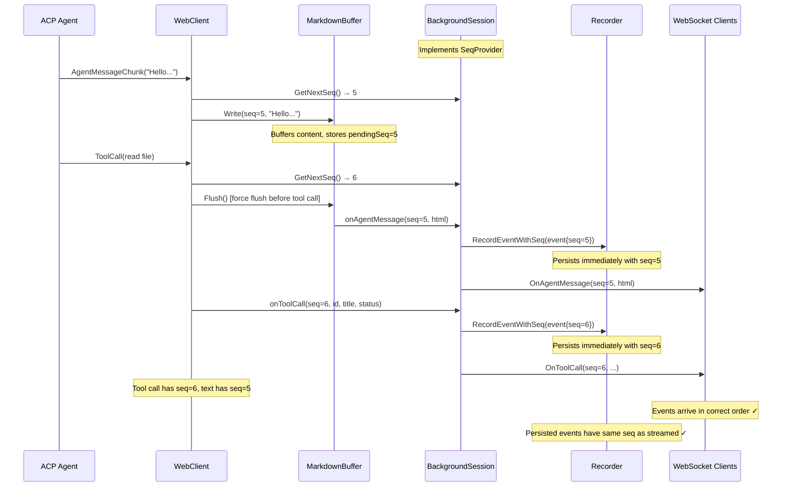

# Sequence Number Management

This document covers sequence number assignment, ordering guarantees, and the formal contract between frontend and backend.

## Related Documentation

- [Protocol Specification](./protocol-spec.md) - Message types and formats
- [Synchronization](./synchronization.md) - Reconnection and sync
- [Communication Flows](./communication-flows.md) - Complete interaction flows

## Overview

Message ordering is critical for ensuring all clients display conversations correctly. The system uses **immediate persistence** with **sequence numbers** for tracking and ordering.

### Immediate Persistence

Events are persisted **immediately** when received from ACP, not buffered for later persistence. This ensures:

- **Consistent seq numbers**: Streaming and persisted events have identical `seq` values
- **Crash resilience**: No data loss window (events are on disk immediately)
- **Simpler architecture**: No periodic persistence timers or buffer management
- **Correct reconnection**: Clients can sync from persisted events with matching seq values

## Sequence Number Assignment

Every event is assigned a monotonically increasing sequence number (`seq`) **when it is received from the ACP**, not at persistence time or when content is emitted from buffers. This ensures streaming and persisted events have the same `seq`, enabling proper deduplication and ordering across WebSocket reconnections.

**Key properties:**

- `seq` starts at 1 for each session
- `seq` is assigned immediately when the event is received from ACP (in `WebClient.SessionUpdate()`)
- `seq` is passed through the `MarkdownBuffer` for agent messages (preserving receive-time ordering)
- `seq` is included in WebSocket messages to observers
- `seq` is preserved when events are persisted to `events.jsonl`
- `seq` is never reused or reassigned
- For coalescing events (agent messages, thoughts), multiple chunks share the same `seq`

## SeqProvider Interface

The `WebClient` uses a `SeqProvider` interface to obtain sequence numbers. `BackgroundSession` implements this interface:

```go
// SeqProvider provides sequence numbers for event ordering.
type SeqProvider interface {
    GetNextSeq() int64
}

// BackgroundSession implements SeqProvider
func (bs *BackgroundSession) GetNextSeq() int64 {
    return bs.getNextSeq()
}
```

This decoupling allows `WebClient` to assign seq at ACP receive time while `BackgroundSession` manages the sequence counter.

## Why Assign at Receive Time?

1. **Correct ordering with buffered content**: Agent messages are buffered in `MarkdownBuffer` for markdown rendering. If seq were assigned when the buffer flushes, tool calls could "leapfrog" text that was received earlier but buffered.

2. **Streaming and sync use same seq**: Clients can deduplicate by `(session_id, seq)`

3. **Correct ordering after reconnect**: Sort by `seq` gives correct order

4. **No race conditions**: Seq is assigned once, upfront, before any buffering or notification

## Sequence Number Flow



## MarkdownBuffer Seq Tracking

The `MarkdownBuffer` tracks the sequence number for buffered content:

```go
// Write accepts seq when content is received
func (mb *MarkdownBuffer) Write(seq int64, chunk string) {
    // First chunk's seq becomes pendingSeq
    if mb.buffer.Len() == 0 {
        mb.pendingSeq = seq
    }
    // ... buffer content ...
}

// Flush passes the preserved seq to callback
func (mb *MarkdownBuffer) flushLocked() {
    seq := mb.pendingSeq  // Capture before reset
    mb.pendingSeq = 0
    // ... convert to HTML ...
    mb.onFlush(seq, htmlStr)
}
```

This ensures that even if multiple text chunks are buffered together, the seq from the first chunk is preserved and used when the content is eventually flushed.

## Sequence Number Contract

### Server is Always Right

**Critical Principle**: The server is the single source of truth for sequence numbers. When there's a mismatch between client and server state, **the server always wins**.

This is essential because mobile clients can have stale state due to:

- Phone sleeping while in background
- Network disconnection and reconnection
- Server restart while client was offline
- Browser tab restoration with cached state

When the client detects `clientLastSeq > serverLastSeq`, it must:

1. Discard its messages and use the server's data
2. Reset its sequence tracking to the server's values
3. Auto-load any remaining messages if `hasMore=true`

**Never** try to "fix" the server based on client state.

### Contract Summary

| Property                  | Guarantee                                                                 |
| ------------------------- | ------------------------------------------------------------------------- |
| **Server Authority**      | Server's sequence numbers are authoritative; client defers on mismatch    |
| **Uniqueness**            | Each event in a session has a unique `seq` (except coalescing chunks)     |
| **Monotonicity**          | `seq` values are strictly increasing within a session                     |
| **Assignment Time**       | `seq` is assigned when the event is received from ACP, not at persistence |
| **Immediate Persistence** | Events are persisted immediately with their pre-assigned `seq` values     |
| **Coalescing**            | Multiple chunks of the same logical message share the same `seq`          |
| **No Gaps**               | `seq` values are contiguous (1, 2, 3, ...) with no gaps                   |
| **No Reuse**              | Once assigned, a `seq` is never reused or reassigned                      |

### Backend Responsibilities

1. **Assign seq at receive time**: The `WebClient.SessionUpdate()` method assigns `seq` immediately when an event is received from ACP, before any buffering or processing.

2. **Preserve seq through buffers**: The `MarkdownBuffer` stores `pendingSeq` from the first chunk and passes it to the flush callback.

3. **Persist immediately**: `BackgroundSession` calls `Recorder.RecordEventWithSeq()` immediately after receiving each event, preserving the pre-assigned `seq`.

4. **Track lastSentSeq per client**: Each `SessionWSClient` tracks the highest `seq` sent to prevent duplicates.

5. **Sync missed events on observer registration**: When a client is registered as an observer after loading events, the server checks for events that were persisted between the load and registration (H2 fix).

6. **Track MaxSeq in metadata**: The `Metadata.MaxSeq` field tracks the highest persisted sequence number for client synchronization.

### Frontend Responsibilities

1. **Calculate lastSeenSeq dynamically from messages**: The frontend calculates `lastSeenSeq` dynamically from messages in state using `getMaxSeq()`, avoiding stale localStorage issues (especially in WKWebView):

   ```javascript
   // Calculate lastSeenSeq from messages in state (not localStorage)
   import { getMaxSeq } from "../lib.js";

   const sessionMessages = sessionsRef.current[sessionId]?.messages || [];
   const lastSeenSeq = getMaxSeq(sessionMessages);
   ```

2. **Client-side deduplication by seq**: The frontend tracks seen `seq` values and skips duplicates (M1 fix):

   ```javascript
   // Track seen seqs per session
   const seenSeqsRef = useRef({});

   // Check before processing an event
   if (isSeqDuplicate(sessionId, msgSeq, lastMessageSeq)) {
     return; // Skip duplicate
   }

   // Mark as seen after processing
   markSeqSeen(sessionId, msgSeq);
   ```

3. **Allow same-seq for coalescing**: When checking for duplicates, allow the same `seq` as the last message (for streaming continuation):

   ```javascript
   // Allow same seq as last message (coalescing/continuation)
   if (lastMessageSeq && seq === lastMessageSeq) return false;
   ```

4. **Request sync with lastSeenSeq**: On reconnection, request events after the stored `lastSeenSeq`:

   ```javascript
   ws.send(
     JSON.stringify({
       type: "load_events",
       data: { after_seq: lastSeenSeq },
     }),
   );
   ```

5. **Merge with deduplication on sync**: Use `mergeMessagesWithSync()` to handle overlapping events after reconnection.

## Event Type Ordering Guarantees

The system guarantees correct ordering for **all event types**, not just agent messages. The `StreamBuffer` wraps the `MarkdownBuffer` and handles buffering of non-markdown events when they arrive mid-block (list, table, code block).

| Event Type          | Buffered?            | Behavior                              | Seq Assignment                            |
| ------------------- | -------------------- | ------------------------------------- | ----------------------------------------- |
| `AgentMessageChunk` | Yes (MarkdownBuffer) | Buffered until block completes        | At receive time, preserved through buffer |
| `AgentThoughtChunk` | Conditional          | Buffered if mid-block, else immediate | At receive time                           |
| `ToolCall`          | Conditional          | Buffered if mid-block, else immediate | At receive time                           |
| `ToolCallUpdate`    | Conditional          | Buffered if mid-block, else immediate | At receive time                           |
| `Plan`              | Conditional          | Buffered if mid-block, else immediate | At receive time                           |
| `FileRead`          | No                   | Immediate                             | At receive time                           |
| `FileWrite`         | No                   | Immediate                             | At receive time                           |

**Key ordering guarantees:**

1. **Non-markdown events don't break lists/tables/code blocks**: When a `ToolCall`, `AgentThoughtChunk`, or `Plan` arrives while we're in the middle of a markdown block (list, table, or code block), the event is **buffered** and emitted after the block completes.

2. **Non-markdown events flush paragraphs**: When a non-markdown event arrives and we're NOT in a block (just a paragraph), the paragraph is flushed and the event is emitted immediately.

3. **Sequence numbers are strictly increasing**: Each event gets a unique, monotonically increasing seq. Events emitted later always have higher seq values.

4. **Buffered content preserves first seq**: When multiple markdown chunks are buffered together, the seq from the first chunk is used when the content is flushed.

## Block Detection

The system detects when content is inside a markdown block that shouldn't be interrupted:

| Block Type        | Start Detection                     | End Detection               |
| ----------------- | ----------------------------------- | --------------------------- |
| **Numbered List** | Line starts with `1. `, `2. `, etc. | Double newline (empty line) |
| **Bullet List**   | Line starts with `- `, `* `, `+ `   | Double newline (empty line) |
| **Table**         | Line contains `\|` pipe character   | Double newline (empty line) |
| **Code Block**    | Line starts with ` ``` `            | Closing ` ``` `             |

When an event arrives while in a block, it is added to a pending queue. The queue is flushed when:

1. The markdown block ends (detected by double newline or closing fence)
2. `Flush()` is called explicitly (at end of agent response)

## Inline Formatting Protection

The system protects against flushing content with unmatched inline formatting markers (`**`, `` ` ``). The `HasUnmatchedInlineFormatting()` function counts formatting markers and returns true if they're unbalanced. This check is applied:

1. **Soft timeout flush**: Won't flush if formatting is unmatched
2. **Inactivity timeout flush**: Won't flush if formatting is unmatched
3. **Size-based flush**: Won't flush if formatting is unmatched
4. **SafeFlush()**: Won't flush if formatting is unmatched

## Edge Cases and Fixes

### H1: Stale lastSeenSeq (Historical - Now Fixed)

**Problem**: Previously, `lastSeenSeq` was stored in localStorage and could become stale if the client disconnected during streaming.

**Fix**: The frontend now calculates `lastSeenSeq` dynamically from messages in React state using `getMaxSeq()`.

### H2: Observer Registration Race

**Problem**: Events could be missed between loading events from storage and being registered as an observer.

**Fix**: After registering as an observer, the server checks for events that were persisted between the load and registration, and sends them to the client.

### M1: Client-Side Deduplication

**Problem**: Despite server-side deduplication, edge cases could still result in duplicate events reaching the frontend.

**Fix**: The frontend tracks seen `seq` values in a sliding window and skips duplicates.

**Stale Client Reset (M1 fix)**: When `isStaleClient` is detected in `events_loaded` (i.e., `clientLastSeq > serverLastSeq`), the seq tracker MUST be reset BEFORE processing events.

## Testing the Contract

The following tests verify the sequence number contract:

1. **`TestEventBuffer_OutOfOrderSeqPreserved`**: Verifies that out-of-order events preserve their assigned seq values.

2. **`TestEventBuffer_CoalescingPreservesFirstSeq`**: Verifies that coalescing preserves the first chunk's seq.

3. **`TestReconnectDuringAgentStreaming`**: Verifies that reconnection during streaming correctly syncs missed events.

4. **`TestStaleSeqSync`**: Verifies that syncing with a stale seq correctly retrieves missed events.

5. **`TestMultipleClientsSeeSameEvents`**: Verifies that multiple clients receive the same events with the same seq values.
